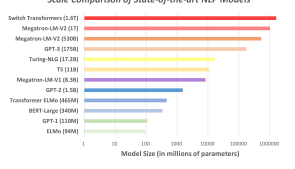
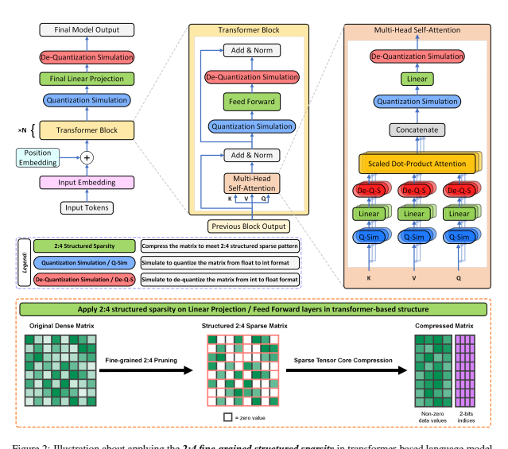
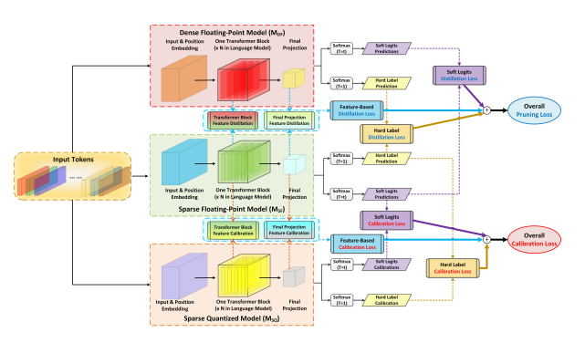
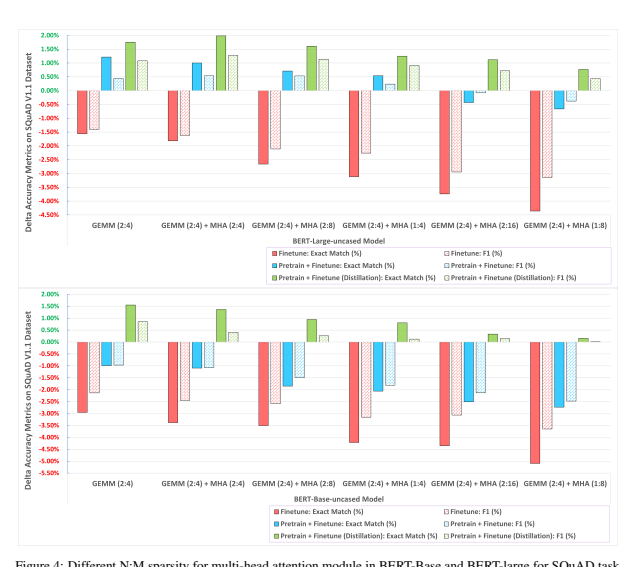
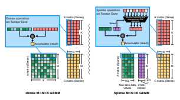
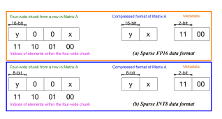
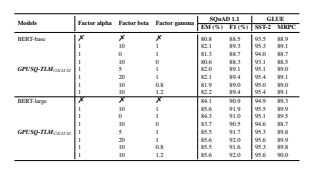

## Boost Transformer-Based Language Models With Gpu-Friendly Sparsity And Quantization

Chong Yu1, Tao Chen2,∗**, Zhongxue Gan**1,∗
1Academy for Engineering and Technology, Fudan University 2School for Information Science and Technology, Fudan University 21110860050@m.fudan.edu.cn, {eetchen, ganzhongxue}@fudan.edu.cn

## Abstract

Along with the performance improvement in NLP domain, the sizes of transformer-based language models (TLM) are also dramatically increased. Some prior works intend to compress TLM models into more compact forms, but do not fully consider the hardware characters may not support the efficient execution for these forms, leading to the deployment of TLM
on hardware with noticeable acceleration is still challenging. This paper thoroughly designs a compression scheme named **GPUSQ-TLM** to maximally utilize the *GPU-friendly 2:4 finegrained structured sparsity and quantization* characters. Especially, a dense TLM model is first pruned to meet the GPU's acceleration constraint of sparse patterns with FP16 type, then it is further quantized into a fixed-point one by quantization-aware training, to provide an extra speedup for integer tensors on GPU. A mixedstrategy knowledge distillation of labels, logits and feature maps is used for best accuracy compensation during pruning and quantization process. Experiment results show **GPUSQ-TLM**
scheme achieves state-of-the-art compression on TLM model of various encoder and decoder blocks with negligible accuracy degradation on SQuAD, GLUE, CNN-DM & XSum and WikiText benchmarking tasks. Moreover, GPUSQ-TLM can boost actual deployment performance by up to **4.08-4.25**× times latency and **6.18-6.79**× throughput on A100 GPU.

## 1 Introduction

Equipped with the attention mechanism and architecture (Vaswani et al., 2017), the transformerbased language models (TLM) are proficient in handling long-range dependencies of the sequence inputs. The subsequent studies showed that transformer-based pre-trained language models (Devlin et al., 2019; Radford et al., 2018)
could achieve state-of-the-art performances on various natural language processing (NLP) (Wolf
∗ Tao Chen and Zhongxue Gan are corresponding authors.

et al., 2019) benchmarks, including question answering (Rajpurkar et al., 2016), paraphrase detection (Dolan and Brockett, 2005), sentiment analysis (Socher et al., 2013), natural language inference (Bowman et al., 2015), and text classification (Howard and Ruder, 2018), etc. Meanwhile, the transformer-based structure also expanded its success to other disciplines like computer vision (Carion et al., 2020; Dosovitskiy et al., 2020), music (Huang et al., 2018), chemistry (Schwaller et al., 2019), life sciences (Rives et al., 2021), and pharmaceutics (Yang et al., 2021).

Along with the performance improvement, transformer-based language models' scales are also dramatically increased. BERT model (Devlin et al.,
2019) sets the milestone for pre-trained language models with transformer encoder as its backbone.

It has 340 million parameters for the large version.

Generative Pre-trained Transformer (GPT) series are dedicated to scaling pre-trained transformer decoder architecture and proved that a large-scale pretrained language model could achieve impressive few-shot performance with diverse downstream tasks. The parameters scale increases from 110 million of GPT-1 (Radford et al., 2018) to 1.5 billion of GPT-2 (Radford et al., 2019) and finally boosts to 175 billion of GPT-3 (Brown et al., 2020).

Megatron-LM model (Narayanan et al., 2021) is with 1 trillion parameters trained on 3072 GPUs.

Switch Transformers (Fedus et al., 2022) further increase the scale of pre-trained language models to 1.6 trillion parameters with a Mixture of Experts
(MoE) style. A detailed comparison of state-of-theart transformer-based models can refer to Figure 1.

Model compression techniques by transferring the large-scale TLM models to a lightweight version can benefit more efficient computation with less memory and energy consumption. There are some previous studies to compress the TLM models to compact forms. However, there are some main drawbacks in these prior arts:
- Prior arts aim to reduce the theoretical model size, which is not directly leading to better efficiency on deployed hardware. (Chen et al.,
2020; Xu et al., 2021; Kurtic et al., 2022) can prune 50%-97% of BERT weights. However the left weights have irregular sparse pattern do not match hardware supported acceleration characteristics, leading to only 2%-8% latency speedup on GPU hardware.

- How to keep the best accuracy with multiple compression methods and generalize on various TLMs lack systematical investigation. (Sanh et al., 2019; Sun et al., 2019; Jiao et al., 2020) compress by pruning several entire transformer blocks in BERT models, leading to apparent accuracy drop. (Frantar and Alistarh, 2023) can prune 50% weights for GPT models. But the accuracy drop is even larger. Moreover, these compression methods are specifically designed according to each model structure. So they cannot directly apply to other model types.

Because the **2:4 fine-grained structured sparse**
pattern (See section 3.1 for more details) is well supported on NVIDIA GPUs and corresponding libraries for math acceleration and memory saving, so we are motivated to **design the compression strategy for TLM models to meet such sparse**
pattern. Moreover, the 2:4 sparse GEMM supports low-precision formats like INT8. So it is natural to design the compression scheme **GPUSQTLM**, by combining the GPU-friendly Sparsity and Quantization to boost deployment efficacy for Transformer-based Language models, especially on GPU platforms. **GPUSQ-TLM** method consists of three stages. First, an original TLM model is pruned to meet the GPU's acceleration constraint of structured sparse patterns with FP16 type. Then the floating-point sparse model is quantized into a fixed-point one by quantization-aware training
(QAT), which can provide an extra speedup for GPU integer tensors. Finally, a mixed strategy knowledge distillation of labels, logits and feature maps is developed for best accuracy compensation during the above pruning and quantization process.

Our main contributions include:
- Unlike prior arts aiming at reducing theoretical metrics, **GPUSQ-TLM** utilizes GPUfriendly 2:4 sparsity with low-precision quantization, achieving better GPU acceleration.

- **GPUSQ-TLM** combines mixed knowledge distillation with sparse pruning and quantization-aware training, which can best compensate for compressed models' accuracy.

- **GPUSQ-TLM** can apply to various TLM
structures and tasks, boosting up to **4.08-**
4.25× times latency and **6.18-6.79**× throughput on A100 GPU.

- **GPUSQ-TLM** can work as plug-in to further accelerate compressed models generated by other methods (See section 4.5 for details).

## 2 Related Work 2.1 Pruning For Tlm Compression

Sparsity is a standard technology (Han et al., 2015)
for deep learning model compression, which can save computational power and reduce the memory bandwidth with storage burden. Pruning the elements with less influence on the model's output is a common way to compress a neural model into a sparse form. (Xu et al., 2021) and (Chen et al.,
2020) are the typical works to prune 50%-95%
of model weights and finetune to recover most of the accuracy. (Kurtic et al., 2022) further improves the pruning effect with second-order Hessian approximation. However, the pruned sparse format is irregular and difficult to accelerate with algebra libraries and hardware (Mishra et al., 2021).

Some studies have started to prune the entire transformer blocks to improve the real hardware deployment efficiency. For accuracy compensation, knowledge distillation (KD) (Hinton et al., 2015) technology is applied with the principle of using a teacher model with better accuracy as the supervisor for the compressed model to mimic. With KD, (Sanh et al., 2019; Sun et al., 2019; Jiao et al., 2020; Sun et al., 2020) succeed in compressing the BERT model with various tiny versions. We prove the proposed **GPUSQ-TLM** method in section 4.5 can help such coarse-grained pruning methods to compress inside each transformer block with further acceleration on GPU.

## 2.2 Quantization For Tlm Compression

Quantization is another orthogonal model compression technique (Wu et al., 2020) by applying lowerprecision formats other than the standard 32-bit floating-point (FP32) data type for weight parameters, inputs, and activations when executing a neural model. Quantization can speed up deployment efficiency because the low-precision formats have higher computational throughput support in several processors (NVIDIA, 2020; Jouppi et al., 2017; Arafa et al., 2019), with the extra benefit of reducing the memory pressure.

(Shen et al., 2020) quantizes BERT models to ultra-low precision using second-order Hessian information. But ultra-low precision like 3-bit is not supported on hardware. To facilitate the deployment, (Kim et al., 2021) makes an integer-only approximation for all operations in BERT to avoid floating point calculation. But it also increases the difficulty of maintaining accuracy. Our method combines distillation strategies in calibration and uses quantization-aware training (QAT) for improving accuracy compensation effect.

## 3 Boost Tlm On Gpu

GPUSQ-TLM mainly contains **structured sparse** pruning and **sparse-distillation-combined QAT**
workflows. We explain the structured sparse pattern on GPU in section 3.1 and **Appendix** A.1, and how to compress each part of a transformer-based language model according to the GPU-friendly sparse pattern in sections 3.2 and 3.3. Section 3.4 describes the **GPUSQ-TLM** design as a whole.

## 3.1 **Fine-Grained Structured Sparsity On Gpu**

General Matrix Multiplication (GEMM) is the fundamental operation inside the common parts of TLM models, such as convolution, linear projection, and multi-head attention blocks. A specific unit called sparse Tensor Core (NVIDIA,
2017a) was introduced in NVIDIA Ampere architecture (NVIDIA, 2020) for hardware acceleration.

Accordingly, a constraint named **2:4 fine-grained**
structured sparsity (Mishra et al., 2021) is imposed on the allowed sparsity pattern, i.e., two values from every four contiguous elements on rows must be zero. Due to the 2:4 sparsity support on GPU Tensor Core hardware, sparse GEMM can reduce memory storage and bandwidth by almost 2× and provide 2× math throughput compared to dense GEMM by skipping the redundant zero-value computation. NVIDIA Ampere GPU architecture supports various numeric precision for 2:4 sparsity, including FP32, FP16, INT8, and INT4, etc.

More details on structured sparsity can refer to **Appendix** A.1.

## 3.2 Apply 2:4 Sparsity In Transformer Block

The transformer block (Vaswani et al., 2017) is the fundamental building structure in various TLM
models. The majority of the weight parameters and the execution time are taken in stacked transformer blocks. For example, about 90.2% of the weight parameters and 99.3% of the inference time are from the transformer blocks in BERT-large model, and about 77.7% of the weight parameters and 97.5% of the inference time are from the transformer blocks in BERT-base model (Devlin et al., 2019). For the GPT-3-6.7B and GPT-3-175B models (Brown et al.,
2020), about 96.8% & 99.6% of the weight parameters and 97.3% & 99.7% of the inference time are from the transformer blocks. So in this subsection, we focus on how to apply the *2:4 fine-grained* structured sparsity in the transformer block.

Transformer blocks used in TLM models are directly borrowed from or made tiny changes on the standard transformer block introduced in the naive attention mechanism (Vaswani et al., 2017).

Usually, the TLM models can be divided into three main categories, i.e., only use the encoder transformer blocks (Devlin et al., 2019), only use the decoder transformer blocks (Brown et al., 2020),
and use both the encoder and decoder transformer blocks (Lewis et al., 2020). The essential components, like feed forward, residual add, and layer norm, are almost identical in an encoder and a decoder transformer block. The main difference is an encoder transformer block usually uses a multi-head self-attention; in contrast, a decoder transformer block usually uses a masked multihead self-attention and a multi-head cross-attention.

However, the basic GEMM operations inside the multi-head self-attention, masked multi-head selfattention, and multi-head cross-attention are almost identical. Without losing the generalization of the proposed method, we illustrate the utilization of 2:4 sparsity with a language model with standard

encoder transformer blocks. *2:4 fine-grained structured sparsity* mainly targets accelerating GEMM
operations. So the Q, K, and V projection layers, the linear projection layer in the multi-head attention module, and the linear projection layers in the feed-forward module are the proper targets to apply, as shown in the zoomed-in parts (marked with green blocks) in Figure 2.

The input of a TLM is often a input tensor with shape R
B×L, where B is the batch size, L is the sequence length. The input tensor will firstly pass through an input embedding layer that converts each one-hot token representation into a d dimensional embedding vector, where d is the embedding size. The output tensor of input embedding layer with shape R
B×L×dadditively composed with the output of position embedding layer to generate the input tensor X of N series of transformer blocks.

The input tensor X transfers to query Q, key K
and value V with separate linear projection layers in a multi-head self-attention module with head number as H. For each head with head index h:
Qh = XWqh
, Kh = XWkh
, Vh = XWvh
, (1)
where Wqh
, Wkh
, Wvh ∈ R
d× dH are the weight parameters of query, key and value linear projection layers in head h. Then the query, key and value tensors in each head go into a scaled dot-product attention to get the attention output tensor Ah:

$$\mathbf{A}_{h}=s o f t m a x\left({\frac{\mathbf{Q}_{h}\mathbf{K}_{h}^{T}}{\sqrt{d}}}\right)\mathbf{V}_{h},\qquad(2)$$
$\alpha$t. 
where the softmax is a row-wise operation, and the dot-product of query and key is divided by √d as a form of normalization to alleviate gradient vanishing problem of the softmax function. The outputs of all heads A1, · · · , AH are concatenated together and go through an output linear projection layer with weight tensor Wo. So the final output tensor MHA of a multi-head self-attention module can be calculated as follows:
MHA = Concat(A1, *· · ·* , AH)Wo(3)
MHA tensor will add the input tensor X in a residual way, and go through the layer-normalization layer to get the output tensor Y, followed by a fully connected feed-forward layer with weight tensor Wf f as well as another residual add and layernormalization pair to get the final output tensor Z
for one transformer block, i.e.,
Y = *LayerNorm* (MHA + X)

$$\mathbf{ImA}+\mathbf{A})$$
$\psi=\sqrt{1+\psi}$
$$\mathbf{Z}=L a y e r N o r m\left(\mathbf{Y}\mathbf{W}^{f f}+\mathbf{Y}\right)$$
 (4)
The output of the last transformer block will go through the final linear projection layer with weight tensor Wf p to get the output tensor for the entire language model. So the overall size of trainable parameters1in a dense transformer-based language model is S
D
T LM =
16 × N
-H
Wqh + Wkh + Wvh
+ Wo + Wf f +
16 × Wf p bits. If we applying the 2:4 structured sparsity as shown in Figure 2 with FP16 format, the overall size of trainable parameters can be reduced to 0.5625 × S
D
T LM .

In Figure 2, we also insert the *quantization* simulation and *de-quantization simulation* operation pairs before and after the 2:4 sparse target layers. With these operation pairs, we can transfer the sparse target layers as INT format during the quantization-aware training. And the final 2:4 sparse INT8 model can further reduce the overall size of trainable parameters to 0.3125 × S
D
T LM .

## 3.3 Apply Sparsity In Multi-Head Attention

Based on the analysis of the scaled dot-product attention in equation 2, Qh, kh, Vh are output activation tensors from the query, key and value linear projection layers in head h, so it does not have any trainable parameters. However, its computational cost is non-zero due to the softmax and the two dot-product operations, i.e., Qh with K
T
h and the output of softmax with Vh.

The row-wise softmax has a specific effect of normalizing each row of the softmax output tensor as only several elements have large magnitudes.

In contrast, the other majority have very close-tozero magnitudes. Inspired by this phenomenon, we can apply row-wise sparsity to the output of softmax to help further improve the efficiency of the scaled dot-product attention. Inspired by the 2:4 sparse pattern in sparse Tensor Core, we explore the general N:M structured sparsity, i.e., N values from every M contiguous elements in a row must be zero2. The sparse Tensor Core has the hardware components to accelerate the compression and decompression, while the general N:M sparsity implements the compression and decompression with software. So 2:4 sparsity is more efficient than general N:M sparsity implementation with N = 2 and M = 4. However, if N ≪ M, i.e., NM < 0.5, the general N:M sparsity can compress the tensor as a more compact form, which helps to save more memory traffic and load-store cost. As the output of softmax usually has a higher sparse ratio than 0.5, it is more suitable to apply the N:M sparsity.

Then the scaled dot-product attention for getting the attention output tensor Ah with N:M sparsity enabled can be expressed as follows:

$$(4)$$

$$\mathbf{A}_{h}=s p_{N:M}\left[s o f t m a x\left({\frac{\mathbf{Q}_{h}\mathbf{K}_{h}^{T}}{\sqrt{d}}}\right)\right]\mathbf{V}_{h},\quad(5)$$

## 3.4 Overall Gpusq-Tlm Compression

Our method utilizes the GPU-friendly structured Sparsity and Quantization characters to compress the Transformer-based Language Model, so we name the compression scheme **GPUSQ-TLM**.

GPUSQ-TLM mainly contains **structured sparse**
pruning and **sparse-distillation-combined QAT**
workflows, as shown in Figure 3. Featured-based and logits distillations are applied in each workflow as auxiliary accuracy compensation.

Structured Sparse Pruning aims to compress the dense floating-point model MDF as the sparse floating-point model MSF . Based on the discussion in subsections 3.2 and 3.3, we can compress GEMM-intensive parts of a transformer-based language model according to the GPU-friendly 2:4 fine-grained structured sparse pattern, and further compress the dot-production in multi-head attention modules with N:M sparsity. To best compen2M is a power of 2, and M <= 256, N < M

sate for the accuracy of MSF , we apply knowledge distillation (KD) (Hinton et al., 2015), which can effectively transfer the predicted hard label of the one-hot representation or soft logits of probabilities over several classes from a teacher model with appealing performance to a student model. If the student model wants more supervision, feature-based KD is applied to mimic the teacher model's feature maps. Because we compress the feature maps with N:M sparsity in the multi-head attention, in structured sparse pruning workflow, three KD strategies are jointly used.

Denoting distillation losses for the hard label, soft logits and feature maps are L
p hard, L
p sof t, L
p feature, respectively, and their weight factors are:
α, β, γ, then the overall sparse pruning loss Lp is calculated as follows:
Lp = α ∗ L
p hard + β ∗ L
p sof t + γ ∗ L
p feature (6)
Structured sparse pruning workflow minimizes the Lp loss w.r.t weight parameters of MSF model.

Sparse-distillation-combined QAT aims to further compress the sparse floating-point model MSF
as the sparse quantized model MSQ on data format, i.e., quantize from the floating-point formats to INT8. We mainly discuss the quantizationaware training (QAT) strategy for the following reasons. *From the performance perspective*, QAT
can achieve the same deployment efficiency with the toolkit (NVIDIA, 2022). *From the accuracy* perspective, QAT learns the scale factor adjustment during training, so the learned scale factor leads to less quantization noise and a better accuracy compensation effect. Moreover, compression by GPU-friendly structured sparsity needs the premise (Mishra et al., 2021) to access the training set and undergo a fine-tuning process. So we can fully utilize the training set and fine-tuning process to calibrate the quantization scale factor and boost the accuracy of quantized sparse model.

We borrow the KD idea and jointly learn to calibrate the quantization scale factor from the teacher model's hard label prediction, soft logits, and feature maps from critical layers. Unlike the sparse pruning workflow in which MDF model serves as the teacher and MSF model serves as the student, in the QAT process, MSF model serves as the teacher, and MSQ model serves as the student.3 3Using the dense floating-point model serves as the teacher in the QAT process is not recommended, even though it usually has better accuracy than the sparse floating-point model.

Because based on the previous study (Mirzadeh et al., 2020; Yu, 2021), the distillation effectiveness will drop if the teacher and student models have a noticeable gap in scale or data format.

Denoting calibration losses for the hard label, soft logits and feature maps are L
c hard, L
c sof t, L
c feature, respectively, and their weight factors are still: *α, β, γ*, then the overall quantization calibration loss Lc is calculated as follows:
Lc = α ∗ L
c hard + β ∗ L
c sof t + γ ∗ L
c feature (7)
Sparse-distillation-combined QAT minimizes the Lc loss w.r.t weight parameters of MSQ model.

The details about each loss item in **GPUSQ-TLM**
are provided in Algorithm 1 in **Appendix** A.2.

## 4 Experiments

For the experiments in this paper, we choose PyTorch (Paszke et al., 2017) with version 1.12.0 as the framework to implement all algorithms. The results of the dense model training, sparse and QAT
compression experiments, and the acceleration performance are obtained with A100 (NVIDIA, 2020)
GPU clusters. All the reference algorithms use the default data type provided in public repositories.

## 4.1 Compression Efficacy For Encoder-Only Transformer-Based Language Model

To evaluate the compression efficacy of **GPUSQTLM** and make the comparison with prior arts on the TLM only use the encoder transformer blocks, BERT-large and BERT-base (Devlin et al., 2019)
4 are chosen as the target models. For the prior compression arts, we choose DistilBERT (Sanh et al., 2019), TinyBERT (Jiao et al., 2020), PKDBERT (Sun et al., 2019), MobileBERT (Sun et al.,
2020), BERT-of-Theseus (Xu et al., 2020), SparseBERT (Xu et al., 2021), BERT-Tickets (Chen et al., 2020) and BERT-Surgeon (Kurtic et al., 2022) as the reference sparse pruning methods, and we choose Q-BERT (Shen et al., 2020) and I-BERT (Kim et al., 2021) as the reference quantization methods. For **GPUSQ-TLM**, the loss adjustment factors for hard label, soft logits and featurebased losses apply α = 1, β = 10, and γ = 1. The comparison results are shown in Table 1.

All models are evaluated on Stanford Question Answering Dataset (SQuAD) for question answering with Exact Match (EM) and F1 metrics, and General Language Understanding Evaluation
(GLUE) (Wang et al., 2018) benchmark, which consists of single-sentence tasks, i.e., CoLA (Warstadt et al., 2019) and SST-2 (Socher et al., 2013),
sentence similarity tasks, i.e., MRPC (Dolan 4https://github.com/NVIDIA/DeepLearningExamples/tree/
master/PyTorch/LanguageModeling/BERT
and Brockett, 2005), STS-B (Cer et al., 2017),
QQP, and natural language inference tasks, i.e.,
MNLI (Williams et al., 2018), QNLI (Rajpurkar et al., 2016) and RTE (Bentivogli et al., 2009) with corresponding accuracy metrics.

We can apply **GPUSQ-TLM** to compress the model as sparse *GEMM* and sparse *GEMM-MHA*5 versions. For both versions, the accuracy on SQuAD and GLUE benchmarks is almost equal to or even better than the naive BERT-base and BERTlarge and better than other models compressed with prior arts. Moreover, **GPUSQ-TLM** compression can significantly boost the deployment efficiency on A100 GPU with the toolkit (NVIDIA, 2022)
support of structured sparsity and quantization, i.e.,
4.08-4.25× and **6.18-6.79**× improvement of latency and throughput, apparently better than the other models compressed with prior arts.

## 4.2 Compression Efficacy For Decoder-Only Transformer-Based Language Model

To evaluate the compression efficacy of **GPUSQTLM** and prior arts on the TLM only use the decoder transformer blocks, OPT (Zhang et al.,
2022)
6and GPT (Brown et al., 2020)
7are chosen as the target models. For the prior arts, we choose SparseGPT (Frantar and Alistarh, 2023)
as the sparse pruning reference method, and we choose ZeroQuant (Yao et al., 2022) and LLM.int8 (Dettmers et al., 2022) as the quantization reference methods. For **GPUSQ-TLM**, the loss factors for hard label, soft logits and featurebased losses apply α = 1, β = 10, and γ = 1).

We evaluate perplexity (ppl) for all the models on WikiText-103 (Merity et al., 2016) test dataset. The comparison results are shown in Table 2.

For both **GPUSQ-TLM***GEMM* and **GPUSQTLM**GEMM−MHA compressed models, the perplexity on WikiText-103 benchmarks is equal to or with small drop than the naive OPT and GPT
models and better than other models compressed with prior arts. Moreover, **GPUSQ-TLM** can significantly boost the deployment efficiency on A100 GPU, i.e., **2.46-2.48**× and **3.24-3.29**× improvement of latency and throughput, apparently better than the other models compressed with prior arts.

Model Name with Compression Methods

SQuAD 1.1 GLUE **Speedup**

EM (%) F1 (%) CoLA SST-2 MRPC STS-B QQP MNLI-(m/mm) QNLI RTE **BS=1 BS=32**

BERT-base 80.8 88.5 52.1 93.5 88.9 85.8 71.2 84.6/83.4 90.5 66.4 1x 1x

GPUSQ-TLM*GEMM* 82.1 89.3 **52.2 95.3 89.1 86.4 72.4 85.5/84.5 92.1** 66.9 3.73x 4.92x

GPUSQ-TLMGEMM−MHA 81.9 88.9 51.8 93.2 88.5 85.4 70.9 84.1/83.2 90.2 66.1 **4.08x 6.18x**

DistilBERT 79.1 86.9 51.3 91.3 87.5 83.6 69.6 81.6/81.3 88.8 59.9 1.75x 1.93x TinyBERT 79.2 86.8 51.1 93.1 87.3 83.7 71.6 84.6/83.2 90.4 66.1 1.75x 1.93x PKD-BERT 79.5 87.1 51.3 92.0 85.0 85.2 70.7 81.5/81.0 89.0 65.5 1.75x 1.94x

BERT-of-Theseus 79.6 87.2 47.8 92.2 87.6 84.1 71.6 82.4/82.1 89.6 66.2 1.73x 1.90x SparseBERT 78.2 85.6 48.2 90.4 88.5 82.9 68.9 81.8/80.6 87.4 66.0 1.08x 1.21x

BERT-Tickets 80.1 87.7 51.3 91.9 88.5 85.4 70.8 84.3/83.2 88.9 66.0 1.02x 1.07x BERT-Surgeon 80.7 88.5 51.4 92.2 87.9 83.7 71.1 83.4/82.5 89.2 65.5 1.05x 1.15x Q-BERT 80.3 88.3 51.7 92.9 88.4 85.4 70.8 83.9/82.8 90.0 65.9 3.01x 3.38x I-BERT 80.5 88.2 52.0 94.1 89.0 85.3 70.8 84.2/83.3 90.3 **67.7** 3.01x 3.38x BERT-large 84.1 90.9 60.5 94.9 89.3 86.5 72.1 86.7/85.9 92.7 70.1 1x 1x

GPUSQ-TLM*GEMM* 85.6 91.9 **60.9 95.5 89.9 87.1 72.6 87.3/86.5 93.3 70.6** 3.85x 5.33x

GPUSQ-TLMGEMM−MHA **85.8 92.1** 60.7 95.1 89.5 86.5 72.1 86.9/86.1 92.9 70.2 **4.25x 6.79x**

BERT-Surgeon 84.2 90.7 59.9 93.9 88.4 85.6 71.4 85.8/85.0 91.7 69.4 1.06x 1.16x I-BERT 83.9 90.6 60.4 94.9 89.4 86.2 72.0 86.5/85.6 92.5 70.0 3.09x 3.61x

Table 3: Compression efficacy of **GPUSQ-TLM** on encoder-decoder TLM models. The speedup is measured for XSum test set on the A100 GPU with source length 1024, target length 60 and beam search 6.

ratios of the multi-head attention (MHA) module.

Comparison results are shown in Figure 4.

From Figure 4, we can find the relative accuracy gap between the compressed and dense models enlarges with the increased sparse ratio, i.e., 50%
(2:4) is the best, followed by 25% (2:8 & 1:4),
and 12.5% (2:16 & 1:8). Moreover, with the same sparse ratio, larger N and M leads to smaller accuracy drop, e.g., with the same 25% sparse ratio, the model with 2:8 sparsity in multi-head attention has better accuracy than 1:4, though both sparse patterns are able to match the dense model's baseline with the proposed distillation.

Another finding is distillation is very helpful for the accuracy maintenance. Without distillation, just applying the sparsity and quantization during the pure finetune stage or both pretrain and finetune stages will lead to the accuracy drop from the dense model. However, with distillation, even if we apply 2:4 sparsity on GEMMs and N:M sparsity on multihead attentions, the accuracy can be recovered and even slightly better than the dense models.

Models**WikiText-103 (ppl. Lower the ppl num means better)**

Baseline *GPUSQ GPUSQ* SparseGPT ZeroQuant LLM.int8 **-TLM**GEMM **-TLM**GEMM−MHA

OPT-125M 15.09 **15.17** 15.25 20.13 15.40 15.21 **OPT-1.3B** 12.76 **12.81** 12.85 15.22 13.19 12.87 **OPT-2.7B** 11.03 **11.07** 11.15 11.90 11.25 11.13 **OPT-6.7B** 10.31 **10.32** 10.35 10.97 10.52 10.36 **OPT-13B** 9.75 **9.74** 9.80 10.71 9.95 9.79 **GPT3-125M** 19.01 **19.15** 19.26 25.35 19.35 19.25 **GPT3-1.3B** 10.19 **10.28** 10.37 12.15 10.56 10.40 **GPT-2.7B** 9.41 **9.48** 9.55 10.49 9.93 9.60 **GPT3-6.7B** 8.51 **8.56** 8.62 9.06 8.68 8.57 **GPT-13B** 8.02 **8.04** 8.12 8.80 8.18 8.08

Speedup

OPT-13B, BS=1 1x 2.12x **2.46x** 1.07x 1.66x 1.66x **OPT-13B, BS=1K** 1x 3.07x **3.24x** 1.25x 1.83x 1.83x **GPT-13B, BS=1** 1x 2.12x **2.48x** 1.07x 1.68x 1.68x **GPT-13B, BS=1k** 1x 3.11x **3.29x** 1.27x 1.85x 1.85x

| Models                   | CNN-DM         | XSum   | Speedup   |       |
|--------------------------|----------------|--------|-----------|-------|
| rogueLSum                | rogueLSum BS=1 | BS=32  |           |       |
| BART                     | 40.99          | 36.61  | 1x        | 1x    |
| GPUSQ-TLM_GEMM           | 41.14          | 36.73  | 1.55x     | 1.72x |
| GPUSQ-TLM_GEMM_MHA 40.98 | 36.56          | 1.79x  | 2.06x     |       |

## 4.3 Compression Efficacy For Language Model With Encoder And Decoder

To evaluate the compression efficacy of **GPUSQTLM** on the TLM uses both of encoder and decoder transformer blocks, BART (Lewis et al., 2020)
8is chosen as the target model. We evaluate rogue scores on the CNN-DM (Nallapati et al., 2016) and XSum (Narayan et al., 2018) datasets. The results are shown in Table 3.

## 4.4 Different N:M Sparse Ratio For Mha

We use the BERT-base an BERT-large as examples to make an ablation study for different compression 8https://github.com/NVIDIA/DeepLearningExamples/tree/
master/PyTorch/LanguageModeling/BART

## 4.5 Plug-In Compression Efficacy

Some prior arts (Sanh et al., 2019; Jiao et al., 2020; Sun et al., 2019) mainly prune the entire transformer blocks for TLM without considering the operations inside each block. So for these coarsegrained compressed models, **GPUSQ-TLM** can help to compress the weights of layers inside each transformer block into the GPU-friendly sparse pattern and low precision format. The results are shown in Table 4. We can find **GPUSQ-TLM**
method can further accelerate these coarse-grained compressed BERT models on GPU without losing accuracy from their coarse-grained forms.

## 5 Conclusion

GPUSQ-TLM is a comprehensive scheme to keep the accuracy to the best with multiple compression strategies. The compressed model satisfies the GPU-friendly structured sparsity and quantiza-

| Models with Compression Methods   | SQuAD 1.1    | GLUE      | Speedup   |      |       |       |
|-----------------------------------|--------------|-----------|-----------|------|-------|-------|
| EM (%)                            | F1 (%) SST-2 | MRPC BS=1 | BS=32     |      |       |       |
| BERT-base                         | 80.8         | 88.5      | 93.5      | 88.9 | 1x    | 1x    |
| DistilBERT                        | 79.1         | 86.9      | 91.3      | 87.5 | 1.75x | 1.93x |
| DistilBERTGP USQ                  | 80.1         | 87.4      | 91.5      | 87.7 | 6.13x | 8.34x |
| TinyBERT                          | 79.2         | 86.8      | 93.1      | 87.3 | 1.75x | 1.93x |
| TinyBERTGP USQ                    | 80.1         | 87.3      | 93.3      | 87.5 | 6.13x | 8.34x |
| PKD-BERT                          | 79.5         | 87.1      | 92.0      | 85.0 | 1.75x | 1.94x |
| PKD-BERTGP USQ                    | 80.5         | 87.6      | 92.2      | 85.2 | 6.13x | 8.34x |

tion characters. With the acceleration of GEMMs and MHA modules, **GPUSQ-TLM** can boost deployment efficiency for TLM models with various encoder and decoder structures on GPU with negligible accuracy degradation on benchmarking tasks.

## Limitations

We should point out that the **GPUSQ-TLM** compression scheme is highly related to the NVIDIA
GPU's features to support GPU-friendly 2:4 finegrained structured sparsity with various data formats. So if the **GPUSQ-TLM** compressed models are deployed on the different GPU types without such support, the deployment efficiency may not be as high as expected. For example, the last-generation V100 (NVIDIA, 2017b) and T4 (NVIDIA, 2018) GPUs have no support for structured sparsity, so the deployment efficiency is lower than A100 (NVIDIA, 2020) GPU.

We should also point out NVIDIA AGX Orin chip also support GPU-friendly 2:4 fine-grained structured sparsity as A100 GPU and mainly support edge device use scenarios like autonomous driving. So, in theory, we can also deploy the transformer-based language models on the AGX Orin chip. However, the large language models need to consume large on-chip memory, so they usually cannot be held by a single AGX Orin chip. For A100 to represent the server use scenarios, we can use multiple A100 GPUs for parallel execution, but for AGX Orin, we usually only have one chip for the deployment device. That's why we do not test the **GPUSQ-TLM** compressed model on the AGX Orin chip.

## Ethics Statement

GPUSQ-TLM compression scheme is proven effective for various transformer-based language models with encoder and decoder structures. It will have a broad impact to encourage the study to model compression and deployment improvement in the NLP community.

We should also point out that the **GPUSQ-TLM**
compression scheme uses knowledge distillation.

So **GPUSQ-TLM** needs more on-chip memory consumption during the compression process because we need a teacher model for distillation. For compressing a huge transformer-based language model, we may need more GPUs to work in parallel to hold both the teacher model and the target model.

So **GPUSQ-TLM** may cost more power consumption during the compression process, which is not environment-friendly. But the compressed models are more efficient than the original dense model, leading to less power consumption during the inference process. Moreover, the time and resources spent in model deployment will far outweigh the resources spent in training over the model's life. This point turns the time and resource increase from a simple trade-off between training and inference to a net positive, as overall resource consumption is

## Acknowledgements

This work is supported by Shanghai Natural Science Foundation (No. 23ZR1402900), Shanghai Municipal Science and Technology Major Project (No.2021SHZDZX0103), and Zhejiang Lab Project (No. 2021KH0AB05).

## References

Mohamed Arafa, Bahaa Fahim, Sailesh Kottapalli, Akhilesh Kumar, Lily P Looi, Sreenivas Mandava, Andy Rudoff, Ian M Steiner, Bob Valentine, Geetha Vedaraman, et al. 2019. Cascade lake: Next generation intel xeon scalable processor. *IEEE Micro*,
39(2):29–36.

Luisa Bentivogli, Peter Clark, Ido Dagan, and Danilo Giampiccolo. 2009. The fifth pascal recognizing textual entailment challenge. In TAC.

Samuel Bowman, Gabor Angeli, Christopher Potts, and Christopher D Manning. 2015. A large annotated corpus for learning natural language inference. In Proceedings of the 2015 Conference on Empirical Methods in Natural Language Processing, pages 632–
642.

Tom Brown, Benjamin Mann, Nick Ryder, Melanie Subbiah, Jared D Kaplan, Prafulla Dhariwal, Arvind Neelakantan, Pranav Shyam, Girish Sastry, Amanda Askell, et al. 2020. Language models are few-shot learners. *Advances in Neural Information Processing* Systems, 33:1877–1901.

Nicolas Carion, Francisco Massa, Gabriel Synnaeve, Nicolas Usunier, Alexander Kirillov, and Sergey Zagoruyko. 2020. End-to-end object detection with transformers. In European Conference on Computer Vision, pages 213–229. Springer.

Daniel Cer, Mona Diab, Eneko Agirre, Iñigo LopezGazpio, and Lucia Specia. 2017. SemEval-2017 task 1: Semantic textual similarity multilingual and crosslingual focused evaluation. In Proceedings of the 11th International Workshop on Semantic Evaluation (SemEval-2017), pages 1–14, Vancouver, Canada. Association for Computational Linguistics.

Tianlong Chen, Jonathan Frankle, Shiyu Chang, Sijia Liu, Yang Zhang, Zhangyang Wang, and Michael Carbin. 2020. The lottery ticket hypothesis for pretrained bert networks. *Advances in Neural Information Processing Systems*, 33:15834–15846.

Tim Dettmers, Mike Lewis, Younes Belkada, and Luke Zettlemoyer. 2022. Llm. int8 (): 8-bit matrix multiplication for transformers at scale. *arXiv preprint* arXiv:2208.07339.

Jacob Devlin, Ming-Wei Chang, Kenton Lee, and Kristina Toutanova. 2019. Bert: Pre-training of deep bidirectional transformers for language understanding. In *Proceedings of NAACL-HLT*, pages 4171–
4186.
Bill Dolan and Chris Brockett. 2005. Automatically constructing a corpus of sentential paraphrases.

In *Third International Workshop on Paraphrasing*
(IWP2005).

Alexey Dosovitskiy, Lucas Beyer, Alexander Kolesnikov, Dirk Weissenborn, Xiaohua Zhai, Thomas Unterthiner, Mostafa Dehghani, Matthias Minderer, Georg Heigold, Sylvain Gelly, et al. 2020.

An image is worth 16x16 words: Transformers for image recognition at scale. In International Conference on Learning Representations.

William Fedus, Barret Zoph, and Noam Shazeer. 2022.

Switch transformers: Scaling to trillion parameter models with simple and efficient sparsity. The Journal of Machine Learning Research, 23(1):5232–
5270.

Elias Frantar and Dan Alistarh. 2023. Massive language models can be accurately pruned in one-shot. arXiv preprint arXiv:2301.00774.

Song Han, Jeff Pool, John Tran, and William Dally.

2015. Learning both weights and connections for efficient neural network. In *Advances in Neural Information Processing Systems*, pages 1135–1143.

Geoffrey Hinton, Oriol Vinyals, and Jeff Dean. 2015.

Distilling the knowledge in a neural network. *arXiv* preprint arXiv:1503.02531.

Jeremy Howard and Sebastian Ruder. 2018. Universal language model fine-tuning for text classification. In Proceedings of the 56th Annual Meeting of the Association for Computational Linguistics, pages 328–339.

Cheng-Zhi Anna Huang, Ashish Vaswani, Jakob Uszkoreit, Ian Simon, Curtis Hawthorne, Noam Shazeer, Andrew M Dai, Matthew D Hoffman, Monica Dinculescu, and Douglas Eck. 2018. Music transformer:
Generating music with long-term structure. In *International Conference on Learning Representations*.

Xiaoqi Jiao, Yichun Yin, Lifeng Shang, Xin Jiang, Xiao Chen, Linlin Li, Fang Wang, and Qun Liu. 2020.

Tinybert: Distilling bert for natural language understanding. In *Findings of the Association for Computational Linguistics: EMNLP 2020*, pages 4163–4174.

Norman P Jouppi, Cliff Young, Nishant Patil, David Patterson, Gaurav Agrawal, Raminder Bajwa, Sarah Bates, Suresh Bhatia, Nan Boden, Al Borchers, et al.

2017. In-datacenter performance analysis of a tensor processing unit. In Proceedings of the 44th Annual International Symposium on Computer Architecture, pages 1–12.

Sehoon Kim, Amir Gholami, Zhewei Yao, Michael W
Mahoney, and Kurt Keutzer. 2021. I-bert: Integeronly bert quantization. In International Conference on Machine Learning, pages 5506–5518. PMLR.
Eldar Kurtic, Daniel Campos, Tuan Nguyen, Elias Frantar, Mark Kurtz, Benjamin Fineran, Michael Goin, and Dan Alistarh. 2022. The optimal bert surgeon:
Scalable and accurate second-order pruning for large language models. *arXiv preprint arXiv:2203.07259*.

Mike Lewis, Yinhan Liu, Naman Goyal, Marjan Ghazvininejad, Abdelrahman Mohamed, Omer Levy, Veselin Stoyanov, and Luke Zettlemoyer. 2020. Bart:
Denoising sequence-to-sequence pre-training for natural language generation, translation, and comprehension. In *Proceedings of the 58th Annual Meeting of* the Association for Computational Linguistics, pages 7871–7880.
Stephen Merity, Caiming Xiong, James Bradbury, and Richard Socher. 2016. Pointer sentinel mixture models. *arXiv preprint arXiv:1609.07843*.

Seyed Iman Mirzadeh, Mehrdad Farajtabar, Ang Li, Nir Levine, Akihiro Matsukawa, and Hassan Ghasemzadeh. 2020. Improved knowledge distillation via teacher assistant. In *Proceedings of the AAAI*
Conference on Artificial Intelligence, volume 34, pages 5191–5198.

Asit Mishra, Jorge Albericio Latorre, Jeff Pool, Darko Stosic, Dusan Stosic, Ganesh Venkatesh, Chong Yu, and Paulius Micikevicius. 2021. Accelerating sparse deep neural networks. *arXiv preprint* arXiv:2104.08378.
Ramesh Nallapati, Bowen Zhou, Cicero dos Santos, Çaglar Gulçehre, and Bing Xiang. 2016. ˘ Abstractive text summarization using sequence-to-sequence rnns and beyond. In Proceedings of The 20th SIGNLL
Conference on Computational Natural Language Learning, pages 280–290.

Shashi Narayan, Shay B Cohen, and Mirella Lapata.

2018. Don't give me the details, just the summary!

topic-aware convolutional neural networks for extreme summarization. In Proceedings of the 2018 Conference on Empirical Methods in Natural Language Processing, pages 1797–1807.

Deepak Narayanan, Mohammad Shoeybi, Jared Casper, Patrick LeGresley, Mostofa Patwary, Vijay Korthikanti, Dmitri Vainbrand, Prethvi Kashinkunti, Julie Bernauer, Bryan Catanzaro, et al. 2021. Efficient large-scale language model training on gpu clusters using megatron-lm. In *Proceedings of the* International Conference for High Performance Computing, Networking, Storage and Analysis, pages 1–
15.

NVIDIA. 2017a. NVIDIA Tensor Core.

NVIDIA. 2017b. NVIDIA Tesla V100 GPU. NVIDIA. 2018. NVIDIA T4 GPU Accelerator.

NVIDIA. 2020. NVIDIA A100 Tensor Core GPU.

NVIDIA. 2022. NVIDIA TensorRT.

Adam Paszke, Sam Gross, Soumith Chintala, Gregory Chanan, Edward Yang, Zachary DeVito, Zeming Lin, Alban Desmaison, Luca Antiga, and Adam Lerer.

2017. Automatic differentiation in pytorch. In *Advances in Neural Information Processing SystemsAutodiff Workshop*.

Alec Radford, Karthik Narasimhan, Tim Salimans, Ilya Sutskever, et al. 2018. Improving language understanding by generative pre-training.

Alec Radford, Jeffrey Wu, Rewon Child, David Luan, Dario Amodei, Ilya Sutskever, et al. 2019. Language models are unsupervised multitask learners. OpenAI blog, 1(8):9.
Pranav Rajpurkar, Jian Zhang, Konstantin Lopyrev, and Percy Liang. 2016. Squad: 100,000+ questions for machine comprehension of text. In *Proceedings of* the 2016 Conference on Empirical Methods in Natural Language Processing, pages 2383–2392.

Alexander Rives, Joshua Meier, Tom Sercu, Siddharth Goyal, Zeming Lin, Jason Liu, Demi Guo, Myle Ott, C Lawrence Zitnick, Jerry Ma, et al. 2021. Biological structure and function emerge from scaling unsupervised learning to 250 million protein sequences.

Proceedings of the National Academy of Sciences, 118(15):e2016239118.
Victor Sanh, Lysandre Debut, Julien Chaumond, and Thomas Wolf. 2019. Distilbert, a distilled version of bert: smaller, faster, cheaper and lighter. arXiv preprint arXiv:1910.01108.

Philippe Schwaller, Teodoro Laino, Théophile Gaudin, Peter Bolgar, Christopher A Hunter, Costas Bekas, and Alpha A Lee. 2019. Molecular transformer: a model for uncertainty-calibrated chemical reaction prediction. *ACS Central Science*, 5(9):1572–1583.
Sheng Shen, Zhen Dong, Jiayu Ye, Linjian Ma, Zhewei Yao, Amir Gholami, Michael W Mahoney, and Kurt Keutzer. 2020. Q-bert: Hessian based ultra low precision quantization of bert. In Proceedings of the AAAI Conference on Artificial Intelligence, volume 34, pages 8815–8821.

Richard Socher, Alex Perelygin, Jean Wu, Jason Chuang, Christopher D Manning, Andrew Y Ng, and Christopher Potts. 2013. Recursive deep models for semantic compositionality over a sentiment treebank.

In *Proceedings of the 2013 Conference on Empirical Methods in Natural Language Processing*, pages 1631–1642.

Siqi Sun, Yu Cheng, Zhe Gan, and Jingjing Liu. 2019.

Patient knowledge distillation for bert model compression. In Proceedings of the 2019 Conference on Empirical Methods in Natural Language Processing and the 9th International Joint Conference on Natural Language Processing (EMNLP-IJCNLP), pages 4323–4332.

Zhiqing Sun, Hongkun Yu, Xiaodan Song, Renjie Liu, Yiming Yang, and Denny Zhou. 2020. Mobilebert: a compact task-agnostic bert for resource-limited devices. In *Proceedings of the 58th Annual Meeting of* the Association for Computational Linguistics, pages 2158–2170.
Ashish Vaswani, Noam Shazeer, Niki Parmar, Jakob Uszkoreit, Llion Jones, Aidan N Gomez, Łukasz Kaiser, and Illia Polosukhin. 2017. Attention is all you need. *Advances in Neural Information Processing Systems*, 30.

Alex Wang, Amanpreet Singh, Julian Michael, Felix Hill, Omer Levy, and Samuel Bowman. 2018. Glue:
A multi-task benchmark and analysis platform for natural language understanding. In *Proceedings of* the 2018 EMNLP Workshop BlackboxNLP: Analyzing and Interpreting Neural Networks for NLP, pages 353–355.

Alex Warstadt, Amanpreet Singh, and Samuel R Bowman. 2019. Neural network acceptability judgments.

Transactions of the Association for Computational Linguistics, 7:625–641.

Adina Williams, Nikita Nangia, and Samuel Bowman.

2018. A broad-coverage challenge corpus for sentence understanding through inference. In Proceedings of the 2018 Conference of the North American Chapter of the Association for Computational Linguistics: Human Language Technologies, pages 1112–1122.

Thomas Wolf, Lysandre Debut, Victor Sanh, Julien Chaumond, Clement Delangue, Anthony Moi, Pierric Cistac, Tim Rault, Rémi Louf, Morgan Funtowicz, et al. 2019. Huggingface's transformers: State-ofthe-art natural language processing. *arXiv preprint* arXiv:1910.03771.

Hao Wu, Patrick Judd, Xiaojie Zhang, Mikhail Isaev, and Paulius Micikevicius. 2020. Integer quantization for deep learning inference: Principles and empirical evaluation. *arXiv preprint arXiv:2004.09602*.

Canwen Xu, Wangchunshu Zhou, Tao Ge, Furu Wei, and Ming Zhou. 2020. Bert-of-theseus: Compressing bert by progressive module replacing. In *Proceedings* of the 2020 Conference on Empirical Methods in Natural Language Processing, pages 7859–7869.

Dongkuan Xu, Ian En-Hsu Yen, Jinxi Zhao, and Zhibin Xiao. 2021. Rethinking network pruning–under the pre-train and fine-tune paradigm. In Proceedings of the 2021 Conference of the North American Chapter of the Association for Computational Linguistics:
Human Language Technologies, pages 2376–2382.

Lijuan Yang, Guanghui Yang, Zhitong Bing, Yuan Tian, Yuzhen Niu, Liang Huang, and Lei Yang. 2021. Transformer-based generative model accelerating the development of novel braf inhibitors. *ACS Omega*,
6(49):33864–33873.
Zhewei Yao, Reza Yazdani Aminabadi, Minjia Zhang, Xiaoxia Wu, Conglong Li, and Yuxiong He. 2022.

Zeroquant: Efficient and affordable post-training quantization for large-scale transformers. arXiv preprint arXiv:2206.01861.

Chong Yu. 2021. Minimally invasive surgery for sparse neural networks in contrastive manner. In *Proceedings of the IEEE/CVF Conference on Computer Vision and Pattern Recognition*, pages 3589–3598.

Susan Zhang, Stephen Roller, Naman Goyal, Mikel Artetxe, Moya Chen, Shuohui Chen, Christopher Dewan, Mona Diab, Xian Li, Xi Victoria Lin, et al. 2022.

Opt: Open pre-trained transformer language models. arXiv preprint arXiv:2205.01068.

Appendix of this paper is in the following pages.

## A Appendix

In this **Appendix**, we will provide some supplementary materials and more experimental results for the proposed **GPUSQ-TLM** compression scheme beyond the tight page limitation in manuscript. The detailed outline is as follows.

- Section A.1 provides the details of finegrained structured sparsity on GPU. It aims to further support the contents in Section 3.1 of the manuscript.

- Section A.2 provides the details and whole workflow of the **GPUSQ-TLM** algorithm. It aims to further support the contents in Section 3.4 of the manuscript.

- Section A.3 provides the details about the hyper-parameters settings in experiments. It aims to further support the contents in **Section** 4 of the manuscript.

- Section A.4 provides an ablation study to measure the influence of the different adjustment factors for the hard label, soft logits, and feature-based losses (α, β, γ) on **GPUSQTLM** compressed model accuracy. It aims to further support the contents in **Section** 4 of the manuscript.

## A.1 **Fine-Grained Structured Sparsity On Gpu**

In this subsection, we first introduce the 2:4 finegrained structured sparse feature on GPU. Then we illustrate its benefit on math efficiency by comparing the same matrix multiplication with and without this sparse feature. And finally, we illustrate how to encode to meet the 2:4 fine-grained structured sparse pattern and its benefit on memory saving.

General Matrix Multiplication (GEMM) is the fundamental operation inside the common parts of TLM models, such as convolution, linear projection, and multi-head attention blocks. A specific acceleration unit called Tensor Core (NVIDIA,
2017a) was first introduced in NVIDIA Volta GPU (NVIDIA, 2017b) to accelerate these GEMM
operations and further enhanced to support sparse GEMM in NVIDIA Ampere GPU architecture (NVIDIA, 2020). To improve the GPU hardware efficiency for sparse GEMM operation, a constraint named *2:4 fine-grained structured sparsity* (Mishra et al., 2021) is imposed on the allowed sparsity pattern, i.e., two values from every four contiguous elements on rows must be zero. Due to the 2:4 sparsity support on GPU Tensor Core hardware, sparse GEMM can reduce memory storage and bandwidth by almost 2× and provide 2× math throughput compared to dense GEMM by skipping the redundant zero-value computation, as shown in Figure 5. NVIDIA Ampere GPU architecture supports various numeric precision for 2:4 sparsity, including FP32, FP16, INT8, and INT4, etc.

Figure 5: Comparison of computing a M × N × K
GEMM onto a GPU Tensor Core. Dense matrix A of size M ×K in *left side* becomes M ×
K
2 in *right side* after compressing with **2:4 fine-grained structured sparse**
pattern. GPU sparse Tensor Core automatically picks only the elements from B according to the nonzero elements in A. Comparing the dense and sparse GEMM
operations, B and C are the same dense K × N and M ×N matrices, respectively. By skipping the unnecessary multiplications of redundant zeros, sparse GEMM
accelerate the dense GEMM with 2×.

The sparse GEMM performs the *sparse matrix* ×
dense matrix = dense matrix operation by skipping the redundant zero-value computation with sparse Tensor Core acceleration. For example, matrix A of size M×K follows the *2:4 fine-grained structured* sparse pattern, and the dense matrix B is of size K × N. If we use the dense GEMM operation to calculate between matrices A and B, the zero values in A would not be skipped during computation.

Assuming that the entire M×N ×K dense GEMM will calculate the result matrix C with M × N size in T GPU cycles. If we use the sparse GEMM
operation, only the non-zero elements in each row of matrix A and the corresponding elements from matrix B, which sparse Tensor Core automatically picks out without run-time overhead, are calculated.

So the entire M × N × K sparse GEMM will also calculate the same result matrix C with M × N
size but only needs T/2 GPU cycles, i.e. leading to 2× math throughput speedup.

To encode the matrix to meet the 2:4 fine-grained structured sparse pattern, GPU uses 2-bit metadata per non-zero element to indicate the position of two non-zero elements in every four-wide chunk of elements in a row. We use an example to illustrate the storage scenario. For a matrix of only

four elements with FP16 data format, storing as a dense pattern requires 4 × 16*bits* = 64*bits*, while storing as a 2:4 sparse pattern requires 2×16*bits*+
2 × 2*bits* = 36*bits*, leading to 43.75% memory savings in storage. For a matrix of only four elements with INT8 data format, storing as dense and 2:4 sparse pattern requires 4 × 8*bits* = 32*bits* and 2 × 8*bits* + 2 × 2*bits* = 20*bits*, respectively, and leading to 37.5% memory savings in storage. The real matrices used in GEMM operations usually contain elements with a multiple of four. So the storage of these matrices duplicates the aforementioned simple example multiple times. Without loss of generality, the conclusion is the 2:4 structured sparse pattern with FP16 and INT8 format lead to 43.75% and 37.5% savings in storage.

Because the **2:4 fine-grained structured sparse**
pattern is well supported on NVIDIA GPUs and corresponding libraries for math acceleration and memory saving, so we are motivated to **design the** compression strategy for TLM models to meet such sparse pattern. Moreover, the 2:4 sparse GEMM supports low-precision formats like INT8.

So it is natural to *combine the sparsity and quantization in the proposed strategy jointly*. **GPUSQTLM** will firstly compress the language models as a 2:4 sparse pattern with FP16 format, then further quantize to a 2:4 sparse INT8 format for boosting best actual deployment efficiency on GPUs.

## A.2 Overall Gpusq-Tlm Compression

In GPUSQ-TLM, **structured sparse pruning**
aims to compress the dense floating-point model MDF as the sparse floating-point model MSF .

Sparse-distillation-combined QAT aims to further compress the sparse floating-point model MSF
as the sparse quantized model MSQ on data format, i.e., quantize from float-point data type to integer data type. The details about **GPUSQ-TLM** are provided in Algorithm 1.

 

## A.3 Hyper-Parameters In Experiments

For BERT-large and BERT-base (Devlin et al.,
2019)
9, OPT (Zhang et al., 2022)
10 and GPT
(Brown et al., 2020)
11, and BART (Lewis et al.,
2020)
12 models, we follow the hyper-parameters settings in public repositories marked by the footnotes and detailed list in Table 6. Multiple A100 GPUs are used for data-parallel and pipelineparallel in training or fine-tuning experiments.

## A.4 Ablation Study Of Gpusq-Tlm

The ablation study to measure the influence of the different adjustment factors for the hard label, soft logits, and feature-based losses (α, β, γ)
on **GPUSQ-TLM** compressed model accuracy is shown in Table 5.

By comparing the ablation results of row 2, row 3 and *row 4* for each model, we find disabling no matter soft logits distillation or feature-based distillation will lead to the accuracy degradation. We can also find disabling the feature-based distillation will lead to a more severe influence than disabling the soft logits distillation. It indicates that mimicking feature maps is very helpful for accuracy compensation in **GPUSQ-TLM** compression.

Finally, by comparing the ablation results of row 2, *row 5* and *row 6* for each model we can find GPUSQ-TLM is relatively robust to the soft logits loss adjustment factor. By comparing the ablation results of row 2, *row 7* and *row 8* for each model we can find **GPUSQ-TLM** is also robust to the feature-based loss adjustment factor, i.e., within the close range of β = 10 and γ = 1 the accuracy of compressed models are stable.

## Algorithm 1: Gpusq-Tlm: Transformer-Based Language Model Joint Compression With **2:4 And** N:M Structured Sparsity And **Sparse-Distillation-Combined Qat**

Input: Dense floating-point model MDF contains K transformer blocks, Input tokens x Data: Distillation temperature t, Loss adjustment factors for hard label, soft logits and feature: *α, β, γ*, Overall pruning loss threshold δ*prune*, Overall calibration loss threshold δ*calibrate* Output: Sparse quantized model MSQ
1 /* **2:4 and N:M structured sparse pruning** compression workflow */
2 Initialize sparse floating-point model MSF with the weight parameters from dense floating-point model MDF
3 **while** Overall sparse pruning loss: Lp is larger than threshold δ*prune* do 4 Get feature maps of critical layers from MDF and MSF , e.g., multi-head attention and output of transformer block i: F
MDF
tf blocki and F
MSF
tf blocki
, and the final projection layer: F
MDF
fproj and F
MSF
fproj 5 // Calculate **feature-based distillation loss** with mean-squared-error (MSE) criterion 6 L
p feature =PK
i=1 hLMSE F
MDF
tf blocki
, F MSF
tf blocki i + LMSE F
MDF
fproj , F MSF
fproj 7 // Calculate **hard label distillation loss** with cross entropy (CSE) criterion 8 if Ground truth labels: labelGround of input images x *exists* **then**
9 L
p hard = LCSE (label*Ground*, MSF (x; T = 1))
10 **else**
11 L
p hard = LCSE (MDF (x; T = 1), MSF (x; T = 1))
12 end 13 // Calculate **soft logits distillation loss** with Kullback Leibler divergence (KLD) criterion 14 L
p soft = LKLD (MDF (x; T = t), MSF (x; T = t))
15 Calculate the overall sparse pruning loss: Lp = α ∗ L
p hard + β ∗ L
p soft + γ ∗ L
p feature 16 Minimize the overall sparse pruning loss w.r.t weight parameters of sparse floating-point model MSF
17 end 18 /* **sparse-distillation-combined QAT** compression workflow */
19 Initialize sparse quantized model MSQ by PTQ the weight parameters from *trained* sparse floating-point model MSF
20 **while** Overall quantization calibration loss: Lc is larger than threshold δ*calibrate* do 21 Get feature maps of critical layers from MSF and MSQ, e.g., multi-head attention and output of transformer block i:
F
MSF
tf blocki and F
MSQ
tf blocki
, and the final projection layer: F
MSF
fproj and F
MSQ
fproj 22 // Calculate **feature-based calibration loss** with mean-squared-error (MSE) criterion 23 L
calibrate feature =PK
i=1 hLMSE F
MSF
tf blocki
, F MSQ
tf blocki i + LMSE F
MSF
fproj , F MSQ
fproj 24 // Calculate **hard label calibration loss** with cross entropy (CSE) criterion 25 if Ground truth labels: labelGround of input images x *exists* **then**
26 L
c hard = LCSE (label*Ground*, MSQ (x; T = 1))
27 **else**
28 L
c hard = LCSE (MSF (x; T = 1), MSQ (x; T = 1))
29 end 30 // Calculate **soft logits calibration loss** with Kullback Leibler divergence (KLD) criterion 31 L
c soft = LKLD (MSF (x; T = t), MSQ (x; T = t))
32 Calculate the overall quantization calibration loss: Lc = α ∗ L
c hard + β ∗ L
c soft + γ ∗ L
c feature 33 Minimize the overall quantization calibration loss w.r.t weight and scale factor parameters of sparse quantized model MSQ
34 end

| Models      | Task         | Optimizer   | Initial LR   | LR schedule        | Weight Decay   | Epochs   | Batch Size   | GPU Num   |
|-------------|--------------|-------------|--------------|--------------------|----------------|----------|--------------|-----------|
| BERT-base9  | SQuAD        | Adam        | 3.0e-5       | Linear with WarmUp | 0.01           | 4        | 3            | 8         |
| BERT-base9  | GELU         | Adam        | 2.4e-5       | Linear with WarmUp | 0.01           | 6        | 16           | 8         |
| BERT-large9 | SQuAD        | Adam        | 3.0e-5       | Linear with WarmUp | 0.01           | 4        | 3            | 8         |
| BERT-large9 | GELU         | Adam        | 2.4e-5       | Linear with WarmUp | 0.01           | 6        | 16           | 8         |
| OPT-125M10  | WikiText-103 | AdamW       | 6.0e-4       | Linear with WarmUp | 0.01           | 15       | 16           | 32        |
| OPT-1.3B10  | WikiText-103 | AdamW       | 2.0e-4       | Linear with WarmUp | 0.01           | 15       | 16           | 64        |
| OPT-2.7B10  | WikiText-103 | AdamW       | 1.6e-4       | Linear with WarmUp | 0.01           | 15       | 16           | 64        |
| OPT-6.7B10  | WikiText-103 | AdamW       | 1.2e-4       | Linear with WarmUp | 0.01           | 15       | 16           | 128       |
| OPT-13B10   | WikiText-103 | AdamW       | 1.0e-4       | Linear with WarmUp | 0.01           | 15       | 16           | 256       |
| GPT-125M11  | WikiText-103 | AdamW       | 6.0e-4       | Linear with WarmUp | 0.01           | 15       | 16           | 32        |
| GPT-1.3B11  | WikiText-103 | AdamW       | 2.0e-4       | Linear with WarmUp | 0.01           | 15       | 16           | 64        |
| GPT-2.7B11  | WikiText-103 | AdamW       | 1.6e-4       | Linear with WarmUp | 0.01           | 15       | 16           | 64        |
| GPT-6.7B11  | WikiText-103 | AdamW       | 1.2e-4       | Linear with WarmUp | 0.01           | 15       | 16           | 128       |
| GPT-13B11   | WikiText-103 | AdamW       | 1.0e-4       | Linear with WarmUp | 0.01           | 15       | 16           | 256       |
| BART12      | CNN-DM       | Adam        | 5.5e-5       | Linear with WarmUp | 0.01           | 3        | 16           | 8         |
| BART12      | XSum         | Adam        | 7.0e-5       | Linear with WarmUp | 0.01           | 3        | 16           | 8         |

Table 6: Experiments hyper-parameters for the transformer-based language models tested in this paper.

## Acl 2023 Responsible Nlp Checklist A For Every Submission:

✓ A1. Did you describe the limitations of your work?

Section with name: Limitations.

✓ A2. Did you discuss any potential risks of your work?

Section with name: Limitations and another section with name: Ethics Statement.

✓ A3. Do the abstract and introduction summarize the paper's main claims?

Section with name: Introduction.

✗ A4. Have you used AI writing assistants when working on this paper?

Left blank.

## B  **Did You Use Or Create Scientific Artifacts?**

Not applicable. Left blank.

 B1. Did you cite the creators of artifacts you used?

Not applicable. Left blank.

 B2. Did you discuss the license or terms for use and / or distribution of any artifacts?

Not applicable. Left blank.

 B3. Did you discuss if your use of existing artifact(s) was consistent with their intended use, provided that it was specified? For the artifacts you create, do you specify intended use and whether that is compatible with the original access conditions (in particular, derivatives of data accessed for research purposes should not be used outside of research contexts)?

Not applicable. Left blank.

 B4. Did you discuss the steps taken to check whether the data that was collected / used contains any information that names or uniquely identifies individual people or offensive content, and the steps taken to protect / anonymize it?

Not applicable. Left blank.

 B5. Did you provide documentation of the artifacts, e.g., coverage of domains, languages, and linguistic phenomena, demographic groups represented, etc.?

Not applicable. Left blank.

 B6. Did you report relevant statistics like the number of examples, details of train / test / dev splits, etc. for the data that you used / created? Even for commonly-used benchmark datasets, include the number of examples in train / validation / test splits, as these provide necessary context for a reader to understand experimental results. For example, small differences in accuracy on large test sets may be significant, while on small test sets they may not be.

Not applicable. Left blank.

## C ✓ **Did You Run Computational Experiments?** Section With Name: Experiments.

✓ C1. Did you report the number of parameters in the models used, the total computational budget
(e.g., GPU hours), and computing infrastructure used?

Section with name: Experiments in manuscript and section with name: Hyper-Parameters in Experiments in Appendix.

The Responsible NLP Checklist used at ACL 2023 is adopted from NAACL 2022, with the addition of a question on AI writing assistance.

 C2. Did you discuss the experimental setup, including hyperparameter search and best-found hyperparameter values?

Not applicable. Left blank.

 C3. Did you report descriptive statistics about your results (e.g., error bars around results, summary statistics from sets of experiments), and is it transparent whether you are reporting the max, mean, etc. or just a single run?

Not applicable. Left blank.

✓ C4. If you used existing packages (e.g., for preprocessing, for normalization, or for evaluation), did you report the implementation, model, and parameter settings used (e.g., NLTK, Spacy, ROUGE,
etc.)?

Section with name: Experiments.

D ✗ **Did you use human annotators (e.g., crowdworkers) or research with human participants?**
Left blank.

 D1. Did you report the full text of instructions given to participants, including e.g., screenshots, disclaimers of any risks to participants or annotators, etc.?

Not applicable. Left blank.

 D2. Did you report information about how you recruited (e.g., crowdsourcing platform, students)
and paid participants, and discuss if such payment is adequate given the participants' demographic
(e.g., country of residence)? Not applicable. Left blank.

 D3. Did you discuss whether and how consent was obtained from people whose data you're using/curating? For example, if you collected data via crowdsourcing, did your instructions to crowdworkers explain how the data would be used?

Not applicable. Left blank.

 D4. Was the data collection protocol approved (or determined exempt) by an ethics review board?

Not applicable. Left blank.

 D5. Did you report the basic demographic and geographic characteristics of the annotator population that is the source of the data?

Not applicable. Left blank.