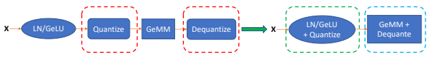
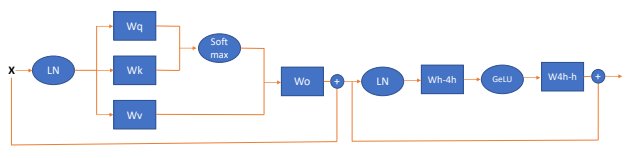
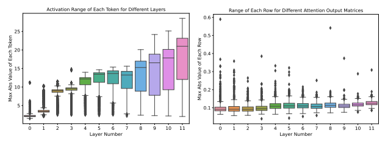

# Zeroquant: Efficient And Affordable Post-Training Quantization For Large-Scale Transformers

Zhewei Yao∗, Reza Yazdani Aminabadi, Minjia Zhang Xiaoxia Wu, Conglong Li, Yuxiong He Microsoft
{zheweiyao, yazdani.reza, minjiaz, xiaoxiawu, conglong.li, yuxhe}@microsoft.com

## Abstract

How to efficiently serve ever-larger trained natural language models in practice has become exceptionally challenging even for powerful cloud servers due to their prohibitive memory/computation requirements. In this work, we present an efficient and affordable post-training quantization approach to compress large Transformer-based models, termed as ZeroQuant. ZeroQuant is an end-to-end quantization and inference pipeline with three main components: (1) a fine-grained hardware-friendly quantization scheme for both weight and activations; (2) a novel affordable layer-by-layer knowledge distillation algorithm (LKD) even without the access to the original training data; (3) a highly-optimized quantization system backend support to remove the quantization/dequantization overhead. As such, we are able to show that: (1)
ZeroQuant can reduce the precision for weights and activations to INT8 in a cost-free way for both BERT
and GPT-3-style models with minimal accuracy impact, which leads to up to 5.19x/4.16x speedup on those models compared to FP16 inference; (2) ZeroQuant plus LKD affordably quantize the weights in the fully-connected module to INT4 along with INT8 weights in the attention module and INT8 activations, resulting in 3x memory footprint reduction compared to the FP16 model; (3) ZeroQuant can be directly applied to two of the largest open-sourced language models, including GPT-J6B and GPT-NeoX20B,
for which our INT8 model achieves similar accuracy as the FP16 model but achieves up to 5.2x better efficiency.

## 1 Introduction

Large-scale natural language models have been widely adopted in different applications, e.g., natural language understanding using BERT [63] and generation tasks using GPT-style models [48]. Although those models have achieved cutting-edge accuracy results, as the model size keeps increasing dramatically, the requirements of memory footprint and the computational cost to deploy them become a major bottleneck, even on cloud servers with powerful GPU devices.

One promising way to alleviate this challenge is quantization, which can reduce the bit precision for both weight and activations for lower memory footprint and faster compute (e.g., INT8 Tensor cores on T4/A100).

However, quantization usually requires retraining (also known as quantization aware training, or QAT in short) to recover the accuracy degradation from representation loss of weight and activations. To enable QAT,
the full training pipeline is usually required, including the training data and compute resources, to finetune the model. Access to those components is now oftentimes not available, and QAT is also a time-consuming process, particularly for those large-scale models.

Recently, zero-shot quantization [9, 46] and post-training quantization (PTQ) [45, 38] are proposed to address the training-data access and compute requirement challenges since PTQ generally requires no (or minimal) retraining. But most of those works primarily focus on computer vision problems on relatively
∗Code will be released soon as a part of https://github.com/microsoft/DeepSpeed small scales. More recently, [6] shows promising PTQ results on BERT. However, (1) its main focus is on high-precision quantization (INT8/FP16) on BERTbase, (2) it does not consider other billion-scale generative models (GPT-3-style models [8]). More importantly, most of these works do not report real latency improvement, putting the usefulness of these methods in improving inference latency into question. For example, existing work often do not discuss the quantization/dequantization cost associated with different quantization schemes, which in fact has a big impact to the performance benefit of using low precision.

Besides, for extreme quantization (e.g., INT4), knowledge distillation is usually used to boost performance, which adds another source of expensive computation cost as compared to QAT. Furthermore, in order to achieve better accuracy performance, hidden-states knowledge distillation, e.g., [2, 79], is usually applied for the quantized model. This would put significant pressure on the GPU memory and the compute resource requirement since both the teacher and student models needed to be loaded into the GPU memory for training.

In this paper, we present ZeroQuant, an end-to-end post-training quantization and inference pipeline, to address those challenges, targeting both INT8 and INT4/INT8 mixed-precision quantization. Specifically, our contributions are:
- We apply fine-grained hardware-friendly quantization schemes on both weight and activations, i.e., groupwise quantization for weight and token-wise quantization for activations. Both quantization schemes can significantly reduce the quantization error and retain hardware acceleration properties.

- We propose a novel layer-by-layer knowledge distillation method (LKD) for INT4/INT8 mixed-precision quantization, where the neural network is quantized layer-by-layer through distillation with minimal iterations and even without the access to the original training data. As such, at any given moment, the device memory is primarily populated only with a single extra layer's footprint, making billion-scale model distillation feasible with limited training budget and GPU devices.

- We develop a highly optimized inference backend, which eliminates the expensive computation cost of quantization/dequantization operators, enabling latency speedups on INT8 Tensor cores on modern GPU
hardware.

- Our empirical results show that:
- ZeroQuant enables quantizing BERT and GPT-3-style models into INT8 weight and activations to retain accuracy without incurring any retraining cost. Compared to FP16 inference, our INT8 model achieves up to 5.19x/4.16x speedup on BERTbase/GPT-3350M on A100 GPUs.

- ZeroQuant plus LKD can do INT4/INT8 mixed-precision quantization for BERT and GPT-3-style models. This results in a 3x memory footprint reduction with marginal accuracy loss as compared to the FP16 model. Also, thanks to the lightweight of LKD, we can finish the quantization process in 33s (10 minutes) for BERTbase (BERTlarge). We also demonstrate that LKD can use other datasets to achieve similar performance to the original training data.

- We demonstrate the scalability of ZeroQuant on two of the largest open-sourced language models, i.e, GPT-J6B and GPT-NeoX20B, with INT8 quantization. ZeroQuant can achieve 3.67x speedup over the FP16 model for GPT-J6B and (2) reduce the GPU requirement for inference from 2 to 1 and latency from 65ms to 25ms for GPT-NeoX20B (i.e., 5.2x better system efficiency in total).

## 2 Related Work

Model compression has been explored from different aspects [25, 37, 39, 34, 43, 20, 24, 50, 18, 74, 40, 26, 55, 59, 28, 60, 68, 33, 14, 38, 31]. Among those, quantization is one of the most promising directions as it directly reduces the memory footprint and compute intensity. Here, we focus on quantization for NLP models and briefly discuss the related work.

The majority of quantization works can be categorized into quantization-aware training (QAT). [56, 76]
are the first few works to quantize BERT models using integer numbers for both weight and activations.

Particularly, [56] utilizes Hessian information to push the weight bit-precision to even INT2/INT4, and it also proposes group-wise quantization to quantize the weight matrix in a more fine-grained granularity compared to single matrix quantization. [21] introduces quantization noise to alleviate the variations of QAT. [79, 2]
leverage very expensive knowledge distillation [26] and data augmentation [28] to ternarize/binarize weights.

[29] combines knowledge distillation [28] and learned step size quantization [19] to quantize the weight to 2–8 bits. Recently, [61] also uses knowledge distillation to compress GPT-2 models on task-specific problems to INT2. All those works quantize models using the original training datasets. More importantly they need retraining or finetuning the full model to recover the accuracy, and such compute cost on extra-large models, like [57, 11], can be hardly affordable for most research labs or practitioners.

One solution to overcome the compute cost challenge is post-training quantization (PTQ). However, PTQ
often induces a significant drop in accuracy because the network can be sensitive to quantization errors.

Along this line, one of the first works applied to Transformer-based [64] models is [75]. The authors introduce centroid-based quantization method, where outlier numbers use FP32 format and the rest numbers are quantized using non-uniform quantization. As such, it is hard to get the real inference latency benefit on general compute accelerators, e.g., CPU and GPU, because the parallel processing units in these hardware do not support efficient computation of mixed data types. More recently, [6] introduces high-precision activation quantization (FP16) for part of the model to overcome the high dynamic activation ranges. However, to the best of our knowledge, (1) How to apply PTQ on GPT-3-style models while achieving high accuracy has not been studied in any of previous work yet; (2) How to apply PTQ on billion (or even a dozen of billions) scale model is still under-explored; (3) Efficient inference system backend is still missing, especially for fine-grained quantization schemes, making it hard to achieve low latency on commodity hardware. ZeroQuant resolves all those limitations by considering the system backend into the algorithm design and we verify its capability on both BERT and large-scale GPT-3-style (up to 20 billion, i.e., GPT-NeoX20B) models for various tasks.

## 3 Background And Challenge

We give a brief overview of the transformer architecture and quantization background in Appendix A. Please refer to [64] and [23] for more details about the transformer architecture and quantization.

Post-training quantization (PTQ) exhibits great compression efficiency compared to quantization-aware training (QAT) since PTQ is usually applied to quantize the model without retraining. A common strategy of PTQ is to feed the training data to the network and calibrate the scaling factor, S, using the running mean. Please see Appendix B.1 for more details.

Some work has been done for BERTbase models [6] with INT8 weight and mixed INT8/FP16 activation quantization. However, there is no investigation for (1) even lower bit-precision PTQ on BERT models and
(2) large-scale GPT-3-style models. Here, we briefly discuss the challenge of the application of PTQ on both BERT (in Appendix C) and GPT-3-style models.

Figure 1: The activation range (left) and row-wise weight range of the attention output matrix (right) of different layers on the pretrained GPT-3350M. See Figure C.1 for the results of BERTbase.

The results of GPT-3350M with PTQ are shown in Table 1. As can be seen, the INT8 activation Table 1: Post training quantization results of GPT-3350M on 20 zero-shot evaluation datesets. Here WxAy means x-/y-bit for weight/activation. Particularly, for W4/8, we quantize the MHSA's weight to INT8 and FFC's weight to INT4. Please see Table H.1 for the results of all 20 tasks.

| Precision   | Lambada (↑)   | PIQA (↑)   | OpenBookQA (↑)   | RTE (↑)   | ReCoRd (↑)   | Ave. 19 Tasks (↑)   | Wikitext-2 (↓)   |
|-------------|---------------|------------|------------------|-----------|--------------|---------------------|------------------|
| W16A16      | 49.3          | 66.3       | 29.4             | 53.8      | 75.1         | 38.9                | 21.5             |
| W8A16       | 49.3          | 66.1       | 29.6             | 54.2      | 74.8         | 38.5                | 22.1             |
| W16A8       | 44.7          | 64.8       | 28.2             | 52.7      | 69.2         | 37.8                | 24.6             |
| W8A8        | 42.6          | 64.1       | 28.0             | 53.1      | 67.5         | 37.8                | 26.2             |
| W4/8A16     | 0.00          | 51.4       | 30.2             | 52.7      | 16.1         | 28.9                | 1.76e5           |

quantization (i.e., the row of W16A8) causes the primary accuracy loss. Further pushing the weight to INT8 (i.e., the row of W8A8) does not change the accuracy of zero-shot evaluation tasks but leads the causal language modeling task (Wikitext-2) to worse perplexity score, which demonstrates the sensitivity of generation tasks as compared to other zero-shot evaluation problems. For W4/8A16, on some accuracy-based tasks, GPT-3350M still achieves reasonable performance like OpenBookQA but it loses accuracy on the majority of the rest tasks. Particularly, for Wikitext-2, GPT-3350M with W4/8A16 cannot generate any meaningful text anymore. Please also see Appendix C for the analysis for BERT.

Dynamic Activation Range To investigate why INT8 activation leads to significant accuracy drop for both BERT and GPT-3-style models, we plot the token-wise (i.e., the hidden state of each token) range of each activation for different transformer layers of GPT-3350M in Figure 1 (left). As can be seen, different tokens have dramatically different activation ranges. For example, the maximum range of the last layer is around 35 but the minimum range is close to 8. This larger variance in the activation range makes it difficult to use a fixed quantization range (usually the maximum value) for all tokens to retain the prediction accuracy, because the limited representation power for small range tokens is going to hurt the accuracy performance.

Different Ranges of Neurons in Weight Matrices Similarly, we plot the row-wise (i.e., the output dimension) weight range of the attention output matrix (Wo) of GPT-3350M in Figure 1 (right). There is a 10x difference between the largest magnitudes of different rows and this leads to the worse generation performance of the INT8 weight PTQ. This also makes it very challenging when INT4 quantization is applied as the INT4 only has 16 numbers and a 10x smaller range leads to 2 (or 3) numbers for the representations of those smaller-range rows.

This analysis results also indicate why more expensive hidden-states knowledge distillation [2, 36] is used for ultra-low precision quantization to close the accuracy gap. However, as the training cost of knowledge distillation for large-scale models is too high, a lightweight and efficient method is desirable for PTQ.

## 4 Methodology 4 4.1 Fine-Grained Hardware-Friendly Quantization Scheme

As shown in Section 3, even applying INT8 PTQ to BERT/GPT-3-style models leads to significant accuracy degradation. The key challenge is the representation of INT8 cannot fully capture the different numerical ranges of different rows in weight matrices and different activation tokens. One way to address this is to use group-wise (token-wise) quantization for the weight matrix (activations). Group-wise Quantization for Weights Group-wise weight matrix quantization has first been proposed in [56], where a weight matrix W ∈ R
n×m is partitioned in to g groups, and each group is quantized separately.

However, in [56], the authors only apply this for quantization aware training. More importantly, they do not consider the hardware efficiency constraint and they do not have a system backend support. As such, they lack the real latency reduction benefit.

In our design, we consider the hardware constraint from Ampere Architecture of GPUs (e.g, A100), where the compute unit is based on Warp Matrix Multiply and Accumulate (WMMA) tiling size [53] to achieve the best speedup. Later, we will show that our group-wise quantization leads to much better accuracy as compared to single-matrix quantization due to its finer-granularity quantization while still achieving great latency reduction.

Token-wise Quantization for Activations As mentioned in Section 3 and Appendix A.2, a common practice for existing PTQ work is to use static quantization for activation, where the min/max range is calculated at an offline calibration phase. Such a method might be sufficient for small scale models where the variance in the activation range is small. However, as analyzed in Section 3, there is a huge variance in the activation range for large-scale transformer models such as GPT-3350M and BERTbase. As such, a static quantization scheme (often applied to all tokens/samples) would lead to significant accuracy drop.

One natural idea to overcome this issue is to adopt finer-grained token-wise quantization and dynamically calculate the min/max range for each token to reduce the quantization error from activations. Our evaluation in Section 5 also shows that token-wise quantization for activation significantly improves the accuracy of GPT-3-style and BERT models.

However, directly applying token-wise quantization using existing DL frameworks, such as the PyTorch quantization suite, would lead to significant quantization and dequantization cost because token-wise quantization introduces additional operations that lead to expensive data movement overhead between the GPU
compute units and the main memory. To address this issue, we build a highly optimized inference backend for token-wise quantization of transformer models. For example, the inference backend of ZeroQuant employs so called *kernel fusion* technique to fuse quantization operator with its previous operator, like layer normalization, to alleviate the data movement cost from token-wise quantization. Similarly, the dequantization cost of the different GeMMs' output is alleviated by scaling the INT32 accumulation using both the weight and activation quantization scales, before writing the final FP16 result back to the main memory for the next FP16 operator (like GeLU). Those optimization will be discussed in more details in Section 4.3.

Token-wise quantization can significantly reduce the representation error for quantized activations. Also, as it does not need to calibrate the activation range, later we will show that there is no quantization-related cost
(e.g., activation range calibration) for a moderate quantization scheme (INT8 weight with INT8 activation)
for ZeroQuant.

## 4.2 Layer-By-Layer Knowledge Distillation With Affordable Cost

Knowledge distillation (KD) is one of the most powerful methods to alleviate the accuracy degradation after model compression. However, there are several limitations of KD, especially for hidden-states KD on large-scale language models: (1) KD needs to hold a teacher and a student model together during the training, which dramatically increases the memory and compute cost; (2) KD usually requires full training of the student model. Therefore, several copies (gradient, first/second order momentum) of the weight parameters need to be stored in memory to update the model; (3) KD generally requires original training data, which sometimes are not accessible due to privacy/confidential issues.

To address those limitations, we present our layer-by-layer distillation (LKD) algorithm. Assume the target model for quantization has N transformer blocks, L1, ..., LN , the accessible dataset has input (X, Y ),
which can be the original training data or datasets from other resources. Our LKD quantizes the network layer-by-layer and uses its original (i.e., unquantized) version as the teacher model. More specifically, assume layer Lk is going to be quantized, and its quantized version is Lbk. Then we use the output of the Lk−1 (i.e.,
by running inference on X over the first k − 1 layers) as the input of Lk and Lbk, measure the difference, and do the model update to Lk, i.e.,

$${\mathcal{L}}_{L K D,k}=M S E\left(L_{k}\cdot L_{k-1}\cdot L_{k-2}\cdot\ldots\cdot L_{1}(X)-{\widehat{L}}_{k}\cdot L_{k-1}\cdot L_{k-2}\cdot\ldots\cdot L_{1}(X)\right),$$
, (1)
where MSE is the mean square loss, and it can be also replaced by other losses (e.g., KL divergence) as well.

As can be seen, (1) our LKD does not need to hold a separate teacher as we use the same L1 to Lk−1 for both teacher/student model. As such, the only extra model cost we have is Lk; (2) the memory overhead of optimizer states are significantly reduced as the only optimizing layer is Lk; (3) as we never optimize the end-to-end model, the training does not depend on the label anymore. Later, we will show that LKD does not rely on the original training data in Section 5.6.

Figure 2: The illustration of normal (left) and our fused (right) INT8 GeMM.

Table 2: Result of BERTbase on the development set of GLUE benchmark (except WNLI). [56]
+ uses 128 groups for weight matrix which is hard to get GPU acceleration. [6]
∗ uses mixed INT8 and FP16 activation, and it directly reports the average metric of MNLI/MRPC/QQP/STS-B, which is basically the average of the two metrics we used for our runs.

Precision (Method) CoLA MNLI-m MNLI-mm MRPC QNLI QQP RTE SST-2 STS-B Ave. Ave. Time (s) W16A16 (Baseline) 59.72 84.94 85.06 86.27/90.57 92.15 91.51/88.56 72.20 93.23 90.06/89.59 83.95 N/A

W8A8 [56] (QAT)+ - 83.91 83.83 - — - — 92.83 - — —

W8A8 [76] (QAT) 58.48 - — —/89.56 90.62 —/87.96 68.78 92.24 89.04/— - —

W8A8 (QAT) 61.21 84.80 84.64 83.82/88.85 91.29 91.29/88.28 71.12 92.89 88.39/88.18 83.37 2900

W8A8 (PTQ) 56.06 79.99 81.06 75.49/79.67 87.35 89.92/86.82 48.38 91.40 86.58/86.44 77.41 6 W8A8/16 [6] (PTQ)∗ 58.63 82.67 82.67 88.74 90.41 89.40 68.95 92.66 88.00 82.46 Unknown W8A8 (ZeroQuant) 59.59 84.83 85.13 86.03/90.39 91.98 91.45/88.46 71.12 93.12 90.09/89.62 83.75 0

W4/8A16 (PTQ) 0.00 16.74 16.95 31.62/0.00 50.74 63.18/0.00 47.29 70.64 16.48/15.91 33.11 6

W4/8A16 (ZeroQuant) 57.29 82.69 83.27 84.56/88.40 90.04 86.52/79.49 70.76 92.78 88.46/88.61 81.65 0

W4/8A16 (ZeroQuant-LKD) 58.50 83.16 83.69 84.80/89.31 90.83 88.94/84.12 70.04 92.78 88.49/88.67 82.35 31

W4/8A8 (ZeroQuant) 56.69 82.46 83.06 84.07/88.03 90.13 87.04/80.50 70.76 92.78 88.07/88.44 81.55 0

W4/8A8 (ZeroQuant-LKD) 58.80 83.09 83.65 85.78/89.90 90.76 89.16/84.85 71.84 93.00 88.16/88.55 82.71 31

## 4.3 Quantization-Optimized Transformer Kernels

Both optimizing the inference latency and model size is crucial for serving large-scale transformer models in practice. During inference, the batch size is often relatively small, so the inference latency of the model primarily depends on the time of loading inference needed data from the main memory. By quantizing the weights and activations to lower precision, we reduce the data volume needed to load those data, which allows more effective use of memory bandwidth and higher loading throughput. However, simply converting weights/activations to INT8 does not guarantee improved latency because there are additional data movement overhead associated with quantization/dequantization operations as shown in Figure 2 (red box). Such an overhead becomes expensive and in some cases surpasses the performance benefits of using low precision.

To reap the accuracy improvement from token-wise quantization while obtaining improved latency, we now present our optimizations that maximize the memory bandwidth utilization to speed up inference latency for ZeroQuant.

CUTLASS INT8 GeMM To support INT8 computation, we use CUTLASS [5] INT8 GeMM implementation tuned for different batch sizes. Unlike standard GPU backend library, such as cuDNN, using CUTLASS
allows us to more flexibly fuse quantization operation before and after GeMM to reduce kernel launching and data-movement overhead.

Fusing Token-wise Activation Quantization Token-wise quantization/dequantization introduce many additional operations that lead to extra data movement cost. To eliminate these cost, we use *kernel fusion* [67]
to fuse quantization operation for activation with its previous element-wise and/or reduction operations such as bias-add, GeLU, and LayerNorm into a single operator, as illustrated by the green box in Figure 2. For the dequantization operation (e.g., dequantizing the integer output from the GeMM operator), we similarly fuse it with our custom GeMM schedule to avoid additional read/write accesses to the main memory as illustrated by the blue box in Figure 2.

By doing the above optimizations, we are able to show significant latency reduction for BERT and GPT-3-style models in Section 5. Please see Appendix D for more details about our system optimization.

## 5 Results

Experimental Details To evaluate the proposed ZeroQuant, we test it on both BERT and GPT-3 models.

For BERT, we tested both BERTbase and BERTlarge on GLUE benchmark; and for GPT-3-style models, we tested the GPT-3350M (i.e., GPT-3-style model with 350M parameters) and GPT-31.3B (i.e., GPT-3-style model with 1.3B parameters) on 20 zero-shot evaluation tasks, including 19 accuracy-based tasks and 1 language modeling generation task. To illustrate the scalability of the proposed ZeroQuant, we also directly apply it to two of the largest open-sourced GPT-3-style models, i.e., GPT-J6B [66] and GPT-NeoX20B [4].

We use a fixed set of hyperparameters for all the LKD-related experiments even though tuning them may benefit our results. Please see Appendix B.2 for more training details and see Appendix B.3 for the reported metrics for BERT. To provide a comprehensive study, we also include a tuning result in Appendix E on BERT and an ablation study for different proposed components in Section 5.5.

Notation Explanation We use WxAy to represent using x-bit for weight quantization and y-bit for activation quantization. Unless specific explanation, for W4/8, we quantize the MHSA's weight to INT8 and FFC's weight to INT4; for A8/16, we use FP16 activation for self-attention calculation (i.e., the GeMM related to W*q/k/v*) and use INT8 for the rest calculation. We use ZeroQuant to represent the method with only fine-grained quantization schemes and use ZeroQuant-LKD to represent the method with both fine-grained quantization schemes and LKD.

## 5.1 Main Results Of Bert

BERTbase We report the results of BERTbase in Table 2. For W8A8, the average accuracy of PTQ degrades more than 10 points. However, ZeroQuant can achieve 83.75 scores, which is only 0.2 lower than baseline.

Particularly, as ZeroQuant has no activation range calibration phase, the cost of ZeroQuant is 0 which is even cheaper than standard PTQ. As compared to [6], our method achieves a better average score (1.29 higher). Meanwhile, as compared to INT8 activation used in ZeroQuant, [6] uses mixed INT8 and FP16 activation.

We also compare our method with our internal trained QAT and other QAT works [56, 76]. As can be seen, with comparable accuracy results as those QAT methods, ZeroQuant can save the retraining cost from 2900s to 0s for INT8 quantization.

For the more aggressive weight quantization with minimal (or no) training quantization, i.e., W4/8A16, PTQ fully loses all accuracy (pure random prediction). However, ZeroQuant can still achieve an 81.65 average score. On top of ZeroQuant, if we add our LKD, the accuracy can be further boosted to 82.35 with a cost of 31s per task using only a single GPU, which is 93.5x cheaper than INT8 QAT quantization. We also test ZeroQuant and ZeroQuant-LKD under the W4/8A8 quantization scheme and both of them achieve similar accuracy performance as W4/8A16. If hyper-parameter tuning is applied to LKD, ZeroQuant-LKD can achieve an 83.22 average score under W4/8A8, which is similar to QAT's W8A8 result. Please see Appendix E
for more details.

BERTlarge We test our methods on BERTlarge as well and the results are shown in Table 3. Similar to BERTbase, ZeroQuant achieves much better accuracy than PTQ methods. As compared to QAT methods, ZeroQuant has comparable results on larger datasets (like MNLI/QQP) and has better performance on small tasks (e.e., CoLA/MRPC/RTE). We actually tune QAT for multiple learning rates but cannot get even better performance for those small tasks (see Appendix F for more details).

For more aggressive quantization schemes, like W4/8A16 and W4/8A8, ZeroQuant and ZeroQuant-LKD
still achieve good accuracy except for RTE but the model size is about 3x smaller than FP16 counterpart.

This is aligned with the INT8 QAT results, which lose significantly more accuracy on RTE. Thanks to the lightweight cost of LKD, it only takes about 550s to finish each task even on BERTlarge, which is 13x cheaper than QAT.

## 5.2 Main Results Of Gpt-3-Style Models

GPT-3350M We first test ZeroQuant and ZeroQuant-LKD on GPT-3350M and report the result in Table 4.

The first interesting finding of zero-shot evaluation on GPT-3-stype models is that the accuracy performance

Precision (Method) CoLA MNLI-m MNLI-mm MRPC QNLI QQP RTE SST-2 STS-B Ave. Ave. Time (s)

W16A16 (Baseline) 63.35 86.65 85.91 87.99/91.62 92.24 91.08/88.08 74.01 93.46 90.34/90.11 85.03 N/A W8A8 [76] (QAT) - — - —/90.9 91.74 90.12/— - —

W8A8 (QAT)+ 59.85 86.65 86.35 85.29/89.43 92.55 91.60/88.60 61.37 93.23 87.55/87.65 82.78 7181

W8A8 (PTQ) 60.57 75.69 76.94 81.13/84.93 88.49 84.04/74.35 46.93 91.74 62.75/55.77 73.54 31

W8A8 (ZeroQuant) 63.38 86.52 85.64 87.75/91.50 92.31 91.09/88.05 72.56 93.35 90.45/90.19 84.81 0

W4/8A16 (PTQ) 0.00 16.85 33.24 68.38/80.89 51.25 63.18/0.00 52.71 52.41 -5.74/-8.51 35.73 31

W4/8A16 (ZeroQuant) 62.99 84.77 84.42 87.50/91.16 91.63 90.03/86.41 48.01 92.16 89.49/89.28 81.23 0

W4/8A16 (ZeroQuant-LKD) 63.72 84.90 84.81 87.99/91.39 91.45 90.34/86.92 51.62 92.43 89.46/89.29 81.85 550 W4/8A8 (ZeroQuant) 62.34 84.62 84.25 87.75/91.38 91.87 89.86/86.09 47.65 91.97 89.39/89.17 81.06 0

W4/8A8 (ZeroQuant-LKD) 63.51 84.70 84.71 88.73/91.99 91.73 90.25/86.74 49.82 92.09 89.34/89.08 81.62 550

Table 3: Result of BERTlarge on the development set of GLUE benchmark (except WNLI). +We extensively tuned the learning rate for QAT (see Appendix F for more details).

Table 4: Post training quantization result of GPT-3350M on 20 zero-shot evaluation datasets. Please see Table H.1 for the results of all 20 tasks.

of accuracy-based tasks is more tolerant to quantization than generation tasks. For instance, W8A8 PTQ
has a 1.1% average accuracy drop on 19 accuracy-based tasks as compared to 4.7 points loss on Wikitext-2. Comparing ZeroQuant with PTQ using W8A8, we can reduce the accuracy gap from 1.1% to 0.2% and the perplexity (PPL) gap from 4.7 to 0.2 with no activation range calibration cost.

For W4/8A16 quantization scheme, PTQ can hardly predict reasonable answers for the majority of tasks and its generation performance on Wikitext-2 is fully crashed. As a comparison, ZeroQuant still achieves non-trivial performance on some tasks but its generation performance significantly degrades on Wikitext-2.

LKD brings a significant performance boost for this W4/8A16 setting. Note that ZeroQuant-LKD increases the accuracy from 33.5 to 37.0 and decreases the PPL from 88.6 to 30.6 compared to ZeroQuant, and the entire cost of this is just 3.1 hours on a single A100 GPU. Note that this is about 0.027% GPU hours of the full pretraining cost (128 A100 GPUs for 32 hours). Similar to W4/8A16, ZeroQuant-LKD achieves much better performance than ZeroQuant on W4/8A8 by using the lightweight LKD.

GPT-31.3B The results of GPT-31.3B are shown in Table 5. Similar to GPT-3350M, for W8A8, ZeroQuant has much better performance than PTQ with less no activation calibration cost, particularly for the generation task Wikitext-2 (3.2 points lower). Also, for W4/8 quantization, LKD can bring non-trivial performance gain for ZeroQuant. The cost of LKD is about 0.02% of the full pre-training cost (128 A100 GPUs for 120 hours)

## 5.3 Latency Reduction Of Bert And Gpt-3-Style Models

| Precision (Method)      | Lambada (↑)   | PIQA (↑)   | OpenBookQA (↑)   | RTE (↑)   | ReCoRd (↑)   | Ave. 19 Tasks (↑)   | Wikitext-2 (↓)   | Time Cost   |
|-------------------------|---------------|------------|------------------|-----------|--------------|---------------------|------------------|-------------|
| W16A16                  | 49.3          | 66.3       | 29.4             | 53.8      | 75.1         | 38.9                | 21.5             | N/A         |
| W8A8 (PTQ)              | 42.6          | 64.1       | 28.0             | 53.1      | 67.5         | 37.8                | 26.2             | 7 mins      |
| W8A8 (ZeroQuant)        | 51.0          | 66.5       | 29.2             | 53.4      | 74.9         | 38.7                | 21.7             | 0           |
| W4/8A16 (PTQ)           | 0.00          | 51.4       | 30.2             | 52.7      | 16.1         | 28.9                | 1.76e5           | 7 mins      |
| W4/8A16 (ZeroQuant)     | 10.1          | 58.5       | 27.2             | 52.0      | 56.5         | 33.5                | 88.6             | 0           |
| W4/8A16 (ZeroQuant-LKD) | 39.8          | 63.8       | 29.4             | 53.1      | 70.1         | 37.0                | 30.6             | 1.1 hours   |
| W4/8A8 (ZeroQuant)      | 10.5          | 57.7       | 28.0             | 52.7      | 55.3         | 33.4                | 92.1             | 0           |
| W4/8A8 (ZeroQuant-LKD)  | 37.4          | 61.8       | 28.2             | 53.1      | 68.5         | 36.6                | 31.1             | 1.1 hours   |

We compare the inference speed of BERT between FP16 and our INT8 versions in Table 6 on a single 40G-A100 GPU. Using our efficient quantization kernel implementation and operator fusion, the INT8 model can achieve 2.27–5.19x speedup on BERTbase and 2.47–5.01x on BERTlarge.

We also include the latency comparison of GPT-3-style models between FP16 and our INT8 version.

Particularly, we use the model to generate the first 50 tokens based on a given text and measure the average latency. Our INT8 model leads to 4.16x/4.06x speedup for GPT-3350M/GPT-31.3B as compared to the FP16 counterpart.

Table 5: Post training quantization result of GPT-31.3B on 20 zero-shot evaluation datasets. Please see Table H.2 for the results of all 20 tasks.

Precision (Method) Lambada (↑) PIQA (↑) OpenBookQA (↑) RTE (↑) ReCoRd (↑) Ave. 19 Tasks (↑) Wikitext-2 (↓) Time Cost W16A16 61.3 71.4 33.6 53.1 82.6 42.4 15.3 N/A W8A8 (PTQ) 54.8 67.7 16.6 54.5 75.7 40.5 18.9 13 mins W8A8 (ZeroQuant) 62.6 70.7 33.4 52.7 80.9 42.3 15.7 0 W4/8A16 (PTQ) 0.00 50.4 27.0 50.9 15.8 29.0 1.35e5 13 mins W4/8A16 (ZeroQuant) 43.9 66.5 30.0 52.7 77.3 39.38 21.9 0

W4/8A16 (ZeroQuant-LKD) 59.4 69.5 31.6 52.7 79.7 41.5 17.6 3 hours W4/8A8 (ZeroQuant) 46.8 66.4 28.8 52.7 76.2 39.24 24.1 0 W4/8A8 (ZeroQuant-LKD) 48.7 68.1 29.0 52.0 77.4 39.90 18.2 3 hours

Table 6: The speedup of our W8A8 as compared to W16A16. We measure the end-to-end average latency for the entire BERT model, and the time reported is in milliseconds.

Seq Len Precision 128 256

BS 1 2 4 8 16 16 64 128 1 2 4 8 16 16 64 128

BERTbase

W16A16 2.45 3.22 3.85 5.51 9.96 17.93 34.25 67.08 3.13 4.05 5.70 10.55 19.27 36.69 71.75 140.0

W8A8 1.08 1.16 1.42 1.76 2.58 3.90 6.74 12.92 1.22 1.44 2.08 2.88 4.10 7.80 14.66 28.13

Speedup 2.27 2.78 2.71 3.13 3.86 4.60 5.08 5.19 2.57 2.81 2.74 3.66 4.70 4.70 4.89 4.98

BERTlarge

W16A16 5.45 6.38 8.73 13.88 26.34 48.59 92.49 183.4 6.39 8.94 14.66 27.99 51.94 98.78 195.9 384.5

W8A8 2.08 2.58 2.84 3.79 6.21 10.28 18.86 36.62 2.55 3.36 4.16 6.88 11.61 21.20 41.24 79.90

Speedup 2.62 2.47 3.07 3.66 4.24 4.73 4.90 5.01 2.51 2.66 3.52 4.07 4.47 4.66 4.75 4.81

## 5.4 A Showcase Of Gpt-J6B And Gpt-Neox20B

To demonstrate the scalability of ZeroQuant, we applied it to two of the largest open-sourced models, i.e.,
GPT-J6B and GPT-NeoX20B, which have 6B and 20B parameters separately.

We report the results of GPT-J6B in Table 7 on three generation datasets, i.e., PTB [41], Wikitext-2, and Wikitext-103 [42]. As can be seen, as compared to FP16 precision, ZeroQuant achieves similar PPL on all three different tasks. To compare the latency, we again use the average latency number to generate the first 50 tokens. Our W8A8 can get up to 3.67x speedup compared to the FP16 version.

To quantize GPT-NeoX20B to W8A8 for all GeMMs, the accuracy significantly decreases. We retrieve the quantization of each weight matrix and of each activation, and finally find out that the activation quantization for the attention calculation (i.e., the input of self-attention) causes the accuracy loss. We conjecture that this is because of the sensitivity of the self-attention module for extra-large models (20B) but cannot verify this for other models due to the lack of open-sourced extra-large models and the full evaluation pipeline. As such, we leave the input activation for self-attention in FP16 and quantize the rest to INT8. The results are shown in Table 8. Our W8A8/16 achieves similar accuracy performance but can reduce both the GPU resource requirement (from 2 A100 GPUs to 1) and the latency from 65ms to 25ms, which together lead to 5.2x better throughput/efficiency.

## 5.5 Ablation Study Of Different Components

To investigate the performance gain of each component we introduced in Section 4, i.e., group-wise weight quantization, token-wise activation quantization, and lightweight layer-by-layer knowledge distillation, we here do an ablation study on BERTlarge with W4/8A8.

We present the results in Table 9. As can be seen, group-wise weight quantization boosts the accuracy
(random-guess prediction) from PTQ to a non-trivial result (66.52). Further adding token-wise quantization improves 14.54 points accuracy performance. On top of those (i.e., ZeroQuant), LKD further brings a 0.56 point gain.

Table 7: Post training quantization result of GPT-J6B
on three zero-shot generation tasks

| Precision PTB Wikitext-2 Wikitext-103   | Latency   |       |              |                |
|-----------------------------------------|-----------|-------|--------------|----------------|
| W16A16 20.47                            | 10.35     | 10.35 | 29.13ms (1x) |                |
| W8A8                                    | 20.97     | 10.51 | 10.52        | 7.94ms (3.67x) |

Table 8: Post training quantization result of GPTNeoX20B on 19 zero-shot evaluation datasets. Please see Table H.4 for the results of all 19 tasks.

| Precision Lambada PIQA Ave. 19 Tasks   | Latency   |      |      |               |
|----------------------------------------|-----------|------|------|---------------|
| W16A16                                 | 71.7      | 77.7 | 50.5 | 2×65ms (1x)   |
| W8A8/16                                | 71.9      | 78.3 | 50.4 | 1×25ms (5.2x) |

Table 9: Ablation study of different components for BERTlarge on the development set of GLUE. The quantization scheme used here is W4/8A8. Here, GP is the abbreviation of group-wise weight quantization, TQ is the abbreviation of token-wise activation quantization.

| GQ   | TQ   | LKD   | CoLA   | MNLI-m   | MNLI-mm   | MRPC        | QNLI   | QQP         | RTE   | SST-2   | STS-B       | Ave.   |
|------|------|-------|--------|----------|-----------|-------------|--------|-------------|-------|---------|-------------|--------|
| ✗    | ✗    | ✗     | -0.79  | 33.07    | 32.94     | 68.38/80.54 | 49.42  | 63.18/0.00  | 52.71 | 52.29   | -4.27/-1.90 | 35.85  |
| ✓    | ✗    | ✗     | 59.81  | 66.63    | 68.79     | 68.63/71.17 | 83.87  | 78.24/61.30 | 46.93 | 89.45   | 54.58/32.52 | 66.52  |
| ✓    | ✓    | ✗     | 62.34  | 84.62    | 84.25     | 87.75/91.38 | 91.87  | 89.86/86.09 | 47.65 | 91.97   | 89.39/89.17 | 81.06  |
| ✓    | ✓    | ✓     | 63.51  | 84.70    | 84.71     | 88.73/91.99 | 91.73  | 90.25/86.74 | 49.82 | 92.09   | 89.34/89.08 | 81.62  |

Table 10: Post training quantization result of GPT-3350M on 20 zero-shot evaluation datesets The quantization scheme here is W4/8A8. Please see Table H.3 for the results of all 20 tasks.

| Method        | Data Resource   | Lambada (↑)   | PIQA (↑)   | OpenBookQA (↑)   | RTE (↑)   | ReCoRd (↑)   | Ave. 19 Tasks (↑)   | Wikitext-2 (↓)   |
|---------------|-----------------|---------------|------------|------------------|-----------|--------------|---------------------|------------------|
| ZeroQuant     | -               | 10.5          | 57.7       | 28.0             | 52.7      | 55.3         | 33.4                | 92.1             |
| ZeroQuant-LKD | Random data     | 26.1          | 59.3       | 29.2             | 50.5      | 64.9         | 34.5                | 40.6             |
| ZeroQuant-LKD | Wikipedia       | 33.9          | 62.4       | 28.0             | 52.7      | 69.5         | 36.2                | 30.4             |
| ZeroQuant-LKD | Original data   | 37.4          | 61.8       | 28.2             | 53.1      | 68.5         | 36.6                | 31.1             |

## 5.6 No Access To The Original Training Data

As mentioned in previous sections, the original training data are oftentimes hard to access due to the privacy and/or confidential issues. Therefore, we here study the performance of our LKD when there is no direct access to the original training data. As the distillation objective of our LKD does not depend on the label, the training data used for LKD can be very flexible.

We compare the performance of GPT-3350M on W4/8A8 quantization scheme using three different training data resources, i.e., random data (using random integer number to generate token ids), Wikipedia (using Huggingface to get the data1), and original PILE dataset.

The results are shown in Table 10. Compared to ZeroQuant, LKD using random data can boost the accuracy by 1.1% and reduce the PPL from 92.1 to 40.6. The reason why random data can still significantly improve the performance is that LKD does not optimize the end-to-end pipeline and it only layer-by-layer learns the internal dependency from the teacher model. Therefore, random data can also provide meaningful information. Using Wikipedia data from Huggingface can further improve the accuracy to 36.2 and reduce the PPL to 30.4, which is comparable to the results using the original data. This indicates that a clean text dataset can be used for LKD when we do not have access to the original full dataset.

## 6 Conclusions

With the rapid growth of large model sizes, we have reach a point to consider how to serve those models in practice. Although several works demonstrate that post-training quantization can be applied to BERT models, to the best of our knowledge, there have been no existing works on (1) billion-scale GPT-3-style models, (2) ultra-low precision post-training quantization, and (3) end-to-end solution of how to efficiently 1https://huggingface.co/datasets/wikipedia 10 serve the quantized model online. In this work, we offer fine-grained compression schemes for both weight and activations to enable INT8 quantization for up to 20B-scale models (GPT-NeoX20B). We also offer a novel affordable layer-by-layer knowledge distillation for ultra-low precision quantization, which leads to 3x model size reduction compared to FP16 model while achieving minimal accuracy degradation. Furthermore, we provide a system backend support and show up to 5.19x speedup on BERT models and 5.2x better efficiency on GPT-NeoX20B.

## Acknowledgments

This work is done within the DeepSpeed team in Microsoft. We appreciate the help from the DeepSpeed team. Particularly, we thank Jeff Rasley and Elton Zheng for solving the engineering issue. We thank the engineering supports from the Turing team in Microsoft.

## References

[1] Ardavan Afshar, Ioakeim Perros, Evangelos E Papalexakis, Elizabeth Searles, Joyce Ho, and Jimeng Sun.

Copa: Constrained parafac2 for sparse & large datasets. In *Proceedings of the 27th ACM International* Conference on Information and Knowledge Management, pages 793–802, 2018.

[2] Haoli Bai, Wei Zhang, Lu Hou, Lifeng Shang, Jing Jin, Xin Jiang, Qun Liu, Michael Lyu, and Irwin King. Binarybert: Pushing the limit of bert quantization. *arXiv preprint arXiv:2012.15701*, 2020.

[3] Jonathan Berant, Andrew Chou, Roy Frostig, and Percy Liang. Semantic parsing on Freebase from question-answer pairs. In *Proceedings of the 2013 Conference on Empirical Methods in Natural Language* Processing, pages 1533–1544, Seattle, Washington, USA, October 2013. Association for Computational Linguistics.

[4] Sid Black, Stella Biderman, Alex Andonian, Quentin Anthony, Preetham Gali, Leo Gao, Eric Hallahan, Josh Levy-Kramer, Connor Leahy, Lucas Nestler, Kip Parker, Jason Phang, Michael Pieler, Shivanshu Purohit, Tri Songz, Phil Wang, and Samuel Weinbach. GPT-NeoX: Large scale autoregressive language modeling in pytorch, 2021.
[5] NVIDIA blog. CUTLASS: Fast Linear Algebra in CUDA C++. https://developer.nvidia.com/blo g/cutlass-linear-algebra-cuda/, December 2017.

[6] Yelysei Bondarenko, Markus Nagel, and Tijmen Blankevoort. Understanding and overcoming the challenges of efficient transformer quantization. *arXiv preprint arXiv:2109.12948*, 2021.

[7] Michael Boratko, Harshit Padigela, Divyendra Mikkilineni, Pritish Yuvraj, Rajarshi Das, Andrew McCallum, Maria Chang, Achille Fokoue-Nkoutche, Pavan Kapanipathi, Nicholas Mattei, et al. A
systematic classification of knowledge, reasoning, and context within the arc dataset. *arXiv preprint* arXiv:1806.00358, 2018.

[8] Tom B Brown, Benjamin Mann, Nick Ryder, Melanie Subbiah, Jared Kaplan, Prafulla Dhariwal, Arvind Neelakantan, Pranav Shyam, Girish Sastry, Amanda Askell, et al. Language models are few-shot learners.

arXiv preprint arXiv:2005.14165, 2020.
[9] Yaohui Cai, Zhewei Yao, Zhen Dong, Amir Gholami, Michael W Mahoney, and Kurt Keutzer. Zeroq:
A novel zero shot quantization framework. In Proceedings of the IEEE/CVF Conference on Computer Vision and Pattern Recognition, pages 13169–13178, 2020.

[10] Daniel Cer, Mona Diab, Eneko Agirre, Inigo Lopez-Gazpio, and Lucia Specia. Semeval-2017 task 1: Semantic textual similarity-multilingual and cross-lingual focused evaluation. *arXiv preprint arXiv:1708.00055*,
2017.

[11] Aakanksha Chowdhery, Sharan Narang, Jacob Devlin, Maarten Bosma, Gaurav Mishra, Adam Roberts, Paul Barham, Hyung Won Chung, Charles Sutton, Sebastian Gehrmann, et al. Palm: Scaling language modeling with pathways. *arXiv preprint arXiv:2204.02311*, 2022.
[12] Christopher Clark, Kenton Lee, Ming-Wei Chang, Tom Kwiatkowski, Michael Collins, and Kristina Toutanova. Boolq: Exploring the surprising difficulty of natural yes/no questions. arXiv preprint arXiv:1905.10044, 2019.

[13] Ido Dagan, Dan Roth, Mark Sammons, and Fabio Massimo Zanzotto. Recognizing textual entailment:
Models and applications. *Synthesis Lectures on Human Language Technologies*, 6(4):1–220, 2013.

[14] Mostafa Dehghani, Stephan Gouws, Oriol Vinyals, Jakob Uszkoreit, and Łukasz Kaiser. Universal transformers. *arXiv preprint arXiv:1807.03819*, 2018.

[15] Jacob Devlin, Ming-Wei Chang, Kenton Lee, and Kristina Toutanova. BERT: Pre-training of deep bidirectional transformers for language understanding. *arXiv preprint arXiv:1810.04805*, 2018.

[16] Jesse Dodge, Gabriel Ilharco, Roy Schwartz, Ali Farhadi, Hannaneh Hajishirzi, and Noah Smith. Finetuning pretrained language models: Weight initializations, data orders, and early stopping. *arXiv* preprint arXiv:2002.06305, 2020.
[17] William B Dolan and Chris Brockett. Automatically constructing a corpus of sentential paraphrases. In Proceedings of the Third International Workshop on Paraphrasing (IWP2005), 2005.

[18] Zhen Dong, Zhewei Yao, Amir Gholami, Michael W Mahoney, and Kurt Keutzer. HAWQ: Hessian aware quantization of neural networks with mixed-precision. In *Proceedings of the IEEE International* Conference on Computer Vision, pages 293–302, 2019.

[19] Steven K Esser, Jeffrey L McKinstry, Deepika Bablani, Rathinakumar Appuswamy, and Dharmendra S
Modha. Learned step size quantization. *arXiv preprint arXiv:1902.08153*, 2019.

[20] Angela Fan, Edouard Grave, and Armand Joulin. Reducing transformer depth on demand with structured dropout. *arXiv preprint arXiv:1909.11556*, 2019.

[21] Angela Fan, Pierre Stock, Benjamin Graham, Edouard Grave, Remi Gribonval, Herve Jegou, and Armand Joulin. Training with quantization noise for extreme fixed-point compression. *arXiv preprint* arXiv:2004.07320, 2020.

[22] Leo Gao, Stella Biderman, Sid Black, Laurence Golding, Travis Hoppe, Charles Foster, Jason Phang, Horace He, Anish Thite, Noa Nabeshima, et al. The pile: An 800gb dataset of diverse text for language modeling. *arXiv preprint arXiv:2101.00027*, 2020.
[23] Amir Gholami, Sehoon Kim, Zhen Dong, Zhewei Yao, Michael W Mahoney, and Kurt Keutzer. A survey of quantization methods for efficient neural network inference. *arXiv preprint arXiv:2103.13630*, 2021.

[24] Mitchell A Gordon, Kevin Duh, and Nicholas Andrews. Compressing bert: Studying the effects of weight pruning on transfer learning. *arXiv preprint arXiv:2002.08307*, 2020.

[25] Song Han, Jeff Pool, John Tran, and William Dally. Learning both weights and connections for efficient neural network. In *Advances in neural information processing systems*, pages 1135–1143, 2015.

[26] Geoffrey Hinton, Oriol Vinyals, and Jeff Dean. Distilling the knowledge in a neural network. *Workshop* paper in NIPS, 2014.

[27] Shankar Iyer, Nikhil Dandekar, and Kornl Csernai. First quora dataset release: Question pairs.(2017).

URL https://data. quora. com/First-Quora-Dataset-Release-Question-Pairs, 2017.

[28] Xiaoqi Jiao, Yichun Yin, Lifeng Shang, Xin Jiang, Xiao Chen, Linlin Li, Fang Wang, and Qun Liu.

Tinybert: Distilling bert for natural language understanding. *arXiv preprint arXiv:1909.10351*, 2019.

[29] Jing Jin, Cai Liang, Tiancheng Wu, Liqin Zou, and Zhiliang Gan. Kdlsq-bert: A quantized bert combining knowledge distillation with learned step size quantization. *arXiv preprint arXiv:2101.05938*,
2021.
[30] Mandar Joshi, Eunsol Choi, Daniel S Weld, and Luke Zettlemoyer. Triviaqa: A large scale distantly supervised challenge dataset for reading comprehension. *arXiv preprint arXiv:1705.03551*, 2017.

[31] Sehoon Kim, Amir Gholami, Zhewei Yao, Michael W Mahoney, and Kurt Keutzer. I-bert: Integer-only bert quantization. In *International conference on machine learning*, pages 5506–5518. PMLR, 2021.

[32] Guokun Lai, Qizhe Xie, Hanxiao Liu, Yiming Yang, and Eduard Hovy. Race: Large-scale reading comprehension dataset from examinations. *arXiv preprint arXiv:1704.04683*, 2017.

[33] Zhenzhong Lan, Mingda Chen, Sebastian Goodman, Kevin Gimpel, Piyush Sharma, and Radu Soricut. Albert: A lite bert for self-supervised learning of language representations. *arXiv preprint arXiv:1909.11942*,
2019.
[34] Yann LeCun, John S Denker, and Sara A Solla. Optimal brain damage. In *Advances in neural information* processing systems, pages 598–605, 1990.

[35] Hector Levesque, Ernest Davis, and Leora Morgenstern. The winograd schema challenge. In *Thirteenth* International Conference on the Principles of Knowledge Representation and Reasoning. Citeseer, 2012.

[36] Fengfu Li, Bo Zhang, and Bin Liu. Ternary weight networks. *arXiv preprint arXiv:1605.04711*, 2016. [37] Hao Li, Asim Kadav, Igor Durdanovic, Hanan Samet, and Hans Peter Graf. Pruning filters for efficient convnets. *arXiv preprint arXiv:1608.08710*, 2016.

[38] Zhenhua Liu, Yunhe Wang, Kai Han, Wei Zhang, Siwei Ma, and Wen Gao. Post-training quantization for vision transformer. *Advances in Neural Information Processing Systems*, 34, 2021.

[39] Huizi Mao, Song Han, Jeff Pool, Wenshuo Li, Xingyu Liu, Yu Wang, and William J Dally. Exploring the regularity of sparse structure in convolutional neural networks. *Workshop paper in CVPR*, 2017.

[40] Yihuan Mao, Yujing Wang, Chufan Wu, Chen Zhang, Yang Wang, Yaming Yang, Quanlu Zhang, Yunhai Tong, and Jing Bai. Ladabert: Lightweight adaptation of bert through hybrid model compression. arXiv preprint arXiv:2004.04124, 2020.
[41] Mary Ann Marcinkiewicz. Building a large annotated corpus of english: The penn treebank. *Using* Large Corpora, page 273, 1994.

[42] Stephen Merity, Caiming Xiong, James Bradbury, and Richard Socher. Pointer sentinel mixture models.

In *International Conference on Learning Representations*, 2017.

[43] Paul Michel, Omer Levy, and Graham Neubig. Are sixteen heads really better than one? *arXiv preprint* arXiv:1905.10650, 2019.

[44] Todor Mihaylov, Peter Clark, Tushar Khot, and Ashish Sabharwal. Can a suit of armor conduct electricity? a new dataset for open book question answering. *arXiv preprint arXiv:1809.02789*, 2018.

[45] Markus Nagel, Rana Ali Amjad, Mart Van Baalen, Christos Louizos, and Tijmen Blankevoort. Up or down? adaptive rounding for post-training quantization. In International Conference on Machine Learning, pages 7197–7206. PMLR, 2020.

[46] Markus Nagel, Mart van Baalen, Tijmen Blankevoort, and Max Welling. Data-free quantization through weight equalization and bias correction. In *Proceedings of the IEEE/CVF International Conference on* Computer Vision, pages 1325–1334, 2019.

[47] Denis Paperno, Germán Kruszewski, Angeliki Lazaridou, Quan Ngoc Pham, Raffaella Bernardi, Sandro Pezzelle, Marco Baroni, Gemma Boleda, and Raquel Fernández. The lambada dataset: Word prediction requiring a broad discourse context. *arXiv preprint arXiv:1606.06031*, 2016.
[48] Alec Radford, Jeff Wu, Rewon Child, David Luan, Dario Amodei, and Ilya Sutskever. Language models are unsupervised multitask learners. 2019.

[49] Colin Raffel, Noam Shazeer, Adam Roberts, Katherine Lee, Sharan Narang, Michael Matena, Yanqi Zhou, Wei Li, and Peter J. Liu. Exploring the limits of transfer learning with a unified text-to-text transformer, 2019.

[50] Alessandro Raganato, Yves Scherrer, and Jörg Tiedemann. Fixed encoder self-attention patterns in transformer-based machine translation. *arXiv preprint arXiv:2002.10260*, 2020.

[51] Pranav Rajpurkar, Jian Zhang, Konstantin Lopyrev, and Percy Liang. SQuAD: 100,000+ questions for machine comprehension of text. *arXiv preprint arXiv:1606.05250*, 2016.

[52] Jeff Rasley, Samyam Rajbhandari, Olatunji Ruwase, and Yuxiong He. Deepspeed: System optimizations enable training deep learning models with over 100 billion parameters. In *Proceedings of the 26th ACM*
SIGKDD International Conference on Knowledge Discovery & Data Mining, pages 3505–3506, 2020.

[53] Greg Ruetsch. Using tensor cores in cuda fortran. *Nvidia Blog*, 2021. [54] Keisuke Sakaguchi, Ronan Le Bras, Chandra Bhagavatula, and Yejin Choi. Winogrande: An adversarial winograd schema challenge at scale. In *Proceedings of the AAAI Conference on Artificial Intelligence*,
volume 34, pages 8732–8740, 2020.

[55] Victor Sanh, Lysandre Debut, Julien Chaumond, and Thomas Wolf. Distilbert, a distilled version of bert: smaller, faster, cheaper and lighter. *arXiv preprint arXiv:1910.01108*, 2019.

[56] Sheng Shen, Zhen Dong, Jiayu Ye, Linjian Ma, Zhewei Yao, Amir Gholami, Michael W Mahoney, and Kurt Keutzer. Q-BERT: Hessian based ultra low precision quantization of bert. In *AAAI*, pages 8815–8821, 2020.

[57] Shaden Smith, Mostofa Patwary, Brandon Norick, Patrick LeGresley, Samyam Rajbhandari, Jared Casper, Zhun Liu, Shrimai Prabhumoye, George Zerveas, Vijay Korthikanti, et al. Using deepspeed and megatron to train megatron-turing nlg 530b, a large-scale generative language model. arXiv preprint arXiv:2201.11990, 2022.

[58] Richard Socher, Alex Perelygin, Jean Wu, Jason Chuang, Christopher D Manning, Andrew Y Ng, and Christopher Potts. Recursive deep models for semantic compositionality over a sentiment treebank. In Proceedings of the 2013 conference on empirical methods in natural language processing, pages 1631–1642, 2013.

[59] Siqi Sun, Yu Cheng, Zhe Gan, and Jingjing Liu. Patient knowledge distillation for bert model compression.

arXiv preprint arXiv:1908.09355, 2019.

[60] Zhiqing Sun, Hongkun Yu, Xiaodan Song, Renjie Liu, Yiming Yang, and Denny Zhou. Mobilebert: a compact task-agnostic bert for resource-limited devices. *arXiv preprint arXiv:2004.02984*, 2020.

[61] Chaofan Tao, Lu Hou, Wei Zhang, Lifeng Shang, Xin Jiang, Qun Liu, Ping Luo, and Ngai Wong.

Compression of generative pre-trained language models via quantization. *arXiv preprint arXiv:2203.10705*,
2022.

[62] Sandeep Tata and Jignesh M Patel. Piqa: An algebra for querying protein data sets. In 15th International Conference on Scientific and Statistical Database Management, 2003., pages 141–150. IEEE, 2003.

[63] Ian Tenney, Dipanjan Das, and Ellie Pavlick. Bert rediscovers the classical nlp pipeline. *arXiv:1905.05950*,
2019.

[64] Ashish Vaswani, Noam Shazeer, Niki Parmar, Jakob Uszkoreit, Llion Jones, Aidan N Gomez, Łukasz Kaiser, and Illia Polosukhin. Attention is all you need. In *Advances in neural information processing* systems, pages 5998–6008, 2017.

[65] Alex Wang, Amanpreet Singh, Julian Michael, Felix Hill, Omer Levy, and Samuel R Bowman. GLUE:
A multi-task benchmark and analysis platform for natural language understanding. arXiv preprint arXiv:1804.07461, 2018.

[66] Ben Wang and Aran Komatsuzaki. GPT-J-6B: A 6 Billion Parameter Autoregressive Language Model.

https://github.com/kingoflolz/mesh-transformer-jax, May 2021.

[67] Guibin Wang, Yisong Lin, and Wei Yi. Kernel fusion: An effective method for better power efficiency on multithreaded GPU. In Peidong Zhu, Lizhe Wang, Feng Xia, Huajun Chen, Ian McLoughlin, Shiao-Li Tsao, Mitsuhisa Sato, Sun-Ki Chai, and Irwin King, editors, *2010 IEEE/ACM Int'l Conference on Green* Computing and Communications, GreenCom 2010, & Int'l Conference on Cyber, Physical and Social Computing, CPSCom 2010, Hangzhou, China, December 18-20, 2010, pages 344–350. IEEE Computer Society, 2010.

[68] Wenhui Wang, Furu Wei, Li Dong, Hangbo Bao, Nan Yang, and Ming Zhou. Minilm: Deep self-attention distillation for task-agnostic compression of pre-trained transformers. *arXiv preprint arXiv:2002.10957*,
2020.

[69] Alex Warstadt, Amanpreet Singh, and Samuel R Bowman. Neural network acceptability judgments.

arXiv preprint arXiv:1805.12471, 2018.

[70] Adina Williams, Nikita Nangia, and Samuel Bowman. A broad-coverage challenge corpus for sentence understanding through inference. In *Proceedings of the 2018 Conference of the North American Chapter* of the Association for Computational Linguistics: Human Language Technologies, Volume 1 (Long Papers), pages 1112–1122, 2018.

[71] Adina Williams, Tristan Thrush, and Douwe Kiela. Anlizing the adversarial natural language inference dataset. *arXiv preprint arXiv:2010.12729*, 2020.

[72] Thomas Wolf, Lysandre Debut, Victor Sanh, Julien Chaumond, Clement Delangue, Anthony Moi, Pierric Cistac, Tim Rault, Rémi Louf, Morgan Funtowicz, et al. HuggingFace's Transformers: State-of-the-art natural language processing. *ArXiv*, pages arXiv–1910, 2019.

[73] Vikas Yadav, Steven Bethard, and Mihai Surdeanu. Quick and (not so) dirty: Unsupervised selection of justification sentences for multi-hop question answering. *arXiv preprint arXiv:1911.07176*, 2019.

[74] Zhewei Yao, Linjian Ma, Sheng Shen, Kurt Keutzer, and Michael W Mahoney. Mlpruning: A multilevel structured pruning framework for transformer-based models. *arXiv preprint arXiv:2105.14636*, 2021.

[75] Ali Hadi Zadeh, Isak Edo, Omar Mohamed Awad, and Andreas Moshovos. Gobo: Quantizing attentionbased nlp models for low latency and energy efficient inference. In *2020 53rd Annual IEEE/ACM*
International Symposium on Microarchitecture (MICRO), pages 811–824. IEEE, 2020.

[76] Ofir Zafrir, Guy Boudoukh, Peter Izsak, and Moshe Wasserblat. Q8BERT: Quantized 8bit bert. *arXiv* preprint arXiv:1910.06188, 2019.

[77] Rowan Zellers, Ari Holtzman, Yonatan Bisk, Ali Farhadi, and Yejin Choi. Hellaswag: Can a machine really finish your sentence? *arXiv preprint arXiv:1905.07830*, 2019.

[78] Sheng Zhang, Xiaodong Liu, Jingjing Liu, Jianfeng Gao, Kevin Duh, and Benjamin Van Durme. Record:
Bridging the gap between human and machine commonsense reading comprehension. *arXiv preprint* arXiv:1810.12885, 2018.

[79] Wei Zhang, Lu Hou, Yichun Yin, Lifeng Shang, Xiao Chen, Xin Jiang, and Qun Liu. Ternarybert:
Distillation-aware ultra-low bit bert. *arXiv preprint arXiv:2009.12812*, 2020.

## A Background A.1 Transformer Architecture

The transformer architecture usually has three components: an embedding layer, a stack of encoder/decoder layers, and a final classifier. In this paper, we focus on quantizing the encoder/decoder layers, i.e., the transformer block, because it is often the most memory and compute intensive components in the entire architecture. With a transformer block, there are two sub-layers, the multi-head self-attention (MHSA) and the feed-forward connection (FFC). We give a short review later and please refer to [64] for more details. At high level, transformer models can be broadly categorized to three branches: encoder-only models (BERT) [63],
decoder-only models (GPT-3-style) [48], and encoder-decoder models (T5) [49]. In this paper, we focus on encoder-only and decoder-only models but our approach can be applied to encoder-decoder models as well.

Transformer Block Assume the input of an encoder layer is X, the query, key, value, attention output, FFC dense, and FFC output matrices are Wq, Wk, Wv, Wo, Wh−4h, and W4h−h, respectively. Then the forward propagation of a transformer-block is illustrated in Figure A.1, where LN is the layer normalization, Softmax is the softmax operator, and GeLU is the activation function.

## A.2 Quantization Background

Quantization maps high-precision numbers, e.g., FP16/FP32, to its low-precision counterpart, e.g., INT4/INT8, to reduce the model footprint and improve the compute performance. In this work, we use uniform symmetric scalar quantizers. That is to say, if we have a vector/matrix, x, the quantization is applied as

$$\mathbf{x}_{q u a n t i z e}=r o u n d\left(c l a m p({\frac{\mathbf{x}}{S}},-2^{b i t-1},2^{b i t-1}-1)\right),$$
bit−1 − 1), (2)
where bit is the number of bit we use to represent the quantized value, and S is the scaling factor. For weight matrix quantization, S is generally computed as S = max (abs(x)), since the weight matrix is static during inference. On the other hand, activations' range is dynamic during inference so that an accurate S requires dynamic calculation during inference. However, to achieve best latency reduction, coarse-grained static quantization is usually applied in practice, where S is calibrated using training data (e.g., momentum based averaging) and fixed during inference [23]. Although static quantization achieves better latency reduction, it also limits the quantization representation for activations, which is discussed in Section 3.

$$\left({2}\right)$$

## B Experimental Details B.1 Details Of Ptq On Bert And Gpt

For BERT, we use a batch size of 32 and sequence length 128 to calibrate the range of activations. In order to capture the dynamic range, we use 0.95 momentum with 100 iterations, i.e.,
xmax = 0.95xmax + 0.05max(xcurrent−*iteration*),
xmin = 0.95xmin + 0.05min(xcurrent−*iteration*).

For GPT-3-style models, we use the same momentum method but change the batch size to 8 with sequence length 2048.

## B.2 Details Of Main Result

BERT BERT models are trained using the code-base from Huggingface [72]. We show our ZeroQuant method on BERTbase and BERTlarge. We use the same lower-case tokenizer in BERTlarge instead of the cased tokenizer in the original paper [15]. When fine-tuning on GLUE [65] tasks ((i.e., MRPC [17], STS-B [10],
SST-2 [58], QNLI [51], QQP [27], MNLI [70], CoLA [69], RTE [13]).2), we follow the instruction from Huggingface Transformer Library [72].

For ZeroQuant and ZeroQuant-LKD, we use 48 groups for group-wise weight quantization on BERTbase and 64 groups for group-wise weight quantization on BERTlarge, for all the weight matrices.

For LKD, we use 100 iterations with batch size 32 and sequence length 128 for BERTbase, and we use 400 iterations for BERTlarge. We fix the learning rate as 5e-6 for both models on all tasks. However, tuning them may favor ZeroQuant.

All the models are trained using a single 40G-A100 GPU (Azure ND A100 instances).

GPT-3-style Models All GPT-3-style models used in the paper are trained using DeepSpeed [52] and Megatron-DeepSpeed Library 3. The pretraining data are from PILE dataset [22], and the training pipeline and hyperparameters are based on the Megatron-DeepSpeed repository. We use 128 A100 GPUs (Azure ND
A100 instances) to do the pretraining. It takes about 32 hours to finish the training of GPT-3350M and 120 hours of GPT-31.3B. We evaluate our results on 20 zero-shot evaluation tasks, including 19 accuracy evaluation tasks (i.e., HellaSwag [77], LAMBADA [47], TriviaQA [30], WebQS [3], Winogrande [54], PIQA [62], ARC
(Challenge/Easy) [7], ANLI (R1/R2/R3) [71], OpenBookQA [44], RACE-h [32], BoolQ [12], Copa [1], RTE [13],
WSC [35], MultiRC [73], ReCoRD [78]) and 1 language modeling generation task (i.e., Wikitext-2 [42]).

For ZeroQuant and ZeroQuant-LKD, we use 64/128 groups for group-wise weight quantization on GPT-3350M/GPT-31.3B for all the weight matrices.

For LKD, we use 1600 iterations with batch size 8 and sequence length 2048 for both GPT-3350M and GPT-31.3B. We fix the learning rate as 5e-6 for both models. However, tuning them may favor ZeroQuant.

All the quantized models are trained using a single 40G-A100 GPU (Azure ND A100 instances).

## B.3 Accuracy Reported For Bert On Glue

We report the performance metric for BERT on GLUE based on Table B.1. For the average score, if the task only has one metric, we use it for the final result; if the task has two metrics, we compute the average of the two metrics first and use it for the final average score. For instance, the score of MRPC used to compute the final average is the mean of its accuracy and F1 score.

2We exclude WNLI [35] since its results are not stable [16].

3https://github.com/microsoft/Megatron-DeepSpeed Table B.1: Metric used for BERTbase on the development set of GLUE benchmark (except WNLI).

| CoLA                | MNLI-m   | MNLI-mm       | MRPC     | QNLI     | QQP           | RTE      | SST-2    | STS-B               |
|---------------------|----------|---------------|----------|----------|---------------|----------|----------|---------------------|
| Matthews Correction | Accuracy | Accuracy / F1 | Accuracy | Accuracy | Accuracy / F1 | Accuracy | Accuracy | Pearson / Spearmanr |

Table C.1: Post training quantization results of BERTbase on development sets of the GLUE benchmark (except WNLI). Here WxAy means x-bit for weight quantization and y-bit for activation quantization. Particularly, for W4/8, we quantize the MHSA's weight to INT8 and FFC's weight to INT4. Please see Appendix B.3 for the reported metrics.

| Precision   | CoLA   | MNLI-m   | MNLI-mm   | MRPC        | QNLI   | QQP         | RTE   | SST-2   | STS-B       | Ave.   |
|-------------|--------|----------|-----------|-------------|--------|-------------|-------|---------|-------------|--------|
| W16A16      | 59.72  | 84.94    | 85.06     | 86.27/90.57 | 92.15  | 91.51/88.56 | 72.20 | 93.23   | 90.06/89.59 | 83.95  |
| W8A16       | 60.77  | 84.65    | 84.92     | 85.29/89.86 | 91.84  | 91.52/88.56 | 71.84 | 93.46   | 89.89/89.50 | 83.87  |
| W16A8       | 56.85  | 80.55    | 81.48     | 84.07/89.33 | 91.34  | 91.30/88.07 | 68.59 | 93.46   | 88.74/88.74 | 81.93  |
| W8A8        | 58.74  | 79.99    | 81.06     | 84.31/89.51 | 91.18  | 91.24/88.03 | 70.76 | 92.66   | 88.33/88.73 | 82.16  |
| W4/8A16     | 0.00   | 16.74    | 16.95     | 31.62/0.00  | 50.74  | 63.18/0.00  | 47.29 | 70.64   | 16.48/15.91 | 33.11  |

## C Ptq Challenge Of Bertbase

From Table C.1, we observe similar results as [6], where the accuracy degradation of INT8 quantization is mainly from activation quantization. Specifically, there is a negligible accuracy drop from INT8 weight quantization (i.e., the row of W8A16). However, with sole INT8 activation (i.e., the row of W16A8), the accuracy decreases from 84.06 to 79.61. Besides, we also push the weight quantization to a mixed-precision setting with INT4 for weights in FFC and INT8 for weights in MHSA (i.e., the row of W4/8A16). This ultra-low precision quantization leads the model to be purely random without meaning prediction.

## D Details About System Optimization

By having the weight and activation quantization, we can use the GeMM schedule that exploits the INT8 Tensor-core units which provide 2x/4x more compute efficiency compared to the FP16/FP32 Tensor cores. For this purpose, we adapt the CUTLASS library to produce multiple schedules based on the input sizes we are considering in our application, such as the batch size, sequence length, and the Transformer hidden dimension.

To achieve the best latency, we also develop our own efficient parallel implementation of the quantization operator on GPU. During the inference run-time, based on the total batch size (batch×seqlen), we choose the schedule that results in the lowest possible padding when performing the Tensor-core matrix-multiplication operations.

To find the best schedule for the GeMM operation, we use the CUTLASS profiler tool that explores the tiling dimensions on the thread-blocks, WARPs, and WMMA (Tensor cores), as the three compute hierarchies available within the Ampere GPU architecture. Then, we find the best schedule by sorting the tile-based schedule based on either peak throughput achieved on the large-batch case, or the maximum memory bandwidth taken from the main memory when the batch size is small.

However, there are still several challenges we need to address which are discussed below.

Operation Fusion for Token-wise Activation Quantization. One of the main challenges of our quantization scheme is how to efficiently quantize hidden states before the GeMM operation. In order to remove the overhead, we fuse the activation quantization with its associated element-wise and/or reductionbased operations such as bias-addition, GELY, and LayerNorm. This is due to the fact that each SM takes care of one row (token) of the activation and therefore, we can reuse the computation from the thread registers and compute the quantization scale, avoiding the data movement between GPU kernels and main memory. Moreover, by converting data from FP16 to INT8, we can utilize the memory bandwidth twice, further improving the inference latency and throughput.

Dequantization Associated with GeMM Schedule To utilize the output of integer output from GeMM
operator in the following operators, one important step is to dequantize the output by using the scaling factor of the weight and activations. This dequantization step generally introduces extra overhead for quantized network inference due to the data movement. As such, we add a custom epilogue, which converts the final accumulated result (from INT32 format) of each row and column of the output to the real value (in FP16 format), using corresponding floating-point quantization scales computed from weight and activation group-wise quantization. By fusing the dequantization with GeMM schedule, we ensure that there is no overhead exposed by using the INT8 operations while producing the FP16 results that are used in the following operation.

Furthermore, to effectively combine dequantization with the GeMM operation, we read the two groups of quantization scales for the activation and weight matrices in advance prior to completion of the multiplication of the output matrix. Doing so, we overlap the reading of the extra quantization parameters with the GeMM
computation and the GeMM-plus-dequantization can seamlessly work together without stalling the inference pipeline.

Cuda Graph Enhanced Small Model Inference. As the execution time for specific kernels reduce by optimizing the throughput using the INT8 inference pipeline, the overhead of launching the GPU kernels and the CPU-to-GPU communication become a major bottleneck mostly on small-scale models. To address this issue, we add the CUDA-Graph support to our inference pipeline that reduces the CPU overhead, by storing the trace of the kernels launched during the inference forward computation, and creating the computation-graph to be reused in the next call to the inference pipeline. Thus, after storing the graph for the first time, we can replay the graph for the following requests, which substantially improves the performance especially on small models, such as BERTbase. For a fair comparison, we also enable Cuda Graph for FP16 baseline.

## E Tuned Results On Bert

As mentioned in the main text and Appendix B.2, we use the same set of hyperparameters for BERT. However, tuning them can significantly boost the performance for ZeroQuant. Here, we tune two hyperparameters, i.e., the learning rate and the number of iterations in order to show the best possible performance of ZeroQuant Table E.1: Result of BERTbase on the development set of GLUE benchmark (except WNLI). Here WxAy means x-bit for weight quantization and y-bit for activation quantization. Particularly, for W4/8, we quantize the MHSA's weight to INT8 and FFC's weight to INT4. Please see Appendix B.3 for the reported metrics.

Precision (Method) CoLA MNLI-m MNLI-mm MRPC QNLI QQP RTE SST-2 STS-B Ave. W32A32 (Baseline) 59.72 84.94 85.06 86.27/90.57 92.15 91.51/88.56 72.20 93.23 90.06/89.59 83.95 W8A8 (ZeroQuant-LKD No Tuning) 59.59 84.83 85.13 86.03/90.39 91.98 91.45/88.46 71.12 93.12 90.09/89.62 83.75

W8A8 (ZeroQuant-LKD Tuned) 60.90 84.95 85.10 86.27/90.60 92.07 91.47/88.47 71.84 93.46 90.09/89.62 84.07 W4/8A32 (ZeroQuant-LKD No Tuning) 58.50 83.16 83.69 84.80/89.31 90.83 88.94/84.12 70.04 92.78 88.49/88.67 82.35

W4/8A32 (ZeroQuant-LKD Tuned) 60.04 83.64 84.31 85.78/89.53 91.01 90.66/87.26 71.84 93.12 88.68/88.79 83.26 W4/8A8 (ZeroQuant-LKD No Tuning) 58.80 83.09 83.65 85.78/89.90 90.76 89.32/84.85 71.84 93.00 88.16/88.55 82.71 W4/8A8 (ZeroQuant-LKD Tuned) 60.30 83.47 84.03 85.78/89.90 90.87 90.77/87.38 71.84 93.00 88.38/88.70 83.22

Table E.2: Result of BERTlarge on the development set of GLUE benchmark (except WNLI). Here WxAy means x-bit for weight quantization and y-bit for activation quantization. Particularly, for W4/8, we quantize the MHSA's weight to INT8 and FFC's weight to INT4. Please see Appendix B.3 for the reported metrics.

on both BERTbase and BERTlarge. Particularly, we choose learning rate from the set {1e-6, 2e-6, 5e-6, 1e-5},
and choose number of iterations from the set {0, 50, 100, 200, 400, 800, 1600}. Thanks to the lightweight of LKD, the total tuning time for BERTbase (including all data loading time, evaluation time, tokenization time, all three quantization schemes, etc) is around 4.5 hours on 8 40G-A100 GPUs (i.e., 36 GPU hours), and the tuning time for BERTlarge is around 16 hours on 8 40G-A100 GPUs (i.e., 128 GPU hours).

We summarize the best results in the Table E.1 and E.2.

## F Qat On Bertlarge

We use four different learning rates for QAT on BERTlarge, {5e-6, 1e-5, 2e-5, 5e-5}. The final results we reported in the paper are chosen from the best single run among those four different learning rates. However, even with such tuning, we are not able to get good performance for BERTlarge on RTE.

Also, note that the time cost we used in the main text is based on a single run. if we consider the tuning cost, the total time will be 4 × 7181s

## G Limitations And Future Work

We believe it is critical for every work to clearly state its limitations, especially in this area. One limitation is that in this work we only focused on natural language models, but it would be interesting to see how ZeroQuant would perform for computer vision models. We leave this as a future work.

Another limitation is that we can only verify the scalability of ZeroQuant up to 20B scale models. If there are new releases of larger open-sourced models, it would be great to test ZeroQuant on those larger models as well.

Third, in this paper, we found out that the activation input of self-attention is more sensitive for quantization for the extra-large model (GPT-NeoX20B). However, we are unable to verify this on other extra-large models due to the lack of open-sourced models.

| Precision (Method)                | CoLA   | MNLI-m   | MNLI-mm   | MRPC        | QNLI   | QQP         | RTE   | SST-2   | STS-B       | Ave.   |
|-----------------------------------|--------|----------|-----------|-------------|--------|-------------|-------|---------|-------------|--------|
| W32A32 (Baseline)                 | 63.35  | 86.65    | 85.91     | 87.99/91.62 | 92.24  | 91.08/88.08 | 74.01 | 93.46   | 90.34/90.11 | 85.03  |
| W8A8 (ZeroQuant-LKD No Tuning)    | 63.38  | 86.52    | 85.64     | 87.75/91.50 | 92.31  | 91.09/88.05 | 72.56 | 93.35   | 90.45/90.19 | 84.81  |
| W8A8 (ZeroQuant-LKD Tuned)        | 64.36  | 86.64    | 85.74     | 88.48/91.97 | 92.49  | 91.15/88.13 | 74.73 | 93.58   | 90.45/90.19 | 85.30  |
| W4/8A32 (ZeroQuant-LKD No Tuning) | 63.72  | 84.90    | 84.81     | 87.99/91.39 | 91.45  | 90.34/86.92 | 51.62 | 92.43   | 89.46/89.29 | 81.85  |
| W4/8A32 (ZeroQuant-LKD Tuned)     | 64.06  | 85.02    | 84.98     | 88.73/91.99 | 91.82  | 90.45/87.12 | 52.35 | 92.78   | 89.72/89.44 | 82.19  |
| W4/8A8 (ZeroQuant-LKD No Tuning)  | 63.51  | 84.70    | 84.71     | 88.73/91.99 | 91.73  | 90.25/86.74 | 49.82 | 92.09   | 89.34/89.08 | 81.62  |
| W4/8A8 (ZeroQuant-LKD Tuned)      | 63.60  | 84.77    | 84.90     | 88.97/92.15 | 91.87  | 90.37/86.99 | 50.54 | 92.55   | 89.57/89.38 | 81.88  |

Tasks Baseline PTQ ZeroQuant ZeroQuant-LKD

W32A32 W8A32 W32A8 W8A8 W4/8A32 W8A8 W4/8A32 W4/8A8 W4/8A32 W4/8A8

HellaSwag 38.6 38.1 37.6 36.8 26.5 38.4 30.4 30.5 35.3 35.3

LAMBADA 49.3 49.3 44.7 42.9 0 51.0 10.1 10.5 39.8 37.4

TriviaQA 3.00 2.67 2.70 2.32 0 2.86 0.159 0.194 1.043 0.23 WebQs 1.43 0.935 1.23 0.689 0 1.378 0.246 0.394 0.591 0.049 Winogrande 53.2 52.1 52.1 52.1 47.8 51.4 52.6 50.7 51.6 51.8 PIQA 66.3 66.1 64.8 64.1 51.4 66.5 58.5 57.7 63.8 61.8

ARC (Challenge) 24.2 24.0 24.0 24.1 27.0 24.5 22.0 21.8 21.8 23.6

ARC (Easy) 45.5 44.7 44.2 43.9 25.1 44.5 37.6 37.5 40.5 40.5

ANLI R1 31.1 30.0 31.3 33.2 33.4 31.1 32.8 32.7 32.4 33.8

ANLI R2 34.3 36.0 36.5 35.9 33.4 34.3 34.7 34.2 34.1 33.5

ANLI R3 34.1 34.0 33.0 37.2 33.5 33.4 34.9 34.5 33.1 33.4

OpenBookQA 29.4 29.6 28.2 28.0 30.2 29.2 27.2 28.0 29.4 28.2

RACE-h 32.4 31.3 30.3 30.7 22.4 32.2 25.7 26.4 29.5 29.7

BoolQ 60.3 60.2 57.0 56.9 37.8 60.2 60.1 59.4 61.9 61.9 Copa 69.0 67.0 71.0 73.0 48.0 69.0 63.0 64.0 68.0 66.0 RTE 53.8 54.2 52.7 53.1 52.7 53.4 52.0 52.7 53.1 53.1 WSC 36.5 36.5 36.5 35.6 63.5 36.5 36.5 36.5 36.5 36.5

MultiRC 0.839 0.839 0.839 0.944 0.315 0.839 1.889 1.889 0.839 0.839

ReCoRD 75.1 74.8 69.2 67.5 16.1 74.9 56.5 55.3 70.1 68.5

Wikitext-2 21.52 22.09 24.56 26.20 1.76e5 21.68 88.64 92.10 30.56 31.13

Average Acc 38.86 38.54 37.78 37.84 28.9 38.71 33.52 33.42 37.02 36.64

## H Full Zero-Shot Evaluation Of Gpt-3-Style Models

We includes all zero-shot evaluation results in this section for all GPT-3-style models, inlcuding GPT-NeoX20B.

| Tasks           | Baseline   | PTQ     | ZeroQuant   | ZeroQuant-LKD   |        |         |        |       |
|-----------------|------------|---------|-------------|-----------------|--------|---------|--------|-------|
| W32A32          | W8A8       | W4/8A32 | W8A8        | W4/8A32         | W4/8A8 | W4/8A32 | W4/8A8 |       |
| HellaSwag       | 51.4       | 47.0    | 26.1        | 50.8            | 43.7   | 43.2    | 48.5   | 46.7  |
| LAMBADA         | 61.3       | 54.8    | 0           | 62.6            | 43.9   | 46.8    | 59.4   | 48.7  |
| TriviaQA        | 7.37       | 4.43    | 0           | 6.67            | 2.36   | 2.09    | 4.28   | 2.99  |
| WebQs           | 2.90       | 1.476   | 0           | 2.07            | 1.132  | 1.28    | 1.673  | 1.083 |
| Winogrande      | 57.1       | 55.7    | 50.1        | 57.1            | 54.6   | 54.3    | 55.3   | 53.8  |
| PIQA            | 71.4       | 67.7    | 50.4        | 70.7            | 66.5   | 66.4    | 69.5   | 68.1  |
| ARC (Challenge) | 27.2       | 27.1    | 26.5        | 26.8            | 25.7   | 25.3    | 27.8   | 26.5  |
| ARC (Easy)      | 54.5       | 49.7    | 26.0        | 53.8            | 48.0   | 47.0    | 52.2   | 50.3  |
| ANLI R1         | 32.0       | 33.1    | 33.0        | 33.4            | 33.8   | 33.6    | 34.2   | 33.8  |
| ANLI R2         | 32.0       | 32.9    | 33.3        | 33.9            | 33.0   | 33.0    | 33.8   | 32.8  |
| ANLI R3         | 33.8       | 33.5    | 32.3        | 34.8            | 33.6   | 33.5    | 33.7   | 33.0  |
| OpenBookQA      | 33.6       | 32.6    | 27.0        | 33.4            | 30.0   | 28.8    | 31.6   | 29.0  |
| RACE-h          | 33.6       | 32.6    | 22.4        | 32.7            | 30.9   | 29.9    | 32.7   | 33.2  |
| BoolQ           | 62.4       | 59.2    | 37.8        | 61.3            | 60.3   | 59.8    | 61.7   | 61.3  |
| Copa            | 70.0       | 70.0    | 55.0        | 72.0            | 73.0   | 74.0    | 72.0   | 70.0  |
| RTE             | 53.1       | 54.5    | 50.9        | 52.7            | 52.7   | 52.7    | 52.7   | 52.0  |
| WSC             | 37.5       | 36.5    | 63.5        | 36.5            | 36.5   | 36.5    | 36.5   | 36.5  |
| MultiRC         | 1.05       | 0.839   | 0.315       | 0.839           | 1.259  | 1.154   | 0.839  | 0.839 |
| ReCoRD          | 82.6       | 75.7    | 15.8        | 80.9            | 77.3   | 76.2    | 79.7   | 77.4  |
| Wikitext-2      | 15.3       | 18.85   | 1.35e5      | 15.69           | 21.9   | 24.09   | 17.56  | 18.18 |
| Average Acc     | 42.36      | 40.49   | 28.97       | 42.26           | 39.38  | 39.24   | 41.48  | 39.90 |

| Tasks           | Random Data   | Wikipedia   | Original Training Data   |
|-----------------|---------------|-------------|--------------------------|
| HellaSwag       | 33.9          | 35.5        | 35.3                     |
| LAMBADA         | 26.1          | 33.9        | 37.4                     |
| TriviaQA        | 0.088         | 0.972       | 0.23                     |
| WebQs           | 0.049         | 0.344       | 0.049                    |
| Winogrande      | 50.3          | 52.4        | 51.8                     |
| PIQA            | 59.3          | 62.4        | 61.8                     |
| ARC (Challenge) | 22.6          | 23.3        | 23.6                     |
| ARC (Easy)      | 38.3          | 40.0        | 40.5                     |
| ANLI R1         | 33.0          | 32.0        | 33.8                     |
| ANLI R2         | 34.3          | 34.7        | 33.5                     |
| ANLI R3         | 33.4          | 32.9        | 33.4                     |
| OpenBookQA      | 29.2          | 28.0        | 28.2                     |
| RACE-h          | 27.8          | 29.1        | 29.7                     |
| BoolQ           | 47.8          | 52.6        | 61.9                     |
| Copa            | 65.0          | 69.0        | 66.0                     |
| RTE             | 50.5          | 52.7        | 53.1                     |
| WSC             | 36.5          | 36.5        | 36.5                     |
| MultiRC         | 1.574         | 1.154       | 0.839                    |
| ReCoRD          | 64.9          | 69.5        | 68.5                     |
| Wikitext-2      | 40.63         | 30.36       | 31.13                    |
| Average Acc     | 34.45         | 36.16       | 36.64                    |

| Tasks           | W16A16   | W8A8/16   |
|-----------------|----------|-----------|
| HellaSwag       | 71.4     | 71.2      |
| LAMBADA         | 71.7     | 71.9      |
| TriviaQA        | 25.8     | 25.9      |
| WebQs           | 6.3      | 6.64      |
| Winogrande      | 66.0     | 65.7      |
| PIQA            | 77.7     | 78.3      |
| ARC (Challenge) | 41.0     | 42.2      |
| ARC (Easy)      | 68.5     | 68.8      |
| ANLI R1         | 33.1     | 33.9      |
| ANLI R2         | 33.4     | 34.4      |
| ANLI R3         | 35.1     | 35.4      |
| OpenBookQA      | 39.8     | 38.8      |
| RACE-h          | 38.5     | 37.6      |
| BoolQ           | 69.4     | 69.9      |
| Copa            | 84.0     | 85.0      |
| RTE             | 54.9     | 54.9      |
| WSC             | 50.0     | 44.2      |
| MultiRC         | 3.57     | 4.41      |
| ReCoRD          | 88.3     | 88.0      |
| Average Acc     | 50.45    | 50.38     |
