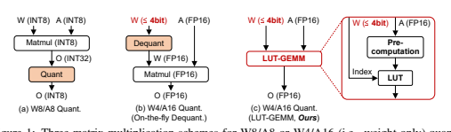
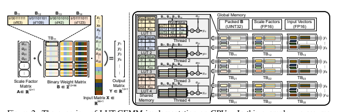
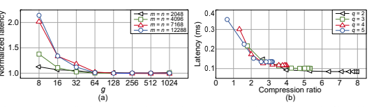
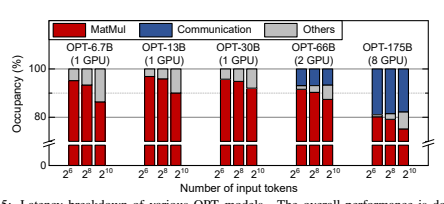
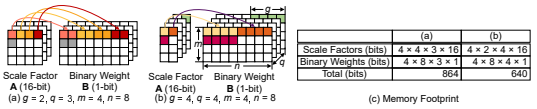
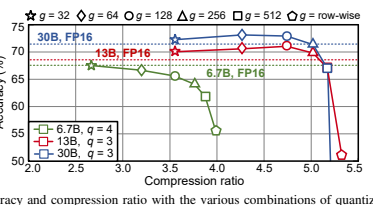
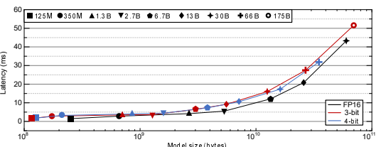

# Lut-Gemm: Quantizedmatrixmultiplication Based On Luts Forefficientinference In Large-Scalegenerativelanguagemodels

Gunho Park 1∗**, Baeseong Park**
2∗**, Minsub Kim**
2**, Sungjae Lee**
2**, Jeonghoon Kim**
2, Beomseok Kwon 2**, Se Jung Kwon**
2**, Byeongwook Kim**
2**, Youngjoo Lee**
1**, Dongsoo Lee**
2 1 Pohang University of Science and Technology 2 NAVER Cloud {gunho1123,youngjoo.lee}@postech.ac.kr {**baeseong.park,minssub.kim,sung-jae.lee,jeonghoon.samuel,**
beomseok.kwon,sejung.kwon,byeonguk.kim,dongsoo.lee}**@navercorp.com**

## Abstract

Recent advances in self-supervised learning and the Transformer architecture have significantly improved natural language processing (NLP), achieving remarkably low perplexity. However, the growing size of NLP models introduces a memory wall problem during the generation phase. To mitigate this issue, recent efforts have focused on quantizing model weights to sub-4-bit precision while preserving full precision for activations, resulting in practical speed-ups during inference on a single GPU. However, these improvements primarily stem from reduced memory movement, which necessitates a resource-intensive dequantization process rather than actual computational reduction. In this paper, we introduce LUT-GEMM, an efficient kernel for quantized matrix multiplication, which not only eliminates the resource-intensive dequantization process but also reduces computational costs compared to previous kernels for weight-only quantization. Furthermore, we proposed group-wise quantization to offer a flexible trade-off between compression ratio and accuracy. The impact of LUT-GEMM is facilitated by implementing high compression ratios through low-bit quantization and efficient LUT-based operations. We show experimentally that when applied to the OPT-175B model with 3-bit quantization, LUT-GEMM substantially accelerates token generation latency, achieving a remarkable 2.1× improvement on a single GPU when compared to OPTQ, which relies on the costly dequantization process. The code is available at **https://github.com/naver-aics/lut-gemm**

## 1 Introduction

Recent years have observed large-scale language models (LLMs) presenting state-of-the-art performance on various natural language process (NLP) tasks. Such rapid progress in NLP performance has been highly facilitated by the self-supervised learning methods, avoiding expensive manual labeling (Devlin et al., 2019; Baevski et al., 2020; Chen et al., 2020). Leveraging extensive training datasets, these models benefit from efficient sequence-to-sequence architectures like the Transformer model (Vaswani et al., 2017), leading to notable increases in model parameters. Previous studies (Brown et al., 2020; Kaplan et al., 2020; Hoffmann et al., 2022) have reported that LLM performance follows a predictable power-law scaling as a function of model size. Accordingly, in recent years, several large-scale generative language models, including GPT-3 (175B)
(Brown et al., 2020), HyperCLOVA (204B) (Kim et al., 2021a), Gopher (280B) (Rae et al., 2021),
Chinchilla (70B) (Hoffmann et al., 2022), Megatron Turing NLG (530B) (Smith et al., 2022), PaLM
(540B) (Chowdhery et al., 2022), and LLaMA (65B) (Touvron et al., 2023), have been proposed to further advance state-of-the-art performance. However, models with billions of parameters cannot be accommodated on a single GPU due to the limited memory size of GPUs, which is sacrificed ∗Equal contribution 

to enhance memory bandwidth (Migacz, 2017; Yu et al., 2017). To address such a concern, researchers have proposed to use model parallelism, which distributes computations over multiple GPUs through GPU-to-GPU communication (Shoeybi et al., 2019; Narayanan et al., 2021). Nevertheless, it is worth noting that model parallelism introduces additional overheads, stemming from the inter-GPU communication. Consequently, the performance gains achieved through model parallelism exhibit a sub-linear relationship with the number of GPUs employed.

To mitigate the challenges related to model parallelism, parameter quantization (Xu et al., 2018; Choi et al., 2017; McDonnell, 2018) presents a practical solution for minimizing model size, reducing the number of GPUs required for inference. Among the various quantization schemes, the preferred choice is quantizing both activations and weights to exploit integer-based arithmetic units
(Jacob et al., 2018; Wu et al., 2018; Lin et al., 2016). Nonetheless, this quantization method is practically limited to 8 bits, and non-linear operations (e.g., softmax and normalization) may yield imprecise results (Kim et al., 2021b; Bhandare et al., 2019). Moreover, to fully utilize integer arithmetic units, it is essential to implement on-the-fly activation quantization and dequantization, along with an accurate estimation of the activation distribution (Yao et al., 2022; Dettmers et al., 2022).

Recent research has proposed 4-bit weight-only quantization as an approach for memory compression (Frantar et al., 2022; Lin et al., 2023; Dettmers et al., 2023; Kim et al., 2023), involving on-thefly conversion to full-precision. While this sacrifices the computational benefits of using integer arithmetic, empirical findings in LLMs suggest that weight-only quantization can achieve significantly higher compression ratios for a given target accuracy compared to quantizing both weights and activations (Zeng et al., 2022). Various weight-only quantization methods have been proposed to improve the compression ratio while preserving accuracy, often accompanied by dedicated kernels for practical acceleration through quantization (Jeon et al., 2020; Frantar et al., 2022; Lin et al.,
2023).

In this paper, we present LUT-GEMM, a kernel designed to facilitate quantized matrix multiplications with quantized weights and full-precision activations. As shown in Figure 1, LUT-GEMM
addresses two issues prevalent in previous quantization approaches: 1) accuracy degradation due to quantized activations and 2) the need for additional dequantization implementation. LUT-GEMM
inherently accommodates quantized weights and full-precision activations, enabling the acceleration of the inference process while preserving the desired level of precision. Specifically, LUT-GEMM
employs the binary-coding quantization (BCQ) format (Rastegari et al., 2016) to capitalize on simple arithmetic operations. It is worth noting that BCQ was initially proposed to support non-uniform quantization, which relies on customized hardware for bit-level operations. To our knowledge, we are the first to show that prior uniform quantization can be reformulated in the form of BCQ, allowing LUT-GEMM to support both non-uniform and uniform quantization formats. Consequently, LUT-GEMM can execute a wide range of weight-only quantization schemes for matrix multiplications, achieving low inference latency and eliminating the need for on-the-fly dequantization.

Our major contributions in this work include the following: 1) We verify that BCQ is capable of representing both uniform and non-uniform weight quantization. 2) We show that LUT-GEMM,
using the BCQ format, offers a broad spectrum of latency and accuracy trade-offs, leveraging GPUspecific hardware utilization methods to implement various BCQ configurations efficiently. 3) For LLMs, we demonstrate that LUT-GEMM, which utilizes quantized weights without a dequantization process, can considerably accelerate matrix multiplications with small quantization bits while power consumption is greatly saved by reducing the number of GPUs. 4) Assuming a 3-bit BCQ format for weights of OPT-175B served by a single GPU, experimental results show that LUT-GEMM accelerates token generation latency by 2.1× compared to the OPTQ (Frantar et al., 2022).

## 2 Background 2.1 Gpu-Accelerated Generative Lms

For large LMs, the processing time of matrix multiplications dominates the entire inference latency because of higher time complexity compared to activation functions, normalization layers, and so on (Dettmers et al., 2022). Specifically, matrix multiplications account for at least 75% of the processing time for various LM sizes and input token lengths (see Appendix A). Note that due to the limited memory capacity of a single GPU, large LMs may need multiple GPUs, resulting in increased communication latency. GPUs are commonly adopted to accelerate inference as GPUs embed lots of arithmetic units and support multiple threads, critical for speeding up matrix multiplications (Narayanan et al., 2021; Migacz, 2017). However, extracting high performance from GPUs depends on arithmetic intensity, and therefore, the batch size should be large enough to ensure a high reuse ratio from main memory (Markidis et al., 2018).

## 2.2 Quantization Methods And Limitations

Various research efforts have been made to enhance the serviceability of large and heavy deep neural networks by improving their latency and throughput. These efforts include quantization (Rastegari et al., 2016; Jacob et al., 2018; Nagel et al., 2017; Xu et al., 2018; Chung et al.,
2020), pruning (Han et al., 2016; Zhu & Gupta, 2017; Gale et al., 2019), knowledge distillation
(Hinton et al., 2015; Polino et al., 2018), and low-rank approximation (N. Sainath et al., 2013; Chen et al., 2018; Edalati et al., 2021). Among these, quantization is the most extensively researched field, which involves using faster and more efficient computing units and reducing memory usage. Uniform quantization using an INT8 operator is particularly well-studied among the various quantization formats and is currently being actively applied in LLMs (Yao et al., 2022; Dettmers et al., 2022; Xiao et al., 2022).

INT8 arithmetic units, commonly found in contemporary computing systems, offer reduced latency
(thanks to their low hardware complexity) and decreased memory usage of up to 50% compared to FP16. Thus, present NVIDIA GPUs employ Tensor cores that support INT8 operations to accelerate computations (Markidis et al., 2018). However, the utilization of INT8 mandates the quantization of activations, which can pose a significant challenge in achieving compressed and accelerated models employing INT8 units. For instance, when scaling factors are determined offline, activation quantization may lead to a considerable reduction in model accuracy as outliers are approximated.

To address declining accuracy in quantizing LLMs, token-based dynamic quantization has emerged as a crucial technique (Yao et al., 2022; Dettmers et al., 2022). The LLM.int8() method
(Dettmers et al., 2022) addresses the systematic appearance of outliers in LLMs by proposing a decomposition method that conducts most computations in INT8 and dequantizes a limited number of outliers to FP16, resulting in only a marginal latency decrease in LLMs. SmoothQuant (Xiao et al.,
2022) takes an advanced approach by mathematically transferring activation variance (challenging to quantize due to outliers) to weights, which are relatively easier to quantize. This technique enables efficient computation using INT8 arithmetic units (i.e., W8A8), even when employing static quantization of activations. However, it should be noted that applying SmoothQuant in novel LLMs is necessary to empirically observe and validate the occurrence of outliers before applying the migration technique.

The utilization of INT8 precision introduces variability in its efficacy, primarily influenced by the specific characteristics of each phase within LLM inference. While the summarization phase exhibits a high likelihood of weight reuse, resulting in a compute-bound operation, the generation phase, due to its autoregressive nature, primarily involves a memory-bound workload. This intrinsic memory limitation restricts hardware throughput even with INT8 precision. Consequently, services generating a large number of tokens may experience only marginal performance gains with INT8 adoption.

Recent studies have focused on the inefficiency of the generation step and, in response, proposed the utilization of the W4A16 format (Frantar et al., 2022; Zeng et al., 2022; Dettmers et al., 2023; Kim et al., 2023), which compresses model weights into 4-bit integers without quantizing the activations as weights typically dominate memory size compared to activations. Given that current computing systems cannot accelerate the W4A16 format, OPTQ (Frantar et al., 2022) and AWQ
(Lin et al., 2023) solve such an issue by dynamically dequantizing weights to FP16 and then performing matrix multiplication. Leveraging the memory-bound nature of the generation step, this approach enhances generation latency by reducing memory movement despite the dequantization overheads.

## 2.3 Binary-Coding Quantization

Binary-coding quantization (BCQ) initially introduced by Xu et al. (2018), presents a compelling alternative to conventional uniform quantization methods. For instance, when a weight vector w (of size n) is quantized into q-bit by BCQ, w is approximated to be Pq i=1 αibi where αi ∈ R
+ is a scaling factor and bi **∈ {−**1, +1}
n is a binary vector. In this paper, we have chosen to employ BCQ
as our primary quantization technique for weights while retaining activations in full precision to address the challenges mentioned earlier. Moreover, we introduce an extension to BCQ, enhancing its capabilities to encompass both uniform quantization and group-wise quantization. This extension, outlined in the subsequent section, not only broadens BCQ's utility but also enables the applicability of LUT-GEMM to various quantization methods.

## 3 Design Methodology Of Lut-Gemm

LUT-GEMM is devised to develop high-performance, energy-efficient inference systems for LLMs.

To achieve this objective, LUT-GEMM incorporates several innovative approaches. Firstly, we employ a lookup table (LUT) based computation technique to mitigate redundant calculations caused by digitized binary weights after BCQ. Furthermore, since most non-uniform quantization methods involve complex operations with limited parallelism and often lack hardware support, we design LUT-GEMM to efficiently support BCQ formats. Our proposed kernel, LUT-GEMM, directly utilizes BCQ formats without additional overhead, such as dequantization. Secondly, we expand conventional BCQ methods by introducing a bias term, significantly enhancing representational capability. This simple yet profound enhancement enables the representation of both non-uniform and uniform quantization methods within the extended BCQ format, providing us with the flexibility to leverage various quantization techniques based on the specific requirements of LLMs. Finally, We further refine the implementation details of the binary-coding quantization scheme, enabling a tradeoff between compression ratio and quantization error to better exploit the characteristics of LLMs.

As a result, LUT-GEMM demonstrates reduced latency and/or a decreased number of GPUs required for LLM inference while inherently accommodating various weight-only quantization methods.

## 3.1 Lut Based Quantized Matrix Multiplication

Our quantization scheme, which utilizes BCQ format for weight-only quantization while maintaining full precision for activations, leads to duplicate and redundant partial computations in naive matrix multiplications. To illustrate, assume that a binary matrix B **∈ {−**1, +1}
4×6and an activation vector x ∈ R
6are given as

 +1 +1 −1 −1 −1 +1 +1 +1 −1 +1 +1 −1 +1 +1 −1 −1 −1 −1 −1 −1 +1 −1 −1 +1  B =   , x = [x1 x2 x3 x4 x5 x6] . (1)
Then, computing Bx⊤ (that is to be multiplied by scaling factors) would repeat (x1 + x2 − x3)
three times and (−x4 − x5 + x6) two times. Such redundant computations are caused by digitized elements of B, and thus, we expect more duplicated computations as the size of matrices increases according to the growth of model size. Moreover, loading each element of B requires bit-level memory accesses that can be slow for commercial CPUs and GPUs.

To efficiently perform Bx⊤ while avoiding bit-level memory accesses, we can pre-compute all possible combinations of full-precision activations and binary patterns. Note that a LUT has been widely used to save processing time when numerous computations yield outputs within a restricted set (de Queiroz & Stein, 2004; Meher, 2010; Jeon et al., 2020; Xu et al., 2021). LUT-based computation is justified, especially when retrieving a value from a LUT is much faster than carrying out the original calculations. BCQ format (without quantizing activations that require heavy modifications in training codes and model structure (Wu et al., 2018; Jacob et al., 2018)) is also useful to be implemented by LUT-based approaches. To construct a LUT, a hyperparameter µ is introduced, representing the sub-vector length of x. For example, to address redundant computation observed in Equation 1, we can pre-compute 8 (=2 3) possible values with every three elements in x and store those values in a LUT. Hence, µ is 3 in this example. Once 2 µ values of a LUT are generated by using a sub-vector of x, arithmetic operations to obtain partial dot products (of Bx⊤) are replaced with LUT retrieval operations while a key is given by concatenating µ binary elements of B. To complete Bx⊤ computation, as the final step, those partial products are summed and then multiplied by scaling factors. When the row dimension of B is enlarged (as generative LMs get larger), the utilization of a LUT increases due to more occurrences of redundant computations.

To quantify the reduction in computation, assume that a q-bit quantized (m × n) binary matrix Bi
(for i = 1, 2, 3**, . . . , q**) is multiplied with an (n × 1) input vector x using µ-width LUTs. The computational complexity of the LUT-based approach can be described as follows, when mq ≫ 2 µ:

$$C=C_{build}+C_{read}=\mathcal{O}\left(2^{\mu}\cdot\frac{n}{\mu}+m\cdot\frac{n}{\mu}\cdot q\right)\approx\mathcal{O}\left(m\cdot\frac{n}{\mu}\cdot q\right),\tag{2}$$

where Cbuild and Cread represent the complexity of building the LUT and reading a value from the LUT, respectively. Consequently, compared to the complexity of conventional matrix multiplication O(mn), LUT-GEMM can achieve a computational savings of qµ times by leveraging LUTs.

## 3.2 Lut Based Implementation On Gpu

In addition to the LUT-based scheme (eliminating redundant computations and bit-level memory accesses), our strategy for optimizing single-batch operations on GPUs is as follows: 1) To improve parallelism, we create as many threads as possible while each thread is allowed to perform independent LUT accesses. 2) Binary weights accessed by a thread can share a common scaling factor such that operations related to scaling factors do not degrade the performance of a thread. 3) If we allocate too small resources to a thread, then LUT utilization can be low, and synchronization overhead can increase. As such, we need to optimize thread configurations empirically. Figure 2 illustrates the overall LUT-GEMM implementation scheme on GPUs. For the sake of simplicity, we formulate the proposed quantized matrix multiplication as y =Pq i=1 (Ai ◦ (Bi· x)),
where A is an (m × 1) FP16 scaling matrix, B is an (m × n) FP16 binary matrix, x is an FP16 input vector of size n, and the operator ◦ indicates element-wise multiplication. For LUT-GEMM,
we assign l LUTs to a thread block (TB) of GPU. Then, the size of submatrix of B allocated to each TB becomes (th × tw) where tw = l × µ. Small th can increase the number of available threads while large th enhances LUT utilization inside a TB. Thus, th is empirically determined (2048 is a practical number for large-scale LMs). For q > 1, the entire process of Figure 2 can be iterated q times while intermediate results are accumulated. See Appendix B for implementation details.

3.3 REPRESENTATIONAL CAPABILITY OF LUT-GEMM
LUT-GEMM extends the BCQ format to support both non-uniform and uniform quantization methods, which are widely used in compressing LLM. In this section, we introduce extended BCQ format to enhance representational capability of LUT-GEMM.

Asymmetric Binary-Coding Quantization Conventional BCQ methods are basically limited to exhibiting symmetric quantization shape with respect to the zero point. Another constraint of BCQ methods stems from their inability to represent the value of zero due to the symmetric quantization properties. To enhance the representational capability of BCQ, we extend the conventional BCQ
method by including a bias term z as follows:

$${\hat{\mathbf{w}}}=\sum_{i=0}^{n}(\alpha_{i}\cdot\mathbf{b}_{i})+z,\ \mathbf{b}_{i}\in[-1,+1]^{n},$$
(αi· bi) + z, bi ∈ [−1, +1]n, (3)

 

where a weight vector (of size n) is decomposed into binary vector bi with associated scaling factors αi. As a result, the modified BCQ format, along with the inclusion of the bias term, can represent asymmetry quantization centered around z, as illustrated in Figure 3(a).

Uniform Quantization Incorporating a bias term into the BCQ format, we have discovered that the extended BCQ format can effectively represent uniform quantization by carefully adjusting the scaling factors and bias term, as visually depicted in Figure 3(b). See Appendix C for details of how asymmetric uniform quantization can be converted into symmetric BCQ with a bias term. In Figure 3, we can see that for q-bit quantization, the uniform quantization method employs a single scaling factor, while the non-uniform quantization technique calls for the use of q distinct scaling factors. Consequently, due to the incorporation of the extended binary-coding quantization format, our proposed LUT-based matrix multiplication scheme is applicable to both uniform quantization and binary-coding-based non-uniform quantization methods.

## 3.4 Latency-Accuracy Trade-Off For Improved Applicability

As the hidden size increases rapidly (e.g., dmodel = 12288 for GPT-3 175B) according to the advent of large-scale LMs, it would be more difficult to compute a proper scaling factor shared by a larger number of weights. As an alternative to row-wise quantization, group-wise quantization in which a scaling factor can be shared by an arbitrary number of weights is widely used to minimize quantization error (Frantar et al., 2022; Lin et al., 2023). To examine the latency variance of LUT-GEMM
with respect to group size g, we perform matrix multiplications (using an (m × n) matrix and an
(n × 1) matrix) when g values vary as shown in Figure 4(a). We observe a sufficiently large g, such as 128 and 256, can result in fast LUT-GEMM while accuracy improvement by group-wise is substantial. To gain insights into the underlying mechanisms, we analyze the memory footprint of LUT-GEMM because single-batch operations are primarily memory-bound and latency is proportional to the memory footprint. Let Sb and Sα represent the space complexity of binary weights and scaling factors, respectively. Then the overall space complexity S can be described as

$$S=S_{b}+S_{\alpha}={\cal O}\left(1\cdot m\cdot n\cdot q+16\cdot m\cdot\frac{n}{g}\cdot q\right)={\cal O}\left(m\cdot n\cdot q\left(1+\frac{16}{g}\right)\right).\tag{4}$$

As a consequence, when g ≫ 16, S becomes independent of g and can be approximated as O (m · n · q). To verify our claim that latency of LUT-GEMM is proportional to memory footprint
(when running single-batch operations), we explore various (**q, g**) pairs and their corresponding compression ratios and measure matrix multiplication latency when m = n = 12288 as depicted in Figure 4(b). Note that even if the number of quantization bits q is smaller, the memory footprint can be large when the group size g is small (i.e., more scaling factors are employed, see Appendix D).

Therefore, the additional search parameter g allows a fine-grained search space of compression ratio that is not available by q alone. Across all available compression ratios, latency is a function of compression ratio. For instance, if two different pairs (q1, g1) and (q2, g2) exhibit a similar memory footprint, then we can expect similar latency by LUT-GEMM.

 

## 4 Experimental Results

In this section, we present the experimental results obtained by utilizing LUT-GEMM across various levels of complexity, ranging from a single-layer experimental setup to the complete model level.

Initially, we examine the influence of LUT-GEMM on a specific layer, followed by an investigation into the inefficiency of tensor parallelism. Finally, we analyze the end-to-end latency of OPT models
(Zhang et al., 2022) to determine the overall effect of LUT-GEMM on performance.

## 4.1 Kernel Evaluation

Latency Comparisons with Various Kernels Table 1 shows latency measurements for the first layer of the Feed-Forward Network (FFN) in the OPT-175B model (Zhang et al., 2022). The measured kernels include cuBLAS (for FP-FP or INT-INT), OPTQ (Frantar et al., 2022), AWQ
(Lin et al., 2023) (for FP-INT), and LUT-GEMM (for FP-INT or FP-BCQ). Note that OPTQ and AWQ kernels involve dequantization followed by GEMM, while LUT-GEMM accepts quantized weights directly, eliminating the need for dequantization. We can observe that the latency of the INT8-INT8 (with cuBLAS) implementation only slightly improves latency over FP-FP since cuBLAS is not well-optimized for single batch operations. While OPTQ and AWQ achieve lower latency than cuBLAS due to reduced memory movement but are slower than LUT-GEMM due to dequantization overhead. Moreover, LUT-GEMM exhibits 2.6× reduction in computation compared to the previous GEMM kernels. Thus, the proposed LUT-GEMM kernel, which operates directly on quantized weights and reduces computational complexity, achieves the lowest latency among the kernels considered. Comparison with FP16 Tensor Parallelism Table 2 summarizes the profiling results of matrix multiplications performed by using cuBLAS (with tensor parallelism) or LUT-GEMM. GPU power and other metrics are collected by using *nvidia-smi* utility (Tiwari et al., 2015; Ali et al., 2020). We notice that tensor parallelism with additional GPUs in cuBLAS brings about a significant decrease in GPU utilization, memory bandwidth (BW) utilization, and computation latency ratios. As evidenced by the increase in the latency ratio of communication, such reductions in utilization indicate that some GPUs can be temporarily idle until all GPUs are synchronized. Accordingly, the speed-up that can be obtained by tensor parallelism is a lot smaller than the number of GPUs. As a result, cuBLAS with more GPUs causes increased energy consumption for matrix multiplications. On

| Table 1: Latency comparison of the first FFN layer on OPT-175B model with various precision and corresponding kernel selections with m = 12288 and g = 128 on A100-80GB-GPU. Precision for Data Type Latency (ms) Kernel (Speed up) Weight Input Output (4m × m) (m × 1) (4m × 1) cuBLAS FP32 FP32 FP32 1.4015 (×0.52) cuBLAS FP16 FP16 FP16 0.7256 (×1.00) cuBLAS INT8 INT8 INT32 0.6345 (×1.14) LUT-GEMM INT8* FP16 FP16 0.4620 (×1.57) OPTQ (Frantar et al., 2022) INT3 FP16 FP16 0.3599 (×2.02) AWQ (Lin et al., 2023) INT4 FP16 FP16 0.3238 (×2.24) LUT-GEMM INT4* FP16 FP16 0.2688 (×2.70) LUT-GEMM INT3* FP16 FP16 0.2250 (×3.22) * LUT-GEMM supports both non-uniform and uniform quantization.   |
|-----------------------------------------------------------------------------------------------------------------------------------------------------------------------------------------------------------------------------------------------------------------------------------------------------------------------------------------------------------------------------------------------------------------------------------------------------------------------------------------------------------------------------------------------------------------------------------------------------------------------------------------------------------------------------------------------------------|

the other hand, LUT-GEMM (with one GPU) can offer high speed-up (that cannot be achieved by tensor parallelism) while retaining high GPU/memory utilization. Combining low latency and a reduced number of GPUs, thus, LUT-GEMM substantially saves energy consumption for matrix multiplications.

| For LUT-GEMM, g = m and q is 2 or 4. Kernel-GPUs-m-q Comm. Speed   | GPU BW   | Memory    | Avg. Power   | Total   |             |                |
|--------------------------------------------------------------------|----------|-----------|--------------|---------|-------------|----------------|
| Ratio (%)                                                          | Up       | Util. (%) | Util. (%)    | (W/GPU) | Energy (mJ) |                |
| cuBLAS-1-12288-16                                                  | 0.00     | 1.00      | 96.57        | 98.37   | 215.70      | 161.85 (×1.00) |
| cuBLAS-8-12288-16                                                  | 38.58    | 3.45      | 52.48        | 24.27   | 172.44      | 299.96 (×1.85) |
| LUT-GEMM-1-12288-2                                                 | 0.00     | 4.85      | 88.63        | 58.38   | 280.85      | 43.49 (×0.27)  |
| LUT-GEMM-1-12288-4                                                 | 0.00     | 3.23      | 92.51        | 77.98   | 292.76      | 68.09 (×0.42)  |

## 4.2 End-To-End Latency

We now evaluate the end-to-end latency of inference with a single batch size, considering various LLaMA models with quantized weights while preserving full precision activations. Table 3 illustrates the end-to-end latency per token and perplexity when weights are uniformly quantized using AWQ method (Lin et al., 2023) . Additionally, the evaluation for OPT family models and LLaMA
family models can be found in Appendix Table 6 and Table 7, respectively, providing a comprehensive overview. Latency measurements are conducted within the FasterTransformer framework, exploring different GPU configurations to assess potential speed-up gains from model parallelism. From our observations, we can conclude the following: 1) Reducing the group size (g) effectively decreases perplexity, even when employing a simple RTN quantization scheme, at the cost of a marginal increase in latency, 2) Increasing the number of GPUs (and, consequently, parallelism) does not significantly reduce latency due to various overheads such as GPU-to-GPU communication cost, as described in Appendix A. In the case of LUT-GEMM, where matrix multiplications are accelerated, relative GPU-to-GPU communication overheads become more pronounced compared to cuBLAS, making model parallelism less effective. This highlights the prominence of communication overheads for high-performance matrix multiplication engines.

In the case of the LLaMA-30B model, end-to-end inference with FP16 weights can be executed on a single GPU (See Appendix Figure 8 for a latency comparison of various model sizes on a single GPU). However, for the LLaMA-65B model with FP16 weights, the model size exceeds the memory capacity of a single GPU (80GB for A100), necessitating model parallelism techniques. Nevertheless, when the weights of the LLaMA-65B model are quantized to 3 or 4 bits, as demonstrated to be a viable solution in (Frantar et al., 2022), inference can be accommodated on a single GPU. Assuming 3-bit quantization and the implementation of LUT-GEMM with g=128, a speed-up of 2.41× for LLaMA-30B (using one GPU) and 2.04× for LLaMA-66B (using two GPUs) is achievable. Note that when fine-tuning is performed after constructing a pre-trained model, more efficient quantization techniques such as AlphaTuning (Kwon et al., 2022) can enable even 2-bit quantization, as shown in Appendix Table 8. The efficacy of LUT-GEMM is further enhanced when combined with advanced quantization methods to reduce the number of quantization bits.

| implementations with AWQ quantization method and model parallelism on multiple GPUs. Model Kernel-q-g Quant. Perplexity Latency (ms) method Wiki2 1-GPU 2-GPU 4-GPU cuBLAS-16-N/A FP16 4.10 43.6 25.1 16.9 LLaMA LUT-GEMM-4-128 AWQ 4.23 20.7 15.5 12.2 30B LUT-GEMM-3-128 AWQ 4.88 18.1 13.7 11.2 cuBLAS-16-N/A FP16 3.53 OOM 46.9 29.1 LLaMA LUT-GEMM-4-128 AWQ 3.67 35.7 25.4 19.9 65B LUT-GEMM-3-128 AWQ 4.24 31.3 23.0 18.3   |
|------------------------------------------------------------------------------------------------------------------------------------------------------------------------------------------------------------------------------------------------------------------------------------------------------------------------------------------------------------------------------------------------------------------------------------|

## 5 Accelerating Quantized Opt-175B

Table 4 provides a comparison of the end-to-end latency for generating a token in OPT-175B, a representative large-scale LM, using the FasterTransformer framework. LUT-GEMM demonstrates its ability to decrease the number of GPUs needed for running inference, while concurrently reducing latency as q diminishes or as the number of GPUs rises. For OPT-175B with FP16, a minimum of 8 GPUs is necessary for executing inference. However, upon utilizing the BCQ format for quantization, LUT-GEMM is able to perform inference using just a single GPU, while maintaining a comparable overall latency. It should be noted that, when comparing identical 3-bit (weight-only and row-wise) quantization scenarios, the latency for token generation using LUT-GEMM is 2.1×
lower than that of the OPTQ library. This significant reduction in latency can be primarily attributed to LUT-GEMM's ability to directly accept quantized weights, thereby eliminating the need for dequantization.

| Latency per token (ms)   |          |       |          |       |       |      |
|--------------------------|----------|-------|----------|-------|-------|------|
| GPUs                     | Baseline | OPTQ  | LUT-GEMM |       |       |      |
| FP16                     | 3-bit    | 1-bit | 2-bit    | 3-bit | 4-bit |      |
| 1                        | OOM      | 106.5 | 30.4     | 40.1  | 51.6  | OOM  |
| 2                        | OOM      | N/A   | 25.2     | 30.1  | 35.8  | 41.2 |
| 4                        | OOM      | N/A   | 20.3     | 23.8  | 27.2  | 30.1 |
| 8                        | 42.4     | N/A   | 20.1     | 22.4  | 24.2  | 25.8 |

Let us demonstrate that the flexible features of LUT-GEMM (attributable to the extended BCQ
format) can accelerate existing uniform quantization methods. Table 5 shows the perplexity of OPT175B for various q and g configurations, as obtained using the OPTQ method (See Appendix Table 9 for a comprehensive accuracy evaluation at q = 3). The table also displays the corresponding latency (per generated token) achieved by LUT-GEMM (excluding FP16). The results clearly indicate that LUT-GEMM provides lower latency as q decreases, although an excessively small g may have a marginal adverse impact on latency. All in all, by integrating LUT-GEMM and OPTQ at the expense of an acceptable increase in perplexity, it is possible to reduce the number of GPUs required for running OPT-175B inference from eight GPUs to a single GPU while ensuring comparable latency. It is crucial to note that such an improvement in performance cannot be achieved when dequantization is included.

## 6 Summary And Limitations

In this paper, we introduce LUT-GEMM, a highly efficient matrix multiplication kernel designed to operate directly on quantized weights, thereby eliminating the need for an additional dequantization step. Leveraging an extended BCQ format, LUT-GEMM exhibits the capability to process both uniformly and non-uniformly quantized models, achieving 2.1× speedup over GPTQ. However,

Table 5: Perplexity of quantized OPT-175B using OPTQ and end-to-end latency per token by LUTGEMM for various q and g configurations. g of '-' indicates row-wise quantization.

Kernel q g PPL* Model size(GB)

(Comp. Ratio) Latency(ms)

cuBLAS 16 N/A 8.34 347.9 (×1.00) 42.4 (8-GPU)

| Kernel                                                                               | q   | g    | PPL*         | Model size(GB) (Comp. Ratio)   | Latency(ms)   |
|--------------------------------------------------------------------------------------|-----|------|--------------|--------------------------------|---------------|
| cuBLAS                                                                               | 16  | N/A  | 8.34         | 347.9 (×1.00)                  | 42.4 (8-GPU)  |
| 4                                                                                    | -   | 8.37 | 87.0 (×4.00) | OOM (1-GPU)                    |               |
| 3                                                                                    | -   | 8.68 | 65.3 (×5.33) | 51.6 (1-GPU)                   |               |
| 2                                                                                    | 32  | 8.94 | 54.4 (×6.40) | 55.2 (1-GPU)                   |               |
| 2                                                                                    | 64  | 9.18 | 48.9 (×7.11) | 47.5 (1-GPU)                   |               |
| 2                                                                                    | 128 | 9.58 | 46.2 (×7.53) | 46.5 (1-GPU)                   |               |
| * PPL numbers are extracted from the OPTQ reference (Frantar et al., 2022). LUT-GEMM |     |      |              |                                |               |

it is important to note some limitations: Our method primarily focuses on single-batch inference and exhibits diminishing performance gains as the batch size increases. This limitation is primarily attributed to the constrained memory bandwidth between core and LUTs in the shared memory. Nevertheless, we anticipate that this constraint will gradually diminish in significance with the advent of advanced hardware solutions.

## 7 Reproducibility Statement

In the Supplementary Materials, we furnish code for replicating our "Kernel Evaluation" experiments. Specifically, this entails:

- Offering our CUDA kernel alongside a concise benchmarking script for single matrixvector products.

- Supplying a README document that presents example commands and instructions for executing all the scripts.

## References

Ghazanfar Ali, Sridutt Bhalachandra, Nicholas Wright, Alan Sill, and Yong Chen. Evaluation of power controls and counters on general-purpose graphics processing units (gpus). 2020.

Alexei Baevski, Yuhao Zhou, Abdelrahman Mohamed, and Michael Auli. wav2vec 2.0: A framework for self-supervised learning of speech representations. *Advances in neural information processing systems*, 33:12449–12460, 2020.

Aishwarya Bhandare, Vamsi Sripathi, Deepthi Karkada, Vivek Menon, Sun Choi, Kushal Datta, and Vikram Saletore. Efficient 8-bit quantization of transformer neural machine language translation model. *arXiv:1906.00532*, 2019.

Tom Brown, Benjamin Mann, Nick Ryder, Melanie Subbiah, Jared D Kaplan, Prafulla Dhariwal, Arvind Neelakantan, Pranav Shyam, Girish Sastry, Amanda Askell, et al. Language models are few-shot learners. *Advances in neural information processing systems*, 33:1877–1901, 2020.

Patrick Chen, Si Si, Yang Li, Ciprian Chelba, and Cho-Jui Hsieh. GroupReduce: Block-wise lowrank approximation for neural language model shrinking. In Advances in Neural Information Processing Systems, 2018.

Ting Chen, Simon Kornblith, Mohammad Norouzi, and Geoffrey Hinton. A simple framework for contrastive learning of visual representations. In *International conference on machine learning*,
pp. 1597–1607. PMLR, 2020.

Yoojin Choi, Mostafa El-Khamy, and Jungwon Lee. Towards the limit of network quantization. In International Conference on Learning Representations (ICLR), 2017.

Aakanksha Chowdhery, Sharan Narang, Jacob Devlin, Maarten Bosma, Gaurav Mishra, Adam Roberts, Paul Barham, Hyung Won Chung, Charles Sutton, Sebastian Gehrmann, Parker Schuh, Kensen Shi, Sasha Tsvyashchenko, Joshua Maynez, Abhishek Rao, Parker Barnes, Yi Tay, Noam Shazeer, Vinodkumar Prabhakaran, Emily Reif, Nan Du, Ben Hutchinson, Reiner Pope, James
Bradbury, Jacob Austin, Michael Isard, Guy Gur-Ari, Pengcheng Yin, Toju Duke, Anselm Levskaya, Sanjay Ghemawat, Sunipa Dev, Henryk Michalewski, Xavier Garcia, Vedant Misra, Kevin Robinson, Liam Fedus, Denny Zhou, Daphne Ippolito, David Luan, Hyeontaek Lim, Barret Zoph, Alexander Spiridonov, Ryan Sepassi, David Dohan, Shivani Agrawal, Mark Omernick, Andrew M. Dai, Thanumalayan Sankaranarayana Pillai, Marie Pellat, Aitor Lewkowycz, Erica Moreira, Rewon Child, Oleksandr Polozov, Katherine Lee, Zongwei Zhou, Xuezhi Wang, Brennan Saeta, Mark Diaz, Orhan Firat, Michele Catasta, Jason Wei, Kathy Meier-Hellstern, Douglas Eck, Jeff Dean, Slav Petrov, and Noah Fiedel. Palm: Scaling language modeling with pathways, 2022. URL **https://arxiv.org/abs/2204.02311**.

Insoo Chung, Byeongwook Kim, Yoonjung Choi, Se Jung Kwon, Yongkweon Jeon, Baeseong Park, Sangha Kim, and Dongsoo Lee. Extremely low bit transformer quantization for on-device neural machine translation. In *Findings of the Association for Computational Linguistics: EMNLP 2020*,
pp. 4812–4826, 2020.
R.L. de Queiroz and P.A. Stein. LUT filters for quantized processing of signals. IEEE Transactions on Signal Processing, 52(3):687–693, 2004.

Tim Dettmers, Mike Lewis, Younes Belkada, and Luke Zettlemoyer. Llm. int8 (): 8-bit matrix multiplication for transformers at scale. *arXiv preprint arXiv:2208.07339*, 2022.

Tim Dettmers, Ruslan Svirschevski, Vage Egiazarian, Denis Kuznedelev, Elias Frantar, Saleh Ashkboos, Alexander Borzunov, Torsten Hoefler, and Dan Alistarh. Spqr: A sparse-quantized representation for near-lossless llm weight compression. *arXiv preprint arXiv:2306.03078*, 2023.

Jacob Devlin, Ming-Wei Chang, Kenton Lee, and Kristina Toutanova. BERT: Pre-training of deep bidirectional transformers for language understanding. In Proceedings of the 2019 Conference of the North American Chapter of the Association for Computational Linguistics: Human Language Technologies, Volume 1 (Long and Short Papers), pp. 4171–4186, 2019.

Ali Edalati, Marzieh Tahaei, Ahmad Rashid, Vahid Partovi Nia, James J. Clark, and Mehdi Rezagholizadeh. Kronecker decomposition for gpt compression, 2021.

Elias Frantar, Saleh Ashkboos, Torsten Hoefler, and Dan Alistarh. Optq: Accurate quantization for generative pre-trained transformers. In *The Eleventh International Conference on Learning* Representations, 2022.

Trevor Gale, Erich Elsen, and Sara Hooker. The state of sparsity in deep neural networks. arXiv preprint arXiv:1902.09574, 2019.

Song Han, Huizi Mao, and William J. Dally. Deep compression: Compressing deep neural networks with pruning, trained quantization and Huffman coding. In International Conference on Learning Representations (ICLR), 2016.
Geoffrey Hinton, Oriol Vinyals, and Jeff Dean. Distilling the knowledge in a neural network. In NIPS Deep Learning and Representation Learning Workshop, 2015.

Jordan Hoffmann, Sebastian Borgeaud, Arthur Mensch, Elena Buchatskaya, Trevor Cai, Eliza Rutherford, Diego de Las Casas, Lisa Anne Hendricks, Johannes Welbl, Aidan Clark, et al. Training compute-optimal large language models. *arXiv preprint arXiv:2203.15556*, 2022.

Benoit Jacob, Skirmantas Kligys, Bo Chen, Menglong Zhu, Matthew Tang, Andrew Howard, Hartwig Adam, and Dmitry Kalenichenko. Quantization and training of neural networks for efficient integer-arithmetic-only inference. In Proceedings of the IEEE Conference on Computer Vision and Pattern Recognition, pp. 2704–2713, 2018.

Yongkweon Jeon, Baeseong Park, Se Jung Kwon, Byeongwook Kim, Jeongin Yun, and Dongsoo Lee. Biqgemm: matrix multiplication with lookup table for binary-coding-based quantized dnns. In *SC20: International Conference for High Performance Computing, Networking, Storage and* Analysis, pp. 1–14. IEEE, 2020.

Jared Kaplan, Sam McCandlish, Tom Henighan, Tom B. Brown, Benjamin Chess, Rewon Child, Scott Gray, Alec Radford, Jeffrey Wu, and Dario Amodei. Scaling laws for neural language models. *arXiv:2001.08361*, 2020.

Boseop Kim, HyoungSeok Kim, Sang-Woo Lee, Gichang Lee, Donghyun Kwak, Jeon Dong Hyeon, Sunghyun Park, Sungju Kim, Seonhoon Kim, Dongpil Seo, et al. What changes can large-scale language models bring? intensive study on hyperclova: Billions-scale korean generative pretrained transformers. In *Proceedings of the 2021 Conference on Empirical Methods in Natural* Language Processing, pp. 3405–3424, 2021a.

Sehoon Kim, Amir Gholami, Zhewei Yao, Michael W Mahoney, and Kurt Keutzer. I-bert: Integeronly bert quantization. In *International conference on machine learning*, pp. 5506–5518. PMLR,
2021b.

Sehoon Kim, Coleman Hooper, Amir Gholami, Zhen Dong, Xiuyu Li, Sheng Shen, Michael W
Mahoney, and Kurt Keutzer. Squeezellm: Dense-and-sparse quantization. arXiv preprint arXiv:2306.07629, 2023.

Se Jung Kwon, Jeonghoon Kim, Jeongin Bae, Kang Min Yoo, Jin-Hwa Kim, Baeseong Park, Byeongwook Kim, Jung-Woo Ha, Nako Sung, and Dongsoo Lee. Alphatuning: Quantizationaware parameter-efficient adaptation of large-scale pre-trained language models. In *Findings of* EMNLP 2022, 2022.

Jung Hyun Lee, Jeonghoon Kim, Se Jung Kwon, and Dongsoo Lee. Flexround: Learnable rounding based on element-wise division for post-training quantization. *arXiv preprint arXiv:2306.00317*, 2023.
Darryl Lin, Sachin Talathi, and Sreekanth Annapureddy. Fixed point quantization of deep convolutional networks. In *International Conference on Machine Learning*, pp. 2849–2858, 2016.

Ji Lin, Jiaming Tang, Haotian Tang, Shang Yang, Xingyu Dang, and Song Han. Awq:
Activation-aware weight quantization for llm compression and acceleration. arXiv preprint arXiv:2306.00978, 2023.

Stefano Markidis, Steven Wei Der Chien, Erwin Laure, Ivy Bo Peng, and Jeffrey S Vetter. Nvidia tensor core programmability, performance & precision. In 2018 IEEE international parallel and distributed processing symposium workshops (IPDPSW), pp. 522–531. IEEE, 2018.
Mark D. McDonnell. Training wide residual networks for deployment using a single bit for each weight. In *International Conference on Learning Representations (ICLR)*, 2018.

Pramod Kumar Meher. LUT optimization for memory-based computation. *IEEE Transactions on* Circuits and Systems II: Express Briefs, 57(4):285–289, 2010.

Szymon Migacz. 8-bit inference with TensorRT. In *NVIDIA GPU Technology conference*, 2017.

Tara N. Sainath, Brian Kingsbury, Vikas Sindhwani, Ebru Arisoy, and Bhuvana Ramabhadran. Lowrank matrix factorization for deep neural network training with high-dimensional output targets.

In *ICASSP*, pp. 6655–6659, 2013.

Markus Nagel, Rana Ali Amjad, Mart van Baalen, Christos Louizos, and Tijmen Blankevoort. Up or down? adaptive rounding for post-training quantization. In International Conference on Machine Learning (ICML), pp. 7696–7705, 2017.

Deepak Narayanan, Mohammad Shoeybi, Jared Casper, Patrick LeGresley, Mostofa Patwary, Vijay Korthikanti, Dmitri Vainbrand, Prethvi Kashinkunti, Julie Bernauer, Bryan Catanzaro, et al.

Efficient large-scale language model training on gpu clusters using megatron-lm. In *Proceedings of the International Conference for High Performance Computing, Networking, Storage and* Analysis, pp. 1–15, 2021.

Denis Paperno, Germ´an Kruszewski, Angeliki Lazaridou, Quan Ngoc Pham, Raffaella Bernardi, Sandro Pezzelle, Marco Baroni, Gemma Boleda, and Raquel Fern´andez. The lambada dataset, August 2016. URL **https://doi.org/10.5281/zenodo.2630551**.

Antonio Polino, Razvan Pascanu, and Dan Alistarh. Model compression via distillation and quantization. In *International Conference on Learning Representations (ICLR)*, 2018.

Jack W. Rae, Sebastian Borgeaud, Trevor Cai, Katie Millican, Jordan Hoffmann, Francis Song, John Aslanides, Sarah Henderson, Roman Ring, Susannah Young, Eliza Rutherford, Tom Hennigan, Jacob Menick, Albin Cassirer, Richard Powell, George van den Driessche, Lisa Anne Hendricks, Maribeth Rauh, Po-Sen Huang, Amelia Glaese, Johannes Welbl, Sumanth Dathathri, Saffron Huang, Jonathan Uesato, John Mellor, Irina Higgins, Antonia Creswell, Nat McAleese, Amy Wu, Erich Elsen, Siddhant Jayakumar, Elena Buchatskaya, David Budden, Esme Sutherland, Karen Simonyan, Michela Paganini, Laurent Sifre, Lena Martens, Xiang Lorraine Li, Adhiguna Kuncoro, Aida Nematzadeh, Elena Gribovskaya, Domenic Donato, Angeliki Lazaridou, Arthur Mensch, Jean-Baptiste Lespiau, Maria Tsimpoukelli, Nikolai Grigorev, Doug Fritz, Thibault Sottiaux, Mantas Pajarskas, Toby Pohlen, Zhitao Gong, Daniel Toyama, Cyprien de Masson d'Autume, Yujia Li, Tayfun Terzi, Vladimir Mikulik, Igor Babuschkin, Aidan Clark, Diego de Las Casas, Aurelia Guy, Chris Jones, James Bradbury, Matthew Johnson, Blake Hechtman, Laura Weidinger, Iason Gabriel, William Isaac, Ed Lockhart, Simon Osindero, Laura Rimell, Chris Dyer, Oriol Vinyals, Kareem Ayoub, Jeff Stanway, Lorrayne Bennett, Demis Hassabis, Koray Kavukcuoglu, and Geoffrey Irving. Scaling language models: Methods, analysis & insights from training gopher.

arXiv:2112.11446, 2021.
Mohammad Rastegari, Vicente Ordonez, Joseph Redmon, and Ali Farhadi. XNOR-Net: Imagenet classification using binary convolutional neural networks. In *ECCV*, 2016.

Mohammad Shoeybi, Mostofa Patwary, Raul Puri, Patrick LeGresley, Jared Casper, and Bryan Catanzaro. Megatron-lm: Training multi-billion parameter language models using model parallelism. *arXiv preprint arXiv:1909.08053*, 2019.

Shaden Smith, Mostofa Patwary, Brandon Norick, Patrick LeGresley, Samyam Rajbhandari, Jared Casper, Zhun Liu, Shrimai Prabhumoye, George Zerveas, Vijay Korthikanti, et al. Using deepspeed and megatron to train megatron-turing nlg 530b, a large-scale generative language model.

arXiv preprint arXiv:2201.11990, 2022.

Devesh Tiwari, Saurabh Gupta, George Gallarno, Jim Rogers, and Don Maxwell. Reliability lessons learned from gpu experience with the titan supercomputer at oak ridge leadership computing facility. In *Proceedings of the International Conference for High Performance Computing, Networking,*
Storage and Analysis, pp. 1–12, 2015.

Hugo Touvron, Thibaut Lavril, Gautier Izacard, Xavier Martinet, Marie-Anne Lachaux, Timoth´ee Lacroix, Baptiste Rozi`ere, Naman Goyal, Eric Hambro, Faisal Azhar, et al. Llama: Open and efficient foundation language models. *arXiv preprint arXiv:2302.13971*, 2023.

Ashish Vaswani, Noam Shazeer, Niki Parmar, Jakob Uszkoreit, Llion Jones, Aidan N Gomez, Łukasz Kaiser, and Illia Polosukhin. Attention is all you need. Advances in neural information processing systems, 30, 2017.
Shuang Wu, Guoqi Li, Feng Chen, and Luping Shi. Training and inference with integers in deep neural networks. In *International Conference on Learning Representations (ICLR)*, 2018.

Guangxuan Xiao, Ji Lin, Mickael Seznec, Julien Demouth, and Song Han. Smoothquant:
Accurate and efficient post-training quantization for large language models, 2022. URL
https://arxiv.org/abs/2211.10438.

Chen Xu, Jianqiang Yao, Zhouchen Lin, Wenwu Ou, Yuanbin Cao, Zhirong Wang, and Hongbin Zha.

Alternating multi-bit quantization for recurrent neural networks. In *International Conference on* Learning Representations (ICLR), 2018.

Shiyu Xu, Qi Wang, Xingbo Wang, Shihang Wang, and Terry Tao Ye. Multiplication through a single look-up-table (LUT) in CNN inference computation. *IEEE Transactions on ComputerAided Design of Integrated Circuits and Systems*, pp. 1–1, 2021.

Zhewei Yao, Reza Yazdani Aminabadi, Minjia Zhang, Xiaoxia Wu, Conglong Li, and Yuxiong He.

Zeroquant: Efficient and affordable post-training quantization for large-scale transformers. arXiv preprint arXiv:2206.01861, 2022.

Jiecao Yu, Andrew Lukefahr, David Palframan, Ganesh Dasika, Reetuparna Das, and Scott Mahlke.

Scalpel: Customizing DNN pruning to the underlying hardware parallelism. In *Proceedings of* the 44th Annual International Symposium on Computer Architecture, pp. 548–560, 2017.

Aohan Zeng, Xiao Liu, Zhengxiao Du, Zihan Wang, Hanyu Lai, Ming Ding, Zhuoyi Yang, Yifan Xu, Wendi Zheng, Xiao Xia, Weng Lam Tam, Zixuan Ma, Yufei Xue, Jidong Zhai, Wenguang Chen, Peng Zhang, Yuxiao Dong, and Jie Tang. Glm-130b: An open bilingual pre-trained model, 2022. URL **https://arxiv.org/abs/2210.02414**.

Susan Zhang, Stephen Roller, Naman Goyal, Mikel Artetxe, Moya Chen, Shuohui Chen, Christopher Dewan, Mona Diab, Xian Li, Xi Victoria Lin, Todor Mihaylov, Myle Ott, Sam Shleifer, Kurt Shuster, Daniel Simig, Punit Singh Koura, Anjali Sridhar, Tianlu Wang, and Luke Zettlemoyer. OPT: Open pre-trained transformer language models. *arXiv:2205.01068*, 2022.

Michael Zhu and Suyog Gupta. To prune, or not to prune: exploring the efficacy of pruning for model compression. *CoRR*, abs/1710.01878, 2017.

## A Llm Inference Latency Breakdown

Figure 5 presents a detailed breakdown of latency for various large-scale generative language models (LMs), specifically OPT models ranging from 6.7B to 175B parameters. This analysis considers different numbers of input tokens and was conducted on an A100 (80GB) GPU using the FasterTransformer inference framework developed by Nvidia1. The OPT models are built upon the Transformer architecture Vaswani et al. (2017) and consist of identical layers. Each layer incorporates multi-head attention and a feed-forward network, both involving four primary linear computations with relatively higher time complexity compared to other non-linear operations. Consequently, matrix multiplications constitute a substantial portion, accounting for at least 75% of the processing time across various LM sizes and input token lengths. Note that we can observe the emergence of GPU communication overhead in larger models. This is primarily attributable to the limited memory capacity of a single GPU, which necessitates communication between GPUs to accommodate the larger models.

## B Detailed Implementation

Each TB first conducts pre-computation using partial x values assigned in order to fill up the l number of LUTs. Then l LUTs can be shared by all threads inside a TB (so as to mitigate costly global memory accesses) and multiple rows of a submatrix of B can be processed by multiple threads (so as to improve throughput). When threads finish retrieving and summing LUT values, scaling factors are fetched (only once for each thread) and multiplied to produce partial outputs. Finally, n l×µ partial outputs are accumulated across TBs (through **atomicAdd** operations, as illustrated in Figure 2) to generate the final outputs. LUTs are stored in shared memory inside GPU and the shared memory presents high bandwidth (e.g., 19TB/s for A100). Thus, high memory accesses for LUTs
(while multiple FLOPs can be replaced with one LUT access) enable fast matrix computations. As for the memory size of LUTs, only 1KB is required for every 8 hidden dimensions and the shared memory size is more than a few megabytes (e.g., 20MB for A100 with 192KB per SM and 108 SMs available). Thus, the whole LUTs can be safely stored in shared memory. To illustrate, the hidden dimension can be up to 324,000 for A100 while 12,288 is the hidden dimension for GPT-3 175B.

## C Conversion Of Uniform Quantization Into Bcq

A q-bit uniformly quantized weight wˆ with a scaling factor s can be expressed (prior to conversion)
as follows:

$${\hat{w}}=s\sum_{i=0}^{q-1}2^{i}\ {\hat{\mathbf{b}}}_{i}+{\hat{z}},\ {\hat{\mathbf{b}}}_{i}\in[0,1].$$
i bˆi + ˆz, bˆi ∈ [0, 1]. (5)
$$({\mathfrak{H}})$$

Then, wˆ can be rewritten as:

$$\hat{w}=\frac{1}{2}s\sum_{i=0}^{q-1}2^{i}\cdot2\hat{\mathbf{b}}_{i}+\hat{z}=\sum_{i=0}^{q-1}\frac{1}{2}s\cdot2^{i}(2\hat{\mathbf{b}}_{i}-1)+\sum_{i=0}^{q-1}\frac{1}{2}s\cdot2^{i}+\hat{z},\tag{6}$$

Given that a binary weight b in the BCQ format can be defined as b = 2ˆb − 1, we obtain

$$\hat{w}=\sum_{i=0}^{q-1}(2^{i-1}s\cdot\mathbf{b}_{i})+\sum_{i=0}^{q-1}\frac{1}{2}s\cdot2^{i}+\hat{z}),\tag{7}$$  which can be interpreted as a special case of BCO, where $\alpha_{i}=2^{i-1}s$ and $z=\sum_{i=0}^{q-1}\frac{1}{2}s\cdot2^{i}+\hat{z}=\sum_{i=0}^{q-1}\alpha_{i}+\hat{z}$ in Equation 3.  
In detail, to construct the binary weights and scaling factors from the pre-trained weights, we introduce a two-step methodology. Initially, scaling factors and integer weights are generated via a uniform quantization method (Frantar et al., 2022; Lin et al., 2023; Lee et al., 2023) as described in Equation 5. Subsequently, the integer weights are transformed into binary weights using bitwise operations, as described in Equation 7. More precisely, the scaling factors αi and binary weights biin BCQ format for the i-th bit position are computed as 2 i−1s and 2bˆi − 1 respectively. Here, s and bˆi denote the scaling factor and the binary value at the i-th bit position of the integer weight in uniform quantization, respectively.

## D Impact On Compression Ratio

Let q be the number of quantization bits. For a given q, a smaller group size g can lower quantization error at the expense of an increased memory footprint for scaling factors. Then, the target quantization error serves as a constraint for determining a compromise between q and g, thus resulting in a range of achievable compression ratios. In other words, due to the introduction of g, we can control the amount of scaling factors and binary vectors as a trade-off process. Note that the memory footprint of conventional row-wise quantization techniques is dominated by the size of binary vectors because the size of scaling factors can usually be ignored if the column width of a matrix is large enough. Compared to the conventional scheme, our proposed group-wise BCQ provides a new wide search space for quantization formats to meet a target compression ratio.

Figure 6 shows an example with two (**g, q**) configurations to quantize an (4 × 8) matrix. Indeed, even if the number of quantization bits is smaller, the memory footprint can be large when the group size g is small (i.e., more scaling factors are employed).

Figure 6: Group-wise BCQ example with two different (**g, q**) configurations to quantize an (4 × 8)
matrix. Assuming a scaling factor of 16 bits, smaller q can yield a larger memory footprint if g is also small.

## E Exploration Of Compression Ratio

To study the capability of group-wise BCQ to enlarge search space for compression, we conduct experiments on three pre-trained OPT models Zhang et al. (2022), which are publicly available2.

Specifically, we apply post-training quantization (with an iterative solver introduced in Xu et al.

2**https://huggingface.co/facebook/opt-30b**
(2018)) to pre-trained OPT models while g and q vary. Then, each quantized model is evaluated on the LAMBADA Paperno et al. (2016) dataset to find the relationship between compression ratio and accuracy. Figure 7 shows accuracy and compression ratio3 when we try various q values and g values. From Figure 7, we observe that compared to the conventional row-wise quantization, group-wise BCQ offers new optimal configurations. Thus, to achieve the best compression ratio (or minimum accuracy degradation), it is necessary to explore different q and g values simultaneously for a given target. Note that for OPT-13B and OPT-30B, as we discussed the limits of row-wise quantization for large-scale LMs, a small g value is critical to achieving low accuracy degradation
(while latency is not heavily affected by a small g). All in all, the effects of q and g on accuracy differ with each model such that q and g are hyper-parameters to be optimized.

Accuracy (%)
Figure 7: Accuracy and compression ratio with the various combinations of quantization bits (q) and group size (g). Three pre-trained OPT models are quantized (by post-training BCQ method) and then evaluated on the LAMBADA dataset.

## F Additional Experimental Results

This section contains additional experimental results.

| Table 6: Comparison of perplexity and end-to-end latency per token for OPT family models. Model Kernel-q-g Quant. Perplexity Latency (ms) method Wiki2 PTB LAMBADA 1-GPU 2-GPU 4-GPU cuBLAS-16-N/A FP16 9.56 11.84 15.84 40.5 23.5 14.7 LUT-GEMM-4-32 RTN 9.71 12.02 16.16 18.5 14.3 11.9 LUT-GEMM-4-64 RTN 9.88 12.05 16.17 17.8 13.9 11.8 LUT-GEMM-3-32 RTN 10.78 13.89 19.21 16.7 13.3 11.6 LUT-GEMM-3-64 RTN 14.61 24.63 31.13 15.7 12.6 11.2 OPT 30B cuBLAS-16-N/A FP16 9.34 11.36 15.47 OOM 48.4 28.3 LUT-GEMM-4-32 RTN 9.54 11.55 15.83 33.5 23.5 18.5 LUT-GEMM-4-64 RTN 9.54 11.63 15.91 31.9 23.2 17.8 LUT-GEMM-3-32 RTN 18.82 35.76 42.16 30.5 21.5 16.9 LUT-GEMM-3-64 RTN 51.15 130.54 130.19 27.5 20.9 16.0 OPT 66B   |
|-----------------------------------------------------------------------------------------------------------------------------------------------------------------------------------------------------------------------------------------------------------------------------------------------------------------------------------------------------------------------------------------------------------------------------------------------------------------------------------------------------------------------------------------------------------------------------------------------------------------------------------------------------------------------------------------------------------------------------------|

| Table 7: Comparison of perplexity and end-to-end latency per token for LLaMA family models. Model Kernel-q-g Quant. Perplexity Latency (ms) method Wiki2 1-GPU 2-GPU 4-GPU cuBLAS-16-N/A FP16 5.68 10.0 7.6 5.6 LLaMA LUT-GEMM-4-128 AWQ 5.96 6.1 5.4 5.7 7B LUT-GEMM-3-128 AWQ 7.01 5.5 5.1 5.3 cuBLAS-16-N/A FP16 5.09 18.2 12.0 8.6 LLaMA LUT-GEMM-4-128 AWQ 5.25 10.4 8.0 6.9 13B LUT-GEMM-3-128 AWQ 5.88 9.3 7.1 6.4 cuBLAS-16-N/A FP16 4.10 43.6 25.1 16.9 LLaMA 30B LUT-GEMM-4-128 AWQ 4.23 20.7 15.5 12.2 LUT-GEMM-3-128 AWQ 4.88 18.1 13.7 11.2 cuBLAS-16-N/A FP16 3.53 OOM 46.9 29.1 LLaMA LUT-GEMM-4-128 AWQ 3.67 35.7 25.4 19.9 65B LUT-GEMM-3-128 AWQ 4.24 31.3 23.0 18.3 * PPL numbers are extracted from the AWQ reference (Lin et al., 2023).   |
|-----------------------------------------------------------------------------------------------------------------------------------------------------------------------------------------------------------------------------------------------------------------------------------------------------------------------------------------------------------------------------------------------------------------------------------------------------------------------------------------------------------------------------------------------------------------------------------------------------------------------------------------------------------------------------------------------------------------------------------------------------------------|

Figure 8: End-to-end latency comparison between FP16 and quantized OPT models on a single A100 80GB GPU with g = 128. Note that the latency data for the OPT-66B and OPT-175B models in FP16, as well as the OPT-175B model in 4-bit quantization, are omitted due to Out Of Memory
(OOM) constraints.

| Table 8: Accuracy achieved with 2-bit AlphaTuning on the MNLI dataset. Model Method g Acc. (%) mm Acc. (%) Full fine-tune - 87.5 87.4 2048 85.0 84.9 1024 85.1 85.1 256 85.3 85.6 128 85.7 86.2 64 86.3 86.6 32 86.5 87.1 OPT-1.3B AlphaTuning Full fine-tune - 88.5 88.4 1280 85.5 86.0 256 86.8 87.7 128 87.3 87.8 64 87.4 87.9 32 87.6 88.4 OPT-2.7B AlphaTuning   |
|-----------------------------------------------------------------------------------------------------------------------------------------------------------------------------------------------------------------------------------------------------------------------------------------------------------------------------------------------------------------------|

18

| Table 9: Accuracy of quantized OPT-175B using OPTQ (without group quantization) and the corresponding end-to-end latency per token by LUT-GEMM. Kernel q Perplexity Accuracy (%) Model size (GB) (Comp. ratio) Latency (ms) Wiki2 PTB C4 PIQA cuBLAS 16 8.34 12.01 10.13 81.07 347.9 (×1.00) 42.4 (8-GPU) LUT-GEMM 3 8.68 12.86 10.67 80.03 65.3 (×5.33) 51.6 (1-GPU) * PPL and accuracy numbers are extracted from the OPTQ reference (Frantar et al., 2022).   |
|---|
