# Outlier Suppression: Pushing The Limit Of Low-Bit Transformer Language Models

Xiuying Wei1, 2 , Yunchen Zhang2, 4 , Xiangguo Zhang2, Ruihao Gong**1, 2**,
Shanghang Zhang3, Qi Zhang2, Fengwei Yu2**, Xianglong Liu**1∗
1State Key Lab of Software Development Environment, Beihang University 2SenseTime Research, 3Peking University 4University of Electronic Science and Technology of China
{weixiuying, zhangyunchen, zhangxiangguo, gongruihao}@sensetime.com shanghang@pku.edu.cn, xlliu@buaa.edu.cn

## Abstract

Transformer architecture has become the fundamental element of the widespread natural language processing (NLP) models. With the trends of large NLP models, the increasing memory and computation costs hinder their efficient deployment on resource-limited devices. Therefore, transformer quantization attracts wide research interest. Recent work recognizes that structured outliers are the critical bottleneck for quantization performance. However, their proposed methods increase the computation overhead and still leave the outliers there. To fundamentally address this problem, this paper delves into the inherent inducement and importance of the outliers. We discover that γ in LayerNorm (LN) acts as a sinful amplifier for the outliers, and the importance of outliers varies greatly where some outliers provided by a few tokens cover a large area but can be clipped sharply without negative impacts. Motivated by these findings, we propose an outlier suppression framework including two components: Gamma Migration and Token-Wise Clipping. The Gamma Migration migrates the outlier amplifier to subsequent modules in an equivalent transformation, contributing to a more quantization-friendly model without any extra burden. The Token-Wise Clipping takes advantage of the large variance of token range and designs a token-wise coarse-to-fine pipeline, obtaining a clipping range with minimal final quantization loss in an efficient way. This framework effectively suppresses the outliers and can be used in a plug-and-play mode. Extensive experiments prove that our framework surpasses the existing works and, for the first time, pushes the 6-bit posttraining BERT quantization to the full-precision (FP) level. Our code is available at https://github.com/wimh966/outlier_suppression.

## 1 Introduction

Transformer [1] has been one of the most common architectures in natural language processing along with lots of popular self-supervised models, such as BERT [2], RoBERTa [3], XLNet [4] and BART
[5]. While these pre-trained models have demonstrated a significant superiority in performance, the memory and computation overheads have been a popular concern, particularly in the real development.

Therefore, model compression [6, 7, 8, 9] has attracted much attention from both academia and industry. Among them, quantization [10, 11, 12, 13, 14, 15, 16, 17, 18, 19, 20], working in the low-precision arithmetic fashion, is one of the key approaches to compress large models and fit them into the lightweight devices.

∗Corresponding author.

These days, researchers focus more on quantization of Transformer-based models. [21] proposes an 8-bit quantization scheme for BERT-like models. [22] advises a group-wise quantization technique and analyzes mixed-precision using second-order Hessian information. [23, 24] combine distillation with quantization. [25] approximates nonlinear operations to implement integer-only quantization.

Nonetheless, few studies investigate the inherent bottleneck of quantizing Transformer-based models. Recently, some papers [26, 27] indicate that the Transformer-based models hold significantly large outliers (even close to 100) and these extreme outliers behave in structured patterns (mainly gather at a few embedding dimensions and even become larger on unique tokens). These special outliers can bring devastating damage to the quantization performance (e.g., a 12% drop even for the 8-bit [26]). To combat this challenge, existing method [26] chooses bypassing solutions such as a finer quantization granularity. However, this scheme causes an increased computation cost and unavoidably hinders the acceleration effect.

In this paper, to suppress the outliers rather than walk around them, we make an in-depth analysis to investigate the inducement of the outliers and the impact of clipping the outliers. For the inducement, we find that the scaling parameter γ in the LayerNorm structure works as an outlier amplifier, which amplifies the outliers in the output. By extracting it, the activation becomes more robust for quantization. Then by further studying the clipping impact, we discover that the influence of final performance when clipping the outliers varies greatly, where some more aggressive outliers covering a large area can be clipped safely without accuracy degradation, but the accuracy can drop suddenly when the important outliers are clipped. More interestingly, though those less important outliers might present in a long tail form, they are only provided by a few tokens. Motivated by the analysis, we propose an outlier suppression framework to push the limit of low-bit Transformer language models. Such framework contains two key components: Gamma Migration and Token-Wise Clipping, corresponding to the above two findings. The Gamma Migration produces a more quantization-friendly model by migrating the outlier amplifier γ into subsequent modules in an equivalent transformation and bringing more robust activation for quantization without extra computation burden. The Token-Wise Clipping further efficiently finds a suitable clipping range with minimal final quantization loss in a coarse-to-fine procedure. The coarse-grained stage, which leverages the fact that those less important outliers only belong to a few tokens, can obtain a preliminary clipping range quickly in a token-wise manner. The fine-grained stage then optimizes it. Our proposed framework can be applied to different models and tasks, and coupled with existing methods. More essentially, the thought of outlier suppression shall shed new light on the study of NLP quantization.

To summarize, our contributions are as follows:
1. We delve into the inducement and clipping impact of outliers in the NLP models and draw two critical findings that help handle the bottleneck of transformer quantization.

2. Based on the findings, an outlier suppression framework containing Gamma Migration and TokenWise Clipping is proposed. This framework is efficient, easy to implement, and plug-and-play.

3. The Gamma Migration suppresses the outliers from the inducement aspect and produces a more quantization-friendly model without any extra inference time. It transfers the outlier amplifier in LayerNorm to the subsequent modules in an equivalent transformation and contributes to activation with less quantization error.

4. The Token-Wise Clipping scheme suppresses the outliers from the aspect of importance and produces a superior clipping range efficiently. It can skip over those unimportant outliers quickly leveraging the large variance of token range and then focus on the influential area.

5. Extensive experiments on various NLP models (BERT, RoBERTa, BART) and tasks (text classification, question answering, and summarization) prove that our outlier suppression framework sets up a new state of the art for transformer quantization, and for the first time, pushes the 6-bit post-training quantization (PTQ) and 4-bit quantization-aware training (QAT) accuracy of BERT to the full-precision level.

## 2 Preliminaries

Basic Notations. We mark matrices as X and vectors as x. Operator · denotes scalar multiplication, and  is adopted for element-wise multiplication on matrices or vectors. Also, we use W x as

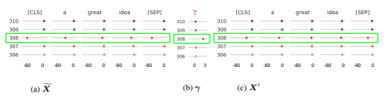

$$(1)$$

Figure 1: Presentation of outliers over Xf, γ and X0of LayerNorm on BERT-SST-2. For example, at dimension 308, γ and Xfboth have sharper values. By excluding γ, it can be seen that X0holds milder distribution than Xf. More evidence is put in Sec. D.1.

matrix-vector multiplication. Specifically, considering the tokens in NLP tasks, Xt,j stands for the element at token t and embedding j, and xt represents the embedding of token t.

Quantizer. Quantization usually includes two operations.

$${\bar{x}}=c l i p(\lfloor{\frac{x}{s}}\rfloor+z,\,0,\,2^{b}-1),\quad{\hat{x}}=({\bar{x}}-z)\cdot s$$

where s (step size), z (zero point) are quantization parameters, b is the bit setting. The first operation called "Quant" maps continuous numbers (x) to discrete points (x¯) for integer-arithmetic-only matrix computation. The second operation called "DeQuant" recovers it to xˆ after multiplication.

## 3 Outlier Analysis

For Transformer-based models, standard 6/8-bit PTQ or 4-bit QAT would cause severe accuracy degradation. Investigating each quantizer, we recognize that the output of LayerNorm structures and GELU functions hold some sharp outliers, which should be responsible for the large quantization error. Evidence and experimental results in Sec. B.2.

To deeply investigate the relationship between the harmful outliers and quantization performance, we explore the underlying inducement and impact of clipping the outliers. Before that, some brief descriptions (see Sec. C.1 for detailed ones) about the outliers are given first to help understand the following two parts. The outliers show structured characteristics that they mainly gather at some certain embedding dimensions, and upon these dimensions, the outliers provided by unique tokens like the separate toke and comma even hold more aggressive values.

## 3.1 Inducement Of Outliers

For the inducement of outliers, we find that the scaling parameter in LayerNorm amplifies the outliers from embedding dimensions. And the phenomenon that some tokens have sharper outliers might be caused by the uneven token frequency in the pre-training phase (see Sec. C.2). In this part, we mainly explain the first inducement to solve these outliers from the origin. For another one, due to the high cost of adjusting the pre-training, we discuss the clipping impact in the next part to suppress these outliers from the clipping perspective.

Considering the challenges of quantizing the LayerNorm, the natural action is to dive into its internal structure. For token t at j th embedding dimension, it first normalizes the input using mean (ut) and variance (σ 2 t
) each forward pass, then scales and shifts the value with parameter γj and βj .

$$\mathbf{LayerNorm}:\quad{\widetilde{X}}_{t,j}={\frac{X_{t,j}-u_{t}}{\sqrt{\sigma_{t}^{2}+\epsilon}}}\cdot\gamma_{j}+\beta_{j}$$

Then, by observing the parameter distribution of LayerNorm, we surprisingly find that the multiplier γ (Fig. 1b) and the output Xf (Fig. 1a) hold outliers at the same embedding dimensions. Besides, the adder β denotes a smaller range (e.g., (0,3)) compared to the output range (e.g., (-60, 0)), so we

$$(2)$$

ignore it for identifying the key point. That is to say, γ plays a crucial part for the outliers in Fig. 1a, especially can amplify the outliers across tokens by serving as a shared parameter.

This observation enlightens us to remove the amplification effect by extracting γ from Eq. (2) and use the Non-scaling LayerNorm Eq. (3).

Non - scaling LayerNorm : X0
  **Norm : $\mathbf{X}^{\prime}_{t,j}=\frac{\mathbf{X}_{t,j}-\mathbf{u}_{t}}{\sqrt{\mathbf{\sigma}_{t}^{2}+\epsilon}}+\frac{\mathbf{\beta}_{j}}{\gamma_{j}}$** (3)
Fig. 1c and Fig. 1a show that the output of the Non-scaling LayerNorm denotes a milder distribution with weaker outliers than the normal one. It not only coincides with that γ does strengthen the outliers but also reveals that X0 behaves more friendly than Xffor quantization.

To quantitatively validate the more quantization-friendly distribution X0 holds, we adopt the cosine similarity metric to evaluate the quantization loss. From Table 1, the second row with higher similarity, namely less quantization error, explains that the quantization performance can be improved using Non-scaling LayerNorm.

| Tensor   | 0     | 1     | 2     | 3     | 4     | 5     | 6     | 7     | 8     | 9     | 10    | 11    |
|----------|-------|-------|-------|-------|-------|-------|-------|-------|-------|-------|-------|-------|
| Xf       | 97.16 | 97.03 | 97.61 | 94.37 | 93.41 | 93.53 | 93.31 | 93.61 | 94.56 | 95.62 | 96.13 | 98.57 |
| X0       | 99.23 | 99.22 | 99.11 | 99.02 | 98.99 | 99.00 | 98.99 | 98.83 | 98.70 | 99.05 | 99.44 | 99.07 |

Table 1: Cosine similarity (%) of the quantized value (6-bit) and the real signal for Xf and X0across 12 LayerNorm after Multi-Head Attention on BERT-SST-2. Higher is better. More evidence in Sec. D.1.

## 3.2 Impact Of Outlier Clipping

In this part, we explore the impact of clipping the outliers to design a method that can find an appropriate clipping range for quantization. The experiments are designed for the clipping impact on the accuracy and token of FP models.

Impact on accuracy. When clipping the outliers and evaluating the final performance, we find that the importance of outliers is highly varied. Take the outliers after GELU as an example here (others in Sec. D.2), Fig. 2 shows that clipping the more aggressive outliers sharply (clipping signals in 10-100 to 10) even does not hurt the full-precision performance with accuracy still at 91.02, while the accuracy drops suddenly to 85.93 with too many outliers cut.

Impact on token. Another key point is the unimportant outliers which can be clipped without even any accuracy drop in FP models only correspond to a few tokens. Motivated by [26], they refer that the separator token [SEP] attends to larger values. We are also aware of the different ranges provided by different tokens. From the red points in Fig. 2, which represents the proportion of clipped tokens, it can be clearly seen that the more aggressive outliers though occupy a large range from 10 to 100 only matches with 3% tokens. Destroying those sharper outliers belonging to a few tokens will not affect the performance.

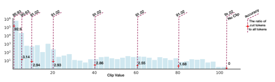

The former investigation of accuracy impact suggests us taking the final performance into account to find a superior clipping range, where some local optimization methods like [28] are not suitable here.

The latter finding in token impact encourages us to leverage the token's indication to quickly skip over the unimportant area, especially when it presents in a long tail form where some methods like [29] suffer low efficiency. Based on these, we will introduce our method in Sec. 4.2.

## 4 Method

In this section, we propose our outlier suppression framework based on the above analysis. Firstly, the Gamma Migration technique is adopted to obtain a more quantization-friendly model by migrating the gamma into subsequent modules. Secondly, the Token-Wise Clipping further finds a suitable clipping range efficiently by leveraging the large variance of the token range.

## 4.1 Gamma Migration

5
As pointed out in Sec. 3.1, activation without going through the scaling parameter provides less
quantization error. In this way, we split the LayerNorm function, migrate γ into follow-up structures
and quantize the output of the Non-scaling LayerNorm. The transformation is equivalent for the FP
model and brings more robust activation for the low-bit one. The overall flow is illustrated in Fig. 3.
Migration equivalence on FP model. Naturally, as referred in Eq. (3), we extract the parameter γ
and transform the LayerNorm into Non-scaling one, thus seperate X0
t,j from Xft,j .
$${\widetilde{\mathbf{X}}}_{t,j}=\mathbf{X}_{t,j}^{\prime}\cdot\gamma_{j}$$
t,j · γj (4)
Since the residual connection is frequently adopted after LayerNorm ([30, 31, 32]), it is necessary
to illustrate the way to migrate parameter γ into two branches. To be specific, considering the
LayerNorm after Multi-Head Attention (Fig. 3), γ will be excluded from the LayerNorm and moved
to the shortcut branch and weight of the next layer. Then the LayerNorm becomes the Non-scaling
one, the shortcut branch establishes a new parameter γ, and the weight of the next layer can absorb the γ. Now, we show how the weight absorbs γ. For linear layers, we have the following equation:
$$\mathbf{W}(\mathbf{x}\odot\begin{bmatrix}\gamma_{1}\\ \gamma_{2}\\...\\ \gamma_{n}\end{bmatrix})=(\mathbf{W}\odot\begin{bmatrix}\gamma_{1}&\gamma_{2}&...&\gamma_{n}\\ \gamma_{1}&\gamma_{2}&...&\gamma_{n}\\...&&\\ \gamma_{1}&\gamma_{2}&...&\gamma_{n}\end{bmatrix})\mathbf{x},\tag{5}$$
where x serves as a column vector and γ ∈ R
n. The proof is available in Appendix A. Because γ is a shared parameter, each token's embedding satisfies Eq. (5), which promises success of transferring the γ into the next layer's weight.

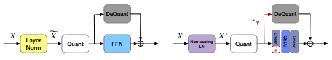

Figure 3: Comparison of the quantization flow before (left) and after (right) Gamma Migration. The original LayerNorm = the Non-scaling LayerNorm * γ. For other detailed applications such as LayerNorm in encoderdecoder structure, see Fig. 6, Fig. 7.

Quantization after migration. Deriving from the above equivalent transformation, we outline the quantization pattern after the migration process. From Fig. 3, the "Quant" process is employed at X0, then the quantized output engages in the matrix multiplication on one branch, multiplies parameter γ and experiences the "DeQuant" process on another branch. In fact, this means delaying the γ calculation from LayerNorm to the shortcut branch. Hence, this new design will not increase the computation overhead.

Effect of migration. We then analyze the effect of Gamma Migration on weight and activation, respectively, to reveal that the activation quantization burden has been greatly alleviated with relatively a slight influence on weight. To begin with, suppose that the absolute max range of output in the original LayerNorm is |max(X0)| ∗ |max(γ)| for the reason that outliers emerge at the same embedding dimensions among γ, activation before X0and after Xf scaling function. For activation, extracting the γ will reduce the activation range by |max(γ)| times. And the results in Table 1 have already validated the profit the transformation brings to activation. For weight, the weight matrix does not have the same embedding outlier phenomenon as the activation. Therefore, the weight range will not be amplified |max(γ)| times after the migration. Experimentally, we also calculate the cosine similarity for the changed weight and observe that γ has little impact on weight (Table 2).

| Tensor          | 0     | 1     | 2     | 3     | 4     | 5     | 6     | 7     | 8     | 9     | 10    | 11    |
|-----------------|-------|-------|-------|-------|-------|-------|-------|-------|-------|-------|-------|-------|
| original weight | 99.95 | 99.95 | 99.95 | 99.95 | 99.95 | 99.95 | 99.95 | 99.95 | 99.95 | 99.95 | 99.95 | 99.95 |
| changed weight  | 99.95 | 99.95 | 99.95 | 99.90 | 99.90 | 99.92 | 99.94 | 99.95 | 99.95 | 99.95 | 99.91 | 99.94 |

Table 2: Cosine similarity (%) between the quantized value (6-bit) and the real signal for original weight and the changed weight across 12 Intermediate layers on BERT-SST-2. It can be seen that there is little disparity between the two rows, especially compared with Table 1.

## 4.2 Token-Wise Clipping

Based on the analysis, we propose the Token-Wise Clipping method which considers the final loss when finding a clipping range and takes a coarse-to-fine paradigm to minimize it efficiently in a token-wise manner.

Regarding the very different accuracy impact of clipping the outliers, we search the clipping range, equivalently the step size s, which has the minimal distance between the final quantized output ˆf(s)
and the real one f defined as Eq. (6). To implement the process efficiently, especially when the unimportant outliers cover a wide area, a coarse-to-fine paradigm is designed below.

$$L(s)=\|{\hat{f}}(s)-f\|_{F}^{2},$$
F , (6)
Coarse-grained Stage. At this stage, our aim is to quickly skip over the area where clipping causes little accuracy influence. According to Sec. 3.2, the long tail area only matches with a few tokens.

Therefore, we suggest using the max value of the embedding at token t to be its representatives (min value as representatives for negative outliers). A new tensor with T elements can be constructed by taking out the maximum signal for each token:
o u = {max(x1), max(x2)*, ... , max*(xT )}, (7)
where o uis marked as the collection of upper bounds, o las the collection of lower bounds.

Then for a clipping ratio α on o u, calculate the corresponding clipping value c uand use it to cut the tensor.

c u = *quantile*(o u, α), (8)
where the quantile function computes the α-th quantiles of o u.

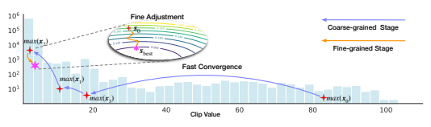

```
Through grid search of token-wise clipping ratio, step size s =
                                                                c
                                                                 u−c
                                                                     l
                                                                2
                                                                  b−1
                                                                      (b is the bit-width) with minimal

```

quantization loss Eq. (6) is obtained. We mark it as s0 for later optimization.

Fine-grained Stage. At this stage, our aim is to make some fine-grained adjustments in the critical area to further provide a guarantee for the final effect. In detail, with the initialization s0, a learning procedure based on gradient descent is used to update parameter s towards loss L(s) with learning rate η, as described in Eq. (9).

$$s=s-\eta{\frac{\partial L(s)}{\partial s}}$$
$$(9)$$
∂s (9)
Benefits. We mainly explain the benefits of the coarse-grained stage here from efficiency and quantization performance, where the experimental comparisons with other existing approaches are put in Sec. D.3. For efficiency, because the wide range of outliers only corresponds to a few tokens, passing through the unimportant area from the token perspective needs much fewer iterations than from the value perspective. Moreover, the representative collection reduces the size of the tensor
(o u distilled from X), so the method can run very fast each iteration. For quantization performance, the first coarse step has already produced a suitable clipping range (Sec. 5.2), which offers a good initialization point for upcoming tuning.

## 5 Experiments

In this section, we conduct two sets of experiments to verify the effectiveness of our outlier suppression framework. Sec. 5.2 shows the effect of each component. Sec. 5.3 lists the results compared with other existing approaches across text classification, question answering, and summarization tasks. On the whole, we evaluate GLUE benchmark [33], SQuAD [34, 35], and XSum [36] and CNN/DailyMail [37] across BERT, RoBERTa, and BART models. Here, 4-4-4 presents 4-bit weight, embedding, and activation. And the model size under a certain bit is put in Table 17.

## 5.1 Experimental Setup

Implementation details. To begin with, we identify the quantization nodes and take a reasonable scheme like the one in FasterTransformer [38] (Details see Sec. B.1). For PTQ, equipping our framework, we use 256 samples to calibrate the model. For QAT, our methods work on the calibration phase and later are combined with LSQ+ [12], a strong baseline for the training phase. For training, hyper-parameters like learning rate are searched both for our methods and baseline techniques for fair comparisons. Details see Appendix F.

Baseline. For PTQ, we compare with the prevalent calibration mechanisms including MinMax [39],
OMSE [28], Percentile [29], EasyQuant [40] and PEG [26]. For QAT, we present the results of Q-BERT [22], Q8BERT [21] and PEG [26]. Also, because our framework applying in QAT is coupled with LSQ+ [12], we show the results of the pure LSQ+, and another canonical quantization approach PACT [41]. Last but not least, the results combined with knowledge distillation (KD)
proposed in TernaryBERT [23] are included as well.

## 5.2 Ablation Study

In this subsection, we ablate the design elements in the proposed framework (Table 3). As a general plug-in module, Gamma Migration helps both the MinMax and Token-Wise Clipping. And the Token-Wise Clipping also surpasses the baseline by a large margin: 17.53% on QNLI,
13.22% on MRPC (comparisons with other calibration algorithms see Sec. D.3). About the phenomenon that the fine-grained stage sometimes does not improve much upon the coarse-grained one, we think it's due to the already good enough results produced by the coarse step.

Besides, Fig. 5 conveys that with a good initialization point provided by our framework, the training of QAT becomes much faster and easier.

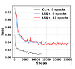

| Method                                | CoLA       | MNLI        | MRPC        | QNLI     | QQP         | RTE   | SST-2          | STS-B       |
|---------------------------------------|------------|-------------|-------------|----------|-------------|-------|----------------|-------------|
| (Matt.)                               | (acc m/mm) | (f1/acc)    | (acc)       | (f1/acc) | (acc)       | (acc) | (Pear./Spear.) |             |
| FP32                                  | 62.50      | 87.75/87.23 | 93.1/90.44  | 92.68    | 88.78/91.6  | 80.51 | 95.18          | 91.04/90.72 |
| Baseline (MinMax)                     | 0.0        | 34.9/35.0   | 71.64/67.4  | 62.13    | 51.88/74.37 | 49.82 | 77.87          | 44.11/46.74 |
| MinMax + Gamma Migration              | 0.0        | 53.53/54.64 | 87.97/82.84 | 78.56    | 78.04/85.3  | 55.6  | 85.67          | 61.03/63.22 |
| Token-Wise Clipping (Coarse)          | 34.95      | 80.56/80.84 | 85.05/79.41 | 79.46    | 85.96/89.31 | 66.43 | 91.63          | 82.03/82.45 |
| Token-Wise Clipping                   | 37.64      | 81.13/81.26 | 85.59/79.9  | 79.66    | 85.83/89.26 | 64.62 | 91.63          | 83.10/83.51 |
| Gamma Migration + Token-Wise Clipping | 46.35      | 83.38/83.32 | 87.50/83.33 | 86.82    | 86.82/90.01 | 67.51 | 92.2           | 86.83/86.93 |

Table 3: Results of our proposed Gamma Migration and Token-Wise Clipping for RoBERTa with 6-bit PTQ.

## 5.3 Main Results 5.3.1 Results On Classification Tasks

Method Bits CoLA MNLI MRPC QNLI QQP RTE SST-2 STS-B **Avg.**

(W-E-A) (Matt.) (acc m/mm) (f1/acc) (acc) (f1/acc) (acc) (acc) (Pear./Spear.)

BERT 32-32-32 59.60 84.94/84.76 91.35/87.75 91.84 87.82/90.91 72.56 93.35 89.70/89.28 83.83

MinMax 8-8-8 57.08 82.77/83.47 89.90/85.78 90.76 87.84/90.74 69.68 92.78 86.83/88.56 82.28

OMSE [28] 8-8-8 57.15 84.04/84.29 90.10/85.78 91.12 87.64/90.54 72.20 93.23 87.90/88.65 82.90 Ours 8-8-8 **61.64 84.38/84.53 91.44/87.75 91.49 87.92/90.77 72.20 93.81 89.23/89.01 83.96**

OMSE 6-6-6 35.44 74.00/73.30 81.54/76.47 84.66 76.07/82.12 64.26 86.27 85.57/86.05 73.52

Percentile [29] 6-6-6 37.32 72.40/71.69 85.09/79.90 79.37 72.58/80.19 61.73 87.27 86.38/87.29 72.93 EasyQuant [40] 6-6-6 38.16 75.82/75.66 82.51/77.45 84.94 75.31/81.81 65.34 87.27 85.50/86.33 74.49

Ours 6-6-6 **54.40 82.02/81.69 87.45/83.33 89.82 84.69/88.94 70.76 91.86 88.65/88.55 81.19**

PEG [26] ♣ 8-8-8 59.43 81.25 88.53 **91.07 89.42** 69.31 92.66 87.92 82.45

Ours ♣ 8-8-8 **59.83 82.93/82.59 91.33/87.99** 90.02 87.45/90.34 **70.04 92.66 88.42/88.81 82.81**

PEG ♣ 6-6-6 9.46 32.44/32.77 83.64/78.43 49.46 29.93/62.97 **70.76** 90.14 52.79/53.22 54.11

Ours ♣ 6-6-6 **42.27 78.54/78.32 85.33/81.13 85.36 78.47/84.66** 68.59 **91.74 87.33/87.19 77.31**

RoBERTa 32-32-32 62.50 87.75/87.23 93.1/90.44 92.68 88.78/91.6 80.51 95.18 91.04/90.72 86.40

MinMax 8-8-8 41.62 87.52/86.88 91.56/88.48 92.11 88.60/91.44 76.90 94.82 91.00/90.66 82.94 OMSE 8-8-8 38.59 87.32/87.14 92.39/89.46 92.51 87.95/90.95 76.53 94.61 90.95/90.65 82.58

Ours 8-8-8 **62.50 87.61/87.31 92.39/89.46 92.53 88.64/91.49 78.34 94.95 91.08/90.73 85.96**

OMSE 6-6-6 1.81 72.89/72.65 85.38/78.68 76.53 85.24/88.94 64.26 91.17 80.81/81.99 69.63 Percentile 6-6-6 20.73 72.23/73.68 84.83/78.43 77.16 82.21/87.44 62.82 88.19 79.41/79.64 70.98

EasyQuant 6-6-6 9.28 74.96/75.87 84.31/76.47 74.04 85.52/89.12 62.45 89.56 80.89/82.38 70.01

Ours 6-6-6 **46.35 83.38/83.32 87.50/83.33 86.82 86.82/90.01 67.51 92.2 86.83/86.93 79.62**

BART 32-32-32 56.32 86.45/86.55 91.37/87.50 92.31 88.34/91.39 79.06 93.35 90.11/89.94 84.61

MinMax 8-8-8 55.38 85.87/86.14 89.44/85.29 91.20 88.07/91.24 77.98 93.69 89.90/89.73 83.89

OMSE 8-8-8 54.56 85.6/86.25 90.31/86.27 90.74 88.21/91.3 78.7 93.58 90.07/89.88 83.94

Ours 8-8-8 **55.53 86.28/86.17 90.40/86.52 91.47 88.25/91.35 80.51 93.92 90.20/89.95 84.50** OMSE 6-6-6 31.06 41.92/42.08 56.37/54.36 52.72 78.96/86.02 51.99 87.39 84.38/85.69 61.01

Percentile 6-6-6 26.21 74.72/75.29 83.52/74.26 53.71 82.64/87.48 67.15 87.96 63.99/65.01 67.31

EasyQuant 6-6-6 25.66 43.48/43.27 59.26/59.56 50.76 81.89/87.67 52.71 87.73 85.39/86.74 61.31 Ours 6-6-6 **44.51 82.46/82.98 86.41/80.88 86.34 83.60/88.45 71.12 90.94 87.56/87.38 79.10**

PTQ. Table 4 shows the results of PTQ on GLUE tasks. For 8-bit BERT models, although previous methods generally behave well, our methods can still achieve satisfying outcomes even on small datasets such as CoLA (4.49% upswings) and STS-B (1.33% upswings). To fully exploit the limit, we try a more inspiring setting with weight and activation quantized to 6-bit. It can be seen that ours is indeed close to FP value within 2.64% overall. Meanwhile, we also compare with PEG [26] fairly by taking their quantization nodes. To be noted, their per-embedding-group (PEG) quantization certainly brings extra computation overhead and might not be available on real deployment while ours brings favorable results and can enjoy lossless acceleration on hardware. Besides, the experimental results on RoBERTa and BART consistently demonstrate our superiority whereas existing methods suffer from a non-negligible accuracy drop. On average, ours achieves up to 8.64% and 11.79%
better accuracy on RoBERT and BART. To conclude, our proposed methods push the limit of 6-bit quantization to a new state of the art.

8 QAT. In particular, we prove the compatibility of our methods on QAT. Table 5 lists the results on BERT, other see Sec. D.4. In a much harder setting (4-4-4 bit quantization), our outlier suppression framework wins near-floating-point performance with a reduction of 2.70% on average on 4-bit quantization. Yielding a good initialization, ours obtain an acceptable accuracy drop (0.7% on QQP, 1.7% on MNLI) without any distillation and data augmentation trick, versus 4.19% and 3.16%
of LSQ+. Furthermore, ours still enables performance improvements working with knowledge distillation, especially at 2-bit weight and embedding.

| Method      | Bits     | CoLA       | MNLI        | MRPC        | QNLI     | QQP         | RTE   | SST-2          | STS-B           | Avg.   |
|-------------|----------|------------|-------------|-------------|----------|-------------|-------|----------------|-----------------|--------|
| (W-E-A)     | (Matt.)  | (acc m/mm) | (f1/acc)    | (acc)       | (f1/acc) | (acc)       | (acc) | (Pear./Spear.) |                 |        |
| BERT        | 32-32-32 | 59.60      | 84.94/84.76 | 91.35/87.75 | 91.84    | 87.82/90.91 | 72.56 | 93.35          | 89.70/89.28     | 83.83  |
| Q8BERT [21] | 8-8-8    | 58.48      | -           | 89.56/-     | 90.62    | 87.96/-     | 68.78 | 92.24          | 89.04/-         | -      |
| Q-BERT [22] | 8-4-8    | -          | 78.08/78.96 | -           | -        | -           | -     | 85.55          | -               | -      |
| PACT [41]   | 4-4-8    | 55.23      | 83.98/83.90 | 91.58/88.24 | 91.12    | 88.19/91.20 | 71.84 | 91.86          | 89.73/89.27     | 82.89  |
| LSQ+ [12]   | 4-4-8    | 57.70      | 84.17/84.02 | 89.75/85.78 | 91.27    | 88.18/91.16 | 70.76 | 91.97          | 89.74/89.3      | 82.84  |
| PEG [26]    | 4-4-8    | 57.42      | 84.22/84.52 | 89.90/85.78 | 90.46    | 88.15/91.25 | 67.87 | 92.78          | 89.36/88.95     | 82.45  |
| Ours        | 4-4-8    | 61.06      | 84.82/84.89 | 91.26/87.75 | 91.41    | 88.45/91.40 | 73.65 | 92.55          | 89.71/89.24     | 84.05  |
| PEG         | 4-4-4    | 0.0        | 35.45/35.22 | 81.22/68.38 | 49.46    | 0.0/63.18   | 52.71 | 76.26          | nan/nan         | -      |
| PACT        | 4-4-4    | 0.0        | 74.17/74.85 | 84.97/80.15 | 87.31    | 81.68/86.14 | 62.09 | 83.03          | 81.64/81.43     | 69.37  |
| LSQ+        | 4-4-4    | 0.0        | 81.40/81.97 | 88.34/83.82 | 88.10    | 83.11/87.24 | 64.62 | 82.34          | 84.16/83.75     | 71.49  |
| Ours        | 4-4-4    | 50.56      | 83.05/83.24 | 89.08/84.31 | 89.88    | 87.00/90.33 | 70.76 | 91.86          | 87.64/87.36     | 81.13  |
| PEG ♣ ∗     | 4-4-8    | 57.22      | 83.69       | 87.77       | 91.29    | 89.64       | 70.04 | 92.32          | 89.13           | 82.64  |
| Ours ♣      | 4-4-8    | 59.57      | 85.00/84.31 | 91.07/87.75 | 91.31    | 88.35/91.32 | 72.20 | 92.43          | 89.57/89.20     | 83.60  |
| PEG ♣       | 4-4-4    | 0.0        | 35.45/35.22 | 31.62/0.0   | 49.46    | 0.0/63.18   | 52.71 | 49.08          | -0.0219/-0.0199 | 29.25  |
| Ours ♣      | 4-4-4    | 51.93      | 83.03/83.24 | 89.39/85.05 | 90.33    | 87.38/90.62 | 72.56 | 91.74          | 88.36/87.91     | 81.76  |
| LSQ+(+KD)   | 4-4-4    | 14.98      | 83.59/84.06 | 92.47/89.46 | 91.16    | 87.96/91.01 | 67.87 | 85.55          | 84.17/83.96     | 75.99  |
| Ours(+KD)   | 4-4-4    | 56.67      | 84.50/84.65 | 91.61/88.24 | 91.45    | 88.59/91.42 | 74.37 | 92.55          | 89.13/88.78     | 83.56  |
| LSQ+(+KD)   | 2-2-4    | 9.44       | 83.45/83.38 | 88.03/82.60 | 90.66    | 87.1/90.36  | 55.60 | 83.60          | 36.69/35.89     | 66.63  |
| Ours(+KD)   | 2-2-4    | 47.02      | 84.56/84.31 | 90.97/87.25 | 90.83    | 88.08/91.12 | 65.70 | 91.86          | 86.12/85.78     | 80.56  |

Table 5: Comparison among different QAT strategies with low-bit activation on GLUE benchmark for BERT. ♣:
results taking the same quantization nodes with PEG [26] for fair comparisons. ∗: combined score for MNLI,
MRPC, QQP and STS-B.

## 5.3.2 Results On Question Answering Tasks

To demonstrate the wider applicability of our methods, we evaluate them on SQuAD datasets. When going down to 6-bit quantization, the performance of other methods drastically drops. Ours still outperforms them by over 4.73% and 15.55% on BERT and RoBERTa on SQuAD v1.1. Also, the boost can be 12.31% and 4.96% on RoBERTa and BART on SQuAD v2.0.

## 5.3.3 Results On Summarization Tasks

It is of high value to validate the effect of our methods on summarization tasks. We choose classical datasets CNN/DailyMail and XSum and report the ROUGE 1/2/L score of BART. Table 7 illustrates that our approaches also benefit the encoder-decoder models, and can bring a near-floating-point performance on 8-bit and about 4% enhancement on 6-bit.

| Method          | Bits       | BERT        | RoBERTa     | BART        |             |             |             |
|-----------------|------------|-------------|-------------|-------------|-------------|-------------|-------------|
| (W-E-A)         | SQuAD v1.1 | SQuAD v2.0  | SQuAD v1.1  | SQuAD v2.0  | SQuAD v1.1  | SQuAD v2.0  |             |
| Full Prec.      | 32-32-32   | 88.28/80.82 | 77.34/73.60 | 92.25/85.83 | 83.30/80.26 | 91.63/84.79 | 80.82/77.41 |
| OMSE [28]       | 8-8-8      | 87.90/80.16 | 76.88/73.08 | 91.48/84.53 | 82.53/79.41 | 90.49/83.11 | 79.62/76.12 |
| Ours            | 8-8-8      | 87.60/79.80 | 76.93/73.14 | 91.57/84.86 | 82.94/79.72 | 91.08/84.07 | 80.55/77.04 |
| OMSE            | 6-6-6      | 79.77/69.10 | 67.52/63.09 | 70.64/58.80 | 45.80/39.95 | 81.44/70.61 | 67.89/63.29 |
| Percentile [29] | 6-6-6      | 78.55/67.14 | 69.12/65.64 | 67.24/53.28 | 56.38/51.58 | 82.45/72.87 | 68.44/63.29 |
| EasyQuant [40]  | 6-6-6      | 80.47/70.08 | 71.95/68.06 | 67.85/55.92 | 47.99/42.21 | 82.41/71.72 | 69.93/64.94 |
| Ours            | 6-6-6      | 84.48/75.53 | 74.69/70.55 | 80.79/70.83 | 68.47/64.10 | 83.68/75.34 | 74.44/70.36 |

Table 6: Comparison among typical PTQ approaches in terms of f1/em on SQuAD.

| Method          | Bits(W-E-A)   | CNN DailyMail     | XSum              | Bits(W-E-A)   | CNN DailyMail     | XSum              |
|-----------------|---------------|-------------------|-------------------|---------------|-------------------|-------------------|
| Full prec.      | 32-32-32      | 45.62/22.85/42.88 | 42.82/20.11/34.99 | 32-32-32      | 45.62/22.85/42.88 | 42.82/20.11/34.99 |
| OMSE [28]       | 8-8-8         | 44.89/22.03/42.18 | 41.58/18.77/33.73 | 6-6-6         | 37.56/15.46/34.92 | 16.11/2.13/12.22  |
| Percentile [29] | 8-8-8         | 44.67/21.74/41.81 | 41.47/18.67/33.61 | 6-6-6         | 37.02/15.31/34.45 | 30.10/9.43/22.70  |
| EasyQuant [40]  | 8-8-8         | 44.98/22.07/42.24 | 41.65/18.81/33.77 | 6-6-6         | 38.86/16.65/35.99 | 17.61/2.79/13.38  |
| Ours            | 8-8-8         | 45.96/23.15/43.45 | 42.29/19.63/34.56 | 6-6-6         | 41.00/18.41/38.51 | 34.61/12.86/27.38 |

Table 7: PTQ results of BART model on summarization tasks in terms of ROUGE 1/2/L.

## 6 Conclusions And Discussions Of Limitations

In this paper, we analyze the outlier phenomenon from the inducement and clipping impact on transformer language models. Based on these, we establish an outlier suppression framework to suppress the outliers. There also remain some open problems worthy of more in-depth investigations.

For example, it is valuable to systematically explore whether the conclusion in this paper benefits other fields such as computer vision. Besides, as we supplement in the Appendix that the outliers occur not only in the fine-tuned (BERT) models but also in the pre-trained ones, it's also meaningful to dive into the pre-training process for a better understanding.

## Acknowledgment

We sincerely thank the anonymous reviewers for their serious reviews and valuable suggestions to make this better. This work was supported in part by National Natural Science Foundation of China under Grant 62022009 and Grant 61872021, and Beijing Nova Program of Science, and Technology under Grant Z191100001119050 and the Fundamental Research Funds for the Central Universities.

## References

[1] Ashish Vaswani, Noam Shazeer, Niki Parmar, Jakob Uszkoreit, Llion Jones, Aidan N Gomez, Łukasz Kaiser, and Illia Polosukhin. Attention is all you need. Advances in neural information processing systems, 30, 2017.

[2] Jacob Devlin, Ming-Wei Chang, Kenton Lee, and Kristina Toutanova. Bert: Pre-training of deep bidirectional transformers for language understanding. *arXiv preprint arXiv:1810.04805*,
2018.

[3] Yinhan Liu, Myle Ott, Naman Goyal, Jingfei Du, Mandar Joshi, Danqi Chen, Omer Levy, Mike Lewis, Luke Zettlemoyer, and Veselin Stoyanov. Roberta: A robustly optimized bert pretraining approach. *arXiv preprint arXiv:1907.11692*, 2019.

[4] Zhilin Yang, Zihang Dai, Yiming Yang, Jaime Carbonell, Russ R Salakhutdinov, and Quoc V
Le. Xlnet: Generalized autoregressive pretraining for language understanding. Advances in neural information processing systems, 32, 2019.

[5] Mike Lewis, Yinhan Liu, Naman Goyal, Marjan Ghazvininejad, Abdelrahman Mohamed, Omer Levy, Ves Stoyanov, and Luke Zettlemoyer. Bart: Denoising sequence-to-sequence pre-training for natural language generation, translation, and comprehension. *arXiv preprint* arXiv:1910.13461, 2019.

[6] Song Han, Huizi Mao, and William J Dally. Deep compression: Compressing deep neural networks with pruning, trained quantization and huffman coding. *arXiv preprint arXiv:1510.00149*,
2015.

[7] Geoffrey Hinton, Oriol Vinyals, and Jeff Dean. Distilling the knowledge in a neural network.

arXiv preprint arXiv:1503.02531, 2015.

[8] Barret Zoph and Quoc V Le. Neural architecture search with reinforcement learning. arXiv preprint arXiv:1611.01578, 2016.

[9] Mingzhu Shen, Feng Liang, Ruihao Gong, Yuhang Li, Chuming Li, Chen Lin, Fengwei Yu, Junjie Yan, and Wanli Ouyang. Once quantization-aware training: High performance extremely low-bit architecture search. In Proceedings of the IEEE/CVF International Conference on Computer Vision (ICCV), pages 5340–5349, October 2021.
[10] Ruihao Gong, Xianglong Liu, Shenghu Jiang, Tianxiang Li, Peng Hu, Jiazhen Lin, Fengwei Yu, and Junjie Yan. Differentiable soft quantization: Bridging full-precision and low-bit neural networks. In *The IEEE International Conference on Computer Vision (ICCV)*, October 2019.

[11] Steven K Esser, Jeffrey L McKinstry, Deepika Bablani, Rathinakumar Appuswamy, and Dharmendra S Modha. Learned step size quantization. *arXiv preprint arXiv:1902.08153*, 2019.

[12] Yash Bhalgat, Jinwon Lee, Markus Nagel, Tijmen Blankevoort, and Nojun Kwak. Lsq+:
Improving low-bit quantization through learnable offsets and better initialization. In Proceedings of the IEEE/CVF Conference on Computer Vision and Pattern Recognition Workshops, pages 696–697, 2020.

[13] Feng Zhu, Ruihao Gong, Fengwei Yu, Xianglong Liu, Yanfei Wang, Zhelong Li, Xiuqi Yang, and Junjie Yan. Towards unified int8 training for convolutional neural network. In *The IEEE*
Conference on Computer Vision and Pattern Recognition (CVPR), June 2020.

[14] Itay Hubara, Yury Nahshan, Yair Hanani, Ron Banner, and Daniel Soudry. Accurate post training quantization with small calibration sets. In *International Conference on Machine* Learning, pages 4466–4475. PMLR, 2021.

[15] Yury Nahshan, Brian Chmiel, Chaim Baskin, Evgenii Zheltonozhskii, Ron Banner, Alex M
Bronstein, and Avi Mendelson. Loss aware post-training quantization. *arXiv preprint* arXiv:1911.07190, 2019.

[16] Yaohui Cai, Zhewei Yao, Zhen Dong, Amir Gholami, Michael W Mahoney, and Kurt Keutzer.

Zeroq: A novel zero shot quantization framework. In Proceedings of the IEEE/CVF Conference on Computer Vision and Pattern Recognition, pages 13169–13178, 2020.

[17] Xiangguo Zhang, Haotong Qin, Yifu Ding, Ruihao Gong, Qinghua Yan, Renshuai Tao, Yuhang Li, Fengwei Yu, and Xianglong Liu. Diversifying sample generation for accurate data-free quantization. In *The IEEE Conference on Computer Vision and Pattern Recognition (CVPR)*,
June 2021.

[18] Markus Nagel, Rana Ali Amjad, Mart Van Baalen, Christos Louizos, and Tijmen Blankevoort.

Up or down? adaptive rounding for post-training quantization. In *International Conference on* Machine Learning, pages 7197–7206. PMLR, 2020.

[19] Yuhang Li, Ruihao Gong, Xu Tan, Yang Yang, Peng Hu, Qi Zhang, Fengwei Yu, Wei Wang, and Shi Gu. Brecq: Pushing the limit of post-training quantization by block reconstruction. In International Conference on Learning Representations, 2021.

[20] Xiuying Wei, Ruihao Gong, Yuhang Li, Xianglong Liu, and Fengwei Yu. Qdrop: Randomly dropping quantization for extremely low-bit post-training quantization. In *International Conference on Learning Representations*, 2022.

[21] Ofir Zafrir, Guy Boudoukh, Peter Izsak, and Moshe Wasserblat. Q8bert: Quantized 8bit bert. In 2019 Fifth Workshop on Energy Efficient Machine Learning and Cognitive Computing-NeurIPS
Edition (EMC2-NIPS), pages 36–39. IEEE, 2019.

[22] Sheng Shen, Zhen Dong, Jiayu Ye, Linjian Ma, Zhewei Yao, Amir Gholami, Michael W
Mahoney, and Kurt Keutzer. Q-bert: Hessian based ultra low precision quantization of bert. In Proceedings of the AAAI Conference on Artificial Intelligence, volume 34, pages 8815–8821, 2020.

[23] Wei Zhang, Lu Hou, Yichun Yin, Lifeng Shang, Xiao Chen, Xin Jiang, and Qun Liu. Ternarybert:
Distillation-aware ultra-low bit bert. *arXiv preprint arXiv:2009.12812*, 2020.

[24] Haoli Bai, Wei Zhang, Lu Hou, Lifeng Shang, Jing Jin, Xin Jiang, Qun Liu, Michael Lyu, and Irwin King. Binarybert: Pushing the limit of bert quantization. *arXiv preprint arXiv:2012.15701*,
2020.

[25] Sehoon Kim, Amir Gholami, Zhewei Yao, Michael W Mahoney, and Kurt Keutzer. I-bert:
Integer-only bert quantization. In *International conference on machine learning*, pages 5506–
5518. PMLR, 2021.

[26] Yelysei Bondarenko, Markus Nagel, and Tijmen Blankevoort. Understanding and overcoming the challenges of efficient transformer quantization. *arXiv preprint arXiv:2109.12948*, 2021.

[27] Ziyang Luo, Artur Kulmizev, and Xiaoxi Mao. Positional artefacts propagate through masked language model embeddings. *arXiv preprint arXiv:2011.04393*, 2020.

[28] Yoni Choukroun, Eli Kravchik, Fan Yang, and Pavel Kisilev. Low-bit quantization of neural networks for efficient inference. In *2019 IEEE/CVF International Conference on Computer* Vision Workshop (ICCVW), pages 3009–3018. IEEE, 2019.

[29] Jeffrey L. McKinstry, Steven K. Esser, Rathinakumar Appuswamy, Deepika Bablani, John V.

Arthur, Izzet B. Yildiz, and Dharmendra S. Modha. Discovering low-precision networks close to full-precision networks for efficient embedded inference, 2019.

[30] Zihang Dai, Zhilin Yang, Yiming Yang, Jaime Carbonell, Quoc V Le, and Ruslan Salakhutdinov.

Transformer-xl: Attentive language models beyond a fixed-length context. *arXiv preprint* arXiv:1901.02860, 2019.

[31] Mostafa Dehghani, Stephan Gouws, Oriol Vinyals, Jakob Uszkoreit, and Łukasz Kaiser. Universal transformers. *arXiv preprint arXiv:1807.03819*, 2018.

[32] Kevin Clark, Minh-Thang Luong, Quoc V Le, and Christopher D Manning. Electra: Pre-training text encoders as discriminators rather than generators. *arXiv preprint arXiv:2003.10555*, 2020.

[33] Alex Wang, Amanpreet Singh, Julian Michael, Felix Hill, Omer Levy, and Samuel R Bowman.

Glue: A multi-task benchmark and analysis platform for natural language understanding. *arXiv* preprint arXiv:1804.07461, 2018.

[34] Pranav Rajpurkar, Jian Zhang, Konstantin Lopyrev, and Percy Liang. Squad: 100,000+ questions for machine comprehension of text. *arXiv preprint arXiv:1606.05250*, 2016.

[35] Pranav Rajpurkar, Robin Jia, and Percy Liang. Know what you don't know: Unanswerable questions for SQuAD. In *Proceedings of the 56th Annual Meeting of the Association for Computational Linguistics (Volume 2: Short Papers)*, pages 784–789. Association for Computational Linguistics, 2018.

[36] Shashi Narayan, Shay B. Cohen, and Mirella Lapata. Don't give me the details, just the summary! topic-aware convolutional neural networks for extreme summarization. In Proceedings of the 2018 Conference on Empirical Methods in Natural Language Processing, pages 1797–1807.

Association for Computational Linguistics, 2018.

[37] Ramesh Nallapati, Bowen Zhou, Cícero Nogueira dos Santos, Çaglar Gülçehre, and Bing Xiang.

Abstractive text summarization using sequence-to-sequence RNNs and beyond. In Proceedings of The 20th SIGNLL Conference on Computational Natural Language Learning, pages 280–290.

Association for Computational Linguistics, 2016.

[38] NVIDIA. Faster transformer. https://github.com/NVIDIA/FasterTransformer, 2022.

[39] Raghuraman Krishnamoorthi. Quantizing deep convolutional networks for efficient inference:
A whitepaper. *arXiv preprint arXiv:1806.08342*, 2018.

[40] Di Wu, Qi Tang, Yongle Zhao, Ming Zhang, Ying Fu, and Debing Zhang. Easyquant: Posttraining quantization via scale optimization. *arXiv preprint arXiv:2006.16669*, 2020.

[41] Jungwook Choi, Zhuo Wang, Swagath Venkataramani, Pierce I-Jen Chuang, Vijayalakshmi Srinivasan, and Kailash Gopalakrishnan. Pact: Parameterized clipping activation for quantized neural networks. *arXiv preprint arXiv:1805.06085*, 2018.

[42] Intel. Nncf. https://github.com/openvinotoolkit/nncf/tree/develop/third_
party_integration/huggingface_transformers, 2022.

[43] Brian Chmiel, Ron Banner, Gil Shomron, Yury Nahshan, Alex Bronstein, Uri Weiser, et al.

Robust quantization: One model to rule them all. *Advances in neural information processing* systems, 33:5308–5317, 2020.

[44] Olga Kovaleva, Saurabh Kulshreshtha, Anna Rogers, and Anna Rumshisky. Bert busters: Outlier dimensions that disrupt transformers. *arXiv preprint arXiv:2105.06990*, 2021.

[45] Giovanni Puccetti, Anna Rogers, Aleksandr Drozd, and Felice Dell'Orletta. Outliers dimensions that disrupt transformers are driven by frequency. *arXiv preprint arXiv:2205.11380*, 2022.

[46] Hao Wu, Patrick Judd, Xiaojie Zhang, Mikhail Isaev, and Paulius Micikevicius. Integer quantization for deep learning inference: Principles and empirical evaluation. *arXiv preprint* arXiv:2004.09602, 2020.

[47] Angela Fan, Pierre Stock, Benjamin Graham, Edouard Grave, Rémi Gribonval, Herve Jegou, and Armand Joulin. Training with quantization noise for extreme model compression. *arXiv* preprint arXiv:2004.07320, 2020.

[48] Chaofan Tao, Lu Hou, Wei Zhang, Lifeng Shang, Xin Jiang, Qun Liu, Ping Luo, and Ngai Wong. Compression of generative pre-trained language models via quantization. *arXiv preprint* arXiv:2203.10705, 2022.

## Checklist

1. For all authors...

(a) Do the main claims made in the abstract and introduction accurately reflect the paper's contributions and scope? [Yes]
(b) Did you describe the limitations of your work? [Yes] In Discussions we leave some topics as future work.

(c) Did you discuss any potential negative societal impacts of your work? [N/A]
(d) Have you read the ethics review guidelines and ensured that your paper conforms to them? [Yes]
2. If you are including theoretical results...

(a) Did you state the full set of assumptions of all theoretical results? [Yes]
(b) Did you include complete proofs of all theoretical results? [Yes] Detailed proofs can be found in the supplementary materials.

3. If you ran experiments...

(a) Did you include the code, data, and instructions needed to reproduce the main experimental results (either in the supplemental material or as a URL)? [Yes] We provide code of experiment as part of our supplementary materials.

(b) Did you specify all the training details (e.g., data splits, hyperparameters, how they were chosen)? [Yes] We defer detailed training settings in the supplementary materials.

(c) Did you report error bars (e.g., with respect to the random seed after running experiments multiple times)? [No] Since we comprehensively evaluate the robust generalization for various models on different datasets, it would be computationally expensive to have the error bar.

(d) Did you include the total amount of compute and the type of resources used (e.g., type of GPUs, internal cluster, or cloud provider)? [Yes]
4. If you are using existing assets (e.g., code, data, models) or curating/releasing new assets...

(a) If your work uses existing assets, did you cite the creators? [Yes]
(b) Did you mention the license of the assets? [Yes]
(c) Did you include any new assets either in the supplemental material or as a URL? [Yes]
(d) Did you discuss whether and how consent was obtained from people whose data you're using/curating? [N/A]
(e) Did you discuss whether the data you are using/curating contains personally identifiable information or offensive content? [N/A]
5. If you used crowdsourcing or conducted research with human subjects...

(a) Did you include the full text of instructions given to participants and screenshots, if applicable? [N/A]
(b) Did you describe any potential participant risks, with links to Institutional Review Board (IRB) approvals, if applicable? [N/A]
(c) Did you include the estimated hourly wage paid to participants and the total amount spent on participant compensation? [N/A]

## Appendix

Due to the space limitation of the main paper, we will provide supplementary analysis and experimental details in the appendix, including proof of equivalent transformation in Gamma Migration, illustration of quantization challenge, more analysis of outliers, supplementary experiments to better support our observations and methods, related works and implementation details.

## A Supplementary Illustration Of Gamma Migration

In this section, we first put proof of the equivalent transformation Eq. (5). Then the detailed migration procedures of LayerNorm after the Feed Forward network (FFN) and Cross-Attention module are given. Especially, mark the LayerNorm after FFN as FFN-LN and the one after Multi-Head Attention as MHA-LN.

## A.1 Proof Of Equivalent Transformation

To prove Eq. (5), we look at each element in the output of matrix multiplication. In detail, we mark the output as h.

$$\begin{split}\boldsymbol{h}_{i}&=\sum_{j}\boldsymbol{W}_{i,j}\cdot(\boldsymbol{\gamma}_{j}\cdot\boldsymbol{x}_{j})\\ &=\sum_{j}(\boldsymbol{\gamma}_{j}\cdot\boldsymbol{W}_{i,j})\cdot\boldsymbol{x}_{j}.\end{split}\tag{10}$$

Thus, for all the elements in h, we have:

$$\mathbf{W}(\mathbf{x}\odot\begin{bmatrix}\gamma_{1}\\ \gamma_{2}\\...\\ \gamma_{n}\end{bmatrix})=(\mathbf{W}\odot\begin{bmatrix}\gamma_{1}&\gamma_{2}&...&\gamma_{n}\\ \gamma_{1}&\gamma_{2}&...&\gamma_{n}\\...&\\ \gamma_{1}&\gamma_{2}&...&\gamma_{n}\end{bmatrix})\mathbf{x},\tag{11}$$

The parameter γ is shared across samples and tokens, then the above equation always holds, and the weight in the next layer can absorb the γ naturally.

## A.2 Gamma Migration On Other Structures


Figure 6: Comparison of the quantization flow before (left) and after (right) Gamma Migration in FFN-LN. The original LayerNorm = the Non-scaling LayerNorm * γ.

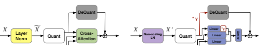 

Figure 7: Comparison of the quantization flow before (left) and after (right) Gamma Migration in MHA-LN of the Cross-Attention module.

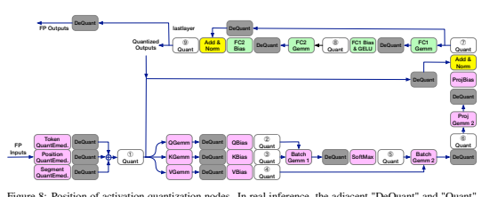

Figure 8: Position of activation quantization nodes. In real inference, the adjacent "DeQuant" and "Quant" operations will be merged into one "ReQuant" operation for faster computation.

## B Quantization Nodes B.1 Position Of Quantization Nodes

For the position to insert quantization nodes, we find that different papers often have different choices, particularly at activation. This would bring difficulties for fair comparisons across methods and practical development on hardware.

By surveying multiple industry [38, 42] and academic solutions, we take the one in FasterTransformer [38]: Token (position, token type) embeddings are quantized to reduce the memory storage.

Weights and activation engaged in matrix multiplication are also quantized. To be noted, we only give one quantizer to the same activation because it is friendly to hardware. Thus we will quantize the shortcut branch and take the same quantization parameter for the input of Query, Key, and Value modules, where some papers [24] do not and might suffer some problems on hardware.

A clear illustration about the position of activation quantization is depicted in Fig. 8. Here for ease of understanding, we mark each "Quant" node with a serial number and match them with the related module names in Table 8.

| ①               | ②     | ③   | ④     | ⑤               | ⑥       | ⑦      | ⑧    | ⑨      |
|-----------------|-------|-----|-------|-----------------|---------|--------|------|--------|
| Input Embedding | Query | Key | Value | Attention probs | Context | MHA-LN | GELU | FFN-LN |

Table 8: We map the label in Fig. 8 to the module name, which represents the quantization node inserted at the output of the corresponding module.

## B.2 Problematic Quantization Nodes

In this subsection, we give some simple and direct studies to elaborate on the most problematic tensors (outputs of LayerNorm structures and GELU). Verifications are done on fine-tuned BERT,
RoBERTa, and encoder-decoder model BART.

On the one hand, we compare the cosine similarity between the FP value and the quantized one for each output. Activation nodes with cosine similarity lower than 0.99 are viewed as problematic positions (results in Table 9, Table 10). On another hand, we can observe the final accuracy recovery by disabling the quantization of each kind of activation. Both experiments indicate the obstacles when quantizing the outputs of LayerNorm and GELU.

| BERT-STS-B      | BERT-QQP              | BERT-MRPC        |                       |                 |                       |
|-----------------|-----------------------|------------------|-----------------------|-----------------|-----------------------|
| output          | cosine similarity (%) | output           | cosine similarity (%) | output          | cosine similarity (%) |
| layer.8.GELU    | 87.83                 | layer.9.GELU     | 94.19                 | layer.9.GELU    | 92.00                 |
| layer.11.GELU   | 90.68                 | layer.4.MHA-LN   | 94.40                 | layer.7.MHA-LN  | 93.05                 |
| layer.4.MHA-LN  | 94.60                 | layer.6.MHA-LN   | 94.45                 | layer.8.MHA-LN  | 93.14                 |
| layer.6.MHA-LN  | 94.63                 | layer.5.MHA-LN   | 94.55                 | layer.6.MHA-LN  | 93.22                 |
| layer.5.MHA-LN  | 94.66                 | layer.7.MHA-LN   | 94.60                 | layer.4.MHA-LN  | 93.28                 |
| layer.7.MHA-LN  | 94.85                 | layer.3.MHA-LN   | 95.01                 | layer.5.MHA-LN  | 93.44                 |
| layer.3.MHA-LN  | 95.19                 | layer.8.MHA-LN   | 95.05                 | layer.2.GELU    | 93.94                 |
| layer.10.MHA-LN | 95.45                 | layer.2.GELU     | 95.08                 | layer.3.MHA-LN  | 94.15                 |
| layer.8.MHA-LN  | 95.45                 | layer.9.MHA-LN   | 95.80                 | layer.10.MHA-LN | 94.36                 |
| layer.2.GELU    | 95.48                 | layer.10.MHA-LN  | 96.13                 | layer.9.MHA-LN  | 94.58                 |
| layer.9.MHA-LN  | 95.60                 | layer.1.MHA-LN   | 96.84                 | layer.8.GELU    | 94.68                 |
| layer.5.GELU    | 96.86                 | layer.0.MHA-LN   | 96.87                 | layer.10.GELU   | 95.81                 |
| layer.0.MHA-LN  | 96.96                 | layer.10.GELU    | 97.02                 | layer.0.MHA-LN  | 96.99                 |
| layer.1.MHA-LN  | 97.15                 | layer.2.MHA-LN   | 97.50                 | layer.1.MHA-LN  | 97.12                 |
| layer.9.GELU    | 97.42                 | layer.4.GELU     | 97.57                 | layer.2.MHA-LN  | 97.66                 |
| layer.4.GELU    | 97.60                 | layer.5.GELU     | 97.71                 | layer.11.GELU   | 97.70                 |
| layer.2.MHA-LN  | 97.67                 | layer.3.GELU     | 98.30                 | layer.5.GELU    | 97.91                 |
| layer.6.GELU    | 98.07                 | layer.11.GELU    | 98.43                 | layer.4.GELU    | 98.04                 |
| layer.3.GELU    | 98.22                 | layer.1.GELU     | 98.46                 | layer.11.MHA-LN | 98.16                 |
| layer.1.GELU    | 98.34                 | layer.0.GELU     | 98.60                 | layer.1.GELU    | 98.18                 |
| layer.7.GELU    | 98.43                 | layer.8.GELU     | 98.63                 | layer.0.GELU    | 98.31                 |
| layer.10.GELU   | 98.44                 | layer.7.GELU     | 98.69                 | layer.7.GELU    | 98.42                 |
| layer.0.GELU    | 98.52                 | layer.11.MHA-LN  | 98.76                 | layer.3.GELU    | 98.67                 |
| layer.11.MHA-LN | 98.60                 | layer.6.GELU     | 98.77                 | layer.6.GELU    | 98.74                 |
| layer.9.FFN-LN  | 98.79                 | layer.10.Context | 98.96                 | layer.10.FFN-LN | 98.94                 |
| RoBERTa-MNLI    | RoBERTa-QNLI          | RoBERTa-QQP      |                       |                 |                       |
| output          | cosine similarity(%)  | output           | cosine similarity(%)  | output          | cosine similarity(%)  |
| layer.7.GELU    | 93.91                 | layer.10.GELU    | 90.08                 | layer.2.GELU    | 93.56                 |
| layer.9.GELU    | 94.25                 | layer.7.GELU     | 91.60                 | layer.3.GELU    | 94.27                 |
| layer.2.GELU    | 94.64                 | layer.5.GELU     | 95.58                 | layer.4.GELU    | 95.96                 |
| layer.10.GELU   | 94.79                 | layer.4.GELU     | 95.59                 | layer.1.GELU    | 96.69                 |
| layer.8.GELU    | 94.83                 | layer.2.GELU     | 95.89                 | layer.5.GELU    | 96.71                 |
| layer.5.GELU    | 96.16                 | layer.8.GELU     | 96.02                 | layer.0.GELU    | 97.04                 |
| layer.4.GELU    | 96.28                 | layer.3.GELU     | 96.33                 | layer.0.MHA-LN  | 97.09                 |
| layer.1.GELU    | 96.38                 | layer.1.GELU     | 96.52                 | layer.7.GELU    | 97.41                 |
| layer.3.GELU    | 96.69                 | layer.9.GELU     | 96.85                 | layer.1.MHA-LN  | 97.59                 |
| layer.6.GELU    | 96.82                 | layer.11.MHA-LN  | 97.00                 | layer.8.GELU    | 97.81                 |
| layer.0.MHA-LN  | 97.16                 | layer.0.MHA-LN   | 97.13                 | layer.8.FFN-LN  | 98.10                 |
| layer.11.MHA-LN | 97.26                 | layer.6.GELU     | 97.36                 | layer.7.FFN-LN  | 98.13                 |
| layer.0.GELU    | 97.30                 | layer.0.GELU     | 97.49                 | layer.0.FFN-LN  | 98.16                 |
| layer.10.FFN-LN | 97.64                 | layer.1.MHA-LN   | 97.66                 | layer.1.FFN-LN  | 98.23                 |
| layer.10.MHA-LN | 97.64                 | layer.8.Context  | 97.67                 | layer.6.FFN-LN  | 98.28                 |
| layer.1.MHA-LN  | 97.67                 | layer.10.FFN-LN  | 97.72                 | layer.6.GELU    | 98.29                 |
| layer.9.FFN-LN  | 97.84                 | layer.10.MHA-LN  | 97.75                 | layer.7.MHA-LN  | 98.32                 |
| layer.8.FFN-LN  | 97.90                 | layer.9.Context  | 97.79                 | layer.8.MHA-LN  | 98.33                 |
| layer.7.FFN-LN  | 98.05                 | layer.9.FFN-LN   | 97.89                 | layer.6.MHA-LN  | 98.35                 |
| layer.9.MHA-LN  | 98.11                 | layer.8.FFN-LN   | 97.92                 | layer.5.FFN-LN  | 98.36                 |
| layer.8.MHA-LN  | 98.13                 | layer.7.FFN-LN   | 97.99                 | layer.2.MHA-LN  | 98.42                 |
| layer.0.FFN-LN  | 98.14                 | layer.0.FFN-LN   | 98.14                 | layer.5.MHA-LN  | 98.43                 |
| layer.6.FFN-LN  | 98.25                 | layer.8.MHA-LN   | 98.15                 | layer.4.FFN-LN  | 98.46                 |
| layer.1.FFN-LN  | 98.33                 | layer.9.MHA-LN   | 98.17                 | layer.3.MHA-LN  | 98.49                 |
| layer.5.FFN-LN  | 98.34                 | layer.6.FFN-LN   | 98.19                 | layer.4.MHA-LN  | 98.50                 |
| layer.6.MHA-LN  | 98.36                 | layer.5.FFN-LN   | 98.26                 | layer.2.FFN-LN  | 98.50                 |
| layer.7.MHA-LN  | 98.36                 | layer.6.MHA-LN   | 98.28                 | layer.9.FFN-LN  | 98.52                 |
| layer.4.FFN-LN  | 98.39                 | layer.7.MHA-LN   | 98.31                 | layer.3.FFN-LN  | 98.57                 |
| layer.5.MHA-LN  | 98.43                 | layer.1.FFN-LN   | 98.32                 | layer.10.GELU   | 98.58                 |
| layer.4.MHA-LN  | 98.47                 | layer.4.FFN-LN   | 98.34                 | layer.9.MHA-LN  | 98.60                 |
| layer.3.FFN-LN  | 98.48                 | layer.5.MHA-LN   | 98.37                 | layer.10.FFN-LN | 98.60                 |
| layer.2.MHA-LN  | 98.50                 | layer.3.FFN-LN   | 98.45                 | layer.11.MHA-LN | 98.75                 |
| layer.2.FFN-LN  | 98.54                 | layer.4.MHA-LN   | 98.45                 | layer.9.GELU    | 98.86                 |
| layer.3.MHA-LN  | 98.55                 | layer.2.FFN-LN   | 98.50                 | layer.10.MHA-LN | 98.89                 |
| layer.2.MHA-LN  | 98.52                 |                  |                       |                 |                       |
| layer.3.MHA-LN  | 98.55                 |                  |                       |                 |                       |

Table 9: The sorted cosine similarity between the output and the quantized one (6-bit) on BERT and RoBERTa models. We aim at the most problematic ones with cosine similarity lower than 99%.

| BART-CNN/DailyMail                 | BART-XSum             |                                    |                       |
|------------------------------------|-----------------------|------------------------------------|-----------------------|
| output                             | cosine similarity (%) | output                             | cosine similarity (%) |
| layers.4.GELU (Decoder)            | 67.96                 | layers.3.GELU (Decoder)            | 74.37                 |
| layers.3.GELU (Decoder)            | 69.50                 | layers.4.GELU (Decoder)            | 75.05                 |
| layers.4.MHA-LN (Encoder-Decoder)  | 76.03                 | layers.2.GELU (Decoder)            | 82.36                 |
| layers.2.GELU (Decoder)            | 76.05                 | layers.4.MHA-LN (Encoder-Decoder)  | 82.84                 |
| layers.2.MHA-LN (Encoder-Decoder)  | 77.88                 | layers.1.MHA-LN (Encoder)          | 83.04                 |
| layers.0.GELU (Decoder)            | 80.83                 | layers.2.MHA-LN (Encoder-Decoder)  | 84.31                 |
| layers.5.MHA-LN (Encoder)          | 84.20                 | layers.4.MHA-LN (Encoder)          | 84.53                 |
| layers.1.MHA-LN (Encoder)          | 84.33                 | layers.5.MHA-LN (Encoder)          | 84.69                 |
| layers.1.MHA-LN (Encoder-Decoder)  | 85.01                 | layers.3.MHA-LN (Encoder)          | 86.47                 |
| layers.4.MHA-LN (Encoder)          | 85.03                 | layers.1.MHA-LN (Encoder-Decoder)  | 86.97                 |
| layers.3.MHA-LN (Encoder-Decoder)  | 86.78                 | layers.0.MHA-LN (Encoder)          | 87.69                 |
| layers.3.MHA-LN (Encoder)          | 87.12                 | layers.0.GELU (Decoder)            | 87.77                 |
| layers.0.MHA-LN (Encoder)          | 87.30                 | layers.3.MHA-LN (Encoder-Decoder)  | 88.11                 |
| layers.1.GELU (Decoder)            | 87.61                 | layers.2.MHA-LN (Encoder)          | 89.14                 |
| layers.2.MHA-LN (Encoder)          | 89.64                 | layers.0.GELU (Encoder)            | 92.21                 |
| layers.5.GELU (Decoder)            | 91.78                 | layers.1.GELU (Decoder)            | 93.60                 |
| layers.0.MHA-LN (Encoder-Decoder)  | 93.62                 | layers.0.MHA-LN (Encoder-Decoder)  | 93.61                 |
| layers.0.GELU (Encoder)            | 95.09                 | layers.5.FFN-LN (Decoder)          | 95.44                 |
| layers.2.GELU (Encoder)            | 95.91                 | layers.5.GELU (Decoder)            | 96.35                 |
| layers.3.GELU (Encoder)            | 96.44                 | layers.3.GELU (Encoder)            | 96.41                 |
| layers.3.MHA-LN (Decoder)          | 96.90                 | layers.2.GELU (Encoder)            | 96.57                 |
| layers.5.MHA-LN (Decoder)          | 97.46                 | layers.3.MHA-LN (Decoder)          | 96.87                 |
| layers.2.Context (Encoder-Decoder) | 97.51                 | layers.2.Context (Encoder-Decoder) | 96.99                 |
| layers.5.MHA-LN (Encoder-Decoder)  | 97.71                 | layers.1.GELU (Encoder)            | 97.20                 |
| layers.4.FFN-LN (Decoder)          | 97.83                 | layers.5.MHA-LN (Encoder-Decoder)  | 97.56                 |
| layers.4.GELU (Encoder)            | 97.85                 | layers.0.Context (Encoder-Decoder) | 97.72                 |
| layers.1.GELU (Encoder)            | 97.88                 | layers.5.GELU (Encoder)            | 97.74                 |
| layers.5.GELU (Encoder)            | 97.97                 | layers.4.FFN-LN (Decoder)          | 98.02                 |
| layers.5.FFN-LN (Decoder)          | 98.32                 | layers.4.GELU (Encoder)            | 98.04                 |
| layers.2.Context (Decoder)         | 98.40                 | layers.0.Context (Decoder)         | 98.11                 |
| layers.1.MHA-LN (Decoder)          | 98.51                 | layers.5.MHA-LN (Decoder)          | 98.20                 |
| layers.3.FFN-LN (Decoder)          | 98.52                 | layers.2.FFN-LN (Decoder)          | 98.28                 |
| layers.0.Context (Decoder)         | 98.53                 | layers.3.Context (Encoder-Decoder) | 98.31                 |
| layers.4.MHA-LN (Decoder)          | 98.54                 | layers.1.Context (Decoder)         | 98.32                 |
| layers.2.MHA-LN (Decoder)          | 98.63                 | layers.3.FFN-LN (Decoder)          | 98.36                 |
| layers.2.FFN-LN (Decoder)          | 98.66                 | layers.1.MHA-LN (Decoder)          | 98.38                 |
| layers.1.FFN-LN (Decoder)          | 98.71                 | layers.5.Context (Encoder-Decoder) | 98.46                 |
| layers.0.Context (Encoder-Decoder) | 98.71                 | layers.2.Context (Decoder)         | 98.56                 |
| layers.0.FFN-LN (Decoder)          | 98.72                 | layers.4.MHA-LN (Decoder)          | 98.58                 |
| layers.5.Context (Encoder-Decoder) | 98.72                 | layers.2.MHA-LN (Decoder)          | 98.64                 |
| layers.4.Context (Decoder)         | 98.92                 | layers.0.FFN-LN (Decoder)          | 98.71                 |
| layers.0.MHA-LN (Decoder)          | 98.93                 | layers.1.FFN-LN (Decoder)          | 98.72                 |
| layers.0.MHA-LN (Decoder)          | 98.80                 |                                    |                       |

Table 10: The sorted cosine similarity between the output and the quantized one (6-bit) on BART models. We aim at the most problematic ones with cosine similarity lower than 99%.

| Model        | 32-32-32   | 6-6-6   | Input Embedding   | Query   | Key   | Value   | Attention probs   | Context   | MHA-LN   | GELU   | FFN-LN   |
|--------------|------------|---------|-------------------|---------|-------|---------|-------------------|-----------|----------|--------|----------|
| BERT-MRPC    | 87.75      | 31.86   | 31.62             | 32.11   | 32.11 | 32.6    | 31.62             | 31.86     | 83.09    | 34.31  | 31.86    |
| BERT-QQP     | 90.91      | 69.0    | 69.22             | 69.05   | 68.95 | 69.24   | 68.09             | 69.25     | 88.93    | 74.25  | 70.01    |
| BERT-STS-B   | 89.70      | 59.79   | 57.8              | 57.61   | 58.2  | 56.45   | 54.02             | 55.12     | 84.1     | 79.6   | 53.68    |
| RoBERTa-MNLI | 87.75      | 34.90   | 36.05             | 35.69   | 35.54 | 35.27   | 35.68             | 36.08     | 66.93    | 60.50  | 53.82    |
| RoBERTa-QNLI | 92.68      | 62.13   | 65.04             | 65.77   | 64.23 | 64.73   | 64.54             | 64.42     | 84.55    | 69.71  | 76.66    |
| RoBERTa-QQP  | 91.6       | 74.37   | 76.24             | 75.97   | 76.01 | 76.41   | 75.50             | 75.92     | 87.80    | 84.28  | 80.89    |

Table 11: Influence study of quantization nodes. The comparisons of the second and third columns show the performance drop with 6-bit MinMax calibration and quantization. The subsequent columns show the recovered performance after disabling the quantization of a certain kind of output defined in Table 8, which implies the effect of quantizing this node. For example, "Query" means disabling the quantization of output at Query modules across 12 layers. Obvious improvements are marked in bold.

## C Analysis Of Outliers C.1 Outlier Phenomenon

By going deeper into the above problematic activations, we find that large outliers in them cause the large quantization error, and these outliers present some structured features from the embedding

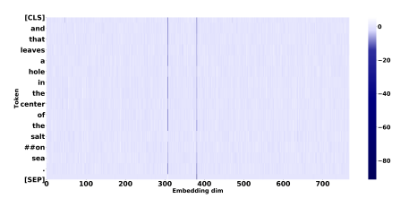

and token perspectives. Activations of almost all tokens attend to outliers in specific embedding dimensions like 308 and 381 embedding dimensions in Fig. 9. Upon these dimensions, some tokens like the [SEP] token in Fig. 10 attend to even more aggressive outliers compared to other tokens in
(Fig. 10). In fact, we find this often happens on token [SEP], [CLS], punctuations like commas and periods, and other high-frequency tokens like "the", "and", "of".

## C.2 Detailed Discussion About The Inducement

Here, we discuss the inducement of the outlier phenomenon from embedding and token perspectives.

For the embedding phenomenon, the Sec. 3.1 has explained the scaling parameter amplifies the

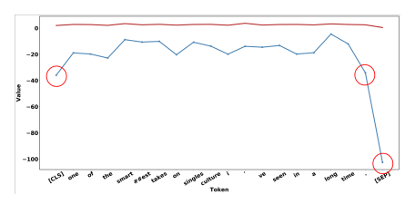

outliers at certain embeddings. In fact, we find that this not only emerges in fine-tuned models but is also obvious in the pre-trained ones. By injecting constraints such as weight decay or kurtosis regularization [43] to LayerNorm's parameter when fine-tuning the FP model, it is still hard to suppress the aggressive values in the scaling parameter without affecting FP performance. Hence, we conjecture that this phenomenon is beneficial to the FP performance though it indeed brings challenges to quantization.

Moreover, the huge deviation in the token range we think is caused by the token frequency in the pre-training phase. Because we find the tokens which hold more aggressive signals occur frequently during pre-training like [SEP], [CLS] occur in each example, and '.' is often used in an expression.

We also notice that these tokens' word (token) embeddings have larger values than others. According to these, a possible explanation might be like: the frequency information biases the word embedding space and brings different features. The sharper outliers spread to subsequent layers and seem to be less important as indicated in Sec. 3.2. Therefore, we conjecture that a good word embedding without being biased by frequency information can behave better in quantization. But we can find those less important outliers in an efficient way and clip them as well. This suits better for post-training quantization without large-scale re-training.

For the inducement of outliers, note that [44] also mentioned the connection between the scaling parameter and outliers in the last LayerNorm each BERT layer. But we emphasize the amplification effect of the scaling parameter, especially for the LayerNorm after Multi-Head Attention. This naturally generates the finding of quantization-friendly distribution contributed by removing the scaling parameter. About the unbalanced token frequency, a concurrent work [45] explores carefully from the FP performance perspective.

## D Supplementary Experiments D.1 Supplementary Evidence Of Outliers In Layernorm

We show more evidence of the same outlier phenomenon in LayerNorm and illustrate that the output of Non-scaling LayerNorm is more quantization-friendly than the normal one. Firstly, Fig. 11 and Fig. 12 are presented to build a formal understanding, where the X0 has weaker outliers. Furthermore, more quantitative results about cosine similarity are put in Table 12 to indicate the improvement on the most problematic tensors Sec. B.2 brought by extracting the scaling parameter γ. Here, we discuss the inducement of the outlier phenomenon from embedding and token perspectives.

## D.2 Supplementary Evidence Of Clipping Impact

We provide more evidence of accuracy and token impact by clipping the outputs to different levels in Table 13.

The first thing is that different outliers have very different importance, where some very large values can be clipped sharply but will not introduce large accuracy degradation, whereas the performance decreases quickly with some being clipped. For example, for the outputs of MHA-LN, clipping them from -60 to -45 seems reliable in the FP model and of course friendly in the quantized one. However, clipping from -40 to -35 will induce about 5% performance loss.

Another key point is that those large outliers only belong to several tokens regarding the big divergence of the token range. For example, for values in (-60, -45), the clipped tokens are still 3% for most of the layers. Thus, finding the clipping range from the token perspective can help to jump over the less important area quickly.

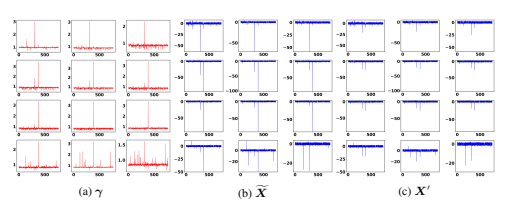

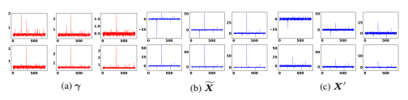

| Model                               | 0      | 1      | 2      | 3      | 4      | 5      | 6     | 7     | 8     | 9      | 10    | 11    |
|-------------------------------------|--------|--------|--------|--------|--------|--------|-------|-------|-------|--------|-------|-------|
| BERT-MRPC MHA-LN                    | +2.24  | +2.17  | +1.48  | +4.84  | +5.70  | +5.55  | +5.76 | +5.83 | +5.56 | +4.32  | +4.79 | +0.85 |
| BERT-QQP MHA-LN                     | +2.35  | +2.35  | +1.61  | +4.00  | +4.58  | +4.43  | +4.51 | +4.24 | +3.64 | + 3.07 | +3.19 | +0.24 |
| BERT-STS-B MHA-LN                   | +2.19  | +2.03  | +1.43  | +3.82  | +4.39  | +4.34  | +4.35 | +4.03 | +3.25 | +3.33  | +3.44 | +0.51 |
| RoBERTa-MNLI MHA-LN                 | +1.49  | +0.81  | +0.25  | +0.18  | +0.16  | + 0.16 | +0.22 | +0.19 | +0.25 | + 0.31 | +0.59 | +1.17 |
| FFN-LN                              | +0.31  | + 0.43 | +0.16  | +0.24  | +0.25  | +0.27  | +0.28 | +0.31 | +0.34 | +0.43  | +0.49 | +0.04 |
| RoBERTa-QNLI MHA-LN                 | +1.62  | +0.88  | +0.25  | +0.19  | +0.17  | +0.18  | +0.22 | +0.18 | +0.23 | +0.24  | +0.52 | +1.31 |
| FFN-LN                              | +0.33  | +0.47  | +0.22  | +0.25  | +0.26  | +0.30  | +0.28 | +0.32 | +0.31 | +0.36  | +0.49 | +0.53 |
| RoBERTa-QQP MHA-LN                  | +1.57  | +0.93  | +0.32  | +0.25  | +0.21  | +0.22  | +0.29 | +0.33 | +0.43 | + 0.39 | +0.30 | +0.64 |
| FFN-LN                              | +0.32  | +0.52  | +0.16  | +0.24  | +0.27  | +0.33  | +0.33 | +0.42 | +0.49 | +0.33  | +0.45 | +0.20 |
| BART-CNN/DailyMail MHA-LN (Encoder) | +11.26 | +14.07 | +8.81  | +11.25 | +13.86 | +14.13 |       |       |       |        |       |       |
| MHA-LN (Decoder)                    | +0.23  | +0.19  | +0.01  | +1.69  | +0.23  | +1.29  |       |       |       |        |       |       |
| MHA-LN (Encoder-Decoder)            | +5.21  | +13.82 | +20.94 | +11.94 | +22.74 | +1.04  |       |       |       |        |       |       |
| FFN-LN (Decoder)                    | +0.20  | +0.14  | +0.03  | +0.17  | +0.04  | +0.21  |       |       |       |        |       |       |
| BART-XSum MHA-LN (Encoder)          | +10.90 | +15.07 | +9.17  | +11.77 | +13.81 | +13.58 |       |       |       |        |       |       |
| MHA-LN (Decoder)                    | +0.15  | +0.12  | +0.09  | +1.63  | +0.23  | +0.61  |       |       |       |        |       |       |
| MHA-LN (Encoder-Decoder)            | +5.09  | +11.75 | +14.50 | +10.57 | +15.96 | +1.32  |       |       |       |        |       |       |
| FFN-LN (Decoder)                    | +0.21  | +0.04  | +0.34  | +0.23  | +0.54  | +0.38  |       |       |       |        |       |       |

Table 12: Cosine similarity (%) improvement after extracting γ in LayerNorm. This metric is evaluated on 256 samples from dev set. (BART only has 6 layers and thus the right half is left empty. )

## D.3 Comparisons Among Token-Wise Clipping And Existing Methods

We compare the coarse stage of Token-Wise Clipping with OMSE, percentile, and direct step size learning and argue that ours is more effective Table 14 and efficient Table 15.

Our Token-Wise Clipping searches superior clipping ratio towards the final performance and works in a remarkably efficient way (Reasons have been explained in Sec. 4.2) with about 2 minutes evaluating 30 ratios on GLUE tasks. On the contrary, OMSE only minimizes the local quantization error and behaves terribly. For instance, it calculates 40 as the best clipping range for the distribution presented in Fig. 2 while 10 is much better. Also, OMSE runs very slowly even with the fast golden section search.

For the direct step size learning and Percentile methods, though they consider the final loss for the clipping range, they still suffer some problems in the case that the unimportant outliers can cover a large area. Direct step size learning without a good initialization point needs a proper learning rate and much tuning time to achieve the key part. Take an extreme case as an example. In QAT, step size has been tuned sufficiently but we still notice that the quantized model can be further clipped.

Besides, as the Percentile builds a histogram of the activation and searches for the best clipping ratio from the value perspective, it is time-costly to jump over the relatively unimportant outliers.

## D.4 Supplementary Results Of Qat

We apply our methods to RoBERTa and BART on quantization-aware training. From Table 16, on RoBERTa, ours still surpasses LSQ+ by 2.54% on QNLI, 7.53% on STS-B. On BART models,

| Clipping Value     | Accuracy   | 0     | 1     | 2     | 3     | 4     | 5     | 6     | 7     | 8     | 9     | 10    | 11    |
|--------------------|------------|-------|-------|-------|-------|-------|-------|-------|-------|-------|-------|-------|-------|
| BERT-MRPC (GELU)   | 87.75      |       |       |       |       |       |       |       |       |       |       |       |       |
| 80.0               | 87.25      | 0.00  | 0.00  | 0.00  | 0.00  | 0.00  | 0.00  | 0.00  | 0.00  | 0.00  | 0.15  | 4.33  | 0.00  |
| 60.0               | 87.25      | 0.00  | 0.00  | 1.88  | 0.00  | 0.00  | 0.00  | 0.00  | 0.00  | 0.00  | 0.31  | 4.58  | 0.00  |
| 40.0               | 87.01      | 0.00  | 0.00  | 3.76  | 0.00  | 0.00  | 0.00  | 0.00  | 0.00  | 0.00  | 2.29  | 4.68  | 0.00  |
| 20.0               | 87.01      | 0.00  | 0.00  | 3.76  | 0.00  | 0.00  | 0.00  | 0.00  | 0.00  | 0.01  | 3.65  | 4.79  | 0.00  |
| 10.0               | 87.25      | 4.64  | 1.36  | 3.76  | 0.00  | 1.73  | 3.77  | 0.00  | 0.00  | 0.15  | 4.53  | 4.84  | 0.04  |
| 5.0                | 87.25      | 49.88 | 19.6  | 7.11  | 7.89  | 13.99 | 26.68 | 34.13 | 19.79 | 15.1  | 5.00  | 4.98  | 45.9  |
| 2.0                | 84.07      | 99.17 | 98.87 | 98.81 | 98.9  | 97.62 | 97.38 | 97.01 | 96.39 | 94.54 | 75.55 | 45.77 | 92.98 |
| 1.5                | 78.92      | 99.96 | 99.98 | 99.94 | 99.94 | 99.77 | 99.83 | 99.77 | 99.76 | 99.75 | 94.72 | 78.11 | 98.01 |
| BERT-QNLI (MHA-LN) | 91.84      |       |       |       |       |       |       |       |       |       |       |       |       |
| -60                | 91.67      | 1.96  | 2.68  | 0.00  | 3.92  | 3.92  | 3.92  | 3.92  | 3.92  | 3.92  | 0.00  | 0.00  | 0.00  |
| -55                | 91.69      | 1.96  | 6.21  | 1.96  | 3.92  | 3.92  | 3.92  | 3.92  | 3.92  | 3.92  | 0.22  | 0.00  | 0.00  |
| -50                | 91.43      | 2.91  | 10.69 | 1.97  | 3.92  | 3.92  | 3.92  | 3.92  | 3.92  | 3.92  | 3.88  | 0.06  | 0.00  |
| -45                | 91.25      | 9.85  | 16.15 | 7.17  | 3.92  | 3.92  | 3.92  | 3.92  | 3.92  | 3.92  | 3.92  | 0.45  | 0.00  |
| -40                | 90.28      | 16.96 | 23.13 | 13.61 | 5.71  | 3.92  | 3.92  | 3.92  | 3.92  | 4.32  | 4.23  | 1.46  | 0.00  |
| -35                | 85.54      | 22.51 | 29.36 | 23.42 | 7.46  | 4.50  | 3.92  | 3.92  | 3.92  | 5.52  | 5.57  | 3.21  | 0.01  |
| -30                | 78.36      | 27.48 | 36.67 | 32.87 | 9.39  | 7.92  | 3.92  | 3.92  | 4.04  | 6.73  | 5.86  | 6.46  | 8.19  |
| -25                | 72.73      | 34.81 | 42.43 | 41.88 | 23.05 | 15.63 | 6.55  | 3.92  | 6.03  | 8.16  | 5.99  | 8.47  | 13.84 |
| -20                | 72.52      | 41.74 | 47.64 | 49.76 | 37.66 | 33.98 | 13.51 | 6.55  | 8.31  | 19.08 | 6.94  | 10.29 | 40.53 |
| Clipping Value     | Accuracy   | 0     | 1     | 2     | 3     | 4     | 5     | 0     | 1     | 2     | 3     | 4     | 5     |
| BART-CoLA (GELU)   | 56.32      |       |       |       |       |       |       |       |       |       |       |       |       |
| 80.0               | 56.32      | 0.00  | 0.00  | 0.00  | 0.00  | 0.00  | 0.00  | 8.48  | 8.60  | 0.00  | 0.00  | 0.00  | 0.00  |
| 60.0               | 56.32      | 0.00  | 0.00  | 0.00  | 0.00  | 0.00  | 0.00  | 8.60  | 8.60  | 0.00  | 0.00  | 0.00  | 0.00  |
| 40.0               | 56.32      | 0.00  | 0.00  | 0.00  | 0.00  | 0.00  | 0.00  | 8.60  | 8.60  | 8.60  | 0.00  | 8.60  | 0.00  |
| 20.0               | 56.32      | 0.01  | 0.00  | 0.00  | 0.00  | 0.00  | 0.00  | 17.21 | 17.21 | 8.60  | 8.61  | 8.61  | 0.00  |
| 10.0               | 56.32      | 8.60  | 4.34  | 8.60  | 8.60  | 0.00  | 0.00  | 17.21 | 17.21 | 8.60  | 8.61  | 8.61  | 8.60  |
| 5.0                | 56.58      | 9.31  | 8.80  | 8.83  | 8.79  | 0.13  | 0.43  | 20.3  | 17.23 | 8.74  | 8.80  | 8.87  | 9.29  |
| 2.0                | 54.06      | 92.49 | 90.98 | 78.52 | 70.7  | 79.58 | 62.35 | 97.27 | 92.14 | 74.54 | 59.41 | 53.88 | 42.17 |
| 1.5                | 52.37      | 98.98 | 98.59 | 96.46 | 94.45 | 96.63 | 86.5  | 99.88 | 99.38 | 95.1  | 87.58 | 84.8  | 72.38 |

Method **CoLA MNLI MRPC QNLI QQP RTE SST-2 STS-B**

(Matt.) (acc m/mm) (f1/acc) (acc) (f1/acc) (acc) (acc) (Pear./Spear.)

RoBERTa (FP) 62.50 87.75/87.23 93.1/90.44 92.68 88.78/91.6 80.51 95.18 91.04/90.72

OMSE [28] 1.81 72.89/72.65 85.38/78.68 76.53 85.24/88.94 64.26 91.17 80.81/81.99 Step size learning [12] 4.64 71.77/73.18 85.42/79.17 77.28 85.19/88.91 65.34 90.71 80.23/81.25 Percentile [46] 20.73 72.23/73.68 84.83/78.43 77.16 82.21/87.44 62.82 88.19 79.41/79.64

Token-Wise Clipping (Coarse Stage) **34.95 80.56/80.84 85.05/79.41 79.46 85.96/89.31 66.43 91.63 82.03/82.45**

BERT (FP) 59.60 84.94/84.76 91.35/87.75 91.84 87.82/90.91 72.56 93.35 89.70/89.28

OMSE 35.44 74.00/73.30 81.54/76.47 84.66 76.07/82.12 64.26 86.27 85.57/86.05

Step size learning 35.77 74.11/73.76 82.95/77.94 85.19 75.79/81.91 64.62 87.16 85.78/86.47

Percentile 37.32 72.40/71.69 85.09/79.90 79.37 72.58/80.19 61.73 87.27 86.38/87.29

Token-Wise Clipping (Coarse Stage) **47.21 77.53/78.01 85.40/80.39 86.47 74.98/83.88 64.62 91.17 86.48/87.06**

we achieve an absolute improvement of 1.73–32.11 points against the best baseline. The outlier suppression framework can be extended to other applications, such as integer-only quantization [25] as well, which proposes the polynomial approximation of non-linear operations for Transformer-based models.

## E Supplementary Related Works

Quantization algorithms are usually grouped into two categories: (1) Quantization-Aware Training
(QAT) and (2) Post-Training Quantization (PTQ). The former fine-tunes the FP model to low-bit and embraces good outcomes with awareness of quantization during training. Apart from learning weight for better performance, [41, 11] propose to learn the quantization parameters. The latter, PTQ,
usually conducts fast calibration on the FP model with much less computation and fewer data. [28] transforms quantization to a Minimum Mean Squared Error problem. [40] alternately optimizes the step size of weight and activation towards the matrix multiplication output.

| OMSE                        | Percentile            | Token-Wise Clipping (Coarse Stage)   |                             |
|-----------------------------|-----------------------|--------------------------------------|-----------------------------|
| Grid Search (30 iterations) | Golden Section Search | search (3 times)                     | Grid Search (30 iterations) |
| 1754s                       | 439.29s               | 301.49s                              | 135.73s                     |

Table 15: The time of activation calibration on 256 samples of each algorithm. As direct step size learning takes OMSE as its initialization, we do not compare the time here.

Recently, quantization has become popular in Transformer-based models. For quantization-aware training, [21] explores 8-bit quantization on BERT-like models. [22] adopts group-wise quantization and applies mixed-precision quantization based on the Hessian information. [23] investigates various distillation losses on BERT and combines the distillation with quantization. [25] approximates the nonlinear function in Transformer architectures to enjoy integer-only inference. [47] quantizes a different random subset of weights each forward pass during training to decrease quantization noise. Moreover, [48] explores underlying difficulties of quantizing generative models. Due to the sequential computation nature of this type of model, they find that word embedding is easier to be homogeneous and devise a token-level contrastive distillation method to combat this obstacle. For post-training quantization, [26] notices the structured outliers in Transformer-based models with the occurrence at a few embedding dims and the special separator token. They point out that the high dynamic ranges will even hurt the 8-bit quantization performance and suggest taking per-embedding-group quantization for this unique challenge. While they walk around the problem and their method brings extra computation burden, we explore the inducement and clipping impact of these structured outliers and solve them without computation overhead.

## F Supplementary Implementation Details

For quantizer details, we insert quantization nodes as Sec. B.1. We adopt symmetric per-channel quantization on weight and asymmetric per-layer quantization on activation. For PTQ experiments, we sample 256 examples as the calibration dataset with batch size set to 32 on GLUE benchmark and SQuAD, 4 for CNN/DailyMail and XSum. For learning in the fine-grained stage of the Token-Wise Clipping, we always tune 3 epochs with learning rate 1e-5 across datasets because the first step already produces good outcomes.

For QAT experiments on the GLUE benchmark, we equip our methods with LSQ+ [12]. The coarsegrained stage of Token-Wise Clipping is used to initialize quantization parameters, the fine-grained stage is removed because LSQ+ has armed with step size learning. About hyper-parameters, learning rate is searched in {1e-5, 2e-5, 3e-5, 4e-5, 5e-5}. Batch size is usually set to 32 unless smaller (8 and 16) ones are also tried on small datasets including CoLA, MRPC, RTE, and STS-B. As for epochs, we follow [26] on BERT (3 epochs for MNLI and QQP, 6 epochs for others), [25] on RoBERTa
(6 epochs for MNLI and QQP, 12 epochs for others), and take 6 or 12 epochs on BART as well.

Other hyper-parameters are inspected and kept fixed across datasets including self-attention dropout rate 0.1, hidden states dropout rate 0.0, weight decay 0.0, and warmup ratio 10%. For baseline mechanisms like LSQ+ and PACT, we conduct the above learning rate and batch size search as well for fair comparisons.

Method Bits CoLA MNLI MRPC QNLI QQP RTE SST-2 STS-B **Avg.** (W-E-A) (Matt.) (acc m/mm) (f1/acc) (acc) (f1/acc) (acc) (acc) (Pear./Spear.)

RoBERTa 32-32-32 62.50 87.75/87.23 93.1/90.44 92.68 88.78/91.6 80.51 95.18 91.04/90.72 86.40

Quant-Noise [47] PQ - 83.60/- - - - - - - -

PACT [41] 4-4-4 19.43 78.72/79.55 81.42/73.04 84.55 85.14/88.91 58.12 88.76 72.15/72.46 70.82

LSQ+ [12] 4-4-4 24.69 83.28/83.24 83.17/75.0 85.12 86.96/90.22 **58.12** 89.79 78.08/78.41 73.36

Ours 4-4-4 **37.10 84.91/85.2 84.60/77.70 87.66 87.24/90.52** 57.76 **90.25 85.61/85.33 76.67** LSQ+(+KD) 4-4-4 30.33 87.17/87.27 89.39/85.05 91.87 88.56/91.48 61.73 92.20 83.18/83.10 77.97

Ours(+KD) 4-4-4 **48.78 87.33/87.16 91.92/88.97 91.93 88.81/91.67 66.79 92.43 88.97/88.76 82.09**

BART 32-32-32 56.32 86.45/86.55 91.37/87.5 92.31 88.34/91.39 79.06 93.35 90.11/89.94 84.61

PACT 4-4-4 18.72 80.57/80.36 87.99/82.60 85.52 85.09/88.19 57.40 89.45 87.49/87.36 73.86

LSQ+ 4-4-4 18.12 82.41/82.29 88.35/83.58 87.39 86.04/89.64 57.40 90.48 86.89/86.86 74.55

Ours 4-4-4 **50.83 84.81/84.57 90.94/87.01 90.92 87.88/90.93 73.29 92.43 89.22/89.02 82.46**

Table 17: Model size(MB) of quantized models.

Algorithm 1: Token-Wise Clipping Input: grid search iteration K, model with L layers, number of tokens T.

{1. Coarse stage:}
loss = INF, s0 = 1.0 for k = 0 to K − 1 do α = 1 − 0.01 ∗ k; for i = 1 to L do layer input X, token t at embedding j Xt,j ;
o u = {maxj X1,j , maxj X2,j *, ... ,* maxj X*T ,j*};
o l = {minj X1,j , minj X2,j *, ... ,* minj X*T ,j*};
c u = *quantile*(o u, α), cl = *quantile*(o l, α);
X = clip(X, cl, cu);
Calculate step size s and quantization loss Eq. (6);
if *loss > loss*k **then**
loss = lossk, s0 = s ;
Find the initialization step size s0;
{2. Fine-grained stage:}
Optimize the s using Eq. (9) with Eq. (6);
return Optimized step size s ;

| Tasks       | GLUE   | XSum    |       |       |
|-------------|--------|---------|-------|-------|
| Bits(W-E-A) | BERT   | RoBERTa | BART  | BART  |
| 32-32-32    | 417.6  | 475.5   | 534.1 | 531.8 |
| 8-8-8       | 104.8  | 119.2   | 134.0 | 133.4 |
| 6-6-6       | 78.7   | 89.5    | 100.6 | 100.2 |
| 4-4-8       | 52.6   | 59.8    | 67.3  | 67.0  |
| 4-4-4       | 52.6   | 59.8    | 67.3  | 67.0  |
| 2-2-4       | 26.5   | 30.1    | 34.0  | 33.8  |
