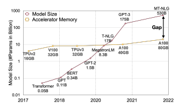
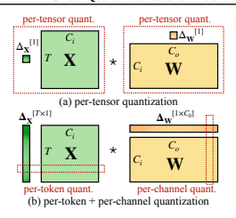
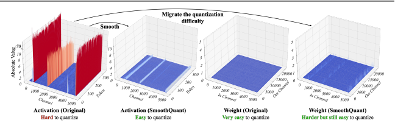
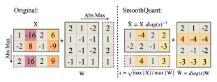
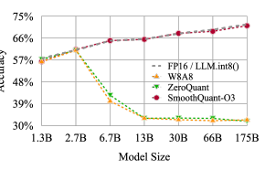
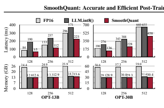
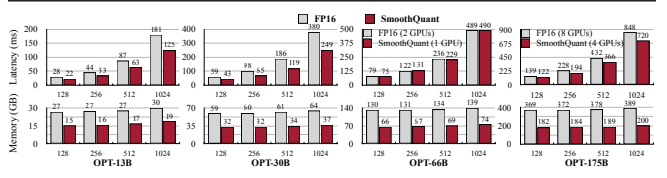
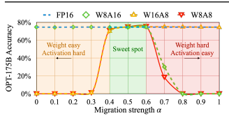

# Smoothquant: Accurate And Efficient Post-Training Quantization For Large Language Models

Guangxuan Xiao * 1 **Ji Lin** * 1 Mickael Seznec 2 Hao Wu 2 Julien Demouth 2 **Song Han** 1 https://github.com/mit-han-lab/smoothquant

## Abstract

Large language models (LLMs) show excellent performance but are compute- and memoryintensive. Quantization can reduce memory and accelerate inference. However, existing methods cannot maintain accuracy and hardware efficiency at the same time. We propose SmoothQuant, a training-free, accuracy-preserving, and generalpurpose post-training quantization (PTQ) solution to enable 8-bit weight, 8-bit activation (W8A8)
quantization for LLMs. Based on the fact that weights are easy to quantize while activations are not, SmoothQuant smooths the activation outliers by offline *migrating* the quantization difficulty from activations to weights with a mathematically equivalent transformation. SmoothQuant enables an INT8 quantization of *both* weights and activations for all the matrix multiplications in LLMs, including OPT, BLOOM, GLM, MT-NLG,
Llama-1/2, Falcon, Mistral, and Mixtral models.

We demonstrate up to 1.56× speedup and 2×
memory reduction for LLMs with negligible loss in accuracy. SmoothQuant enables serving 530B
LLM within a single node. Our work offers a turn-key solution that reduces hardware costs and democratizes LLMs.

## 1 **Introduction**

Large-scale language models (LLMs) show excellent performance on various tasks (Brown et al., 2020a; Zhang et al., 2022). However, serving LLMs is budget and energyconsuming due to their gigantic model size. For example, the GPT-3 (Brown et al., 2020a) model contains 175B parameters, which will consume at least 350GB of memory to
*Equal contribution 1Massachusetts Institute of Technology 2NVIDIA. Correspondence to: Guangxuan Xiao <xgx@mit.edu>,
Ji Lin <jilin@mit.edu>.

Figure 1: The model size of large language models is developing at a faster pace than the GPU memory in recent years,

leading to a big gap between the supply and demand for memory. Quantization and model compression techniques can help bridge the gap.

store and run in FP16, requiring 8×48GB A6000 GPUs or 5×80GB A100 GPUs just for inference. Due to the huge computation and communication overhead, the inference latency may also be unacceptable to real-world applications. *Quantization* is a promising way to reduce the cost of LLMs (Dettmers et al., 2022; Yao et al., 2022). By quantizing the *weights and activations* with low-bit integers, we can reduce GPU memory requirements, in size and bandwidth, and accelerate compute-intensive operations (i.e., GEMM*
in linear layers, BMM†in attention). For instance, INT8 quantization of weights and activations can halve the GPU memory usage and nearly double the throughput of matrix multiplications compared to FP16.

However, unlike CNN models or smaller transformer models like BERT (Devlin et al., 2019), the *activations* of LLMs are difficult to quantize. When we scale up LLMs beyond 6.7B parameters, systematic outliers with large magnitude will emerge in activations (Dettmers et al., 2022), leading to large quantization errors and accuracy degradation. ZeroQuant (Yao et al., 2022) applies dynamic per-token activation quantization and group-wise weight quantization
(defined in Figure 3 Sec. 2). It can be implemented effi-
*General matrix multiply
†Batch matrix multiply

outlier determines quant. range

Figure 2: SmoothQuant's intuition: the activation X is hard to quantize because outliers stretch the quantization range, leaving few effective bits for most values. We migrate the scale variance from activations to weights W during offline to reduce the quantization difficulty of activations. The smoothed activation Xˆ and the adjusted weight Wˆ are both easy to quantize.

ciently and delivers good accuracy for GPT-3-350M and GPT-J-6B. However, it can not maintain the accuracy for the large OPT model with 175 billion parameters (see Section 5.2). LLM.int8() (Dettmers et al., 2022) addresses that accuracy issue by further introducing a mixed-precision decomposition (i.e., it keeps outliers in FP16 and uses INT8 for the other activations). However, it is hard to implement the decomposition efficiently on hardware accelerators. Therefore, deriving an efficient, *hardware-friendly*, and preferably *training-free* quantization scheme for LLMs that would use INT8 for all the compute-intensive operations remains an open challenge.

We propose SmoothQuant, an accurate and efficient post-training quantization (PTQ) solution for LLMs.

SmoothQuant relies on a key observation: even if activations are much harder to quantize than weights due to the presence of outliers (Dettmers et al., 2022), different tokens exhibit similar variations across their channels. Based on this observation, SmoothQuant offline migrates the quantization difficulty from activations to weights (Figure 2). SmoothQuant proposes a mathematically equivalent per-channel scaling transformation that significantly smooths the magnitude across the channels, making the model quantization-friendly.

Since SmoothQuant is compatible with various quantization schemes, we implement three efficiency levels of quantization settings for SmoothQuant (see Table 2, O1-O3). Experiments show that SmoothQuant is hardware-efficient: it can maintain the performance of OPT-175B (Zhang et al., 2022),
BLOOM-176B (Scao et al., 2022) , GLM-130B (Zeng et al.,
2022), and MT-NLG 530B (Smith et al., 2022), leading to up to 1.51× speed up and 1.96× memory saving on PyTorch. SmoothQuant is easy to implement. We integrate SmoothQuant into FasterTransformer, the state-of-theart transformer serving framework, achieving up to 1.56×
speedup and halving the memory usage compared with FP16. Remarkably, SmoothQuant allows serving large models like OPT-175B using only half number of GPUs compared to FP16 while being faster, and enabling the serving of a 530B model within one 8-GPU node. Our work democratizes the use of LLMs by offering a turnkey solution to reduce the serving cost. We hope SmoothQuant can inspire greater use of LLMs in the future.

## 2 **Preliminaries**

Quantization maps a high-precision value into discrete levels. We study integer uniform quantization (Jacob et al.,
2018) (specifically INT8) for better hardware support and efficiency. The quantization process can be expressed as:

$${\bar{\mathbf{X}}}^{\mathrm{INIT8}}=\lceil{\frac{\mathbf{X}^{\mathrm{FP16}}}{\Delta}}\rceil,\quad\Delta={\frac{\operatorname*{max}(|\mathbf{X}|)}{2^{N-1}-1}},\qquad\mathrm{(1)}$$
$\bar{\mathbf{x}}_n$ - ? 
where X is the floating-point tensor, X¯ is the quantized counterpart, ∆ is the quantization step size, ⌈·⌋ is the rounding function, and N is the number of bits (8 in our case).

Here we assume the tensor is *symmetric* at 0 for simplicity; the discussion is similar for asymmetric cases (e.g., after ReLU) by adding a zero-point (Jacob et al., 2018).

Such quantizer uses the maximum absolute value to calculate ∆ so that it preserves the outliers in activation, which are found to be important for accuracy (Dettmers et al.,
2022). We can calculate ∆ offline with the activations of some calibration samples, what we call **static quantization**.

We can also use the runtime statistics of activations to get ∆,
what we call **dynamic quantization**. As shown in Figure 3, quantization has different granularity levels. The **per-tensor**
quantization uses a single step size for the entire matrix. We can further enable finer-grained quantization by using different quantization step sizes for activations associated with each token (**per-token** quantization) or each output channel of weights (**per-channel** quantization). A coarse-grained version of per-channel quantization is to use different quantization steps for different channel groups, called **group-wise**
quantization (Shen et al., 2020; Yao et al., 2022).

For a linear layer in Transformers (Vaswani et al., 2017)
Y = X · W, Y ∈ R
T ×Co , X ∈ R
T ×Ci,W ∈ R
Ci×Co ,
where T is the number of tokens, Ciis the input channel, and Co is the output channel (see Figure 3, we omit the batch dimension for simplicity), we can reduce the storage by half compared to FP16 by quantizing the weights to INT8.

However, to speed up the inference, we need to quantize both weights and activations into INT8 (i.e., W8A8) to utilize the integer kernels (e.g., INT8 GEMM), which are

Figure 3: Definition of per-tensor, per-token, and perchannel quantization. Per-tensor quantization is the most efficient to implement. For vector-wise quantization to efficiently utilize the INT8 GEMM kernels, we can only use scaling factors from the outer dimensions (i.e., token dimension T and out channel dimension Co) but not inner dimension (i.e., in channel dimension Ci).

supported by a wide range of hardware (e.g., NVIDIA GPUs, Intel CPUs, Qualcomm DSPs, etc.).

## 3 **Review Of Quantization Difficulty**

LLMs are notoriously difficult to quantize due to the outliers in the activations (Dettmers et al., 2022; Wei et al., 2022; Bondarenko et al., 2021). We first review the difficulties of activation quantization and look for a pattern amongst outliers. We visualize the input activations and the weights of a linear layer that has a large quantization error in Figure 4
(left). We can find several patterns that motivate our method:
1. Activations are harder to quantize than weights. The weight distribution is quite uniform and flat, which is easy to quantize. Previous work has shown that quantizing the weights of LLMs with INT8 or even with INT4 does not degrade accuracy (Dettmers et al., 2022; Yao et al., 2022; Zeng et al., 2022), which echoes our observation.

2. Outliers make activation quantization difficult. The scale of outliers in activations is ∼ 100× larger than most of the activation values. In the case of per-tensor quantization
(Equation 1), the large outliers dominate the maximum magnitude measurement, leading to low *effective quantization* bits/levels (Figure 2) for non-outlier channels: suppose the maximum magnitude of channel i is mi, and the maximum value of the whole matrix is m, the effective quantization levels of channel i is 2 8· mi/m. For non-outlier channels, the effective quantization levels would be very small (2-3),
leading to large quantization errors.

3. Outliers persist in fixed channels. Outliers appear Table 1: Among different activation quantization schemes, only per-channel quantization (Bondarenko et al., 2021) preserves the accuracy, but it is not compatible (marked in gray)
with INT8 GEMM kernels. We report the average accuracy on WinoGrande, HellaSwag, PIQA, and LAMBADA.

| Model size (OPT-)   | 6.7B                          | 13B   | 30B   | 66B   | 175B   |
|---------------------|-------------------------------|-------|-------|-------|--------|
| FP16                | 64.9% 65.6% 67.9% 69.5% 71.6% |       |       |       |        |
| INT8 per-tensor     | 39.9% 33.0% 32.8% 33.1% 32.3% |       |       |       |        |
| INT8 per-token      | 42.5% 33.0% 33.1% 32.9% 31.7% |       |       |       |        |
| INT8 per-channel    | 64.8% 65.6% 68.0% 69.4% 71.4% |       |       |       |        |

in a small fraction of the *channels*. If one channel has an outlier, it persistently appears in all tokens (Figure 4, red).

The variance amongst the channels for a given token is large
(the activations in some channels are very large, but most are small), but the variance between the magnitudes of a given channel across tokens is small (outlier channels are consistently large). Due to the persistence of outliers and the small variance inside each channel, if we could perform *per-channel* quantization (Bondarenko et al., 2021) of the activation (i.e., using a different quantization step for each channel), the quantization error would be much smaller compared to *per-tensor* quantization, while *per-token* quantization helps little. In Table 1, we verify the assumption that *simulated* per-channel activation quantization successfully bridges the accuracy with the FP16 baseline, which echos the findings of Bondarenko et al..

However, per-channel activation quantization does not map well to hardware-accelerated GEMM kernels, that rely on a sequence of operations executed at a high throughput (e.g.,
Tensor Core MMAs) and do not tolerate the insertion of instructions with a lower throughput (e.g., conversions or CUDA Core FMAs) in that sequence. In those kernels, scaling can only be performed along the outer dimensions of the matrix multiplication (i.e., token dimension of activations T, output channel dimension of weights Co, see Figure 3),
which can be applied after the matrix multiplication finishes:

per-tensor quant. per-tensor quant.
sW[1]
sX[1]
per-tensor quant. per-tensor quant.
sW[1]
sX[1]
Ci
Co
Ci
Ci
Co
Ci
X * W
T
X * W
T
(a) per-tensor quantization
(a) per-tensor quantization
sCo
[1×C0]
sT
[T×1]
sCo
[1×C0]
sT
[T×1]
sX[1]
X *W
T
Ci
Co
Ci
X *W
T
Ci
Co
Ci
sCo
[1]
per-token quant. per-channel quant.
(b) per-token + per-channel quantization
per-token quant. per-channel quant.
(b) per-token + per-channel quantization
Co
Ci
sCo
[1×C0]
T
Ci
X *W
$$\mathbf{Y}=\operatorname{diag}(\mathbf{\Delta_{X}^{F P16}})\cdot({\bar{\mathbf{X}}}^{\mathrm{INT8}}\cdot{\bar{\mathbf{W}}}^{\mathrm{INT8}})\cdot\operatorname{diag}(\mathbf{\Delta_{W}^{F P16}})$$
W ) (2)
3
Therefore, previous works all use per-token activation quantization for linear layers (Dettmers et al., 2022; Yao et al.,
2022), although they cannot address the difficulty of activation quantization (only slightly better than per-tensor).

## 4 **Smoothquant**

Instead of per-channel activation quantization (which is infeasible), we propose to "smooth" the input activation by dividing it by a per-channel smoothing factor s ∈ R
Ci.

To keep the mathematical equivalence of a linear layer, we

scale the weights accordingly in the reversed direction:

$$\mathbf{Y}=(\mathbf{X}\text{diag}(\mathbf{s})^{-1})\cdot(\text{diag}(\mathbf{s})\mathbf{W})=\mathbf{\hat{X}}\mathbf{\hat{W}}\tag{3}$$

Considering input X is usually produced from previous linear operations (e.g., linear layers, layer norms, etc.), we can easily fuse the smoothing factor into previous layers' parameters *offline*, which doe not incur kernel call overhead from an extra scaling. For some other cases, when the input is from a residual add, we can add an extra scaling to the residual branch similar to Wei et al. (2022).

Migrate the quantization difficulty from activations to weights. We aim to choose a per-channel smoothing factor s such that Xˆ = Xdiag(s)
−1is easy to quantize. To reduce the quantization error, we should *increase the effective quantization bits* for all the channels. The total effective quantization bits would be largest when all the channels have the same maximum magnitude. Therefore, a straight-forward choice is sj = max(|Xj |), j = 1, 2*, ..., C*i, where j corresponds to j-th input channel. This choice ensures that after the division, all the activation channels will have the same maximum value, which is easy to quantize. Note that the range of activations is dynamic; it varies for different input samples. Here, we estimate the scale of activations channels using calibration samples from the pre-training dataset (Jacob et al., 2018). However, this formula pushes all the quantization difficulties to the weights. We find that, in this case, the quantization errors would be large for the weights
(outlier channels are migrated to weights now), leading to a large accuracy degradation (see Figure 10). On the other hand, we can also push all the quantization difficulty from weights to activations by choosing sj = 1/ max(|Wj |).

Similarly, the model performance is bad due to the activation quantization errors. Therefore, we need to *split* the quantization difficulty between weights and activations so that they are both easy to quantize.

Here we introduce a hyper-parameter, migration strength α, to control how much difficulty we want to migrate from activation to weights, using the following equation:

$$\mathbf{s}_{j}=\operatorname*{max}(|\mathbf{X}_{j}|)^{\alpha}/\operatorname*{max}(|\mathbf{W}_{j}|)^{1-\alpha}$$
1−α(4)
We find that for most of the models, e.g., all OPT (Zhang et al., 2022) and BLOOM (Scao et al., 2022) models, α = 0.5 is a well-balanced point to evenly split the quantization difficulty, especially when we are using the same quantizer for weights and activations (e.g., per-tensor, static quantization). The formula ensures that the weights and activations at the corresponding channel share a similar maximum value, thus sharing the same quantization difficulty. Figure 5 illustrates the smoothing transformation when we take α = 0.5. For some other models where activation outliers are more significant (e.g., GLM-130B (Zeng et al., 2022) has ∼30% outliers, which are more difficult for activation quantization), we can choose a larger α to migrate more quantization difficulty to weights (like 0.75).

Applying SmoothQuant to Transformer blocks. Linear layers take up most of the parameters and computation of LLM models. By default, we perform scale smoothing for the input activations of self-attention and feed-forward

Table 2: Quantization setting of the baselines and SmoothQuant. All weight and activations use INT8 representations unless specified. For SmoothQuant, the efficiency improves from O1 to O3 (i.e., lower latency).

| Method   | Weight   | Activation   |
|----------|----------|--------------|

W8A8 per-tensor per-tensor dynamic ZeroQuant group-wise per-token dynamic

LLM.int8() per-channel per-token dynamic+FP16

Outlier Suppression per-tensor per-tensor static SmoothQuant-O1 per-tensor per-token dynamic

SmoothQuant-O2 per-tensor per-tensor dynamic

SmoothQuant-O3 per-tensor per-tensor static

layers and quantize all linear layers with W8A8. We also quantize BMM operators in the attention computation. We design a quantization flow for transformer blocks in Figure 6.

We quantize the inputs and weights of compute-heavy operators like linear layers and BMM in attention layers with INT8, while keeping the activation as FP16 for other lightweight element-wise operations like ReLU, Softmax, and LayerNorm. Such a design helps us to balance accuracy and inference efficiency.

## 5 **Experiments** 5.1 **Setups**

Baselines. We compare with four baselines in the INT8 post-training quantization setting, i.e., without re-training of the model parameters: W8A8 naive quantization, ZeroQuant (Yao et al., 2022), LLM.int8() (Dettmers et al.,
2022), and Outlier Suppression (Wei et al., 2022). Since SmoothQuant is orthogonal to the quantization schemes, we provide gradually aggressive and efficient quantization levels from O1 to O3. The detailed quantization schemes of the baselines and SmoothQuant are shown in Table 2.

Models and datasets. We choose three families of LLMs to evaluate SmoothQuant: OPT (Zhang et al., 2022),
BLOOM (Scao et al., 2022), and GLM-130B (Zeng et al., 2022). We use seven zero-shot evaluation tasks:
LAMBADA (Paperno et al., 2016), HellaSwag (Zellers et al., 2019), PIQA (Bisk et al., 2020), WinoGrande (Sakaguchi et al., 2019), OpenBookQA (Mihaylov et al., 2018),
RTE (Wang et al., 2018), COPA (Roemmele et al., 2011),
and one language modeling dataset WikiText (Merity et al.,
2016) to evaluate the OPT and BLOOM models. We use MMLU (Hendrycks et al., 2020), MNLI (Williams et al.,
2018), QNLI (Wang et al., 2018) and LAMBADA to evaluate the GLM-130B model because some of the aforementioned benchmarks appear in the training set of GLM130B. We use lm-eval-harness‡to evaluate OPT and BLOOM models, and GLM-130B's official repo§for its own evaluation. Finally, we scale up our method to MT-NLG
530B (Smith et al., 2022) and for the first time enabling the serving of a >500B model within a single node. Note that we focus on the *relative* performance change before and after quantization but not the absolute value.

Activation smoothing. The migration strength α = 0.5 is a general sweet spot for all the OPT and BLOOM models, and α = 0.75 for GLM-130B since its activations are more difficult to quantize (Zeng et al., 2022). We get a suitable α by running a quick grid search on a subset of the Pile (Gao et al., 2020) validation set. To get the statistics of activations, we calibrate the smoothing factors and the static quantization step sizes *once* with 512 random sentences from the pre-training dataset Pile, and apply the same smoothed and quantized model for all downstream tasks. In this way, we can benchmark the generality and zero-shot performance of the quantized LLMs.

Implementation. We implement SmoothQuant with two backends: (1) PyTorch Huggingface¶for the proof of concept, and (2) FasterTransformer||, as an example of a highperformance framework used in production environments.

In both PyTorch Huggingface and FasterTransformer frameworks, we implement INT8 linear modules and the batched matrix multiplication (BMM) function with CUTLASS
INT8 GEMM kernels. We simply replace the original floating point (FP16) linear modules and the bmm function with our INT8 kernels as the INT8 model.

5.2 **Accurate Quantization**
Results of OPT-175B. SmoothQuant can handle the quantization of very large LLMs, whose activations are more difficult to quantize. We study quantization on OPT-175B.

‡https://github.com/EleutherAI/lm-evaluation-harness §https://github.com/THUDM/GLM-130B
¶https://github.com/huggingface/transformers ||https://github.com/NVIDIA/FasterTransformer
Table 3: SmoothQuant maintains the accuracy of OPT-175B model after INT8 quantization, even with the most aggressive and most efficient O3 setting (Table 2). We extensively benchmark the performance on 7 zero-shot benchmarks (by reporting the average accuracy) and 1 language modeling benchmark (perplexity). *For ZeroQuant, we also tried leaving the input activation of self-attention in FP16 and quantizing the rest to INT8, which is their solution to the GPT-NeoX-20B. But this does not solve the accuracy degradation of OPT-175B.

| OPT-175B            | LAMBADA HellaSwag PIQA   | WinoGrande OpenBookQA   | RTE   | COPA Average↑ WikiText↓   |       |             |       |       |
|---------------------|--------------------------|-------------------------|-------|---------------------------|-------|-------------|-------|-------|
| FP16                | 74.7%                    | 59.3%                   | 79.7% | 72.6%                     | 34.0% | 59.9% 88.0% | 66.9% | 10.99 |
| W8A8                | 0.0%                     | 25.6%                   | 53.4% | 50.3%                     | 14.0% | 49.5% 56.0% | 35.5% | 93080 |
| ZeroQuant           | 0.0%*                    | 26.0%                   | 51.7% | 49.3%                     | 17.8% | 50.9% 55.0% | 35.8% | 84648 |
| LLM.int8()          | 74.7%                    | 59.2%                   | 79.7% | 72.1%                     | 34.2% | 60.3% 87.0% | 66.7% | 11.10 |
| Outlier Suppression | 0.00%                    | 25.8%                   | 52.5% | 48.6%                     | 16.6% | 53.4% 55.0% | 36.0% | 96151 |
| SmoothQuant-O1      | 74.7%                    | 59.2%                   | 79.7% | 71.2%                     | 33.4% | 58.1% 89.0% | 66.5% | 11.11 |
| SmoothQuant-O2      | 75.0%                    | 59.0%                   | 79.2% | 71.2%                     | 33.0% | 59.6% 88.0% | 66.4% | 11.14 |
| SmoothQuant-O3      | 74.6%                    | 58.9%                   | 79.7% | 71.2%                     | 33.4% | 59.9% 90.0% | 66.8% | 11.17 |

Table 4: SmoothQuant works for different LLMs. We can quantize the 3 largest, openly available LLM models into INT8 without degrading the accuracy. For OPT175B and BLOOM-176B, we show the average accuracy on WinoGrande, HellaSwag, PIQA, and LAMBADA. For GLM-130B we show the average accuracy on LAMBADA, MMLU, MNLI, and QNLI. *Accuracy is not column-wise comparable due to different datasets.

FP16 71.6% 68.2% 73.8% W8A8 32.3% 64.2% 26.9%

ZeroQuant 31.7% 67.4% 26.7%

LLM.int8() 71.4% 68.0% 73.8%

Outlier Suppression 31.7% 54.1% 63.5% SmoothQuant-O1 **71.2**% 68.3% **73.7%** SmoothQuant-O2 71.1% **68.4**% 72.5% SmoothQuant-O3 71.1% 67.4% 72.8%

Method OPT-175B BLOOM-176B GLM-130B*
As shown in Table 3, SmoothQuant can match the FP16 accuracy on all evaluation datasets with all quantization schemes. LLM.int8() can match the floating point accuracy because they use floating-point values to represent outliers, which leads to a large latency overhead (Table 11).

The W8A8, ZeroQuant, and Outlier Suppression baselines produce nearly random results, indicating that naively quantizing the activation of LLMs will destroy the performance.

Results of different LLMs. SmoothQuant can be applied to various LLM designs. In Table 4, we show SmoothQuant can quantize all existing open LLMs beyond 100B parameters. Compared with the OPT-175B model, the BLOOM176B model is easier to quantize: none of the baselines completely destroys the model; even the naive W8A8 pertensor dynamic quantization only degrades the accuracy by 4%. The O1 and O2 levels of SmoothQuant successfully maintain the floating point accuracy, while the O3 level (per-
Figure 7: SmoothQuant-O3 (the most efficient setting, defined in Table 2) preserves the accuracy of OPT models

across different scales when quantized to INT8. LLM.int8()
requires mixed precision and suffers from slowing down. tensor static) degrades the average accuracy by 0.8%, which we attribute to the discrepancy between the statically collected statistics and the real evaluation samples' activation statistics. On the contrary, the GLM-130B model is more difficult to quantize (which echos Zeng et al.). Nonetheless, SmoothQuant-O1 can match the FP16 accuracy, while SmoothQuant-O3 only degrades the accuracy by 1%, which significantly outperforms the baselines. Note that we clip the top 2% tokens when calibrating the static quantization step sizes for GLM-130B following Wei et al. (2022). Note that different model/training designs have different quantization difficulties, which we hope will inspire future research.

Results on LLMs of different sizes. SmoothQuant works not only for the very large LLMs beyond 100B parameters, but it also works consistently for smaller LLMs. In Figure 7, we show that SmoothQuant can work on all scales of OPT models, matching the FP16 accuracy with INT8 quantization.

| OPT-IML-30B         | LAMBADA ↑ WikiText ↓   |         |
|---------------------|------------------------|---------|
| FP16                | 69.12%                 | 14.26   |
| W8A8                | 4.21%                  | 576.53  |
| ZeroQuant           | 5.12%                  | 455.12  |
| LLM.int8()          | 69.14%                 | 14.27   |
| Outlier Suppression | 0.00%                  | 9485.62 |
| SmoothQuant-O3      | 69.77%                 | 14.37   |

Table 5: SmoothQuant's performance on the OPT-IML
model.

Table 6: SmoothQuant can enable lossless W8A8 quantization for LLaMA models (Touvron et al., 2023a). Results are perplexities on the WikiText-2 dataset with a sequence length of 512. We used per-token activation quantization and α=0.8 for SmoothQuant.

Results on Instruction-Tuned LLM Shown in Table 5, SmoothQuant also works on instruction-tuned LLMs. We test SmoothQuant on the OPT-IML-30B model using the WikiText-2 and LAMBADA datasets. Our results show that SmoothQuant successfully preserves model accuracy with W8A8 quantization, whereas the baselines fail to do so. SmoothQuant is a general method designed to balance the quantization difficulty for Transformer models. As the architecture of instruction-tuned LLMs is not fundamentally different from vanilla LLMs, and their pre-training processes are very similar, SmoothQuant is applicable to instruction-tuned LLMs as well.

Results on LLaMA models. LLaMA models are new open languange models with superior performance (Touvron et al., 2023a). Through initial experiments, we find LLaMA
models generally have less severe activation outlier issues compared to models like OPT and BLOOM. Nonetheless, SmoothQuant still works quite well for LLaMA models. We provide some initial results of LLaMA W8A8 quantization in Table 6. SmoothQuant enables W8A8 quantization at a negligible performance degradation.

Results on Llama-2, Falcon, Mistral, and Mixtral models. We apply SmoothQuant on several more recent LLMs using diverse architectures, such as Llama-2 (Touvron et al.,
2023b), Falcon (Almazrouei et al., 2023), Mistral (Jiang et al., 2023), and Mixtral (Jiang et al., 2024)—notably, the Mixtral model is a Mixture of Experts (MoE) model. The results, detailed in Table 7, demonstrate that SmoothQuant enables W8A8 quantization while maintaining performance with minimal loss across these varied architectures.

Table 7: SmoothQuant can enable lossless W8A8 quantization for Llama-2 (Touvron et al., 2023b), Falcon (Almazrouei et al., 2023), Mistral (Jiang et al., 2023), and Mixtral (Jiang et al., 2024) models. Results are perplexities on the WikiText-2 dataset with a sequence length of 2048.

We used per-token activation quantization and per-channel weight quantization for SmoothQuant.

## 5.3 **Speedup And Memory Saving** 7

| Model        | Method   | PPL   | α   |
|--------------|----------|-------|-----|
| Llama-2-7B   | FP16     | 5.474 |     |
| W8A8 SQ      | 5.515    | 0.85  |     |
| Llama-2-13B  | FP16     | 4.950 |     |
| W8A8 SQ      | 4.929    | 0.85  |     |
| Llama-2-70B  | FP16     | 3.320 |     |
| W8A8 SQ      | 3.359    | 0.9   |     |
| Falcon-7B    | FP16     | 6.590 |     |
| W8A8 SQ      | 6.629    | 0.6   |     |
| Falcon-40B   | FP16     | 5.228 |     |
| W8A8 SQ      | 5.255    | 0.7   |     |
| Mistral-7B   | FP16     | 5.253 |     |
| W8A8 SQ      | 5.277    | 0.8   |     |
| Mixtral-8x7B | FP16     | 3.842 |     |
| W8A8 SQ      | 3.893    | 0.8   |     |

| Wiki PPL↓        | 7B    | 13B   | 30B   | 65B   |
|------------------|-------|-------|-------|-------|
| FP16             | 11.51 | 10.05 | 7.53  | 6.17  |
| W8A8 SmoothQuant | 11.56 | 10.08 | 7.56  | 6.20  |

In this section, we show the measured speedup and memory saving of SmoothQuant-O3 integrated into PyTorch and FasterTransformer.

Context-stage: PyTorch Implementation. We measure the end-to-end latency of generating all hidden states for a batch of 4 sentences in one pass, i.e., the context stage latency. We record the (aggregated) peak GPU memory usage in this process. We only compare SmoothQuant with LLM.int8() because it is the only existing quantization method that can preserve LLM accuracy at all scales. Due to the lack of support for model parallelism in Huggingface, we only measure SmoothQuant's performance on a single GPU for the PyTorch implementation, so we choose OPT-6.7B, OPT-13B, and OPT-30B for evaluation. In the FasterTransformer library, SmoothQuant can seamlessly work with Tensor Parallelism (Shoeybi et al., 2019) algorithm, so we test SmoothQuant on OPT-13B, OPT-30B,
OPT-66B, and OPT-175B for both single and multi-GPU
benchmarks. All our experiments are conducted on NVIDIA
A100 80GB GPU servers.

In Figure 8, we show the inference latency and peak memory usage based on the PyTorch implementation. SmoothQuant is consistently faster than the FP16 baseline, getting a 1.51x speedup on OPT-30B when the sequence length is 256. We also see a trend that the larger the model, the more significant the acceleration. On the other hand, LLM.int8()

is almost always slower than the FP16 baseline, which is due to the large overhead of the mixed-precision activation representation. In terms of memory, SmoothQuant and LLM.int8() can all nearly halve the memory usage of the FP16 model, while SmoothQuant saves slightly more memory because it uses fully INT8 GEMMs.

Context-stage: FasterTransformer Implementation.

As shown in Figure 9 (top), compared to FasterTransformer's FP16 implementation of OPT, SmoothQuant-O3 can further reduce the execution latency of OPT-13B and OPT-30B by up to 1.56× when using a single GPU. This is challenging since FasterTransformer is already more than 3× faster compared to the PyTorch implementation for OPT-30B. Remarkably, for bigger models that have to be distributed across multiple GPUs, SmoothQuant achieves similar or even better latency using only *half* the number of GPUs (1 GPU instead of 2 for OPT-66B, 4 GPUs instead of 8 for OPT-175B). This could greatly lower the cost of serving LLMs. The amount of memory needed when using SmoothQuant-O3 in FasterTransformer is reduced by a factor of almost 2×, as shown on Figure 9 (bottom).

Decoding-stage. In Table 8, we show SmoothQuant can significantly accelerate the autoregressive decoding stage of LLMs. SmoothQuant constantly reduces the per-token decoding latency compared to FP16 (up to 1.42x speedup).

Additionally, SmoothQuant halves the memory footprints for LLM inference, enabling the deployment of LLMs at a significantly lower cost.

## 5.4 **Scaling Up: 530B Model Within A Single Node**

We can further scale up SmoothQuant beyond 500B-level models, enabling efficient and accurate W8A8 quantization of MT-NLG 530B (Smith et al., 2022). As shown in Table 9 and 10, SmoothQuant enables W8A8 quantization of the 530B model at a negligible accuracy loss. The reduced model size allows us to serve the model using half number Table 8: SmoothQuant 's performance in the decoding stage.

| BS SeqLen         | Latency (ms)                                          | Memory (GB)   |      |       |    |    |       |
|-------------------|-------------------------------------------------------|---------------|------|-------|----|----|-------|
| FP16              | Ours Speedup (↑) FP16 Ours Saving (↑) OPT-30B (1 GPU) |               |      |       |    |    |       |
| 1                 | 512                                                   | 422           | 314  | 1.35× | 57 | 30 | 1.91× |
| 1                 | 1024                                                  | 559           | 440  | 1.27× | 58 | 31 | 1.87× |
| 16                | 512                                                   | 2488          | 1753 | 1.42× | 69 | 44 | 1.59× |
| 16                | 1024                                                  | OOM 3947      | -    | OOM   | 61 | -  |       |
| OPT-175B (8 GPUs) |                                                       |               |      |       |    |    |       |
| 1                 | 512                                                   | 426           | 359  | 1.19× | 44 | 23 | 1.87× |
| 1                 | 1024                                                  | 571           | 475  | 1.20× | 44 | 24 | 1.85× |
| 16                | 512                                                   | 2212          | 1628 | 1.36× | 50 | 30 | 1.67× |
| 16                | 1024                                                  | 4133          | 3231 | 1.28× | 56 | 37 | 1.52× |

Table 9: SmoothQuant can quantize MT-NLG 530B to W8A8 with negligible accuracy loss.

| LAMBADA HellaSwag   | PIQA   | WinoGrande Average   |       |       |       |
|---------------------|--------|----------------------|-------|-------|-------|
| FP16                | 76.6%  | 62.1%                | 81.0% | 72.9% | 73.1% |
| INT8                | 77.2%  | 60.4%                | 80.7% | 74.1% | 73.1% |

of the GPUs (16 to 8) at a similar latency, enabling the serving of a >500B model within a single node (8×A100 80GB GPUs).

## 5.5 **Ablation Study**

Quantization schemes. Table 11 shows the inference latency of different quantization schemes based on our PyTorch implementation. We can see that the coarser the quantization granularity (from O1 to O3), the lower the latency. And static quantization can significantly accelerate inference compared with dynamic quantization because we no longer need to calculate the quantization step sizes at runtime. SmoothQuant is faster than FP16 baseline under all settings, while LLM.int8() is usually slower. We recommend using a coarser scheme if the accuracy permits.

Migration strength. We need to find a suitable migration strength α (see Equation 4) to balance the quantization difficulty of weights and activations. We ablate the effect of different α's on OPT-175B with LAMBADA in Figure 10.

When α is too small (<0.4), the activations are hard to quantize; when α is too large (>0.6), the weights will be hard to quantize. Only when we choose α from the sweet spot region (0.4-0.6) can we get small quantization errors for both weights and activations, and maintain the model performance after quantization.

## 6 **Related Work**

Large language models (LLMs). Pre-trained language models have achieved remarkable performance on various benchmarks by *scaling up*. GPT-3 (Brown et al., 2020b) is the first LLM beyond 100B parameters and achieves impressive few-shot/zero-shot learning results. Later works (Rae

Table 10: When serving MT-NLG 530B, SmoothQuant can reduce the memory by half at a similar latency using *half* number of GPUs, which allows serving the 530B model within a single node.

SeqLen Prec. #GPUs Latency Memory

128 FP16 16 232ms 1040GB

INT8 8 253ms 527GB

256 FP16 16 451ms 1054GB

INT8 8 434ms 533GB

512 FP16 16 838ms 1068GB

INT8 8 839ms 545GB

1024 FP16 16 1707ms 1095GB

INT8 8 1689ms 570GB

Table 11: GPU Latency (ms) of different quantization schemes. The coarser the quantization scheme (from pertoken to per-tensor, dynamic to static, O1 to O3, defined in Table 2), the lower the latency. SmoothQuant achieves lower latency compared to FP16 under all settings, while LLM.int8() is mostly slower. The batch size is 4.

## Neck For Llms (Dettmers Et Al., 2022).

et al., 2021; Smith et al., 2022; Du et al., 2022; Chowdhery et al., 2022) continue to push the frontier of scaling, going beyond 500B parameters. However, as the language model gets larger, serving such models for inference becomes expensive and challenging. In this work, we show that our proposed method can quantize the three largest, openly available LLMs: OPT-175B (Zhang et al., 2022), BLOOM-176B (Scao et al., 2022) and GLM-130B (Zeng et al., 2022), and even MT-NLG 530B (Smith et al., 2022)
to reduce the memory cost and accelerate inference.

Model quantization. Quantization is an effective method for reducing the model size and accelerating inference. It proves to be effective for various convolutional neural works
(CNNs) (Han et al., 2016; Jacob et al., 2018; Nagel et al.,
2019; Wang et al., 2019; Lin et al., 2020) and transformers (Shen et al., 2020; Kim et al., 2021; Liu et al., 2021; Wang et al., 2020; Bondarenko et al., 2021). Weight equalization (Nagel et al., 2019) and channel splitting (Zhao et al.,
2019) reduce quantization error by suppressing the outliers in weights. However, these techniques cannot address the activation outliers, which are the major quantization bottle-
Quantization of LLMs. GPTQ (Frantar et al., 2022) applies quantization only to weights but not activations
(please find a short discussion in Appendix A). ZeroQuant (Yao et al., 2022) and nuQmm (Park et al., 2022)
use a per-token and group-wise quantization scheme for LLMs, which requires customized CUDA kernels. Their largest evaluated models are 20B and 2.7B, respectively and fail to maintain the performance of LLMs like OPT175B. LLM.int8() (Dettmers et al., 2022) uses mixed INT8/FP16 decomposition to address the activation outliers.

However, such implementation leads to large latency overhead, which can be even slower than FP16 inference. Outlier Suppression (Wei et al., 2022) uses the non-scaling LayerNorm and token-wise clipping to deal with the activation outliers. However, it only succeeds on small language models such as BERT (Devlin et al., 2019) and BART (Lewis et al., 2019) and fails to maintain the accuracy for LLMs (Table 4). Our algorithm preserves the performance of LLMs
(up to 176B, the largest open-source LLM we can find) with an efficient per-tensor, static quantization scheme without retraining, allowing us to use off-the-shelf INT8 GEMM to

| Model           | OPT-13B   | OPT-30B   |       |       |
|-----------------|-----------|-----------|-------|-------|
| Sequence Length | 256       | 512       | 256   | 512   |
| FP16            | 152.6     | 296.3     | 343.0 | 659.9 |
| LLM.int8()      | 237.1     | 371.5     | 387.9 | 654.9 |
| SmoothQuant-O1  | 124.5     | 243.3     | 246.7 | 490.7 |
| SmoothQuant-O2  | 120.5     | 235.1     | 240.2 | 478.3 |
| SmoothQuant-O3  | 112.1     | 223.1     | 227.6 | 458.4 |

Figure 10: A suitable migration strength α (sweet spot)
makes both activations and weights easy to quantize. If the α is too large, weights will be hard to quantize; if too small, activations will be hard to quantize.

achieve high hardware efficiency.

## 7 **Conclusion**

We propose SmoothQuant, an accurate and efficient posttraining quantization method to enable lossless 8-bit weight and activation quantization for LLMs up to 530B parameters.

SmoothQuant enables the quantization for both weight and activations for all GEMMs in the LLMs, which significantly reduces the inference latency and memory usage compared with the mixed-precision activation quantization baseline.

We integrate SmoothQuant into PyTorch and FasterTransformer, getting up to 1.56× inference acceleration and halving the memory footprint. SmoothQuant democratizes the application of LLMs by offering a turnkey solution to reduce the serving cost.

## Acknowledgements

We thank MIT-IBM Watson AI Lab, MIT AI Hardware Program, Amazon and MIT Science Hub, NVIDIA Academic Partnership Award, Qualcomm Innovation Fellowship, Microsoft Turing Academic Program, and NSF for supporting this research. We thank Haotian Tang, Aohan Zeng, Eric Lin and Jilei Hou for the helpful discussions.

## References

Almazrouei, E., Alobeidli, H., Alshamsi, A., Cappelli, A.,
Cojocaru, R., Debbah, M., Étienne Goffinet, Hesslow, D., Launay, J., Malartic, Q., Mazzotta, D., Noune, B.,
Pannier, B., and Penedo, G. The falcon series of open language models, 2023.

Bisk, Y., Zellers, R., Bras, R. L., Gao, J., and Choi, Y.

Piqa: Reasoning about physical commonsense in natural language. In *Thirty-Fourth AAAI Conference on Artificial* Intelligence, 2020.

Bondarenko, Y., Nagel, M., and Blankevoort, T. Under-
standing and overcoming the challenges of efficient transformer quantization. In *Proceedings of the 2021 Conference on Empirical Methods in Natural Language Processing*, pp. 7947–7969, Online and Punta Cana, Dominican Republic, November 2021. Association for Computational Linguistics. URL https://aclanthology.org/2021.

emnlp-main.627.

Brown, T., Mann, B., Ryder, N., Subbiah, M., Kaplan, J. D.,
Dhariwal, P., Neelakantan, A., Shyam, P., Sastry, G.,
Askell, A., Agarwal, S., Herbert-Voss, A., Krueger, G.,
Henighan, T., Child, R., Ramesh, A., Ziegler, D., Wu, J., Winter, C., Hesse, C., Chen, M., Sigler, E., Litwin, M., Gray, S., Chess, B., Clark, J., Berner, C., McCandlish, S., Radford, A., Sutskever, I., and Amodei, D.

Language models are few-shot learners. In Larochelle, H., Ranzato, M., Hadsell, R., Balcan, M., and Lin, H.

(eds.), *Advances in Neural Information Processing Systems*, volume 33, pp. 1877–1901. Curran Associates, Inc.,
2020a. URL https://proceedings.neurips.cc/paper/2020/
file/1457c0d6bfcb4967418bfb8ac142f64a-Paper.pdf.

Brown, T., Mann, B., Ryder, N., Subbiah, M., Kaplan, J. D.,
Dhariwal, P., Neelakantan, A., Shyam, P., Sastry, G.,
Askell, A., et al. Language models are few-shot learners.

Advances in neural information processing systems, 33:
1877–1901, 2020b.

Chowdhery, A., Narang, S., Devlin, J., Bosma, M., Mishra, G., Roberts, A., Barham, P., Chung, H. W., Sutton, C., Gehrmann, S., et al. Palm: Scaling language modeling with pathways. *arXiv preprint arXiv:2204.02311*, 2022.

Dettmers, T., Lewis, M., Belkada, Y., and Zettlemoyer, L.

Llm.int8(): 8-bit matrix multiplication for transformers at scale. *arXiv preprint arXiv:2208.07339*, 2022.

Devlin, J., Chang, M., Lee, K., and Toutanova, K. BERT:
pre-training of deep bidirectional transformers for language understanding. In *NAACL-HLT 2019*, pp. 4171–
4186. Association for Computational Linguistics, 2019.

Du, N., Huang, Y., Dai, A. M., Tong, S., Lepikhin, D., Xu, Y., Krikun, M., Zhou, Y., Yu, A. W., Firat, O., et al. Glam:
Efficient scaling of language models with mixture-ofexperts. In *International Conference on Machine Learning*, pp. 5547–5569. PMLR, 2022.

Frantar, E., Ashkboos, S., Hoefler, T., and Alistarh, D. Gptq:
Accurate post-training quantization for generative pretrained transformers. *arXiv preprint arXiv:2210.17323*,
2022.

Gao, L., Biderman, S., Black, S., Golding, L., Hoppe, T.,
Foster, C., Phang, J., He, H., Thite, A., Nabeshima, N., et al. The pile: An 800gb dataset of diverse text for language modeling. *arXiv preprint arXiv:2101.00027*,
2020.

Han, S., Mao, H., and Dally, W. J. Deep Compression: Compressing Deep Neural Networks with Pruning, Trained Quantization and Huffman Coding. In *ICLR*, 2016.
Hendrycks, D., Burns, C., Basart, S., Zou, A., Mazeika, M.,
Song, D., and Steinhardt, J. Measuring massive multitask language understanding. *CoRR*, abs/2009.03300, 2020.

URL https://arxiv.org/abs/2009.03300.

Jacob, B., Kligys, S., Chen, B., Zhu, M., Tang, M., Howard, A., Adam, H., and Kalenichenko, D. Quantization and training of neural networks for efficient integerarithmetic-only inference. In Proceedings of the IEEE
Conference on Computer Vision and Pattern Recognition, pp. 2704–2713, 2018.

Jiang, A. Q., Sablayrolles, A., Mensch, A., Bamford, C.,
Chaplot, D. S., de las Casas, D., Bressand, F., Lengyel, G., Lample, G., Saulnier, L., Lavaud, L. R., Lachaux, M.-
A., Stock, P., Scao, T. L., Lavril, T., Wang, T., Lacroix, T., and Sayed, W. E. Mistral 7b, 2023.

Jiang, A. Q., Sablayrolles, A., Roux, A., Mensch, A., Savary, B., Bamford, C., Chaplot, D. S., de las Casas, D., Hanna, E. B., Bressand, F., Lengyel, G., Bour, G., Lample, G., Lavaud, L. R., Saulnier, L., Lachaux, M.-A., Stock, P.,
Subramanian, S., Yang, S., Antoniak, S., Scao, T. L.,
Gervet, T., Lavril, T., Wang, T., Lacroix, T., and Sayed, W. E. Mixtral of experts, 2024.

Kim, S., Gholami, A., Yao, Z., Mahoney, M. W., and Keutzer, K. I-bert: Integer-only bert quantization. In International conference on machine learning, pp. 5506–
5518. PMLR, 2021.

Lewis, M., Liu, Y., Goyal, N., Ghazvininejad, M., Mohamed, A., Levy, O., Stoyanov, V., and Zettlemoyer, L.

Bart: Denoising sequence-to-sequence pre-training for natural language generation, translation, and comprehension. *arXiv preprint arXiv:1910.13461*, 2019.

Lin, J., Chen, W.-M., Lin, Y., Gan, C., Han, S., et al. Mcunet:
Tiny deep learning on iot devices. *Advances in Neural* Information Processing Systems, 33:11711–11722, 2020.

Liu, Z., Wang, Y., Han, K., Zhang, W., Ma, S., and Gao, W. Post-training quantization for vision transformer. *Advances in Neural Information Processing Systems*, 34:
28092–28103, 2021.

Merity, S., Xiong, C., Bradbury, J., and Socher, R. Pointer sentinel mixture models, 2016.

Mihaylov, T., Clark, P., Khot, T., and Sabharwal, A. Can a suit of armor conduct electricity? a new dataset for open book question answering. In *EMNLP*, 2018.

Nagel, M., Baalen, M. v., Blankevoort, T., and Welling, M. Data-free quantization through weight equalization and bias correction. In Proceedings of the IEEE/CVF
International Conference on Computer Vision, pp. 1325–
1334, 2019.

Paperno, D., Kruszewski, G., Lazaridou, A., Pham, N. Q.,
Bernardi, R., Pezzelle, S., Baroni, M., Boleda, G., and Fernández, R. The LAMBADA dataset: Word prediction requiring a broad discourse context. In Proceedings of the 54th Annual Meeting of the Association for Computational Linguistics (Volume 1: Long Papers), pp. 1525–
1534, Berlin, Germany, August 2016. Association for Computational Linguistics. doi: 10.18653/v1/P16-1144. URL https://aclanthology.org/P16-1144.

Park, G., Park, B., Kwon, S. J., Kim, B., Lee, Y., and Lee, D. nuqmm: Quantized matmul for efficient inference of large-scale generative language models. *arXiv preprint* arXiv:2206.09557, 2022.

Pope, R., Douglas, S., Chowdhery, A., Devlin, J., Bradbury, J., Levskaya, A., Heek, J., Xiao, K., Agrawal, S., and Dean, J. Efficiently scaling transformer inference. *arXiv* preprint arXiv:2211.05102, 2022.

Rae, J. W., Borgeaud, S., Cai, T., Millican, K., Hoffmann, J., Song, F., Aslanides, J., Henderson, S., Ring, R.,
Young, S., et al. Scaling language models: Methods, analysis & insights from training gopher. *arXiv preprint* arXiv:2112.11446, 2021.

Roemmele, M., Bejan, C. A., and Gordon, A. S. Choice of plausible alternatives: An evaluation of commonsense causal reasoning. In Logical Formalizations of Commonsense Reasoning, Papers from the 2011 AAAI Spring Symposium, Technical Report SS-11-06, Stanford, California, USA, March 21-23, 2011. AAAI, 2011. URL http://www.

aaai.org/ocs/index.php/SSS/SSS11/paper/view/2418.

Sakaguchi, K., Bras, R. L., Bhagavatula, C., and Choi, Y.

Winogrande: An adversarial winograd schema challenge at scale. *arXiv preprint arXiv:1907.10641*, 2019.

Scao, T. L., Fan, A., Akiki, C., Pavlick, E., Ilic, S., Hesslow, ´
D., Castagné, R., Luccioni, A. S., Yvon, F., Gallé, M.,
et al. Bloom: A 176b-parameter open-access multilingual language model. *arXiv preprint arXiv:2211.05100*, 2022.

Shen, S., Dong, Z., Ye, J., Ma, L., Yao, Z., Gholami, A.,
Mahoney, M. W., and Keutzer, K. Q-bert: Hessian based ultra low precision quantization of bert. In *Proceedings* of the AAAI Conference on Artificial Intelligence, volume 34, pp. 8815–8821, 2020.

Shoeybi, M., Patwary, M., Puri, R., LeGresley, P., Casper, J., and Catanzaro, B. Megatron-lm: Training multibillion parameter language models using model parallelism. *CoRR*, abs/1909.08053, 2019. URL http:
//arxiv.org/abs/1909.08053.

Smith, S., Patwary, M., Norick, B., LeGresley, P., Rajbhandari, S., Casper, J., Liu, Z., Prabhumoye, S., Zerveas, G.,
Korthikanti, V., et al. Using deepspeed and megatron to train megatron-turing nlg 530b, a large-scale generative language model. *arXiv preprint arXiv:2201.11990*, 2022.

Touvron, H., Lavril, T., Izacard, G., Martinet, X., Lachaux, M.-A., Lacroix, T., Rozière, B., Goyal, N., Hambro, E.,
Azhar, F., et al. Llama: Open and efficient foundation language models. *arXiv preprint arXiv:2302.13971*, 2023a.

Touvron, H., Martin, L., Stone, K., Albert, P., Almahairi, A., Babaei, Y., Bashlykov, N., Batra, S., Bhargava, P.,
Bhosale, S., Bikel, D., Blecher, L., Ferrer, C. C., Chen, M., Cucurull, G., Esiobu, D., Fernandes, J., Fu, J., Fu, W.,
Fuller, B., Gao, C., Goswami, V., Goyal, N., Hartshorn, A., Hosseini, S., Hou, R., Inan, H., Kardas, M., Kerkez, V., Khabsa, M., Kloumann, I., Korenev, A., Koura, P. S.,
Lachaux, M.-A., Lavril, T., Lee, J., Liskovich, D., Lu, Y.,
Mao, Y., Martinet, X., Mihaylov, T., Mishra, P., Molybog, I., Nie, Y., Poulton, A., Reizenstein, J., Rungta, R., Saladi, K., Schelten, A., Silva, R., Smith, E. M., Subramanian, R.,
Tan, X. E., Tang, B., Taylor, R., Williams, A., Kuan, J. X.,
Xu, P., Yan, Z., Zarov, I., Zhang, Y., Fan, A., Kambadur, M., Narang, S., Rodriguez, A., Stojnic, R., Edunov, S.,
and Scialom, T. Llama 2: Open foundation and fine-tuned chat models, 2023b.

Vaswani, A., Shazeer, N., Parmar, N., Uszkoreit, J., Jones, L., Gomez, A. N., Kaiser, Ł., and Polosukhin, I. Attention is all you need. *Advances in neural information* processing systems, 30, 2017.

Wang, A., Singh, A., Michael, J., Hill, F., Levy, O., and Bowman, S. R. GLUE: A multi-task benchmark and analysis platform for natural language understanding. *CoRR*,
abs/1804.07461, 2018. URL http://arxiv.org/abs/1804.

07461.

Wang, H., Zhang, Z., and Han, S. Spatten: Efficient sparse attention architecture with cascade token and head pruning. *CoRR*, abs/2012.09852, 2020. URL
https://arxiv.org/abs/2012.09852.

Wang, K., Liu, Z., Lin, Y., Lin, J., and Han, S. HAQ:
Hardware-Aware Automated Quantization with Mixed Precision. In *CVPR*, 2019.

Wei, X., Zhang, Y., Zhang, X., Gong, R., Zhang, S., Zhang, Q., Yu, F., and Liu, X. Outlier suppression: Pushing the limit of low-bit transformer language models, 2022. URL
https://arxiv.org/abs/2209.13325.

Williams, A., Nangia, N., and Bowman, S. A broadcoverage challenge corpus for sentence understanding through inference. In *Proceedings of the 2018 Conference of the North American Chapter of the Association* for Computational Linguistics: Human Language Technologies, Volume 1 (Long Papers), pp. 1112–1122. Association for Computational Linguistics, 2018. URL
http://aclweb.org/anthology/N18-1101.

Yao, Z., Aminabadi, R. Y., Zhang, M., Wu, X., Li, C., and He, Y. Zeroquant: Efficient and affordable post-training quantization for large-scale transformers, 2022. URL
https://arxiv.org/abs/2206.01861.

Yu, G.-I., Jeong, J. S., Kim, G.-W., Kim, S., and Chun, B.-
G. Orca: A distributed serving system for {TransformerBased} generative models. In *16th USENIX Symposium* on Operating Systems Design and Implementation (OSDI
22), pp. 521–538, 2022.

Zellers, R., Holtzman, A., Bisk, Y., Farhadi, A., and Choi, Y. Hellaswag: Can a machine really finish your sentence?

CoRR, abs/1905.07830, 2019. URL http://arxiv.org/abs/
1905.07830.

Zeng, A., Liu, X., Du, Z., Wang, Z., Lai, H., Ding, M.,
Yang, Z., Xu, Y., Zheng, W., Xia, X., et al. Glm-130b:
An open bilingual pre-trained model. *arXiv preprint* arXiv:2210.02414, 2022.

Zhang, S., Roller, S., Goyal, N., Artetxe, M., Chen, M.,
Chen, S., Dewan, C., Diab, M., Li, X., Lin, X. V., Mihaylov, T., Ott, M., Shleifer, S., Shuster, K., Simig, D.,
Koura, P. S., Sridhar, A., Wang, T., and Zettlemoyer, L. Opt: Open pre-trained transformer language models, 2022. URL https://arxiv.org/abs/2205.01068.

Zhao, R., Hu, Y., Dotzel, J., De Sa, C., and Zhang, Z. Improving neural network quantization without retraining using outlier channel splitting. In *International conference on machine learning*, pp. 7543–7552. PMLR, 2019.

## A **Discussion On Weight-Only Quantization**

In this work, we study W8A8 quantization so that we can utilize INT8 GEMM kernels to increase the throughput and accelerate inference. There is another line of work that only quantizes the weight of LLMs (e.g., GPTQ (Frantar et al., 2022)). It converts the quantized weights to FP16 on the fly for matmul during inference and can also lead to speed up due to the reduced data loading, especially for the generation stage with batch size 1.

We mainly compare our method with existing work on weight-activation quantization (i.e., W8A8) like (Dettmers et al., 2022; Yao et al., 2022; Wei et al., 2022) since they are under the same setting. Here we would like to give a short discussion about the weight-only quantization methods in LLM settings:

1. Firstly, we were trying to compare our method with GPTQ (Frantar et al., 2022) but found it difficult due to different implementations. GPTQ's low-bit kenerl **
only supports the generation stage with batch size 1
(i.e., only processing a single token at a time), and cannot support the context stage (widely used in different downstream tasks and chatbot) or batch-based setting.

Furthermore, its low-bit kernel optimization only targets the OPT-175B model (as stated in the README).

At the same time, our work utilizes FasterTransformer for serving large models, which may lead to an unfair advantage if we make a direct comparison.

2. GPTQ may perform better at handling a small number of input tokens (1 in its experiments) since the process is highly memory-bounded. In contrast, SmoothQuant may serve better with a batching setting or for the context stage (i.e., when the number of processed tokens is more significant). Nonetheless, some work shows that in production, we can improve the throughput of serving GPT models by 37× at similar latency with advanced batching (Yu et al., 2022). We believe in production, batching will be the future standard, and SmoothQuant will bring further improvement, even for the generation stage.

3. Applications like chatbots need to handle a long context length and potentially run under a batch setting.

Due to the two factors, the memory size of the KV
cache can no longer be ignored (as shown in (Pope et al., 2022), the KV cache totals 3TB given batch size 512 and context length 2048, which is 3× larger than the model weights). In this case, quantization of activation can also help reduce the memory cost from storing the KV cache.

**https://github.com/IST-DASLab/gptq 4. Finally, we think the two settings are somewhat orthogonal. We believe we can integrate GPTQ's method for a better weight quantization and potentially achieve W4A4 quantization, which will lead to even better hardware efficiency (INT4 instructions are supported on NVIDIA's Hopper GPU architecture). We leave this exploration to future work.