# Quantized Distributed Training Of Large Models With Convergence Guarantees

Ilia Markov∗ Adrian Vladu† Qi Guo‡ Dan Alistarh§

## Abstract

Communication-reduction techniques are a popular way to improve scalability in data-parallel training of deep neural networks (DNNs). The recent emergence of large language models such as GPT has created the need for new approaches to exploit data-parallelism. Among these, fully-sharded data parallel (FSDP) training is highly popular, yet it still encounters scalability bottlenecks. One reason is that applying compression techniques to FSDP is challenging: as the vast majority of the communication involves the model's weights, direct compression alters convergence and leads to accuracy loss. We present QSDP, a variant of FSDP which supports both gradient and weight quantization with theoretical guarantees, is simple to implement and has essentially no overheads. To derive QSDP we prove that a natural modification of SGD
achieves convergence even when we only maintain quantized weights, and thus the domain over which we train consists of quantized points and is, therefore, highly non-convex. We validate this approach by training GPT-family models with up to 1.3 billion parameters on a multi-node cluster. Experiments show that QSDP preserves model accuracy, while completely removing the communication bottlenecks of FSDP, providing end-to-end speedups of up to 2.2x.

## 1 Introduction

The impressive recent progress of Deep Learning in tasks such as natural language processing and computer vision has been accompanied by massive increases in parameter counts. For instance, large language models (LLMs) from Transformer family, such as GPT [Radford et al., 2018], OPT [Zhang et al., 2022] and BLOOM [Laurençon et al., 2022] easily count billions of trainable parameters, which induces tremendous computational and memory costs. Training such models can easily exceed the memory capacity of a single computational unit, such as a GPU.

As a consequence, standard distribution strategies such as *data-parallel training* Bottou [2010],
which require each node to be able to keep all parameters in memory, are no longer directly applicable.

Several novel distribution strategies have been proposed to mitigate this challenge, such as *modelparallel training* Shoeybi et al. [2019], Raffel et al. [2020], *pipeline-parallel training* Huang et al.

[2019], Harlap et al. [2018] and *model sharding* Ren et al. [2021], Rajbhandari et al. [2020], Rasley et al. [2020], FairScale [2021].

We consider the communication costs of distribution strategies for massive models, and focus on *Fully-Sharded Data-Parallel (FSDP)* distributed training, which is among the most popular and
∗Institute of Science and Technology Austria, ilia.markov@ist.ac.at
†CNRS & IRIF, Université Paris Cité, vladu@irif.fr ‡Max Planck Institute for Informatics, qiguo@mpi-inf.mpg.de §Institute of Science and Technology Austria, dan.alistarh@ist.ac.at user-friendly approaches to mitigate per-node memory limitations. FSDP is supported natively by Pytorch Paszke et al. [2019], Facebook fairscale FairScale [2021], and Microsoft DeepSpeed Ren et al. [2021], where it is known as ZeRO-3.

The main idea behind FSDP is that both the training data *and the model parameters* are partitioned among the P nodes. That is, only a 1/P partition of the parameters of each layer is stored at a node. Then, both for the forward and for the backward pass, nodes proceed synchronously layer-by-layer, gathering full weights for the current layer, via *all-to-all communication*, before executing its forward or backward operation. After this operation is complete, nodes can discard the current layer's received weights partitions, and move to the next layer. (Please see Figure 1 for an illustration, and Section 4.1 for a detailed description.)
The key advantage of this pattern is that it reduces memory usage linearly in P. Thus, it enables running models with billions of parameters on small or medium-sized clusters FairScale [2021],
MosaicML [2022]. At the same time, FSDP faces challenges in terms of *communication efficiency*:
since every forward and backward pass relies on all-to-all weight exchanges, FSDP can put massive pressure on the network bandwidth, which becomes a bottleneck.

As we will show, all-to-all communication leads to significant communication bottlenecks when training LLMs on multi-node clusters. Two key challenges to removing this communication bottleneck are that 1) a majority of FSDP's communication are *layer weights*: quantizing them naively loses theoretical convergence, and can easily lead to practical divergence; 2) the FSDP setting poses stringent compute and memory constraints, restricting the set of approaches. Contribution. We propose the first communication-efficient variant of FSDP, called QSDP, which provides both convergence guarantees, and strong practical performance. QSDP is inspired by on a new analysis of SGD convergence with *full quantization of transmitted model state*. That is, we show that a simple modified variant of SGD can allow both weights and gradients to be quantized during training, without additional per-node memory, nor costly local computation. We find the fact that this is possible with convergence guarantees surprising, since nodes only observe *biased estimators* of the gradients, taken over quantized weights, without any error-correction Karimireddy et al.

[2019]. From the practical perspective, our approach is fast and easy to implement, and completely removes the communication bottlenecks of FSDP, while recovering accuracy for billion-parameter GPT models.

At a high level, the QSDP algorithm simply performs weight and gradient quantization before the corresponding FSDP all-to-all communication steps. While gradient compression can be performed using standard unbiased compressors, e.g. Alistarh et al. [2017], weight compression is performed using a carefully-designed unbiased estimator. Our key contribution is in the analysis: we model the training process as a new instance of sparse recovery Blumensath and Davies [2008], Foucart
[2012], in which 1) the projection step is performed via quantization and not sparsification, and 2)
the gradient step is itself quantized. This connection allows us to prove, under analytic assumptions, that QSDP converges towards a minimizer of the loss over the set of lattice points corresponding to the quantization being employed. We believe this is the first instance of such an analysis.

We complement our analysis with an efficient implementation of QSDP in Pytorch Paszke et al.

[2019], which we validate by training LLMs from the GPT family Radford et al. [2018], Zhang et al. [2022] between 125M and 1.3B parameters, on a multi-node multi-GPU environment on Amazon EC2. Our experiments first show that communication bottlenecks can significantly impact standard FSDP
in this standard practical setting, and that QSDP essentially removes such bottlenecks, without impact on accuracy. For example, QSDP can train GPT-1.3B to essentially the same perplexity up to 2.2x faster than standard FSDP on a 10Gbps network. In addition, we also introduce a "learned" adaptive weight quantization approach which can further reduce bit-width, without significant accuracy impact.

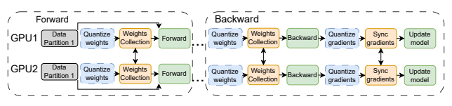

## 2 Related Work

Over the past decade, there has been a massive amount of work on communication-efficient variants of Data-Parallel SGD, e.g. Seide et al. [2014], Dryden et al. [2016], Alistarh et al. [2017], Vogels et al. [2019], Tang et al. [2019], Wang et al. [2018]. (Please see Ben-Nun and Hoefler [2019] for a survey.) The vast majority of this work focuses on gradient compression, the main communication cost of SGD, and is thus mostly orthogonal to our work. The massive scale of recent deep models, e.g. Chowdhery et al. [2022], Brown et al. [2020] has led to significant work on novel distribution strategies Ren et al. [2021], Rajbhandari et al. [2020], Rasley et al. [2020], FairScale [2021] adapted to the requirements of these models, among which FSDP is a standard approach, e.g. Chowdhery et al. [2022]. While there is recent work on further optimizing FSDP, e.g. Jiang et al. [2022], Miao et al. [2022], we are the first to investigate and address its communication costs. Our results are part of a broader line of work using different techniques to make the training of massive models amenable to standard infrastructure, e.g. Wang et al. [2022], Yuan et al. [2022], Borzunov et al. [2022].

Quantized weight exchange during training has been investigated independently in the context of decentralized distributed learning. Tang et al. [2018] presents a scheme which supports quantized weight exchange by having each node extrapolate each of its neighbors' model values; yet, this would require unrealistic Θ(P d) extra memory in our case. Similarly, other work in this vein [Koloskova et al., 2019, Nadiradze et al., 2021, Lu and De Sa, 2020] either requires additional storage, or would not fit the FSDP algorithm structure. Both our analysis approach and our algorithms' guarantees are different relative to this line of work.

Recently, there has been a surge of interest in *post-training* quantization approaches for large language models, which reduce the deployment costs of already trained models Yao et al. [2022],
Dettmers et al. [2022], Frantar et al. [2022], Xiao et al. [2022]. Our work is complementary, in the sense that we show that quantized weights and gradient representations can be applied during training, without accuracy loss, leading to training speedup. On the other hand, these post-training approaches would be too expensive to be executed for compression at training time.

A parallel line of work aims to perform *fully-quantized* training of DNNs Banner et al. [2018],
Zhu et al. [2020]. One general finding from this line of work is that integrating weight and gradient quantization *into training* is extremely challenging, even when using 8bit precision, from both accuracy and performance perspectives. Specifically, this line of work investigates model modifications via e.g.

parameter tuning and specialized normalization layers, in order to recover accuracy. By contrast, we preserve model structure, and do not modify hyper-parameter values, although we only quantize transmitted state.

## 3 Background And Motivation 3.1 Data-Parallel Training

In this classic SGD distribution pattern Bottou [2010], each node (e.g., GPU) holds a copy of the model, and the data is partitioned among the nodes. Each training step samples a subset of the data called a *batch*, performs a *forward pass* over the batch to obtain model predictions, and then performs a *backward pass* to obtain gradient updates. Finally, nodes communicate their local gradient updates in all-to-all fashion to keep the model in sync.

## 3.2 Gradient Compression

Transmitting gradients is the key communication cost of Data-Parallel SGD, and there has been a tremendous amount of work on addressing the resulting bandwidth bottleneck Seide et al. [2014],
Dryden et al. [2016], Strom [2015]. (As this area is extremely vast, we refer to Ben-Nun and Hoefler
[2019], Liu et al. [2020b] for a full overview.) Of these, gradient quantization is a particularly-popular technique, which has the advantage that variants of it can be implemented without additional memory cost. A simple example is the QSGD technique Alistarh et al. [2017], which is essentially a codebook compression method which maps each gradient value to a point on a uniform grid, via randomized rounding. For this, values are first scaled to the range [−1, 1], and then each scaled coordinate v is mapped to one of the endpoints of its quantization interval v ∈ [qi, qi+1] via the following rule:

$$q(v)=\begin{cases}q_{i},\text{with probability}\frac{v-q_{i}}{q_{i+1}-q_{i}},\\ q_{i+1},\text{otherwise}.\end{cases}$$

It is easy to see that this gradient estimator is unbiased with respect to the stochastic quantization, and that its variance can be bounded by the norm of the original gradient. We will revisit this scheme in Sections 4.3 and 5.

## 3.3 Fully-Sharded Data-Parallel Training

As the name suggests, FSDP starts from the Data-Parallel (DP) approach. The main observation is that nodes do not necessarily need to store the full set of parameters at every stage of training, in particular during the backward pass. Specifically, we use the scarce GPU memory to represent only those layers which are in the forward-backward "working set" at a given moment of time.

Initially, model parameters are partitioned, so that each of the P workers is assigned a distinct 1/P fraction of each layer's weights. At each optimization step (see Figure 1, ignoring the dashed quantization operations), before the forward pass on a layer, each worker collects the missing partitions from other workers, computes the output activations, discards the received partitions and proceeds to the next layer. For the backward pass, workers again collect all layer weights, compute the gradients, synchronize them, discard the layer weights and proceed to the next layer.

Technically, each optimization step consists of two AllGather collective operations for weights, and one Reduce-Scatter to sync gradients (full pseudocode in Appendix A).

One can easily check that the above approach implements the standard SGD iteration one-to-one, relative to a sequential execution. If we denote by yt the model's parameter vector used at iteration t, and by g (yt
) the average of the nodes' stochastic gradients at step t, taken at yt
, then, for learning rate η, we can model the iteration as

$$y_{t+1}=y_{t}-\eta g\left(y_{t}\right).$$
). (1)
FSDP with Compression. The natural way to reduce the cost of weight and gradient transmission in the above scheme would be to simply quantize them before transmission. (Please see the full Figure 1.) To examine the impact of adding compression on the above SGD iteration, let us consider abstract quantization operators Qw applied to the weights, and Qg applied to the gradients. (We will specify these quantization functions precisely in Section 4.3, and the exact implementation in Section 5.) For iteration t ≥ 0, let vt be a "virtual" view of the model weights at the beginning of iteration t, obtained by aggregating all the weights, across all the weight partitions, *in full precision*.

First, notice that, if we apply Qw before all transmissions, then the algorithm will only observe the *quantized* version of vt, which we denote by Qw(vt). Then, we can re-write one iteration of the algorithm as vt+1 = Qw(vt) − ηQg(g (Qw(vt))).

This formulation inspires the notation xt = Qw(vt), as the algorithm only "sees" the quantized version of the full-precision weights. Then, we get the following iteration:

$$x_{t+1}=\mathbf{Q}^{\mathbf{w}}(x_{t}-\eta\mathbf{Q}^{\mathbf{g}}(g\left(x_{t}\right))),$$
$\left(2\right)$. 
xt+1 = Qw(xt − ηQg(g (xt))), (2)
which would correspond to an abstractly-quantized version of FSDP. This iteration is the starting point for our analysis in the next section.

## 4 Sgd With Quantized Weights And Provable Convergence

The cornerstone of our method consists of a stochastic gradient method that provably converges to a good *quantized* iterate, under reasonable analytic assumptions. One main novelty is that it converges despite the fact that the domain is *non-convex*. At a very high level, it is similar to the iterative hard thresholding (IHT) method, which achieves provable guarantees despite the fact that it seeks a good iterate in the set of vectors of bounded sparsity Blumensath and Davies [2008]. Throughout this section, we abstract away specifics of the system architecture, since they are not relevant to our analysis. We explain their relationship to the actual implementation in Section 5.

## 4.1 Background And Assumptions

The main challenge we face is to obtain quantized solutions to optimization problems that seek to minimize a function f : R
n → R:
min x∈G
f(x), (3)

$\inf_{G}J\cup\emptyset$
$\square$
where the domain G is a lattice that allows for an efficient communication of its elements. We restrict our attention to shifts of the lattice δZ
n along the direction of the all-ones vector. Formally, G = {δZ
n + r1 : r ∈ [−δ/2*, δ/*2)}.

Overview. Even in the case where f is convex, the non-convex structure of G makes it incredibly difficult to obtain a good minimizer to f without suffering a large loss. In fact, problems of this form are generally NP-hard. However, we show that when f is reasonably well-conditioned we can obtain strong convergence guarantees. The idea consists of alternating stochastic gradient descent steps with applications of a quantization operator Qw which projects the new iterate back onto a certain subset of G. Letting g (xt) be a stochastic gradient, and δ a parameter which determines the coarseness of the quantization grid that we project onto, our update at step t + 1 has the following form:

## Xt+1 = Qw

δ
(xt − ηg (xt)) . (4)
This formulation covers the practical case where the stochastic gradient g (xt) corresponds to a mini-batch stochastic gradient. Indeed, as in practice f takes the form f(x) = 1 Pm PP
i=1 Pm j=1 f(x; yj
),
where S = {y1
, . . . , ym} are data samples, and fi(x) are loss functions at individual nodes, the stochastic gradients obtained via backpropagation takes the form 1 |B| Pj∈B ∇fi(x; yj
), where i is a random node, and B is a sampled mini-batch.

Quantization by Random Shift. For weight quantization, we consider the following unbiased stochastic quantization method. To quantize a vector, we first sample a single fixed random scalar r, then shift all the coordinates of the vector by r. For vector encoding, it rounds each coordinate to the nearest neighbor on the quantization grid, and sends the lattice coordinates of the resulting vector, together with the scalar r. For decoding, it takes the lattice point, and undoes the shift on the quantized coordinates. The notable difference between this and more standard quantization methods, e.g.Alistarh et al. [2017], is that quantization is *dependent* across coordinates. In exchange for losing independence, it allows us to provide stronger guarantees in the context of weight quantization. We define it formally:
Definition 1 (quantization by random shift). Let δ > 0 be a scalar defining the coarseness of the quantization grid. Let a scalar r ∈ [−δ/2*, δ/*2), and let the deterministic operator Qw r,δ : R → R
which rounds to the nearest element in δZ + r:

$$\mathbf{Q}_{r,\delta}^{\mathbf{w}}\left(x\right)=\delta\cdot\left\lfloor{\frac{x-r}{\delta}}\right\rfloor+r\,.$$

Define the randomized quantization operator Qw δ: R → R via Qw δ
(x) = Qw r,δ (x), for a random r ∼ Unif([−δ/2*, δ/*2)). We apply Qw δto vectors, with the meaning that it is dependently applied to each coordinate for a single random shift r.

We use this quantization methods to show that, for a well conditioned loss function, and appropriate grid parameters, the iteration (4) converges, under reasonable analytical assumptions, to a set of weights that are comparable in quality to the best possible quantized weights from a slightly coarser grid. We note that to further reduce communication costs, our method also supports gradient quantization in addition to weight quantization, provided that gradients are quantized using an (arbitrary) unbiased estimator.

Analytical Assumptions. Formally, our analysis uses the following assumptions on f.

1. Unbiased gradient estimators with variance σ: E [g (x)|x] = ∇f (x).

$$f\left(\mathbf{x}+\mathbf{\Delta}\right)\leq f\left(\mathbf{x}\right)+\langle\nabla f\left(\mathbf{x}\right),\mathbf{\Delta}\rangle+{\frac{\beta}{2}}\left\|\mathbf{\Delta}\right\|_{2}^{2}\,.$$
7
3. For α > 0, the Polyak-Łojasiewicz (α-PL) condition:

$$\frac{1}{2}\left\|\nabla f\left(\mathbf{x}\right)\right\|_{2}^{2}\geq\alpha\left(f\left(\mathbf{x}\right)-f^{*}\right)\,,$$

where f
∗ = minx f (x).

The first two assumptions are standard in stochastic optimization (see e.g. Lin et al. [2019]). The Polyak-Łojasiewicz (PL) condition [Karimi et al., 2016] is common in non-convex optimization, and versions of it are essential in the analysis of DNN training [Liu et al., 2020a, Allen-Zhu et al., 2019].

In words, it states that small gradient norm, i.e. approximate stationarity, implies closeness to optimum in function value.

## 4.2 Main Theoretical Results

We are now ready to state our main analytical result.

Theorem 2. Let α, β, δ?, ε > 0 and σ ≥ 0 *be real parameters, and let* η = min  3 10 εα σ2 , 1	*. Let* f : R
n → R be a β-smooth and α-PL function, with access to a stochastic gradient g (x)*, i.e.*
E [g (x)|x] = ∇f (x) with bounded variance E kg (x) − ∇f (x)k 2 2 ≤ σ 2. For each r ∈ [−δ?/2, δ?/2),
let x
?

r,δ?

be any minimizer of f *over* δ?Z
n + r1*. Let* δ =η d16(β/α)
2e
· δ?*. Consider the iteration:*

$${\mathbf{x}}_{t+1}=\mathbf{Q}_{\delta}^{\mathrm{{w}}}\left({\mathbf{x}}_{t}-{\frac{\eta}{\beta}}{\mathbf{g}}\left({\mathbf{x}}_{t}\right)\right)\,.$$

In T =
10 η
·
β α ln f(x 0)−Ef(x
?

r,δ?

)
εiterations we obtain a point x T *satisfying* Ef (x T ) − Ef(x
?

r,δ?

) ≤ ε.

Discussion. To understand the convergence of this method, let us establish as benchmark the expected value Ef(x
?

r,δ?

) of the best iterate on the lattice δ?Z
n + r1, where the expectation is taken over the shift r. Our method finds a point in a slightly finer grid x T ∈ δZ
n + r 01, such that in expectation over the randomness in the algorithm, the value of the function is at most  larger than our benchmark. The sacrifice we have to make in exchange for this surprisingly strong convergence is an increase in resolution for the iterates we maintain, which is dependent, among others, on the condition number of f.

Since our method works with stochastic gradients, we can additionally quantize gradients to further reduce communication. In fact any quantization method that compresses gradients to an unbiased estimator with low variance can be directly plugged into Theorem 2.

We state in the following corollary a generic bound for quantized gradients, which highlights the trade-off between variance and communication for the quantization method.

Corollary 3 (Gradient Quantization). Let α, β, δ?, ε, b > 0 and σ, σ∇ ≥ 0 *be real parameters. Let* f : R
n → R be a β-smooth and α-PL function, with access to a stochastic gradient estimator g (x),
i.e. E [g (x)|x] = ∇f (x) with bounded variance E kg (x) − ∇f (x)k 2 2 ≤ σ 2*. Let* Qg: R
n → R be a gradient quantizer which for any stochastic gradient g (x) encountered during the execution of the algorithm, ensures:
1. *unbiased estimator:* E [Qg(g (x))|g (x)] = g (x),

2. _variance_: $\mathbb{E}\left[\left\|\mathbf{Q^{g}}(\boldsymbol{g}\left(\boldsymbol{x}\right))-\boldsymbol{g}\left(\boldsymbol{x}\right)\right\|_{2}^{2}\left|\boldsymbol{g}\left(\boldsymbol{x}\right)\right|\right]\leq\sigma_{\nabla}^{2}$,

3. requires b *bits to communicate* Qg(g (x)).

_For each $r\in[-\delta_{\star}/2,\delta_{\star}/2)$, let $\mathbf{x}_{r,\delta_{\star}}^{\star}$ be any minimizer of $\min\left\{\frac{3}{10}\frac{\varepsilon\alpha}{\sigma^{2}+\sigma_{\nabla}^{2}},1\right\}$, $\delta=\frac{\eta}{\left[\frac{16(\beta/\alpha)^{2}}{\sigma^{2}+\sigma_{\nabla}^{2}}\right]}\cdot\delta_{\star}$, and consider the iteration:_
be any minimizer of f *over* δ?Z

$$e r~\delta_{\star}\mathbb{Z}^{n}+r\cdot{\bf1}.~~~L e t~\eta~=$$

$\uparrow$ . 

$${\mathbf{x}}_{t+1}=\mathbf{Q}_{\delta}^{\mathbf{w}}\left({\mathbf{x}}_{t}-{\frac{\eta}{\beta}}\mathbf{Q}^{\mathbf{g}}\left({\mathbf{g}}\left({\mathbf{x}}_{t}\right)\right)\right)\,.$$
$n\ T=\frac{10}{\eta}\cdot\frac{\beta}{\alpha}\ln\frac{f(x_0)-\mathbb{E}f\left(x_{r,\delta_\star}^\star\right)}{\varepsilon}\ it$
εiterations we obtain a point x T *satisfying* Ef (x T ) − Ef(x
?

r,δ?

) ≤ ε.

Furthermore, the entire algorithm requires O
b ·
σ 2+σ 2
∇
εα β α ln f(x 0)−Ef(x
?

r,δ?

)
ε bits to communicate the quantized gradients.

We notice that since b and σ∇ are inversely associated, we can establish a trade-off between the number of iterations and the total communication. As a matter of fact, this trade-off kicks in only at the point where the variance of the quantized gradient estimator becomes as large as that of the stochastic gradient, as the number of iterations scales linearly with σ 2 + σ 2
∇. For example, given a resolution parameter δ∇ > 0, a simple gradient quantization scheme such as the one employed by QSGD, quantizes gradient entries to δ∇Z
n, while guaranteeing σ 2
∇ ≤ δ∇G`1
, where G`1 ≥ kg (x) k1, and b = O(G`1
/δ∇ · (ln n + ln G`1
)) bits required for communication. See a more detailed discussion in Section D.3. By varying δ∇ we distinguish between the extreme cases, corresponding to the scenarios where we the quantized gradients are dense and sparse, respectively. While the total communication does not improve by varying δ∇, by doing so we are able to reduce the communication performed in each iteration, in practice Alistarh et al. [2017].

Dense gradients: setting δ∇ = σ 2/G`1
, we obtain exactly the same number of iterations as in the basic case without quantized gradients, but the communication per iteration is reduced to O(G2
`1
/σ2· (ln n + ln G`1
)).

Sparse gradients: setting δ∇ = G`1
, the number of iterations scales with max σ 2, G2
`1 rather than σ 2, but the pre-step communication is reduced to O (ln n + ln G`1
) bits.

## 4.3 Analysis Overview

Let us briefly explain the intuition behind our theoretical analyses. We view our iteration as a version of projected gradient descent, where iterates are projected onto the non-convex domain of quantized vectors. In general, when the domain is convex, projections do not hurt convergence.

But in our setting the distance to the optimal solution can increase and drastically affect the loss.

However, we can show a trade-off between how much this distance increases and the ratio between the target and optimal resolution δ/δ?.

To understand this better, consider a point x 0 obtained by taking a step x 0 = Qw δ
(x −
1 β ∇f(x)).

Using smoothness, we can verify that this significantly decreases the loss, provided that the quantization operator does not perturb its input by too much in `2 norm. Formally, using Lemma 7 we see that

$$\begin{array}{l}{{f(\mathbf{x}^{\prime})\leq f(\mathbf{x})-\frac{1}{2\beta}\|\nabla f(\mathbf{x})\|_{2}^{2}}}\\ {{\quad+\frac{\beta}{2}\left\|\mathbf{Q}_{\delta}^{\mathbf{w}}\left(\mathbf{x}-\frac{1}{\beta}\nabla f(\mathbf{x})\right)-\left(\mathbf{x}-\frac{1}{\beta}\nabla f(\mathbf{x})\right)\right\|_{2}^{2}\,.}}\end{array}$$
(5)  $\frac{1}{2}$
Since compared to a vanilla gradient method, this suffers a reduction in the progress made in a single iteration, we can force this to be significantly smaller, so as not to undo more than a fraction of the progress we would ideally make. To do so we notice that we can charge the last term in (5) to the current error in function value, and we can make this dependence be arbitrarily small by using a finer resolution δ for our quantization grid. This is captured by the following crucial lemma, which we prove in Section D.4.2.

Lemma 4. Let δ? > δ > 0, such that δ?/δ ∈ Z*. Let* x ∈ R
n, and for all r ∈ [−δ?/2, δ?/2), let an arbitrary x
?

r,δ?

∈ δ?Z
n + r1*. Then*

$$\mathbb{E}\left[\left\|\mathbf{Q}_{\delta}^{\mathrm{w}}\left(\mathbf{x}\right)-\mathbf{x}\right\|_{2}^{2}\right]\leq{\frac{\delta}{\delta_{\star}}}\mathbb{E}_{r}\left[\left\|\mathbf{x}_{r,\delta_{\star}}^{\star}-\mathbf{x}\right\|_{2}^{2}\right]\,.$$

Using Lemma 4, together with the α-PL condition, we can charge the extra error term to

$$\frac{\beta}{2}\cdot\frac{\delta}{\delta_{\star}}\mathbb{E}_{r}\left[\frac{2}{\alpha}\left(f\left(\mathbf{x}-\frac{1}{\beta}\nabla f(\mathbf{x})\right)-f(\mathbf{x}_{r,\delta_{\star}}^{\star})\right)\right]\,,$$

where x
?

r,δ?

are picked to be the best minimizers in δ?Z
n + r1. To simplify the exposition and highlight the main ideas, let us assume that Er[f(x
?

r,δ?

)] = f(x
?). Since by the α-PL condition we know that the gradient norm is large compared to the error in function value, we conclude that

$$f(\mathbf{x}^{\prime})-f(\mathbf{x}^{\star})\leq f(\mathbf{x})-f(\mathbf{x}^{\star})-\frac{\alpha}{\beta}\left(f(\mathbf{x})-f(\mathbf{x}^{\star})\right)$$ $$+\frac{\beta}{\alpha}\cdot\frac{\delta}{\delta_{\star}}\left(f\left(\mathbf{x}-\frac{1}{\beta}\nabla f(\mathbf{x})\right)-f(\mathbf{x}^{\star})\right)$$ $$\leq\left(f(\mathbf{x})-f(\mathbf{x}^{\star})\right)\left(1-\frac{\alpha}{\beta}+\frac{\beta}{\alpha}\frac{\delta}{\delta_{\star}}\right)\,.$$

This shows that by setting the δ ≤ δ? ·(α/β)
2/2, in each iteration the error contracts by a 1−Θ(α/β)
factor, which allows us to conclude that this algorithm converges linearly to a minimizer. We provide full proofs in Section D.

## 5 Qsdp Implementation 5.1 Overview

We implemented a practical version of the QSDP algorithm described in the previous section, supporting both weight and gradient quantization, in Pytorch Paszke et al. [2019] starting from the PyTorch FSDP support. Our implementation uses the CGX framework Markov et al. [2022] as a communication backend, to which we added support for quantized AllGather and Reduce-Scatter collectives.

In the original FSDP implementation, layers are packed into groups: weights and gradients of layers in the same group are concatenated before communication. In QSDP, we compress layers separately, filtering out normalization layers and biases, which are communicated in full precision.

This filtering is implemented at the level of the CGX communication backend. The quantized AllGather and Reduce-Scatter operations are implemented by leveraging peer-to-peer NVIDIA
NCCL primitives. For multi-node (inter-server) communication, we used hierarchical versions of the algorithms, to reduce the size of inter-node transmissions.

One important optimization regards the granularity at which quantization is performed. Specifically, applying quantization over large tensors suffers from scaling issues, which results in accuracy degradation. To address this, we perform compression independently into equally-sized "buckets" of fixed size, and compress each bucket independently. This approach sacrifices compression by a negligible amount (as we need to transmit min-max scaling meta-information for each bucket), but helps avoid loss in terms of model quality.

Bucketing (or grouping) on the weights is known to be necessary for good accuracy when quantizing *pre-trained* LLMs Dettmers and Zettlemoyer [2022]. It is also justified theoretically
(Theorem 2), as it both reduces compression variance, and allows us to explore solutions over finer-grained lattices. We observed experimentally that bucket size 1024 provides a good balance between compression and accuracy, and use it as a universal hyper-parameter. In the context of this optimization, we observed that the impact of stochasticity in the quantization becomes minimal.

## 5.2 Learned Weight Quantization

We now describe an additional (optional) optimization, which allows us to further reduce practical bitwidth, at little to no accuracy loss. The motivating observation behind this optimization is that the quantization schemes we use for weights and gradients assume *uniform* locations of the quantization levels. Yet, this uniform grid does not take the distribution of values into account. The idea of adapting the locations of quantization levels to the data distribution has already been studied Zhang et al. [2017], Faghri et al. [2020]. However, existing dynamic-programming approaches Zhang et al.

[2017] have high computational cost (quadratic in the number of data points); thus, we use a fast version of gradient-descent-based optimization over the quantization levels Faghri et al. [2020].

The goal of the distribution-aware quantizer in Algorithm 2 is to select new locations for a fixed number of quantization points, and weight values, so as to minimize the error introduced by quantization. The algorithm runs iteratively across all values, finds the locations of quantization points for each value, and updates the *quantization points* using the gradient descent update rule.

We run this heuristic periodically after a warmup period, separately for the weights and gradients of each layer. We save the derived locations of the quantization levels, and use them for quantization until the next re-computation.

## 6 Experimental Validation 6.1 Experimental Setup

Infrastructure. We evaluate QSDP for training GPT-scale LLMs using multiple cloud-grade Amazon EC2 p3dn.24xlarge machines, with 8 V100 SXM2 GPUs each. Each GPU has 32GB
memory. The inter-GPU interconnect is provisioned by NVLinks with 200Gbps, while the inter-server bandwidth is of 100 Gbps.

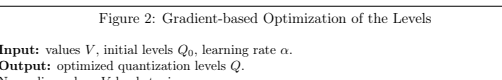

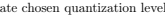

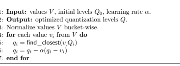

5: qi = find_closest(v,Qi) // Quantize using current level 6: qi = qi − α(qi − vi) // Update chosen quantization level
Environment and Tasks. We use the official NGC PyTorch 22.05-py3 Docker image with PyTorch 1.12, CUDA 11.6.2, NCCL 2.12, and the MosaicML Composer library (version 0.12), as well as a fork of the CGX communication library Markov et al. [2022]. All experiments were run with with MosaicML Large Language Models implementation Mos [2022]. The benchmarks run the pre-training of different version of GPT-family models Radford et al. [2018], Brown et al. [2020], varying the sizes of the models, on the C4 dataset Raffel et al. [2019]. Specifically, we examine accuracy on GPT
models with 125M, 350M, and 1.3B parameters. For benchmarks, we use 4 servers with 8 GPUs each. See Appendix A for training details.

Baselines. As a baseline we use training with default parameters, which is already highly-optimized by MosaicML Mos [2022]. We note that directly using INT8 quantization, without bucketing, resulted in very poor accuracy, and therefore we do not use it as a baseline. In terms of communication, the baseline transmits weights in full (FP32) precision, and gradients in half (FP16) precision. In QSDP experiments, we *do not* modify any hyperparameters. We convert gradients to full precision before quantization. For all timing experiments, the reported numbers are averaged over 50 training steps after warm-up of 10 iterations. Our main accuracy measure is *perplexity*, which is known to be a very stringent accuracy measure in this setting, and correlates extremely well with zero-shot performance Dettmers et al. [2022].

Accuracy Recovery. We first examine the effect of quantization on model quality, i.e. final model perplexity, in the end-to-end experiments. The default bit-width for weights and gradients quantization is 8 bits, using 1024 bucket size, which we illustrate as W8G8. We communicate normalization layers and biases in full precision. We emphasize that straightforward round-to-nearest or stochastic quantization *does not converge* to reasonable final perplexity in this setup: Naive quantization without bucketing loses more than 2 units of perplexity on GPT-125M, a model on which W8G8 with 1024 bucket size *improves* perplexity.

The accuracy results are presented in Table 1. The QSDP final perplexity is almost identical to that of regular training, and QSDP can even *slightly improve* the baseline accuracy. We stress that we did not perform any parameter tuning: quantization parameters are the same across all layers.

End-to-end Speedup. For end-to-end training speedup improvements, we use multi-node GPT
pretraining under standard hyperparameters. We examine speedup for different inter-node bandwidths: 10 Gbits, 50 Gbits and 100 Gbits. For that, we artificially reduce input-output bandwidth on each node, using the UNIX tc tool TC [2001]. The results are presented in Figure 4. First, please notice that standard FSDP training has a non-trivial bandwidth bottleneck even at 100Gbps bandwidth as we increase model size, and that this bandwidth bottleneck can dominate training time on the lower 10Gbps bandwidth. Second, the running time of QSDP is *essentially constant* across all

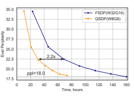

three scenarios, showing that it has essentially removed the bandwidth bottleneck. More precisely, QSDP outperforms the baseline by up to 15% in the 100Gbps scenario (a non-trivial reduction of 12 hours of training time or 1.5k$ of cloud costs1), and by 2.25x in the 10Gbps scenario.

Learned quantization. We examined the performance of learned quantization for the small 125M parameters model. We ran the optimization algorithm after 400, 1900 and 3800 training steps, and noticed that optimizing the locations of quantization levels has no effect for bit-widths higher than 6 bits, but leads to noticeable improvements for lower bit-widths. Please see Table 3. Learned weight quantization allows to improve the final model performance for different weight and gradient quantization parameter pairs, reaching perplexities that are close to the baseline. Specifically, using learned quantization results in reaching the highest compression ratio for weights and gradient in training (i.e. 5 and 4 bits respectively) without substantial accuracy impact. We expand upon these experiments in Appendix C.

Table 1: Perplexities recoveries for different models end-to-end training using QSDP. Weights and gradients quantized to 8 bits, uniform quantization.

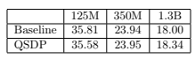

## 7 Conclusion

Motivated by the efficient distributed training of large language models, we have explored the feasibility of fully-quantized training for such models, with respect to both weights and gradients.

This led to an interesting new analysis, showing that SGD can indeed converge with strong convergence guarantees even with quantized iterates, as long as a good quantized solution exists.

Complementing this analysis, we proposed QSDP, a quantized an extension of the popular Fully Sharded Data Parallel (FSDP) distributed training approach, in which *all transmitted state is in* 1price of 12 hours training on 4 AWS p3dn.24xlarge instances Table 2: Final perplexities of training 125m GPT-2 model with combinations of weights and gradients low-bits uniform (not learned) quantization.

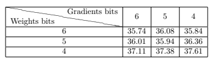

Step time, s

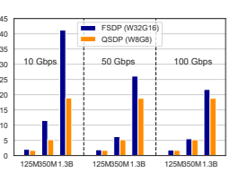

quantized form. We also provided a highly-efficient implementation of QSDP in Pytorch, which we showed to successfully eliminate the bandwidth bottleneck in large-scale distributed training of modern language models, without sacrificing accuracy. Specifically, our experimental validation across three model sizes showed that training with QSDP reaches up to 2.2× speedup.

Our results suggest that communication compression can be an effective tool in the context of novel distribution schemes motivated by large-scale training. Specifically, we believe we are the first to show both convergence guarantees and strong practical performance for simple *weight* compression schemes being applied during SGD-based training, which should motivate further work in this direction. In particular, an interesting extension of our work would be to examine whether the lower-precision weight representation can also be exploited for faster runtimes.

## Acknowledgements

AV acknowledges the support of the French Agence Nationale de la Recherche (ANR), under grant ANR-21-CE48-0016 (project COMCOPT), the support of Fondation Hadamard with a PRMO grant, and the support of CNRS with a CoopIntEER IEA grant (project ALFRED).

## References

Mosaicml examples. https://github.com/mosaicml/examples, 2022. 11, 18 Table 3: Final perplexities of low-bits quantization of 125m GPT-2 model using the learned quantization levels. Learned quantization in the W6G4 configuration provides lower perplexity than the baseline.

| baseline   | w6g4   | w5g4   | w4g4   | w4g32   |       |
|------------|--------|--------|--------|---------|-------|
| Uniform    | 35.81  | 35.81  | 36.34  | 37.61   | 37.11 |
| Learned    | 35.75  | 36.01  | 36.94  | 36.55   |       |

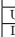

Dan Alistarh, Demjan Grubic, Jerry Li, Ryota Tomioka, and Milan Vojnovic. QSGD: Communicationefficient sgd via gradient quantization and encoding. *Advances in Neural Information Processing* Systems, 30:1709–1720, 2017. 2, 3, 4, 6, 8, 27, 28 Zeyuan Allen-Zhu, Yuanzhi Li, and Zhao Song. A convergence theory for deep learning via overparameterization. pages 242–252. PMLR, 2019. 7 Ron Banner, Itay Hubara, Elad Hoffer, and Daniel Soudry. Scalable methods for 8-bit training of neural networks. *Advances in neural information processing systems*, 31, 2018. 3 Tal Ben-Nun and Torsten Hoefler. Demystifying parallel and distributed deep learning: An in-depth concurrency analysis. *ACM Computing Surveys (CSUR)*, 52(4):1–43, 2019. 3, 4 Thomas Blumensath and Mike E Davies. Iterative thresholding for sparse approximations. Journal of Fourier analysis and Applications, 14(5-6):629–654, 2008. 2, 5 Alexander Borzunov, Dmitry Baranchuk, Tim Dettmers, Max Ryabinin, Younes Belkada, Artem Chumachenko, Pavel Samygin, and Colin Raffel. Petals: Collaborative inference and fine-tuning of large models. *arXiv preprint arXiv:2209.01188*, 2022. 3 Léon Bottou. Large-scale machine learning with stochastic gradient descent. In Proceedings of COMPSTAT'2010, pages 177–186. Springer, 2010. 1, 4 Tom Brown, Benjamin Mann, Nick Ryder, Melanie Subbiah, Jared D Kaplan, Prafulla Dhariwal, Arvind Neelakantan, Pranav Shyam, Girish Sastry, Amanda Askell, et al. Language models are few-shot learners. *Advances in neural information processing systems*, 33:1877–1901, 2020. 3, 11

Aakanksha Chowdhery, Sharan Narang, Jacob Devlin, Maarten Bosma, Gaurav Mishra, Adam Roberts, Paul Barham, Hyung Won Chung, Charles Sutton, Sebastian Gehrmann, et al. Palm:
Scaling language modeling with pathways. *arXiv preprint arXiv:2204.02311*, 2022. 3
Tim Dettmers and Luke Zettlemoyer. The case for 4-bit precision: k-bit inference scaling laws. arXiv preprint arXiv:2212.09720, 2022. 10 Tim Dettmers, Mike Lewis, Younes Belkada, and Luke Zettlemoyer. LLM.int8(): 8-bit matrix multiplication for transformers at scale. *arXiv preprint arXiv:2208.07339*, 2022. 3, 11 Nikoli Dryden, Sam Ade Jacobs, Tim Moon, and Brian Van Essen. Communication quantization for data-parallel training of deep neural networks. In Proceedings of the Workshop on Machine Learning in High Performance Computing Environments, pages 1–8. IEEE Press, 2016. 3, 4 Fartash Faghri, Iman Tabrizian, Ilia Markov, Dan Alistarh, Daniel M Roy, and Ali Ramezani-Kebrya.

Adaptive gradient quantization for data-parallel sgd. Advances in neural information processing systems, 33:3174–3185, 2020. 10 FairScale. Fairscale: A general purpose modular pytorch library for high performance and large scale training. https://github.com/facebookresearch/fairscale, 2021. 1, 2, 3 Simon Foucart. Sparse recovery algorithms: sufficient conditions in terms of restricted isometry constants. In *Approximation Theory XIII: San Antonio 2010*, pages 65–77. Springer, 2012. 2 Elias Frantar, Saleh Ashkboos, Torsten Hoefler, and Dan Alistarh. Gptq: Accurate post-training quantization for generative pre-trained transformers. *arXiv preprint arXiv:2210.17323*, 2022. 3 Aaron Harlap, Deepak Narayanan, Amar Phanishayee, Vivek Seshadri, Nikhil Devanur, Greg Ganger, and Phil Gibbons. Pipedream: Fast and efficient pipeline parallel dnn training. arXiv preprint arXiv:1806.03377, 2018. 1 Yanping Huang, Youlong Cheng, Ankur Bapna, Orhan Firat, Dehao Chen, Mia Chen, HyoukJoong Lee, Jiquan Ngiam, Quoc V Le, Yonghui Wu, et al. Gpipe: Efficient training of giant neural networks using pipeline parallelism. *Advances in neural information processing systems*, 32, 2019.

1 Youhe Jiang, Xupeng Miao, Xiaonan Nie, and Bin Cui. Osdp: Optimal sharded data parallel for distributed deep learning. *arXiv preprint arXiv:2209.13258*, 2022. 3 Hamed Karimi, Julie Nutini, and Mark Schmidt. Linear convergence of gradient and proximalgradient methods under the Polyak-Łojasiewicz condition. In *Joint European Conference on* Machine Learning and Knowledge Discovery in Databases, pages 795–811. Springer, 2016. 7, 31 Sai Praneeth Karimireddy, Quentin Rebjock, Sebastian Stich, and Martin Jaggi. Error feedback fixes signsgd and other gradient compression schemes. In *International Conference on Machine* Learning, pages 3252–3261. PMLR, 2019. 2 Anastasia Koloskova, Sebastian Stich, and Martin Jaggi. Decentralized stochastic optimization and gossip algorithms with compressed communication. In International Conference on Machine Learning, pages 3478–3487. PMLR, 2019. 3 Hugo Laurençon, Lucile Saulnier, Thomas Wang, Christopher Akiki, Albert Villanova del Moral, Teven Le Scao, Leandro Von Werra, Chenghao Mou, Eduardo González Ponferrada, Huu Nguyen, et al. The bigscience roots corpus: A 1.6 tb composite multilingual dataset. In Thirty-sixth Conference on Neural Information Processing Systems Datasets and Benchmarks Track, 2022. 1 Tao Lin, Sebastian U Stich, Luis Barba, Daniil Dmitriev, and Martin Jaggi. Dynamic model pruning with feedback. 2019. 7 Chaoyue Liu, Libin Zhu, and Mikhail Belkin. Toward a theory of optimization for over-parameterized systems of non-linear equations: the lessons of deep learning. *arXiv preprint arXiv:2003.00307*,
2020a. 7 Ji Liu, Ce Zhang, et al. Distributed learning systems with first-order methods. *Foundations and* Trends® *in Databases*, 9(1):1–100, 2020b. 4 Yucheng Lu and Christopher De Sa. Moniqua: Modulo quantized communication in decentralized sgd. In *International Conference on Machine Learning*, pages 6415–6425. PMLR, 2020. 3 Ilia Markov, Hamidreza Ramezanikebrya, and Dan Alistarh. Cgx: Adaptive system support for communication-efficient deep learning, 2022. URL https://arxiv.org/abs/2111.08617. 9, 11 Xupeng Miao, Yujie Wang, Youhe Jiang, Chunan Shi, Xiaonan Nie, Hailin Zhang, and Bin Cui.

Galvatron: Efficient transformer training over multiple gpus using automatic parallelism. arXiv preprint arXiv:2211.13878, 2022. 3 MosaicML. Mosaic LLMs (part 2): Gpt-3 quality for <$500k, 2022. URL https://www.mosaicml.

com/blog/gpt-3-quality-for-500k. 2 Giorgi Nadiradze, Amirmojtaba Sabour, Peter Davies, Shigang Li, and Dan Alistarh. Asynchronous decentralized sgd with quantized and local updates. *Advances in Neural Information Processing* Systems, 34:6829–6842, 2021. 3 Adam Paszke, Sam Gross, Francisco Massa, Adam Lerer, James Bradbury, Gregory Chanan, Trevor Killeen, Zeming Lin, Natalia Gimelshein, Luca Antiga, Alban Desmaison, Andreas Kopf, Edward Yang, Zachary DeVito, Martin Raison, Alykhan Tejani, Sasank Chilamkurthy, Benoit Steiner, Lu Fang, Junjie Bai, and Soumith Chintala. Pytorch: An imperative style, high-performance deep learning library. In *Advances in Neural Information Processing Systems 32*, pages 8024–8035. Curran Associates, Inc., 2019. 2, 9 Alec Radford, Karthik Narasimhan, Tim Salimans, Ilya Sutskever, et al. Improving language understanding by generative pre-training. 2018. 1, 2, 11 Colin Raffel, Noam Shazeer, Adam Roberts, Katherine Lee, Sharan Narang, Michael Matena, Yanqi Zhou, Wei Li, and Peter J. Liu. Exploring the limits of transfer learning with a unified text-to-text transformer. *arXiv e-prints*, 2019. 11 Colin Raffel, Noam Shazeer, Adam Roberts, Katherine Lee, Sharan Narang, Michael Matena, Yanqi Zhou, Wei Li, Peter J Liu, et al. Exploring the limits of transfer learning with a unified text-to-text transformer. *J. Mach. Learn. Res.*, 21(140):1–67, 2020. 1 Samyam Rajbhandari, Jeff Rasley, Olatunji Ruwase, and Yuxiong He. Zero: Memory optimizations toward training trillion parameter models. In *SC20: International Conference for High Performance* Computing, Networking, Storage and Analysis, pages 1–16. IEEE, 2020. 1, 3 Jeff Rasley, Samyam Rajbhandari, Olatunji Ruwase, and Yuxiong He. Deepspeed: System optimizations enable training deep learning models with over 100 billion parameters. In *Proceedings of* the 26th ACM SIGKDD International Conference on Knowledge Discovery & Data Mining, pages 3505–3506, 2020. 1, 3 Jie Ren, Samyam Rajbhandari, Reza Yazdani Aminabadi, Olatunji Ruwase, Shuangyan Yang, Minjia Zhang, Dong Li, and Yuxiong He. {ZeRO-Offload}: Democratizing {Billion-Scale} model training.

In *2021 USENIX Annual Technical Conference (USENIX ATC 21)*, pages 551–564, 2021. 1, 2, 3 Frank Seide, Hao Fu, Jasha Droppo, Gang Li, and Dong Yu. 1-bit stochastic gradient descent and its application to data-parallel distributed training of speech dnns. In Fifteenth annual conference of the international speech communication association. Citeseer, 2014. 3, 4 Mohammad Shoeybi, Mostofa Patwary, Raul Puri, Patrick LeGresley, Jared Casper, and Bryan Catanzaro. Megatron-lm: Training multi-billion parameter language models using model parallelism.

arXiv preprint arXiv:1909.08053, 2019. 1 Nikko Strom. Scalable distributed dnn training using commodity gpu cloud computing. In *Sixteenth* Annual Conference of the International Speech Communication Association, 2015. 4 Hanlin Tang, Ce Zhang, Shaoduo Gan, Tong Zhang, and Ji Liu. Decentralization meets quantization.

arXiv preprint arXiv:1803.06443, 2018. 3 Hanlin Tang, Chen Yu, Xiangru Lian, Tong Zhang, and Ji Liu. Doublesqueeze: Parallel stochastic gradient descent with double-pass error-compensated compression. In International Conference on Machine Learning, pages 6155–6165. PMLR, 2019. 3 Unix TC. *tc(8) Linux User's Manual*, December 2001. 11 Thijs Vogels, Sai Praneeth Karinireddy, and Martin Jaggi. Powersgd: Practical low-rank gradient compression for distributed optimization. *Advances In Neural Information Processing Systems 32*
(Nips 2019), 32, 2019. 3 Hongyi Wang, Scott Sievert, Zachary Charles, Shengchao Liu, Stephen Wright, and Dimitris Papailiopoulos. ATOMO: Communication-efficient learning via atomic sparsification. 2018. 3 Jue Wang, Binhang Yuan, Luka Rimanic, Yongjun He, Tri Dao, Beidi Chen, Christopher Re, and Ce Zhang. Fine-tuning language models over slow networks using activation compression with guarantees. *arXiv preprint arXiv:2206.01299*, 2022. 3 Guangxuan Xiao, Ji Lin, Mickael Seznec, Julien Demouth, and Song Han. Smoothquant: Accurate and efficient post-training quantization for large language models. *arXiv preprint arXiv:2211.10438*,
2022. 3 Zhewei Yao, Reza Yazdani Aminabadi, Minjia Zhang, Xiaoxia Wu, Conglong Li, and Yuxiong He.

ZeroQuant: Efficient and affordable post-training quantization for large-scale transformers. arXiv preprint arXiv:2206.01861, 2022. 3 Binhang Yuan, Yongjun He, Jared Quincy Davis, Tianyi Zhang, Tri Dao, Beidi Chen, Percy Liang, Christopher Re, and Ce Zhang. Decentralized training of foundation models in heterogeneous environments. *arXiv preprint arXiv:2206.01288*, 2022. 3 Hantian Zhang, Jerry Li, Kaan Kara, Dan Alistarh, Ji Liu, and Ce Zhang. Zipml: Training linear models with end-to-end low precision, and a little bit of deep learning. In *International Conference* on Machine Learning, pages 4035–4043. PMLR, 2017. 10 Susan Zhang, Stephen Roller, Naman Goyal, Mikel Artetxe, Moya Chen, Shuohui Chen, Christopher Dewan, Mona Diab, Xian Li, Xi Victoria Lin, et al. Opt: Open pre-trained transformer language models. *arXiv preprint arXiv:2205.01068*, 2022. 1, 2 Feng Zhu, Ruihao Gong, Fengwei Yu, Xianglong Liu, Yanfei Wang, Zhelong Li, Xiuqi Yang, and Junjie Yan. Towards unified int8 training for convolutional neural network. In *Proceedings of the* IEEE/CVF Conference on Computer Vision and Pattern Recognition, pages 1969–1979, 2020. 3 Figure 5: Pseudocode of QSDP for a Fixed Layer

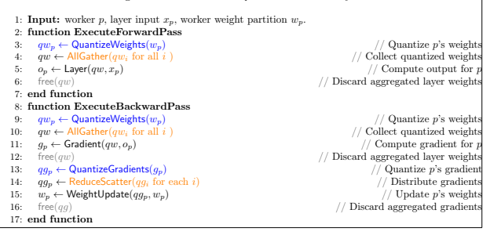

## A Training Details.

For training of GPT-2 models we were using MosaicML Mos [2022] examples. The global batch size for 125M and 350M models was 256, for 1.3B - 512, resulting in 4 gradient accumulations at each iteration. For all models AdamW optimizer was used, the optimizer parameters are presented in the Table 4. 125M model was trained in 4800 steps, 350M model in 13400 steps, 1.3B model in 14000 steps.

| 125M          | 350M      | 1.3B      |           |
|---------------|-----------|-----------|-----------|
| learning rate | 6e-4      | 3e-4      | 2e-4      |
| betas         | 0.9, 0.95 | 0.9, 0.95 | 0.9, 0.95 |
| epsilon       | 1e-8      | 1e-8      | 1e-8      |

Table 4: AdamW optimizer parameters.

## B Network Overhead Experiments

In order to evaluate the effect on communications in FSDP training we conducted the synthetic experiment which reduces the bandwidth costs in each iteration. Specifically, given the buffer of size N which is about to be communicated, and compression ratio γ we only transmit the first N/γ elements. The results for our setup (4 x 8V100-32G GPUs) at different internode bandwidths is shown in the Figures.6, communication weights and gradients are reduced to the same compression ratio. We see that the most effect of compression is reached as expected for the largest 1.3B model and at lowest bandwidth. However, one can get around 80% speedup at high bandwidth when up to 8x compression ratio is applied. Also, we notice that 8× compression almost reaches the ideal scaling for large model and has a evident overhead over the no-communication training in case of the small model. It infers that the large models have a bottleneck in bandwidth component of the communication and the small model has a dominating latency part.

To see the variance of the compression effects on weights and gradients we conducted the similar experiment for different combinations of compression ratio pairs (see 5). We observe that weight compression gives more performance profits than gradient compression. This can be naturally explained by the fact that weights are communicated more frequently than gradients in FSDP (in this particular experiment weights are communicated 5 times per one gradient exchange) and the amount of transmissions per communication is similar.

The difference between the synthetic experiment and QSDP performance numbers with the same compression ratios can be justified by the performance inefficiency of NCCL point-to-point communication primitives on which QSDP compressed communication is based on - the compression overhead in our experiments was verified to be negligible (less than 1% per iteration).

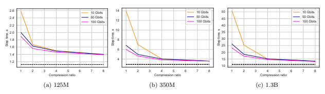 

Table 5: Training step timings (in seconds) for 1.3B model at 100 Gbps bandwidth with various combinations of weights and gradient compression ratio.

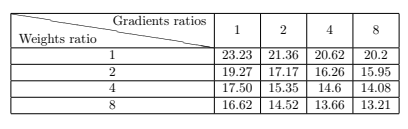

## C Learned Quantization

We implemented stochastic gradient descent optimization of quantization levels in PyTorch. We use learning rate 0.01, batch size 1024. We run the learning for each layer larger than 1e5 parameters, for other layers uniform quantization was used. We evaluate the quality of quantization levels by comparing L2 of compression error introduced by quantizing a buffer using the levels. We conducted the such evaluation for weights quantized to 5 bits and gradients quantized to 4 bits during the training of GPT 125M model. The results for one of the attention layers and LM head layer are shown in the Figures 7 and 8. The dashed vertical lines show the moment of running learning quantization levels algorithm. We see that compression error of learned quantization levels is constantly lower for the learned algorithm, and the lower bits-width (for gradients we use 4 bits quantizaton) the larger the gap between the considered methods. Also, we see that the compression error of the learned quantization only increases in sync with uniform quantization over time. It means that learning algorithm can be run only once, at the start of the training.

Also, we measured overhead of running learning algorithm for GPT 125M with weights quantized to 5 bits, gradients to 4 bits. The overhead of learning algorithm amounts to around 9 minutes, whereas the full training takes lasts 5 hours.

The extra experiments results with low bit-width quantization are shown in the Table. 6. The number doesn't show full perplexity recovery but they represent the improvements achieved by learned levels algorithm. We can see that with learned quantization levels one can reduce up to 3 units of perplexity.

Table 6: Final perplexities of low-bits quantization of 125m GPT-2 model using the learned quantization levels.

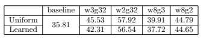

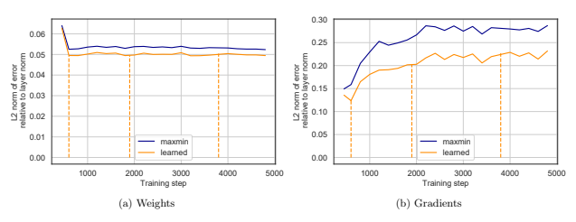

## D Convergence Proofs

In this section we provide the convergence analysis for our algorithms.

## D.1 Overview

We use the notation and assumptions defined in Section 4.1. As all of our analyses revolve around bounding the progress made in a single iteration, to simplify notation we will generally use x to denote the current iterate, and x 0to denote the iterate obtained after the generic update:

$${\boldsymbol{x^{\prime}}}=\mathbf{Q}_{\delta}^{\mathrm{w}}\left({\boldsymbol{x}}-{\frac{\eta}{\beta}}{\boldsymbol{g}}\left({\boldsymbol{x}}\right)\right)\,,$$

where β is the smoothness parameter of f. In Section D.2 we will first prove convergence for the deterministic method, where we have direct access to the gradients of f. The analysis precisely follows the steps we described in Section 4.1. Then, we extend this analysis to the case of stochastic gradients, and provide the full proof for Theorem 2. Finally, in Section D.3 we show that given an appropriate gradient quantization method with bounded variance, we can use it on top of our iteration to further reduce the required amount of communication, and thus prove Corollary 3.

Before proceeding, we first formally analyze the quantization method we defined in Section 4.1, and show some additional properties that will be useful later.

Lemma 5. Let v ∈ R
n, and let δ > 0*. Then,*

$$\mathbb{E}\left[\mathbf{Q}_{\delta}^{\mathbf{w}}\left({\boldsymbol{v}}\right)\right]={\boldsymbol{v}}\ ,$$
$$\begin{array}{c}{{\mathbb{E}\left[\left|\mathbf{Q}_{\delta}^{\mathbf{w}}\left(\mathbf{v}\right)-\mathbf{v}\right|\right]_{2}^{2}\right]=\delta^{2}\cdot\sum_{i=1}^{n}\left\{\frac{v_{i}}{\delta}\right\}\left(1-\left\{\frac{v_{i}}{\delta}\right\}\right)\,,}}\\ {{\mathbb{E}\left[\left|\mathbf{Q}_{r,\delta}^{\mathbf{w}}\left(\mathbf{v}\right)-r\mathbf{1}\right|\right]_{0}\right]\leq\left\|\mathbf{v}\right\|_{1}/\delta\,.}}\end{array}$$

$\alpha$t. 
Since the proofs are technical, we defer them to Section D.4.1. The most important feature of this quantization scheme is captured by Lemma 4, which is crucial for our convergence proof. We first restate it, and prove it formally in Section D.4.2.

Lemma 4. Let δ? > δ > 0, such that δ?/δ ∈ Z*. Let* x ∈ R
n, and for all r ∈ [−δ?/2, δ?/2), let an arbitrary x
?

r,δ?

∈ δ?Z
n + r1*. Then*

$$\mathbb{E}\left[\left\|\mathbf{Q}_{\delta}^{\mathrm{w}}\left(\mathbf{x}\right)-\mathbf{x}\right\|_{2}^{2}\right]\leq{\frac{\delta}{\delta_{\star}}}\mathbb{E}_{r}\left[\left\|\mathbf{x}_{r,\delta_{\star}}^{\star}-\mathbf{x}\right\|_{2}^{2}\right]\,.$$

The proof crucially relies on the fact that δ/δ? ∈ Z, and is rooted in the following inequality:
Lemma 6. Let y ∈ R and k ∈ Z*. Then*

$$\left(1-\left\{y\right\}\right)\left\{y\right\}\leq k\left(1-\left\{{\frac{y}{k}}\right\}\right)\left\{{\frac{y}{k}}\right\}\,.$$

Proof. It suffices to consider y ∈ [0, k], as both {y}(1 − {y}) and {y/k}(1 − {y/k}) are periodic within this interval. The function {y/k}(1 − {y/k}) is a quadratic which is monotonically increasing over [0*, k/*2] and symmetric around k/2. As (1− {y}){y} is periodic on intervals of length 1 it suffices to show that (1 − {y}){y} ≤ k1 −yk
	 yk on the interval [0, 1]. At this point we can drop the fractional part, and simply need to compare two quadratics over [0, 1]. Equivalently we need to show that k(1 − y/k)y/k ≥ y(1 − y) over [0, 1], which after simplifying both sides is equivalent to y 2(1 − 1/k) ≥ 0 over this interval, which is true.

Finally, we provide some basic optimization inequalities, which will allow us to prove our theorems.

Optimization Basics. The first Lemma bounds the change in function value using smoothness, while the latter upper bounds the `2 distance to optimality using the error in function value. We provide the proofs in Sections D.4.3 and D.4.4.

Lemma 7. Let f : R
n → R be a β*-smooth function. Then for any* ∆ ∈ R
n,

$$f\left(\mathbf{x}+\mathbf{\Delta}\right)\leq f\left(\mathbf{x}\right)+\left(1-\eta\right)\left\langle\nabla f\left(\mathbf{x}\right),\mathbf{\Delta}\right\rangle-{\frac{\eta^{2}}{2\beta}}\left\|\nabla f\left(\mathbf{x}\right)\right\|_{2}^{2}+{\frac{\beta}{2}}\left\|{\frac{\eta}{\beta}}\nabla f\left(\mathbf{x}\right)+\mathbf{\Delta}\right\|_{2}^{2}.$$
# 8. $If\ f:\mathbb{R}^n\to\mathbb{R}\ sab$  . 
Lemma 8. If f : R
n → R satisfies the α*-PL condition, then for all* x ∈ R

$$\in\mathbb{R}^{n},$$

where x
? ∈ arg minx f (x).

$\operatorname{g}\min_{\mathbf{x}}f\left(\mathbf{x}\right)$. 
We are now ready to prove the main theorems in this paper.

## D.2 Sgd With Weight Quantization

We first prove the stepping lemma for our quantized gradient method, in the case where full gradients are available. The steps are essentially the same we described in Section 4.1.

$$f\left({\boldsymbol{x}}\right)-f^{\star}\geq{\frac{\alpha}{2}}\left\|{\boldsymbol{x}}-{\boldsymbol{x}}^{\star}\right\|_{2}^{2}\,,$$

Lemma 9. Let f (x) : R
n → R be a β-smooth and α-PL function. For each r ∈ [−δ?/2, δ?/2]*, let* x
?

r,δ?

be any minimizer of f over δ?Z + r*. Let* δ =δ?

d4(β/α)
2e
. Then letting x 0 = Qw δ x −
1 β ∇f (x)
,
one has that in expectation over the random bits used by the quantization operator:

$$\mathbb{E}f\left(\mathbf{x}^{\prime}\right)-\mathbb{E}f\left(\mathbf{x}_{r,\delta_{\star}}^{\star}\right)\leq\left(1-{\frac{\alpha}{2\beta}}\right)\left(\mathbb{E}f\left(\mathbf{x}\right)-\mathbb{E}f\left(\mathbf{x}_{r,\delta_{\star}}^{\star}\right)\right)\,.$$
Proof. Letting ∆ = x 0 − x, we write:  1 β ∇f (x) + ∆  2 2 =  (x + ∆) − x − 1 β ∇f (x)  2 2 =  Qw δ x − 1 β ∇f (x) − x − 1 β ∇f (x)  2 2 . Also using Lemma 4, we have that for any x ? ∈ arg minx f (x), E  Qw δ x − 1 β ∇f (x) − x − 1 β ∇f (x)  2 2 ≤ δ δ? Er " x − 1 β ∇f (x) − x ? r,δ?  2 2 # ≤ 2 δ δ?  Er hx ? r,δ? − x ? 2 2 i+  x − 1 β ∇f (x) − x ?  2 2 ! . Using the α-PL condition we upper bound distance from x ? with function value i.e.

$$\left\|\boldsymbol{x}_{r,\delta_{*}}^{\star}-\boldsymbol{x}^{\star}\right\|_{2}^{2}\leq\frac{2}{\alpha}\cdot f\left(\boldsymbol{x}_{r,\delta_{*}}^{\star}\right)-f\left(\boldsymbol{x}^{\star}\right)\,,$$ $$\left\|\boldsymbol{x}-\frac{1}{\beta}\nabla f\left(\boldsymbol{x}\right)-\boldsymbol{x}^{\star}\right\|_{2}^{2}\leq\frac{2}{\alpha}\left(f\left(\boldsymbol{x}-\frac{1}{\beta}\nabla f\left(\boldsymbol{x}\right)-\boldsymbol{x}^{\star}\right)-f\left(\boldsymbol{x}^{\star}\right)\right)\,.$$  Combining these with Lemma 7 for $\eta=1$ we conclude that 
$$\mathbb{E}f\left(\mathbf{x}^{\prime}\right)\leq f\left(\mathbf{x}\right)-{\frac{1}{2\beta}}\left\|\nabla f\left(\mathbf{x}\right)\right\|_{2}^{2}$$
$$+2\frac{\delta}{\delta_{*}}\cdot\frac{\beta}{\alpha}\left(f\left(\mathbf{x}-\frac{1}{\beta}\nabla f\left(\mathbf{x}\right)\right)-f\left(\mathbf{x}^{\star}\right)\right)+2\frac{\delta}{\delta_{*}}\cdot\frac{\beta}{\alpha}\cdot\mathbb{E}_{\tau}\left[f\left(\mathbf{x}_{\tau,\delta_{*}}^{\star}\right)-f\left(\mathbf{x}^{\star}\right)\right]\,.$$  Again, using the PL condition we lower bound $\frac{1}{2}\left\|\nabla f\left(\mathbf{x}\right)\right\|_{2}^{2}\geq\alpha\left(f\left(\mathbf{x}\right)-f\left(\mathbf{x}^{\star}\right)\right)$, which gives
E -fx 0− f (x ?) ≤ 1 − α β (f (x) − f (x ?)) + 2 δ δ? · β α f x − 1 β ∇f (x) − f (x ?) + 2 δ δ? · β α · Er -fx ? r,δ? − f (x ?) ≤ 1 − α β + 2 δ δ? · β α (f (x) − f (x ?)) + 2 δ δ? · β α · Er -fx ? r,δ? − f (x ?).
Equivalently we obtain

Efx 0− Efx ? r,δ? ≤ 1 − α β + 2 δ δ? · β α f (x) − fx ? r,δ?  + 2 δ δ? · β α · E-fx ? r,δ? − f (x ?) + f (x ?) − Efx ? r,δ?  = 1 − α β + 2 δ δ? · β α f (x) − Efx ? r,δ?  + 2 δ δ? · β α − α β + 2 δ δ? · β α · E-fx ? r,δ? − f (x ?) = 1 − α β + 2 δ δ? · β α f (x) − Efx ? r,δ?  + 4 δ δ? · β α − α β · E-fx ? r,δ? − f (x ?).
23

Since we set δ/δ? =1
$\left[4(\beta/\alpha)^{2}\right]$, the second term is non-positive. Therefore in the form  $$\mathbb{E}f\left(\boldsymbol{x}^{\prime}\right)-\mathbb{E}f\left(\boldsymbol{x}_{r,\delta_{*}}^{\star}\right)\leq\left(1-\frac{\alpha}{2\beta}\right)\left(f\left(\boldsymbol{x}\right)-\mathbb{E}f\left(\boldsymbol{x}_{r,\delta_{*}}^{\star}\right)\right)\,,$$  proof.  
, the second term is non-positive. Therefore in this case we have which concludes the proof.

We now generalize the proof of Lemma 9 to the case where only stochastic gradients are available.

The proof is essentially the same, the main difference being that we isolate terms involving the difference between the stochastic and the true gradient, which we bound separately using our variance bound.

Lemma 10. Let f : R
n → R be a β-smooth and α-PL function. For each r ∈ [−δ?/2, δ?/2]*, let* x
?

r,δ?

be any minimizer of f over δ?Z + r*. Let* δ =η d16(β/α)
2e
· δ?*. Let* x 0 = Qw δ x −
η β g (x)
*, where* g (x) is an unbiased estimator for ∇f (x) i.e. E [g (x)|x] = ∇f (x), and 0 < η ≤ 1 is a step size parameter. Furthermore assume that the variance of g (x) is bounded E kg (x) − ∇f (x)k 2 2 ≤ σ 2, for a real parameter σ > 0. Then, for r ∼ Unif([−δ?/2, δ?/2))*, in expectation over the gradient* stochasticity:

$$\mathbb{E}\left[f\left(\mathbf{x}^{\prime}\right)|\mathbf{x}\right]-\mathbb{E}f\left(\mathbf{x}_{r,\delta_{*}}^{\star}\right)\leq\left(1-{\frac{3}{4}}\eta{\frac{\alpha}{\beta}}\right)\left(f\left(\mathbf{x}\right)-\mathbb{E}f\left(\mathbf{x}_{r,\delta_{*}}^{\star}\right)\right)+{\frac{5}{4}}{\frac{\eta^{2}}{\beta}}\sigma^{2}\,.$$

Proof. We follow the analysis from Lemma 9, while moving the stochastic gradients into expressions that involve the stochastic variance. Letting δ = x 0 − x, we write:

 η β ∇f (x) + ∆  2 2 =  (x + ∆) − x − η β ∇f (x)  2 2 =  Qw r,δ x − η β g (x) − x − η β ∇f (x)  2 2 ≤ 2  Qw r,δ x − η β g (x) − x − η β g (x)  2 2 + 2  η β (g (x) − ∇f (x))  2 2 , where we used the inequality ka + bk 2 2 2 . Also using Lemma 4, we have that for
2 ≤ 2 kak
2 + 2 kbk
2
any x ? ∈ arg minx f (x), E  Qw r,δ x − η β g (x) − x − η β g (x)  2 2 ≤ δ δ? E " x − η β g (x) − x ? r,δ?  2 2 # ≤ 2 δ δ?  E hx ? r,δ? − x ? 2 2 i+  x − η β g (x) − x ?  2 2 ! ≤ 2 δ δ?  E hx ? r,δ? − x ? 2 2 i+ 2  x − η β ∇f (x) − x ?  2 2 + 2  η β (g (x) − ∇f (x))  2 2 ! . Using the α-PL condition we upper bound distance from x ? with function value i.e.

$$\left\|\left.\boldsymbol{x}_{r,\delta_{\star}}^{\star}-\boldsymbol{x}^{\star}\right\|_{2}^{2}\leq{\frac{2}{\alpha}}\cdot\left(f\left(\boldsymbol{x}_{r,\delta_{\star}}^{\star}\right)-f\left(\boldsymbol{x}^{\star}\right)\right)\,,\right.$$ $$\left\|\left.\boldsymbol{x}-{\frac{\eta}{\beta}}\nabla f\left(\boldsymbol{x}\right)-\boldsymbol{x}^{\star}\right\|_{2}^{2}\leq{\frac{2}{\alpha}}\left(f\left(\boldsymbol{x}-{\frac{\eta}{\beta}}\nabla f\left(\boldsymbol{x}\right)\right)-f\left(\boldsymbol{x}^{\star}\right)\right)\,.\right.$$
$$24$$
Combining these with Lemma 7 we conclude that in expectation over the random shift:
fx
0≤ f (x) + (1 − η)h∇f (x), ∆i − η
2
2β
k∇f (x)k
2
2
+
β
2
·
 
2

Qw
r,δ x −
η
β
g (x)
−
x −
η
β
∇fi (x)

2
2
+ 2

η
β
(g (x) − ∇f (x))

2
2
!
≤ f (x) + (1 − η)h∇f (x), ∆i − η
2
2β
k∇f (x)k
2
2
+ 2β
δ
δ?
·
 x
?
r,δ? − x
?
2
2
+ 2

x −
η
β
∇f (x) − x
?

2
2
!
2
+ 2

η
β
(g (x) − ∇f (x))

2
+
η
2
β
kg (x) − ∇f (x)k
2
2
≤ f (x) + (1 − η)h∇f (x), ∆i − η
2
2β
k∇f (x)k
2
2
+ 4 δ
δ?
β
α
f
x −
η
β
∇f (x)
− f (x
?)
+ 4 δ
δ?
β
α
fx
?
r,δ?
− f (x
?)
+
η
2
β δ? 2 Again, using the PL condition we lower bound 12 k∇f (x)k 2 2 ≥ α (f (x) − f (x ?)), which gives that in expectation over the random shift: fx 0− f (x ?) ≤ 1 − η 2α β (f (x) − f (x ?)) + (1 − η)h∇f (x), ∆i + 4 δ δ? β α f x − η β ∇f (x) − f (x ?) + 4 δ δ? β α fx ? r,δ? − f (x ?) + η 2 β 1 + 4 δ δ? kg (x) − ∇f (x)k 2 2 ≤ 1 − η 2α β + 4 δ δ? β α (f (x) − f (x ?)) + 4 δ δ? β α fx ? r,δ? − f (x ?) + (1 − η)h∇f (x), ∆i + η 2 β 1 + 4 δ δ? kg (x) − ∇f (x)k 2 2 . and equivalently, in expectation over the random shift:
1 + 4 δ
kg (x) − ∇f (x)k
2
.
E -fx 0− fx ? r,δ?  ≤ 1 − η 2α β + 4 δ δ? β α f (x) − Efx ? r,δ?  + 8 δ δ? β α − η 2α β Efx ? r,δ? − f (x ?) + (1 − η)h∇f (x), E [∆]i + η 2 β 1 + 4 δ δ? kg (x) − ∇f (x)k 2 2 .
At this point we use Lemma 5 to write

$$\begin{array}{l}{{\mathrm{to~write}}}\\ {{\mathrm{E}\left[\mathbf{\Delta}\right]=\mathrm{E}\left[\mathbf{Q}_{r,\delta}^{\mathrm{w}}\left(\mathbf{x}-{\frac{\eta}{\beta}}\mathbf{g}\left(\mathbf{x}\right)\right)-x\right]}}\\ {{\mathrm{}}}\\ {{\mathrm{}}}\\ {{\mathrm{}}}\\ {{\mathrm{}}}\end{array}$$

25

and thus
$$\left(1-\eta\right)\left\langle\nabla f\left(\mathbf{x}\right),\mathbb{E}\left[\mathbf{\Delta}\right]\right\rangle=-\frac{\eta}{\beta}\left(1-\eta\right)\left\langle\nabla f\left(\mathbf{x}\right),\mathbf{g}\left(\mathbf{x}\right)\right\rangle\,.$$
Therefore, after taking expectation over both the random shift and gradient stochasticity we obtain:
E
-fx
0− fx
?
r,δ?
|x
≤
1 − η
2α
β
+ 4 δ
δ?
β
α
f (x) − Efx
?
r,δ?
 +
8
δ
δ?
β
α
− η
2α
β
Efx
?
r,δ?
− f (x
?)
−
η
β
(1 − η) k∇f (x)k
2
2 +
η
2
β
1 + 4 δ
δ?
σ
2
≤
1 − η
2α
β
+ 4 δ
δ?
β
α
f (x) − Efx
?
r,δ?
 +
8
δ
δ?
β
α
− η
2α
β
Efx
?
r,δ?
− f (x
?)
− 2η (1 − η)
α
β
(f (x) − f (x
?)) + η
2
β
1 + 4 δ
δ?
σ
2
=
1 − η
2α
β
− 2η (1 − η)
α
β
+ 4 δ
δ?
β
α
f (x) − Efx
?
r,δ?
 +
8
δ
δ?
β
α
− η
2α
β
− 2η (1 − η)
α
β
Efx
?
r,δ?
− f (x
?)
+
η
2
β
1 + 4 δ
δ?
σ
2.
Since we set δ/δ? =η
d16(β/α)
2e
, the second term is non-positive. Therefore in this case we have
β
 
1 +
η
4
α
β
2!σ
2
E
-fx
0− Efx
?
r,δ?
|x≤
1 − η
2α
β
− 2η (1 − η)
α
β
+
η
4
α
β
f (x) − Efx
?
r,δ?
 +
η
2
β
 
1 +
η
4
α
β
2!σ
2
≤
1 −
7
4
η
α
β
+ η
2α
β
f (x) − Efx
?
r,δ?
 +
η
2
≤
1 −
3
4
η
α
β
f (x) − Efx
?
r,δ?
 +
5
4
η
2
β
σ
2,
as long as η ≤ 1. This concludes the proof.
Using Lemma 10 the proof of Theorem 2 follows very easily.
Theorem 2. Let α, β, δ?, ε > 0 and σ ≥ 0 *be real parameters, and let* η = min  3 10 εα σ2 , 1	*. Let* f : R
n → R be a β-smooth and α-PL function, with access to a stochastic gradient g (x)*, i.e.*
E [g (x)|x] = ∇f (x) with bounded variance E kg (x) − ∇f (x)k 2 2 ≤ σ 2. For each r ∈ [−δ?/2, δ?/2),
let x
?

r,δ?

be any minimizer of f *over* δ?Z
n + r1*. Let* δ =η d16(β/α)
2e
· δ?*. Consider the iteration:*

$${\mathbf{x}}_{t+1}=\mathbf{Q}_{\delta}^{\mathrm{w}}\left({\mathbf{x}}_{t}-{\frac{\eta}{\beta}}{\mathbf{g}}\left({\mathbf{x}}_{t}\right)\right)\,.$$

In T =
10 η
·
β α ln f(x 0)−Ef(x
?

r,δ?

)
εiterations we obtain a point x T *satisfying* Ef (x T ) − Ef(x
?

r,δ?

) ≤ ε.

Proof. Plugging in Lemma 10 and applying it for T =
10 η β α ln f(x 0)−Ef(x
?

r,δ?

)
ε we obtain:

$$\mathbb{E}f\left(\mathbf{x}_{T}\right)-\mathbb{E}f\left(\mathbf{x}_{r,\delta,}^{\star}\right)\leq{\frac{\varepsilon}{2}}+{\frac{5}{4}}{\frac{\eta^{2}}{\beta}}\sigma^{2}\cdot\sum_{k=0}^{T-1}\left(1-{\frac{3}{4}}\eta{\frac{\alpha}{\beta}}\right)^{k}\leq{\frac{\varepsilon}{2}}+{\frac{5}{4}}{\frac{\eta^{2}}{\beta}}\sigma^{2}\cdot{\frac{4}{3}}{\frac{1}{\eta}}{\frac{\beta}{\alpha}}={\frac{\varepsilon}{2}}+{\frac{5}{3}}{\frac{\eta}{\alpha}}\sigma^{2}\cdot\sum_{k=0}^{T-1}\left({\frac{\varepsilon}{2}}\right)^{k}.$$

26

## D.3 Reducing Communication By Quantizing Gradients

The approach described in Section D.2 maintains quantized weights, but communicating gradients may still be expensive. In this section we show that any reasonable quantization method for gradients can be used to reduce communication, while paying in exchange an increased variance. This trade-off is inherent, as the reduction in the number of bits requires injecting randomness, so as the entropy of the output is not smaller than that of the original message to be communicated.

To do so we use any gradient quantization method Qg, as long as it is an unbiased estimator for the input it takes, and has bounded variance. Our formal requirements for Qg are the following.

Definition 11. We say that a gradient quantization operator Qgis a (σ∇, b)-unbiased quantizer if it:

1. is an unbiased estimator: $\mathbb{E}\left[\mathbf{Q^{\mathbf{g}}}\left(\mathbf{g}\left(\mathbf{x}\right)\right)\right|\mathbf{g}\left(\mathbf{x}\right)\right]=\mathbf{g}\left(\mathbf{x}\right)$, 2. has bounded variance on the stochastic gradients: $\mathbb{E}\left[\left\|\mathbf{Q^{\mathbf{g}}}\left(\mathbf{g}\left(\mathbf{x}\right)\right)-\mathbf{g}\left(\mathbf{x}\right)\right\|_{2}^{2}|\mathbf{g}\left(\mathbf{x}\right)\right]\leq\sigma_{\mathbb{Q}}^{2}$,  \[\begin{array}{
3. requires b bits to communicate Qg(g (x)).

By Lemma 5, these requirements are automatically satisfied by our shift-and-round quantization operator Qw, and we can show that σ∇ and b are determined by the `1 norm of g (x).

Standard Quantization Schemes and Their Communication Cost. Another standard gradient quantization scheme can be obtained by independently rounding each coordinate to one of the neighboring points on the quantization grid, with an appropriate probability. An identical scheme has been previously used in other related works on gradient quantization Alistarh et al. [2017].

Definition 12 (quantization by flipping a coin). Let δ > 0 be a scalar defining the coarseness of the quantization grid. Let the operator Qδ : R → δZ defined as

$\mathsf{L}\left(\mathsf{z}\mathsf{c}\right)$). 
$$\mathbf{Q}_{\delta}\left(x\right)=\begin{cases}\delta\left\lfloor{\frac{x}{\delta}}\right\rfloor&{\mathrm{with~probability~}}1-\left({\frac{x}{\delta}}-\left\lfloor{\frac{x}{\delta}}\right\rfloor\right)\\ \delta\left(\left\lfloor{\frac{x}{\delta}}\right\rfloor+1\right)&{\mathrm{with~probability~}}{\frac{x}{\delta}}-\left\lfloor{\frac{x}{\delta}}\right\rfloor\end{cases}$$
where δ > 0. We apply Qδ to vectors, with the meaning that it is independently applied to each coordinate.

It is fairly easy to prove that this satisfies very similar properties to those proved for Qw in Lemma 5, which we quickly prove in Section D.4.5. We notice an important difference between these two quantization methods. While Q independently quantizes each coordinate, the quantization in Qw is done dependently across coordinates, and the output is always a vector in δZ
n + r1, for a randomly sampled scalar r. Although morally they are quite similar (in fact, the shift after rounding could just as well be ignored, and still have an unbiased extimator), it is important if we want to relate the quality of the final solution to the best set of weights from a reasonably chosen grid. This difference is apparent when trying to provide bounds of the type of Lemma 4, bu this attempt falls through in the case of the Q operator.

As we can naively relate the communication cost of a quantized gradient to its sparsity, it is important to discuss quantitative bounds. In both cases, the sparsity bound depends on the `1 norm of the quantized vector, and its easy to see that it is tight. By comparison, the bound from Alistarh et al. [2017] is provided in terms of the `2 norm of the vector, but pays an additional √n factor, which is suboptimal when the input is analytically sparse. For Qw and Q, we see that the variance introduced by quantizing a generic vector v is bounded by δ kvk1
, while its sparsity is kvk1
/δ.

Hence a naive encoding of this quantized gradient requires at most O
kvk1 δ(ln n + ln kvk1
)
bits of communication.

SGD with Weight and Gradient Quantization. For gradient quantization operators that are unbiased estimators, we can use them as stochastic gradients inside the scheme we derived in Theorem 2. To do so we crucially use the following identity involving conditional variance:
Lemma 13 (Law of total variance). Given random variables X and Y , one has that

$$V a r\left[Y\right]=\mathbb{E}\left[\,V a r\left[Y|X\right]\right]+\,V a r\left[\mathbb{E}\left[Y|X\right]\right]\,.$$

Corollary 14. Consider a stochastic gradient estimator g (x) such that E [g (x)|x] = ∇f (x) and E

hkg (x) − ∇f (x)k 2 2 |x i≤ σ 2. Consider (σ∇, b)-unbiased quantizer (Definition *11). Then*

$$\mathbb{E}\left[\mathbf{Q}_{\delta}\left({\boldsymbol{g}}\left({\boldsymbol{x}}\right)\right)|{\boldsymbol{x}}\right]=\nabla f\left({\boldsymbol{x}}\right)\,,$$

i.e. it is an unbiased estimator for the gradient, and

$$\mathbb{E}\left[\left\|\mathbf{Q}_{\delta}\left({\boldsymbol{g}}\left({\boldsymbol{x}}\right)\right)-\nabla f\left({\boldsymbol{x}}\right)\right\|_{2}^{2}\right]\leq\sigma_{\nabla}^{2}+\sigma^{2}\,.$$

Proof. The fact that the quantized gradient is an unbiased estimator for ∇f (x) follows from the law of total expectation, as

$\mathbb{E}\left[\mathbf{Q}_{\delta}\left(\boldsymbol{g}\left(\boldsymbol{x}\right)\right)|\boldsymbol{x}\right]=\mathbb{E}\left[\mathbb{E}\left[\mathbf{Q}_{\delta}\left(\boldsymbol{g}\left(\boldsymbol{x}\right)\right)|\boldsymbol{x},\boldsymbol{g}\left(\boldsymbol{x}\right)\right]\right]=\mathbb{E}\left[\mathbb{E}\left[\boldsymbol{g}\left(\boldsymbol{x}\right)|\boldsymbol{x}\right]\right]=\nabla f\left(\boldsymbol{x}\right)$
For the variance, we use Lemma 13 to write:

$$\mathbb{E}\left[\left\|\mathbf{Q}_{\delta}\left(\boldsymbol{g}\left(\boldsymbol{x}\right)\right)-\nabla f\left(\boldsymbol{x}\right)\right\|_{2}^{2}\right]=\text{Var}\left[\mathbf{Q}_{\delta}\left(\boldsymbol{g}\left(\boldsymbol{x}\right)\right)\right]$$ $$=\mathbb{E}\left[\text{Var}\left[\mathbf{Q}_{\delta}\left(\boldsymbol{g}\left(\boldsymbol{x}\right)\right)\left|\boldsymbol{g}\left(\boldsymbol{x}\right)\right|\right]+\text{Var}\left[\mathbb{E}\left[\mathbf{Q}_{\delta}\left(\boldsymbol{g}\left(\boldsymbol{x}\right)\right)\left|\boldsymbol{g}\left(\boldsymbol{x}\right)\right|\right]\right]$$ $$\leq\sigma_{\nabla}^{2}+\text{Var}\left[\boldsymbol{g}\left(\boldsymbol{x}\right)\right]$$ $$=\sigma_{\nabla}^{2}+\sigma^{2}\,.$$

Finally, combining Theorem 2 with Corollary 14, we obtain the final result from Corollary 3.

## D.4 Deferred Proofs D.4.1 Proof Of Lemma 5

Proof. For both the mean and variance computation, it suffices to prove these bounds for the scalar operator.

We note that by definition Qw r,δ (x) − r = Qw 0,δ (x − r) = δ · Qw 0,1 x−r δ:= δ ·x−r δ. Also let
{x} = x − bxc denote the fractional part of x. We can easily verify that for any scalar 0 ≤ z < 1, we have Eu∼Unif([−1/2,1/2)) [bz + ue] = z . (6)
This is because bz + ue = 1 if and only if z + u ≥ 1/2 i.e. u ≥
1 2 − z, which happens with probability z. Now we can express the expectation of Qw r, (x) as follows:

$\mathbb{F}_{n\times n}=\infty+\mathbb{F}_{n\times n}$
E [Qw δ (x)] = Er -Qw 0,δ (x − r) + r = Er -Qw 0,δ (x − r)+ Er [r] = Er hQw 0,δ δ jx δ k+ δ nx δ o− r i + Er [r] = δ jx δ k+ Er hQw 0, δ nx δ o− r i + Er [r] = δ jx δ k+ Er hδ · Qw 0,1 nx δ o− r δ i + Er [r] .
In the last line we used the fact that Qw 0,δ (y) = δ · Qw 0,1 y δ
. Now we reparameterize by using u := r/δ, where r ∼ Unif([−1/2, 1/2)). This allows to write the term in the middle as:

$$\mathbb{E}_{r}\left[\delta\cdot\mathbf{Q}_{0,1}^{\mathbf{w}}\left(\left\{{\frac{x}{\delta}}\right\}-{\frac{r}{\delta}}\right)\right]=\delta\cdot\mathbb{E}_{u\sim\mathrm{Unif}([-1/2,1/2))}\left[\mathbf{Q}_{0,1}^{\mathbf{w}}\left(\left\{{\frac{x}{\delta}}\right\}-u\right)\right]=\delta\cdot\left\{{\frac{x}{\delta}}\right\}\;,$$

were we used (6). Plugging back in we obtain that

$$\mathbb{E}\left[\mathbf{Q}_{r,\delta}^{\mathbf{w}}\left(x\right)\right]=\delta\left[{\frac{x}{\delta}}\right]+\delta\cdot\left\{{\frac{x}{\delta}}\right\}+0=x\,.$$
Next we compute the scalar variance: E h(Qw δ (x) − x) 2i= Er hQw 0,δ (x − r) − x2i = Er δ jx δ k+ δ · Qw 0,1 nx δ o− r δ − x 2 = Er δ 2· jx δ k+ Qw 0,1 nx δ o− r δ − x δ 2 = Eu∼Unif([−1/2,1/2)) δ 2· jx δ k+ Qw 0,1 nx δ o− u − x δ 2 = δ 2· Eu∼Unif([−1/2,1/2)) Qw 0,1 nx δ o− u − nx δ o2. Now we use the fact that for any scalar 0 ≤ z < 1 one has that

$${\mathrm{r~}}0\leq z<1{\mathrm{~one~has~that~}}$$
$$\mathbb{E}_{u\sim\mathrm{Unif}([-1/2,1/2))}\left[(\lfloor z+u\rfloor-z)^{2}\right]=z^{2}\,.$$

This follows from the fact that bz + ue = 1 iff u ≥ 1/2 − z, which happens with probability z, and makes the expectation equal to

$$\int_{-1/2}^{1/2-z}z^{2}d u+\int_{1/2-z}^{1/2}\left(1-z\right)^{2}d u=z\left(1-z\right)\,,$$

29

which leads us to
$$\mathbb{E}\left[\left(\mathbf{Q}_{\delta}^{\mathbf{w}}\left(x\right)-x\right)^{2}\right]=\delta^{2}\cdot\left\{{\frac{x}{\delta}}\right\}\left(1-\left\{{\frac{x}{\delta}}\right\}\right)\,,$$  which
which gives us what we needed.

Finally, for the sparsity bound, let us understand when a single scalar gets rounded to zero
(before shifting back by r). We have that for x ∈ R,

P -Qw r,δ (x) − r = 0= P hQw r,1 x δ − r = 0i= (R 1/2 −1/2 1b x δ −re=0dr, |x| < δ, 0, δ ≤ |x| , = (R 1/2 −1/2 1− 12 ≤ x δ −r≤ 12 dr, |x| < δ, 0, δ ≤ |x| , = (R 1/2 −1/2 1 x δ − 12 ≤r≤ x δ + 12 dr, x δ  < 1, 0, 1 ≤ x δ , = min x δ + 1 2 , 1 2 − max x δ − 1 2 , − 1 2 = 1 2 + min nx δ , 0 o− − 1 2 + max nx δ , 0 o = 1 + min nx δ , 0 o− max nx δ , 0 o= 1 −  x δ  .
which shows that

$$\mathbb{E}\left[\left\|\mathbf{Q}_{\delta}^{\mathbf{g}}\left(\boldsymbol{v}\right)\right\|_{0}\right]=\sum_{i=1}^{n}\left(1-\mathbb{P}\left[\mathbf{Q}_{\delta}^{\mathbf{g}}\left(v_{i}\right)=0\right]\right)=\sum_{i=1}^{n}\begin{cases}\left|\frac{v_{i}}{\delta}\right|,&\left|v_{i}\right|<\delta,\\ 1,&\delta\leq\left|v_{i}\right|,\end{cases}\leq\left\|\boldsymbol{v}\right\|_{1}/\delta\,.$$ concludes the proof.  
This concludes the proof.

## D.4.2 Proof Of Lemma 4

Proof. It suffices to prove this coordinate-wise. From Lemma 5 we have that for any x ∈ R,

$$\mathbb{E}\left[(\mathbf{Q}_{\delta}^{\mathrm{w}}\left(x\right)-x)^{2}\right]=\delta^{2}\left(1-\left\{{\frac{x}{\delta}}\right\}\right)\left\{{\frac{x}{\delta}}\right\}$$

and similarly for δ?. Let k = δ?/δ. Then

$$\mathbb{E}\left[\left(\mathbf{Q}_{\delta_{*}}^{\mathbf{w}}\left(x\right)-x\right)^{2}\right]=k^{2}\delta^{2}\left(1-\left\{{\frac{x/\delta}{k}}\right\}\right)\left\{{\frac{x/\delta}{k}}\right\}$$

Applying the inequality from Lemma 6, we conclude that

$$\mathbb{E}\left[\left(\mathbf{Q}_{\delta}^{\mathbf{w}}\left(x\right)-x\right)^{2}\right]=\delta^{2}\left(1-\left\{\frac{x}{\delta}\right\}\right)\left\{\frac{x}{\delta}\right\}\leq\delta^{2}\cdot k\left(1-\left\{\frac{x}{k\delta}\right\}\right)\left\{\frac{x}{k\delta}\right\}=\frac{1}{k}\mathbb{E}\left[\left(\mathbf{Q}_{\epsilon}^{\mathbf{w}}\left(x\right)-x\right)^{2}\right]\,.$$  Applying this bound to all coordinates we obtain 

$$\mathbb{E}\left[\left\|\mathbf{Q}_{\delta}^{\mathbf{w}}\left(\mathbf{x}\right)-\mathbf{x}\right\|_{2}^{2}\right]\leq{\frac{\delta}{\delta_{\star}}}\mathbb{E}\left[\left\|\mathbf{Q}_{r,\delta_{\star}}^{\mathbf{w}}\left(\mathbf{x}\right)-\mathbf{x}\right\|_{2}^{2}\right]\,.$$

Also since Qw r,δ?

rounds to the nearest point in δ?Z + r, clearly Qw r,δ?

(x) − x 2 2
≤
x
?

r,δ?

− x 2 2 for all r. Taking expectations on both sides and combining with the previous inequality concludes the proof.

## D.4.3 Proof Of Lemma 7

Proof. Using smoothness we have f (x + ∆) ≤ f (x) + h∇f (x), ∆i + β 2 k∆k 2 2 = f (x) + (1 − η)h∇f (x), ∆i − η 2 2β k∇f (x)k 2 2 + η 2 2β k∇f (x)k 2 2 + η h∇f (x), ∆i + β 2 k∆k 2 2  2β k∇f (x)k 2 2 + β 2  η β ∇f (x) + ∆  2 = f (x) + (1 − η)h∇f (x), ∆i − η 2 2 .

## D.4.4 Proof Of Lemma 8

The proof is standard and can be found in literature, such as Karimi et al. [2016]. However, for completeness we reproduce it here.

Proof. Let g (x) = pf (x) − f
∗ for which we have

$${\boldsymbol{\varepsilon}}=\lor J\ ({\boldsymbol{x}})$$
$$\nabla g\left(\mathbf{x}\right)={\frac{1}{2{\sqrt{f\left(\mathbf{x}\right)-f^{*}}}}}\nabla f\left(\mathbf{x}\right)\ .$$

Using the α-PL condition we have

k∇g (x)k 2 =1 4 (f (x) − f ∗) · k∇f (x)k 2 ≥1 2 (f (x) − f ∗) · α · (f (x) − f ∗) = α 2 .
Now starting at some x0, we consider the dynamic x˙ = −∇g (x). We see that this always decreases function value until it reaches some x T for which ∇g (x T ) = 0 and hence by the PL inequality, x T
is a minimizer i.e. f (x T ) = f
∗. Now we can write

that let $f\left(\mathbf{x}_{1}\right)=f$. Now we can write  $$g\left(\mathbf{x}_{T}\right)=g\left(\mathbf{x}_{0}\right)+\int_{0}^{T}\left\langle\nabla g\left(\mathbf{x}_{t}\right),\dot{\mathbf{x}}_{t}\right\rangle dt=g\left(\mathbf{x}_{0}\right)+\int_{0}^{T}\left\langle\nabla g\left(\mathbf{x}_{t}\right),-\nabla g\left(\mathbf{x}_{t}\right)\right\rangle dt$$ $$=g\left(\mathbf{x}_{0}\right)-\int_{0}^{T}\left\|\nabla g\left(\mathbf{x}_{t}\right)\right\|^{2}dt\.$$
Thus

Thus  $$g\left(\mathbf{x}_{0}\right)-g\left(\mathbf{x}_{T}\right)=\int_{0}^{T}\left\|\nabla g\left(\mathbf{x}_{t}\right)\right\|^{2}dt\geq\sqrt{\frac{\alpha}{2}}\cdot\int_{0}^{T}\left\|\nabla g\left(\mathbf{x}_{t}\right)\right\|dt=\sqrt{\frac{\alpha}{2}}\cdot\int_{0}^{T}\left\|\dot{\mathbf{x}}_{t}\right\|dt\,$$  where we used our lower bound on the norm of $\nabla g\left(\mathbf{x}\right)$. Finally, we use the fact that the last integral 
$$\square$$
lower bounds the total movement of x as it moves from x0 to x T . Thus
Z T
so

$$\int_{0}^{1}\,\|{\dot{\mathbf{x}}}_{t}\|\,d t\geq\|{\mathbf{x}}_{0}-{\mathbf{x}}_{T}\|\;\;,$$
$$g\left(\pmb{x}_{0}\right)-g\left(\pmb{x}_{T}\right)\geq\sqrt{\frac{\alpha}{2}}\left\|\pmb{x}_{0}-\pmb{x}_{T}\right\|\ ,$$  hat
which enables us to conclude that

at  $$f\left(\boldsymbol{x}_{0}\right)-f^{*}\geq\frac{\alpha}{2}\left\|\boldsymbol{x}_{0}-\boldsymbol{x}_{T}\right\|^{2}\,$$  zer of $f$. This concludes the proof.  
where x T is some global minimizer of f. This concludes the proof.

31

## D.4.5 Bound For Quantization By Coin Flip

Lemma 15. Let v ∈ R
n, and let δ > 0, and let Qδ be the quantization operator from Definition 12.

Then, E [Qδ (v)] = v ,

$$\mathbb{E}\left[\left\|\mathbf{Q}_{\delta}\left(\mathbf{v}\right)-\mathbf{v}\right\|_{2}^{2}\right]=\delta^{2}\cdot\sum_{i=1}^{n}\left\{{\frac{v_{i}}{\delta}}\right\}\left(1-\left\{{\frac{v_{i}}{\delta}}\right\}\right)\,,$$ $$\mathbb{E}\left[\left\|\mathbf{Q}_{\delta}\left(\mathbf{v}\right)\right\|_{0}\right]\leq\left\|\mathbf{v}\right\|_{1}/\delta\,.$$

Proof. For the expectation and variance, it suffices to prove that these bound holds coordinate-wise.

Let x ∈ R, and write x = δ x δ
+ x δ
	 so that

E [Qδ (x)] = E hQδ δ jx δ k+ nx δ oi = δ jx δ k+ E hQδ δ nx δ oi = δ jx δ k+ E hQδ δ nx δ oi = δ jx δ k+ δ · nx δ o = x .
Similarly we write the variance as:

E h(Qδ (x) − x) 2i= E Qδ δ nx δ o − δ nx δ o2 = 1 − nx δ o δ nx δ o2+ nx δ o· δ − δ nx δ o2 = δ 2 1 − nx δ o nx δ o2+ nx δ o· 1 − nx δ o2 = δ 21 − nx δ o nx δ o,

For the sparsity bound, we need to understand when a single scalar gets rounded to zero. We have that for x ∈ R,

$$\mathbb{P}\left[\mathbf{Q}_{\delta}\left(x\right)=0\right]=\begin{cases}1-\left|{\frac{x}{\delta}}\right|,&\left|x\right|<\delta,\\ 0,&\delta\leq\left|x\right|,\end{cases}$$

which shows that

$$\begin{split}\mathbb{E}\left[\left|\left|\mathbf{Q}_{\delta}\left(\boldsymbol{v}\right)\right|\right|_{0}\right]&=\sum_{i=1}^{n}\left(1-\mathbb{P}\left[\mathbf{Q}_{\delta}\left(v_{i}\right)=0\right]\right)\\ &=\sum_{i=1}^{n}\left\{\left|\frac{v_{i}}{\delta}\right|,\quad\left|v_{i}\right|<\delta,\right.\\ &\leq\left|\left|\boldsymbol{v}\right|\right|_{1}/\delta\,.\end{split}$$
