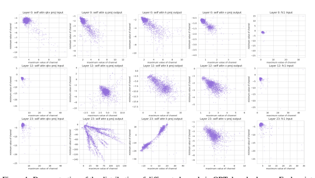
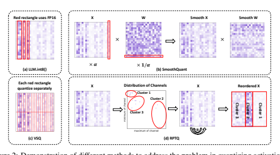
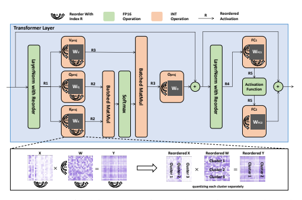
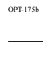
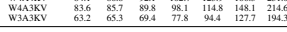
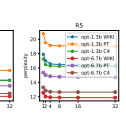
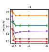
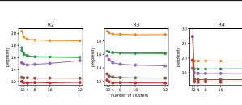
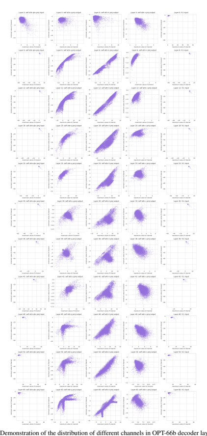
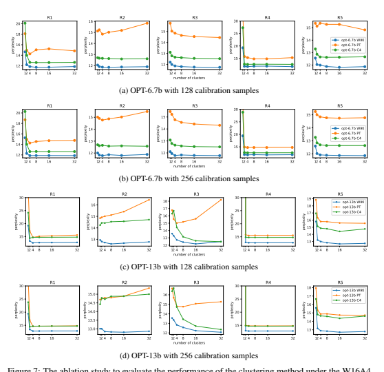

# Rptq: Reorder-Based Post-Training Quantization For Large Language Models

Zhihang Yuan∗
Houmo AI
Lin Niu∗ **Jiawei Liu Wenyu Liu Xinggang Wang**†
Huazhong University of Science & Technology

| Yuzhang Shang                    | Guangyu Sun       | Qiang Wu   | Jiaxiang Wu    |
|----------------------------------|-------------------|------------|----------------|
| Illinois Institute of Technology | Peking University | Houmo AI   | Tencent AI Lab |
| Bingzhe Wu† Tencent AI Lab       |                   |            |                |

## Abstract

Large-scale language models (LLMs) have demonstrated impressive performance, but their deployment presents challenges due to their significant memory usage.

This issue can be alleviated through quantization. In this paper, we identify that the challenge in quantizing activations in LLMs arises from varying ranges across channels, rather than solely the presence of outliers. To address this challenge, we introduce a quantization method called RPTQ, which utilizes a reorder-based approach. By rearranging the channels and quantizing them in clusters, RPTQ
effectively mitigates the impact of range differences between channels. To minimize the overhead of the reorder operation, we fuse it into the layer norm operation and weights in linear layers. In our experiments, RPTQ achieved a significant breakthrough by utilizing 3-bit activation in LLMs for the first time, resulting in a substantial reduction in memory usage. For instance, quantizing OPT-175b can lead to a memory consumption reduction of up to 80%. The code is in https://github.com/hahnyuan/RPTQ4LLM.

## 1 Introduction

Large-scale language models (LLMs) have demonstrated impressive performance in various tasks, but their deployment poses challenges due to their enormous model size. For example, the OPT175B model [40] contains 175 billion parameters, which require significant memory to store As the sequence length and batch size increase, the problem of memory consumption becomes more severe because activations. In some cases, the key and value cache can consume more than 100 times the memory of the weights. However, a single GPU or server does not possess sufficient memory capacity to store such massive weights and activations. To address this issue, LLMs are often divided into multiple chunks and stored on different devices. However, this requires data to be transferred between devices during computation, leading to significant bandwidth and energy consumption [1; 30].

To address the challenges posed by LLMs' high memory usage, model quantization has emerged as a promising solution. This technique involves quantizing both the weights and activations of LLMs using low-bit integers, resulting in a significant reduction in storage and computational costs.

Specifically, quantization reduces memory requirements for saving weights and activations and
∗ Equal contribution. hahnyuan@gmail.com, linniu@hust.edu.cn. This work was done when Lin Niu and Jiawei Liu were interns at Houmo AI. † Corresponding author. xgwang@hust.edu.cn, bingzhewu@tencent.com.

accelerates compute-intensive operations like Matrix Multiplication and linear layers. By quantizing weights and activations, storage and communication overhead is reduced, leading to improved efficiency and faster inference times. Quantization methods are typically divided into two categories:
post-training quantization (PTQ) and quantization-aware training (QAT). While QAT methods can lead to higher accuracy in most cases, they require significant computational resources to train the models, making them less practical for LLMs that already have significant training costs. In contrast, PTQ methods can quantize pre-trained models without additional training, making them more practical for larger models that require significant computational and memory resources. This paper focuses on PTQ for LLMs.

In this paper, we highlights the challenge of quantizing the activations of LLMs, which is attributed to the significant variations in the values across different channels 2, as shown in Figure 1. Two observations can be made from this figure: 1) Some channels exhibit significant outliers, with maximum or minimum values that are hundreds of times larger than those of other channels. Previous studies [34; 11] have also identified this issue and proposed special treatment for outliers. 2) Different channels exhibit significant difference in the range of values. Quantizing different channels using the same quantization parameter can lead to substantial quantization errors. Even if two channels have the same absolute value of outliers, they can exhibit strong difference in the range of numerical values.

For instance, one channel may have a range of -100 to -50, while another channel may have a range of 80 to 100. Using the same quantization parameters for them can lead to significant quantization errors, which is a challenge that has not been effectively addressed in previous works.

To address the issue of quantizing activations with channels that have significantly different ranges, we propose a method called RPTQ. This method involves clustering channels in activations that exhibit similar value ranges, followed by the quantization with the same quantization parameter to the values within each cluster. Consequently, channels displaying considerable discrepancies in numerical ranges can utilize distinct quantization parameters, leading to a significant reduction in quantization error.

Furthermore, we propose strategies to avoid explicit reordering, thereby decreasing computational overhead and enhancing inference efficiency. We propose a modified layer norm operation to yield reordered activations directly, obviating the necessity for explicit channel adjustments during the inference process. In addition, we reorganize the weights of linear layers to enable them to directly accept and produce activations in a sorted order. Our experiments demonstrate that RTPQ is an effective solution for addressing the issue of quantizing the activations of LLMs. Clustering the channels in only a small number of clusters can significantly reduce quantization errors and improve the accuracy of quantized LLMs. The results show that RPTQ
2For simplicity, we use the term "channel" to refer to the dimension of the hidden size. See Appendix A.1 for more results.

can achieve significant reductions in memory for LLMs while maintaining high levels of accuracy.

For instance, by quantizing OPT-175b, memory usage can be reduced by 73% with a perplexity loss of less than 0.5 or by 80% with a perplexity loss of less than 1.5 across different sequence lengths and batch sizes.

## 2 Related Work 2.1 Large Language Model

Large Language Models (LLMs) have shown immense potential for various applications. A lot of LLMs have been developed [12; 4; 29; 39; 2; 32]. These models have exhibited exceptional performance, but at the cost of significant memory consumption, which poses significant challenges for their deployment [19]. Ways to solve this problem include model compression [14], distributed computing [1] and computational graph optimization [10]. In this study, we focus on compressing LLMs through quantization.

## 2.2 Quantization

Quantization is an important technique for reducing the computational and memory requirements of deep neural networks (DNNs). There are two main categories of quantization methods for DNNs: posttraining quantization (PTQ) [41; 33; 25; 20; 38] and quantization-aware training (QAT) [8; 42; 5; 17].

PTQ methods involve quantizing pre-trained models, while QAT methods involve training models with quantization constraints.

While QAT methods have been shown to improve the accuracy of DNNs in some cases, they require significant computational resources to train the models. For instance, LSQ introduces a differentiable quantization function, which enables gradient-based optimization during training [13]. LSQ involves quantizing and de-quantizing the activation and weights, which requires additional computations.

Additionally, LSQ involves optimizing the quantization parameters, which requires extra training epochs to solve and update the gradient of the parameters. This makes them less practical for large-scale language models (LLMs) that already have high training costs. In contrast, PTQ methods are more feasible for LLMs, as they involve quantizing pre-trained models, which do not require additional training time.

Recently, there are some multi-billion scale transformer quantization methods designed for LLMs.

ZeroQuant [35] proposes a fine-grained quantization scheme that can be applied to both weights and activations. It treats each layer of the transformer as a small neural network and uses the FP
model to distill the quantization model. nuQmm [27] utilizes group-wise binary-coding non-uniform quantization scheme, and propose a specialized multiplicative kernel to speed up the operation.

LLM.int8() [11] observes that a significant contributor to poor quantization performance is outliers in activations. The method fixes this with mixed-precision quantization. SmoothQuant [34] migrates the quantization difficulty from activations to weights by proposing a mathematically equivalent per-channel scaling transformation. This transformation smooths the magnitude across channels, making the model quantization-friendly. GPTQ [15] uses second-order approximation to quantize weights, enabling the weight quantization of LLMs into 4-bit - the first post-training method to do so.

However, these methods can only achieve the quantization of activations to 8 bits. Comprehensive study [36] has improved ZeroQuant, treating each linear layer of the transformer as a small neural network for distillation, and achieved usable performance at W4A8 quantization.

PTQ-SL [37] proposed that adjusting the channel order of weights can lead to higher accuracy in finely-quantized networks. However, PTQ-SL mainly focuses on the quantization of weights in convolutional networks, and does not address the quantization issues of activations. PGQ [3] employs a range-based permutation of the embedding dimensions and share quantization parameters among elements in the same group to address the problem of activation quantization. Nonetheless, it only consider for the dynamic range and utilizes uniformly divided groups, rendering it less efficacious for LLMs.

## 3 Ptq On Llm 3.1 Post-Training Quantization

Post-training quantization is a powerful technique for compressing neural networks. Although non-uniform quantization can achieve a relatively small quantization error, they require specialized hardware that is not widely accessible [16]. In contrast, uniform quantization is a more practical and feasible approach that can be efficiently executed on regular hardware devices. Therefore, our study focuses on uniform quantization techniques. Typically, we use uniform quantization function Qk to transform a float value x to k bits integer xq as follows:

xq = Qk(*x, s, z*) = clamp(round(
x
s
$$\mathrm{d}({\frac{x}{s}})+z,-2$$
$\neg A$. 
k−1 − 1), (1)
$$2^{k-1},2^{k-1}-1),$$
where s represents the scaling factor, z denotes the zero point, and the clamp function constrains the value within the range of a k-bit integer, specifically [−2 k−1, 2 k−1 − 1]. For a 4-bit integer, the range is [-8, 7]. The integer xq can be de-quantized to xˆ = s(xq − z) ≈ x. The de-quantized value xˆ is a float. The quantization parameters, scale factor s, and zero point z must be stored in memory for both quantization and de-quantization processes. To further reduce the storage and computational overhead of quantization, multiple weights or activation values X = {x1*, ..., x*n} share the same quantization parameters.

There are three steps in post-training quantization (PTQ). The first step is to specify the quantization settings, which include the bit-width k and quantization type. The bit-width determines the number of bits used to represent a numerical value in a quantized format. The quantization types include static and dynamic quantization. Static quantization is a method in which the quantization parameters of activations are computed prior to deployment, and all inputs during runtime are quantized using the same set of parameters. Dynamic quantization, on the other hand, set the quantization parameters during runtime [35]. Dynamic quantization is generally more accurate than static quantization, as it can adapt to the distribution of activations. However, it can result in slower inference times, as the quantization parameters should be computed on-the-fly for each input data. We focus on static quantization in this paper.

Next, a calibration dataset consisting of input samples is used to compute the activations of each layer. The purpose of this step is to capture the distribution of numerical values that are likely to appear during inference. Finally, the quantization parameters for activations and weights are selected.

There are many methods to select the parameters. One of the commonly used methods is Min-Max method. This method involves computing the maximum value Xmax = max(X) and minimum value Xmin = min(X) of tensor X that share the quantization parameters. The scaling factor s and zero point z are set as follows:

$$s=\frac{X_{m a x}-X_{m i n}}{2^{k}},\quad z=-r o u n d(\frac{X_{m a x}+X_{m i n}}{2s}).$$
$$\left(2\right)$$
2s). (2)

## 3.2 Challenges In Activation Quantization

Recently, the weights of LLMs have been successfully quantized to 4 bits or even lower [15] with PTQ. However, quantizing the activations in LLMs remains a challenging task. As shown in Figure 1, the activations in LLMs exhibit significant variations in value range across different channels, which can have a significant impact on the quantization process. Per-tensor quantization techniques, which quantize the entire tensor using the same quantization parameters, may not be effective. The reason is setting the quantization range to cover a large value range may result in channels with small numerical values taking a large quantization error, while setting it to cover a small value range may lead to significant truncation of outliers and resulting in significant quantization errors. For instance, one channel may have a range of -100 to -50, while another channel may have a range of 80 to 100. Attempting to cover their ranges by quantizing from -100 to 100 would result in a significant quantization error for both channels.

Previous research has proposed several methods to address the issue of quantizing activations in LLMs. As shown in Figure 2(a), LLM.int8()[11] utilizes mixed-precision quantization by using high-precision data types (FP16) to quantize the outliers in activations and low-precision data types
(INT8) for the remaining values. Using FP16 for these few exceptional channels can prevent errors caused by quantization. As shown in Figure 2(b), SmoothQuant[34] tackles the quantization difficulty

$$({\mathfrak{I}})$$

by introducing a mathematically equivalent per-channel scaling transformation that smooths the magnitude across channels, making the activations more amenable to quantization. Specifically, the activation channels with large values are multiplied by a small factor α, and the corresponding weights for processing these channels in the next layer are multiplied by 1/α. However, SmoothQuant may not be effective in addressing the high variance of value range across channels. Additionally, this approach may also lead to issues with weight quantization. As shown in Figure 2(c), Per-vector scaled quantization (VSQ) [9; 18; 11], has been proposed sharing quantization parameters for adjacent columns or rows of n activation values. Although the approach of setting a quantization parameter for adjacent n values can help alleviate the issue of varying numerical values, the computation and storage overhead of calculating and storing these parameters for each set can be significant.

## 4 Reorder-Based Quantization 4.1 Clustering And Reordering Of Channels

In the section above, it was observed that there are notable variations in the activations across channels.

To solve this problem, we propose a novel reorder-based quantization approach called RPTQ. The main idea of this approach is to cluster the channels in the activations and reorganize them for quantization as shown in Figure 2(d).

To implement our reorder-based quantization approach, we first utilize a calibration dataset as input for inference, from which we derive the maximum and minimum values for each activation channel.

Subsequently, we employ the K-Means algorithm [21] to categorize the distinct channels into g clusters, based on the points formed by each channel's maximum and minimum values. Once the clusters are established, we proceed with channel reordering by positioning channels from the same cluster together. Following the reordering process, we quantize the activations within each cluster.

Specifically, we calculate the quantization parameters (scale s and zero point z) individually for each cluster. As a result, channels with analogous maximum and minimum values are assembled together and share the same quantization parameters. This method guarantees optimization of the quantization process for every cluster, ultimately reducing the quantization error.

We formalize the reordering process as follows: Let X ∈ R
B×N×C be the activation tensor, where B is the number of calibration samples, C is the number of channels and N is the number of tokens.

We first compute the minimum and maximum values of each channel, denoted as Xmin ∈ R
C and Xmax ∈ R
C , respectively, using the calibration dataset:

$$X_{\operatorname*{min}}={\underset{n=1}{\operatorname*{min}}}\operatorname*{min}_{b=1}^{N}X_{b,n},\quad X_{\operatorname*{max}}={\underset{n=1}{\operatorname*{max}}}\operatorname*{max}_{b=1}^{B}X_{b,n}.$$

Then, we group the channels into g clusters using K-means clustering based on the values of
(Xmin,i, Xmax,i) for each channel. Let S
1, S2*, ..., S*g be the sets of channels' indexes in each cluster,

where S
i ⊆ {1, 2*, ..., C*} and Sg i=1 S
i = {1, 2*, ..., C*}. Finally, we reorder the channels in X based on the indexes. We concatenates all the indices as a vector S = [S
1, S2*, ..., S*g]. We obtain the reordered activation tensor X˜:,:,i = X:,:,Si
.

As illustrated in Figure 2, our approach presents several advantages compared to previous methods.

Firstly, RPTQ is more adept at addressing the challenge of channel difference in activations. By clustering channels with similar value ranges, it diminishes the influence of both outliers and range differences. Secondly, RPTQ exhibits memory and computation efficiency, as it only requires managing quantization parameters for each cluster rather than each individual channel or vector.

## 4.2 Avoid Explicit Reordering And Misalignment

Explicit reordering is an operation in which the channels in activations are rearranged during run-time by physically relocating the data of different channels from one memory location to another. The reordering process will increase inference latency, particularly for large-scale models with a high number of channels. Additionally, storing both source and target activation tensors contributes to memory overhead. To minimize the overhead of the reorder operation, we fuse it into other operations.

Firstly, we fuse the reorder operation into the layer norm operation. Specifically, after computing the layer norm results for each channel, the results are written back to DRAM. The write address is additionally offset based on the reorder index. This enables layer norm to directly store the results as reordered activations without affecting the weight and bias parameters of the transformer layer. As illustrated in Figure 3, we modify the two layer norm operations in the transformer layer.

Secondly, we adjust the weight parameters of the network to allow linear layers to directly accept reordered activations and output reordered activations. Let W ∈ R
C2×C1 be the weight matrix. The original computation of a linear layer can be expressed as Y = bmm(*X, W*), where bmm denotes batched matrix multiplication. We reorder the columns of the weight matrix (dimension C1) based on the input activation reorder index, and the rows (dimension C2) based on the output activation reorder index. The new weight matrix W˜ ∈ R
C2×C1is obtained by rearranging the rows and columns of the original weight matrix W. The modified linear layer can be expressed as Y˜ = bmm(X, ˜ W˜ ), where

| Model   | OPT-1.3b   | OPT-6.7b   | OPT-13b   | OPT-30b   | OPT-66b   | OPT-175b   |       |       |       |       |       |       |       |       |       |       |       |       |
|---------|------------|------------|-----------|-----------|-----------|------------|-------|-------|-------|-------|-------|-------|-------|-------|-------|-------|-------|-------|
| Task    | WIKI       | PT         | C4        | WIKI      | PT        | C4         | WIKI  | PT    | C4    | WIKI  | PT    | C4    | WIKI  | PT    | C4    | WIKI  | PT    | C4    |
| FP16    | 14.63      | 16.96      | 14.72     | 10.86     | 13.09     | 11.74      | 10.13 | 12.34 | 11.20 | 9.56  | 11.84 | 10.69 | 9.34  | 11.36 | 10.28 | 8.34  | 12.01 | 10.13 |
| W4A16   | 14.78      | 17.21      | 14.92     | 11.18     | 13.62     | 12.07      | 10.29 | 12.45 | 11.27 | 9.55  | 11.91 | 10.74 | 9.30  | 11.42 | 10.31 | 8.37  | 12.31 | 10.26 |
| W4A8    | 15.39      | 17.79      | 15.48     | 11.21     | 13.74     | 12.11      | 10.90 | 13.40 | 11.62 | 10.22 | 12.41 | 11.01 | 9.46  | 11.73 | 10.57 | 8.43  | 12.24 | 10.49 |
| W4A4    | 16.88      | 19.23      | 16.55     | 12.00     | 15.17     | 12.85      | 12.74 | 15.76 | 14.71 | 11.15 | 14.11 | 13.48 | 12.23 | 18.87 | 15.93 | 10.60 | 15.59 | 12.28 |
| W4A4KV  | 15.26      | 17.65      | 15.37     | 11.26     | 13.44     | 12.03      | 10.59 | 12.80 | 11.54 | 9.99  | 12.18 | 11.01 | 9.75  | 11.64 | 10.61 | 8.40  | 12.38 | 10.54 |
| W4A3KV  | 17.22      | 19.94      | 16.92     | 11.92     | 14.13     | 12.61      | 11.15 | 13.90 | 12.04 | 11.62 | 14.95 | 11.96 | 10.88 | 14.69 | 11.36 | 9.39  | 13.45 | 11.27 |
| W3A3KV  | 18.45      | 21.33      | 18.26     | 12.42     | 14.48     | 13.13      | 11.47 | 14.08 | 12.41 | 11.76 | 14.98 | 12.22 | 11.47 | 15.03 | 11.75 | 10.03 | 13.82 | 11.30 |

X˜ is the reordered input. The channel ordering of output tensor Y˜ adheres to the same order as the channel ordering of dimension C2 of the weight. Note that the weight reordering can be completed before deployment, resulting in zero overhead related to reordering during inference. Misalignment between two tensors' channels refers to a situation in which the ordering of channels in one tensor differs from that in the other tensor. This can occur when applying operations such as matrix multiplication or element-wise addition between tensors with different channel orders. In such instances, misalignment can cause errors in calculation, leading to incorrect results. It is crucial to ensure that the tensors' channel orders are aligned to prevent such errors.

In the Transformer layer, there is a residual connection wherein the layer input is added to the output of the out projection layer, and the result is added to the output of the final linear layer. If the out projection layer's output is reordered, the channels would not align with those of the input. The same applies to the output of the final linear layer. Therefore, we do not reorder the output of the out projection layer and the final linear layer to maintain channel consistency with the original input. To maintain channel consistency with the original input, we don't reorder the output of the out projection layer and the final linear layer.

Lastly, we note that the channel dimensions of query activation XQ and key activation XK are multiplied and summed together in the QK-MatMul of self-attention: XQ(XK)
T. To avoid misalignment, XQ and XK should share the same reorder index. We collect the maximum and minimum values of each channel in Q and K and combine them into a quaternion point (X
Q
max,i, XQ
min,i, XK
max,i, XK
min,i)
for K-means clustering. The clustering result is then employed for reordering in both XQ and XK.

The reordering for each activation are demonstrated in Figure 3.

## 5 Experiments 7 5.1 Settings

We will evaluate our proposed reorder-based post-training quantization (RPTQ) on OPT models [40].

As our work focus on processing the problem in quantizing activations, we use GPTQ [15] to quantize the weights in LLMs 3. We apply static quantization to all the weights and input activations. For each cluster of activation, we use the Min-Max method to set the parameters of asymmetric quantization
(scaling factor s and zero point z). The quantization of the output activation of layer norm and softmax is performed at 8-bit precision. We calculate the R2 and R3 indices for each head in self-attention.

We use 256 samples randomly selected from WikiText2 [23], Pen Treebank [22], and C4 [28] for calibration dataset. We will report on perplexity, performance on zero-shot tasks, and memory consumption. Additionally, we conducted an ablation study on the number of clusters to explore the impact on the quantization performance. The experiments are conducted on a server equipped with 8 Nvidia A6000 GPUs.

## 5.2 Results On Llm

We conducted an experiment to evaluate OPT across various model scales. Specifically, we evaluated OPT's performance under three distinct bit-width configurations: W4A16, W4A8, and W4A4. Here, W4A4 refers to weight quantization with 4 bits and activation quantization with 4 bits. Additionally, 3The GPTQ method is solely designed for weight quantization and cannot be used for activation quantization.

For details on how to combine the GPTQ method for weight quantization with the RPTQ method for activation quantization, please refer to the Appendix A.3.

Table 2: Accuracy of OPT models under diverse quantization configurations on different zero-shot

tasks: LAMBADA(OpenAI), PIQA, ARC(Easy), ARC(Challenge), OpenBookQA, BoolQ.

Task LAMBADA(OpenAI) [26] PIQA [31]

Model 1.3b 6.7b 13b 30b 66b 1.3b 6.7b 13b 30b 66b

FP16 57.98% 61.84% 68.60% 71.41% 67.14% 72.47% 74.53% 76.87% 78.01% 78.12%

W4A16 57.46% 60.78% 68.50% 71.37% 67.06% 71.59% 74.80% 76.93% 78.29% 78.18%

W4A8 52.39% 67.35% 62.44% 64.99% 67.02% 69.69% 75.89% 75.46% 76.93% 77.52% W4A4 49.34% 64.93% 60.23% 63.92% 68.50% 68.66% 75.40% 73.55% 76.16% 77.14%

W4A4KV 52.90% 67.39% 62.77% 64.89% 69.99% 69.26% 76.00% 74.42% 76.65% 76.98% W4A3KV 47.02% 64.97% 61.05% 59.20% 66.23% 68.22% 75.73% 73.23% 67.46% 74.21% W3A3KV 42.84% 64.11% 60.02% 58.33% 65.28% 68.22% 74.64% 74.10% 67.51% 75.13%

Task ARC(Easy) [7] ARC(Challenge) [7]

Model 1.3b 6.7b 13b 30b 66b 1.3b 6.7b 13b 30b 66b

FP16 51.05% 58.03% 61.91% 65.31% 64.68% 29.69% 33.61% 35.66% 38.05% 38.99%

W4A16 51.17% 57.02% 61.82% 65.10% 64.89% 30.03% 32.59% 35.49% 37.96% 38.99%

W4A8 48.35% 60.18% 60.94% 63.46% 64.60% 26.36% 34.04% 35.58% 37.45% 38.82% W4A4 47.55% 56.90% 58.41% 62.12% 63.76% 25.85% 34.30% 33.95% 36.17% 37.20%

W4A4KV 47.76% 57.74% 58.54% 63.59% 63.67% 27.64% 33.95% 34.21% 37.37% 37.71% W4A3KV 46.29% 56.69% 56.10% 48.44% 59.00% 26.02% 33.95% 33.95% 30.71% 36.77% W3A3KV 44.02% 55.59% 53.74% 50.42% 57.65% 26.53% 32.16% 32.50% 30.71% 34.98%

Task OpenBookQA [24] BoolQ [6]

Model 1.3b 6.7b 13b 30b 66b 1.3b 6.7b 13b 30b 66b

FP16 33.00% 38.00% 39.00% 40.20% 41.60% 57.73% 67.03% 65.90% 70.45% 70.85%

W4A16 31.80% 37.40% 39.20% 40.60% 42.00% 58.99% 59.72% 66.66% 70.70% 70.55%

W4A8 32.40% 38.00% 38.60% 39.40% 41.80% 46.88% 65.93% 66.57% 70.64% 71.07% W4A4 32.60% 38.40% 38.00% 38.60% 42.00% 41.37% 65.44% 58.47% 67.70% 70.24%

W4A4KV 32.60% 38.40% 38.00% 39.80% 41.60% 43.33% 62.11% 62.47% 68.22% 70.79% W4A3KV 32.80% 36.80% 37.00% 34.00% 39.40% 42.84% 61.31% 57.76% 61.74% 67.06% W3A3KV 28.40% 35.20% 37.20% 32.40% 38.60% 46.23% 60.79% 65.07% 63.08% 67.49%

we developed a new quantization scheme, W4A4KV, W4A3KV, and W3A3KV, focusing solely on quantizing the key cache and value cache, which are the major memory consumers when using large sequence length or batch size.

The same as GPTQ [15], we evaluate the perplexity and the prediction accuracy on various zero shot tasks. The results are presented in Table 1 and Table 2, respectively. From the table, we can make the following observations: In general, the performance of the models tends to decrease as the bit-width for activation quantization decreases. For instance, by quantizing OPT-175b, W4A8 achieves a perplexity loss of less than 0.5 and W4A4 achieves a perplexity loss of less than 3. For the key cache and value cache quantization schemes (W4A4KV, W4A3KV, and W3A3KV), it is noticeable that their performance are better. In most cases, the performance of the quantized models is close to the FP16 baseline. For instance, by quantizing OPT-175b, W4A4KV achieves a perplexity loss of less than 0.5 and W3A3KV achieves a perplexity loss of less than 1.5. This suggests that focusing on quantizing key and value caches can be beneficial to maintain the performance while reducing memory consumption.

Other methods, such as SmoothQuant [34] and PEG [3], encounters difficulties when attempting to push quantization to 4 bits. See Appendix A.2 for detail. The ignorance of range difference prevent them from successfully quantizing activations of LLMs at low bit-widths. By carefully considering the range distribution in activation values, our method achieves a significant breakthrough in quantizing LLMs with 3-bit activation quantization.

## 5.3 Memory Consumption

The huge memory consumption is a major challenge in the deployment of LLMs. Limited memory capacity can result in significant performance bottlenecks [30]. There are three sources contributing to the memory usage of LLMs: Firstly, the weights in LLMs should be saved in memory, which can be significantly reduced through weight quantization. Secondly, memory is required for temporary activations generated during network execution. As these temporary activations can be released after usage and the memory usage of attention matrices can be greatly reduced through operation fusion [10], their memory footprint is minimal. Lastly, caching of key and value activations is necessary for predicting subsequent words. It is noteworthy that the key and value caches consume a majority of the memory when batch size and sequence length are high. See Appendix A.6 for details.

W16A16 59.4 62.3 68.1 79.7 102.9 149.3 242.0 427.5 798.6

W4A16 17.0 19.9 25.7 37.3 60.5 106.9 199.6 385.2 756.2

W4A8 15.6 17.1 20.1 26.0 38.0 61.8 109.5 204.9 395.7

W4A4 14.9 15.7 17.3 20.4 26.7 39.3 64.5 114.8 215.4

W4A4KV 15.0 15.9 17.7 21.2 28.3 42.6 71.0 127.9 241.7

W4A3KV 14.8 15.6 17.0 19.9 25.7 37.2 60.3 106.5 198.8

W3A3KV 11.3 12.0 13.5 16.4 22.1 33.7 56.8 102.9 195.3

W16A16 128.1 133.0 142.7 162.1 200.9 278.5 433.8 744.3 1365.3

W4A16 35.7 40.5 50.2 69.6 108.4 186.1 341.3 651.9 1272.9

W4A8 33.3 35.8 40.7 50.6 70.5 110.1 189.5 348.1 665.4

W4A4 32.1 33.4 36.0 41.2 51.5 72.2 113.5 196.2 361.6

W4A4KV 32.2 33.7 36.5 42.2 53.6 76.4 122.0 213.1 395.4

W4A3KV 32.0 33.1 35.4 39.9 49.0 67.2 103.7 176.5 322.3

W3A3KV 24.3 25.4 27.7 32.2 41.3 59.5 96.0 168.8 314.6

W16A16 335.4 344.9 363.8 401.7 477.5 629.0 932.0 1538.0 2750.1

W4A16 91.0 100.4 119.4 157.2 233.0 384.5 687.5 1293.5 2505.6

W4A8 86.3 91.1 100.7 119.9 158.4 235.3 389.0 696.5 1311.6

W4A4 84.0 86.4 91.4 101.3 121.1 160.6 239.8 398.0 714.6

W4A4KV 84.1 86.8 92.1 102.7 123.9 166.3 251.0 420.5 759.6 

| OPT-30b OPT-66b OPT-175b   |
|----------------------------|

Table 3 presents the memory usage under various settings, where we observe that lower-bit activations can substantially reduce the memory usage, particularly when the batch size and sequence length are high. For instance, we observe that W4A8 can reduce about 63% memory and W4A4 can reduce about 75% memory. Therefore, adopting activation quantization can greatly reduce the memory pressure in long-text tasks or large-batch scenarios. Quantizing solely the key and value cache also considerably diminishes memory consumption. We observe that W4A4KV can reduce about 73%
memory and W3A3KV can reduce about 80% memory.

## 5.4 Ablation Study

In this study, we perform an ablation analysis to investigate the impact of varying the number of clusters on model performance. Figure 4 presents the results of adjusting the number of clusters for each reorder (R1 to R5) while keeping other reorders fixed. As the number of clusters increases, the perplexity generally decreases. The fluctuations observed in R2 are an intriguing problem. We have found that increasing the size of the calibration dataset is helpful in alleviating this issue. See Appendix A.5 for details.. We suspect that this could be due to the limited amount of calibration data, which may not accurately capture the data distribution of certain samples. We have also noticed that larger networks are more sensitive to the number of clusters. For instance, if the number of clusters is set to 1, larger networks may crash, while smaller networks may have a lower quantization error.

Because RPTQ reorder each self-attention heads separately, the overhead associated with reordering for each head in R2 and R3 is substantial when the number of self-attention heads is high. In our experiments, we utilize 32 clusters for R1, R4, and R5, and 4 clusters for R2 and R3.

## 6 Conclusion

In this paper, we identify that the main challenge in quantizing large-scale language models (LLMs)
stems from the differences value ranges across channels, rather than just the issue of outliers. We have proposed a novel reorder-based quantization approach, RPTQ, that involves rearranging the channels in the activations and quantizing them in clusters. By quantizing the weights and activations, we have significantly reduced the memory usage. Our experiments demonstrate that our proposed approach successfully addresses the issue of numerical differences among activation channels and achieves a significant breakthrough by quantizing LLM to 3 bit activation for the first time.

## References

[1] Reza Yazdani Aminabadi, Samyam Rajbhandari, Ammar Ahmad Awan, Cheng Li, Du Li, Elton Zheng, Olatunji Ruwase, Shaden Smith, Minjia Zhang, Jeff Rasley, et al. Deepspeed-inference:
Enabling efficient inference of transformer models at unprecedented scale. In 2022 SC22:
International Conference for High Performance Computing, Networking, Storage and Analysis
(SC), pages 646–660. IEEE Computer Society, 2022.

[2] Sid Black, Stella Biderman, Eric Hallahan, Quentin Anthony, Leo Gao, Laurence Golding, Horace He, Connor Leahy, Kyle McDonell, Jason Phang, et al. Gpt-neox-20b: An open-source autoregressive language model. *arXiv preprint arXiv:2204.06745*, 2022.

[3] Yelysei Bondarenko, Markus Nagel, and Tijmen Blankevoort. Understanding and overcoming the challenges of efficient transformer quantization. In *Proceedings of the 2021 Conference on* Empirical Methods in Natural Language Processing, pages 7947–7969, 2021.

[4] Tom Brown, Benjamin Mann, Nick Ryder, Melanie Subbiah, Jared D Kaplan, Prafulla Dhariwal, Arvind Neelakantan, Pranav Shyam, Girish Sastry, Amanda Askell, et al. Language models are few-shot learners. *Advances in neural information processing systems*, 33:1877–1901, 2020.

[5] Jungwook Choi, Zhuo Wang, Swagath Venkataramani, Pierce I-Jen Chuang, Vijayalakshmi Srinivasan, and Kailash Gopalakrishnan. Pact: Parameterized clipping activation for quantized neural networks. *arXiv preprint arXiv:1805.06085*, 2018.

[6] Christopher Clark, Kenton Lee, Ming-Wei Chang, Tom Kwiatkowski, Michael Collins, and Kristina Toutanova. Boolq: Exploring the surprising difficulty of natural yes/no questions.

arXiv preprint arXiv:1905.10044, 2019.

[7] Peter Clark, Isaac Cowhey, Oren Etzioni, Tushar Khot, Ashish Sabharwal, Carissa Schoenick, and Oyvind Tafjord. Think you have solved question answering? try arc, the ai2 reasoning challenge. *arXiv preprint arXiv:1803.05457*, 2018.

[8] Matthieu Courbariaux, Itay Hubara, Daniel Soudry, Ran El-Yaniv, and Yoshua Bengio. Binarized neural networks: Training deep neural networks with weights and activations constrained to+ 1 or-1. *arXiv preprint arXiv:1602.02830*, 2016.

[9] Steve Dai, Rangha Venkatesan, Mark Ren, Brian Zimmer, William Dally, and Brucek Khailany.

Vs-quant: Per-vector scaled quantization for accurate low-precision neural network inference.

Proceedings of Machine Learning and Systems, 3:873–884, 2021.

[10] Tri Dao, Dan Fu, Stefano Ermon, Atri Rudra, and Christopher Ré. Flashattention: Fast and memory-efficient exact attention with io-awareness. *Advances in Neural Information Processing* Systems, 35:16344–16359, 2022.

[11] Tim Dettmers, Mike Lewis, Younes Belkada, and Luke Zettlemoyer. Llm. int8 (): 8-bit matrix multiplication for transformers at scale. *arXiv preprint arXiv:2208.07339*, 2022.

[12] Jacob Devlin, Ming-Wei Chang, Kenton Lee, and Kristina Toutanova. Bert: Pre-training of deep bidirectional transformers for language understanding. *arXiv preprint arXiv:1810.04805*,
2018.

[13] Steven K Esser, Jeffrey L McKinstry, Deepika Bablani, Rathinakumar Appuswamy, and Dharmendra S Modha. Learned step size quantization. *arXiv preprint arXiv:1902.08153*, 2019.

[14] Elias Frantar and Dan Alistarh. Massive language models can be accurately pruned in one-shot.

arXiv preprint arXiv:2301.00774, 2023.

[15] Elias Frantar, Saleh Ashkboos, Torsten Hoefler, and Dan Alistarh. Gptq: Accurate post-training quantization for generative pre-trained transformers. *arXiv preprint arXiv:2210.17323*, 2022.

[16] Cong Guo, Chen Zhang, Jingwen Leng, Zihan Liu, Fan Yang, Yunxin Liu, Minyi Guo, and Yuhao Zhu. Ant: Exploiting adaptive numerical data type for low-bit deep neural network quantization. In *2022 55th IEEE/ACM International Symposium on Microarchitecture (MICRO)*,
pages 1414–1433. IEEE, 2022.

[17] Sangil Jung, Changyong Son, Seohyung Lee, Jinwoo Son, Jae-Joon Han, Youngjun Kwak, Sung Ju Hwang, and Changkyu Choi. Learning to quantize deep networks by optimizing quantization intervals with task loss. In *Proceedings of the IEEE/CVF Conference on Computer* Vision and Pattern Recognition, pages 4350–4359, 2019.
[18] Ben Keller, Rangharajan Venkatesan, Steve Dai, Stephen G Tell, Brian Zimmer, William J Dally, C Thomas Gray, and Brucek Khailany. A 17–95.6 tops/w deep learning inference accelerator with per-vector scaled 4-bit quantization for transformers in 5nm. In *2022 IEEE Symposium on* VLSI Technology and Circuits (VLSI Technology and Circuits), pages 16–17. IEEE, 2022.

[19] Daliang Li, Ankit Singh Rawat, Manzil Zaheer, Xin Wang, Michal Lukasik, Andreas Veit, Felix Yu, and Sanjiv Kumar. Large language models with controllable working memory. arXiv preprint arXiv:2211.05110, 2022.
[20] Yuhang Li, Ruihao Gong, Xu Tan, Yang Yang, Peng Hu, Qi Zhang, Fengwei Yu, Wei Wang, and Shi Gu. Brecq: Pushing the limit of post-training quantization by block reconstruction.

arXiv preprint arXiv:2102.05426, 2021.

[21] J MacQueen. Classification and analysis of multivariate observations. In 5th Berkeley Symp.

Math. Statist. Probability, pages 281–297. University of California Los Angeles LA USA, 1967.

[22] Mitch Marcus, Grace Kim, Mary Ann Marcinkiewicz, Robert MacIntyre, Ann Bies, Mark Ferguson, Karen Katz, and Britta Schasberger. The penn treebank: Annotating predicate argument structure. In *Human Language Technology: Proceedings of a Workshop held at* Plainsboro, New Jersey, March 8-11, 1994, 1994.
[23] Stephen Merity, Caiming Xiong, James Bradbury, and Richard Socher. Pointer sentinel mixture models. *arXiv preprint arXiv:1609.07843*, 2016.

[24] Todor Mihaylov, Peter Clark, Tushar Khot, and Ashish Sabharwal. Can a suit of armor conduct electricity? a new dataset for open book question answering. *arXiv preprint arXiv:1809.02789*,
2018.

[25] Markus Nagel, Rana Ali Amjad, Mart Van Baalen, Christos Louizos, and Tijmen Blankevoort.

Up or down? adaptive rounding for post-training quantization. In *International Conference on* Machine Learning, pages 7197–7206. PMLR, 2020.

[26] Denis Paperno, Germán Kruszewski, Angeliki Lazaridou, Quan Ngoc Pham, Raffaella Bernardi, Sandro Pezzelle, Marco Baroni, Gemma Boleda, and Raquel Fernández. The lambada dataset:
Word prediction requiring a broad discourse context. *arXiv preprint arXiv:1606.06031*, 2016.
[27] Gunho Park, Baeseong Park, Se Jung Kwon, Byeongwook Kim, Youngjoo Lee, and Dongsoo Lee. nuqmm: Quantized matmul for efficient inference of large-scale generative language models. *arXiv preprint arXiv:2206.09557*, 2022.

[28] Colin Raffel, Noam Shazeer, Adam Roberts, Katherine Lee, Sharan Narang, Michael Matena, Yanqi Zhou, Wei Li, and Peter J Liu. Exploring the limits of transfer learning with a unified text-to-text transformer. *The Journal of Machine Learning Research*, 21(1):5485–5551, 2020.

[29] Teven Le Scao, Angela Fan, Christopher Akiki, Ellie Pavlick, Suzana Ilic, Daniel Hesslow, ´
Roman Castagné, Alexandra Sasha Luccioni, François Yvon, Matthias Gallé, et al. Bloom: A
176b-parameter open-access multilingual language model. *arXiv preprint arXiv:2211.05100*,
2022.
[30] Ying Sheng, Lianmin Zheng, Binhang Yuan, Zhuohan Li, Max Ryabinin, Daniel Y Fu, Zhiqiang Xie, Beidi Chen, Clark Barrett, Joseph E Gonzalez, et al. High-throughput generative inference of large language models with a single gpu. *arXiv preprint arXiv:2303.06865*, 2023.

[31] Sandeep Tata and Jignesh M Patel. Piqa: An algebra for querying protein data sets. In 15th International Conference on Scientific and Statistical Database Management, 2003., pages 141–150. IEEE, 2003.

[32] Hugo Touvron, Thibaut Lavril, Gautier Izacard, Xavier Martinet, Marie-Anne Lachaux, Timothée Lacroix, Baptiste Rozière, Naman Goyal, Eric Hambro, Faisal Azhar, et al. Llama: Open and efficient foundation language models. *arXiv preprint arXiv:2302.13971*, 2023.

[33] Peisong Wang, Qiang Chen, Xiangyu He, and Jian Cheng. Towards accurate post-training network quantization via bit-split and stitching. In *International Conference on Machine* Learning, pages 9847–9856. PMLR, 2020.

[34] Guangxuan Xiao, Ji Lin, Mickael Seznec, Julien Demouth, and Song Han. Smoothquant:
Accurate and efficient post-training quantization for large language models. arXiv preprint arXiv:2211.10438, 2022.

[35] Zhewei Yao, Reza Yazdani Aminabadi, Minjia Zhang, Xiaoxia Wu, Conglong Li, and Yuxiong He. Zeroquant: Efficient and affordable post-training quantization for large-scale transformers.

arXiv preprint arXiv:2206.01861, 2022.

[36] Zhewei Yao, Cheng Li, Xiaoxia Wu, Stephen Youn, and Yuxiong He. A comprehensive study on post-training quantization for large language models. *arXiv preprint arXiv:2303.08302*,
2023.

[37] Zhihang Yuan, Yiqi Chen, Chenhao Xue, Chenguang Zhang, Qiankun Wang, and Guangyu Sun.

Ptq-sl: Exploring the sub-layerwise post-training quantization. *arXiv preprint arXiv:2110.07809*,
2021.

[38] Zhihang Yuan, Chenhao Xue, Yiqi Chen, Qiang Wu, and Guangyu Sun. Ptq4vit: Post-training quantization for vision transformers with twin uniform quantization. In *Computer Vision–ECCV*
2022: 17th European Conference, Tel Aviv, Israel, October 23–27, 2022, Proceedings, Part XII,
pages 191–207. Springer, 2022.

[39] Aohan Zeng, Xiao Liu, Zhengxiao Du, Zihan Wang, Hanyu Lai, Ming Ding, Zhuoyi Yang, Yifan Xu, Wendi Zheng, Xiao Xia, et al. Glm-130b: An open bilingual pre-trained model. arXiv preprint arXiv:2210.02414, 2022.

[40] Susan Zhang, Stephen Roller, Naman Goyal, Mikel Artetxe, Moya Chen, Shuohui Chen, Christopher Dewan, Mona Diab, Xian Li, Xi Victoria Lin, et al. Opt: Open pre-trained transformer language models. *arXiv preprint arXiv:2205.01068*, 2022.

[41] Ritchie Zhao, Yuwei Hu, Jordan Dotzel, Chris De Sa, and Zhiru Zhang. Improving neural network quantization without retraining using outlier channel splitting. In International conference on machine learning, pages 7543–7552. PMLR, 2019.

[42] Shuchang Zhou, Yuxin Wu, Zekun Ni, Xinyu Zhou, He Wen, and Yuheng Zou. Dorefa-net:
Training low bitwidth convolutional neural networks with low bitwidth gradients. arXiv preprint arXiv:1606.06160, 2016.

Table 4: Comparing RPTQ with SmoothQuant on perplexity scores of various models under diverse

quantization configurations on three datasets: WikiText2 (WIKI), Pen Treebank (PT), and C4.

Model OPT-1.3b OPT-6.7b OPT-13b OPT-30b

Task WIKI PT C4 WIKI PT C4 WIKI PT C4 WIKI PT C4

W4A8 SmoothQuant 16.89 19.35 16.26 11.62 14.04 12.47 12.55 14.73 12.2 9.96 12.12 11.01

RPTQ 15.39 17.79 15.48 11.21 13.74 12.11 10.90 13.40 11.62 10.22 12.41 11.01

W4A4 SmoothQuant 68.25 68.44 53.77 51.19 67.14 73.44 235.38 285.85 187.96 18435.66 70175.91 11297.63

RPTQ 16.88 19.23 16.55 12.00 15.17 12.85 12.74 15.76 14.71 11.15 14.11 13.48

W4A4KV SmoothQuant 19.45 22394 18.46 12.68 16.13 13.72 11.62 16.44 12.21 11.61 15.43 11.74

RPTQ 15.26 17.65 15.37 11.26 13.44 12.03 10.59 12.80 11.54 9.99 12.18 11.01

## A Appendix A.1 Distribution Of Different Channels

| Model   | OPT-1.3b   | OPT-6.7b   | OPT-13b   | OPT-30b   | OPT-66b   |       |       |       |       |       |       |       |       |       |       |
|---------|------------|------------|-----------|-----------|-----------|-------|-------|-------|-------|-------|-------|-------|-------|-------|-------|
| Task    | WIKI       | PT         | C4        | WIKI      | PT        | C4    | WIKI  | PT    | C4    | WIKI  | PT    | C4    | WIKI  | PT    | C4    |
| PEG     | 19.18      | 22.44      | 18.57     | 12.30     | 15.04     | 13.61 | 14.28 | 17.78 | 19.92 | 17.87 | 34.94 | 45.43 | 15.57 | 23.59 | 20.36 |
| RPTQ    | 16.88      | 19.23      | 16.55     | 12.00     | 15.17     | 12.85 | 12.74 | 15.76 | 14.71 | 11.15 | 14.11 | 13.48 | 12.23 | 18.87 | 15.93 |

We analyzed the distribution of different channels in the OPT-30b and OPT-66b by plotting the
(maximum value, minimum value) points of each channel in the activation, demonstrated in Figure 5 and Figure 6 Our analysis revealed that there were significant differences in the data range across different layers and even within different channels in the same layer. This finding motivated us to develop a clustering approach to reduce the impact of these differences during quantization. By clustering channels with similar magnitude ranges together, we can reduce the quantization error and improve the efficiency of quantized LLMs.

## A.2 Comparing With Other Methods

As depicted in Table 4, we compared RPTQ with SmoothQuant [34]. SmoothQuant tackles the quantization difficulty by introducing a mathematically equivalent per-channel scaling transformation that smooths the magnitude across channels, making the activations more amenable to quantization.

It cannot addressing the high difference of value ranges across channels. Additionally, this approach may also lead to issues with weight quantization. We observed that SmoothQuant exhibits significant performance degradation on larger networks. This can be attributed to the larger range differences among different channels in large networks compared to smaller networks. As depicted in Table 5, we compared RPTQ with PEG [3]. Due to the original paper was only tested on small models, we applied its method to the OPT model and used the same group settings for PEG as in RPTQ. It was observed that PEG also incurs significant quantization loss on large models.

## A.3 Combine Rptq With Gptq

Generative Pre-trained Transformer Quantization (GPTQ) is a post-training quantization method for Generative Pre-trained Transformers (GPTs) that focuses on quantizing the weights in the learner layers of transformers. The primary goal of GPTQ is to minimize the error introduced by quantizing weights. This is achieved through the optimization target:
argminWˆ ||XW − XWˆ ||22
, (4)
where W is the weight of a linear layer, and X is the input of the layer collected using a calibration dataset. By solving this layer-wise quantization problem with a Hessian-based approximation, GPTQ can find the quantized weight that minimizes the quantization error.

To achieve different quantization for each input cluster of weight, we apply GPTQ on each input cluster of weights in the layer to minimize the quantization error. To combine Random Perturbation Training Quantization (RPTQ) with GPTQ, we first reorder the weights in the linear layers before applying GPTQ.

## A.4 Computation Under Cluster-Based Quantization

After quantizing the network with RPTQ, each activation X is adjusted by channel to become X˜,
which is divided into g clusters. Each activation cluster X˜i has different asymmetric quantization parameters (scale and zero point). We denote the scale and zero point for the i-th cluster as s X
iand z X
i
, respectively. The activations in the i-th cluster are quantized with the quantization parameters:

$$\bar{X}_{q,i}=Q_{k}(\bar{X}_{i},s_{i}^{X},z_{i}^{X}),$$
), (5)
where Qk represents the quantization function that quantizes the input using the k-bit quantization parameters. The weights W in the next layer are also adjusted based on the input activation's reorder index to become W˜ . It is also divided into g clusters, where each cluster has different asymmetric quantization parameters. For one output channel, each weight cluster W˜iis also quantized with different asymmetric quantization parameters (scale and zero point), which are denoted as sW
iand zW
i, respectively. The weights in the i-th cluster are quantized with the quantization parameters:

$$\bar{W}_{q,i}=Q_{k}(\bar{W}_{i},s_{i}^{W},z_{i}^{W}).$$

i). (6)
This process ensures that both the activations and weights are quantized with different quantization parameters for each cluster.

We describe two methods for computing the output tensor Y using the quantized activations and weights. The first method dequantizes the weight and activation values back to floating-point numbers, while the second method performs computation directly in the integer domain. The first method involves dequantizing the quantized activations and weights back to floating-point values as follows:

involves dequantizing the quantized activations and weights back to floating-point values as follows:  $$\hat{X}i=s_{i}^{X}(Xq,i-z_{i}^{X}),\quad\hat{W}i=s_{i}^{W}(Wq,i-z_{i}^{W}).\tag{7}$$  The dequantized values are then concatenated to form the full activations $\hat{X}$ and the full weights $\hat{W}$.  
Matrix multiplication is performed using the dequantized values:
$$Y={\hat{X}}{\hat{W}}.$$
$$({\mathfrak{s}})$$
$$(9)$$
$\text{mmed up:}$. 
Y = XˆW . ˆ (8)
The second method computes the output tensor Y directly in the integer domain. The quantized activations and weights in each cluster are multiplied using matrix and vector multiplication:

$$Y_{q,i}=\bar{X}q,i\bar{W}q,i-z_{i}^{X}\bar{W}q,i-z_{i}^{W}\bar{X}q,i+z_{i}^{X}z_{i}^{W}.$$
i. (9)
The results are then dequantized, and the dequantized results are summed up:
 $ Y=\sum_{i=1}^g(s_i^X s_i^W Y_{q,i}).$  ×
$$(10)$$

The second method is computationally efficient, but it requires hardware support for integer arithmetic.

For instance, the 3-bit value is not supported in most GPUs. In such cases, these values are cast to higher hardware-supported datatypes such as 4-bit or 8-bit on GPUs.

## A.5 More Results For Ablation Study

Figure 7 displays the outcomes associated with 128/256 calibration samples. The observed fluctuations in PT and C4 within R2 and R3 present an intriguing issue. We hypothesize that these fluctuations may be attributable to the limited quantity of calibration data, which might not accurately represent the data distribution for specific samples. However, using a larger calibration dataset during the calibration phase would demand more memory and computational resources, which is why we have not yet conducted this experiment in this paper. In the future, with additional resources, we intend to conduct more extensive analyses using larger networks and calibration datasets to gain a deeper understanding of this matter.

## A.6 Memory Consumption Of Different Parts

We reported the memory consumption of different parts in LLMs, as shown in the Table 6.

| Batch Size      | 1         | 64     |        |         |        |        |         |        |        |         |        |        |         |
|-----------------|-----------|--------|--------|---------|--------|--------|---------|--------|--------|---------|--------|--------|---------|
| Sequence Length | 2048      | 8192   | 2048   | 8192    |        |        |         |        |        |         |        |        |         |
| Model           | Precision | Weight | K/V    | Dynamic | Weight | K/V    | Dynamic | Weight | K/V    | Dynamic | Weight | K/V    | Dynamic |
| FP16            | 85.35%    | 12.12% | 2.53%  | 59.30%  | 33.67% | 7.03%  | 8.35%   | 75.83% | 15.82% | 2.23%   | 80.89% | 16.88% |         |
| W4A16           | 59.30%    | 33.67% | 7.03%  | 26.70%  | 60.65% | 12.65% | 2.23%   | 80.89% | 16.88% | 0.57%   | 82.27% | 17.17% |         |
| W4A8            | 73.48%    | 20.86% | 5.66%  | 40.92%  | 46.47% | 12.62% | 4.15%   | 75.39% | 20.47% | 1.07%   | 77.81% | 21.12% |         |
| W4A4            | 83.45%    | 11.85% | 4.70%  | 55.76%  | 31.66% | 12.57% | 7.30%   | 66.35% | 26.35% | 1.93%   | 70.19% | 27.88% |         |
| W4A4KV          | 80.47%    | 11.42% | 8.11%  | 50.74%  | 28.81% | 20.45% | 6.05%   | 54.95% | 39.00% | 1.58%   | 57.57% | 40.85% |         |
| W4A3KV          | 82.94%    | 8.83%  | 8.23%  | 54.86%  | 23.36% | 21.78% | 7.06%   | 48.10% | 44.84% | 1.86%   | 50.79% | 47.35% |         |
| W3A3KV          | 78.47%    | 11.14% | 10.39% | 47.68%  | 27.08% | 25.24% | 5.39%   | 48.96% | 45.65% | 1.40%   | 51.03% | 47.57% |         |
| OPT-1.3b        | FP16      | 91.70% | 7.17%  | 1.12%   | 73.43% | 22.98% | 3.59%   | 14.73% | 73.74% | 11.53%  | 4.14%  | 82.90% | 12.96%  |
| W4A16           | 73.43%    | 22.98% | 3.59%  | 40.86%  | 51.14% | 8.00%  | 4.14%   | 82.90% | 12.96% | 1.07%   | 85.55% | 13.38% |         |
| W4A8            | 84.16%    | 13.17% | 2.68%  | 57.04%  | 35.70% | 7.26%  | 7.66%   | 76.73% | 15.60% | 2.03%   | 81.41% | 16.56% |         |
| W4A4            | 90.79%    | 7.10%  | 2.11%  | 71.13%  | 22.26% | 6.62%  | 13.34%  | 66.80% | 19.86% | 3.71%   | 74.22% | 22.07% |         |
| W4A4KV          | 89.30%    | 6.99%  | 3.71%  | 67.60%  | 21.15% | 11.25% | 11.54%  | 57.75% | 30.71% | 3.16%   | 63.22% | 33.62% |         |
| W4A3KV          | 90.94%    | 5.34%  | 3.73%  | 71.50%  | 16.78% | 11.72% | 13.55%  | 50.89% | 35.55% | 3.77%   | 56.65% | 39.58% |         |
| W3A3KV          | 88.27%    | 6.91%  | 4.82%  | 65.30%  | 20.43% | 14.27% | 10.52%  | 52.68% | 36.80% | 2.86%   | 57.19% | 39.95% |         |
| OPT-6.7b        | FP16      | 93.28% | 5.97%  | 0.75%   | 77.64% | 19.87% | 2.49%   | 17.83% | 73.03% | 9.14%   | 5.15%  | 84.31% | 10.55%  |
| W4A16           | 77.64%    | 19.87% | 2.49%  | 46.47%  | 47.58% | 5.95%  | 5.15%   | 84.31% | 10.55% | 1.34%   | 87.69% | 10.97% |         |
| W4A8            | 87.05%    | 11.14% | 1.81%  | 62.69%  | 32.09% | 5.22%  | 9.50%   | 77.83% | 12.66% | 2.56%   | 83.81% | 13.64% |         |
| W4A4            | 92.66%    | 5.93%  | 1.41%  | 75.94%  | 19.44% | 4.62%  | 16.47%  | 67.47% | 16.05% | 4.70%   | 76.99% | 18.31% |         |
| W4A4KV          | 91.64%    | 5.86%  | 2.49%  | 73.27%  | 18.75% | 7.98%  | 14.62%  | 59.90% | 25.48% | 4.11%   | 67.28% | 28.62% |         |
| W4A3KV          | 93.04%    | 4.47%  | 2.50%  | 76.97%  | 14.78% | 8.26%  | 17.28%  | 53.07% | 29.66% | 4.96%   | 60.97% | 34.07% |         |
| W3A3KV          | 90.93%    | 5.82%  | 3.25%  | 71.48%  | 18.30% | 10.23% | 13.54%  | 55.46% | 31.00% | 3.77%   | 61.73% | 34.50% |         |
| OPT-13b         | FP16      | 95.12% | 4.42%  | 0.46%   | 82.97% | 15.42% | 1.61%   | 23.34% | 69.42% | 7.24%   | 7.07%  | 84.15% | 8.77%   |
| W4A16           | 82.97%    | 15.42% | 1.61%  | 54.92%  | 40.83% | 4.26%  | 7.07%   | 84.15% | 8.77%  | 1.87%   | 88.87% | 9.26%  |         |
| W4A8            | 90.45%    | 8.41%  | 1.14%  | 70.32%  | 26.14% | 3.54%  | 12.90%  | 76.70% | 10.40% | 3.57%   | 84.92% | 11.51% |         |
| W4A4            | 94.73%    | 4.40%  | 0.87%  | 81.79%  | 15.20% | 3.01%  | 21.91%  | 65.17% | 12.92% | 6.56%   | 77.98% | 15.46% |         |
| W4A4KV          | 94.08%    | 4.37%  | 1.55%  | 79.89%  | 14.85% | 5.26%  | 19.89%  | 59.14% | 20.97% | 5.84%   | 69.51% | 24.64% |         |
| W4A3KV          | 95.14%    | 3.32%  | 1.54%  | 83.04%  | 11.57% | 5.39%  | 23.43%  | 52.24% | 24.33% | 7.10%   | 63.38% | 29.52% |         |
| W3A3KV          | 93.62%    | 4.35%  | 2.03%  | 78.59%  | 14.61% | 6.80%  | 18.66%  | 55.49% | 25.84% | 5.42%   | 64.53% | 30.05% |         |
| OPT-30b         | FP16      | 96.21% | 3.51%  | 0.27%   | 86.40% | 12.62% | 0.99%   | 28.42% | 66.39% | 5.19%   | 9.03%  | 84.38% | 6.60%   |
| W4A16           | 86.40%    | 12.62% | 0.99%  | 61.36%  | 35.84% | 2.80%  | 9.03%   | 84.38% | 6.60%  | 2.42%   | 90.50% | 7.08%  |         |
| W4A8            | 92.56%    | 6.76%  | 0.69%  | 75.66%  | 22.10% | 2.25%  | 16.27%  | 76.01% | 7.73%  | 4.63%   | 86.57% | 8.80%  |         |
| W4A4            | 95.98%    | 3.50%  | 0.52%  | 85.64%  | 12.51% | 1.86%  | 27.15%  | 63.42% | 9.43%  | 8.52%   | 79.64% | 11.84% |         |
| W4A4KV          | 95.58%    | 3.49%  | 0.93%  | 84.40%  | 12.32% | 3.28%  | 25.27%  | 59.04% | 15.70% | 7.79%   | 72.84% | 19.37% |         |
| W4A3KV          | 96.44%    | 2.64%  | 0.92%  | 87.13%  | 9.54%  | 3.33%  | 29.72%  | 52.08% | 18.19% | 9.56%   | 67.03% | 23.41% |         |
| W3A3KV          | 95.31%    | 3.48%  | 1.22%  | 83.54%  | 12.20% | 4.26%  | 24.08%  | 56.27% | 19.65% | 7.35%   | 68.67% | 23.98% |         |
| OPT-66b         | FP16      | 97.18% | 2.68%  | 0.14%   | 89.59% | 9.89%  | 0.52%   | 34.98% | 61.80% | 3.22%   | 11.85% | 83.78% | 4.37%   |
| W4A16           | 89.59%    | 9.89%  | 0.52%  | 68.27%  | 30.16% | 1.57%  | 11.85%  | 83.78% | 4.37%  | 3.25%   | 91.95% | 4.79%  |         |
| W4A8            | 94.43%    | 5.21%  | 0.35%  | 80.92%  | 17.87% | 1.21%  | 20.95%  | 74.03% | 5.02%  | 6.21%   | 87.83% | 5.95%  |         |
| W4A4            | 97.05%    | 2.68%  | 0.27%  | 89.18%  | 9.85%  | 0.98%  | 33.99%  | 60.06% | 5.95%  | 11.40%  | 80.61% | 7.99%  |         |
| W4A4KV          | 96.85%    | 2.67%  | 0.47%  | 88.49%  | 9.77%  | 1.73%  | 32.46%  | 57.37% | 10.17% | 10.73%  | 75.83% | 13.44% |         |
| W4A3KV          | 97.51%    | 2.02%  | 0.47%  | 90.73%  | 7.52%  | 1.75%  | 37.97%  | 50.32% | 11.72% | 13.27%  | 70.35% | 16.38% |         |
| W3A3KV          | 96.71%    | 2.67%  | 0.62%  | 88.02%  | 9.72%  | 2.26%  | 31.46%  | 55.59% | 12.95% | 10.29%  | 72.76% | 16.94% |         |
| OPT-175b        |           |        |        |         |        |        |         |        |        |         |        |        |         |

17

