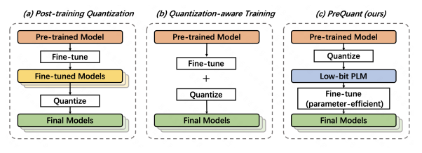
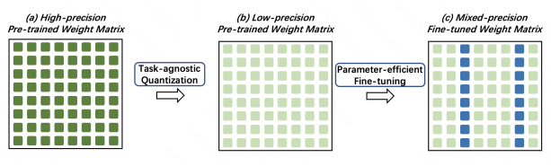
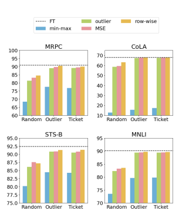

# Prequant: A Task-Agnostic Quantization Approach For Pre-Trained Language Models

Zhuocheng Gong1∗
, Jiahao Liu2, Qifan Wang3, Yang Yang2, Jingang Wang2**, Wei Wu**2 Yunsen Xian2, Dongyan Zhao**1,4,5**†
, Rui Yan6,7†
1Wangxuan Institute of Computer Technology, Peking University 2Meituan; 3Meta AI
4National Key Laboratory of General Artificial Intelligence 5Beijing Institute for General Artificial Intelligence 6Gaoling School of Artificial Intelligence, Renmin University of China 7Engineering Research Center of Next-Generation Intelligent Search and Recommendation, Ministry of Education
{gzhch,zhaody}@pku.edu.cn, ruiyan@ruc.edu.cn, wqfcr@fb.com
{liujiahao12,yangyang113,wangjingang02,xianyunsen}@meituan.com wuwei19850318@gmail.com

## Abstract

While transformer-based pre-trained language models (PLMs) have dominated a number of NLP applications, these models are heavy to deploy and expensive to use. Therefore, effectively compressing large-scale PLMs becomes an increasingly important problem. Quantization, which represents high-precision tensors with low-bit fix-point format, is a viable solution. However, most existing quantization methods are task-specific, requiring customized training and quantization with a large number of trainable parameters on each individual task. Inspired by the observation that the overparameterization nature of PLMs makes it possible to freeze most of the parameters during the fine-tuning stage, in this work, we propose a novel "quantize before fine-tuning" framework, PreQuant, that differs from both quantizationaware training and post-training quantization.

PreQuant is compatible with various quantization strategies, with outlier-aware parameterefficient fine-tuning incorporated to correct the induced quantization error. We demonstrate the effectiveness of PreQuant on the GLUE
benchmark using BERT, RoBERTa, and T5.

We also provide an empirical investigation into the workflow of PreQuant, which sheds light on its efficacy.

## 1 Introduction

Pre-trained language models (PLMs) have shown superior performance in various NLP applications.

Despite their impressive success, these transformerbased models typically contain hundreds of millions of parameters. Massive model scale is becoming an increasing burden, preventing researchers from making full use of large-scale PLMs. According to a recent study, only 0.5% to 4% of research papers published at the recent five NLP conferences tend to adopt large PLMs (PLMs with over a billion parameters) (Ding et al., 2022). This suggests that the inefficiency of deploying large PLMs is hampering the development of NLP research.

Therefore, compressing PLMs becomes an urgent and important problem.

Various model compression methods have been proposed, such as knowledge distillation (Jiao et al.,
2020; Sanh et al., 2019; Wang et al., 2021; Passban et al., 2021), weight sharing (Lan et al., 2019),
network pruning (Liang et al., 2021; Gordon et al.,
2020; Li et al., 2021), and quantization (Tao et al.,
2022; Zhang et al., 2020; Bai et al., 2021; Kim et al., 2021). Among these compression methods, quantization is a promising solution. The core idea of quantization is to use low bit precision to store weight and activation tensors, and use fixed-point arithmetic to speed up inference. There are some prior works on quantizing PLMs covering different strategies and granularities. However, these quantization methods generally neglect the characteristics of PLMs - the distinction between fine-tuning a model and training a model from scratch - but treat quantizing PLMs no different from quantizing regular neural networks. In other words, these methods are task-specific, which design customized quantization for PLMs. There are two main limitations:
first, these task-specific methods need to conduct both quantization and fine-tuning for each downstream task, with the quantization being applied either during or after the fine-tuning stage, which is inefficient; Second, the number of trainable parameters are still very large during fine-tuning, which is computational expensive.

In this work, we consider the quantization pipeline specially for the pre-training scenario.

Our motivation starts from the distinction between
"training from scratch" and "pre-training then finetuning". Unlike the weights from random initialization, the weights of the pre-trained model already contain rich information during pre-training. To utilize such information in a more efficient manner, we propose to directly quantize the pre-trained model in a task-agnostic way to obtain a "prequantized" model before fine-tuning. We then introduce a parameter-efficient fine-tuning and show that fine-tuning could be finished with minimal weight updates. In particular, we freeze most of the quantized weights in the "pre-quantized" model, and only fine-tune a very small subset of its model parameters in the fine-tuning process. Through an extensive set of explorations and experiments, we demonstrate the feasibility and advantages of the "quantizing the PLM first, then fine-tuning" pipeline, which we name as PreQuant. The main contributions are summarized as follows:

- We propose a novel quantization framework, PreQuant, tailored for PLMs. We conduct a systematic study to overcome the difficulties of PLM quantization and validate the performance through thorough experiments.

- PreQuant performs task-agnostic quantization, which dramatically reduces the storage requirements for large PLMs and enables efficient deployment of PLMs on different downstream tasks. Moreover, PreQuant only finetunes 0.5% of the model parameters, which is more suitable in resource-limited scenarios.

- PreQuant is highly flexible, which is compatible with a wide range of quantization strategies and fine-tuning techniques. Within this framework, we evaluate the pros and cons of various quantization strategies and discuss the impact of different quantization settings.

## 2 Related Work 2.1 Efficient Transformer

Compressing transformer-based models has been a prosperous topic since PLMs showed remarkable performance in various NLP tasks (Ganesh et al.,
2021). The main idea of model compression is to reduce the memory and computation consumptions without too much performance degradation. There are several strands of research for large-scale transformers compression, including knowledge distillation (Jiao et al., 2020; Sanh et al., 2019; Wang et al.,
2021; Passban et al., 2021), quantization (Tao et al.,
2022; Zhang et al., 2020; Bai et al., 2021; Kim et al., 2021), weight sharing (Lan et al., 2019) and network pruning (Liang et al., 2021; Gordon et al.,
2020; Li et al., 2021). Besides directly compressing transformers, parameter efficient fine-tuning becomes promising by restricting the number of trainable parameters during fine-tuning (Houlsby et al., 2019; Ben Zaken et al., 2022; Hu et al., 2021; Gong et al., 2022). PreQuant propose an outlieraware parameter-efficient fine-tuning method in its second stage.

## 2.2 Quantization

Quantization, which represents the weights and activations of neural networks with low-bit precision, has been widely studied in computer vision and natural language processing (NLP) communities (Gholami et al., 2021). Recently, some researchers attempt to compress PLMs to reduce the deployment cost with quantization methods (Zadeh et al., 2020; Wu et al., 2022; Kim et al., 2021; Bondarenko et al., 2021). Quantization-aware training
(QAT) (Gupta et al., 2015) is a representative approach to quantize a PLM while retaining most of its performance on downstream tasks. Given a downstream task, QAT performs the quantization during the task-specific training(i.e., fine-tuning)
process. For example, Q8BERT (Zafrir et al., 2019)
and Q-BERT (Shen et al., 2020) are typical QAT
methods to compress BERT-based models. Unlike QAT, Post-training quantization (PTQ) disentangles the fine-tuning and quantization. The quantization procedure is conducted after the taskspecific fine-tuning. In comparison to QAT, PTQ
holds the advantages of flexibility and good compatibility. Yao et al. (2022) combines PTQ with knowledge distillation to achieve efficient compression for large PLMs. In addition to NLP scenarios, PTQ is also utilized to compress vision

transformers (Liu et al., 2021). Some very recent researches employ quantization and parameterefficient fine-tuning jointly.Qadapter (Park et al.,
2022) introduces a lightweight module to produce quantization-friendly activations by scaling them channel-wise. AlphaTuning (Kwon et al., 2022)
utilizes binary-coding-quantization (BCQ) by only updating scaling factors.

## 2.3 Outlier Phenomenon And Its Applications In Quantization

Outlier phenomenon in PLMs has been observed in previous research. Kovaleva et al. (2021) reveals that PLMs are surprisingly fragile to the removal of a very small number of features in the layer outputs.

More specifically, in case of BERT-based PLMs, outlier values exist in LayerNorm, the disabling of which would disrupt both the Masked Language Modeling (MLM) loss and the downstream task performance. The outliers are high-magnitude normalization parameters that show up consistently in the same dimensional positions. Outlier phenomenon has some applications in quantization.

For example, Park et al. (2018) proposes to use a low-precision format for the center values and a high-precision format for the outliers in PTQ. Zhao et al. (2019) proposes an outlier channel splitting
(OCS) method that duplicates and halves the channels containing outlier value. Bondarenko et al.

(2021) shows that outlier values detected in the activation of PLMs affect the estimation of corresponding scaling factors, thus disturbs the effectiveness of quantization. Hence, outlier-aware quantization has been proposed to promise the quantization performance. In PreQuant, we take the outlier phenomenon into consideration in both stages, which are first detected and then treated separately in low-precision quantization. During the fine-tuning stage, we cast the outliers back to high-precision representations and only update them.

## 3 Preliminary

A number of works have been employing various quantization techniques on the field of pre-trained language models. Existing quantization methods can be categorized into two prominent branches:
quantization-aware training and post-training quantization.

Basic Notations We consider uniform quantization for both weights and activations. Specifically, for a given tensor x in full precision, we adopt the rounding-to-nearest operation to round x to the nearest unsigned integer grid values x Z, which can be described as:

$$\mathbf{x}^{\mathbb{Z}}=\operatorname*{clip}\left(\left\lfloor{\frac{\mathbf{x}}{\alpha}}\cdot2^{b}\right\rfloor+z;0,2^{b}-1\right)$$
bit width $\alpha\in\mathbb{T}^n$ is the 
(1)
where b ∈ N is bit-width, α ∈ R is the scaling factor, and z ∈ N is zero-point. After obtaining the quantized tensor x Z, one can approximate the full-precision version of the tensor bx:

$$(1)$$
$${\widehat{\mathbf{x}}}={\frac{\left(\mathbf{x}^{\mathbb{Z}}-z\right)\alpha}{2^{b}}}$$
$$\mathrm{(2)}$$
$$\begin{array}{r l}{{\mathrm{(OAT)}}}&{{}{\mathrm{OAT}}}\end{array}$$

Quantization-aware Training (QAT) QAT
methods (Fig. 1(b)) learn the scaling factors (quantization) along with the weights during the finetuning stage. Since the rounding operation in Eq. 1 is not derivable, gradients through the nondifferentiable operations are usually approximated with the Straight-through Estimator (STE) (Bengio

et al., 2013). As the quantization process of QAT
is supervised by the overall training objective, the performance is generally quite promising.

Post-training Quantization (PTQ) PTQ methods (Fig. 1(a)) conduct qunatization after the finetuning. Unlike QAT that relies on the full training data, PTQ requires very little sometimes even zero calibration data to estimate scaling factors. Therefore, the overhead of PTQ is relatively small. However, its ease of use often comes with significant performance penalties.

Generally, existing quantization solutions (both QAT and PTQ) for PLMs are **task-specific**, meaning to quantize either during or after the model fine-tuning stage. However, in PLMs, "pre-training then fine-tuning" replaces conventional "training from scratch", thus pre-trained weights already contain rich information. We wonder if it is possible to perform **task-agnostic** quantization. As shown in Fig. 1(c), PreQuant first conducts task-agnostic quantization on the pre-trained model, followed by parameter-efficient fine-tuning.

## 4 Prequant 4.1 Overview

In contrast to PTQ and QAT, we propose to quantize PLMs prior to fine-tuning. Specifically, our framework consists of two stages, as shown in Fig. 2. The first stage directly quantizes the pretrained weights of PLMs without further adaptation. Hence, the quantization is task-agnostic. The second stage fine-tunes the "pre-quantized" PLM
for downstream tasks. We can not simply apply the vanilla fine-tuning setting to a "pre-quantized" PLM. When the vanilla fine-tuning setting is used, it converts low-precision weights back into highprecision representations as weight updates are necessarily in high-precision (low-precision training is practically impossible). This defeats our purpose of quantizing these values. To address the issue, we propose a parameter-efficient tuning method that freezes most of the quantized weights and only fine-tune a small subset of model parameters. The details would be presented in following sections.

## 4.2 Task-Agnostic Quantization

The goal of the uniform quantization in Eq. 1 is to estimate the optimal scaling factor α for each parameter matrix. This can be formulated as an optimization problem that minimizes certain loss functions, such as mean squared error (Choukroun et al., 2019). A more convenient solution is to directly estimate α with statistic information, such as directly utilizing the range of the tensor as the scaling factor (Bondarenko et al., 2021).

In our investigation into the weights of PLMs, we have observed outlier phenomenon: in each parameter matrix of PLMs, a tiny fraction of weights
(i.e., outliers) holds abnormally greater values than the other weights. Empirically, most of weights strictly follow Gaussian distribution while "outliers" falls into the tail of the distribution, which can be detected with:

$$\mathbf{W}_{outlier}=\left\{w\left|\ {\frac{1}{\sqrt{2\pi\sigma^{2}}}}e^{-{\frac{(x-\mu)^{2}}{2\sigma^{2}}}}>\epsilon,w\in\mathbf{W}\right.\right\},\tag{3}$$

where µ and σ 2are the mean and variance of the parameter matrix W. Outlier values affect the effectiveness of quantization, causing great quantization error (Kovaleva et al., 2021). This addresses this issue, we adopt an intuitive quantization method. We set the quantization scaling factor α to 6σ, which is big enough to clip all the outlier weights according to Eq. 1.

It is worth noting that PreQuant is compatible with the other methods. In addition to the aforementioned *outlier-aware* scaling factor, we implement three other methods for comparison.

- *Min-max* is a basic method that estimates the scaling factor with the minimum and maximum of the tensor (Vanhoucke et al., 2011).

- MSE optimizes the scaling factor by minimizing the mean squared error between quantized and full-precision tensors (Choukroun et al.,
2019; Shin et al., 2016; Zhao et al., 2019).

- *Row-wise quantization* adopts a finer granularity that assigns different scaling factors to each dimension of the matrix (Shen et al.,
2020; Bondarenko et al., 2021).
We conduct a thorough comparison on previous scaling factor estimation methods and discuss the advantages and disadvantages of each in the experiment section. In comparison to previous quantization methods, our quantization method is data-free and task agnostic, as the quantizations are executed directly prior to the fine-tuning.

## 4.3 Outlier-Aware Parameter-Efficient Fine-Tuning

After obtaining a "pre-quantized" PLM, the second stage is to fine-tune the model for specific downstream tasks. In this stage, we encounter a dilemma: on one side, fine-tuning requires updating model weights with high-precision representations, while on the other side, casting the lowprecision weights back to high-precision weights will nullify the effect of quantization. To address the issue, we propose an outlier-aware parameterefficient fine-tuning (outlier-aware tuning) strategy that keeps most of the model parameters frozen in low-precision. Parameter-efficient fine-tuning aims to adapt PLMs by tuning only a few number of parameters (Houlsby et al., 2019; Gong et al., 2022).

(Ben Zaken et al., 2022) and Gong et al. (2022)
have shown that tuning a small subset of parameters of PLMs can be comparable with full-parameter fine-tuning in terms of performance. This approach suits our scenario as it does not modify the model structure.

However, parameter-efficient fine-tuning is more challenging in our case since the quantization step produces pre-quantized PLM wherein the weights are rounded to low-precision. The induced quantization error correlates to the disturbance of the weights. If weights do not change much after quantization, the error will be minimal, and significant if they do. Intuitively, our goal is to identify which parts of the weights cause the most quantization error. By only tuning these specific weights, we can recover much of PLM's damaged representation ability.

In our investigation, we find that the majority of parameters exhibit relatively small disturbance, hence freezing them could preserve most of the PLM's ability. Some particular weights contribute to the most of the induced error and these weights are concentrated in specific dimensions. Moreover, these susceptible-to-quantization weights are exactly outlier weights that we mentioned in the above section. This is because the abnormally large values of outliers are generally clipped according to Eq. 1. We identify the dimensions containing most of outlier weights, then setting them as trainable parameters while freezing the rest. Specifically, in each parameter matrix, we select r outlier dimensions as trainable parameters. r is extremely small, we can guarantee that more than 99% parameters still remain in low-precision. By tuning the subnetwork consisting of outlier dimensions, we expect to recover the damaged representation ability and adapt to specific downstream task at minimal trainable parameters.

## 5 Experimental Evaluation 5.1 Experimental Setup

Settings We evaluate PreQuant on several popular PLMs including BERT (Devlin et al., 2018),
RoBERTa (Liu et al., 2019) and T5 (Raffel et al., 2020). For RoBERTa, we test on both RoBERTabase and RoBERTalarge. For T5, we employ PreQuant to the encoder of T53b, denoted as T5 Encoder. We use a fixed set of hyper-parameters for all the GLUE tasks. For each layer, we set the bit-width option b for weights as 4. Besides, we apply 8-bit min-max uniform quantization to activations and embeddings. Experimental results of more bit-width options are listed in Appendix A.4.

Datasets The GLUE benchmark contains a variety of natural language understanding tasks, includ-

| Models           | Methods   | Bits Trainable   | CoLA   | MNLI   | MRPC   | QNLI   | QQP   | RTE   | SST-2   | STS-B   | Avg.   |      |
|------------------|-----------|------------------|--------|--------|--------|--------|-------|-------|---------|---------|--------|------|
| Params           |           |                  |        |        |        |        |       |       |         |         |        |      |
| FT               | 32        | 85M              | 57.3   | 84.4   | 88.3   | 91.6   | 89.8  | 71.0  | 93.0    | 89.4    | 83.1   |      |
| PTQ              | 4         | 85M              | 43.1   | 68.2   | 84.9   | 79.7   | 79.4  | 50.2  | 90.8    | 83.1    | 72.4   |      |
| QAT              | 4         | 85M              | 57.2   | 83.7   | 87.8   | 91.3   | 89.6  | 70.0  | 92.3    | 89.1    | 82.6   |      |
| PreQuant         | 4         | 0.55M            | 54.6   | 83.5   | 88.0   | 90.7   | 88.6  | 68.7  | 92.3    | 88.9    | 81.9   |      |
| BERTbase         | FT        | 32               | 85M    | 63.6   | 87.6   | 90.2   | 92.8  | 91.9  | 78.7    | 94.8    | 91.2   | 86.4 |
| PTQ              | 4         | 85M              | 46.3   | 74.5   | 85.5   | 81.8   | 84.3  | 56.9  | 92.1    | 84.5    | 75.7   |      |
| QAT              | 4         | 85M              | 61.9   | 86.9   | 88.9   | 91.7   | 91.3  | 76.5  | 94.4    | 90.5    | 85.3   |      |
| PreQuant         | 4         | 0.55M            | 61.5   | 86.2   | 89.0   | 91.6   | 90.9  | 76.0  | 94.0    | 90.1    | 84.9   |      |
| RoBERTabase      | FT        | 32               | 302M   | 68.0   | 90.2   | 90.9   | 94.7  | 92.2  | 86.6    | 96.4    | 92.4   | 88.9 |
| PTQ              | 4         | 302M             | 46.6   | 79.5   | 86.6   | 82.2   | 84.6  | 56.4  | 92.6    | 85.0    | 76.7   |      |
| RoBERTalarge QAT | 4         | 302M             | 66.5   | 89.4   | 88.8   | 93.8   | 91.4  | 86.6  | 95.8    | 91.4    | 87.9   |      |
| PreQuant         | 4         | 1.47M            | 67.3   | 89.4   | 89.0   | 93.2   | 91.1  | 84.7  | 95.4    | 90.8    | 87.6   |      |
| FT               | 32        | 1.2B             | 67.6   | 91.2   | 90.9   | 95.4   | 91.9  | 87.1  | 97.2    | 92.3    | 89.2   |      |
| PTQ              | 4         | 1.2B             | 50.6   | 82.4   | 86.5   | 84.6   | 85.7  | 59.1  | 92.0    | 87.5    | 78.6   |      |
| T5 Encoder       | QAT       | 4                | 1.2B   | 66.5   | 90.4   | 90.2   | 95.3  | 91.6  | 86.6    | 96.7    | 91.6   | 88.6 |
| PreQuant         | 4         | 11.80M           | 66.4   | 90.7   | 90.0   | 95.1   | 92.0  | 85.1  | 96.9    | 91.6    | 88.5   |      |

Table 2: Results of parameter-efficient PLM quantization methods on RoBERTalarge. Full results are supplemented in Appendix A.5.

| Methods                         | Bits Params GLUE   |       |      |
|---------------------------------|--------------------|-------|------|
| FT                              | 32                 | 302M  | 88.9 |
| Qadapter (Park et al., 2022)    | 8                  | 0.29M | 85.1 |
| AlphaTuning (Kwon et al., 2022) | 4                  | 1.18M | 86.3 |
| PreQuant-α                      | 4                  | 0.29M | 86.6 |
| PreQuant                        | 4                  | 1.47M | 87.6 |

ing textual entailment (RTE), natural language inference (MNLI, QNLI), paraphrase (MRPC, QQP,
STS-B), sentiment analysis (SST-2) and linguistic acceptability (CoLA) (Wang et al., 2018). The evaluation metrics are Matthews correlation for CoLA,
Spearman correlation for STS-B, and Accuracy for the other tasks. We supplement fine-tuning details in Appendix A.1.

Baselines Classical quantization methods including PTQ and QAT are adopted as baselines. For PTQ, we adopt the implementation by Bondarenko et al. (2021), which introduces the group-wise granularity to reduce the quantization error. For QAT,
we also implement a group-wise granularity variant.

Results of the vanilla QAT that utilizes straightthrough estimator (STE) (Bengio et al., 2013) to spread gradients are listed in Apppendix A.4. We include Qadapter (Park et al., 2022) and AlphaTuning (Kwon et al., 2022) that jointly employ the quantization and the parameter-efficient fine-tuning for further comparison.

## 5.2 Main Results Comparison With Quantization Methods. The

main comparison results are reported in Table 1. Due to the precision reduction, all quantization methods inevitably lead to performance degradation in comparison to the full-precision fine-tuned model (FT). There is a considerable performance gap between 4-bit PTQ and 32-bit FT, although they are both tuning with a modest amount of calibration data. QAT outperforms PTQ on all tasks, demonstrating the benefit of a hybrid approach of quantization and task-specific fine-tuning. PreQuant is comparable in performance to QAT, but with much fewer trainable parameters. In order to evaluate the scalability and robustness of PreQuant, we report the results for different scale PLMs, ranging from 110M parameters to 1.5B parameters. As the model size increases, PreQuant performs consistently and stably. Take T51.5b as an example, PreQuant could achieve 99.21% performance of FT with only tuning 0.10% trainable parameters.

## Comparison With Parameter-Efficient Plm

Quantization Methods. Comparisons with Qadapter and AlphaTuning are reported in Table 2.

For Qadapter, we adopt uniform asymmetric 8-bit channel-wise quantization for both activation functions and weights as described in the original paper. We implement AlphaTuning with 4-bit BCQ quantization to make a fair comparison.

Overall, PreQuant achieves the best performance among these parameter-efficient PLM quantization methods, while maintaining a comparable compression ratio. Inspired by AlphaTuning, we also implement PreQuant-α, a variant of PreQuant that only tuning the scaling factors of the uniform quantization, to estimate the value of AlphaTuning technique. PreQuant outperforms PreQuant-α by 1 point, indicating the advantage of updating the model parameters over updating the quantization parameters.

## 5.3 Comparison Of Quantization Strategies

In this section, we replace the *outlier-aware quantization* with alternative quantization strategies to see how different strategies affect the performance.

We evaluate three different strategies (i.e., *min-max*,
MSE, and *Row-wise quantization* in Section 4.2)
on 4-bit quantization for RoBERTalarge. The differences of these strategies are listed in Table 3. As the disturbance of weights after quantization indicates the induced quantization error, we compute the L2 distance between quantized weights and full-precision weights as the measurement of the

| Min-                    | Outlier- MSE Row       |      |      |      |
|-------------------------|-------|------|------|------|
| max                     | aware | wise |      |      |
| Layer-wise              | ✔     | ✔    | ✔    | ✘    |
| Granularity Statistical | ✔     | ✔    | ✘    | ✔    |
| Strategy Quantization   | 163.1 | 59.5 | 42.6 | 41.7 |
| Error (L2 Dist) CoLA    | 15.6  | 67.3 | 67.8 | 68.0 |
| MRPC                    | 77.6  | 89.0 | 89.8 | 90.0 |
| STS-B                   | 84.5  | 90.8 | 90.9 | 91.3 |
| MNLI                    | 79.6  | 89.4 | 89.5 | 89.7 |

quantization error. As the bottom block of Table 3 reveals, the induced quantization error is highly correlated to the performance on downstream tasks.

The less the error, the better the performance. The min-max quantization strategy performs worst due to the negative influence of outlier weights. Meanwhile, outlier-aware, MSE, and *row-wise* strategies achieve comparable performance on four tasks as well as similar quantization error. The *MSE quantization* strategy achieve slightly better performance since it directly optimizes the L2 distance, which is more complicated than statistical strategies. *rowwise quantization* perform slightly better than layerwise strategies at the cost of a more expensive computational graph. Above all, the *outlier-aware* strategy reaches the best trade-off between performance and complexity.

## 5.4 Analysis Of Outlier-Aware Fine-Tuning

In this section, we discuss the effect of parameterefficient fine-tuning on PreQuant.

Does outlier-aware tuning really work? PreQuant appoints the trainable subnetwork by detecting outlier dimensions, shorted as *Outlier*. It is important to show that the outlier dimension really matters for fine-tuning performance. To this end, we introduce two variants: 1) *Random*: We randomly choose the same amount of trainable parameters as our method; 2) *Ticket*: This is a task-agnostic subnetwork for parameter-efficient fine-tuning proposed in Gong et al. (2022). The experimental results on four datasets are shown in Fig. 3. Random selection of trainable parameters leads to a significant drop in performance, suggest-

Models Size # Trainable QNLI MRPC Ratio

| RoBERTalarge T5 Encoder   |
|---------------------------|

FT 100% 94.7 90.9

r = 1024 100% 92.9 90.3

r = 512 50% 92.8 90.2

r = 20 1.95% 93.6 89.4

r = 10 0.98% 93.3 89.1

r = 5 0.49% 93.2 89.0

r = 3 0.29% 93.2 88.8

r = 1 0.10% 86.5 80.5

FT 100% 95.4 90.9

r = 1024 100% 94.1 90.4

r = 512 50% 94.2 90.4

r = 20 1.95% 95.1 90.2

r = 10 0.98% 95.1 90.0

r = 5 0.49% 94.6 88.9

r = 3 0.29% 92.3 86.7 r = 1 0.10% 87.5 79.4

ing that outlier information does help in finding suitable trainable subnetworks. *Outlier* and *Ticket* achieve comparable performance, and both are very close to the upper-bound performance by the FT.

This suggests that our *outlier-aware* fine-tuning is a promising strategy to efficiently adapt PLMs to downstream tasks while reducing quantization errors. Noting that *Outlier* and *Ticket* have similar performance, we further calculate the subnetwork overlap ratio of the two methods using the Jaccard similarity coefficient. As we expected, *Outlier* and Ticket have non-negligible overlap (Jaccard similarity coefficient is 0.57.).

What is the optimal size of the trainable subnetwork? As stated in Section 4.3, we use hyperparameter r to control the size of the trainable high-precision parameters. We then focus on the effect of r on model performance. We conduct empirical experiments with various values of r in
{1, 3, 5, 10, 20, 512, 1024}. Smaller value of r indicates fewer trainable parameters, which inevitably leads to performance degradation. We expect that more trainable parameters will lead to higher performance. The results are reported in Table 4. We find that a relatively small r, e.g., 3 or 5, is good enough to adapt PreQuant to downstream tasks.

Note that r = 512 sets half of the model parameters trainable, and r = 1024 denotes that the whole model is trainable. From Table 4, we can see that setting r as 1024 cannot fully recovers the performance which is reasonable because the induced quantization error between high-precision and lowprecision representations could not be completely eliminated. Setting r to a larger value than 10 brings limited performance improvements but requiring more high-precision computational cost.

## Does Other Parameter-Efficient Fine-Tuning

methods work with PreQuant ? Following Ding et al. (2022), we consider three types of parameter-efficient techniques: additionbased methods, specification-based methods, and reparameterization-based methods. Addition-based methods, such as adapter and prefix-tuning, involve introducing extra trainable modules or parameters that cannot be directly applied to PreQuant. On the other hand, specification-based methods specify certain parameters in the original model as trainable parameters, which work well with PreQuantas discussed in Figure 3. Our outlier-aware fine-tuning falls into this category. Reparameterization-based methods, such as low-rank adaptation (LoRA) (Hu et al., 2021), reparameterizes linear layers. LoRA updates all parameters in the weight matrix by adding a low-rank matrix. In our scenario, the original weight matrix is in low-precision while the update matrix is in high-precision. The addition of a high-precision matrix to a low-precision matrix results in a high-precision matrix, thus nullifying the quantization effect.

## 5.5 Extending To Layer-Wise Mixed-Precision Quantization

Previous work has shown that allocating different bit-widths to different layers leads to a better accuracy-efficiency trade-off, since not all layers are equally sensitive to quantization (Tang et al., 2022). PreQuant can be conveniently extended to a layer-wise mix-precision variant by assigning customized bit-widths to each transformer layer.

We implement a pilot mix-precision quantization paradigm that assigns 2-bits to bottom layers and 4-bits to top layers or vise versa. As can be seen in Table 5, all mixed-precision methods exhibit performance degradation due to the hybrid quantization setting. An overall conclusion is that top layers are less sensitive to quantization than bottom layers.

Allocating 2-bits to the top third of layers resulted in an average loss of less than 3 points, which is very impressive. Meanwhile, assigning 2-bits to the bottom one-third of the layers suffers from more

| Methods           | Layers   | QNLI   | STS-B   |      |      |
|-------------------|----------|--------|---------|------|------|
| 1-8               | 9-16     | 17-24  |         |      |      |
| FT                | 32       | 32     | 32      | 95.4 | 92.3 |
| All 4-bits        | 4        | 4      | 4       | 95.1 | 91.6 |
| Bottom one-third  | 2        | 4      | 4       | 84.9 | 75.0 |
| Bottom two-thirds | 2        | 2      | 4       | 82.4 | 59.5 |
| Top one-third     | 4        | 4      | 2       | 92.3 | 89.6 |
| Top two-thirds    | 4        | 2      | 2       | 84.7 | 85.4 |

Table 5: Layer-wise mixed-precision quantization results for **T5 Encoder** on QNLI and STS-B. For the model with 24 layers, we quantize top (or bottom)
one(or two)-third(s) layers to 2-bits while keeping the rest of the model in 4-bits.

than 10 points of performance loss. These insightful findings could be beneficial to the development of better mixed-precision quantization techniques.

## 6 Conclusions

As the scale of pre-trained language models increases, model compression becomes a prerequisite prior to model deployment in resource-limited scenarios. Quantization is an effective and promising technique to compress large PLMs. Existing quantization methods including PTQ and QAT perform quantizations either during or after task-specific fine-tuning process. Since these approaches are highly task-specific, it's hard to transfer them to different tasks with low cost. In this paper, we propose a "quantizing the PLM first, then finetuning" framework, PreQuant, which includes a task-agnostic quantization stage and an outlieraware parameter-efficient fine-tuning stage. We compress widely used PLMs with PreQuant, including BERT, RoBERTa and T5 variants. The experimental results on the GLUE benchmark are reported to demonstrate the effectiveness of PreQuant. We also reveal that PreQuant is more flexible and efficient than its competitive counterparts.

An elaborate empirical study is conducted on the workflow of PreQuant, we hope the findings could shed some light on the quantization research of PLMs.

## Limitations

Although the proposed PreQuant achieves promising results especially in reducing the storage and computational resources, we discuss some limitations of our work in this section. In our experiments, we observe that the performance of PreQuant is highly correlated with the data size. When fine-tuning with very limited data, PreQuant may not meet expectation to preserve the performance of PLMs. Moreover, our model performance also depends on the number of parameters (i.e. outliers) restored in the fine-tuning stage. This hyperparameter controls the trade-off between model performance and parameter efficiency. The optimal choice of the hyper-parameter for different tasks requires further investigation. Additional discussion and experimental results are provided in Appendix A.2.

## Acknowledgments

This work is supported by Ministry of Science and Technology Key R&D Program (2030 Artificial Intelligence) (No. 2020AAA0106600) and National Natural Science Foundation of China (NSFC Grant No. 62122089). We sincerely thank all reviewers for their valuable comments and suggestions, which are crucial for improving our work.

## References

Haoli Bai, Wei Zhang, Lu Hou, Lifeng Shang, Jin Jin, Xin Jiang, Qun Liu, Michael Lyu, and Irwin King.

2021. BinaryBERT: Pushing the limit of BERT quantization. In Proceedings of the 59th Annual Meeting of the Association for Computational Linguistics and the 11th International Joint Conference on Natural Language Processing (Volume 1: Long Papers),
pages 4334–4348, Online. Association for Computational Linguistics.

Elad Ben Zaken, Yoav Goldberg, and Shauli Ravfogel.

2022. BitFit: Simple parameter-efficient fine-tuning for transformer-based masked language-models. In Proceedings of the 60th Annual Meeting of the Association for Computational Linguistics (Volume 2:
Short Papers), pages 1–9, Dublin, Ireland. Association for Computational Linguistics.
Yoshua Bengio, Nicholas Léonard, and Aaron Courville.

2013. Estimating or propagating gradients through stochastic neurons for conditional computation. arXiv preprint arXiv:1308.3432.

Yelysei Bondarenko, Markus Nagel, and Tijmen Blankevoort. 2021. Understanding and overcoming the challenges of efficient transformer quantization.

In *Proceedings of the 2021 Conference on Empirical Methods in Natural Language Processing*, pages 7947–7969, Online and Punta Cana, Dominican Republic. Association for Computational Linguistics.

Yoni Choukroun, Eli Kravchik, Fan Yang, and Pavel Kisilev. 2019. Low-bit quantization of neural networks for efficient inference. In 2019 IEEE/CVF
International Conference on Computer Vision Workshop (ICCVW), pages 3009–3018. IEEE.
Jacob Devlin, Ming-Wei Chang, Kenton Lee, and Kristina Toutanova. 2018. Bert: Pre-training of deep bidirectional transformers for language understanding. *arXiv preprint arXiv:1810.04805*.

Ning Ding, Yujia Qin, Guang Yang, Fuchao Wei, Zonghan Yang, Yusheng Su, Shengding Hu, Yulin Chen, Chi-Min Chan, Weize Chen, et al. 2022. Delta tuning:
A comprehensive study of parameter efficient methods for pre-trained language models. arXiv preprint arXiv:2203.06904.

Prakhar Ganesh, Yao Chen, Xin Lou, Mohammad Ali Khan, Yin Yang, Hassan Sajjad, Preslav Nakov, Deming Chen, and Marianne Winslett. 2021. Compressing large-scale transformer-based models: A case study on BERT. Transactions of the Association for Computational Linguistics, 9:1061–1080.

Amir Gholami, Sehoon Kim, Zhen Dong, Zhewei Yao, Michael W Mahoney, and Kurt Keutzer. 2021. A
survey of quantization methods for efficient neural network inference. *arXiv preprint arXiv:2103.13630*.

Zhuocheng Gong, Di He, Yelong Shen, Tie-Yan Liu, Weizhu Chen, Dongyan Zhao, Ji-Rong Wen, and Rui Yan. 2022. Finding the dominant winning ticket in pre-trained language models. In *Findings of the Association for Computational Linguistics: ACL 2022*,
pages 1459–1472, Dublin, Ireland. Association for Computational Linguistics.

Mitchell Gordon, Kevin Duh, and Nicholas Andrews.

2020. Compressing BERT: Studying the effects of weight pruning on transfer learning. In Proceedings of the 5th Workshop on Representation Learning for NLP, pages 143–155, Online. Association for Computational Linguistics.

Suyog Gupta, Ankur Agrawal, Kailash Gopalakrishnan, and Pritish Narayanan. 2015. Deep learning with limited numerical precision. In Proceedings of the 32nd International Conference on Machine Learning, volume 37 of *Proceedings of Machine Learning* Research, pages 1737–1746, Lille, France. PMLR.

Neil Houlsby, Andrei Giurgiu, Stanislaw Jastrzebski, Bruna Morrone, Quentin De Laroussilhe, Andrea Gesmundo, Mona Attariyan, and Sylvain Gelly. 2019.

Parameter-efficient transfer learning for NLP. In Proceedings of the 36th International Conference on Machine Learning, volume 97 of Proceedings of Machine Learning Research, pages 2790–2799.

PMLR.

Edward J Hu, Phillip Wallis, Zeyuan Allen-Zhu, Yuanzhi Li, Shean Wang, Lu Wang, Weizhu Chen, et al. 2021. Lora: Low-rank adaptation of large language models. In *International Conference on Learning Representations*.

Xiaoqi Jiao, Yichun Yin, Lifeng Shang, Xin Jiang, Xiao Chen, Linlin Li, Fang Wang, and Qun Liu. 2020.

TinyBERT: Distilling BERT for natural language understanding. In *Findings of the Association for Computational Linguistics: EMNLP 2020*, pages 4163–
4174, Online. Association for Computational Linguistics.

Sehoon Kim, Amir Gholami, Zhewei Yao, Michael W.

Mahoney, and Kurt Keutzer. 2021. I-bert: Integeronly bert quantization. In Proceedings of the 38th International Conference on Machine Learning, volume 139 of *Proceedings of Machine Learning Research*, pages 5506–5518. PMLR.

Olga Kovaleva, Saurabh Kulshreshtha, Anna Rogers, and Anna Rumshisky. 2021. BERT busters: Outlier dimensions that disrupt transformers. In *Findings of* the Association for Computational Linguistics: ACLIJCNLP 2021, pages 3392–3405, Online. Association for Computational Linguistics.

Se Jung Kwon, Jeonghoon Kim, Jeongin Bae, Kang Min Yoo, Jin-Hwa Kim, Baeseong Park, Byeongwook Kim, Jung-Woo Ha, Nako Sung, and Dongsoo Lee.

2022. Alphatuning: Quantization-aware parameterefficient adaptation of large-scale pre-trained language models. *arXiv preprint arXiv:2210.03858*.

Zhenzhong Lan, Mingda Chen, Sebastian Goodman, Kevin Gimpel, Piyush Sharma, and Radu Soricut.

2019. Albert: A lite bert for self-supervised learning of language representations. In *International Conference on Learning Representations*.

Jiaoda Li, Ryan Cotterell, and Mrinmaya Sachan. 2021.

Differentiable subset pruning of transformer heads.

Transactions of the Association for Computational Linguistics, 9:1442–1459.

Chen Liang, Simiao Zuo, Minshuo Chen, Haoming Jiang, Xiaodong Liu, Pengcheng He, Tuo Zhao, and Weizhu Chen. 2021. Super tickets in pre-trained language models: From model compression to improving generalization. In *Proceedings of the 59th* Annual Meeting of the Association for Computational Linguistics and the 11th International Joint Conference on Natural Language Processing (Volume 1:
Long Papers), pages 6524–6538, Online. Association for Computational Linguistics.

Yinhan Liu, Myle Ott, Naman Goyal, Jingfei Du, Mandar Joshi, Danqi Chen, Omer Levy, Mike Lewis, Luke Zettlemoyer, and Veselin Stoyanov. 2019.

Roberta: A robustly optimized bert pretraining approach. *arXiv preprint arXiv:1907.11692*.

Zhenhua Liu, Yunhe Wang, Kai Han, Wei Zhang, Siwei Ma, and Wen Gao. 2021. Post-training quantization for vision transformer. In *Advances in Neural* Information Processing Systems, volume 34, pages 28092–28103. Curran Associates, Inc.

Ilya Loshchilov and Frank Hutter. 2018. Decoupled weight decay regularization. In International Conference on Learning Representations.

Eunhyeok Park, Dongyoung Kim, and Sungjoo Yoo.

2018. Energy-efficient neural network accelerator based on outlier-aware low-precision computation.

In *Proceedings of the 45th Annual International Symposium on Computer Architecture*, ISCA '18, page 688–698. IEEE Press.

Minseop Park, Jaeseong You, Markus Nagel, and Simyung Chang. 2022. Quadapter: Adapter for gpt-2 quantization. *arXiv preprint arXiv:2211.16912*.

Peyman Passban, Yimeng Wu, Mehdi Rezagholizadeh, and Qun Liu. 2021. Alp-kd: Attention-based layer projection for knowledge distillation. In *Proceedings* of the AAAI Conference on Artificial Intelligence, volume 35, pages 13657–13665.

Colin Raffel, Noam Shazeer, Adam Roberts, Katherine Lee, Sharan Narang, Michael Matena, Yanqi Zhou, Wei Li, and Peter J. Liu. 2020. Exploring the limits of transfer learning with a unified text-to-text transformer. *Journal of Machine Learning Research*,
21(140):1–67.

Victor Sanh, Lysandre Debut, Julien Chaumond, and Thomas Wolf. 2019. Distilbert, a distilled version of bert: smaller, faster, cheaper and lighter. arXiv preprint arXiv:1910.01108.

Sheng Shen, Zhen Dong, Jiayu Ye, Linjian Ma, Zhewei Yao, Amir Gholami, Michael W Mahoney, and Kurt Keutzer. 2020. Q-bert: Hessian based ultra low precision quantization of bert. In Proceedings of the AAAI Conference on Artificial Intelligence, volume 34, pages 8815–8821.

Sungho Shin, Kyuyeon Hwang, and Wonyong Sung.

2016. Fixed-point performance analysis of recurrent neural networks. In *2016 IEEE International Conference on Acoustics, Speech and Signal Processing*
(ICASSP), pages 976–980. IEEE.

Chen Tang, Kai Ouyang, Zhi Wang, Yifei Zhu, Wen Ji, Yaowei Wang, and Wenwu Zhu. 2022. Mixedprecision neural network quantization via learned layer-wise importance. In *Computer Vision –*
ECCV 2022, pages 259–275, Cham. Springer Nature Switzerland.

Chaofan Tao, Lu Hou, Wei Zhang, Lifeng Shang, Xin Jiang, Qun Liu, Ping Luo, and Ngai Wong. 2022.

Compression of generative pre-trained language models via quantization. In *Proceedings of the 60th Annual Meeting of the Association for Computational* Linguistics (Volume 1: Long Papers), pages 4821–
4836, Dublin, Ireland. Association for Computational Linguistics.

Vincent Vanhoucke, Andrew Senior, and Mark Z Mao.

2011. Improving the speed of neural networks on cpus.

Alex Wang, Amanpreet Singh, Julian Michael, Felix Hill, Omer Levy, and Samuel R Bowman. 2018.

Glue: A multi-task benchmark and analysis platform for natural language understanding. arXiv preprint arXiv:1804.07461.

Wenhui Wang, Hangbo Bao, Shaohan Huang, Li Dong, and Furu Wei. 2021. MiniLMv2: Multi-head selfattention relation distillation for compressing pretrained transformers. In Findings of the Association for Computational Linguistics: ACL-IJCNLP 2021, pages 2140–2151, Online. Association for Computational Linguistics.

Thomas Wolf, Lysandre Debut, Victor Sanh, Julien Chaumond, Clement Delangue, Anthony Moi, Pierric Cistac, Tim Rault, Remi Louf, Morgan Funtowicz, Joe Davison, Sam Shleifer, Patrick von Platen, Clara Ma, Yacine Jernite, Julien Plu, Canwen Xu, Teven Le Scao, Sylvain Gugger, Mariama Drame, Quentin Lhoest, and Alexander Rush. 2020. Transformers: State-of-the-art natural language processing.

In *Proceedings of the 2020 Conference on Empirical* Methods in Natural Language Processing: System Demonstrations, pages 38–45, Online. Association for Computational Linguistics.

Xiaoxia Wu, Zhewei Yao, Minjia Zhang, Conglong Li, and Yuxiong He. 2022. Extreme compression for pre-trained transformers made simple and efficient. arXiv preprint arXiv:2206.01859.

Zhewei Yao, Reza Yazdani Aminabadi, Minjia Zhang, Xiaoxia Wu, Conglong Li, and Yuxiong He. 2022.

Zeroquant: Efficient and affordable post-training quantization for large-scale transformers. *arXiv* preprint arXiv:2206.01861.

Ali Hadi Zadeh, Isak Edo, Omar Mohamed Awad, and Andreas Moshovos. 2020. Gobo: Quantizing attention-based nlp models for low latency and energy efficient inference. In *2020 53rd Annual* IEEE/ACM International Symposium on Microarchitecture (MICRO), pages 811–824. IEEE.

Ofir Zafrir, Guy Boudoukh, Peter Izsak, and Moshe Wasserblat. 2019. Q8bert: Quantized 8bit bert. In 2019 Fifth Workshop on Energy Efficient Machine Learning and Cognitive Computing-NeurIPS Edition
(EMC2-NIPS), pages 36–39. IEEE.

Wei Zhang, Lu Hou, Yichun Yin, Lifeng Shang, Xiao Chen, Xin Jiang, and Qun Liu. 2020. TernaryBERT:
Distillation-aware ultra-low bit BERT. In Proceedings of the 2020 Conference on Empirical Methods in Natural Language Processing (EMNLP), pages 509–521, Online. Association for Computational Linguistics.

Ritchie Zhao, Yuwei Hu, Jordan Dotzel, Chris De Sa, and Zhiru Zhang. 2019. Improving neural network quantization without retraining using outlier channel splitting. In *Proceedings of the 36th International* Conference on Machine Learning, volume 97 of *Proceedings of Machine Learning Research*, pages 7543–
7552. PMLR.

## A Appendix

 A.1 Training Details

For all the tasks, we adopt AdamW (Loshchilov and Hutter, 2018) as the optimizer and search batch size in {16, 32}. For full-parameter finetuning baselines, the learning rate for PreQuant is searched within {1e-5, 2e-5, 3e-5, 4e-5} for BERTbase, RoBERTabase, and RoBERTalarge and
{1e-4, 2e-4, 3e-4} for T5 Encoder. For PreQuant, the learning rate is searched within {1e-4, 3e-4, 5e4, 7e-4, 9e-4}. We set the dropout rate to 0.1 and weight decay to 0.01. For all tasks, the model is trained for 10 epochs at maximum and the best performance on the validation set is reported. Experiments are conducted upon the Huggingface Transformers library (Wolf et al., 2020).

## A.2 Results In Low-Resource Scenarios

| Dataset Size      | 2k   | 4k   | 6k   | 8k   | full   |
|-------------------|------|------|------|------|--------|
| Full-ft           | 86.6 | 87.3 | 88.2 | 88.4 | 91.2   |
| PreQuant (4-bits) | 83.2 | 85.9 | 87.4 | 87.8 | 90.7   |
| Diff              | -3.4 | -1.4 | -0.8 | -0.6 | -0.5   |

more challenging in small datasets. We further explore the effect of data size on quantization and finetuning. To this end, we randomly sample MNLI
training set to {2k, 4k, 6k, 8k} examples and finetune **T5 Encoder** on them. As seen in Table 6, smaller data size leads to larger performance gap between the full-precision model and the quantized one.

## A.3 Visualization Of Quantization Error

Fig. 4 is an example of quantization error induced by uniform quantization. Several outlier dimensions tend to have larger error after quantization due to their large value.

## A.4 Scaling To Other Bit-Widths

As shown in Fig. 5, when the number of bits for weight is 8, the performance of all quantization methods is close. However, when the bit-width decreases to 4, performance disparities between various approaches start to become apparent. PTQ
fails to predict reasonable answers on 4-bit quantization, indicating that the quantization error is too strong to be minimized with a modest amount of calibration data. QAT and PreQuant still remain an acceptable performance for 4-bit quantization.

## A.5 Detailed Results Of More Quantization Methods

During investigation, we find quantization is

| Methods       | Bits Trainable   | CoLA   | MNLI   | MRPC   | QNLI   | QQP   | RTE   | SST-2   | STS-B   | Avg.   |      |
|---------------|------------------|--------|--------|--------|--------|-------|-------|---------|---------|--------|------|
| Params        |                  |        |        |        |        |       |       |         |         |        |      |
| FT            | 32               | 302M   | 68.0   | 90.2   | 90.9   | 94.7  | 92.2  | 86.6    | 96.4    | 92.4   | 88.9 |
| QAT-vanilla   | 4                | 302M   | 66.8   | 89.2   | 89.0   | 83.5  | 91.1  | 86.4    | 95.6    | 91.0   | 86.6 |
| Qadapter      | 8                | 0.29M  | 55.4   | 87.8   | 86.7   | 91.9  | 90.5  | 84.4    | 93.6    | 90.7   | 85.1 |
| AlphaTuning 4 | 1.18M            | 57.8   | 88.7   | 88.6   | 93.2   | 91.2  | 84.8  | 95.2    | 91.2    | 86.3   |      |
| PreQuant      | 4                | 1.47M  | 67.3   | 89.4   | 89.0   | 93.2  | 91.1  | 84.7    | 95.4    | 90.8   | 87.6 |
