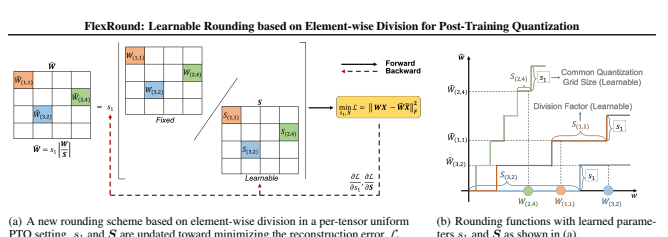
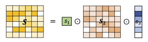
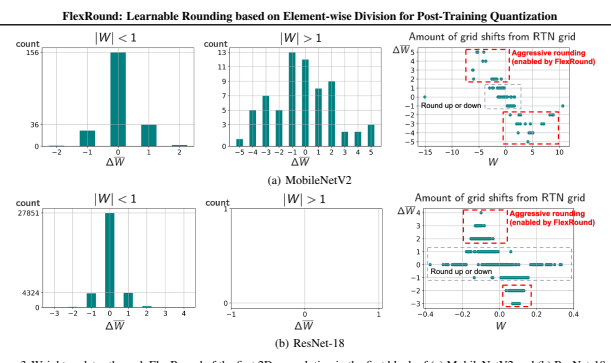
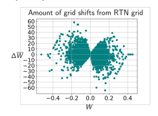
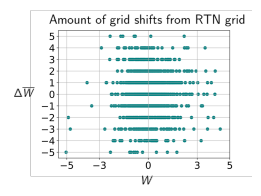
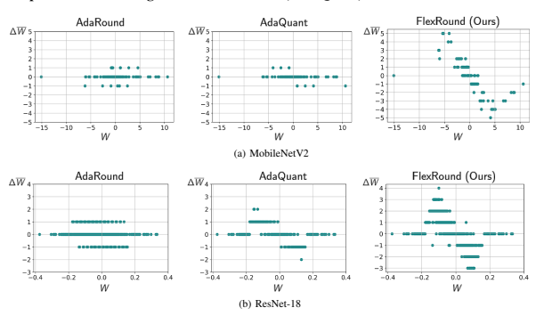
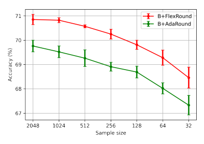

# Flexround: Learnable Rounding Based On Element-Wise Division For Post-Training Quantization

Jung Hyun Lee * 1 **Jeonghoon Kim** * 1 Se Jung Kwon 1 **Dongsoo Lee** 1

## Abstract

Post-training quantization (PTQ) has been gaining popularity for the deployment of deep neural networks on resource-limited devices since unlike quantization-aware training, neither a full training dataset nor end-to-end training is required at all. As PTQ schemes based on reconstructing each layer or block output turn out to be effective to enhance quantized model performance, recent works have developed algorithms to devise and learn a new weight-rounding scheme so as to better reconstruct each layer or block output.

In this work, we propose a simple yet effective new weight-rounding mechanism for PTQ, coined FlexRound, based on element-wise division instead of typical element-wise addition such that FlexRound enables jointly learning a common quantization grid size as well as a different scale for each pre-trained weight. Thanks to the reciprocal rule of derivatives induced by element-wise division, FlexRound is inherently able to exploit pre-trained weights when updating their corresponding scales, and thus, flexibly quantize pretrained weights depending on their magnitudes.

We empirically validate the efficacy of FlexRound on a wide range of models and tasks. To the best of our knowledge, our work is the first to carry out comprehensive experiments on not only image classification and natural language understanding but also natural language generation, assuming a per-tensor uniform PTQ setting. Moreover, we demonstrate, for the first time, that large language models can be efficiently quantized, with only a negligible impact on performance compared to half-precision baselines, achieved by reconstructing the output in a block-by-block manner.

*Equal contribution 1NAVER Cloud, Seongnam, South Korea.

Correspondence to: Jung Hyun Lee <onliwad101@gmail.com>,
Jeonghoon Kim <jeonghoon.samuel@gmail.com>.

## 1. Introduction

In recent years, deep neural networks have achieved unprecedented success across a wide variety of domains such as computer vision, natural language processing, and automatic speech recognition. Unfortunately, as these networks continue to improve and surpass human-level performance, the computational resources and memory usage required also increases as the architecture becomes more complex.

To reduce the model size and accelerate inference operations, many researchers have attempted diverse compression techniques such as network quantization (Courbariaux et al.,
2016) and network pruning (Han et al., 2016). In this paper, we concentrate on network quantization due to the advantage that INT4 or INT8 quantization allows us to accelerate quantized neural networks using off-the-shelf accelerators such as the NVIDIA A100 Tensor Core GPU (Wu et al.,
2020) or ARM Cortex MCUs (Kim et al., 2021).

Network quantization techniques can be broadly divided into two categories: quantization-aware training (QAT) and post-training quantization (PTQ). QAT is a method where the quantization of the networks is incorporated during the trianing process, as proposed by various research works such as Jung et al. (2019); Jain et al. (2019); Zhao et al. (2020);
Esser et al. (2020); Lee et al. (2021). We note that QAT
results in a marginal performance difference between the full-precision and quantized versions of the neural network.

Yet, QAT requires end-to-end retraining or fine-tuning on a full training dataset, which often causes an enormous amount of time and resources to obtain a quantized neural network with competitive performance. Furthermore, a whole training dataset may not be available due to data privacy issues or demands to utilize legacy models. Such drawbacks of QAT are the reasons why researchers recently pay more attention to PTQ (Zhao et al., 2019; Wang et al.,
2020; Nahshan et al., 2021) that needs neither a full training dataset nor end-to-end learning at all.

PTQ had been initially performed via rounding-to-nearest by minimizing the quantization error in the parameter space.

However, this approach suffers from severe performance degradation. Since it is reported that the loss degradation resulting from quantization can be approximated as the second-order error in Taylor Expansion by viewing quantized weights as perturbed weights, Nagel et al. (2020) and Li et al. (2021) substantiate that reconstructing each output of layer or block is equivalent to minimizing the approximation of loss degradation resulting from quantization under some assumptions. Accordingly, recent works (Nagel et al., 2020; Li et al., 2021; Hubara et al., 2021; Wei et al., 2022) have suggested to reconstruct each output of layer or block by devising and learning a new weight-rounding scheme, deviating from rounding-to-nearest, as an effort to preserve the performance of a full-precision model even after PTQ.

However, all those new rounding schemes designed in existing studies either round or quantize pre-trained weights adaptively via element-wise addition.

We propose a novel post-training weight quantization method, called FlexRound, which departs from the typical element-wise addition approaches and instead employs an element-wise division perspective. By jointly learning a common quantization grid size and the division factor for pre-trained weights, FlexRound offers a new approach to PTQ. Interestingly, thanks to the reciprocal rule of derivatives induced by element-wise division, FlexRound can inherently leverage pre-trained weights when updating an individual scale for each pre-trained weight. Specifically, we corroborate that a relatively wider range of discrete values needs to be explored when quantizing pre-trained weights of large magnitude. The rationale behind such an approach is that the magnitude of a weight can be interpreted as its relative importance within the network. Given that weights of larger magnitude have a greater impact on the network's performance than those of smaller magnitude, as demonstrated by research such as (Han et al., 2016), to maintain the performance of a pre-trained model even after quantization, it is important to relax the constraints associated with quantizing weights of large absolute value compared to those of small absolute value (i.e., important weights can be quantized to one of not only its two nearest discrete values but also to discrete values further away from it). Accordingly, FlexRound can quantize pre-trained weights flexibly depending on their own magnitudes, thereby leading to better performance.

Our contributions are threefold:

- We propose FlexRound as a new rounding scheme for post-training weight quantization based on the principle of element-wise division in order to allow for jointly learning not only a separate scale for every pretrained weight but also a common quantization grid size across a group (e.g., a channel or a layer).

- We theoretically and empirically demonstrate that such a new rounding scheme based on element-wise division takes into consideration the magnitude of pre-trained weights when updating their corresponding scales so that FlexRound can quantize pre-trained weights of
large magnitude (i.e., important pre-trained weights)
more flexibly than rounding either up or down only.

- To the best of our knowledge, we are the first to perform extensive experiments in a per-tensor uniform PTQ setting on natural language generation as well as image classification and natural language understanding, using numerous models such as ResNet, MobileNetV2, BERT, GPT-Neo, OPT, and GPT-2. We also, for the first time, conduct the uniform PTQ reconstruction for large language models like LLaMA on both common sense reasoning and causal language modeling tasks.

2

## 2. Related Work

Recently, many researchers have attempted to quantize a wide range of models for various tasks such as computer vision and natural language understanding/generation without any (re)training. Outlier channel splitting (OCS) (Zhao et al., 2019) replicates channels entailing outliers, and then, halves outliers of those channels. Despite the fact that OCS
explicitly addresses outliers, it still experiences severe accuracy degradation when both weights and activations are quantized to low-bit. As an alternative solution, Wang et al.

(2020) proposed Bit-Split that splits an integer into several bits and optimizes them separately. While the performance of Bit-Split is comparable to that of a full-precision model in a low-bit setting, it may not be as effective for certain architectures such as MobileNetV2.

To overcome the limitations discussed above, Nagel et al.

(2020) and Hubara et al. (2021) minimize the mean squared error (in a layer-by-layer fashion) between the full-precision layer's output and its quantized layer's output by inventing and learning a new weight-rounding mechanism dubbed as AdaRound and AdaQuant, respectively. As such a layerwise reconstruction error minimization opens the door to 4bit PTQ regime, Li et al. (2021) proposed block-wise reconstruction, titled BRECQ, to consider cross-layer dependency along with the possibility of fully quantizing MobileNetV2 to 4-bit. In addition to block-wise reconstruction, Wei et al.

(2022) proposed QDrop that drops the quantization of activations at random during the PTQ reconstruction to induce activation quantization to be synchronized with weight quantization. Both BRECQ and QDrop, however, are based on AdaRound that rounds weights only either up or down at most with a 'fixed' quantization grid size. AdaQuant can simultaneously learn a quantization grid size and quantize weights adaptively, but incurs severe performance degradation when quantizing MobileNetV2 in low-bit regimes.

As another line of PTQ research, some PTQ techniques are exclusively specialized in quantizing language models such as BERT and GPT-like models. Bondarenko et al. (2021)
first applied PTQ to BERT by introducing a per-embedding-

PTQ setting. s1 and S are updated toward minimizing the reconstruction error, L.
group activation quantization scheme to deal with highly dynamic activation ranges. Bai et al. (2021) studied the PTQ reconstruction in parallel for BERT. Yao et al. (2022)
proposed ZeroQuant that quantizes BERT and GPT-3 in a group-wise weight quantization manner driven by tokenwise activation quantization via layer-by-layer knowledge distillation (while a dedicated CUDA kernel is required for ZeroQuant). Dettmers et al. (2022) quantizes large language models (LLMs) like OPT with vector-wise weight quantization and mixed-precision decomposition with FP16 activations. To avoid the use of FP16 activations, Xiao et al.

(2022) proposed SmoothQuant that shifts the difficulty of activation quantization to weight quantization, allowing for INT8 quantization of both weights and activations in LLMs.

Unfortunately, both Dettmers et al. (2022) and Xiao et al.

(2022) assume that the outliers in activations would appear in a certain pattern.

Most of the aforementioned PTQ studies are targeted to either vision models or language models only, not to both.

To the best of our knowledge, our work is the first to carry out extensive experiments on diverse tasks ranging from image classification and natural language understanding to natural language generation under a per-tensor uniform PTQ setting. Additionally, we for the first time show that LLMs can be efficiently quantized, with only a minor impact on accuracy compared to half-precision baselines, attained by reconstructing each block output, without the assumption that the activation outliers would appear in a certain pattern.

## 3. Methodology

This section begins by introducing the notations used throughout the paper and the background of post-training quantization (PTQ). We then provide the concept and design of FlexRound for the uniform PTQ reconstruction method.

We finally delve into the advantages of utilizing the principle of element-wise division in FlexRound.

## 3.1. Preliminaries

Notations A scalar, a vector, and a matrix (or a tensor) are expressed as a non-bold letter, a small bold letter, and a capital bold letter (e.g. s, s and S) respectively. Wc indicates the quantized counterpart of W. The input to a 2D convolution or a linear layer is represented as X if all previous layers are intact, or as Xf if all previous layers are quantized. The entries of a matrix A are denoted as A(i,j), while the entries of a 4-dimensional tensor A are denoted as A(*i,j,k,l*). We let ⊙ and / indicate element-wise product and element-wise division, respectively, similar to the broadcasting process in Python Numpy. ⌊·⌉ and ⌊·⌋
express the rounding function and the floor function. *|| · ||*F
represents the Frobenius norm.

PTQ Background The conventional uniform PTQ approach is to quantize pre-trained weights W to be Wc =
s1 jW
s1 mvia rounding-to-nearest, where a quantization grid size s1 ∈ R>0 is set to minimize ∥W − Wc∥
2 F
, but the minimization of the quantization error in the parameter space is not equivalent to that of the final task loss. As Li et al. (2021)
proves that the loss degradation resulting from quantization can be approximated as the quadratic form of the network output and its Hessian matrix, several studies have strove to minimize ∥W X − WcXf∥
2 F
layer-by-layer or block-byblock with respect to continuous variables V with a small amount of data, where Wc is either s1(⌊W
s1
⌋ + h(V )) with a certain function h(·) (Nagel et al., 2020) or s1 jW+V
s1 m
(Hubara et al., 2021). However, all these rounding mechanisms are founded on element-wise addition.

## 3.2. Flexround

Unlike prior works based on element-wise addition, we exploit element-wise division for quantizing pre-trained weights. We can formulate our proposed weight-rounding scheme based on element-wise division as follows:

$${\widehat{W}}=s_{1}\left\lfloor{\frac{W}{S}}\right\rfloor,$$
4
where S is the division factor for W whose shape is equal to that of W while all entries of S as well as s1 are positive and learnable. Similarly to preceding studies, both s1 and S
are updated as an attempt to minimize ∥W X − WcXf∥
2 F
.

Eq. 1 indicates that the basic formula of FlexRound supports per-tensor uniform PTQ. Although FlexRound can also adopt per-channel weight quantization by simply replacing a scalar s1 with a vector s1, as we show later, per-tensor uniform PTQ (via FlexRound) can be sufficient to achieve the performance of a full-precision model. Therefore, we focus on the per-tensor uniform PTQ reconstruction unless otherwise specified. The overall procedure of FlexRound in a per-tenor uniform PTQ setting is described in Figure 1.

Let us discuss how to design S in detail. We first start formulating S as S = s1⊙S2, where S2 is the matrix or tensor scaling W whose shape is equal to that of W while every element of S2 is positive and learnable. When S = s1 ⊙S2, Eq. 1 is enough to perform well compared to existing weightrounding schemes based on element-wise addition in a per-tensor uniform PTQ setting, as we show later. However, to further improve the performance of a new weightrounding scheme based on element-wise division, we complement S2 as follows. For a linear layer W ∈ R
Cout×Cin ,
S2 is complemented with an additional learnable tensor s3 ∈ R
Cout×1
>0. Motivated from a wide acknowledgement that the statistics of output channels can vary greatly (Nagel et al., 2019; Lou et al., 2020), we take into account the variation of output channel's statistics by supplementing S2 with s3. For a 2D convolution W ∈ R
Cout×Cin×H×W , in particular, S2 is complemented with two additional learnable tensors s3 ∈ R
Cout×1×1×1
>0and s4 ∈ R
1×Cin×1×1
>0.

Hence, S is formulated as s1 ⊙ S2 ⊙ s3 (as illustrated in Figure 2) for a linear layer, or as s1 ⊙ S2 ⊙ s3 ⊙ s4 for a 2D convolution so that Eq. 1 is transformed into

$$\widehat{\mathbf{W}}=\begin{cases}s_{1}\Bigg{|}\dfrac{\mathbf{W}}{s_{1}\odot s_{2}\odot s_{3}}\Bigg{|}&\text{for a linear layer}\\ s_{1}\Bigg{|}\dfrac{\mathbf{W}}{s_{1}\odot s_{2}\odot s_{3}\odot s_{4}}\Bigg{|}&\text{for a2D convolution}\end{cases}.\tag{2}$$  We refer to Eq. 2 and $\mathbf{F}^{\prime}$. $\mathbf{R}$. $\mathbf{R}$. $\mathbf{R}$. $\mathbf{R}$.  
We refer to Eq. 2 as '*FlexRound.*' Here, every element of S2, s3, and s4 is initialized to 1 in order to facilitate learning from the traditional rounding-to-nearest method, namely, s1 jW
s1 m. All parameters (s1, S2, s3, and s4) are updated to minimize ∥W X − WcXf∥
2 F
subject to the constraint that all entries of s1, S2, s3, and s4 are positive.

In Eq. 2, element-wise division serves a similar purpose as element-wise addition in creating a more effective rounding scheme than rounding-to-nearest. By implementing such

$$(1)$$

Figure 2. Formation of S in Eq. 1 for a linear layer W. s1 is a common quantization grid size across a layer, S2 is the matrix scaling W, and s3 is an additional vector supporting S2 to account for the variation of output channel's statistics in W. As a result, S = s1 ⊙ S2 ⊙ s3 is the division factor for a linear layer W.

a new rounding policy through element-wise division, we can make s1, S2, s3, and s4 all learnable. This allows FlexRound to learn a common quantization grid size (i.e.,
s1) jointly with the rounding process (e.g., S2 ⊙ s3 or S2 ⊙
s3 ⊙ s4 in FlexRound). Furthermore, the reciprocal rule of derivatives induced by element-wise division enables FlexRound to leverage pre-trained weights when learning the corresponding scales, as demonstrated both theoretically and empirically by the following proposition.

Proposition 3.1. Let L be the reconstruction error computed from Eq. 2 and S
′ be the matrix (or tensor) scaling pre-trained weights W in Eq. *2, i.e.,* S
′ = S2 ⊙ s3 (or S2 ⊙ s3 ⊙ s4). Then, the gradient of L with respect to an entry of S
′,∂L
∂S′(i,j)
(or ∂L
∂S′(*i,j,k,l*)
) is proportional to its corresponding pre-trained weight, W(i,j)(or W(i,j,k,l)), when using the straight-through estimator (Bengio et al., *2013).*
Proposition 3.1 implies that, for a linear layer, an element S
′
(i,j)
is (partially) affected by W(i,j) so that W(i,j) =
j W(i,j)
s1⊙S′(i,j)
mcan also be updated and influenced by W(i,j).

In other words, as the magnitude of a pre-trained weight W(i,j)is larger, the chance of W(i,j)receiving a larger update during the PTQ reconstruction becomes higher. The magnitude of a weight can be regarded as a metric to measure the importance of a weight for pruning unimportant weights (Han et al., 2015). Consequently, weights of larger magnitude play a more important role than those of smaller magnitude (Han et al., 2016). To reduce the performance gap between a full-precision pre-trained model and its quantized version, it would be reasonable to relax the constraint on quantizing pre-trained weights of large magnitude (i.e.,
potentially important pre-trained weights) by allowing them to have higher chances of being quantized to one of not just the two closest quantization grids but also more distant ones than those of smaller magnitude. The above implication is also identically applicable to a 2D convolution. Figure 3 shows the amount of weight updates via FlexRound for MobileNetV2 and ResNet-18. On the left side and the center side of Figure 3, histograms describe the change of W(*i,j,k,l*) grouped for small pre-trained weights (|W| < 1, left) and large pre-trained weights (|W| > 1, center). On the right side, scatter plots show the amount of grid shifts

from the grids obtainable from rounding-to-nearest (RTN).

We note that MobileNetV2 and ResNet-18 are quantized distinctively due to FlexRound. For example, in the case of MobileNetV2 as in Figure 3(a), the change of W(*i,j,k,l*)
attained by minimizing L is more aggressive (i.e., rounding can be deviated from more than one-step up or one-step down) when the absolute value of W(*i,j,k,l*)is larger than one, which means that FlexRound more flexibly quantizes pre-trained weights of large magnitude as illustrated in red dotted squares in Figure 3(a). The amount of aggressively rounded weights in the first 2D convolution of the first block of MobileNetV2 is around 12.8% of the total. For ResNet-18, however, there are no pre-trained weights whose magnitudes are larger than one. Thus, most pre-trained weights are rounded either up or down as seen in Figure 3(b)
(e.g., only about 1.5% weights are rounded aggressively in the first 2D convolution of the first block of ResNet-18).

Different rounding results of AdaRound, AdaQuant, and FlexRound are visually compared in Appendix A.

Even if FlexRound takes into account the magnitude of pretrained weights when updating their corresponding scales, one might question that FlexRound seems to quantize pretrained weights of moderate magnitude more flexibly than those of large magnitude as seen in the right side of Figure 3.

Our aim with FlexRound is to emphasize that pre-trained weights with relatively larger magnitude are more likely to be quantized with higher flexibility compared to those with relatively smaller magnitude. As explained in Appendix B,

Table 1. Top-1/Top-5 accuracy (%) on ImageNet when only weights are quantized to 4-bit. "B + X" denotes the implementation of X in

the setting of BRECQ. The s1 column indicates whether s1 is fixed or can be learned during the PTQ reconstruction. The S2 and s3, s4

columns represent the presence (O) or absence (X) of each in FlexRound, respectively. For instance, the formula for FlexRound (Ours)

and Ablation Study 1 is Eq. 2, and that for Ablation Study 2 is Wc = s1⌊W/s1 ⊙ S2⌉.

Method s1 S2 s3, s4 ResNet-18 ResNet-50 MobileNetV2

Full-precision N/A N/A N/A 71*.00/*89.97 76*.63/*93.04 72*.62/*90.67

B + AdaQuant Learnable N/A N/A 67*.50/*87.75 72*.79/*90.77 15*.17/*32.89

B + AdaRound Fixed N/A N/A 70*.18/*89.38 75*.86/*92.62 69*.46/*88.85 B + FlexRound (Ours) Learnable O O 70.28/89.44 75.95/92.68 70.82/89.67

→ Ablation Study 1 Fixed O O 70.09/89.43 75.88/92.61 69.47/88.85 → Ablation Study 2 Learnable O X 70*.22/*89.45 75*.92/*92.63 70*.51/*89.49

$\left|\frac{\partial\mathcal{L}}{\partial\mathcal{S}_{(i,j)}^{\prime}}\right|$ is directly proportional to $\left|W_{(i,j)}\frac{\partial\mathcal{L}}{\partial\bar{W}_{(i,j)}}\right|$. No matter how large the magnitude of $W_{(i,j)}$ is, if $\left|\frac{\partial\mathcal{L}}{\partial\bar{W}_{(i,j)}}\right|$ is close to zero, $\left|\frac{\partial\mathcal{L}}{\partial\mathcal{S}_{(i,j)}^{\prime}}\right|$ would be also zero. In this sense, pre-trained weights of large magnitude can be quantized to the 
grids obtainable from RTN. If
RTN. If $\left|\frac{\partial\mathcal{L}}{\partial\bar{W}_{(i,j)}}\right|$ is (s)
is (significantly)
larger than zero, pre-trained weights of large magnitude
can be quantized to the grids far from two nearest ones
as seen in Figure 4. In short, while the magnitude of pretrained weights influences the updates to their corresponding
scales in FlexRound, it does not necessarily imply that larger
weights must be quantized more flexibly than smaller ones.

Note that FlexRound can quantize weights more flexibly as the bit-width increases. Comparing the right side of Figure 3 with Figure 5, FlexRound can provide more grid shifts from the grids obtainable from RTN as a higher bit-width is used.

Unlike AdaRound that must round weights either up or down regardless of the number of bits used, FlexRound enables more flexible weight quantization as the bit-width increases, thus being better suited for quantizing models that require higher bit-widths (e.g., LLMs) than AdaRound.

## 4. Experiments

In this section, we first empirically confirm the importance of learning a quantization grid size s1 jointly with the rounding process and the distinct contribution of additional tensors s3 and s4 to FlexRound. Then, we compare the performance of FlexRound with that of the state-of-the-art PTQ
methods in a per-tensor uniform PTQ setting in the following cases: image classification on ImageNet (Russakovsky et al., 2015) with ResNet (He et al., 2016) and MobileNetV2
(Sandler et al., 2018) (Section 4.2), natural language understanding (NLU) on GLUE (Wang et al., 2018) with BERT
(Devlin et al., 2018) and GPT-Neo (Black et al., 2021) (Section 4.3), natural language generation (NLG) on WikiText2
(Merity et al., 2016) and Penn Treebank (PTB) (Marcus et al., 1993) with GPT-Neo and OPT (Zhang et al., 2022),
and NLG on WebNLG (Gardent et al., 2017) with GPT-2
(Radford et al., 2019) (Section 4.3). Finally, we validate that large language models (LLMs) can be quantized with only a marginal impact on accuracy compared to half-precision baselines by block-wise output reconstruction, without assuming that the activation outliers would occur in a certain pattern. We study LLaMA (Touvron et al., 2023) by adopting per-channel weight quantization and per-tensor activation quantization for six common sense reasoning benchmarks: BoolQ (Clark et al., 2019), PIQA (Bisk et al.,
2020), HellaSwag (Zellers et al., 2019), WinoGrande (Sakaguchi et al., 2021), ARC easy and challenge (Clark et al.,
2018), and OpenBookQA (Mihaylov et al., 2018), and the causal language modeling task on WikiText2 (Section 4.3).

For brevity, we let "B + X" and "Q + X" indicate that a certain rounding scheme 'X' is performed in the experimental setup described in BRECQ (Li et al., 2021) or QDrop
(Wei et al., 2022), respectively (an experimental setup includes the definition of a block unit for reconstruction error minimization or how much the probability of dropping the quantization of activations is). As introduced in BRECQ
and QDrop, we also use the LSQ technique (Esser et al.,
2020) when updating an activation step size for activation quantization. All experimental results are conducted by our own implementation based on open-source codes.

## 4.1. Ablation Study

Ablation Study 1 Although AdaRound demonstrates the state-of-the-art performance among previous PTQ approaches, it is unable to learn the quantization grid size s1 jointly with the rounding process, as discussed in Section 2. To understand the significance of learning s1 jointly with the rounding process, we evaluate the performance of FlexRound with a fixed s1 (Ablation Study 1 in Table 1)
on the ImageNet dataset with weights quantized to 4-bit
(activations are not quantized). As seen in Table 1, when s1 is fixed, FlexRound performs similarly to AdaRound for all models except for ResNet-18. This indicates that regardless of the quantization method used, whether it be AdaRound or FlexRound, using a fixed s1 prevents further improvements

| Method               | # Bits (W/A)   | ResNet-18   | ResNet-50   | MobileNetV2   |
|----------------------|----------------|-------------|-------------|---------------|
| Full-precision       | 32/32          | 71.00/89.97 | 76.63/93.04 | 72.62/90.67   |
| B + AdaQuant         | 4/32           | 67.50/87.75 | 72.79/90.77 | 15.17/32.89   |
| B + AdaRound         | 4/32           | 70.18/89.38 | 75.86/92.62 | 69.46/88.85   |
| B + FlexRound (Ours) | 4/32           | 70.28/89.44 | 75.95/92.68 | 70.82/89.67   |
| B + AdaQuant         | 3/32           | 57.09/80.82 | 52.13/75.22 | 0.20/0.79     |
| B + AdaRound         | 3/32           | 68.79/88.62 | 74.31/91.81 | 62.51/84.52   |
| B + FlexRound (Ours) | 3/32           | 68.65/88.54 | 74.38/91.81 | 66.87/87.56   |
| B + AdaQuant         | 2/32           | 0.23/0.92   | 0.10/0.50   | 0.10/0.50     |
| B + AdaRound         | 2/32           | 61.99/84.81 | 48.47/77.09 | 39.57/66.18   |
| B + FlexRound (Ours) | 2/32           | 62.57/84.84 | 63.67/85.72 | 46.04/72.48   |

Table 2. Top-1/Top-5 accuracy (%) on ImageNet with only weights quantized. "B + X" is the implementation of X in the BRECQ's setup.

Table 3. Top-1/Top-5 accuracy (%) on ImageNet when both weights and activations are quantized. "B + X" and "Q + Y" represent the implementation of X in the BRECQ's setting and that of Y in the QDrop's setting, respectively.

Method # Bits (W/A) ResNet-18 ResNet-50 MobileNetV2

Full-precision 32/32 71.00/89.97 76.63/93.04 72.62/90.67

B + AdaRound 4/4 69*.18/*88.85 74*.44/*91.80 61*.05/*83.30

B + FlexRound (Ours) 4/4 69.32/88.83 74.56/91.87 63.74/85.01 Q + AdaRound 4/4 69*.20/*88.96 74*.90/*92.15 65*.42/*86.23

Q + FlexRound (Ours) 4/4 69.26/88.81 75.08/92.20 66.66/87.21

B + AdaRound 3/3 64*.83/*86.12 67*.01/*87.28 3.74/11.54 B + FlexRound (Ours) 3/3 64.99*/85.*93 68.29*/87.*89 25.43*/48.*28

Q + AdaRound 3/3 65.71/86.96 70.49/89.93 39.86/66.00

Q + FlexRound (Ours) 3/3 65.43*/86.*60 70.74/89.78 51.49/76.90

in the performance of the quantized model. However, when learning s1 jointly with the rounding process, FlexRound outperforms AdaRound for every model. The ability to learn s1 jointly with the rounding process is a critical aspect in closing the performance gap between a full-precision model and its quantized counterpart. FlexRound possesses this capability in contrast to AdaRound since it is based on element-wise division, as mentioned in Section 3.2.

Ablation Study 2 To justify the inclusion of additional tensors s3 and s4 in FlexRound, we conduct an ablation study in which FlexRound is tested on the ImageNet dataset with weights quantized to 4-bit while keeping activations unquantized, and the results are compared with FlexRound without the use of s3 and s4 (Ablation Study 2 in Table 1).

As shown in the last two rows in Table 1, the presence of s3 and s4 increases the top-1 accuracy for all models.

Interestingly, FlexRound without the use of s3 and s4 also outperforms both AdaQuant and AdaRound, which would support our claim that a new rounding scheme shifted from element-wise addition to element-wise division is the key to improving the quantization quality significantly.

## 4.2. Resnet And Mobilenetv2 On Imagenet 7

We quantize ResNet-18, ResNet-50, and MobileNetV2 in the low-bit PTQ reconstruction with 1024 randomly sampled images. Linear symmetric per-tensor quantization format is assumed for quantizing weights and/or activations, whereas in contrast, Li et al. (2021) and Wei et al. (2022)
adopt linear asymmetric per-channel quantization format, which causes discrepancies between the results obtained in our own implementation of BRECQ and QDrop and those reported in Li et al. (2021) and Wei et al. (2022).

For FlexRound, the output of each layer or block is reconstructed during 5k iterations while all learnable parameters
(i.e., s1, S2, s3, and s4) are updated by using one learning rate (e.g., 4e-4 for the ResNet models quantized by 3-bit or 4-bit, or 1e-3 for the ResNet models quantized by 2-bit and MobileNetV2). The first and last layers are quantized to 8-bit and the batch normalization layer is folded into convolution, as in Li et al. (2021). Our experiments are performed based on full-precision pre-trained models provided in the BRECQ github repository1, unless otherwise noted.

The experiments based on full-precision pre-trained models available from the official PyTorch repository are given in Appendix C. We report the median over five random trials.

Assuming the quantization of weights only, we compare FlexRound with AdaRound and AdaQuant, which both utilize the principle of element-wise addition. Table 2 shows that FlexRound consistently outperforms those two additionbased rounding policies. Note that the performance of 1https://github.com/yhhhli/BRECQ
Table 4. Performance on GLUE. For evaluation metrics, matched and mismatched accuracies are reported for MNLI, F1 score and accuracy are reported for QQP, and accuracy is reported for MRPC. "Q + X" implies the implementation of X in the QDrop's setting.

Both weights and input activations of attention and feed-forward sub-layers are quantized to 8-bit in a per-tensor asymmetric scheme.

| Dataset            | Method      | BERTBASE    | BERTLARGE   | GPT-Neo125M   | GPT-Neo1.3B   | GPT-Neo2.7B   |
|--------------------|-------------|-------------|-------------|---------------|---------------|---------------|
| Full-precision     | 84.49/85.20 | 86.05/85.98 | 79.11/79.63 | 85.12/86.04   | 86.36/87.02   |               |
| MNLI               | Q+AdaRound  | 83.69/84.61 | 85.75/85.86 | 72.67/74.11   | 84.90/85.82   | 86.33/86.75   |
| Q+FlexRound (Ours) | 84.53/84.98 | 85.93/85.99 | 72.94/74.24 | 85.56/86.14   | 86.41/86.89   |               |
| Full-precision     | 88.06/91.08 | 88.66/91.59 | 85.20/88.99 | 88.26/91.28   | 88.62/91.50   |               |
| QQP                | Q+AdaRound  | 87.65/90.58 | 87.48/90.62 | 72.97/79.35   | 87.98/91.04   | 88.38/91.27   |
| Q+FlexRound (Ours) | 87.81/90.83 | 88.38/91.31 | 73.75/80.65 | 88.27/91.18   | 88.60/91.39   |               |
| Full-precision     | 85.05       | 85.54       | 80.15       | 85.05         | 87.99         |               |
| MRPC               | Q+AdaRound  | 81.62       | 82.35       | 75.25         | 84.80         | 85.78         |
| Q+FlexRound (Ours) | 84.07       | 84.31       | 75.49       | 85.05         | 86.76         |               |

Table 5. Performance of GPT-Neo and OPT fine-tuned on WikiText2 and PTB, respectively. The perplexity (PPL) is employed as a performance metric. The lower PPL, the better. "Q + X" means the implementation of X in the QDrop's setting. Both weights and input activations of attention and feed-forward sub-layers are quantized to 8-bit in a per-tensor asymmetric scheme.

AdaQuant is inferior to that of AdaRound in Table 2. Correspondingly, FlexRound would be compared to AdaRound only to save space hereafter. Table 3 provides model accuracy when AdaRound and FlexRound (quantizing both weights and activations) are associated with the settings of BRECQ or QDrop. It is worth noting that in Table 3, FlexRound is particularly effective for MobileNetV2 (which includes weights of large magnitude) for the reasons explained in Section 3.2. It is also interesting to see that even when both weights and activations of the ResNet models are quantized to 4-bit under a per-tensor uniform PTQ setting, the performance degradation (compared to a full-precision pre-trained model) is negligible (less than 2%) in Table 3.

| Dataset            | Method     | GPT-Neo125M   | GPT-Neo1.3B   | GPT-Neo2.7B   | OPT125M   | OPT1.3B   | OPT2.7B   |
|--------------------|------------|---------------|---------------|---------------|-----------|-----------|-----------|
| Full-precision     | 21.96      | 12.09         | 10.78         | 19.85         | 11.52     | 10.27     |           |
| WikiText2          | Q+AdaRound | 30.52         | 12.47         | 14.09         | 27.96     | 12.66     | 10.97     |
| Q+FlexRound (Ours) | 24.30      | 12.37         | 12.43         | 21.43         | 12.02     | 10.63     |           |
| Full-precision     | 24.20      | 16.09         | 14.70         | 16.50         | 11.62     | 10.80     |           |
| PTB                | Q+AdaRound | 31.40         | 16.63         | 19.80         | 20.28     | 13.00     | 12.02     |
| Q+FlexRound (Ours) | 26.03      | 16.32         | 16.87         | 17.68         | 12.22     | 11.29     |           |

## 4.3. Language Models

All language models in this paper are based on the structure of Transformer (Vaswani et al., 2017). To reduce the precision of such models to 8-bit, unless otherwise stated, we employ a linear asymmetric per-tensor quantization scheme for both weights and activations. The reconstruction step for PTQ is applied to each Transformer layer, including both attention and feed-forward sub-layers. All weights in attention and feed-forward sub-layers are quantized to 8-bit.

Activations are quantized to 8-bit on-the-fly before each linear layer, while the inputs of the softmax and normalization layers remain at full-precision as suggested in Zafrir et al.

Model Method Unseen Seen All

Full-precision (LoRA) 47.16 62.31 55.43

GPT-2 M Q+AdaRound 45.70 60.92 54.05

Q+FlexRound (Ours) 46.85 61.83 55.06

Full-precision (LoRA) 48.06 64.39 56.97

GPT-2 L Q+AdaRound 48.09 63.98 56.75

Q+FlexRound (Ours) 48.42 64.47 57.16

(2019) and Zhang et al. (2020). We utilize pre-trained language models (PLMs) and datasets from the HuggingFace
(Wolf et al., 2020) repository, with the exception of GPT-2 and LLaMA experiments. The experiments for the questionanswering task with a fine-tuned BERT on the SQuADv1
(Rajpurkar et al., 2016) dataset is presented in Appendix G.

BERT and GPT-Neo on GLUE We evaluate the natural language understanding (NLU) performance of FlexRound using a variety of models including BERTBase, BERTLarge, GPT-Neo125M, GPT-Neo1.3B, and GPT-Neo2.7B fine-tuned

| Model              | Method     | BoolQ   | PIQA   | HellaSwag   | WinoGrande   | ARC-e   | ARC-c   | OBQA   | WikiText2   |
|--------------------|------------|---------|--------|-------------|--------------|---------|---------|--------|-------------|
| Half-precision     | 68.38      | 80.09   | 79.21  | 72.93       | 58.92        | 45.48   | 42.00   | 6.35   |             |
| LLaMA-33B          | Q+AdaRound | 64.86   | 74.65  | 68.64       | 57.93        | 49.28   | 36.95   | 41.00  | 10.39       |
| Q+FlexRound (Ours) | 69.08      | 79.16   | 77.43  | 72.53       | 56.61        | 44.97   | 44.00   | 6.82   |             |

on the GLUE benchmark. We only report the experimental results on the MNLI, QQP, and MRPC datasets due to space limit. All experimental results are presented in Appendix H.

The learning rate applied to all learnable parameters (s1, S2, and s3) is selected to be 2e-4 for BERT and to be 3e-4 for GPT-Neo regardless of the task to demonstrate that 'Q +
FlexRound' can broadly surpass 'Q + AdaRound' without the need of significant efforts to select the optimal learning rate for each task. Reconstruction process is performed by using 1024 random samples for 20K iterations. The last, randomly initialized layer remains in full-precision. Further experimental details are deferred to Appendix H. In Table 4, we report the performance of 'Q + AdaRound' and
'Q + FlexRound' that are potentially promising as shown in Table 3. We can notice that 'Q + FlexRound' yields better NLU scores than 'Q + AdaRound' for all models and NLU
tasks. In particular, for the MNLI and QQP datasets, 'Q +
FlexRound' can achieve comparable or even superior performance to a full-precision model in a per-tensor uniform PTQ setting with the exception of GPT-Neo125M.

## Gpt-Neo And Opt On Wikitext2 And Ptb We Test

the natural language generation (NLG) performance of FlexRound using fine-tuned PLMs including GPT-Neo125M,
GPT-Neo1.3B, GPT-Neo2.7B, OPT125M, OPT1.3B, and OPT2.7B on the WikiText2 dataset and PTB dataset. Finetuned PLMs (for NLG) are quantized by AdaRound and FlexRound in a per-tensor quantization manner with 128 random samples drawn from downstream task training data.

More details on the experimental setup are provided in Appendix I. As presented in Table 5, it is clear that 'Q
+ FlexRound' is superior to 'Q + AdaRound' for all models and datasets, which means that FlexRound is also effective for NLG as well as image classification and NLU. Notice that even for the OPT models, the performance of 'Q +
FlexRound' is close to that of a full-precision model.

GPT-2 on WebNLG To this point, we have applied full fine-tuning for downstream tasks to BERT, GPT-Neo, and OPT. For language models, however, there are various finetuning techniques (Houlsby et al., 2019; Liu et al., 2022; Hu et al., 2022) that can perform better with fewer trainable parameters than full fine-tuning. To evaluate the compatibility of FlexRound with other fine-tuning methods, we perform experiments on quantizing GPT-2 merged with LoRA (Hu et al., 2022), one of the state-of-the-art fine-tuning methods.

We choose 128 examples from the training set of WebNLG
at random for reconstruction. More experimental details are given in Appendix J. Table 6 shows that 'Q + FlexRound' excels 'Q + AdaRound', and performs similarly or even better than the full-precision model with LoRA. Hence, FlexRound is also compatible with other state-of-the-art fine-tuning techniques in addition to full fine-tuning.

## Llama On Common Sense Reasoning And Wikitext2

Finally, we evaluate the zero-shot performance of LLaMA-33B on six common sense reasoning benchmarks and one casual language modeling task on WikiText2. It is intended to justify that LLMs can be efficiently quantized with only negligible accuracy degradation compared to half-precision baselines by block-by-block reconstructing output, without assuming that the outliers in activations would emerge in a certain pattern. In Table 7, for reconstruction, 512 samples are randomly selected from the training dataset of C4
(Raffel et al., 2020). We use linear asymmetric per-channel quantization for weights but linear asymmetric per-tensor quantization for activations. The zero-shot and five-shot performances of LLaMA-7B, LLaMA-13B, and LLaMA-33B as well as those experimental details are given in Appendix K. Table 7 shows that 'Q + FlexRound' can maintain the accuracy of the half-precision baseline, surpassing 'Q
+ AdaRound'. Without any assumption about the activation outliers in LLMs, FlexRound can quantize LLMs while preserving the performance of half-precision baselines.

## 5. Conclusion

We propose a new rounding scheme, *FlexRound*, for posttraining weight quantization under the principle of elementwise division, to enable jointly learning both a common quantization grid size and an individual scale for each pretrained weight. We validate that FlexRound can flexibly quantize pre-trained weights by updating their corresponding scales depending on their own magnitudes. Hence, FlexRound can be applied to various models including even large language models with negligible accuracy degradation.

## References

Bai, H., Hou, L., Shang, L., Jiang, X., King, I., and Lyu, M. R. Towards efficient post-training quantization of pre-trained language models. *arXiv preprint* arXiv:2109.15082, 2021.

Bengio, Y., Leonard, N., and Courville, A. Estimating or propagating gradients through stochastic neurons for conditional computation. *arXiv preprint arXiv:1308.3432*,
2013.

Bisk, Y., Zellers, R., Gao, J., Choi, Y., et al. Piqa: Reasoning about physical commonsense in natural language. In *Proceedings of the AAAI conference on artificial intelligence*,
volume 34, pp. 7432–7439, 2020.

Black, S., Gao, L., Wang, P., Leahy, C., and Biderman, S.

GPT-Neo: Large Scale Autoregressive Language Modeling with Mesh-Tensorflow, March 2021. URL https:
//doi.org/10.5281/zenodo.5297715. If you use this software, please cite it using these metadata.

Bondarenko, Y., Nagel, M., and Blankevoort, T. Understanding and overcoming the challenges of efficient transformer quantization. In *Proceedings of the 2021 Conference on Empirical Methods in Natural Language Processing*, pp. 7947–7969. Association for Computational Linguistics, November 2021. doi: 10.18653/v1/2021.

emnlp-main.627. URL https://aclanthology.

org/2021.emnlp-main.627.

Clark, C., Lee, K., Chang, M.-W., Kwiatkowski, T., Collins, M., and Toutanova, K. BoolQ: Exploring the surprising difficulty of natural yes/no questions. In Proceedings of the 2019 Conference of the North American Chapter of the Association for Computational Linguistics: Human Language Technologies, Volume 1 (Long and Short Papers), pp. 2924–2936, Minneapolis, Minnesota, June 2019. Association for Computational Linguistics. doi: 10.18653/v1/N19-1300. URL https:
//aclanthology.org/N19-1300.

Clark, P., Cowhey, I., Etzioni, O., Khot, T., Sabharwal, A.,
Schoenick, C., and Tafjord, O. Think you have solved question answering? try arc, the ai2 reasoning challenge.

arXiv preprint arXiv:1803.05457, 2018.

Courbariaux, M., Hubara, I., Soudry, D., El-Yaniv, R., and Bengio, Y. Binarized neural networks: Training deep neural networks with weights and activations constrained to +1 or-1. *arXiv preprint arXiv:1602.02830*, 2016.

Dettmers, T., Lewis, M., Belkada, Y., and Zettlemoyer, L.

Llm. int8 (): 8-bit matrix multiplication for transformers at scale. *arXiv preprint arXiv:2208.07339*, 2022.
Devlin, J., Chang, M.-W., Lee, K., and Toutanova, K. Bert:
Pre-training of deep bidirectional transformers for language understanding. *arXiv preprint arXiv:1810.04805*,
2018.

Esser, S. K., McKinstry, J. L., Bablani, D., Appuswamy, R., and Modha, D. S. Learned step size quantization. In International Conference on Learning Representations, 2020. URL https://openreview.net/forum? id=rkgO66VKDS.

Gao, L., Tow, J., Biderman, S., Black, S., DiPofi, A., Foster, C., Golding, L., Hsu, J., McDonell, K., Muennighoff, N.,
Phang, J., Reynolds, L., Tang, E., Thite, A., Wang, B.,
Wang, K., and Zou, A. A framework for few-shot language model evaluation, September 2021. URL https:
//doi.org/10.5281/zenodo.5371628.

Gardent, C., Shimorina, A., Narayan, S., and PerezBeltrachini, L. The WebNLG challenge: Generating text from RDF data. In *Proceedings of the 10th International Conference on Natural Language Generation*, pp. 124–133, Santiago de Compostela, Spain, September 2017. Association for Computational Linguistics. doi: 10.18653/v1/W17-3518. URL https:
//aclanthology.org/W17-3518.

Han, S., Pool, J., Tran, J., and Dally, W. Learning both weights and connections for efficient neural network.

Advances in neural information processing systems, 28, 2015.

Han, S., Mao, H., and Dally, W. J. Deep compression: Compressing deep neural networks with pruning, trained quantization and huffman coding. In *International Conference on Learning Representations*, 2016. URL https:
//arxiv.org/pdf/1510.00149.pdf.

He, K., Zhang, X., Ren, S., and Sun, J. Deep residual learning for image recognition. In *Proceedings of the IEEE*
conference on computer vision and pattern recognition, pp. 770–778, 2016.
Houlsby, N., Giurgiu, A., Jastrzebski, S., Morrone, B.,
De Laroussilhe, Q., Gesmundo, A., Attariyan, M., and Gelly, S. Parameter-efficient transfer learning for nlp.

In *International Conference on Machine Learning*, pp.

2790–2799. PMLR, 2019.

Hu, E. J., yelong shen, Wallis, P., Allen-Zhu, Z., Li, Y.,
Wang, S., Wang, L., and Chen, W. LoRA: Low-rank adaptation of large language models. In *International Conference on Learning Representations*, 2022. URL https:
//openreview.net/forum?id=nZeVKeeFYf9.

Hubara, I., Nahshan, Y., Hanani, Y., Banner, R., and Soudry, D. Accurate post training quantization with small calibration sets. In *Proceedings of the 38th International*
Conference on Machine Learning, volume 139 of *Proceedings of Machine Learning Research*, pp. 4466–4475.

PMLR, 2021. URL https://proceedings.mlr. press/v139/hubara21a.html.

Jain, S. R., Gural, A., Wu, M., and Dick, C. H. Trained quantization thresholds for accurate and efficient fixedpoint inference of deep neural networks. arXiv preprint arXiv:1903.08066, 2019.

Jung, S., Son, C., Lee, S., Son, J., Han, J.-J., Kwak, Y.,
Ju Hwang, S., and Choi, C. Learning to quantize deep networks by optimizing quantization intervals with task loss. In The IEEE Conference on Computer Vision and Pattern Recognition (CVPR), pp. 4350–4359, 2019.

Kim, S., Park, G., and Yi, Y. Performance evaluation of int8 quantized inference on mobile gpus. *IEEE Access*, 9:
164245–164255, 2021.

Lee, J. H., Yun, J., Hwang, S. J., and Yang, E. Clusterpromoting quantization with bit-drop for minimizing network quantization loss. In *2021 IEEE/CVF International Conference on Computer Vision (ICCV)*,
pp. 5350–5359. IEEE Computer Society, 2021. URL
https://doi.ieeecomputersociety.org/
10.1109/ICCV48922.2021.00532.

Li, Y., Gong, R., Tan, X., Yang, Y., Hu, P., Zhang, Q., Yu, F., Wang, W., and Gu, S. BRECQ: Pushing the limit of post-training quantization by block reconstruction. In International Conference on Learning Representations, 2021. URL https://openreview.net/forum?

id=POWv6hDd9XH.
Liu, X., Ji, K., Fu, Y., Tam, W., Du, Z., Yang, Z., and Tang, J. P-tuning: Prompt tuning can be comparable to finetuning across scales and tasks. In Proceedings of the 60th Annual Meeting of the Association for Computational Linguistics (Volume 2: Short Papers), pp. 61–68, 2022.

Lou, Q., Guo, F., Kim, M., Liu, L., and Jiang., L. Autoq:
Automated kernel-wise neural network quantization. In International Conference on Learning Representations, 2020. URL https://openreview.net/forum?

id=rygfnn4twS.

Marcus, M. P., Santorini, B., and Marcinkiewicz, M. A.

Building a large annotated corpus of English: The Penn Treebank. *Computational Linguistics*, 19(2):
313–330, 1993. URL https://www.aclweb.org/
anthology/J93-2004.
Merity, S., Xiong, C., Bradbury, J., and Socher, R. Pointer sentinel mixture models, 2016.

Mihaylov, T., Clark, P., Khot, T., and Sabharwal, A. Can a suit of armor conduct electricity? a new dataset for open book question answering. *arXiv preprint* arXiv:1809.02789, 2018.

Nagel, M., Baalen, M. v., Blankevoort, T., and Welling, M. Data-free quantization through weight equalization and bias correction. In Proceedings of the IEEE/CVF
International Conference on Computer Vision, pp. 1325–
1334, 2019.

Nagel, M., Amjad, R. A., Van Baalen, M., Louizos, C., and Blankevoort, T. Up or down? Adaptive rounding for posttraining quantization. In *Proceedings of the 37th International Conference on Machine Learning*, volume 119 of *Proceedings of Machine Learning Research*, pp. 7197–
7206. PMLR, 2020. URL https://proceedings.

mlr.press/v119/nagel20a.html.

Nagel, M., Fournarakis, M., Amjad, R. A., Bondarenko, Y., van Baalen, M., and Blankevoort, T. A white paper on neural network quantization. *arXiv preprint* arXiv:2106.08295, 2021.

Nahshan, Y., Chmiel, B., Baskin, C., Zheltonozhskii, E.,
Banner, R., Bronstein, A. M., and Mendelson, A. Loss aware post-training quantization. *Machine Learning*, 110
(11):3245–3262, 2021.

Radford, A., Wu, J., Child, R., Luan, D., Amodei, D.,
Sutskever, I., et al. Language models are unsupervised multitask learners. *OpenAI blog*, 1(8):9, 2019.

Raffel, C., Shazeer, N., Roberts, A., Lee, K., Narang, S.,
Matena, M., Zhou, Y., Li, W., and Liu, P. J. Exploring the limits of transfer learning with a unified text-to-text transformer. *The Journal of Machine Learning Research*,
21(1):5485–5551, 2020.

Rajpurkar, P., Zhang, J., Lopyrev, K., and Liang, P. SQuAD:
100,000+ Questions for Machine Comprehension of Text.

arXiv e-prints, art. arXiv:1606.05250, 2016.

Russakovsky, O., Deng, J., Su, H., Krause, J., Satheesh, S.,
Ma, S., Huang, Z., Karpathy, A., Khosla, A., Bernstein, M., et al. Imagenet large scale visual recognition challenge. *International journal of computer vision*, 115(3):
211–252, 2015.

Sakaguchi, K., Bras, R. L., Bhagavatula, C., and Choi, Y.

Winogrande: An adversarial winograd schema challenge at scale. *Communications of the ACM*, 64(9):99–106, 2021.

Sandler, M., Howard, A., Zhu, M., Zhmoginov, A., and Chen, L.-C. Mobilenetv2: Inverted residuals and linear bottlenecks. In *Proceedings of the IEEE conference on* computer vision and pattern recognition, pp. 4510–4520, 2018.

Touvron, H., Lavril, T., Izacard, G., Martinet, X., Lachaux, M.-A., Lacroix, T., Roziere, B., Goyal, N., Hambro, E., `
Azhar, F., Rodriguez, A., Joulin, A., Grave, E., and Lample, G. Llama: Open and efficient foundation language models, 2023.

Vaswani, A., Shazeer, N., Parmar, N., Uszkoreit, J., Jones, L., Gomez, A. N., Kaiser, Ł., and Polosukhin, I. Attention is all you need. Advances in neural information processing systems, 30, 2017.

Wang, A., Singh, A., Michael, J., Hill, F., Levy, O., and Bowman, S. R. Glue: A multi-task benchmark and analysis platform for natural language understanding. *arXiv* preprint arXiv:1804.07461, 2018.

Wang, P., Chen, Q., He, X., and Cheng, J. Towards accurate post-training network quantization via bit-split and stitching. In *International Conference on Machine Learning*,
pp. 9847–9856. PMLR, 2020.

Wei, X., Gong, R., Li, Y., Liu, X., and Yu, F. QDrop:
Randomly dropping quantization for extremely low-bit post-training quantization. In *International Conference* on Learning Representations, 2022. URL https://
openreview.net/forum?id=ySQH0oDyp7.

Wolf, T., Debut, L., Sanh, V., Chaumond, J., Delangue, C.,
Moi, A., Cistac, P., Rault, T., Louf, R., Funtowicz, M., Davison, J., Shleifer, S., von Platen, P., Ma, C., Jernite, Y., Plu, J., Xu, C., Le Scao, T., Gugger, S., Drame, M.,
Lhoest, Q., and Rush, A. Transformers: State-of-the-art natural language processing. In *Proceedings of the 2020* Conference on Empirical Methods in Natural Language Processing: System Demonstrations, pp. 38–45, Online, October 2020. Association for Computational Linguistics.

doi: 10.18653/v1/2020.emnlp-demos.6. URL https:
//aclanthology.org/2020.emnlp-demos.6.

Wu, H., Judd, P., Zhang, X., Isaev, M., and Micikevicius, P. Integer quantization for deep learning inference: Principles and empirical evaluation. arXiv preprint arXiv:2004.09602, 2020.

Xiao, G., Lin, J., Seznec, M., Demouth, J., and Han, S. Smoothquant: Accurate and efficient post-training quantization for large language models. arXiv preprint arXiv:2211.10438, 2022.

Yao, Z., Aminabadi, R. Y., Zhang, M., Wu, X., Li, C., and He, Y. Zeroquant: Efficient and affordable post-training quantization for large-scale transformers. *arXiv preprint* arXiv:2206.01861, 2022.
Zafrir, O., Boudoukh, G., Izsak, P., and Wasserblat, M.

Q8bert: Quantized 8bit bert. In 2019 Fifth Workshop on Energy Efficient Machine Learning and Cognitive Computing-NeurIPS Edition (EMC2-NIPS), pp. 36–39.

IEEE, 2019.

Zellers, R., Holtzman, A., Bisk, Y., Farhadi, A., and Choi, Y. Hellaswag: Can a machine really finish your sentence?

arXiv preprint arXiv:1905.07830, 2019.

Zhang, S., Roller, S., Goyal, N., Artetxe, M., Chen, M.,
Chen, S., Dewan, C., Diab, M., Li, X., Lin, X. V.,
et al. Opt: Open pre-trained transformer language models.

arXiv preprint arXiv:2205.01068, 2022.

Zhang, W., Hou, L., Yin, Y., Shang, L., Chen, X., Jiang, X.,
and Liu, Q. Ternarybert: Distillation-aware ultra-low bit bert. *arXiv preprint arXiv:2009.12812*, 2020.

Zhao, R., Hu, Y., Dotzel, J., De Sa, C., and Zhang, Z. Improving neural network quantization without retraining using outlier channel splitting. In *International conference on machine learning*, pp. 7543–7552. PMLR, 2019.

Zhao, X., Wang, Y., Cai, X., Liu, C., and Zhang, L. Linear symmetric quantization of neural networks for lowprecision integer hardware. In *International Conference on Learning Representations*, 2020. URL https:
//openreview.net/forum?id=H1lBj2VFPS.

## A. Comparison Of Rounding Results Of Adaround, Adaquant, And Flexround

Figure 6 shows the comparison of rounding results of AdaRound, AdaQuant, and FlexRound. As shown in Figure 6(a),
FlexRound can quantize pre-trained weights more flexibly than AdaRound and AdaQuant for both ResNet-18 and MobileNetV2, thereby obtaining better performance than AdaRound and AdaQuant.

## B. Proof Of Proposition 3.1

Let S
′ be S2 ⊙ s3 for a linear layer, or S2 ⊙ s3 ⊙ s4 for a 2D convolution.

For a linear layer,

∂L ∂S′(i,j) = ∂Wc(i,j) ∂S′(i,j) ∂L ∂Wc(i,j) =∂ ∂S′(i,j) s1 j W(i,j) s1S ′ (i,j) m ∂L ∂Wc(i,j) = s1∂ ∂S′(i,j) j W(i,j) s1S ′ (i,j) m ∂L ∂Wc(i,j) = s1∂ ∂S′(i,j)  W(i,j) s1S ′ (i,j)  ∂L ∂Wc(i,j) (∵ Straight-Through Estimator) = s1 W(i,j) s1 ∂ ∂S′(i,j)  1 S ′ (i,j)  ∂L ∂Wc(i,j) = W(i,j) −1 S ′2 (i,j)  ∂L ∂Wc(i,j) = − W(i,j) S ′2 (i,j) ∂L ∂Wc(i,j) .
For a 2D convolution, Proposition 3.1 can be proved by just replacing Wc(i,j) and S
′
(i,j) with Wc(*i,j,k,l*) and S
′
(*i,j,k,l*)
,
respectively.

## C. Resnet-18, Resnet-50, And Mobilenetv2 On Imagenet With Pre-Trained Models From The Official Pytorch Repository2

Table 8. Top-1/Top-5 accuracy (%) on ImageNet when only weights are quantized. "B + X" expresses the implementation of X in the BRECQ's setting. Here, we employ pre-trained models available from the official PyTorch repository.

| Method               | # Bits (W/A)   | ResNet-18   | ResNet-50   | MobileNetV2   |
|----------------------|----------------|-------------|-------------|---------------|
| Full-precision       | 32/32          | 69.76/89.08 | 76.15/92.87 | 71.88/90.29   |
| B + AdaQuant         | 4/32           | 67.55/87.73 | 74.09/91.77 | 0.48/0.53     |
| B + AdaRound         | 4/32           | 69.15/88.70 | 75.51/92.73 | 67.76/88.12   |
| B + FlexRound (Ours) | 4/32           | 69.21/88.76 | 75.59/92.63 | 69.56/89.02   |
| B + AdaQuant         | 3/32           | 60.75/83.41 | 66.19/87.08 | 0.10/0.52     |
| B + AdaRound         | 3/32           | 67.98/88.17 | 74.51/92.20 | 60.18/83.52   |
| B + FlexRound (Ours) | 3/32           | 68.02/88.03 | 74.61/92.11 | 64.85/86.38   |
| B + AdaQuant         | 2/32           | 1.13/4.10   | 0.12/0.60   | 0.10/0.50     |
| B + AdaRound         | 2/32           | 63.01/85.20 | 68.31/88.98 | 33.10/60.58   |
| B + FlexRound (Ours) | 2/32           | 63.73/85.41 | 70.57/90.07 | 38.09/64.90   |

Table 9. Top-1/Top-5 accuracy (%) on ImageNet when both weights and activations are quantized. "B + X" and "Q + Y" represent the implementation of X in the BRECQ's setting and that of Y in the QDrop's setting, respectively. Here, we employ pre-trained models available from the official PyTorch repository.

| Method               | # Bits (W/A)   | ResNet-18   | ResNet-50   | MobileNetV2   |
|----------------------|----------------|-------------|-------------|---------------|
| Full-precision       | 32/32          | 69.76/89.08 | 76.15/92.87 | 71.88/90.29   |
| B + AdaRound         | 4/4            | 68.32/88.13 | 74.28/92.02 | 28.46/52.60   |
| B + FlexRound (Ours) | 4/4            | 68.34/88.19 | 74.42/92.04 | 55.25/78.61   |
| Q + AdaRound         | 4/4            | 68.19/88.18 | 74.68/92.02 | 56.68/80.95   |
| Q + FlexRound (Ours) | 4/4            | 68.23/88.22 | 74.83/92.11 | 61.56/84.18   |
| B + AdaRound         | 3/3            | 64.44/85.73 | 68.80/88.79 | 2.11/7.24     |
| B + FlexRound (Ours) | 3/3            | 64.61/85.85 | 69.62/89.19 | 8.80/21.79    |
| Q + AdaRound         | 3/3            | 65.33/86.60 | 71.80/90.72 | 32.41/59.27   |
| Q + FlexRound (Ours) | 3/3            | 65.28/86.49 | 71.84/90.48 | 41.51/68.02   |

## D. Cross-Layer Equalization And Absorbing High Biases As Preprocessing

Table 10. Top-1/Top-5 accuracy (%) of MobileNetV2 with only weights quantized to 4-bit on ImageNet. Here, the "pre-trained model from BRECQ" and "pre-trained model from PyTorch" columns show the results when using the pre-trained model provided from the BRECQ github repository and the official PyTorch repository, respectively. "B + X" denotes the implementation of X in the setting of BRECQ. "Replacing ReLU6" indicates that every ReLU6 in MobileNetV2 is replaced by ReLU. "CLE" and "AHB" stand for cross-layer equalization and absorbing high biases, respectively.

| Method                                      | pre-trained model   | pre-trained model   |
|---------------------------------------------|---------------------|---------------------|
| from BRECQ                                  | from PyTorch        |                     |
| Full-precision                              | 72.62/90.67         | 71.88/90.29         |
| Replacing ReLU6 + CLE + AHB                 | 69.64/88.83         | 71.53/90.19         |
| B + AdaRound                                | 69.46/88.85         | 67.76/88.12         |
| Replacing ReLU6 + CLE + AHB + B + AdaRound  | 0.18/0.67           | 70.03/89.36         |
| B + FlexRound                               | 70.82/89.67         | 69.56/89.02         |
| Replacing ReLU6 + CLE + AHB + B + FlexRound | 0.18/0.67           | 69.44/89.00         |

It is known that preprocessing pre-trained weights through cross-layer equalization (CLE) and absorbing high biases (AHB) exhibits a noticeable enhancement for the per-tensor quantization performance in vision models (Nagel et al., 2019; 2021).

To detect the effect of CLE and AHB on AdaRound and FlexRound as preprocessing, as seen in Table 10, we also quantize the weights of MobileNetV2 preprocessed via CLE and AHB to 4-bit using AdaRound and FlexRound in a linear symmetric per-tensor quantization format. Following Nagel et al. (2019), every ReLU6 in MobileNetV2 is replaced by ReLU when applying CLE and AHB to MobileNetV2. When using the pre-trained model provided from the official PyTorch repository3, utilizing CLE and AHB as preprocessing enhances the performance of 'B + AdaRound' but not 'B + FlexRound' so that
'Replacing ReLU6 + CLE + AHB + B + AdaRound' shows better accuracy than 'B + FlexRound' as well as 'B + AdaRound'.

In contrast, when using the pre-trained model provided from the BRECQ github repository4, utilizing CLE and AHB as preprocessing seriously hinders both 'B + AdaRound' and 'B + FlexRound' from performing well. Depending on how a model is pre-trained, exploiting CLE and AHB as preprocessing can or cannot be effective. However, no matter which pre-trained model is chosen, 'B + FlexRound' can consistently quantize weights well without any preprocessing, which implies that FlexRound would have its own advantages compared to other post-training weight quantization methods (that might need preprocessing for better performance).

## E. Ablation Study On Sample Size

No matter how much data is used, B+FlexRound always outperforms B+AdaRound. When the sample size decreases from 64 to 32, the accuracy of B+FlexRound declines by almost one percent. Correspondingly, a sample size of 32 would be a breakthrough point.

## F. Combining An Additive Approach With A Division-Based Approach

| Method                   | # Bits (W/A)   | ResNet-18   | ResNet-50   | MobileNetV2   |
|--------------------------|----------------|-------------|-------------|---------------|
| Full-precision           | 32/32          | 71.00/89.97 | 76.63/93.04 | 72.62/90.67   |
| B + AdaQuant             | 4/32           | 67.50/87.75 | 72.79/90.77 | 15.17/32.89   |
| B + AdaQuant + FlexRound | 4/32           | 69.81/89.21 | 75.65/92.58 | 70.15/89.34   |
| B + FlexRound (Ours)     | 4/32           | 70.28/89.44 | 75.95/92.68 | 70.82/89.67   |
| B + AdaQuant             | 3/32           | 57.09/80.82 | 52.13/75.22 | 0.20/0.79     |
| B + AdaQuant + FlexRound | 3/32           | 67.93/88.08 | 74.01/91.68 | 65.58/86.63   |
| B + FlexRound (Ours)     | 3/32           | 68.65/88.54 | 74.38/91.81 | 66.87/87.56   |
| B + AdaQuant             | 2/32           | 0.23/0.92   | 0.10/0.50   | 0.10/0.50     |
| B + AdaQuant + FlexRound | 2/32           | 61.13/83.93 | 63.57/85.81 | 44.56/71.25   |
| B + FlexRound (Ours)     | 2/32           | 62.57/84.84 | 63.67/85.72 | 46.04/72.48   |

Table 11. Top-1/Top-5 accuracy (%) on ImageNet when only weights are quantized. "B + X" expresses the implementation of X in the BRECQ's setting.

One might wonder whether or not there comes any benefit from combining both element-wise addition and element-wise division. Although it would be interesting to combine AdaRound with FlexRound, such a combination would be challenging due to the fact that AdaRound cannot learn a quantization grid size, s1 jointly with rounding. Alternatively, we combine AdaQuant with FlexRound. AdaQuant + FlexRound is superior to AdaQuant but inferior to FlexRound. This might be due to the naive combination of AdaQuant with FlexRound. Considering both element-wise addition and element-wise division would be an interesting future work.

## G. Bert On Squad

Table 12. F1 score for BERTBase and BERTLarge on the SQuADv1 dataset when both weights and activations are quantized to 8-bit. "Q +
X" represent the implementation of X in the QDrop's setting.

| Method               | # Bits (W/A)   | BERTBase   | BERTLarge   |
|----------------------|----------------|------------|-------------|
| Full-precision       | 32/32          | 87.05      | 89.31       |
| Q + AdaRound         | 8/8            | 86.90      | 88.89       |
| Q + FlexRound (Ours) | 8/8            | 87.25      | 89.25       |

| Table 13. Hyper-parameter selection for fine-tuning BERTBase and BERTLarge on the SQuADv1 dataset. Learning rate Batch size Epoch Maximum sequence length Document stride 1e-4 32 4 384 128   |
|-----------------------------------------------------------------------------------------------------------------------------------------------------------------------------------------------|

Table 12 shows the performace of FlexRound on the SQuADv1 (Rajpurkar et al., 2016) dataset5for the BERT models.

Both BERTBase and BERTLarge are uncased models. For reconstruction, we select 1024 samples from the training dataset of SQuADv1 at random without any modification. For 'Q + FlexRound', the learning rate is set to 1e-4 for both models. For both 'Q + AdaRound' and 'Q + FlexRound', the batch size and the number of iterations for reconstruction are 64 and 20k respectively. We use the Adam optimizer for all methods and models. The other experimental setting of 'Q + AdaRound' follows Wei et al. (2022).

Table 13 shows the hyper-parameter selection for fine-tuning. The same configuration is used for both BERTBase and BERTLarge. The other setting for fine-tuning and the evaluation method are the same as HuggingFace repository6.

## H. Bert And Gpt-Neo On Glue

| Configuration           | BERTBase   | BERTLarge   | GPT-Neo125M   | GPT-Neo1.3B   | GPT-Neo2.7B   |
|-------------------------|------------|-------------|---------------|---------------|---------------|
| Learning Rate           | 2e-5       | 2e-5        | 2e-5          | 2e-5          | 1e-5          |
| Batch Size              | 32         | 32          | 32            | 32            | 16            |
| Epoch                   | 3          |             |               |               |               |
| Maximum Sequence Length | 128        |             |               |               |               |
| Weight Decay            | 0.01       |             |               |               |               |

Table 14. Hyper-parameter selection for fine-tuning BERTBase, BERTLarge, GPT-Neo125M, GPT-Neo1.3B, and GPT-Neo2.7B on GLUE.

Table 15. Performance of BERT and GPT-Neo fine-tuned on GLUE. For evaluation, matched and mismatched accuracies are reported for MNLI, F1 score and accuracy are reported for QQP, Mathews correlation is reported for CoLA, Pearson and Spearman correlations are reported for STS-B, and accuracy is reported for the others. "Q + X" indicates the implementation of X in the QDrop's setting.

| Dataset            | Method      | BERTBASE    | BERTLARGE   | GPT-Neo125M   | GPT-Neo1.3B   | GPT-Neo2.7B   |
|--------------------|-------------|-------------|-------------|---------------|---------------|---------------|
| Full-precision     | 84.49/85.20 | 86.05/85.98 | 79.11/79.63 | 85.12/86.04   | 86.36/87.02   |               |
| MNLI               | Q+AdaRound  | 83.69/84.61 | 85.75/85.86 | 72.67/74.11   | 84.90/85.82   | 86.33/86.75   |
| Q+FlexRound (Ours) | 84.53/84.98 | 85.93/85.99 | 72.94/74.24 | 85.56/86.14   | 86.41/86.89   |               |
| Full-precision     | 88.06/91.08 | 88.66/91.59 | 85.20/88.99 | 88.26/91.28   | 88.62/91.50   |               |
| QQP                | Q+AdaRound  | 87.65/90.58 | 87.48/90.62 | 72.97/79.35   | 87.98/91.04   | 88.38/91.27   |
| Q+FlexRound (Ours) | 87.81/90.83 | 88.38/91.31 | 73.75/80.65 | 88.27/91.18   | 88.60/91.39   |               |
| Full-precision     | 91.25       | 92.13       | 85.15       | 91.36         | 92.46         |               |
| QNLI               | Q+AdaRound  | 91.16       | 92.24       | 80.87         | 91.40         | 92.04         |
| Q+FlexRound (Ours) | 91.16       | 92.04       | 80.52       | 91.54         | 92.50         |               |
| Full-precision     | 93.00       | 92.78       | 89.91       | 93.35         | 94.50         |               |
| SST-2              | Q+AdaRound  | 92.66       | 93.00       | 84.75         | 92.55         | 93.81         |
| Q+FlexRound (Ours) | 92.43       | 93.58       | 83.03       | 93.12         | 94.04         |               |
| Full-precision     | 58.55       | 63.57       | 37.83       | 57.42         | 58.88         |               |
| CoLA               | Q+AdaRound  | 56.79       | 54.30       | 20.15         | 58.93         | 57.14         |
| Q+FlexRound (Ours) | 57.53       | 60.57       | 21.59       | 59.30         | 57.37         |               |
| Full-precision     | 88.52/88.20 | 88.98/88.89 | 79.87/80.12 | 88.94/88.90   | 89.75/89.82   |               |
| STS-B              | Q+AdaRound  | 88.00/87.53 | 86.87/86.69 | 68.55/68.25   | 88.97/88.77   | 89.03/88.91   |
| Q+FlexRound (Ours) | 88.29/87.91 | 88.82/88.76 | 67.65/68.34 | 88.82/88.58   | 89.06/88.69   |               |
| Full-precision     | 85.05       | 85.54       | 80.15       | 85.05         | 87.99         |               |
| MRPC               | Q+AdaRound  | 81.62       | 82.35       | 75.25         | 84.80         | 85.78         |
| Q+FlexRound (Ours) | 84.07       | 84.31       | 75.49       | 85.05         | 86.76         |               |
| Full-precision     | 64.62       | 71.19       | 64.98       | 76.17         | 80.87         |               |
| RTE                | Q+AdaRound  | 63.54       | 66.79       | 62.82         | 75.09         | 80.51         |
| Q+FlexRound (Ours) | 64.62       | 68.95       | 62.82       | 76.17         | 81.23         |               |

To investigate the natural language understanding performance of FlexRound for BERT7to GPT-Neo8, we directly fine-tune pre-trained models on the GLUE9 benchmark. For BERT, we use uncased models. Hyper-parameter selection for fine-tuning a pre-trained model is given in Table 14. We use the Huggingface repository10 for fine-tuning without any modification.

In Table 15, for reconstruction, we randomly sample 1024 examples from the training dataset without any modification.

7https://huggingface.co/bert-base-uncased 8https://huggingface.co/EleutherAI/gpt-neo-1.3B
9https://huggingface.co/datasets/glue 10https://github.com/huggingface/transformers/tree/main/examples/pytorch/
text-classification For all experiments, the batch size is 64, and the maximum sequence length of all experiments is 128. We use the Adam optimizer for all methods and models. In the QDrop's setting, the probability of dropping activation quantization is set to 0.5. The experimental setting of 'Q + AdaRound' follows Wei et al. (2022). We also utilize the Huggingface repository11 for the evaluation method without any modification.

For some datasets (QNLI, SST-2, and STS-B), 'Q + FlexRound' does not outperform 'Q + AdaRound' as shown in Table 15.

This suggests that there may be certain tasks where FlexRound has room for improvement. However, this outcome is due to the fact that the learning rate for s1, S2, and s3 is set to 2e-4 for BERT and 3e-4 for GPT-Neo to demonstrate that 'Q +
FlexRound' can broadly surpass 'Q + AdaRound' without the need of significant efforts to select the optimal learning rate for each task. When the learning rate is fine-tuned for the datasets where 'Q + FlexRound' falls short of 'Q + AdaRound',
we can observe that 'Q + FlexRound' outperforms 'Q + AdaRound' in most cases, as depicted in the table below.

Table 16. Performance of BERT and GPT-Neo fine-tuned on GLUE after tuning the learning rate of s1, S2, and s3 for the tasks where 'Q
+ FlexRound' falls short of 'Q + AdaRound'. Pearson and Spearman correlations are reported for STS-B, and accuracy is reported for the others. "Q + X" indicates the implementation of X in the QDrop's setting.

| Dataset            | Method      | BERTBASE    | BERTLARGE   | GPT-Neo125M   | GPT-Neo1.3B   | GPT-Neo2.7B   |
|--------------------|-------------|-------------|-------------|---------------|---------------|---------------|
| Full-precision     | 91.25       | 92.13       | 85.15       | 91.36         | 92.46         |               |
| QNLI               | Q+AdaRound  | 91.16       | 92.24       | 80.87         | 91.40         | 92.04         |
| Q+FlexRound (Ours) | 91.16       | 92.26       | 82.72       | 91.54         | 92.50         |               |
| Full-precision     | 93.00       | 92.78       | 89.91       | 93.35         | 94.50         |               |
| SST-2              | Q+AdaRound  | 92.66       | 93.00       | 84.75         | 92.55         | 93.81         |
| Q+FlexRound (Ours) | 92.66       | 93.58       | 83.72       | 93.12         | 94.04         |               |
| Full-precision     | 88.52/88.20 | 88.98/88.89 | 79.87/80.12 | 88.94/88.90   | 89.75/89.82   |               |
| STS-B              | Q+AdaRound  | 88.00/87.53 | 86.87/86.69 | 68.55/68.25   | 88.97/88.77   | 89.03/88.91   |
| Q+FlexRound (Ours) | 88.29/87.91 | 88.82/88.76 | 69.25/69.58 | 89.20/88.99   | 89.06/88.96   |               |

## I. Gpt-Neo And Opt On Wikitext2 And Ptb

| Dataset    | Configuration   | GPT-Neo125M   | GPT-Neo1.3B   | GPT-Neo2.7B   | OPT125M   | OPT1.3B   | OPT2.7B   |
|------------|-----------------|---------------|---------------|---------------|-----------|-----------|-----------|
| WikiText2  | Learning rate   | 3e-5          | 4e-6          | 1e-6          | 3e-5      | 3e-6      | 2e-6      |
| Batch size | 8               | 4             | 2             | 8             | 4         | 2         |           |
| PTB        | Learning rate   | 9e-5          | 1e-5          | 6e-6          | 1e-5      | 9e-6      | 6e-6      |
| Batch size | 8               | 4             | 2             | 8             | 4         | 2         |           |

Table 17. Hyper-parameter selection for fine-tuning GPT-Neo125M, GPT-Neo1.3B, GPT-Neo2.7B, OPT125M, OPT1.3B, and OPT2.7B on the WikiText2 and PTB datasets.

Table 18. Hyper-parameter selection for 'Q + FlexRound' in Table 5. For all experiments, the sample size and the number of iterations are set to 128 and 500, respectively.

To evaluate FlexRound for natural language generation tasks, we utilize GPT-Neo12 and OPT13 fine-tuned on the WikiText2 14 and PTB 15 datasets for 10 epochs. Table 17 reports hyper-parameter selection for fine-tuning a pre-trained language model. We utilize the Huggingface repository16 for fine-tuning without any modification.

| Dataset    | Configuration   | GPT-Neo125M   | GPT-Neo1.3B   | GPT-Neo2.7B   | OPT125M   | OPT1.3B   | OPT2.7B   |
|------------|-----------------|---------------|---------------|---------------|-----------|-----------|-----------|
| WikiText2  | Learning rate   | 5e-3          | 4e-4          | 4e-3          | 3e-5      | 7e-6      | 1e-5      |
| Batch size | 32              | 16            | 8             | 32            | 16        | 8         |           |
| PTB        | Learning rate   | 5e-3          | 7e-3          | 7e-3          | 5e-5      | 3e-5      | 8e-6      |
| Batch size | 32              | 16            | 8             | 32            | 16        | 8         |           |

For reconstruction, We extract 128 random samples from the training dataset without any modification, and the number of iterations is fixed to 500. We use the Adam optimizer for all methods and models. The learning rate and batch size for
'Q + FlexRound' in Table 5 are shown in Table 18. The batch size of 'Q + AdaRound' is same as the batch size of 'Q +
FlexRound'. The other experimental setting of 'Q + AdaRound' follows Wei et al. (2022). The probability of dropping activation quantization is set to 0.5 in the QDrop's setting. We also use the Huggingface repository17 for the evaluation method without any modification.

## J. Gpt-2 On Webnlg

In Table 6, we utilize the GPT-2 models and the WebNLG dataset available from the LoRA repository18. Namely, all LoRA
checkpoints are loaded from the repository and merged to GPT-2. For reconstruction in all experiments, we use 128 random samples from the training dataset of WebNLG without any modification, and the number of iterations and the batch size are set to 500 and 8 respectively. For 'Q + FlexRound', the learning rate is set to 5e-3 for GPT-2 medium and 3e-3 for GPT-2 large, respectively. The other experimental setup of 'Q + AdaRound' follows Wei et al. (2022).

## K. Llama On Common Sense Reasoning And Wikitext2

Table 19. Zero-shot performance of LLaMA-7B, LLaMA-13B, and LLaMA-33B on 6 common sense reasoning benchmarks (BoolQ,
PIQA, HellaSwag, WinoGrande, ARC easy and challenge, and OBQA) and the causal language modeling task on WikiText2. The accuracy (%) and the perplexity (PPL) are reported for common sense reasoning tasks and the causal language modeling task, respectively.

The lower PPL, the better. "Q + X" implies the implementation of X in the QDrop's setting. The weights of attention and feed-forward sub-layers are quantized to 8-bit in a per-channel asymmetric format, whereas the input activations of those sub-layers are quantized to 8-bit in a per-tensor asymmetric scheme.

Model Method # Bits (W/A) BoolQ PIQA HellaSwag WinoGrande ARC-e ARC-c OBQA WikiText2

Half-precision 16/16 73.15 77.31 72.96 67.09 52.48 41.38 42.40 8.90

LLaMA-7B Q+AdaRound 8/8 70.12 75.08 69.89 65.82 51.47 39.42 39.00 10.38

Q+FlexRound (Ours) 8/8 73.76 76.66 71.75 67.01 52.31 40.02 42.20 9.25

Half-precision 16/16 68.53 79.11 76.23 70.01 59.89 44.54 42.20 7.73

LLaMA-13B Q+AdaRound 8/8 66.09 76.44 72.06 66.30 57.32 43.00 39.60 9.07

Q+FlexRound (Ours) 8/8 68.59 78.67 75.21 70.64 58.88 43.60 41.20 8.01

Half-precision 16/16 68.38 80.09 79.21 72.93 58.92 45.48 42.00 6.35

LLaMA-33B Q+AdaRound 8/8 64.86 74.65 68.64 57.93 49.28 36.95 41.00 10.39

Q+FlexRound (Ours) 8/8 69.08 79.16 77.43 72.53 56.61 44.97 44.00 6.82

Table 20. Five-shot performance of LLaMA-7B, LLaMA-13B, and LLaMA-33B on 6 common sense reasoning benchmarks (BoolQ,
PIQA, HellaSwag, WinoGrande, ARC easy and challenge, and OBQA). The accuracy (%) is reported for common sense reasoning tasks.

"Q + X" implies the implementation of X in the QDrop's setting. The weights of attention and feed-forward sub-layers are quantized to 8-bit in a per-channel asymmetric format, whereas the input activations of those sub-layers are quantized to 8-bit in a per-tensor asymmetric scheme.

| Model              | Method     | # Bits (W/A)   | BoolQ   | PIQA   | HellaSwag   | WinoGrande   | ARC-e   | ARC-c   | OBQA   |
|--------------------|------------|----------------|---------|--------|-------------|--------------|---------|---------|--------|
| Half-precision     | 16/16      | 76.33          | 79.38   | 75.35  | 69.69       | 65.78        | 45.56   | 44.00   |        |
| LLaMA-7B           | Q+AdaRound | 8/8            | 68.38   | 76.55  | 72.60       | 70.40        | 62.75   | 44.45   | 42.20  |
| Q+FlexRound (Ours) | 8/8        | 76.76          | 78.07   | 74.17  | 69.14       | 64.14        | 45.05   | 43.60   |        |
| Half-precision     | 16/16      | 81.90          | 79.98   | 78.41  | 75.61       | 70.79        | 50.43   | 47.20   |        |
| LLaMA-13B          | Q+AdaRound | 8/8            | 67.95   | 77.80  | 74.32       | 73.01        | 64.52   | 45.82   | 44.40  |
| Q+FlexRound (Ours) | 8/8        | 78.29          | 80.20   | 77.26  | 75.37       | 67.68        | 49.32   | 46.40   |        |
| Half-precision     | 16/16      | 85.96          | 82.48   | 82.20  | 80.03       | 74.87        | 56.23   | 47.00   |        |
| LLaMA-33B          | Q+AdaRound | 8/8            | 68.38   | 80.09  | 79.21       | 72.93        | 58.92   | 45.48   | 42.00  |
| Q+FlexRound (Ours) | 8/8        | 85.32          | 80.90   | 80.52  | 78.37       | 71.72        | 53.16   | 46.80   |        |

Table 21. Zero-shot performance of LLaMA-7B, LLaMA-13B, and LLaMA-33B on 6 common sense reasoning benchmarks (BoolQ,
PIQA, HellaSwag, WinoGrande, ARC easy and challenge, and OBQA) and the causal language modeling task on WikiText2. The accuracy (%) and the perplexity (PPL) are reported for common sense reasoning tasks and the causal language modeling task, respectively.

The lower PPL, the better. "B + X" implies the implementation of X in the BRECQ's setting. The weights of attention and feed-forward sub-layers are quantized to 4-bit in a per-channel asymmetric format, whereas the input activations of those sub-layers are kept in half-precision.

Model Method # Bits (W/A) BoolQ PIQA HellaSwag WinoGrande ARC-e ARC-c OBQA WikiText2

| Half-precision     | 16/16   | 73.15   | 77.31   | 72.96   | 67.09   | 52.48   | 41.38   | 42.40   | 8.90   |
|--------------------|---------|---------|---------|---------|---------|---------|---------|---------|--------|
| B+FlexRound (Ours) | 4/16    | 70.73   | 77.75   | 71.97   | 66.06   | 50.80   | 40.27   | 42.20   | 9.18   |
| Half-precision     | 16/16   | 68.53   | 79.11   | 76.23   | 70.01   | 59.89   | 44.54   | 42.20   | 7.73   |
| B+FlexRound (Ours) | 4/16    | 66.39   | 78.78   | 75.52   | 70.40   | 59.55   | 43.77   | 42.80   | 7.90   |
| Half-precision     | 16/16   | 68.38   | 80.09   | 79.21   | 72.93   | 58.92   | 45.48   | 42.00   | 6.35   |
| B+FlexRound (Ours) | 4/16    | 67.19   | 80.25   | 79.01   | 72.61   | 57.79   | 44.88   | 43.80   | 6.63   |

LLaMA-7B B+AdaRound 4/16 70.46 77.04 71.73 68.27 51.73 40.44 42.00 9.69

B+FlexRound (Ours) 4/16 70.73 77.75 71.97 66.06 50.80 40.27 42.20 9.18

Half-precision 16/16 68.53 79.11 76.23 70.01 59.89 44.54 42.20 7.73

LLaMA-13B B+AdaRound 4/16 67.55 78.94 75.50 69.85 58.42 43.00 43.40 8.07

B+FlexRound (Ours) 4/16 66.39 78.78 75.52 70.40 59.55 43.77 42.80 7.90

Half-precision 16/16 68.38 80.09 79.21 72.93 58.92 45.48 42.00 6.35

LLaMA-33B B+AdaRound 4/16 69.39 79.27 77.77 72.69 57.03 44.62 43.00 6.88

B+FlexRound (Ours) 4/16 67.19 80.25 79.01 72.61 57.79 44.88 43.80 6.63

Table 22. Five-shot performance of LLaMA-7B, LLaMA-13B, and LLaMA-33B on 6 common sense reasoning benchmarks (BoolQ,
PIQA, HellaSwag, WinoGrande, ARC easy and challenge, and OBQA). The accuracy (%) is reported for common sense reasoning tasks.

"B + X" implies the implementation of X in the BRECQ's setting. The weights of attention and feed-forward sub-layers are quantized to 4-bit in a per-channel asymmetric format, whereas the input activations of those sub-layers are kept in half-precision.

For all experiments, we employ the evaluation code from Eleuther AI's *lm-evaluation-harness* (Gao et al., 2021) for common sense reasoning bechmarks and the evaluation method in the Huggingface repository19 for the causal language modeling task on WikiText2 without any modification. For reconstruction in all experiments, we use 512 random samples from the training dataset of C4, and the number of iterations is set to 5000. We use the Adam optimizer for all methods and models.

For 'Q + FlexRound' in Table 19 and Table 20, the batch size and the learning rate are set to 4 and 3e-3 for LLaMA-7B
and LLaMA-13B, and 2 and 1e-3 for LLaMA-33B. For 'B + FlexRound' in Table 21 and Table 22, the batch size and the learning rate are set to 4 and 2e-4 for LLaMA-7B, 4 and 1e-4 for LLaMA-13B, and 2 and 1e-4 for LLaMA-33B. The probability of dropping activation quantization is set to 0.5 in the QDrop's setting. The other experimental setups of 'B +
AdaRound' and 'Q + AdaRound' follow Li et al. (2021) and Wei et al. (2022), respectively.

| Model              | Method     | # Bits (W/A)   | BoolQ   | PIQA   | HellaSwag   | WinoGrande   | ARC-e   | ARC-c   | OBQA   |
|--------------------|------------|----------------|---------|--------|-------------|--------------|---------|---------|--------|
| Half-precision     | 16/16      | 76.33          | 79.38   | 75.35  | 69.69       | 65.78        | 45.56   | 44.00   |        |
| LLaMA-7B           | B+AdaRound | 4/16           | 74.10   | 77.75  | 73.60       | 68.90        | 57.79   | 44.11   | 43.00  |
| B+FlexRound (Ours) | 4/16       | 73.46          | 78.35   | 74.43  | 69.14       | 63.43        | 43.43   | 43.80   |        |
| Half-precision     | 16/16      | 81.90          | 79.98   | 78.41  | 75.61       | 70.79        | 50.43   | 47.20   |        |
| LLaMA-13B          | B+AdaRound | 4/16           | 78.65   | 79.54  | 76.79       | 75.53        | 63.38   | 47.10   | 45.20  |
| B+FlexRound (Ours) | 4/16       | 78.78          | 79.71   | 77.40  | 75.30       | 67.05        | 48.04   | 46.00   |        |
| Half-precision     | 16/16      | 85.96          | 82.48   | 82.20  | 80.03       | 74.87        | 56.23   | 47.00   |        |
| LLaMA-33B          | B+AdaRound | 4/16           | 84.65   | 80.96  | 80.03       | 78.37        | 67.51   | 51.19   | 44.60  |
| B+FlexRound (Ours) | 4/16       | 86.64          | 81.83   | 81.26  | 79.01       | 70.66        | 53.24   | 45.00   |        |

## L. Llama Fine-Tuned Via Lora On Wikitext2 And Ptb

Table 23. Performance of LLaMA-7B, LLaMA-13B, and LLaMA-33B fine-tuned via LoRA on WikiText2 and PTB, respectively. In LoRA, the query and value projection weights are adapted with a LoRA rank of 4. The perplexity (PPL) is employed as a performance metric. The lower PPL, the better. "Q + X" means the implementation of X in the QDrop's setting. The weights of attention and feed-forward sub-layers are quantized to 8-bit in a per-channel asymmetric format, whereas the input activations of those sub-layers are quantized to 8-bit in a per-tensor asymmetric scheme.

| Dataset               | Method     | # Bits (W/A)   | LLaMA-7B   | LLaMA-13B   | LLaMA-33B   |
|-----------------------|------------|----------------|------------|-------------|-------------|
| Half-precision (LoRA) | 16/16      | 5.53           | 5.07       | 4.06        |             |
| WikiText2             | Q+AdaRound | 8/8            | 6.19       | 5.80        | 4.86        |
| Q+FlexRound (Ours)    | 8/8        | 5.73           | 5.29       | 4.32        |             |
| Half-precision (LoRA) | 16/16      | 9.09           | 8.47       | 7.21        |             |
| PTB                   | Q+AdaRound | 8/8            | 9.85       | 9.23        | 8.21        |
| Q+FlexRound (Ours)    | 8/8        | 9.28           | 8.66       | 7.43        |             |

Table 24. Performance of LLaMA-7B, LLaMA-13B, and LLaMA-33B fine-tuned via LoRA on WikiText2 and PTB, respectively. In LoRA, the query and value projection weights are adapted with a LoRA rank of 4. The perplexity (PPL) is employed as a performance metric. The lower PPL, the better. "B + X" implies the implementation of X in the BRECQ's setting. The weights of attention and feed-forward sub-layers are quantized to 3-bit or 4-bit in a per-channel asymmetric format, whereas the input activations of those sub-layers are kept in half-precision.

| Dataset               | Method             | # Bits (W/A)   | LLaMA-7B   | LLaMA-13B   | LLaMA-33B   |
|-----------------------|--------------------|----------------|------------|-------------|-------------|
| Half-precision (LoRA) | 16/16              | 5.53           | 5.07       | 4.06        |             |
| B+AdaRound            | 4/16               | 5.72           | 5.31       | 4.33        |             |
| WikiText2             | B+FlexRound (Ours) | 4/16           | 5.63       | 5.14        | 4.17        |
| B+AdaRound            | 3/16               | 6.41           | 6.20       | 4.98        |             |
| B+FlexRound (Ours)    | 3/16               | 5.88           | 5.33       | 4.40        |             |
| Half-precision (LoRA) | 16/16              | 9.09           | 8.47       | 7.21        |             |
| B+AdaRound            | 4/16               | 9.27           | 8.77       | 7.35        |             |
| PTB                   | B+FlexRound (Ours) | 4/16           | 9.13       | 8.51        | 7.25        |
| B+AdaRound            | 3/16               | 10.16          | 8.98       | 7.67        |             |
| B+FlexRound (Ours)    | 3/16               | 9.27           | 8.61       | 7.34        |             |

For the LoRA configuration, we apply LoRA to the query and value projection weights with a LoRA rank of 4. The batch size and the number of epochs are set to 128 and 15, respectively. For LLaMA-7B, LLaMA-13B, and LLaMA-33B, the learning rate is set to 1e-4, 2e-4, and 4e-5 for Wikitext2 and 5e-4, 4e-4, and 6e-4 for PTB.

For all experiments, we employ the evaluation method in the Huggingface repository20 for WikiText2 and PTB without any modification. For reconstruction in all experiments, we use 256 random samples from the training dataset of WikiText2 and PTB respectively, and the number of iterations is set to 5000. We use the Adam optimizer for all methods and models. For the experiments of 'Q + FlexRound' on WikiText2 in Table 23, the batch size and the learning rate are set to 4 and 5e-3 for LLaMA-7B, 4 and 2e-3 for LLaMA-13B, and 2 and 2e-3 for LLaMA-33B. For the experiments of 'Q + FlexRound' on PTB
in Table 23, the batch size and the learning rate are set to 4 and 2e-3 for LLaMA-7B, 4 and 1e-3 for LLaMA-13B, and 2 and 3e-3 for LLaMA-33B. For the experiments of 'B + FlexRound' with 4-bit weight quantization on WikiText2 in Table 24, the batch size and the learning rate are set to 4 and 5e-4 for LLaMA-7B and LLaMA-13B, and 2 and 2e-4 for LLaMA-33B. For the experiments of 'B + FlexRound' with 4-bit weight quantization on PTB in Table 24, the batch size and the learning rate are set to 4 and 5e-4 for LLaMA-7B and LLaMA-13B, and 2 and 1e-3 for LLaMA-33B. For the experiments of 'B +
FlexRound' with 3-bit weight quantization on WikiText2 in Table 24, the batch size and the learning rate are set to 4 and 20https://github.com/huggingface/transformers/tree/main/examples/pytorch/
language-modeling 3e-4 for LLaMA-7B and LLaMA-13B, and 2 and 3e-4 for LLaMA-33B. For the experiments of 'B + FlexRound' with 3-bit weight quantization on PTB in Table 24, the batch size and the learning rate are set to 4 and 7e-4 for LLaMA-7B, 4 and 6e-4 for LLaMA-13B, and 2 and 6e-4 for LLaMA-33B. The probability of dropping activation quantization is set to 0.5 in the QDrop's setting. The other experimental setups of 'B + AdaRound' and 'Q + AdaRound' follow Li et al. (2021) and Wei et al. (2022), respectively.