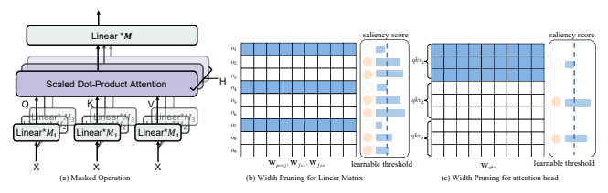
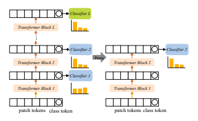
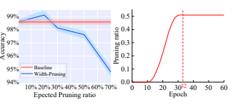
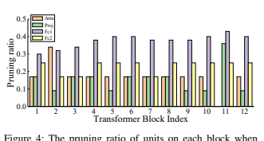
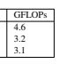
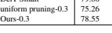
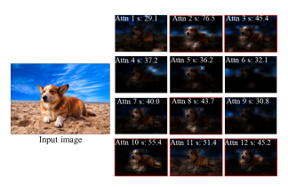

# Width & Depth Pruning For Vision Transformers Fang Yu1,2, Kun Huang3, Meng Wang3, Yuan Cheng3*, Wei Chu3**, Li Cui**1∗

1Institute of Computing Technology, Chinese Academy of Sciences 2University of Chinese Academy of Science 3Ant Financial Services Group
{yufang,lcui}@ict.ac.cn, {hunterkun.hk,darren.wm,chengyuan.c,weichu.cw}@antgroup.com

## Abstract

Transformer models have demonstrated their promising potential and achieved excellent performance on a series of computer vision tasks. However, the huge computational cost of vision transformers hinders their deployment and application to edge devices. Recent works have proposed to fnd and remove the unimportant units of vision transformers. Despite achieving remarkable results, these methods take one dimension of network width into consideration and ignore network depth, which is another important dimension for pruning vision transformers. Therefore, we propose a Width &
Depth **Pruning** (WDPruning) framework that reduces both width and depth dimensions simultaneously. Specifcally, for width pruning, a set of learnable pruning-related parameters is used to adaptively adjust the width of transformer. For depth pruning, we introduce several shallow classifers by using the intermediate information of the transformer blocks, which allows images to be classifed by shallow classifers instead of the deeper classifers. In the inference period, all of the blocks after shallow classifers can be dropped so they don't bring additional parameters and computation. Experimental results on benchmark datasets demonstrate that the proposed method can signifcantly reduce the computational costs of mainstream vision transformers such as DeiT and Swin Transformer with a minor accuracy drop. In particular, on ILSVRC-12, we achieve over 22% pruning ratio of FLOPs by compressing DeiT-Base, even with an increase of 0.14%
Top-1 accuracy.

## Introduction

The transformer architecture has been widely adopted in natural language processing (NLP) tasks and obtained superior results. Recently, Vision Transformer (ViT) (Dosovitskiy et al. 2020) and its follow-ups have demonstrated the state-of-the-art results in image classifcation (Jiang et al.

2021; Meng 2021; Hassani et al. 2021), object detection
(Carion et al. 2020; Zhu et al. 2020) and instance segmentation (Wang et al. 2021). However, the transformer variants require intensive computation resources, run-time memory and storage requirements, hindering their practical applications on the edge devices with limited storage and computation resources.

*Corresponding author Copyright © 2022, Association for the Advancement of Artifcial Intelligence (www.aaai.org). All rights reserved.

There are emerging efforts to improve the effciency of transformers. A common approach to compress transformers is known as weight pruning (Han et al. 2015). Though theoretically plausible, the weight pruning results in unstructured sparse matrices that are diffcult to support on common hardware, making it challenging to obtain inference speedups despite a signifcant reduction in model size. In contrast, another common practice for effcient transformers is to prune the structures that are of less importance, such as rows of weight matrix, token embeddings or whole selfattentions matrices. The model pruned by structured pruning is hardware-friendly and can be well supported by various off-the-shelf computing platforms.

In this context, some structured pruning methods have been proposed for transformer-like models. Designed for NLP tasks, PoWER (Goyal et al. 2020) progressively eliminates the word tokens during the forward pass and accelerates the BERT models (Devlin et al. 2018). Yao et al. proposed MLPruning (Yao et al. 2021), a multilevel pruning framework, to prune the structure of BERT-related transformer. Michel et al. proposed to prune self-attention head
(Michel, Levy, and Neubig 2019) and observe that pruning a large percentages of attention heads in BERT model has little impact on the performance. However, with the emergence of vision transformers variants such as Swin Transformers (Liu et al. 2021a) and VOLO (Yuan et al. 2021),
some novel attention mechanisms (e.g., shift-window attention, outlook attention) are proposed. The previous pruning methods are not to be performed in such variant structures.

Designed for vision transformers, VTP (Zhu et al. 2021) extends network slimming (Liu et al. 2017) to reduce the output dimension of the linear matrix by training, pruning and fne-tuning. Specifcally, the vision transformers need to be learned by imposing the structured sparsity regularization on soft mask scores. After training, VTP discards the small soft mask scores with values below a manually chosen threshold, and fne-tunes the injured models. In addition, the previous practices for pruning transformers take one dimension of network width (e.g., linear matrix) into consideration and ignore network depth (e.g., transformer block), which is another important dimension for pruning model. In practice, we found that depth pruning could achieve larger parallelism effciency than width pruning under the same pruning rate because of the less synchronization and fragmentation.

In this work, we propose a width & depth pruning framework (WDPruning) that directly learns a compact vision transformer from scratch without fne-tuning. For reducing width, we use the learnable saliency score and score threshold to prune the multi-head self-attention (MSA) and linear matrix. To meet the predefned pruning ratio, the score threshold dynamically updates the pruning ratio of different layers by Augmented Lagrangian method during training. For reducing depth, we introduce several shallow classifers by using the intermediate information of the transformer block, which allows images to be classifed by shallow classifers instead of the deeper classifers. In the inference period, all of the blocks after shallow classifers can be dropped. Our contributions are summarized:
- We propose a parameter-learnable method for width pruning via learning the saliency score and per-layer threshold, thereby obtaining a better non-uniform sparsity budget across layers.

- We propose to use additional plug-in classifers to prune the transformer blocks in the tail of the transformer. It can construct a sequential version of pruned model for dropping blocks in one training pass, which have an easy control of the trade-off between network performance and pruning rate.

- Extensive experiments demonstrate the effectiveness and effciency of our method. In particular, we improve the throughput by over 15% while the drop of accuracy is within 1% for DeiT-Base.

## Related Works

Vision transformers. The powerful multi-head selfattention mechanism (Vaswani et al. 2017) has motivated the research of studying transformers on a variety of vision tasks. Carion et al. proposed DETR (Carion et al. 2020) to solve object detection prediction by transformer model in an end-to-end manner, which is also the frst work to apply transformer to vision tasks. Vision Transformer (ViT)
(Dosovitskiy et al. 2020) applied the transformer encoder to realize image classifcation with non-overlapping image patches. DeiT (Touvron et al. 2021) is proposed to improve its performance by hard distillation. In (Jiang et al. 2021),
LV-ViT introduced the extra labels of patch tokens and further improved the performance of ViT. Liu et al. proposed a high-effcient Swin Transformer (Liu et al. 2021a) which is compatible with a broad range of vision tasks. Yuan et al. proposed Vision Outlooker (Yuan et al. 2021) which encode the fne-level features into the token representations and achieved an accuracy of 87% on ILSVRC-12. Although both ViT and its follow-ups achieved in state-of-the-art performance in classifcation, their huge computation cost and model size hinder their practical applications.

Structured pruning for transformers. In NLP tasks, some works have proposed some structured pruning methods for transformer-like models. Michel et al. focus on reducing the number of heads in Multi-head self-attention module (Michel, Levy, and Neubig 2019) and accelerate the BERT models (Devlin et al. 2018). Fan et al. proposed LayerDrop method (Fan, Grave, and Joulin 2019) to randomly drop out some layers in the training process, and predict with some missing layers. However, all these works focus on pruning transformers in NLP tasks, which is unable to directly support the visual transformers and variant structures, such as shift-window attention (Liu et al. 2021a), outlook attention (Yuan et al. 2021). Designed for vision transformers, Patch Slimming (Tang et al. 2021) is proposed to discard useless patch tokens by minimizing reconstruction error of patch token. Similarly, DynamicViT (Rao et al. 2021) also prunes the less informative tokens by training a prediction module. However, although it can reduce the computation amount of vision transformers, the extra prediction module is time-consuming for transformer inference. VTP (Zhu et al. 2021) introduces learnable coeffcients to evaluate the importance of output embedding dimensions of linear matrix in training process, and the neurons with small coeffcients are removed according to a threshold. However, VTP needs to manually try thresholds for all layers, and needs to fnetune the models after pruning. Different from the previous works, we propose to prune vision transformers from wide and depth dimensions, which is orthogonal with other pruning approaches. For example, it can be combined with patch pruning to realize higher compression and acceleration rate.

## Methodology Formulation

Our method WDPruning aims to prune the entire regions of pruning units in vision transformers (e.g., matrices in linear layers, attention heads in MSA and transformer blocks).

This process can be generalized in the form of layer-wise pruning ratios like (r1, r2*, ..., r*L) for a vision transformer A
with L blocks:

$$\begin{array}{c}{{(r_{1},r_{2},...,r_{L})^{*}=\arg\operatorname*{min}{\mathcal{L}}({\mathcal{A}}(r_{1},r_{2},...,r_{L})),}}\\ {{s.t.\ {\mathcal{P}}({\mathcal{A}}(r_{1},r_{2},...,r_{L})^{*})<{\mathcal{C}}}}\end{array}\tag{1}$$

where L is loss function and rlis a pruning ratio applied to the l-th block. rl ∈ [0, 1) means width pruning and rl = 1 means depth pruning for transformer blocks. P(·)
is an evaluation metric, where the parameters and computation cost of pruned transformer should follow predefned constraints C such as inference latency, foating-point operations (FLOPs).

## Width Pruning

To shrink the width of vision transformer, we add a binary mask variable and its saliency score for linear or attention layer, which is of the same size and shape as the layer's weight tensor. The mask determines which of the weights participate in the forward pass. In the pruning stage, we zeroize the weights with score values below learnable thresholds until a predefned compression ratio is reached. Figure 1 illustrates this process. We give quantitative analysis later in this section to demonstrate the learning process of saliency scores and thresholds.

Learnable saliency score We frst consider how to prune weight matrices in linear layer. Let us denote the weight matrix by W ∈ R
m×n and its mask by M ∈ R
m×n with m and n being the number of output and input dimension.

Here each element in M is a binary matrix {0, 1} indicating corresponding output in linear matrix is pruned or not.

Note that the input in linear matrix needs to be removed if its corresponding mask value is 0 in the previous layer (see Appendix A for details). The binary mask M can be determined by Eq. (2):

$$M_{j}={\begin{cases}\mathbf{0}&S_{j}\leq\Phi(S|m\times r)\\ \mathbf{1}&{\mathrm{otherwise}}\end{cases}}\quad\quad(2)$$

where S is the saliency score of M, and Φ(z|k) is a function, which returns the value of the k smallest entries in z.

The binary mask M means zeroing out entries in W with its saliency score smaller than Φ(S|m × r) in absolute magnitude. In next subsection, we provide a detailed explanation of how we get the layer-wise pruning ratio r according to a learnable threshold parameter.

We perform element-wise (Hadamard) product between linear matrix and mask in the forward pass. The j-th output of linear layer is as follows:

$$a_{j}=\sum_{k=1}^{m}M_{j,k}W_{j,k}x_{k}.$$

For the backward pass, since the gradient of binary step function of mask is 0 everywhere it is defned, the mask can be seemed as *straight-through estimator* where the technique proposed by (Ramanujan et al. 2020). Thus the gradient of mask ∂aj
∂Mj can be ignored in the backward pass. By the chain rule, the gradient of loss L w.r.t. saliency score Sj is calculated as follows, which indicates the learning process of saliency score in linear matrix:

or saliency score in linear matrix.  $$\frac{\partial\mathcal{L}}{\partial S_{j}}=\frac{\partial\mathcal{L}}{\partial a_{j}}\cdot\frac{\partial a_{j}}{\partial M_{j}}\cdot\frac{\partial M_{j}}{\partial S_{j}}=\frac{\partial\mathcal{L}}{\partial a_{j}}\sum_{k=1}^{m}W_{j,k}x_{j}.\tag{4}$$  We apply a similar idea to the self attention layer. The 
(4)  $\text{}$  The ... 
masked MSA is formulated as:
$$\mathrm{MSA}(\mathbf{x})=\mathbf{W}_{p r o j}\sum_{h=1}^{H}\mathbf{M}_{h}\mathrm{Attn}_{h}(\mathbf{x}),\qquad\qquad{\mathrm{(5)}}$$
where H is the head number of self attention, Attn is self attention mechanism, and W*proj* is a linear transformation matrix. The self attention consists of query Wq ∈ R
n×d, key Wk ∈ R
n×dand value Wv ∈ R
n×d, where these three matrices form a qkv matrix Wqkv ∈ R
n×3d. In particular, the computation of self attention is:

$$\mbox{Attn}_{h}(\mathbf{x})=\alpha_{h}\mbox{\bf W}_{h,v}\mathbf{x},\tag{6}$$  where $\alpha_{h}=$softmax$(\frac{\mathbf{x}^{\mbox{\bf T}}\mbox{\bf W}_{h,q}^{\mbox{\bf T}}\mbox{\bf W}_{h,k}\mathbf{x}}{\sqrt{d}})$.  
In Eq. (6), αh is the h-th attention map. A mask Mh ∈
R

1×3d needs to cover the whole attention head (qkv matrix).
By the chain rule, we obtain the gradient of self-attention
with respect to the saliency score Sh ∈ R
1:
$$\frac{\partial{\cal L}}{\partial S_{h}}=\frac{\partial{\cal L}}{\partial{\rm MSA}}\cdot\frac{\partial{\rm MSA}}{\partial M_{h}}\cdot\frac{\partial M_{h}}{\partial S_{h}}=\frac{\partial{\cal L}}{\partial{\rm MSA}}{\rm Attn}_{h}(\mathbf{x}).\tag{7}$$
Based on Eq. (4) and Eq. (7), we update the saliency
scores over dataset by AdamW optimizer with a learning
rate αs. The magnitude of saliency score illustrates the product accumulation of activation and gradient of activation
w.r.t. a pruning unit. The units that obtain larger saliency
scores learn the more important inductive bias customized to the learning task, thus being retained in the pruning process.
In Appendix B, we prove the stable convergence of pruning
by saliency score in the optimization.
Learnable threshold Learning a mask over the pruning
unit also presents problems, namely the diffculty of converting this mask into binary decisions which would require
carefully handcrafted thresholds. We thus propose a differentiable thresholding operation, making it adjustable in a supervised learning framework. Inspired by MLPruning (Yao
et al. 2021), we use sigmoid function σ to generate a pruning
ratio rl for each layer l by bounding the threshold parameter βl within (0, 1):
rl = σ(βl). (8)
To learn the layer-wise pruning ratio and control the size
of the pruned model, we utilize an Augmented Lagrangian
$$r_{l}=\sigma(\beta_{l}).$$
$$(3)$$

Figure 2: An illustration of depth pruning. The additional classifers (denoted by blue cells) are connected to the class tokens of intermediate embeddings, respectively. The plugged-in classifers are trained together with the whole transformer. After training, we choose a classifer as fnal output, and remove the all subsequent transformer blocks, which reduce the depth of transformer.

method (Bastings, Aziz, and Titov 2019) to construct a regularization on the threshold parameter. Let R be the current pruning ratio of parameters and Rt be the target pruning ratio. The Augmented Lagrangian method imposes an equality constraint R = Rt by introducing a violation penalty:

$$\mathcal{L}_{p}=\begin{cases}\lambda_{1}(R_{t}-R)+\lambda_{2}(R_{t}-R)^{2},&R_{t}>R,\\ 0,&\text{otherwise},\end{cases}\tag{9}$$  where $\lambda_{1},\lambda_{2}\in\mathbb{R}^{1}$ are two Lagrangian multipliers. The $R$
is accumulated by all pruned layer:
$$R=\sum_{l=1}^{L}\frac{r_{l}*n_{l}}{N}\tag{10}$$  where $n_{l}$ is the number of parameters in the $l$-th layer, $N$
is the total number of parameters in vision transformer. The
gradient of Lp w.r.t. βlin the l-th layer is:
It can be learned from Eq. (11) that the magnitude of gradient is larger when some layer have the larger nl, which
$$\frac{\partial{\cal L}_{p}}{\partial\beta_{l}}=\frac{n_{l}\sigma(\beta_{l})(1-\sigma(\beta_{l}))}{N}(-\lambda_{1}+2\lambda_{2}(R_{t}-R)).\tag{11}$$

## It Is More Inclined To Be Pruned. Moreover, The Gradient Of
Threshold Parameter Is Very Small In The Early Stage Because
Of The Sigmoid Function. Hence, The Scalar Coeffcient Λ1, Λ2
Needs To Be Carefully Tuned For Both Initial Values And Schedules. To Resolve This Issue, We Put Λ1, Λ2 In The Training Process, Which Are Jointly Optimized With The Network Weights
And Facilitate The Learning Process Of Score Threshold. Depth Pruning

In addition to pruning the width, WDPruning further reduces the blocks of visual transformers. In Vision Transformer
(Dosovitskiy et al. 2020), the patch tokens and class token are interacted with each other through transformer blocks.

The class tokens in the early stages of the transformer have

Algorithm 1: Width & Depth Pruning Framework
Input: Transformer W; Dataset D; Pruning ratio Rt;
Plug-in classifers C; Epoch E;
1 Initialize e = 0, λ1 = 0, λ2 = 0, score S = 0 and
threshold parameter βi = 10 for each layer i;
2 **while** e < E do
3 for each iteration ∈ *epoch e* do
_each iteration $\in epoch\ e\ \mathbf{do}$_  $\ast$ Forward pass  Obtain the threshold of each layer by $\sigma(\beta)$;  Obtain the masks via Eq. (2);  Obtain the masked weight matrices via  Eq. (3) and Eq. (5);  Count the current pruning ratio $R$;  Compute the loss function via Eq. (12);  $\ast$ Backward pass  Update $\mathbf{W}$ and plug-in classifiers $\mathbf{C}$;  Update saliency scores by Eq. (4) and Eq. (7);
11 Update threshold parameters by Eq. (11);
12 Update λ1 and λ2;
13 end
14 end
/* Width pruning */
15 Prune the attention heads and linear matrices whose
masks are 0;
/* Depth pruning */
16 Choose an optimal classifer as transformer output,
and remove all subsequent transformer blocks; the ability of accurate classifcation. Motivated by this idea, we further prune the redundant transformer blocks in the tail, as shown in Fig. 2. Concretely, we connect additional classifers to class tokens of several selected embeddings. The plugged-in classifers are trained together with the process of width pruning. Thus, the whole loss function of training objective is:

$\mathcal{L}=\mathcal{L}_{CE}+\mathcal{L}_{p}+\sum_{i=1}^{K}\mathcal{L}_{c_{i}}$, (12)
where LCE is cross-entropy loss of the last classifer, Lc is the cross-entropy loss of plugged-in classifer head and K is the total number of plug-in classifers. After training, we obtain a transformer model with multiple depth versions since each classifer has its own prediction ability to a certain degree. We select a shallow classifer to achieve an optimal trade-off between effciency and accuracy by evaluating on the validation set. In the inference period, all of the blocks after the selected classifers are dropped. This shallower pruned transformer merits in both speedup and accuracy.

A similar scheme is BranchyNet (Teerapittayanon, McDanel, and Kung 2016) which proposed an *early-exit* mechanism (Zhou et al. 2020; Xin et al. 2020) to exit the inference process in the early stage of model based on a higher entropy of output softmax than a threshold. However, the additional control logic of BranchyNet is hard to make

Idx Model width-depth Top-1 (%) Top-5 (%) FLOPs (G) #Param. (M) Throughput (im/s) CPU latency (ms) 1

DeiT-Tiny

0.0-12 (Base) 72.20 91.10 1.3 5.4 3403 332

2 0.3-12 71.10 (-1.10) 90.09 (-1.01) 0.9 (-30.8%) 3.8 (-29.6%) 3780 (+11.1%) 285 (-14.1%)

3 0.3-11 70.34 (-1.86) 89.82 (-1.28) 0.7 (-46.2%) 3.5 (-35.2%) 4082 (+20.0%) 265 (-20.2%)

4

DeiT-Small

0.0-12 (Base) 79.80 95.00 4.6 21.3 1547 410

5 0.3-12 78.55 (-1.25) 94.37 (-0.63) 3.1 (-32.6%) 15.0 (-29.6%) 1712 (+10.7%) 364 (-11.2%) 6 0.3-11 78.38 (-1.42) 94.05 (-0.95) 2.6 (-43.5%) 13.3 (-37.6%) 1830 (+18.3%) 338 (-17.5%)

7

0.0-12 (Base) 81.80 95.59 17.5 85.1 598 783

| 1   | DeiT-Tiny   |
|-----|-------------|
| 4   | DeiT-Small  |
| 7   | DeiT-Base   |

8 0.2-12 81.94 (+0.14) 95.62 (+0.03) 13.6 (-22.3%) 68.2 (-19.9%) 655 (+9.5%) 692 (-11.6%) 9 0.2-10 80.85 (-0.95) 95.39 (-0.20) 10.8 (-38.3%) 59.4 (-30.2%) 696 (+16.4%) 639 (-18.4%) 10 0.3-12 81.09 (-0.71) 95.54 (-0.05) 11.0 (-37.1%) 60.6 (-28.8%) 669 (+11.9%) 648 (-17.2%) 11 0.3-11 80.76 (-1.04) 95.36 (-0.23) 9.90 (-43.4%) 55.3 (-35.0%) 707 (+18.2%) 590 (-24.6%)

12 0.0-24 (Base) 83.00 96.50 8.7 47.3 609 847

13 Swin Trans- 0.1-24 82.41 (-0.59) 96.21 (-0.29) 7.6 (-12.6%) 42.7 (-9.7%) 640 (+5.1%) 809 (-4.5%) 14 Small 0.2-24 82.20 (-0.80) 96.12 (-0.38) 6.8 (-21.8%) 37.4 (-20.9%) 667 (+9.5%) 776 (-8.4%)

15 0.2-22 81.80 (-1.20) 96.01 (-0.49) 6.3 (-27.6%) 32.8 (-30.6%) 702 (+15.3%) 763 (-9.9%)

the just-in-time deployment, e.g. TensorRT1. In contrast, our depth pruning can obtain an end-to-end pruned model, which is easy to be converted to ONNX2format for edge deployment.

## Computational Complexity Analysis

In our method, additional parameters and computation in training process mainly comes from element-wise product between weights and masks, as well as the pruning-related parameters (i.e., saliency scores, thresholds and plug-in classifers), which are updated by AdamW optimizer. The additional time consumption of WDPruning is acceptable. The detailed procedure is presented in Algorithm 1.

## Experiment

In this section, we empirically investigate the effectiveness of the proposed WDPruning on benchmark datasets:
CIFAR-10 and ILSVRC-12 (Russakovsky et al. 2015). To understand our method, extensive ablation studies are conducted on these datasets.

## Datasets

CIFAR-10 contains 50k training images and 10k validating images, which are categorized into 10 classes for image classifcation. Compared with CIFAR-10, ILSVRC-12 is a larger scale image classifcation dataset, which comprises 1.28 million images from 1k categories for training and 50k images for validation.

## Implementation Details

We conduct experiments on the standard ViT models (Dosovitskiy et al. 2020) (DeiT (Touvron et al. 2021)), and an improved variant Swin Transformer (Liu et al. 2021a). We mainly prune the DeiT-Tiny, DeiT-Small and DeiT-Base 1https://developer.nvidia.com/tensorrt 2https://onnx.ai which have 12 blocks, as well as Swin Transformer-Small with 24 blocks. For pruning shift-window attention in Swin Transformer, due to the deletion of attention leading to the problem of dimension mismatch, we maintain the dimension alignment by padding zero. For all experiments, we use the pre-trained vision transformer models to initialize the backbone models. In the pruning procedure, the DeiT models are trained for 100 epochs and Swin Transformers are trained for 60 epochs. The initial learning rate is 0.0005. We use AdamW optimizer with a momentum of 0.9 for optimization. We set the weight decay to 0.05. In the experiments, we keep the same data augmentation strategy as DeiT and Swin Transformer, including Random Augment
(Cubuk et al. 2020), Mixup (Zhang et al. 2017), and CutMix (Yun et al. 2019). For the pruning setting, the initial value of saliency score and threshold parameter are 0 and 10, respectively. The learning rates of saliency scores and threshold parameters are set by 0.025 initially, and they are fnetuned with AdamW with cosine learning rate decay strategy.

The initialization of λ1 and λ2 is 0, which are also added in AdamW optimizer to train. As for the block pruning setting, we insert two additional classifers in the 10-th and 11-th transformer blocks for DeiT, and insert two additional classifers in 22-th and 23-th blocks for Swin Transformers.

## Main Results

In Table 1, we summarize the main results on ILSVRC12 where we adjust the pruning ratio Rt for width pruning and block selection for depth pruning. We report the top1/5 accuracy, the number of FLOPs and parameters, GPU
throughout and the latency on CPU. The GPU throughout is obtained by measuring the forward time on a NVIDIA RTX 3090 GPU with a batchsize of 1024, and the latency on CPU is measured on AMD EPYC 7502 32-Core CPU with a batchsize of 1. We observe that WDPruning exhibits favorable complexity/accuracy trade-offs at different complexity levels, where our method can reduce the computational costs by 10%-43% and accelerate the inference at runtime by 5%-

Model Top-1 Accu.(%) Top-1 ↓(%) Top-5 Accu. (%) Top-5 ↓(%) GFLOPs GFLOPs↓(%)

DeiT-Tiny 72.20 0 91.10 0 1.3 0

SCOP (Tang et al. 2020) 68.90 3.30 89.00 2.10 0.8 38.5

PoWER∗ (Goyal et al. 2020) 69.40 2.80 89.20 1.90 0.8 38.5

HVT (Pan et al. 2021) 69.70 2.50 89.40 1.70 0.7 46.2

WDPruning-0.3-11 70.34 1.86 89.82 1.28 0.7 **46.2**

DeiT-Small 79.80 0 95.00 0 4.6 0

SCOP (Tang et al. 2020) 77.50 2.30 93.50 1.50 2.6 43.5

PoWER∗ (Goyal et al. 2020) 78.30 1.50 94.00 1.00 2.7 41.3

HVT (Pan et al. 2021) 78.00 1.80 93.83 1.17 2.4 **47.8** WDPruning-0.3-11 78.38 1.42 94.05 **0.95** 2.6 43.5 DeiT-Base 81.80 0 95.59 0 17.5 0 SCOP (Tang et al. 2020) 79.70 2.10 94.50 1.09 10.2 41.7

PoWER∗(Goyal et al. 2020) 80.10 1.70 94.60 0.99 10.4 40.6

VTP (Zhu et al. 2021) 80.70 1.10 95.00 0.59 10.0 42.9

WDPruning-0.3-11 80.76 1.04 95.36 0.23 9.9 **43.4**

Table 2: Comparison with the state-of-the-art methods on ILSVRC-12. We compare our method with these methods with Top1/5 accuracy and FLOPs. "↓" represents the reduction rate. "∗" denotes that the results come from (Pan et al. 2021).

0 10 20 30 40 50 60 Epoch 32 
Figure 3: Left: Accuracy for DeiT-Small on CIFAR-10 regarding pruning ratio. Solid line and shadow denote the mean value and standard deviation, respectively. Right: The pruning ratio varying epoch when Rt = 0.5.

25% with the neglectable infuence on accuracy. Compared to the base model DeiT-Base, the Top-1 accuracy of our method (idx=8) even increases by 0.14% when leading to a reduction of 19.9% in the number of parameters, and the inference speed on CPU is accelerated by 11.6%. When 2 extra blocks are removed (idx=9) based on DeiT-Base with width pruning (idx=8), the Top-1 accuracy only drops by 0.95%. It is worth noting that after pruning with different ratio of width and depth, we obtain two models with the similar FLOPs (idx=9, idx=10). Although the DeiT with depth pruning (idx=9) has a greater accuracy drop, it gains more GPU throughput. It indicates that depth pruning is more conducive to parallel acceleration and demonstrates the limitation of single-dimension width pruning. Compared to the base model Swin Transformer-Small (idx=12), the pruned counterpart (idx=15) achieves a 30.6% decrease in the number of parameters and a 15.3% increase in GPU throughput with only an accuracy drop of 1.2%.

## Comparison With Other Methods

We compare our method with state-of-the-art pruning methods on ILSVRC-12. The following state-of-the-art methods are compared: SCOP (Tang et al. 2020), PoWER (Goyal

et al. 2020), HVT (Pan et al. 2021) and VTP (Zhu et al.

2021). SCOP is a channel pruning method and (Tang et al.

2021) re-implemented it to reduce the patches in vision transformers. (Pan et al. 2021) re-implemented PoWER to progressively eliminate patch tokens during the forward pass. HVT progressively pooled the visual tokens to shrink the sequence length and reduced the computational cost of DeiT. VTP trained the DeiT for 100 epochs by imposing ℓ1 regularization on soft masks, pruned the soft masks whose values are under a threshold, and fnetuned for 100 epochs.

The experimental results are shown in Table 2. The proposed WDPruning is competitive with the state-of-the-art methods. Concretely, for pruning DeiT-Tiny, compared with HVT, WDPruning achieves higher Top-1 accuracy (70.34%
vs. 69.70%) and Top-5 accuracy (89.82% vs. 89.40%) with the same reduction in FLOPs of 46.2%. The results on ILSVRC-12 demonstrate WDPruning can produce more compact vision transformer with better performance compared to other single-dimension pruning methods.

## Ablation Study And Discussion

Effect of the predefned pruning ratio. The predefned pruning ratio controls the targeted amount of pruned parameters in the width pruning process. To investigate its effect, we train DeiT-Small on the CIFAR-10 with a range of prun-

Method Top-1(%) Top-5(%) GFLOPs

 DeiT-Small 79.80 95.00 4.6

uniform pruning-0.3 75.26 92.33 3.2

Ours-0.3 78.55 94.37 3.1

Table 3: Learnable pruning ratio vs. uniform pruning.

ing ratio varying from 0% to 70%. As shown on the left of Fig. 3, we report the accuracy under different pruning ratio. When the pruning ratio is less than 20%, we observe that the compressed transformers perform better than the uncompressed one, which can be considered as the regularization effect introduced. As we expect, increasing pruning ratio results in higher degree of transformer compression with more impact on overall accuracy as well. On the right of Fig. 3, we report the change in pruning ratio varying epochs when the predefned pruning ratio is 0.5. The pruning ratio of model was dynamically allocated and increased with epoch. The overall pruning procedure is fnished since epoch 32.

Learnable pruning ratio vs. uniform pruning. We further compare the performance of learnable pruning ratio with the uniform pruning. We prune the DeiT-Small on ILSVRC-12 by learnable pruning ratio and uniform pruning, respectively. We set the pruning ratio to 0.3 (Rt = 0.7),
and the other experimental settings are the same. From the Table. 3, we learn that the accuracy of uniform pruning is only 75.26%, which incurs a large accuracy drop (4.54%).

In Fig. 4, we visualize the pruning ratio for each block of DeiT-Small after the pruning procedure. We learn that our method allocates the pruning ratio to each layer accordingly and adaptively learns the compact structure of each block in the transformer, which is benefcial to learn a structured pruning network with good performance.

Effect of depth pruning. To study the effect of transformer block pruning, we train DeiT-Small with 5 plug-in learnable classifers that are inserted in transformer blocks of {2,4,6,8,10}. In this experiment, WDPruning does not prune the width of vision transformer and we focus on the effect of depth pruning. The results are shown in Table 4, and we learn from that the DeiT-Small can be losslessly pruned away 4 transformer blocks where the accuracy is retained above 98%. This experiment demonstrates we can obtain multiple models with different depth versions in one training by depth pruning. Visualization. We use Attention Rollout (Abnar and Zuidema 2020) to project the attention maps from the output token to the input image, and visualize the 6-th block of multi-head self-attention of DeiT-Small. As shown in

| Model      | Layers   | Accu.(%)   | GFLOPs   | Param.(M)   |
|------------|----------|------------|----------|-------------|
| 12         | 98.50    | 4.24       | 21.95    |             |
| 10         | 98.35    | 3.54       | 18.40    |             |
| 8          | 98.11    | 2.84       | 14.86    |             |
| 6          | 96.55    | 2.15       | 11.30    |             |
| 4          | 92.81    | 1.45       | 7.77     |             |
| 2          | 74.08    | 0.75       | 4.22     |             |
| DeiT-Small |          |            |          |             |

## Dataset Method Map #Param. Throughput

  \begin{tabular}{c|c|c|c|c} \hline \multicolumn{2}{c}{**M**} & \multicolumn{2}{c}{**M**} & \multicolumn{2}{c}{**M**} & \multicolumn{2}{c}{**M**} \\ \hline \multicolumn{2}{c}{**TransReID**} & 88.5% & 85.1M & 459im/s \\ \hline \multicolumn{2}{c}{**Our**} & 87.7% & 59.6M & **-** & 572im/s \\ \hline \end{tabular}  
Table 5: Results of pruning TransReID on Market-1501.

Fig. 5 the attention maps with red bounding boxes are remained after the pruning procedure, and we record their ultimate saliency scores. From the fgure, these pruned attention maps mainly focus more on the patch of background, and contribute less to the classifcation object. In contrast, the attention maps that are retained obtain higher saliency scores and contribute more to the foreground object.

Its application to image retrieval tasks. As described above, our method is effective in image classifcation. To further analyze the generalization of our method, we use DeiT-Base as a backbone network to deploy TransReID (He et al. 2021) for image retrieval task, and then compress DeiTBase by reducing 30% parameters of the backbone network.

In the experimental implementation, we evaluate the performance with mean Average Precision (mAP) on Market-1501
(Zheng et al. 2015) dataset. As shown in Table 5, our pruned transformer shows a good result. The mAP of our method is slightly lower than the baseline, but the throughput is 572 images per second, which is higher than the baseline. This demonstrates that our method has good generalization on other vision tasks.

## Conclusion

In this work, we present a structured pruning framework to reduce the width and depth of vision transformers. In our experiments, we demonstrate very promising pruning results on image classifcation and image retrieval tasks. We can adaptively adjust the depth and width of vision transformers based on budgets at hand and diffculties of each task. We believe these pruning results can further inspire the design of more compact vision transformers. In the future, we plan to extend the proposed methods from image domain to video transformers, e.g. Video Swin Transformer (Liu et al.

2021b), Video Transformer Network (Neimark et al. 2021).

## Acknowledgements

We sincerely thank the anonymous reviewers for valuable comments and suggestions. The paper is supported by the National Natural Science Foundation of China (NSFC) under Grant No. 61672498.

## References

Abnar, S.; and Zuidema, W. 2020. Quantifying attention fow in transformers. *arXiv preprint arXiv:2005.00928*.

Bastings, J.; Aziz, W.; and Titov, I. 2019. Interpretable neural predictions with differentiable binary variables. *arXiv* preprint arXiv:1905.08160.

Carion, N.; Massa, F.; Synnaeve, G.; Usunier, N.; Kirillov, A.; and Zagoruyko, S. 2020. End-to-end object detection with transformers. In European Conference on Computer Vision, 213–229. Springer.

Cubuk, E. D.; Zoph, B.; Shlens, J.; and Le, Q. V. 2020. Randaugment: Practical automated data augmentation with a reduced search space. In *Proceedings of the IEEE/CVF Conference on Computer Vision and Pattern Recognition Workshops*, 702–703.

Devlin, J.; Chang, M.-W.; Lee, K.; and Toutanova, K. 2018.

Bert: Pre-training of deep bidirectional transformers for language understanding. *arXiv preprint arXiv:1810.04805*.

Dosovitskiy, A.; Beyer, L.; Kolesnikov, A.; Weissenborn, D.; Zhai, X.; Unterthiner, T.; Dehghani, M.; Minderer, M.;
Heigold, G.; Gelly, S.; et al. 2020. An image is worth 16x16 words: Transformers for image recognition at scale. *arXiv* preprint arXiv:2010.11929.

Fan, A.; Grave, E.; and Joulin, A. 2019. Reducing transformer depth on demand with structured dropout. arXiv preprint arXiv:1909.11556.

Goyal, S.; Choudhury, A. R.; Raje, S.; Chakaravarthy, V.;
Sabharwal, Y.; and Verma, A. 2020. Power-bert: Accelerating bert inference via progressive word-vector elimination.

In *International Conference on Machine Learning*, 3690–
3699. PMLR. Han, S.; Pool, J.; Tran, J.; and Dally, W. 2015. Learning both weights and connections for effcient neural network. In Advances in Neural Information Processing Systems, 1135–
1143.

Hassani, A.; Walton, S.; Shah, N.; Abuduweili, A.; Li, J.;
and Shi, H. 2021. Escaping the big data paradigm with compact transformers. *arXiv preprint arXiv:2104.05704*.

He, S.; Luo, H.; Wang, P.; Wang, F.; Li, H.; and Jiang, W.

2021. Transreid: Transformer-based object re-identifcation.

arXiv preprint arXiv:2102.04378.

Jiang, Z.; Hou, Q.; Yuan, L.; Zhou, D.; Jin, X.; Wang, A.;
and Feng, J. 2021. Token labeling: Training a 85.5% top-1 accuracy vision transformer with 56m parameters on imagenet. *arXiv preprint arXiv:2104.10858*.

Liu, Z.; Li, J.; Shen, Z.; Huang, G.; Yan, S.; and Zhang, C.

2017. Learning Effcient Convolutional Networks Through Network Slimming. In *Proceedings of International Conference on Computer Vision*, 2736–2744.

Liu, Z.; Lin, Y.; Cao, Y.; Hu, H.; Wei, Y.; Zhang, Z.; Lin, S.; and Guo, B. 2021a. Swin transformer: Hierarchical vision transformer using shifted windows. arXiv preprint arXiv:2103.14030.

Liu, Z.; Ning, J.; Cao, Y.; Wei, Y.; Zhang, Z.; Lin, S.; and Hu, H. 2021b. Video swin transformer. *arXiv preprint* arXiv:2106.13230.

Meng, L. 2021. Armour: Generalizable Compact SelfAttention for Vision Transformers. *arXiv preprint* arXiv:2108.01778.

Michel, P.; Levy, O.; and Neubig, G. 2019. Are sixteen heads really better than one? *arXiv preprint arXiv:1905.10650*.

Neimark, D.; Bar, O.; Zohar, M.; and Asselmann, D.

2021. Video transformer network. *arXiv preprint* arXiv:2102.00719.

Pan, Z.; Zhuang, B.; Liu, J.; He, H.; and Cai, J. 2021. Scalable visual transformers with hierarchical pooling. *arXiv* preprint arXiv:2103.10619.

Ramanujan, V.; Wortsman, M.; Kembhavi, A.; Farhadi, A.; and Rastegari, M. 2020. What's Hidden in a Randomly Weighted Neural Network? In Proceedings of the IEEE/CVF Conference on Computer Vision and Pattern Recognition, 11893–11902.

Rao, Y.; Zhao, W.; Liu, B.; Lu, J.; Zhou, J.; and Hsieh, C.-J. 2021. DynamicViT: Effcient Vision Transformers with Dynamic Token Sparsifcation. arXiv preprint arXiv:2106.02034.

Russakovsky, O.; Deng, J.; Su, H.; Krause, J.; Satheesh, S.; Ma, S.; Huang, Z.; Karpathy, A.; Khosla, A.; Bernstein, M.;
et al. 2015. Imagenet large scale visual recognition challenge. *International Journal of Computer Vision*, 115(3):
211–252.

Tang, Y.; Han, K.; Wang, Y.; Xu, C.; Guo, J.; Xu, C.; and Tao, D. 2021. Patch Slimming for Effcient Vision Transformers. *arXiv preprint arXiv:2106.02852*.

Tang, Y.; Wang, Y.; Xu, Y.; Tao, D.; Xu, C.; Xu, C.; and Xu, C. 2020. Scop: Scientifc control for reliable neural network pruning. *arXiv preprint arXiv:2010.10732*.

Teerapittayanon, S.; McDanel, B.; and Kung, H.-T. 2016.

Branchynet: Fast inference via early exiting from deep neural networks. In *2016 23rd International Conference on Pattern Recognition (ICPR)*, 2464–2469. IEEE.

Touvron, H.; Cord, M.; Douze, M.; Massa, F.; Sablayrolles, A.; and Jegou, H. 2021. Training data-effcient image trans- ´
formers & distillation through attention. In *International* Conference on Machine Learning, 10347–10357. PMLR.

Vaswani, A.; Shazeer, N.; Parmar, N.; Uszkoreit, J.; Jones, L.; Gomez, A. N.; Kaiser, Ł.; and Polosukhin, I. 2017. Attention is all you need. In Advances in neural information processing systems, 5998–6008.

Wang, Y.; Xu, Z.; Wang, X.; Shen, C.; Cheng, B.; Shen, H.;
and Xia, H. 2021. End-to-end video instance segmentation with transformers. In *Proceedings of the IEEE/CVF Conference on Computer Vision and Pattern Recognition*, 8741–
8750.

Xin, J.; Tang, R.; Lee, J.; Yu, Y.; and Lin, J. 2020. DeeBERT:
Dynamic Early Exiting for Accelerating BERT Inference. In Proceedings of the 58th Annual Meeting of the Association for Computational Linguistics, 2246–2251.

Yao, Z.; Ma, L.; Shen, S.; Keutzer, K.; and Mahoney, M. W. 2021. MLPruning: A Multilevel Structured Pruning Framework for Transformer-based Models. arXiv preprint arXiv:2105.14636.

Yuan, L.; Hou, Q.; Jiang, Z.; Feng, J.; and Yan, S. 2021.

Volo: Vision outlooker for visual recognition. arXiv preprint arXiv:2106.13112.

Yun, S.; Han, D.; Oh, S. J.; Chun, S.; Choe, J.; and Yoo, Y. 2019. Cutmix: Regularization strategy to train strong classifers with localizable features. In *Proceedings of the* IEEE/CVF International Conference on Computer Vision, 6023–6032.

Zhang, H.; Cisse, M.; Dauphin, Y. N.; and Lopez-Paz, D.

2017. mixup: Beyond empirical risk minimization. *arXiv* preprint arXiv:1710.09412.

Zheng, L.; Shen, L.; Tian, L.; Wang, S.; Wang, J.; and Tian, Q. 2015. Scalable person re-identifcation: A benchmark. In Proceedings of the IEEE international conference on computer vision, 1116–1124.

Zhou, W.; Xu, C.; Ge, T.; McAuley, J.; Xu, K.; and Wei, F. 2020. BERT Loses Patience: Fast and Robust Inference with Early Exit. Advances in Neural Information Processing Systems, 33.

Zhu, M.; Han, K.; Tang, Y.; and Wang, Y. 2021. Vision Transformer Pruning. *KDD 2021 workshop*.

Zhu, X.; Su, W.; Lu, L.; Li, B.; Wang, X.; and Dai, J. 2020. Deformable detr: Deformable transformers for end-to-end object detection. *arXiv preprint arXiv:2010.04159*.