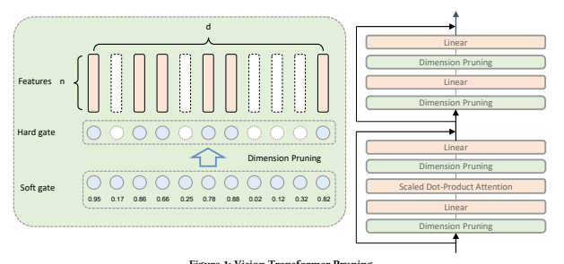

# Vision Transformer Pruning

Mingjian Zhu Zhejiang University Westlake University zhumingjian@zju.edu.cn Yehui Tang Peking University yhtang@pku.edu.cn Kai Han Noah's Ark Lab, Huawei Technologies kai.han@huawei.com

## Abstract

Vision transformer has achieved competitive performance on a variety of computer vision applications. However, their storage, run-time memory, and computational demands are hindering the deployment to mobile devices. Here we present a vision transformer pruning approach, which identifies the impacts of dimensions in each layer of transformer and then executes pruning accordingly. By encouraging dimension-wise sparsity in the transformer, important dimensions automatically emerge. A great number of dimensions with small importance scores can be discarded to achieve a high pruning ratio without significantly compromising accuracy. The pipeline for vision transformer pruning is as follows: 1) training with sparsity regularization; 2) pruning dimensions of linear projections; 3) fine-tuning. The reduced parameters and FLOPs ratios of the proposed algorithm are well evaluated and analyzed on ImageNet dataset to demonstrate the effectiveness of our proposed method.

## Keywords

Vision Transformer, Transformer Pruning, Network Pruning

## 1 Introduction

Recently, transformer [38] has attracted much attention and shed light on various computer vision applications [4, 5, 12, 24] such as image classification [8, 13, 37], object detection [2, 3, 50], and image segmentation [16, 39, 41]. However, most of the proposed transformer variants highly demand storage, run-time memory, and computational resource requirements, which impede their wide deployment on edge devices, e.g., robotics and mobile phones. Although massive effective techniques have been developed for compressing and accelerating convolutional neural networks (CNNs)
including low-rank decomposition [7, 20, 22, 33, 44], quantization [1, 11, 28, 28, 43], network pruning [14, 19, 34, 35, 42], and knowledge distillation [15, 21, 26, 29, 36], there still exists an urgency to develop and deploy efficient vision transformer.

Taking advantage of different designs [17, 31, 46, 47, 49], transformer can be compressed and accelerated to varying degrees. ALBERT [18] reduces network parameter and speed up training time by decomposing embedding parameters into smaller matrices and enabling cross-layer parameter sharing. Star-Transformer [10] sparsifies the standard transformer by moving fully-connected structure to the star-shaped topology. Based on knowledge distillation techniques, the student networks in [17, 32] learn from the logits in the larger pre-trained teacher networks. Some effective pruning algorithms have been proposed to reduce the attention heads [27]
or individual weights [9]. The previous methods focus on compressing and accelerating the transformer for the natural language processing tasks. With the emergence of vision transformers such as ViT [8], PVT [40], and TNT [13], an efficient transformer is urgently need for computer vision applications.

To address the aforementioned problems, we propose to prune the vision transformer according to the learnable importance scores.

Inspired by the pruning scheme in network slimming [23], we add the learning importance scores before the components to be prune and sparsify them by training the network with L1 regulation.

The dimensions with smaller importance scores will be pruned and the compact network can be obtained. Experimental results on the benchmark demonstrate the effectiveness of the proposed algorithm. Our vision transformer pruning (VTP) method largely compresses and accelerates the original ViT (DeiT) models. As the first pruning method for vision transformers, this work will provide a solid baseline and experience for future research.

## 2 Approach

2.1 Transformer The typical vision transformer architecture [8, 38] consists of MultiHead Self-Attention (MHSA), Multi-Layer Perceptron (MLP), layer normalization, activation function, and shortcut connection. MHSA
is the characteristic component of transformer to perform information interaction among tokens. In particular, the input  ∈ R
×is transformed to query ∈ R
×, key  ∈ R
×and value ∈ R
×
via fully-connected layers, where  is the number of patches.  is the embedding dimension. The self-attention mechanism is utilized to model the relationship between patches:

$$a x\left[Q K^{1}/\sqrt{d}\right]V.$$

Attention(, , ) = *Softmax* T/
√

 . (1)
Finally, a linear transformation is applied to generate the output of MHSA:
 =  + FC (*Attention*(FC (), FC

(), FC ())), (2)
where the layer normalization and activation function are omitted for simplification. As for the two-layer MLP, it can be formulated as
 =  + FC2(FC1()). (3)
Intuitively, the widely-used fully-connected layers in the transformer lead to computation and storage burden.

## 2.2 Vision Transformer Pruning

To slim the transformer architecture, we focus on decreasing the FLOPs of MHSA and MLP. We propose to prune the dimension of the linear projection by learning their associated importance scores. For the features  ∈ R
×, where  denotes the number of features that need to be pruned and  denotes the dimension of each feature, we aim to preserve the generated important features and remove the useless ones from the corresponding components of linear projection. Suppose the optimal importance scores are

Figure 1: Vision Transformer Pruning.
a
∗ ∈ {0, 1}

, that is, the scores for generated important features and their corresponding components are ones while the scores for useless ones are zeros. With the importance scores, we can obtain the pruned features:

∗ =  diag(a
∗). (4)
However, it's hard to optimize a
∗in the neural network through a back-propagation algorithm due to its discrete values. Thus, we propose to relax a
∗to real values as ^a ∈ R

. The soft pruned features are obtained as
^ =  diag(^a) (5)
Then, the relaxed importance scores ^a can be learned together with the transformer network end-to-end. In order to enforce sparsity of importance scores, we apply ℓ1 regularization on the importance scores: ∥^a∥1 and optimize it by adding on the training objective, where  is the sparsity hyper-parameter. After training with sparsity penalty, we obtain the transformer with some importance scores near zero. We rank all the values of regularized importance scores in the transformer and obtain a threshold  according to a pre-defined pruning rate. With the threshold , we obtain the discrete a
∗ by setting the values below the threshold as zero and higher values as ones:
a
∗ = ^a ≥ . (6)
After pruning according to the importance scores a
∗, the total pruned transformer is fine-tuned to diminish the accuracy drop.

The above pruning procedure is denoted as

∗ = *Prune*(). (7)
As shown in Figure 1, we apply the pruning operation on all the MHSA and MLP blocks. The pruning process for them can be formulated as
, , = FC′

(*Prune*()), FC′

(*Prune*()), FC′

(*Prune*()), (8)

$Y=X+FC_{out}^{\prime}(\textit{Prune}(\textit{Attention}(Q,K,V)))$,  $Z=Y+FC_{2}^{\prime}(\textit{Prune}(FC_{1}^{\prime}(\textit{Prune}(Y))))$.  
$\mathbf{a}\subset\mathbf{q}^{\vee}$
$\mathbf{u}=k^{\left(1+\frac{1}{2}\right)}$
$\mathbf{a}=\mathbf{r}$. 
Huawei Confidential 4 where FC′

, FC′

, FC′

, FC′, FC′1
, and FC′2 are pruned linear projection corresponding to the pruned features and a
∗. The proposed vision transformer pruning (VTP) method provides a simple yet effective way to slim vision transformer models. We hope that this work will serve as a solid baseline for future research and provide useful experience for the practical deployment of vision transformers.

## 3 Experiments

In this section, we verify the effectiveness of the proposed VTP
methods to prune vision transformer models on ImageNet dataset.

## 3.1 Datasets

ImageNet-1K.. ImageNet ILSVRC2012 dataset [30] is a large-scale image classification dataset including 1.2 million images for training and 50,000 validation images belonging to 1,000 classes. The common data augmentation strategy in DeiT [37] is adopted for model development, including Rand-Augment [6], Mixup [48], and CutMix [45].

ImageNet-100. ImageNet-100 is collected as a subset of ImageNet1K. We first randomly sampled 100 classes and their corresponding images for training and validation. We adopt the same data augmentation strategy for ImageNet-100 as ImageNet-1K.

* [16] A. A. K.  

## 3.2 Implementation Details

Baseline. We evaluate our pruning method on a popular vision transformer implementation, i.e., DeiT-base [37]. In our experiments, a 12-layer transformer with 12 heads and 768 embedding dimensions is evaluated on both ImageNet-1K and Imagenet-100.

For a fair comparison, we utilize the official implementation of DeiT
and do not use techniques like distillation. On the ImageNet-1K, we take the released model of DeiT-base as the baseline. We finetune the model on the ImageNet-1K using batch size 64 for 30 epochs.

The initial learning rate is set to 6.25 × 10−7. Following Deit [37],
Vision Transformer Pruning

| Sparse Penalty   | Pruning Rate   | Params (M)   | Params Reduced   | FLOPs (B)   | FLOPs Reduced   | Top1 (%)   |
|------------------|----------------|--------------|------------------|-------------|-----------------|------------|
| 0.6              | 29.0           | ↓66.4%       | 6.4              | ↓63.5%      | 90.00           |            |
| 0.5              | 38.0           | ↓56.0%       | 8.2              | ↓53.4%      | 91.46           |            |
| 0.0001           | 0.4            | 47.3         | ↓45.3%           | 10.0        | ↓43.0%          | 92.58      |
| 0.2              | 66.1           | ↓23.5%       | 13.7             | ↓22.0%      | 93.54           |            |
| 0.6              | 28.2           | ↓67.4%       | 6.3              | ↓64.4%      | 89.88           |            |
| 0.5              | 37.5           | ↓56.6%       | 8.1              | ↓54.0%      | 91.40           |            |
| 0.00001          | 0.4            | 47.1         | ↓45.5%           | 10.0        | ↓43.2%          | 92.38      |
| 0.2              | 66.1           | ↓23.5%       | 13.7             | ↓22.0%      | 93.44           |            |

Table 2: Results on ImageNet-100.

Model Params (M) FLOPs (B) Top1 (%) Top5 (%)

Deit-B (Baseline) 86.4 17.6 94.50 98.94 VTP (20% pruned) 66.1 13.7 93.54 98.36 VTP (40% pruned) 47.3 10.0 92.58 98.04 Model Params (M) FLOPs (B) Top1 (%) Top5 (%) CNN based ResNet-152 60.2 11.5 78.3 94.1 RegNetY-16GF 83.6 15.9 80.4 - Transformer based

ViT-B/16 86.4 55.5 77.9 -

DeiT-B (Baseline) 86.4 17.6 81.8 - VTP (20% pruned) 67.3 13.8 81.3 95.3

VTP (40% pruned) 48.0 10.0 80.7 95.0

Table 3: Results on ImageNet-1K.

we use AdamW [25] with cosine learning rate decay strategy to train and finetune the models.

Training with Sparsity Regularization and Pruning. Based on the baseline model, we train the vision transformer with ℓ1 regularization using different sparse regularization rates. We select the optimal sparse regularization rate (i.e. 0.0001) on Imagenet-100 and apply it on ImageNet-1K. The learning rate for training with sparsity is 6.25 × 10−6and the number of epochs is 100. The other training setting follows the baseline model. After sparsity, we prune the transformer by setting different pruning thresholds and the threshold is computed by the predefined pruning rate, e.g., 0.2.

Finetuning. We finetune the pruned transformer with the same optimization setting as in training, except for removing the ℓ1 regularization.

## 3.3 Results And Analysis

Imagenet-100 Experiments and Ablation Study. We firstly conduct ablation studies on Imagenet-100, as shown in Table 1. From the results, the amount of pruning rate matches the ratio of parameters saving and FLOPs saving. For example, when we prune 40% dimensions of the models trained with 0.0001 sparse rate, the parameter saving is 45.3% and the FLOPs saving is 43.0%. We can see that the Parameters and FLOPs drop while the accuracy maintains. Besides, the sparse ratio does not highly influence the effectiveness of the pruning method. In Table 2, we compare the baseline model with two VTP models, i.e., 20% pruned and 40% pruned models. The accuracy drops slightly with large FLOPs decrease. When we prune 20% dimensions, 22.0% FLOPs are saved and the accuracy drops by 0.96%. When we prune 40% dimensions, 45.3% FLOPs are saved and the accuracy drops by 1.92%.

Imagenet-1K Experiments. We also evaluate the proposed VTP
method on the large-scale ImageNet-1K benchmark. The results are shown in Table 3. Compared to the base model DeiT-B, the accuracy of VTP only decreases by 1.1% when 40% dimensions are pruned.

The accuracy only drops by 0.5% while 20% dimensions are pruned. The effectiveness of VTP can be generalized to large-scale datasets.

4 CONCLUSION
In this paper, we introduce a simple yet efficient vision transformer pruning method. L1 regulation is applied to sparse the dimensions of the transformer and the important dimensions appear automatically. The experiments conducted on Imagenet-100 and ImageNet-1K demonstrate that the pruning method can largely reduce the computation costs and model parameters while maintaining the high accuracy of original vision transformers. In the future, the important components such as the number of heads and the number of layers can also be reduced with this method, which is a promising attempt to further compress vision transformers.

## References

[1] Zhaowei Cai, Xiaodong He, Jian Sun, and Nuno Vasconcelos. 2017. Deep learning with low precision by half-wave gaussian quantization. In *Proceedings of the IEEE*
conference on computer vision and pattern recognition. 5918–5926.

[2] Nicolas Carion, Francisco Massa, Gabriel Synnaeve, Nicolas Usunier, Alexander Kirillov, and Sergey Zagoruyko. 2020. End-to-End Object Detection with Transformers. *arXiv preprint arXiv:2005.12872* (2020).

[3] Nicolas Carion, Francisco Massa, Gabriel Synnaeve, Nicolas Usunier, Alexander Kirillov, and Sergey Zagoruyko. 2020. End-to-End Object Detection with Transformers. In *ECCV*.

[4] Hanting Chen, Yunhe Wang, Tianyu Guo, Chang Xu, Yiping Deng, Zhenhua Liu, Siwei Ma, Chunjing Xu, Chao Xu, and Wen Gao. 2021. Pre-trained image processing transformer. In *CVPR*.

[5] Mark Chen, Alec Radford, Rewon Child, Jeffrey Wu, Heewoo Jun, David Luan, and Ilya Sutskever. 2020. Generative pretraining from pixels. In International Conference on Machine Learning. PMLR, 1691–1703.

[6] Ekin D Cubuk, Barret Zoph, Jonathon Shlens, and Quoc V Le. 2020. Randaugment:
Practical automated data augmentation with a reduced search space. In *Proceedings of the IEEE/CVF Conference on Computer Vision and Pattern Recognition* Workshops. 702–703.

[7] Emily L Denton, Wojciech Zaremba, Joan Bruna, Yann LeCun, and Rob Fergus.

2014. Exploiting linear structure within convolutional networks for efficient evaluation. In *Advances in neural information processing systems*. 1269–1277.

[8] Alexey Dosovitskiy, Lucas Beyer, Alexander Kolesnikov, Dirk Weissenborn, Xiaohua Zhai, Thomas Unterthiner, Mostafa Dehghani, Matthias Minderer, Georg Heigold, Sylvain Gelly, et al. 2021. An image is worth 16x16 words: Transformers for image recognition at scale. In *ICLR*.

[9] Mitchell A Gordon, Kevin Duh, and Nicholas Andrews. 2020. Compressing bert: Studying the effects of weight pruning on transfer learning. *arXiv preprint* arXiv:2002.08307 (2020).

[10] Qipeng Guo, Xipeng Qiu, Pengfei Liu, Yunfan Shao, Xiangyang Xue, and Zheng Zhang. 2019. Star-transformer. *arXiv preprint arXiv:1902.09113* (2019).

[11] Suyog Gupta, Ankur Agrawal, Kailash Gopalakrishnan, and Pritish Narayanan.

2015. Deep learning with limited numerical precision. In International Conference on Machine Learning. 1737–1746.

[12] Kai Han, Yunhe Wang, Hanting Chen, Xinghao Chen, Jianyuan Guo, Zhenhua Liu, Yehui Tang, An Xiao, Chunjing Xu, Yixing Xu, et al. 2020. A Survey on Visual Transformer. *arXiv preprint arXiv:2012.12556* (2020).

[13] Kai Han, An Xiao, Enhua Wu, Jianyuan Guo, Chunjing Xu, and Yunhe Wang.

2021. Transformer in transformer. *arXiv preprint arXiv:2103.00112* (2021).

[14] Babak Hassibi and David G Stork. 1993. *Second order derivatives for network* pruning: Optimal brain surgeon. Morgan Kaufmann.

[15] Geoffrey Hinton, Oriol Vinyals, and Jeff Dean. 2015. Distilling the knowledge in a neural network. *arXiv preprint arXiv:1503.02531* (2015).

[16] Jie Hu, Liujuan Cao, Yao Lu, ShengChuan Zhang, Yan Wang, Ke Li, Feiyue Huang, Ling Shao, and Rongrong Ji. 2021. ISTR: End-to-End Instance Segmentation with Transformers. *arXiv preprint arXiv:2105.00637* (2021).

[17] Xiaoqi Jiao, Yichun Yin, Lifeng Shang, Xin Jiang, Xiao Chen, Linlin Li, Fang Wang, and Qun Liu. 2019. Tinybert: Distilling bert for natural language understanding. arXiv preprint arXiv:1909.10351 (2019).

[18] Zhenzhong Lan, Mingda Chen, Sebastian Goodman, Kevin Gimpel, Piyush Sharma, and Radu Soricut. 2019. Albert: A lite bert for self-supervised learning of language representations. *arXiv preprint arXiv:1909.11942* (2019).

[19] Yann LeCun, John S Denker, and Sara A Solla. 1990. Optimal brain damage. In Advances in neural information processing systems. 598–605.

[20] Dongsoo Lee, Se Jung Kwon, Byeongwook Kim, and Gu-Yeon Wei. 2019. Learning low-rank approximation for cnns. *arXiv preprint arXiv:1905.10145* (2019).

[21] Guilin Li, Junlei Zhang, Yunhe Wang, Chuanjian Liu, Matthias Tan, Yunfeng Lin, Wei Zhang, Jiashi Feng, and Tong Zhang. 2020. Residual distillation: Towards portable deep neural networks without shortcuts. In *34th Conference on Neural* Information Processing Systems (NeurIPS 2020). Curran Associates Inc., 8935–8946.

[22] Shaohui Lin, Rongrong Ji, Chao Chen, Dacheng Tao, and Jiebo Luo. 2018. Holistic cnn compression via low-rank decomposition with knowledge transfer. IEEE
transactions on pattern analysis and machine intelligence 41, 12 (2018), 2889–2905.

[23] Zhuang Liu, Jianguo Li, Zhiqiang Shen, Gao Huang, Shoumeng Yan, and Changshui Zhang. 2017. Learning efficient convolutional networks through network slimming. In *Proceedings of the IEEE International Conference on Computer Vision*.

2736–2744.

[24] Ze Liu, Yutong Lin, Yue Cao, Han Hu, Yixuan Wei, Zheng Zhang, Stephen Lin, and Baining Guo. 2021. Swin transformer: Hierarchical vision transformer using shifted windows. *arXiv preprint arXiv:2103.14030* (2021).

[25] Ilya Loshchilov and Frank Hutter. 2018. Fixing weight decay regularization in adam. (2018).

[26] Ping Luo, Zhenyao Zhu, Ziwei Liu, Xiaogang Wang, and Xiaoou Tang. 2016. Face model compression by distilling knowledge from neurons. In Proceedings of the AAAI Conference on Artificial Intelligence, Vol. 30.

[27] Paul Michel, Omer Levy, and Graham Neubig. 2019. Are sixteen heads really better than one? *arXiv preprint arXiv:1905.10650* (2019).

[28] Mohammad Rastegari, Vicente Ordonez, Joseph Redmon, and Ali Farhadi. 2016.

Xnor-net: Imagenet classification using binary convolutional neural networks.

In *European conference on computer vision*. Springer, 525–542.

[29] Adriana Romero, Nicolas Ballas, Samira Ebrahimi Kahou, Antoine Chassang, Carlo Gatta, and Yoshua Bengio. 2015. Fitnets: Hints for thin deep nets. In International Conference on Learning Representations.

[30] Olga Russakovsky, Jia Deng, Hao Su, Jonathan Krause, Sanjeev Satheesh, Sean Ma, Zhiheng Huang, Andrej Karpathy, Aditya Khosla, Michael Bernstein, et al. 2015. Imagenet large scale visual recognition challenge. *International journal of* computer vision 115, 3 (2015), 211–252.

[31] Sheng Shen, Zhen Dong, Jiayu Ye, Linjian Ma, Zhewei Yao, Amir Gholami, Michael W Mahoney, and Kurt Keutzer. 2020. Q-bert: Hessian based ultra low precision quantization of bert. In Proceedings of the AAAI Conference on Artificial Intelligence, Vol. 34. 8815–8821.

[32] Siqi Sun, Yu Cheng, Zhe Gan, and Jingjing Liu. 2019. Patient knowledge distillation for bert model compression. *arXiv preprint arXiv:1908.09355* (2019).

[33] Cheng Tai, Tong Xiao, Yi Zhang, Xiaogang Wang, et al. 2015. Convolutional neural networks with low-rank regularization. *arXiv preprint arXiv:1511.06067*
(2015).

[34] Yehui Tang, Yunhe Wang, Yixing Xu, Dacheng Tao, Chunjing Xu, Chao Xu, and Chang Xu. 2020. SCOP: Scientific Control for Reliable Neural Network Pruning.

arXiv preprint arXiv:2010.10732 (2020).

[35] Yehui Tang, Shan You, Chang Xu, Jin Han, Chen Qian, Boxin Shi, Chao Xu, and Changshui Zhang. 2020. Reborn filters: Pruning convolutional neural networks with limited data. In *Proceedings of the AAAI Conference on Artificial Intelligence*,
Vol. 34. 5972–5980.

[36] Yonglong Tian, Dilip Krishnan, and Phillip Isola. 2019. Contrastive representation distillation. *arXiv preprint arXiv:1910.10699* (2019).

[37] Hugo Touvron, Matthieu Cord, Matthijs Douze, Francisco Massa, Alexandre Sablayrolles, and Hervé Jégou. 2020. Training data-efficient image transformers
& distillation through attention. *arXiv preprint arXiv:2012.12877* (2020).

[38] Ashish Vaswani, Noam Shazeer, Niki Parmar, Jakob Uszkoreit, Llion Jones, Aidan N Gomez, Łukasz Kaiser, and Illia Polosukhin. 2017. Attention is all you need. *Advances in neural information processing systems* 30 (2017), 5998–6008.

[39] Huiyu Wang, Yukun Zhu, Hartwig Adam, Alan L. Yuille, and Liang-Chieh Chen.

2020. MaX-DeepLab: End-to-End Panoptic Segmentation with Mask Transformers. *arXiv preprint arXiv:2012.00759* (2020).

[40] Wenhai Wang, Enze Xie, Xiang Li, Deng-Ping Fan, Kaitao Song, Ding Liang, Tong Lu, Ping Luo, and Ling Shao. 2021. Pyramid vision transformer: A versatile backbone for dense prediction without convolutions. *arXiv preprint arXiv:2102.12122*
(2021).

[41] Yuqing Wang, Zhaoliang Xu, Xinlong Wang, Chunhua Shen, Baoshan Cheng, Hao Shen, and Huaxia Xia. 2020. End-to-End Video Instance Segmentation with Transformers. *arXiv preprint arXiv:2011.14503* (2020).

[42] Wei Wen, Chunpeng Wu, Yandan Wang, Yiran Chen, and Hai Li. 2016. Learning structured sparsity in deep neural networks. In *NeurIPS*. 2074–2082.

[43] Zhaohui Yang, Yunhe Wang, Kai Han, Chunjing Xu, Chao Xu, Dacheng Tao, and Chang Xu. 2020. Searching for low-bit weights in quantized neural networks. In NeurIPS.

[44] Xiyu Yu, Tongliang Liu, Xinchao Wang, and Dacheng Tao. 2017. On compressing deep models by low rank and sparse decomposition. In IEEE Conference on Computer Vision and Pattern Recognition. 7370–7379.

[45] Sangdoo Yun, Dongyoon Han, Seong Joon Oh, Sanghyuk Chun, Junsuk Choe, and Youngjoon Yoo. 2019. Cutmix: Regularization strategy to train strong classifiers with localizable features. In Proceedings of the IEEE/CVF International Conference on Computer Vision. 6023–6032.

[46] Ofir Zafrir, Guy Boudoukh, Peter Izsak, and Moshe Wasserblat. 2019. Q8bert:
Quantized 8bit bert. *arXiv preprint arXiv:1910.06188* (2019).

[47] Manzil Zaheer, Guru Guruganesh, Avinava Dubey, Joshua Ainslie, Chris Alberti, Santiago Ontanon, Philip Pham, Anirudh Ravula, Qifan Wang, Li Yang, et al. 2020.

Big bird: Transformers for longer sequences. *arXiv preprint arXiv:2007.14062*
(2020).

[48] Hongyi Zhang, Moustapha Cisse, Yann N Dauphin, and David Lopez-Paz. 2017.

mixup: Beyond empirical risk minimization. *arXiv preprint arXiv:1710.09412*
(2017).

[49] Zihan Zhao, Yuncong Liu, Lu Chen, Qi Liu, Rao Ma, and Kai Yu. 2020. An Investigation on Different Underlying Quantization Schemes for Pre-trained Language Models. In CCF International Conference on Natural Language Processing and Chinese Computing. Springer, 359–371.

[50] Xizhou Zhu, Weijie Su, Lewei Lu, Bin Li, Xiaogang Wang, and Jifeng Dai. 2020.

Deformable DETR: Deformable Transformers for End-to-End Object Detection. arXiv preprint arXiv:2010.04159 (2020).