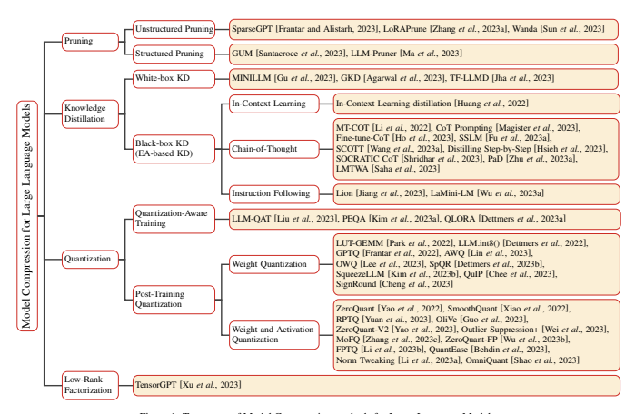
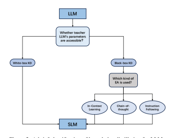
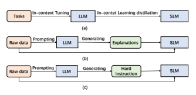

# A Survey On Model Compression For Large Language Models

Xunyu Zhu1,2, **Jian Li**1,2
∗, Yong Liu3, Can Ma1,2, **Weiping Wang**1,2 1Institute of Information Engineering, Chinese Academy of Sciences 2School of Cyber Security, University of Chinese Academy of Sciences 3Gaoling School of Artificial Intelligence, Renmin University of China
{zhuxunyu, lijian9026, macan, wangweiping}@iie.ac.cn, liuyonggsai@ruc.edu.cn

## Abstract

Large Language Models (LLMs) have revolutionized natural language processing tasks with remarkable success. However, their formidable size and computational demands present significant challenges for practical deployment, especially in resource-constrained environments. As these challenges become increasingly pertinent, the field of model compression has emerged as a pivotal research area to alleviate these limitations. This paper presents a comprehensive survey that navigates the landscape of model compression techniques tailored specifically for LLMs. Addressing the imperative need for efficient deployment, we delve into various methodologies, encompassing quantization, pruning, knowledge distillation, and more. Within each of these techniques, we highlight recent advancements and innovative approaches that contribute to the evolving landscape of LLM research. Furthermore, we explore benchmarking strategies and evaluation metrics that are essential for assessing the effectiveness of compressed LLMs. By providing insights into the latest developments and practical implications, this survey serves as an invaluable resource for both researchers and practitioners. As LLMs continue to evolve, this survey aims to facilitate enhanced efficiency and real-world applicability, establishing a foundation for future advancements in the field.

## 1 Introduction

Large Language Models (LLMs) [Zhao *et al.*, 2023; Huang and Chang, 2023; Chang *et al.*, 2023] consistently exhibit remarkable performance across various tasks. Nevertheless, their exceptional capabilities come with significant challenges stemming from their extensive size and computational requirements. For instance, the GPT-175B model [Brown et al., 2020], with an impressive 175 billion parameters, demands a minimum of 320GB (using multiples of 1024) of storage in half-precision (FP16) format. Furthermore, deploying this model for inference necessitates at least five
∗Corresponding author.

A100 GPUs, each featuring 80GB of memory, to efficiently manage operations. To tackle these issues, a prevalent approach known as model compression [Deng *et al.*, 2020; He *et al.*, 2018] offers a solution. Model compression involves transforming a large, resource-intensive model into a compact version suitable for storage on constrained mobile devices. Additionally, it can involve optimizing the model for faster execution with minimal latency or achieving a balance between these objectives.

Apart from their technical aspects, LLMs have triggered discussions on environmental and ethical matters. These models pose significant challenges for engineers and researchers in developing nations, where limited resources can impede access to essential hardware for model execution [Lin et al., 2023]. Additionally, the substantial energy consumption of LLMs contributes to carbon emissions, underscoring the significance of sustainable practices in AI research. A promising solution to these challenges lies in utilizing model compression techniques, which have showcased the potential to reduce emissions without substantially compromising performance [Luccioni *et al.*, 2022]. By implementing model compression, we can tackle environmental concerns, enhance accessibility, and promote inclusivity in LLM deployment.

In our paper, our primary objective is to illuminate the recent strides made in the domain of model compression techniques tailored specifically for LLMs. Our work entails an exhaustive survey of methodologies, metrics, and benchmarks, which we meticulously organize into an innovative taxonomy.

As illustrated in Figure 1, our proposed taxonomy provides a structured framework for understanding the landscape of Model Compression methods for LLMs. This exploration encompasses a thorough examination of well-established techniques, including but not limited to pruning, knowledge distillation, quantization, and low-rank factorization. Furthermore, our study sheds light on prevailing challenges and offers a glimpse into potential future research trajectories in this evolving field. We advocate for collaborative efforts within the community to pave the way for an ecologically conscious, all-encompassing, and sustainable future for LLMs. Notably, our work stands as the inaugural survey specifically addressing the realm of model compression for LLMs.

## 2 Methods 2.1 Pruning

Pruning is a powerful technique to reduce the size or complexity of a model by removing unnecessary or redundant components [LeCun *et al.*, 1989; Han *et al.*, 2015; Li *et al.*,
2017]. As we know, there are many redundant parameters that have little even no effects on the performance of the model, thus, the performance of the model will make the least drop after directly pruning these redundant parameters. At the same time, pruning can make the model storage-friendly [Ardakani *et al.*, 2019], memory-efficiency [Han *et al.*, 2015; Yang *et al.*, 2017], computation-efficiency [Li *et al.*, 2017].

Pruning can be divided into **Unstructured Pruning** [Zhang et al., 2018; Gordon *et al.*, 2020] and **Structured Pruning** [Anwar *et al.*, 2017; Fang *et al.*, 2023]. The main difference between structured pruning and unstructured pruning lies in the pruning targets and the resulting network structure. Structured pruning removes connections or hierarchical structures based on specific rules while preserving the overall network structure. On the other hand, unstructured pruning prunes individual parameters, resulting in an irregular sparse structure. Recent research efforts have been devoted to combining LLMs with pruning techniques, aiming to tackle the substantial size and computational costs associated with LLMs. In this section, we systematically categorize these works based on whether they employ structured or un-

## Structured Pruning Strategies. Unstructured Pruning

Unstructured pruning simplifies an LLM by removing specific parameters without considering its internal structure.

This approach targets individual weights or neurons in the LLM, usually by applying a threshold to zero out parameters below it. However, this method disregards the overall LLM structure, resulting in an irregular sparse model composition. Such irregularity demands specialized compression techniques for efficient storage and computation of the pruned model. Unstructured pruning often involves substantial retraining of the LLM to regain accuracy, which is especially expensive for LLMs. An innovative approach in this domain is SparseGPT [Frantar and Alistarh, 2023]. It introduces a one-shot pruning strategy that doesn't require retraining. The method frames pruning as an extensive sparse regression problem and solves it using an approximate sparse regression solver. SparseGPT achieves significant unstructured sparsity, even up to 60% on the largest GPT models like OPT-175B and BLOOM-176B, with minimal increase in perplexity. Contrasting this, Syed *et al.* propose an iterative pruning technique that fine-tunes the model during pruning with minimal training steps. Another advancement is LoRAPrune [Zhang *et al.*, 2023a], which combines parameterefficient tuning (PEFT) methods with pruning to enhance performance on downstream tasks. It introduces a unique parameter importance criterion using values and gradients from Low-Rank Adaption (LoRA) [Hu , 2022]. In response to the resource-intensive weight update process still required by SparseGPT, Wanda [Sun *et al.*, 2023] presents a new pruning metric. Wanda evaluates each weight based on the product of its magnitude and the norm of corresponding input activations, approximated using a small calibration dataset. This metric is employed for local comparisons within linear layer outputs, enabling the removal of lower-priority weights from LLMs.

## Structured Pruning

Structured pruning simplifies an LLM by removing entire structural components, such as neurons, channels, or layers. This approach targets whole sets of weights at once, offering the advantage of reducing model complexity and memory usage while maintaining the overall LLM structure intact. To explore structured pruning methods' application to and efficacy for LLMs, GUM [Santacroce *et al.*, 2023] makes a analysis of several structured pruning methods to decoderonly LLMs on NLG tasks, and discovers that established structured pruning methods do not take into account the distinctiveness of neurons, leaving behind excess redundancies.

To solve the problem, GUM introduces a proof-of-concept method to maximize both sensitivity and uniqueness by pruning network components based on their global movement and local uniqueness scores. LLM-Pruner [Ma *et al.*, 2023] takes a versatile approach to compressing LLMs while safeguarding their multi-task solving and language generation capabilities. LLM-Pruner also tackles the challenges that arise from the substantial training data used for LLMs, which can lead to significant data transfers and post-training model sizes.

To overcome these challenges, LLM-Pruner incorporates a dependency detection algorithm to pinpoint interdependent structures within the model. It also implements an efficient importance estimation method that considers both first-order information and an approximated Hessian information. This strategy aids in selecting optimal groups for pruning, thereby improving the compression process.

LLM
White-box KD **Black-box KD**
Which kind of EA is used?

Learning Chain-ofthought Instruction Following SLM 

## 2.2 Knowledge Distillation

Knowledge Distillation (KD) [Hinton *et al.*, 2015; Kim and Rush, 2016; Tung and Mori, 2019] is a valuable machine learning technique aimed at improving model performance and generalization. It achieves this by transferring knowledge from a complex model, referred to as the teacher model, to a simpler counterpart known as the student model. The core idea behind KD involves transforming the comprehensive knowledge of the teacher model into a more streamlined and effective representation. In this section, we offer an overview of distillation methods that employ LLMs as teachers. We categorize these methods into two distinct groups:
Black-box KD, in which only the teacher's predictions are accessible, and **White-box KD**, where the teacher's parameters is available for utilization. For a visual representation, Figure 2 provides a brief classification of knowledge distillation for LLMs.

## White-Box Kd

In White-box KD, not only are the teacher LLM's predictions accessible, but access to and utilization of the teacher LLM's parameters are also allowed. This method enables the student LM to gain a deeper understanding of the teacher LLM's internal structure and knowledge representations, often resulting in higher-level performance improvements. White-box KD is typically used to assist smaller student LMs in learning and replicating the knowledge and capabilities of larger, more powerful teacher LLMs [Gou *et al.*, 2021; Park *et al.*, 2019; Zhao *et al.*, 2022; Liu *et al.*, 2021a]. An illustrative example is MINILLM [Gu *et al.*, 2023], which delves into distillation from white-box generative LLMs. It observes a challenge with minimizing forward Kullback-Leibler divergence
(KLD) - this can lead to overly high probabilities in unlikely areas of the teacher's distribution, causing improbable samples during free-run generation. To address this, MINILLM
opts for minimizing reverse KLD. This approach prevents the student from overestimating low-probability regions within the teacher's distribution, thereby refining the quality of generated samples. In contrast, GKD [Agarwal *et al.*, 2023] explores distillation from auto-regressive models, where whitebox generative LLMs are a subset. This method identifies two key issues: a distribution mismatch between output sequences during training and those generated by the student during deployment, and model under-specification, where the student model might lack the expressive power to match the teacher's distribution. GKD handles the distribution mismatch by sampling output sequences from the student during training. It also tackles model under-specification by optimizing alternative divergences like reverse KL. To realize task-agnostic zero-shot evaluated distillation for LLMs without access to end-task finetuning data, TF-LLMD [Jha *et al.*, 2023] uses a truncated model with a subset of layers from the larger model for initialization, and train the model on pretraining data using a language modeling objective.

## Black-Box Kd

In Black-box KD, only the predictions made by the teacher LLM are accessible. Recently, black-box KD has shown promising results in fine-tuning small models on the promptresponse pairs generated by LLM APIs [Li *et al.*, 2022; are accessible?

Tasks LLM

SLM
In-contet Learning distillation
Ho *et al.*, 2023; Hsieh *et al.*, 2023]. At the same time, Recent research [Wei *et al.*, 2022a; Schaeffer *et al.*, 2023; Zhao *et al.*, 2023] underscores that with the emphasis on augmenting model size, LLMs like GPT-3 (175B parameters) and PaLM (540B parameters) showcase unique behaviors when compared to smaller models like BERT (330M parameters) and GPT-2 (1.5B parameters). These LLMs exhibit surprising capabilities, referred to as Emergent Abilities, when tackling intricate tasks. Emergent Abilities encompass several intriguing facets, including **In-Context Learning (ICL)** [Dong *et al.*, 2023; Wang *et al.*, 2023b], **Chainof-Thought (CoT)** [Wei *et al.*, 2022b; Wang *et al.*, 2023c; Shi *et al.*, 2023], and **Instruction Following (IF)** [Ouyang et al., 2022; Brooks *et al.*, 2023]. In our paper, we further categorize black-box KD methods according to which emergent Abilities is utilized. Thus, we also refer to Black-box KD as EA-based KD. For a visual overview, refer to Figure 3, which provides a concise representation of the EA-based Knowledge Distillation concept.

ICL employs a structured natural language prompt that contains task descriptions and possibly a few task examples as demonstrations. Through these task examples, LLMs can grasp and perform new tasks without necessitating explicit gradient updates. The work by Huang *et al.* introduces ICL distillation, which transfers in-context few-shot learning and language modeling capabilities from LLMs to SLMs.

This is accomplished by combining in-context learning objectives with traditional language modeling objectives. To achieve this, they explore ICL distillation under two few-shot learning paradigms: Meta In-context Tuning (Meta-ICT) and Multitask In-context Tuning (Multitask-ICT). In Meta-ICT,
the language model undergoes meta-training across diverse tasks using in-context learning objectives. This equips it to adapt to unseen tasks through in-context learning, thereby extending its problem-solving capabilities. On the other hand, Multitask-ICT fine-tunes the model using ICL objectives and a handful of examples from target tasks. Subsequently, it employs in-context learning for making predictions on these tasks. Comparing the two paradigms, Multitask-ICT exhibits superior performance over Meta-ICT. However, it does demand greater computational resources during task adaptations, making it computationally more intensive.

CoT takes a different approach compared to ICL by incorporating intermediate reasoning steps, which can lead to the final output, into the prompts instead of using simple inputoutput pairs. MT-COT [Li *et al.*, 2022] aims to leverage the explanations produced by LLMs to enhance the training of smaller reasoners. It utilizes a multi-task learning framework to empower smaller models with strong reasoning capabilities alongside the ability to generate explanations. CoT
Prompting [Magister *et al.*, 2023] explores the transferability of such reasoning capabilities to smaller models via knowledge distillation, and find that these is a trade-off between model and dataset size on reasoning capabilities. Fine-tuneCoT [Ho *et al.*, 2023] takes a step further by generating multiple reasoning solutions from LLMs through stochastic sampling. This augmentation of training data aids student models in their learning process. SSLM [Fu *et al.*, 2023a] identifies a trade-off between the multi-dimensional capabilities of language models and propose fine-tuning an instructiontuned model. They distill CoT reasoning paths from a large teacher model to improve out-of-distribution generalization.

Distilling Step-by-Step [Hsieh *et al.*, 2023] employ LLM rationales as additional guidance for training smaller models within a multi-task framework. SOCRATIC CoT [Shridhar et al., 2023] trains two distilled models: a problem decomposer and a subproblem solver. The decomposer breaks down an original problem into a sequence of subproblems, while the subproblem solver handles solving these subproblems. For rationale faithfulness, SCOTT [Wang *et al.*, 2023a] employs contrastive decoding, which links each rationale to the answer. It encourages relevant rationales from the teacher. Additionally, the student is guided to engage in counterfactual reasoning and predict based on rationales that lead to different answers. In PaD [Zhu *et al.*, 2023a], student models are reinforced with program-aided reasoning and are aided in overcoming faulty reasoning steps through automated error checking. LMTWA [Saha *et al.*, 2023] explores the use of LLMs as teachers to enhance the performance of weaker agents through natural language explanations. Specifically, it introduces a student-teacher framework, investigating when and how the teacher should intervene with explanations. The study proposes a Theory of Mind approach for personalized and budget-conscious teaching, demonstrates the long-term impact of teacher explanations, and cautions about the potential negative effects of misaligned teachers intentionally misleading students.

IF endeavors to enhance the competence of language models in executing new tasks solely based on reading task descriptions, without relying on few-shot examples. By undergoing fine-tuning using an array of tasks expressed as instructions, language models showcase the capacity to accurately execute tasks described in previously unseen instructions. For instance, Lion [Jiang *et al.*, 2023] harnesses the adaptable nature of LLMs to improve student model performance. It prompts the LLM to identify and generate the "hard" instructions, which are then utilized to enhance the student model's capabilities. This approach taps into the versatility of LLMs to guide the learning of student models in addressing complex instructions and tasks. LaMini-LM [Wu *et al.*, 2023a] addresses the challenge of resource-intensive language models, which demand substantial computational power and memory, rendering them inaccessible to many researchers and develop-
Raw data LLM
Explanations **Generating**
SLM
Raw data LLM
instruction Generating SLM
ers. To tackle this issue, LaMini-LM has developed an extensive collection of 2.58 million instructions, comprising both existing and newly generated instructions. These instructions are utilized in fine-tuning a diverse array of models, providing an effective solution to this problem.

## 2.3 Quantization

In the domain of model compression, quantization has emerged as a widely embraced technique to alleviate the storage and computational overhead of deep learning models [Liu *et al.*, 2021b; Gholami *et al.*, 2022; Guo *et al.*,
2020]. While traditional representation employs floatingpoint numbers, quantization converts them to integers or other discrete forms. This transformation significantly reduces storage requirements and computational complexity.

Although some precision loss is inherent, careful quantization techniques can achieve substantial model compression with only minimal accuracy degradation. Quantization can be categorized into three main approaches: quantizationaware training (QAT) [Tailor *et al.*, 2021; Kim *et al.*, 2022; Ding *et al.*, 2022], and post-training quantization (PTQ) [Liu et al., 2021b; Nagel *et al.*, 2020; Fang *et al.*, 2020]. The primary distinction among these approaches lies in when quantization is applied to compress the model. QAT employs quantization during the model's training / fine-tuning process, and PTQ quantizes a model after it has completed its training. Recent research endeavors have harnessed quantization to compress LLMs, yielding impressive outcomes. These efforts are classified into the two mentioned approaches:
Quantization-Aware Training, and **Post-Training Quantization**. Furthermore, Table 1 serves as a summarized reference for quantization methods applied to LLMs. The table classifies these works into 8-bit quantization and lower-bit quantization, based on the number of bits (precision) in the weights of the LLM.

## Quantization-Aware Training

In QAT, the quantization objective is seamlessly integrated into the model's training process. This approach enables the LLM to adapt to low-precision representations during training, enhancing its capacity to handle precision loss caused by quantization. This adaptation aims to preserve higher performance even after the quantization process. For instance, LLM-QAT [Liu *et al.*, 2023] delves into the challenges of acquiring training data for LLMs. Given that gathering training data for LLMs can be demanding, LLM-QAT
proposes an innovative solution. It leverages generations produced by a pretrained model to achieve data-free distillation. This approach significantly aids in circumventing the data collection challenge. Additionally, LLM-QAT goes a step further by quantizing not only weights and activations but also key-value (KV) caches. This strategy aims to enhance throughput and support longer sequence dependencies. A noteworthy achievement of LLM-QAT is its ability to distill large LLaMA models with quantized weights and KV caches down to just 4 bits. This groundbreaking result demonstrates the feasibility of producing accurate 4-bit quantized LLMs. On the other hands, PEQA [Kim *et al.*,
2023a] and QLORA [Dettmers *et al.*, 2023a] both fall under the category of quantization-aware Parameter-Efficient FineTuning (PEFT) techniques [Liu *et al.*, 2022; Ding *et al.*, 2023; Fu *et al.*, 2023b]. These techniques focus on facilitating model compression and accelerating inference. PEQA employs a dual-stage process. In the first stage, each fullyconnected layer's parameter matrix is quantized into a matrix of low-bit integers and a scalar vector. In the second stage, fine-tuning occurs on the scalar vector for each specific downstream task. QLORA introduces innovative concepts like a new data type, double quantization, and paged optimizers. These ideas are aimed at conserving memory without compromising performance. QLORA enables large models to undergo fine-tuning on a single GPU while achieving state-of-the-art results on the Vicuna benchmark [Chiang et al., 2023].

## Post-Training Quantization

PTQ involves quantizing the parameters of a LLM after the completion of the LLM's training phase. The primary objective of PTQ is to diminish the storage and computational complexity of the LLM, all without necessitating modifications to the LLM architecture or requiring a retraining process. PTQ's key advantage is its simplicity and efficiency in achieving model compression. However, it's important to note that PTQ can introduce a certain degree of precision loss due to the quantization procedure. This method serves as a straightforward way to enhance the efficiency of an LLM without significant alterations or extensive training efforts.

In PTQ, certain approaches focus on quantizing only the weights of LLMs to enhance efficiency and reduce computational demands. Specifically, LUT-GEMM [Park *et al.*,
2022] optimizes matrix multiplications within LLMs using weight-only quantization and the BCQ format [Rastegari et al., 2016], enhancing latency reduction and performance by improving computational efficiency. LLM.int8() [Dettmers et al., 2022] employs 8-bit quantization for matrix multiplication in LLM transformers, effectively halving GPU memory usage during inference while maintaining performance precision. This method employs vector-wise quantization and mixed-precision decomposition to handle outliers for efficient inference. Remarkably, LLM.int8() enables inference in models with up to 175 billion parameters without performance compromise. GPTQ [Frantar *et al.*, 2022] acknowledges that the methods mentioned above work well for low compression targets like 8-bit weights, but face challenges in maintaining accuracy at higher rates. To tackle the challenges, GPTQ proposes a novel layer-wise quantization technique based on approximate second-order information. The result is a bitwidth reduction to 3 or 4 bits per weight, with minimal accuracy loss compared to the uncompressed version. Dettmers and Zettlemoyer delve into the trade-off between model size and bit precision in LLMs concerning zeroshot performance by analyzing inference scaling laws. Their extensive experimentation across various LLM families reveals that 4-bit precision is nearly universally optimal for achieving the right balance between total model bits and zeroshot accuracy. AWQ [Lin *et al.*, 2023] finds that weights are not equally important for LLMs' performance, and protecting only 1% of salient weights can greatly reduce quan-

| Precision              | Methods                                                                                                                                                                                                                                                                                                                                                                                                                                                                                                                                                                                                                                                                                                              |
|------------------------|----------------------------------------------------------------------------------------------------------------------------------------------------------------------------------------------------------------------------------------------------------------------------------------------------------------------------------------------------------------------------------------------------------------------------------------------------------------------------------------------------------------------------------------------------------------------------------------------------------------------------------------------------------------------------------------------------------------------|
| 8-bit quantization     | LUT-GEMM [Park et al., 2022], LLM.int8() [Dettmers et al., 2022], ZeroQuant [Yao et al., 2022], SmoothQuant [Xiao et al., 2022] LLM-QAT [Liu et al., 2023], PEQA [Kim et al., 2023a], QLORA [Dettmers et al., 2023a], GPTQ [Frantar et al., 2022], AWQ [Lin et al., 2023], SpQR [Dettmers et al., 2023b], RPTQ [Yuan et al., 2023], OliVe [Guo et al., 2023], Outlier Suppression+ [Wei et al., 2023], OWQ [Lee et al., 2023], ZeroQuant-FP [Wu et al., 2023b], ZeroQuant-V2 [Yao et al., 2023], SqueezeLLM [Kim et al., 2023b], QuIP [Chee et al., 2023], FPTQ [Li et al., 2023b], QuantEase [Behdin et al., 2023], Norm Tweaking [Li et al., 2023a], SignRound [Cheng et al., 2023], OmniQuant [Shao et al., 2023] |
| lower-bit quantization |                                                                                                                                                                                                                                                                                                                                                                                                                                                                                                                                                                                                                                                                                                                      |

tization error. Building on this insight, AWQ employs an activation-aware approach by considering the significance of weight channels corresponding to larger activation magnitudes, which play a pivotal role in processing vital features.

The approach incorporates a per-channel scaling technique to identify optimal scaling factors that minimize quantization errors while quantizing all weights. OWQ [Lee *et al.*, 2023]
makes a theoretical analysis about how activation outliers can amplify the error in weight quantization. Drawing insights from this analysis, OWQ introduces a mixed-precision quantization scheme, which applies higher precision to the weights susceptible to quantization caused by activation outliers. To further compress accurate LLMs to 3-4 bits per parameter while staying near-lossless, SpQR [Dettmers et al., 2023b] identifies and isolates outlier weights, storing them in higher precision, and compressing all other weights to 3-4 bits. SqueezeLLM [Kim *et al.*, 2023b] incorporates sensitivity-based non-uniform quantization and Denseand-Sparse decomposition to enables lossless compression to ultra-low precisions of up to 3-bit. Specifically, sensitivitybased non-uniform quantization searches for the optimal bit precision assignment based on second-order information, and Dense-and-Sparse decomposition stores outliers and sensitive weight values in an efficient sparse format. Motivated by the insight that quantization benefits from incoherent weight and Hessian matrices, QuIP [Chee *et al.*, 2023] utilizes an adaptive rounding procedure that minimizes a quadratic proxy objective and efficient pre- and post-processing that ensures weight and Hessian incoherence via multiplication by random orthogonal matrices to realize 2-bit quantization of LLMs. To achieve high precision at a lower bit while remaining costefficient, Norm Tweaking [Li *et al.*, 2023a] involves rectifying the quantized activation distribution to match its float counterpart, which helps restore accuracy for LLMs. It includes calibration data generation and channel-wise distance constraints to update the weights of normalization layers for better generalization. For the purpose of enhancing the accuracy of weight-only quantization, SignRound [Cheng *et al.*,
2023] introduces a lightweight block-wise tuning approach using signed gradient descent.

Except the above works that quantize only the weights of LLMs, lots of works in PTQ try to quantize both weights and activations of LLMs. ZeroQuant [Yao *et al.*, 2022]
integrates a hardware-friendly quantization scheme, layerby-layer knowledge distillation, and optimized quantization support to reduce weight and activation precision in Transformer-based models to INT8 with minimal accuracy impact. SmoothQuant [Xiao *et al.*, 2022] addresses the challenge of quantizing activations, which is often more complex due to the presence of outliers. Observing that different tokens exhibit similar variations across their channels, SmoothQuant introduces a per-channel scaling transformation that effectively smooths the magnitudes, rendering the model more amenable to quantization. By conducting a systematic examination of various quantization schemes, model families, and quantization bit precision, ZeroQuant-V2 [Yao et al., 2023] finds that 1) activation quantization is generally more susceptible to weight quantization, with smaller models often outperforming larger models in terms of activation quantization, 2) none of the current methods can achieve the original model quality for quantization with either INT4-weight or INT4-weight-and-INT8-activation. To solve these problems, ZeroQuant-V2 introduces a technique called Low Rank Compensation (LoRC), which employs low-rank matrix factorization on the quantization error matrix to enhance model quality recovery with a minimal increase in model size. Recognizing the complexity of quantizing activations in LLMs, RPTQ [Yuan *et al.*, 2023] sheds light on the challenge stemming from the uneven ranges across different channels, in addition to the presence of outliers.

To address this, RPTQ strategically arranges channels into clusters for quantization, effectively mitigating the discrepancies in channel ranges. Moreover, it integrates the channel reordering into the layer norm operation and linear layer weights to minimize associated overhead. OliVe [Guo *et al.*,
2023] further adopts an outlier-victim pair (OVP) quantization and handles outlier values locally with low hardware overheads and high performance gains, because it finds that outliers are important while the normal values next to them are not. Outlier Suppression+ [Wei *et al.*, 2023] extends this understanding by confirming that harmful outliers within activations exhibit an asymmetric distribution, predominantly concentrating in specific channels, and introduces a novel strategy involving channel-wise shifting and scaling operations to rectify the asymmetric presentation of outliers and mitigate the impact of problematic channels, and quantitatively analyzes the optimal values for shifting and scaling, taking into account both the asymmetric nature of the outliers and the quantization errors stemming from weights in the next layers. ZeroQuant-FP [Wu , 2023b] explores the applicability of floating-point (FP) quantization, specifically focusing on FP8 and FP4 formats. The study reveals that for LLMs, FP8 activation consistently outperforms its integer counterpart (INT8), while in terms of weight quantization, FP4 demonstrates comparable, if not superior, performance compared to INT4. To address the challenges arising from the divergence between weights and activations, ZeroQuant-FP mandates that all scaling factors be powers of 2 and confines the scaling factors within a single compute group. Notably, ZeroQuant-FP also integrates the Low Rank Compensation (LoRC) strategy to further enhance the effectiveness of its quantization approach. FPTQ [Li *et al.*,
2023b] combines the advantages of both n two recipes W8A8 and W4A16 to design a novel W4A8 post-training quantization method for the available open-sourced LLMs, and combines fine-grained weight quantization with layerwise activation quantization strategies which feature a novel logarithmic equalization for most intractable layers to eliminate the necessity for further fine-tuning. QuantEase [Behdin *et al.*,
2023], is an innovative layer-wise quantization framework that involves distinct quantization processes for individual layers. The core challenge is framed as a discrete-structured non-convex optimization problem, for which effective solutions are derived through the application of Coordinate Descent (CD) techniques. OmniQuant [Shao *et al.*, 2023] consists of two groundbreaking components: Learnable Weight Clipping (LWC) and Learnable Equivalent Transformation
(LET). These components are designed to fine-tune a range of quantization parameters effectively. OmniQuant operates within a differentiable framework, employing block-wise error minimization, and excels in achieving impressive performance across a variety of quantization configurations.

## 2.4 Low-Rank Factorization

Low-Rank Factorization [Cheng *et al.*, 2017; Povey *et al.*,
2018; Idelbayev and Carreira-Perpin˜an, 2020 ´ ] is a model compression technique that aims to approximate a given weight matrix by decomposing it into two or more smaller matrices with significantly lower dimensions. The core idea behind low-rank factorization involves finding a factorization of a large weight matrix W into two matrices U and V such that W ≈ UV , where U is an m × k matrix, and V is a k × n matrix, with k being much smaller than m and n. The product of U and V approximates the original weight matrix, leading to a substantial reduction in the number of parameters and computational overhead. In the field of LLM
research, low-rank factorization has been widely adopted to fine-tune LLMs efficiently, e.g., LORA [Hu *et al.*, 2022]
and its variants [Valipour *et al.*, 2023; Zhang *et al.*, 2023b; Chavan *et al.*, 2023]. Different from those above works, we focus on these works that use low-rank factorization to compress LLMs. TensorGPT [Xu *et al.*, 2023] stores large embeddings in a low-rank tensor format, reducing the space complexity of LLMs and making them available on edge devices. Specifically, TensorGPT efficiently compresseses the embedding layer in LLMs using the Tensor-Train Decomposition (TTD). By treating each token embedding as a Matrix Product State (MPS), the embedding layer can be compressed by a factor of up to 38.40 times, while still maintaining or even improving the model's performance compared to the original LLM.

## 3 Metrics And Benchmarks 3.1 Metrics

Inference efficiency of LLMs can be measured using various metrics, which capture different aspects of performance.

These metrics are commonly presented alongside accuracy and zero-shot ability to comprehensively evaluate the LLM.

## Number Of Parameters

Number of Parameters [Ma *et al.*, 2023; Dasgupta *et al.*,
2023] in a LLM refers to the total count of learnable weights or variables that the LLM needs to optimize during training.

In LLMs, parameters represent the weights in the connections between neurons or attention layers. In general, the more parameters a LLM has, the more expressive it can be, but it also requires more computational resources and memory for both training and inference.

## Model Size

Model Size [Shridhar *et al.*, 2023; Li *et al.*, 2022; Magister *et al.*, 2023] typically refers to the disk space or memory footprint required to store the entire LLM, including weights, biases, and other necessary components. The model size is closely related to the number of parameters, as more parameters usually lead to a larger model size. However, other factors, like the data type used to represent the parameters and model architecture, can also influence the overall size.

## Compression Ratio

Compression Ratio [Frantar and Alistarh, 2023; Tao *et al.*,
2023] represents the ratio between the original size of the uncompressed LLM and the size of the compressed LLM. A
higher compression ratio indicates a more efficient compression, as the LLM has been significantly reduced in size while preserving its functionality and performance.

## Inference Time

Inference time (i.e., latency) [Kurtic *et al.*, 2023; Frantar et al., 2022] measures the time taken by the LLM to process and generate responses for input data during inference or prediction. Inference time is particularly crucial for real-world applications where the LLM needs to respond to user queries or process large amounts of data in real-time.

## Floating Point Operations (Flops)

FLOPs [Dettmers and Zettlemoyer, 2022; Yuan *et al.*, 2023; Wei *et al.*, 2023] measures the number of arithmetic operations involving floating-point numbers (typically 32-bit or 16-bit) that the LLM performs when processing input data.

FLOPs provide a useful way to estimate the computational requirements of a LLM and compare the efficiency of different LLMs or compression techniques.

## 3.2 Benchmarks And Datasets

The main goal of these benchmarks and Datasets is to measure the effectiveness, efficiency, and accuracy of compressed LLMs in comparison to their uncompressed counterparts.

These benchmarks and datasets typically consist of diverse tasks and datasets that cover a range of natural language processing challenges.

## Common Benchmarks And Datasets

The majority of research evaluates compressed LLMs on well-established NLP benchmarks and Datasets. For instance, GLUE [Wang *et al.*, 2019b] and SuperGLUE [Wang et al., 2019a] is designed for evaluating the performance of language models on a wide range of natural language understanding (NLU) tasks. LAMBADA [Paperno *et al.*, 2016] is designed to evaluate the context-dependent understanding of language models. LAMA [Petroni *et al.*, 2019] and StrategyQA [Geva *et al.*, 2021] are both designed to evaluate the reasoning ability of language models. SQuAD [Rajpurkar et al., 2016] is designed for machine reading comprehension
(MRC) tasks.

## Big-Bench

BIG-Bench (BBH) [Srivastava *et al.*, 2022] is a benchmark suite designed for LMs, covering over 200 NLP tasks, e.g., Text Comprehension Tasks, Inference Tasks, Mathematical Reasoning Tasks. The aim of BBH is to evaluate the performance of LMs across these various complex tasks. The compressed LLMs use BBH to measuring the general capability on real-world tasks. This approach provides a multidimensional perspective on model performance and efficiency. BBH facilitates insightful evaluation and method assessment.

## Unseen Instructions Datasets

The aim of unseen instructions datasets is used to evaluate the performance of LLMs when facing arbitrary tasks. There are two prominent datasets, i.e., Vicuna-Instructions [Chiang *et al.*, 2023] and User-Oriented-Instructions [Wang *et al.*, 2023d]. The Vicuna-Instructions dataset, generated by GPT4, comprises 80 intricate questions designed to challenge baseline models. It spans a diverse array of nine distinct categories, encompassing generic, knowledge-based, roleplay, commonsense, fermi, counterfactual, coding, mathematical, and writing tasks. The User-Oriented-Instructions dataset is a meticulously curated collection containing 252 instructions.

This dataset takes inspiration from 71 user-oriented applications, including Grammarly, StackOverflow, Overleaf, rather than being centered around extensively studied NLP tasks.

These datasets aim to gauge the performance of the compressed LLMs when faced with unseen instructions to scrutinize their aptitude in handling and executing arbitrary tasks.

## 4 Challenges And Future Directions More Advanced Methods

The research on model compression techniques for LLMs is still in its early stages. These compressed LLMs, as demonstrated in prior studies [Frantar and Alistarh, 2023; Liu *et al.*, 2023; Ho *et al.*, 2023], continue to exhibit a significant performance gap when compared to their uncompressed counterparts. By delving into more advanced model compression methods tailored for LLMs, we have the potential to enhance the performance of these uncompressed LLMs.

## Performance-Size Trade-Offs

Prior research [Magister *et al.*, 2023; Dettmers and Zettlemoyer, 2022] highlights the delicate balance between Large Language Model (LLM) performance and model size. Analyzing this trade-off allows for optimal performance within hardware constraints. However, current work lacks theoretical and empirical insights into this trade-off. Future LLM
compression research should conduct comprehensive analyses to guide advanced techniques. Understanding the relationship between performance and size empowers researchers to develop tailored compression methods, navigating the design space effectively for efficient solutions.

## Dynamic Llm Compression

Despite the advancements in current compression methods, they still rely on manual design to determine the compressed size and structure of LLMs. This often involves a trialand-error approach based on input data or task requirements.

This process becomes particularly challenging in scenarios like knowledge distillation, where several trials are necessary to find suitable student models within computational constraints. This manual effort presents a practical hindrance.

A promising solution emerges in the integration of Neural Architecture Search (NAS) techniques [Elsken *et al.*, 2019; Zoph and Le, 2016; Zhu *et al.*, 2021; Zhu *et al.*, 2023b] into the realm of compressing LLMs. NAS holds the potential to reduce the dependence on human-designed architectures, potentially revolutionizing LLM compression for improved efficiency and effectiveness.

## Explainability

Earlier research [Stanton *et al.*, 2021; Xu *et al.*, 2021]
has raised significant concerns regarding the explainability of compression techniques applied to Pre-trained Language Models (PLMs). Notably, these same challenges extend to LLM compression methods as well. For example, there are no explanation about why CoT-distillation can make the SLMs own CoT ability and achieve good performance in reasoning tasks. Consequently, the integration of explainable compression approaches emerges as a crucial necessity for the progression of LLM compression applications. Moreover, the adoption of explainable compression not only addresses the issue of interpretability but also simplifies the evaluation procedure for compressed models. This, in turn, enhances the reliability and predictability of the models throughout the production phase.

## 5 Conclusion

In this thorough survey, we've explored model compression techniques for large language models (LLMs). Our coverage spanned compression methods, evaluation metrics, and benchmark datasets. By diving into LLM compression, we've highlighted its challenges and opportunities. As LLM compression advances, there's a clear call for research into advanced methodologies specifically for LLMs, unlocking their potential across applications. This survey aims to be a valuable reference, providing insights into the current landscape and promoting ongoing exploration of this pivotal topic.

## Acknowledgments

The work of Jian Li is supported partially by Natural Science Foundation of China (No. 62106257), China Postdoctoral Science Foundation (No. 2023T160680), and Excellent Talents Program of Institute of Information Engineering, CAS. The work of Yong Liu is supported partially by Natural Science Foundation of China (No.

62076234), Beijing Outstanding Young Scientist Program
(No. BJJWZYJH012019100020098), the Unicom Innovation Ecological Cooperation Plan, and the CCF-Huawei Populus Grove Fund.

## References

[Agarwal *et al.*, 2023] Rishabh Agarwal, Nino Vieillard, Piotr Stanczyk, Sabela Ramos, Matthieu Geist, and Olivier Bachem. GKD: generalized knowledge distillation for auto-regressive sequence models. *CoRR*, abs/2306.13649, 2023.

[Anwar *et al.*, 2017] Sajid Anwar, Kyuyeon Hwang, and Wonyong Sung. Structured pruning of deep convolutional neural networks. *ACM J. Emerg. Technol. Comput. Syst.*,
13(3):32:1–32:18, 2017.

[Ardakani *et al.*, 2019] Arash Ardakani, Zhengyun Ji, Sean C. Smithson, Brett H. Meyer, and Warren J. Gross.

Learning recurrent binary/ternary weights. In *7th International Conference on Learning Representations,*
ICLR 2019, New Orleans, LA, USA, May 6-9, 2019.

OpenReview.net, 2019.

[Behdin *et al.*, 2023] Kayhan Behdin, Ayan Acharya, Aman Gupta, Sathiya Keerthi Selvaraj, and Rahul Mazumder.

Quantease: Optimization-based quantization for language models - an efficient and intuitive algorithm. *CoRR*,
abs/2309.01885, 2023.

[Brooks *et al.*, 2023] Tim Brooks, Aleksander Holynski, and Alexei A Efros. Instructpix2pix: Learning to follow image editing instructions. In Proceedings of the IEEE/CVF
Conference on Computer Vision and Pattern Recognition, pages 18392–18402, 2023.

[Brown *et al.*, 2020] Tom B. Brown, Benjamin Mann, Nick Ryder, Melanie Subbiah, Jared Kaplan, Prafulla Dhariwal, Arvind Neelakantan, Pranav Shyam, Girish Sastry, Amanda Askell, Sandhini Agarwal, Ariel Herbert-Voss, Gretchen Krueger, Tom Henighan, Rewon Child, Aditya Ramesh, Daniel M. Ziegler, Jeffrey Wu, Clemens Winter, Christopher Hesse, Mark Chen, Eric Sigler, Mateusz Litwin, Scott Gray, Benjamin Chess, Jack Clark, Christopher Berner, Sam McCandlish, Alec Radford, Ilya Sutskever, and Dario Amodei. Language models are fewshot learners. In Hugo Larochelle, Marc'Aurelio Ranzato, Raia Hadsell, Maria-Florina Balcan, and Hsuan-Tien Lin, editors, *Advances in Neural Information Processing* Systems 33: Annual Conference on Neural Information Processing Systems 2020, NeurIPS 2020, December 6-12, 2020, virtual, 2020.

[Chang *et al.*, 2023] Yupeng Chang, Xu Wang, Jindong Wang, Yuan Wu, Kaijie Zhu, Hao Chen, Linyi Yang, Xiaoyuan Yi, Cunxiang Wang, Yidong Wang, Wei Ye, Yue Zhang, Yi Chang, Philip S. Yu, Qiang Yang, and Xing Xie.

A survey on evaluation of large language models. *CoRR*,
abs/2307.03109, 2023.

[Chavan *et al.*, 2023] Arnav Chavan, Zhuang Liu, Deepak K.

Gupta, Eric P. Xing, and Zhiqiang Shen. One-for-all: Generalized lora for parameter-efficient fine-tuning. *CoRR*,
abs/2306.07967, 2023.

[Chee *et al.*, 2023] Jerry Chee, Yaohui Cai, Volodymyr Kuleshov, and Christopher De Sa. Quip: 2-bit quantization of large language models with guarantees. *CoRR*,
abs/2307.13304, 2023.

[Cheng *et al.*, 2017] Yu Cheng, Duo Wang, Pan Zhou, and Tao Zhang. A survey of model compression and acceleration for deep neural networks. *CoRR*, abs/1710.09282, 2017.

[Cheng *et al.*, 2023] Wenhua Cheng, Weiwei Zhang, Haihao Shen, Yiyang Cai, Xin He, and Kaokao Lv. Optimize weight rounding via signed gradient descent for the quantization of llms. *CoRR*, abs/2309.05516, 2023.

[Chiang *et al.*, 2023] Wei-Lin Chiang, Zhuohan Li, Zi Lin, Ying Sheng, Zhanghao Wu, Hao Zhang, Lianmin Zheng, Siyuan Zhuang, Yonghao Zhuang, Joseph E. Gonzalez, Ion Stoica, and Eric P. Xing. Vicuna: An open-source chatbot impressing gpt-4 with 90%* chatgpt quality, March 2023.

[Dasgupta *et al.*, 2023] Sayantan Dasgupta, Trevor Cohn, and Timothy Baldwin. Cost-effective distillation of large language models. In Anna Rogers, Jordan L. Boyd-Graber, and Naoaki Okazaki, editors, *Findings of the Association for Computational Linguistics: ACL 2023, Toronto,*
Canada, July 9-14, 2023, pages 7346–7354. Association for Computational Linguistics, 2023.

[Deng *et al.*, 2020] Lei Deng, Guoqi Li, Song Han, Luping Shi, and Yuan Xie. Model compression and hardware acceleration for neural networks: A comprehensive survey.

Proc. IEEE, 108(4):485–532, 2020.

[Dettmers and Zettlemoyer, 2022] Tim Dettmers and Luke Zettlemoyer. The case for 4-bit precision: k-bit inference scaling laws. *CoRR*, abs/2212.09720, 2022.

[Dettmers *et al.*, 2022] Tim Dettmers, Mike Lewis, Younes Belkada, and Luke Zettlemoyer. Llm.int8(): 8-bit matrix multiplication for transformers at scale. *CoRR*,
abs/2208.07339, 2022.

[Dettmers *et al.*, 2023a] Tim Dettmers, Artidoro Pagnoni, Ari Holtzman, and Luke Zettlemoyer. Qlora: Efficient finetuning of quantized llms. *CoRR*, abs/2305.14314, 2023.

[Dettmers , 2023b] Tim Dettmers, Ruslan Svirschevski, Vage Egiazarian, Denis Kuznedelev, Elias Frantar, Saleh Ashkboos, Alexander Borzunov, Torsten Hoefler, and Dan Alistarh. Spqr: A sparse-quantized representation for near-lossless LLM weight compression. *CoRR*,
abs/2306.03078, 2023.

[Ding *et al.*, 2022] Shaojin Ding, Phoenix Meadowlark, Yanzhang He, Lukasz Lew, Shivani Agrawal, and Oleg Rybakov. 4-bit conformer with native quantization aware training for speech recognition. In Hanseok Ko and John H. L. Hansen, editors, *Interspeech 2022, 23rd Annual Conference of the International Speech Communication Association, Incheon, Korea, 18-22 September 2022*,
pages 1711–1715. ISCA, 2022.

[Ding *et al.*, 2023] Ning Ding, Yujia Qin, Guang Yang, Fuchao Wei, Zonghan Yang, Yusheng Su, Shengding Hu, Yulin Chen, Chi-Min Chan, Weize Chen, Jing Yi, Weilin Zhao, Xiaozhi Wang, Zhiyuan Liu, Hai-Tao Zheng, Jianfei Chen, Yang Liu, Jie Tang, Juanzi Li, and Maosong Sun.

Parameter-efficient fine-tuning of large-scale pre-trained language models. *Nat. Mac. Intell.*, 5(3):220–235, 2023.

[Dong *et al.*, 2023] Qingxiu Dong, Lei Li, Damai Dai, Ce Zheng, Zhiyong Wu, Baobao Chang, Xu Sun, Jingjing Xu, Lei Li, and Zhifang Sui. A survey for in-context learning. *CoRR*, abs/2301.00234, 2023.

[Elsken *et al.*, 2019] Thomas Elsken, Jan Hendrik Metzen, and Frank Hutter. Neural architecture search: A survey.

J. Mach. Learn. Res., 20:55:1–55:21, 2019.

[Fang *et al.*, 2020] Jun Fang, Ali Shafiee, Hamzah AbdelAziz, David Thorsley, Georgios Georgiadis, and Joseph Hassoun. Post-training piecewise linear quantization for deep neural networks. In Andrea Vedaldi, Horst Bischof, Thomas Brox, and Jan-Michael Frahm, editors, *Computer* Vision - ECCV 2020 - 16th European Conference, Glasgow, UK, August 23-28, 2020, Proceedings, Part II, volume 12347 of *Lecture Notes in Computer Science*, pages 69–86. Springer, 2020.

[Fang *et al.*, 2023] Gongfan Fang, Xinyin Ma, Mingli Song, Michael Bi Mi, and Xinchao Wang. Depgraph: Towards any structural pruning. *CoRR*, abs/2301.12900, 2023.

[Frantar and Alistarh, 2023] Elias Frantar and Dan Alistarh.

Sparsegpt: Massive language models can be accurately pruned in one-shot. *CoRR*, abs/2301.00774, 2023.

[Frantar *et al.*, 2022] Elias Frantar, Saleh Ashkboos, Torsten Hoefler, and Dan Alistarh. GPTQ: accurate posttraining quantization for generative pre-trained transformers. *CoRR*, abs/2210.17323, 2022.

[Fu *et al.*, 2023a] Yao Fu, Hao Peng, Litu Ou, Ashish Sabharwal, and Tushar Khot. Specializing smaller language models towards multi-step reasoning. *CoRR*,
abs/2301.12726, 2023.

[Fu *et al.*, 2023b] Zihao Fu, Haoran Yang, Anthony ManCho So, Wai Lam, Lidong Bing, and Nigel Collier. On the effectiveness of parameter-efficient fine-tuning. In Brian Williams, Yiling Chen, and Jennifer Neville, editors, Thirty-Seventh AAAI Conference on Artificial Intelligence, AAAI 2023, Thirty-Fifth Conference on Innovative Applications of Artificial Intelligence, IAAI 2023, Thirteenth Symposium on Educational Advances in Artificial Intelligence, EAAI 2023, Washington, DC, USA, February 7-14, 2023, pages 12799–12807. AAAI Press, 2023.

[Geva *et al.*, 2021] Mor Geva, Daniel Khashabi, Elad Segal, Tushar Khot, Dan Roth, and Jonathan Berant. Did aristotle use a laptop? A question answering benchmark with implicit reasoning strategies. *Trans. Assoc. Comput. Linguistics*, 9:346–361, 2021.

[Gholami *et al.*, 2022] Amir Gholami, Sehoon Kim, Zhen Dong, Zhewei Yao, Michael W Mahoney, and Kurt Keutzer. A survey of quantization methods for efficient neural network inference. In *Low-Power Computer Vision*,
pages 291–326. Chapman and Hall/CRC, 2022.

[Gordon *et al.*, 2020] Mitchell A. Gordon, Kevin Duh, and Nicholas Andrews. Compressing BERT: studying the effects of weight pruning on transfer learning. In Spandana Gella, Johannes Welbl, Marek Rei, Fabio Petroni, Patrick S. H. Lewis, Emma Strubell, Min Joon Seo, and Hannaneh Hajishirzi, editors, *Proceedings of the 5th Workshop* on Representation Learning for NLP, RepL4NLP@ACL
2020, Online, July 9, 2020, pages 143–155. Association for Computational Linguistics, 2020.

[Gou *et al.*, 2021] Jianping Gou, Baosheng Yu, Stephen J.

Maybank, and Dacheng Tao. Knowledge distillation: A
survey. *Int. J. Comput. Vis.*, 129(6):1789–1819, 2021.

[Gu *et al.*, 2023] Yuxian Gu, Li Dong, Furu Wei, and Minlie Huang. Knowledge distillation of large language models.

CoRR, abs/2306.08543, 2023.

[Guo *et al.*, 2020] Ruiqi Guo, Philip Sun, Erik Lindgren, Quan Geng, David Simcha, Felix Chern, and Sanjiv Kumar. Accelerating large-scale inference with anisotropic vector quantization. In *Proceedings of the 37th International Conference on Machine Learning, ICML 2020, 13-*
18 July 2020, Virtual Event, volume 119 of *Proceedings* of Machine Learning Research, pages 3887–3896. PMLR,
2020.

[Guo *et al.*, 2023] Cong Guo, Jiaming Tang, Weiming Hu, Jingwen Leng, Chen Zhang, Fan Yang, Yunxin Liu, Minyi Guo, and Yuhao Zhu. Olive: Accelerating large language models via hardware-friendly outlier-victim pair quantization. In Yan Solihin and Mark A. Heinrich, editors, Proceedings of the 50th Annual International Symposium on Computer Architecture, ISCA 2023, Orlando, FL, USA,
June 17-21, 2023, pages 3:1–3:15. ACM, 2023.

[Han *et al.*, 2015] Song Han, Jeff Pool, John Tran, and William J. Dally. Learning both weights and connections for efficient neural network. In Corinna Cortes, Neil D. Lawrence, Daniel D. Lee, Masashi Sugiyama, and Roman Garnett, editors, *Advances in Neural Information Processing Systems 28: Annual Conference on Neural Information* Processing Systems 2015, December 7-12, 2015, Montreal, Quebec, Canada, pages 1135–1143, 2015.

[He , 2018] Yihui He, Ji Lin, Zhijian Liu, Hanrui Wang, Li-Jia Li, and Song Han. AMC: automl for model compression and acceleration on mobile devices. In Vittorio Ferrari, Martial Hebert, Cristian Sminchisescu, and Yair Weiss, editors, *Computer Vision - ECCV 2018 - 15th* European Conference, Munich, Germany, September 814, 2018, Proceedings, Part VII, volume 11211 of *Lecture Notes in Computer Science*, pages 815–832. Springer, 2018.

[Hinton *et al.*, 2015] Geoffrey E. Hinton, Oriol Vinyals, and Jeffrey Dean. Distilling the knowledge in a neural network. *CoRR*, abs/1503.02531, 2015.

[Ho *et al.*, 2023] Namgyu Ho, Laura Schmid, and Se-Young Yun. Large language models are reasoning teachers.

In Anna Rogers, Jordan L. Boyd-Graber, and Naoaki Okazaki, editors, *Proceedings of the 61st Annual Meeting* of the Association for Computational Linguistics (Volume 1: Long Papers), ACL 2023, Toronto, Canada, July 9-14, 2023, pages 14852–14882. Association for Computational Linguistics, 2023.

[Hsieh *et al.*, 2023] Cheng-Yu Hsieh, Chun-Liang Li, ChihKuan Yeh, Hootan Nakhost, Yasuhisa Fujii, Alex Ratner, Ranjay Krishna, Chen-Yu Lee, and Tomas Pfister. Distilling step-by-step! outperforming larger language models with less training data and smaller model sizes. In Anna Rogers, Jordan L. Boyd-Graber, and Naoaki Okazaki, editors, *Findings of the Association for Computational Linguistics: ACL 2023, Toronto, Canada, July 9-14, 2023*,
pages 8003–8017. Association for Computational Linguistics, 2023.

[Hu *et al.*, 2022] Edward J. Hu, Yelong Shen, Phillip Wallis, Zeyuan Allen-Zhu, Yuanzhi Li, Shean Wang, Lu Wang, and Weizhu Chen. Lora: Low-rank adaptation of large language models. In The Tenth International Conference on Learning Representations, ICLR 2022, Virtual Event, April 25-29, 2022. OpenReview.net, 2022.

[Huang and Chang, 2023] Jie Huang and Kevin Chen-Chuan Chang. Towards reasoning in large language models: A
survey. In Anna Rogers, Jordan L. Boyd-Graber, and Naoaki Okazaki, editors, *Findings of the Association for* Computational Linguistics: ACL 2023, Toronto, Canada, July 9-14, 2023, pages 1049–1065. Association for Computational Linguistics, 2023.

[Huang *et al.*, 2022] Yukun Huang, Yanda Chen, Zhou Yu, and Kathleen R. McKeown. In-context learning distillation: Transferring few-shot learning ability of pre-trained language models. *CoRR*, abs/2212.10670, 2022.

[Idelbayev and Carreira-Perpin˜an, 2020 ´ ] Yerlan Idelbayev and Miguel A. Carreira-Perpi ´ n˜an. Low-rank compression ´
of neural nets: Learning the rank of each layer. In 2020 IEEE/CVF Conference on Computer Vision and Pattern Recognition, CVPR 2020, Seattle, WA, USA, June 13-19, 2020, pages 8046–8056. Computer Vision Foundation /
IEEE, 2020.

[Jha *et al.*, 2023] Ananya Harsh Jha, Dirk Groeneveld, Emma Strubell, and Iz Beltagy. Large language model distillation doesn't need a teacher. *CoRR*, abs/2305.14864, 2023.

[Jiang *et al.*, 2023] Yuxin Jiang, Chunkit Chan, Mingyang Chen, and Wei Wang. Lion: Adversarial distillation of closed-source large language model. *CoRR*,
abs/2305.12870, 2023.

[Kim and Rush, 2016] Yoon Kim and Alexander M. Rush.

Sequence-level knowledge distillation. In Jian Su, Xavier Carreras, and Kevin Duh, editors, Proceedings of the 2016 Conference on Empirical Methods in Natural Language Processing, EMNLP 2016, Austin, Texas, USA, November 1-4, 2016, pages 1317–1327. The Association for Computational Linguistics, 2016.

[Kim *et al.*, 2022] Minsoo Kim, Sihwa Lee, Sukjin Hong, Du-Seong Chang, and Jungwook Choi. Understanding and improving knowledge distillation for quantization aware training of large transformer encoders. In Yoav Goldberg, Zornitsa Kozareva, and Yue Zhang, editors, Proceedings of the 2022 Conference on Empirical Methods in Natural Language Processing, EMNLP 2022, Abu Dhabi, United Arab Emirates, December 7-11, 2022, pages 6713–6725.

Association for Computational Linguistics, 2022.

[Kim *et al.*, 2023a] Jeonghoon Kim, Jung Hyun Lee, Sungdong Kim, Joonsuk Park, Kang Min Yoo, Se Jung Kwon, and Dongsoo Lee. Memory-efficient fine-tuning of compressed large language models via sub-4-bit integer quantization. *CoRR*, abs/2305.14152, 2023.

[Kim *et al.*, 2023b] Sehoon Kim, Coleman Hooper, Amir Gholami, Zhen Dong, Xiuyu Li, Sheng Shen, Michael W.

Mahoney, and Kurt Keutzer. Squeezellm: Dense-andsparse quantization. *CoRR*, abs/2306.07629, 2023.

[Kurtic *et al.*, 2023] Eldar Kurtic, Elias Frantar, and Dan Alistarh. Ziplm: Hardware-aware structured pruning of language models. *CoRR*, abs/2302.04089, 2023.

[LeCun *et al.*, 1989] Yann LeCun, John S. Denker, and Sara A. Solla. Optimal brain damage. In David S. Touretzky, editor, *Advances in Neural Information Processing* Systems 2, [NIPS Conference, Denver, Colorado, USA,
November 27-30, 1989], pages 598–605. Morgan Kaufmann, 1989.

[Lee *et al.*, 2023] Changhun Lee, Jungyu Jin, Taesu Kim, Hyungjun Kim, and Eunhyeok Park. OWQ: lessons learned from activation outliers for weight quantization in large language models. *CoRR*, abs/2306.02272, 2023.

[Li *et al.*, 2017] Hao Li, Asim Kadav, Igor Durdanovic, Hanan Samet, and Hans Peter Graf. Pruning filters for efficient convnets. In *5th International Conference on* Learning Representations, ICLR 2017, Toulon, France, April 24-26, 2017, Conference Track Proceedings. OpenReview.net, 2017.

[Li *et al.*, 2022] Shiyang Li, Jianshu Chen, Yelong Shen, Zhiyu Chen, Xinlu Zhang, Zekun Li, Hong Wang, Jing Qian, Baolin Peng, Yi Mao, Wenhu Chen, and Xifeng Yan.

Explanations from large language models make small reasoners better. *CoRR*, abs/2210.06726, 2022.

[Li , 2023a] Liang Li, Qingyuan Li, Bo Zhang, and Xiangxiang Chu. Norm tweaking: High-performance low-bit quantization of large language models. *CoRR*,
abs/2309.02784, 2023.

[Li *et al.*, 2023b] Qingyuan Li, Yifan Zhang, Liang Li, Peng Yao, Bo Zhang, Xiangxiang Chu, Yerui Sun, Li Du, and Yuchen Xie. FPTQ: fine-grained post-training quantization for large language models. *CoRR*, abs/2308.15987, 2023.

[Lin *et al.*, 2023] Ji Lin, Jiaming Tang, Haotian Tang, Shang Yang, Xingyu Dang, and Song Han. AWQ: activationaware weight quantization for LLM compression and acceleration. *CoRR*, abs/2306.00978, 2023.

[Liu *et al.*, 2021a] Yuanxin Liu, Fandong Meng, Zheng Lin, Weiping Wang, and Jie Zhou. Marginal utility diminishes:
Exploring the minimum knowledge for BERT knowledge distillation. In Chengqing Zong, Fei Xia, Wenjie Li, and Roberto Navigli, editors, *Proceedings of the 59th Annual Meeting of the Association for Computational Linguistics and the 11th International Joint Conference on* Natural Language Processing, ACL/IJCNLP 2021, (Volume 1: Long Papers), Virtual Event, August 1-6, 2021, pages 2928–2941. Association for Computational Linguistics, 2021.

[Liu *et al.*, 2021b] Zhenhua Liu, Yunhe Wang, Kai Han, Wei Zhang, Siwei Ma, and Wen Gao. Post-training quantization for vision transformer. In Marc'Aurelio Ranzato, Alina Beygelzimer, Yann N. Dauphin, Percy Liang, and Jennifer Wortman Vaughan, editors, Advances in Neural Information Processing Systems 34: Annual Conference on Neural Information Processing Systems 2021, NeurIPS
2021, December 6-14, 2021, virtual, pages 28092–28103, 2021.

[Liu *et al.*, 2022] Haokun Liu, Derek Tam, Mohammed Muqeeth, Jay Mohta, Tenghao Huang, Mohit Bansal, and Colin Raffel. Few-shot parameter-efficient fine-tuning is better and cheaper than in-context learning. In *NeurIPS*,
2022.

[Liu *et al.*, 2023] Zechun Liu, Barlas Oguz, Changsheng Zhao, Ernie Chang, Pierre Stock, Yashar Mehdad, Yangyang Shi, Raghuraman Krishnamoorthi, and Vikas Chandra. LLM-QAT: data-free quantization aware training for large language models. *CoRR*, abs/2305.17888, 2023.

[Luccioni *et al.*, 2022] Alexandra Sasha Luccioni, Sylvain Viguier, and Anne-Laure Ligozat. Estimating the carbon footprint of bloom, a 176b parameter language model.

CoRR, abs/2211.02001, 2022.

[Ma *et al.*, 2023] Xinyin Ma, Gongfan Fang, and Xinchao Wang. Llm-pruner: On the structural pruning of large language models. *CoRR*, abs/2305.11627, 2023.

[Magister *et al.*, 2023] Lucie Charlotte Magister, Jonathan Mallinson, Jakub Adamek, Eric Malmi, and Aliaksei Sev- ´ eryn. Teaching small language models to reason. In Anna Rogers, Jordan L. Boyd-Graber, and Naoaki Okazaki, editors, Proceedings of the 61st Annual Meeting of the Association for Computational Linguistics (Volume 2: Short Papers), ACL 2023, Toronto, Canada, July 9-14, 2023, pages 1773–1781. Association for Computational Linguistics, 2023.

[Nagel *et al.*, 2020] Markus Nagel, Rana Ali Amjad, Mart van Baalen, Christos Louizos, and Tijmen Blankevoort.

Up or down? adaptive rounding for post-training quantization. In *Proceedings of the 37th International Conference* on Machine Learning, ICML 2020, 13-18 July 2020, Virtual Event, volume 119 of *Proceedings of Machine Learning Research*, pages 7197–7206. PMLR, 2020.

[Ouyang *et al.*, 2022] Long Ouyang, Jeffrey Wu, Xu Jiang, Diogo Almeida, Carroll L. Wainwright, Pamela Mishkin, Chong Zhang, Sandhini Agarwal, Katarina Slama, Alex Ray, John Schulman, Jacob Hilton, Fraser Kelton, Luke Miller, Maddie Simens, Amanda Askell, Peter Welinder, Paul F. Christiano, Jan Leike, and Ryan Lowe. Training language models to follow instructions with human feedback. In *NeurIPS*, 2022.

[Paperno *et al.*, 2016] Denis Paperno, German Kruszewski, ´
Angeliki Lazaridou, Quan Ngoc Pham, Raffaella Bernardi, Sandro Pezzelle, Marco Baroni, Gemma Boleda, and Raquel Fernandez. The LAMBADA dataset: Word predic- ´
tion requiring a broad discourse context. In *Proceedings* of the 54th Annual Meeting of the Association for Computational Linguistics, ACL 2016, August 7-12, 2016, Berlin, Germany, Volume 1: Long Papers. The Association for Computer Linguistics, 2016.

[Park *et al.*, 2019] Wonpyo Park, Dongju Kim, Yan Lu, and Minsu Cho. Relational knowledge distillation. In IEEE
Conference on Computer Vision and Pattern Recognition, CVPR 2019, Long Beach, CA, USA, June 16-20, 2019, pages 3967–3976. Computer Vision Foundation / IEEE,
2019.

[Park *et al.*, 2022] Gunho Park, Baeseong Park, Se Jung Kwon, Byeongwook Kim, Youngjoo Lee, and Dongsoo Lee. nuqmm: Quantized matmul for efficient inference of large-scale generative language models. *CoRR*,
abs/2206.09557, 2022.

[Petroni *et al.*, 2019] Fabio Petroni, Tim Rocktaschel, Se- ¨
bastian Riedel, Patrick S. H. Lewis, Anton Bakhtin, Yuxiang Wu, and Alexander H. Miller. Language models as knowledge bases? In Kentaro Inui, Jing Jiang, Vincent Ng, and Xiaojun Wan, editors, *Proceedings of the 2019 Conference on Empirical Methods in Natural Language Processing and the 9th International Joint Conference on Natural Language Processing, EMNLP-IJCNLP 2019, Hong* Kong, China, November 3-7, 2019, pages 2463–2473. Association for Computational Linguistics, 2019.

[Povey *et al.*, 2018] Daniel Povey, Gaofeng Cheng, Yiming Wang, Ke Li, Hainan Xu, Mahsa Yarmohammadi, and Sanjeev Khudanpur. Semi-orthogonal low-rank matrix factorization for deep neural networks. In B. Yegnanarayana, editor, *Interspeech 2018, 19th Annual Conference of the International Speech Communication Association, Hyderabad, India, 2-6 September 2018*, pages 3743–
3747. ISCA, 2018.

[Rajpurkar , 2016] Pranav Rajpurkar, Jian Zhang, Konstantin Lopyrev, and Percy Liang. Squad: 100, 000+
questions for machine comprehension of text. In Jian Su, Xavier Carreras, and Kevin Duh, editors, *Proceedings of* the 2016 Conference on Empirical Methods in Natural Language Processing, EMNLP 2016, Austin, Texas, USA,
November 1-4, 2016, pages 2383–2392. The Association for Computational Linguistics, 2016.

[Rastegari *et al.*, 2016] Mohammad Rastegari, Vicente Ordonez, Joseph Redmon, and Ali Farhadi. Xnor-net: Imagenet classification using binary convolutional neural networks. In Bastian Leibe, Jiri Matas, Nicu Sebe, and Max Welling, editors, Computer Vision - ECCV 2016 - 14th European Conference, Amsterdam, The Netherlands, October 11-14, 2016, Proceedings, Part IV, volume 9908 of *Lecture Notes in Computer Science*, pages 525–542.

Springer, 2016.

[Saha *et al.*, 2023] Swarnadeep Saha, Peter Hase, and Mohit Bansal. Can language models teach weaker agents?

teacher explanations improve students via theory of mind.

CoRR, abs/2306.09299, 2023.

[Santacroce *et al.*, 2023] Michael Santacroce, Zixin Wen, Yelong Shen, and Yuanzhi Li. What matters in the structured pruning of generative language models? *CoRR*,
abs/2302.03773, 2023.

[Schaeffer *et al.*, 2023] Rylan Schaeffer, Brando Miranda, and Sanmi Koyejo. Are emergent abilities of large language models a mirage? *CoRR*, abs/2304.15004, 2023.

[Shao *et al.*, 2023] Wenqi Shao, Mengzhao Chen, Zhaoyang Zhang, Peng Xu, Lirui Zhao, Zhiqian Li, Kaipeng Zhang, Peng Gao, Yu Qiao, and Ping Luo. Omniquant: Omnidirectionally calibrated quantization for large language models. *CoRR*, abs/2308.13137, 2023.

[Shi *et al.*, 2023] Freda Shi, Mirac Suzgun, Markus Freitag, Xuezhi Wang, Suraj Srivats, Soroush Vosoughi, Hyung Won Chung, Yi Tay, Sebastian Ruder, Denny Zhou, Dipanjan Das, and Jason Wei. Language models are multilingual chain-of-thought reasoners. In The Eleventh International Conference on Learning Representations, ICLR
2023, Kigali, Rwanda, May 1-5, 2023. OpenReview.net, 2023.

[Shridhar *et al.*, 2023] Kumar Shridhar, Alessandro Stolfo, and Mrinmaya Sachan. Distilling reasoning capabilities into smaller language models. In Anna Rogers, Jordan L.

Boyd-Graber, and Naoaki Okazaki, editors, *Findings of* the Association for Computational Linguistics: ACL 2023, Toronto, Canada, July 9-14, 2023, pages 7059–7073. Association for Computational Linguistics, 2023.

[Srivastava *et al.*, 2022] Aarohi Srivastava, Abhinav Rastogi, Abhishek Rao, Abu Awal Md Shoeb, Abubakar Abid, Adam Fisch, Adam R. Brown, Adam Santoro, Aditya Gupta, Adria Garriga-Alonso, Agnieszka Kluska, Aitor `
Lewkowycz, Akshat Agarwal, Alethea Power, Alex Ray, Alex Warstadt, Alexander W. Kocurek, Ali Safaya, Ali Tazarv, Alice Xiang, Alicia Parrish, Allen Nie, Aman Hussain, Amanda Askell, Amanda Dsouza, Ameet Rahane, Anantharaman S. Iyer, Anders Andreassen, Andrea Santilli, Andreas Stuhlmuller, Andrew M. Dai, Andrew La, ¨
Andrew K. Lampinen, Andy Zou, Angela Jiang, Angelica Chen, Anh Vuong, Animesh Gupta, Anna Gottardi, Antonio Norelli, Anu Venkatesh, Arash Gholamidavoodi, Arfa Tabassum, Arul Menezes, Arun Kirubarajan, Asher Mullokandov, Ashish Sabharwal, Austin Herrick, Avia Efrat, Aykut Erdem, Ayla Karakas, and et al. Beyond the imitation game: Quantifying and extrapolating the capabilities of language models. *CoRR*, abs/2206.04615, 2022.

[Stanton *et al.*, 2021] Samuel Stanton, Pavel Izmailov, Polina Kirichenko, Alexander A. Alemi, and Andrew Gordon Wilson. Does knowledge distillation really work? In Marc'Aurelio Ranzato, Alina Beygelzimer, Yann N. Dauphin, Percy Liang, and Jennifer Wortman Vaughan, editors, Advances in Neural Information Processing Systems 34: Annual Conference on Neural Information Processing Systems 2021, NeurIPS 2021, December 6-14, 2021, virtual, pages 6906–6919, 2021.

[Sun *et al.*, 2023] Mingjie Sun, Zhuang Liu, Anna Bair, and J. Zico Kolter. A simple and effective pruning approach for large language models. *CoRR*, abs/2306.11695, 2023.

[Syed *et al.*, 2023] Aaquib Syed, Phillip Huang Guo, and Vijaykaarti Sundarapandiyan. Prune and tune: Improving efficient pruning techniques for massive language models. In Krystal Maughan, Rosanne Liu, and Thomas F.

Burns, editors, *The First Tiny Papers Track at ICLR 2023,* Tiny Papers @ ICLR 2023, Kigali, Rwanda, May 5, 2023.

OpenReview.net, 2023.

[Tailor *et al.*, 2021] Shyam Anil Tailor, Javier Fernandez- ´
Marques, and Nicholas Donald Lane. Degree-quant: ´ Quantization-aware training for graph neural networks.

In *9th International Conference on Learning Representations, ICLR 2021, Virtual Event, Austria, May 3-7, 2021*.

OpenReview.net, 2021.

[Tao *et al.*, 2023] Chaofan Tao, Lu Hou, Haoli Bai, Jiansheng Wei, Xin Jiang, Qun Liu, Ping Luo, and Ngai Wong.

Structured pruning for efficient generative pre-trained language models. In Anna Rogers, Jordan L. Boyd-Graber, and Naoaki Okazaki, editors, *Findings of the Association for Computational Linguistics: ACL 2023, Toronto,*
Canada, July 9-14, 2023, pages 10880–10895. Association for Computational Linguistics, 2023.

[Tung and Mori, 2019] Frederick Tung and Greg Mori.

Similarity-preserving knowledge distillation. In 2019 IEEE/CVF International Conference on Computer Vision, ICCV 2019, Seoul, Korea (South), October 27 - November 2, 2019, pages 1365–1374. IEEE, 2019.

[Valipour *et al.*, 2023] Mojtaba Valipour, Mehdi Rezagholizadeh, Ivan Kobyzev, and Ali Ghodsi. Dylora:
Parameter-efficient tuning of pre-trained models using dynamic search-free low-rank adaptation. In Andreas Vlachos and Isabelle Augenstein, editors, *Proceedings* of the 17th Conference of the European Chapter of the Association for Computational Linguistics, EACL 2023, Dubrovnik, Croatia, May 2-6, 2023, pages 3266–3279.

Association for Computational Linguistics, 2023.

[Wang , 2019a] Alex Wang, Yada Pruksachatkun, Nikita Nangia, Amanpreet Singh, Julian Michael, Felix Hill, Omer Levy, and Samuel R. Bowman. Superglue:
A stickier benchmark for general-purpose language understanding systems. In Hanna M. Wallach, Hugo Larochelle, Alina Beygelzimer, Florence d'Alche-Buc, ´
Emily B. Fox, and Roman Garnett, editors, Advances in Neural Information Processing Systems 32: Annual Conference on Neural Information Processing Systems 2019, NeurIPS 2019, December 8-14, 2019, Vancouver, BC, Canada, pages 3261–3275, 2019.

[Wang *et al.*, 2019b] Alex Wang, Amanpreet Singh, Julian Michael, Felix Hill, Omer Levy, and Samuel R. Bowman.

GLUE: A multi-task benchmark and analysis platform for natural language understanding. In *7th International Conference on Learning Representations, ICLR 2019, New Orleans, LA, USA, May 6-9, 2019*. OpenReview.net, 2019.

[Wang *et al.*, 2023a] Peifeng Wang, Zhengyang Wang, Zheng Li, Yifan Gao, Bing Yin, and Xiang Ren. SCOTT:
self-consistent chain-of-thought distillation. In Anna Rogers, Jordan L. Boyd-Graber, and Naoaki Okazaki, editors, Proceedings of the 61st Annual Meeting of the Association for Computational Linguistics (Volume 1:
Long Papers), ACL 2023, Toronto, Canada, July 9-14, 2023, pages 5546–5558. Association for Computational Linguistics, 2023.

[Wang *et al.*, 2023b] Xinyi Wang, Wanrong Zhu, and William Yang Wang. Large language models are implicitly topic models: Explaining and finding good demonstrations for in-context learning. *CoRR*, abs/2301.11916, 2023.

[Wang *et al.*, 2023c] Xuezhi Wang, Jason Wei, Dale Schuurmans, Quoc V. Le, Ed H. Chi, Sharan Narang, Aakanksha Chowdhery, and Denny Zhou. Self-consistency improves chain of thought reasoning in language models. In The Eleventh International Conference on Learning Representations, ICLR 2023, Kigali, Rwanda, May 1-5, 2023.

OpenReview.net, 2023.

[Wang *et al.*, 2023d] Yizhong Wang, Yeganeh Kordi, Swaroop Mishra, Alisa Liu, Noah A. Smith, Daniel Khashabi, and Hannaneh Hajishirzi. Self-instruct: Aligning language models with self-generated instructions. In Anna Rogers, Jordan L. Boyd-Graber, and Naoaki Okazaki, editors, Proceedings of the 61st Annual Meeting of the Association for Computational Linguistics (Volume 1: Long Papers), ACL
2023, Toronto, Canada, July 9-14, 2023, pages 13484–
13508. Association for Computational Linguistics, 2023.

[Wei *et al.*, 2022a] Jason Wei, Yi Tay, Rishi Bommasani, Colin Raffel, Barret Zoph, Sebastian Borgeaud, Dani Yogatama, Maarten Bosma, Denny Zhou, Donald Metzler, Ed H. Chi, Tatsunori Hashimoto, Oriol Vinyals, Percy Liang, Jeff Dean, and William Fedus. Emergent abilities of large language models. *Trans. Mach. Learn. Res.*, 2022, 2022.

[Wei *et al.*, 2022b] Jason Wei, Xuezhi Wang, Dale Schuurmans, Maarten Bosma, Brian Ichter, Fei Xia, Ed H. Chi, Quoc V. Le, and Denny Zhou. Chain-of-thought prompting elicits reasoning in large language models. In *NeurIPS*,
2022.

[Wei *et al.*, 2023] Xiuying Wei, Yunchen Zhang, Yuhang Li, Xiangguo Zhang, Ruihao Gong, Jinyang Guo, and Xianglong Liu. Outlier suppression+: Accurate quantization of large language models by equivalent and optimal shifting and scaling. *CoRR*, abs/2304.09145, 2023.

[Wu *et al.*, 2023a] Minghao Wu, Abdul Waheed, Chiyu Zhang, Muhammad Abdul-Mageed, and Alham Fikri Aji.

Lamini-lm: A diverse herd of distilled models from largescale instructions. *CoRR*, abs/2304.14402, 2023.

[Wu *et al.*, 2023b] Xiaoxia Wu, Zhewei Yao, and Yuxiong He. Zeroquant-fp: A leap forward in llms post-training W4A8 quantization using floating-point formats. *CoRR*,
abs/2307.09782, 2023.

[Xiao *et al.*, 2022] Guangxuan Xiao, Ji Lin, Mickael Seznec, ¨
Julien Demouth, and Song Han. Smoothquant: Accurate and efficient post-training quantization for large language models. *CoRR*, abs/2211.10438, 2022.

[Xu *et al.*, 2021] Canwen Xu, Wangchunshu Zhou, Tao Ge, Ke Xu, Julian J. McAuley, and Furu Wei. Beyond preserved accuracy: Evaluating loyalty and robustness of BERT compression. In Marie-Francine Moens, Xuanjing Huang, Lucia Specia, and Scott Wen-tau Yih, editors, Proceedings of the 2021 Conference on Empirical Methods in Natural Language Processing, EMNLP 2021, Virtual Event / Punta Cana, Dominican Republic, 7-11 November, 2021, pages 10653–10659. Association for Computational Linguistics, 2021.

[Xu *et al.*, 2023] Mingxue Xu, Yao Lei Xu, and Danilo P.

Mandic. Tensorgpt: Efficient compression of the embedding layer in llms based on the tensor-train decomposition.

CoRR, abs/2307.00526, 2023.

[Yang *et al.*, 2017] Tien-Ju Yang, Yu-Hsin Chen, and Vivienne Sze. Designing energy-efficient convolutional neural networks using energy-aware pruning. In *2017 IEEE*
Conference on Computer Vision and Pattern Recognition, CVPR 2017, Honolulu, HI, USA, July 21-26, 2017, pages 6071–6079. IEEE Computer Society, 2017.

[Yao *et al.*, 2022] Zhewei Yao, Reza Yazdani Aminabadi, Minjia Zhang, Xiaoxia Wu, Conglong Li, and Yuxiong He.

Zeroquant: Efficient and affordable post-training quantization for large-scale transformers. In *NeurIPS*, 2022.

[Yao *et al.*, 2023] Zhewei Yao, Cheng Li, Xiaoxia Wu, Stephen Youn, and Yuxiong He. Zeroquant-v2: Exploring post-training quantization in llms from comprehensive study to low rank compensation. *CoRR*, abs/2303.08302, 2023.

[Yuan *et al.*, 2023] Zhihang Yuan, Lin Niu, Jiawei Liu, Wenyu Liu, Xinggang Wang, Yuzhang Shang, Guangyu Sun, Qiang Wu, Jiaxiang Wu, and Bingzhe Wu. RPTQ:
reorder-based post-training quantization for large language models. *CoRR*, abs/2304.01089, 2023.

[Zhang *et al.*, 2018] Tianyun Zhang, Shaokai Ye, Kaiqi Zhang, Jian Tang, Wujie Wen, Makan Fardad, and Yanzhi Wang. A systematic DNN weight pruning framework using alternating direction method of multipliers. In Vittorio Ferrari, Martial Hebert, Cristian Sminchisescu, and Yair Weiss, editors, Computer Vision - ECCV 2018 - 15th European Conference, Munich, Germany, September 814, 2018, Proceedings, Part VIII, volume 11212 of *Lecture Notes in Computer Science*, pages 191–207. Springer, 2018.

[Zhang *et al.*, 2023a] Mingyang Zhang, Hao Chen, Chunhua Shen, Zhen Yang, Linlin Ou, Xinyi Yu, and Bohan Zhuang. Pruning meets low-rank parameter-efficient finetuning. *CoRR*, abs/2305.18403, 2023.

[Zhang *et al.*, 2023b] Qingru Zhang, Minshuo Chen, Alexander Bukharin, Pengcheng He, Yu Cheng, Weizhu Chen, and Tuo Zhao. Adaptive budget allocation for parameter-efficient fine-tuning. In *The Eleventh International Conference on Learning Representations, ICLR*
2023, Kigali, Rwanda, May 1-5, 2023. OpenReview.net, 2023.

[Zhang *et al.*, 2023c] Yijia Zhang, Lingran Zhao, Shijie Cao, Wenqiang Wang, Ting Cao, Fan Yang, Mao Yang, Shanghang Zhang, and Ningyi Xu. Integer or floating point?

new outlooks for low-bit quantization on large language models. *CoRR*, abs/2305.12356, 2023.

[Zhao *et al.*, 2022] Borui Zhao, Quan Cui, Renjie Song, Yiyu Qiu, and Jiajun Liang. Decoupled knowledge distillation. In IEEE/CVF Conference on Computer Vision and Pattern Recognition, CVPR 2022, New Orleans, LA,
USA, June 18-24, 2022, pages 11943–11952. IEEE, 2022.

[Zhao *et al.*, 2023] Wayne Xin Zhao, Kun Zhou, Junyi Li, Tianyi Tang, Xiaolei Wang, Yupeng Hou, Yingqian Min, Beichen Zhang, Junjie Zhang, Zican Dong, Yifan Du, Chen Yang, Yushuo Chen, Zhipeng Chen, Jinhao Jiang, Ruiyang Ren, Yifan Li, Xinyu Tang, Zikang Liu, Peiyu Liu, Jian-Yun Nie, and Ji-Rong Wen. A survey of large language models. *CoRR*, abs/2303.18223, 2023.

[Zhu *et al.*, 2021] Xunyu Zhu, Jian Li, Yong Liu, Jun Liao, and Weiping Wang. Operation-level progressive differentiable architecture search. In James Bailey, Pauli Miettinen, Yun Sing Koh, Dacheng Tao, and Xindong Wu, editors, *IEEE International Conference on Data Mining,*
ICDM 2021, Auckland, New Zealand, December 7-10, 2021, pages 1559–1564. IEEE, 2021.

[Zhu *et al.*, 2023a] Xuekai Zhu, Biqing Qi, Kaiyan Zhang, Xingwei Long, and Bowen Zhou. Pad: Program-aided distillation specializes large models in reasoning. *CoRR*,
abs/2305.13888, 2023.

[Zhu *et al.*, 2023b] Xunyu Zhu, Jian Li, Yong Liu, and Weiping Wang. Improving differentiable architecture search via self-distillation. *CoRR*, abs/2302.05629, 2023.

[Zoph and Le, 2016] Barret Zoph and Quoc V. Le. Neural architecture search with reinforcement learning. *CoRR*,
abs/1611.01578, 2016.