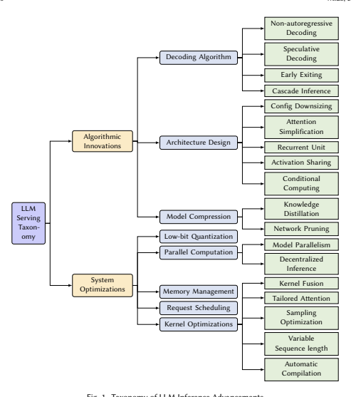
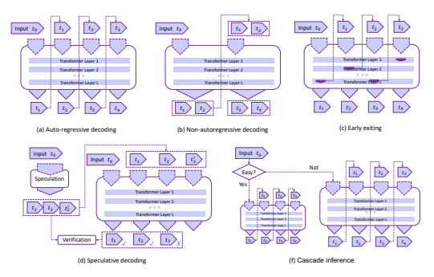
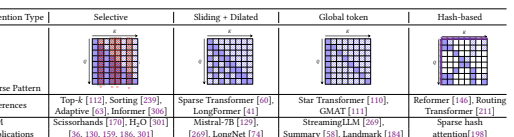

# Towards Efficient Generative Large Language Model Serving: A Survey From Algorithms To Systems

XUPENG MIAO, Carnegie Mellon University, USA
GABRIELE OLIARO, Carnegie Mellon University, USA
ZHIHAO ZHANG, Carnegie Mellon University, USA
XINHAO CHENG, Carnegie Mellon University, USA
HONGYI JIN, Carnegie Mellon University, USA
TIANQI CHEN, Carnegie Mellon University, USA
ZHIHAO JIA, Carnegie Mellon University, USA
In the rapidly evolving landscape of artificial intelligence (AI), generative large language models (LLMs)
stand at the forefront, revolutionizing how we interact with our data. However, the computational intensity and memory consumption of deploying these models present substantial challenges in terms of serving efficiency, particularly in scenarios demanding low latency and high throughput. This survey addresses the imperative need for efficient LLM serving methodologies from a machine learning system (MLSys) research perspective, standing at the crux of advanced AI innovations and practical system optimizations. We provide in-depth analysis, covering a spectrum of solutions, ranging from cutting-edge algorithmic modifications to groundbreaking changes in system designs. The survey aims to provide a comprehensive understanding of the current state and future directions in efficient LLM serving, offering valuable insights for researchers and practitioners in overcoming the barriers of effective LLM deployment, thereby reshaping the future of AI.

CCS Concepts: - Computing methodologies → Machine learning; **Parallel computing methodologies**;
Natural language processing; - General and reference → Surveys and overviews; - **Hardware** →
Analysis and design of emerging devices and systems; Emerging technologies; - **Computer systems**
organization → Architectures; - Software and its engineering → **Operating systems**.

Additional Key Words and Phrases: large language model, efficiency, algorithm, system, inference, serving ACM Reference Format: Xupeng Miao, Gabriele Oliaro, Zhihao Zhang, Xinhao Cheng, Hongyi Jin, Tianqi Chen, and Zhihao Jia. 2018.

Towards Efficient Generative Large Language Model Serving: A Survey from Algorithms to Systems. *J. ACM*
37, 4, Article 111 (August 2018), 32 pages. https://doi.org/XXXXXXX.XXXXXXX

## 1 Introduction

Generative large language models (LLMs) have become a driving force behind significant advancements in artificial intelligence (AI) and have demonstrated exceptional performance across a wide range of language-related tasks. From machine translation to sentiment analysis, question answering, and text generation, these models have shown their prowess in understanding, generating, Authors' addresses: Xupeng Miao, xupeng@cmu.edu, Carnegie Mellon University, USA; Gabriele Oliaro, goliaro@cs.cmu.edu, Carnegie Mellon University, USA; Zhihao Zhang, zhihaoz3@cs.cmu.edu, Carnegie Mellon University, USA; Xinhao Cheng, xinhaoc@andrew.cmu.edu, Carnegie Mellon University, USA; Hongyi Jin, hongyij@cs.cmu.edu, Carnegie Mellon University, USA; Tianqi Chen, tqchen@cmu.edu, Carnegie Mellon University, USA; Zhihao Jia, zhihao@cmu.edu, Carnegie Mellon University, USA.

Permission to make digital or hard copies of all or part of this work for personal or classroom use is granted without fee provided that copies are not made or distributed for profit or commercial advantage and that copies bear this notice and the full citation on the first page. Copyrights for components of this work owned by others than ACM must be honored.

Abstracting with credit is permitted. To copy otherwise, or republish, to post on servers or to redistribute to lists, requires prior specific permission and/or a fee. Request permissions from permissions@acm.org.

© 2018 Association for Computing Machinery.

0004-5411/2018/8-ART111 $15.00 https://doi.org/XXXXXXX.XXXXXXX
111 and manipulating human languages. The advent of Transformer-based architectures, such as GPTfamily (Generative Pre-trained Transformer) [195], LLaMA-family [247], and other latest public LLMs (e.g., OPT [300], BLOOM [260], Mistral [129], DeciLM [241], Baichuan [277], GLM [290]) has played a pivotal role in this paradigm shift, revolutionizing the way natural language processing
(NLP) tasks are approached. Beyond NLP, these models are also transforming a wider range of applications, including automated programming [54], science discovery [135], personalized digital assistants [75], creative arts [208], and next-generation computing architecture [197], demonstrating their versatility and profound impact across various industries.

However, the unprecedented success of LLMs has also given rise to several challenges, most notably, their formidable computational requirements during serving. The immense model size and complexity, coupled with the need for extensive computational resources, have impeded their widespread deployment in real-world applications. The resource-intensive nature of these models raises concerns over energy consumption, scalability, and accessibility, hindering their adoption in broader communities without rich compute resources like large companies.

This survey paper aims to address the critical need for efficient LLM serving and presents an exhaustive exploration of the existing multifaceted strategies proposed by the research community to tackle this challenge. We present an in-depth examination of the entire spectrum of solutions, spanning from algorithmic innovations to novel system architectures, all aimed at optimizing the inference process for large language models.

## 1.1 Objectives

The primary objective of this survey is to provide a comprehensive overview of the latest advancements in LLM serving and inference. We will systematically review and categorize the existing techniques based on their underlying approaches, highlighting their strengths and limitations. The survey will cover a broad range of methodologies, encompassing decoding algorithm, architecture design, model compression, low-bit quantization, parallel computation, memory management, request scheduling, and kernel optimization.

## 1.2 Structure

The paper is structured as follows: Section 2 introduces the background information about LLM
serving. Section 3 includes our taxonomy of existing approaches on efficient LLM serving and revisits these related works from two aspects: algorithmic innovations (§ 3.1) and system optimizations
(§ 3.2). After that, we list some representative LLM serving frameworks and provide analysis in Section 4. Section 5 discusses benchmarks of LLM serving systems. Section 6 clarifies the connection between this survey and other related literature. Finally, we propose some promising exploration directions in Section 7 for improving generative LLM serving efficiency to motivate future research.

## 2 Background 2.1 Transformer-Based Llm

Transformer-based Large Language Models (LLMs) have marked a significant shift in the field of natural language processing, introducing a new paradigm for understanding and generating human language. Central to this innovation is the Transformer architecture, which is built upon the concept of self-attention mechanisms [253], allowing the model to weigh the importance of different parts of the input data when making predictions. Mathematically, the self-attention mechanism in Transformers can be described as follows: For an input sequence  = [1, 2*, ...,* ],
the Transformer computes a set of queries , keys  and values  using linear transformations of
. The self-attention scores are then computed as:

Attention($Q,K,V$) = softmax $\left(\frac{QK^{T}}{\sqrt{d_{k}}}\right)V$
$$\left(1\right)$$

where  is the dimension of the keys. This mechanism allows the model to focus on different parts of the input sequence for each element of the output, capturing complex dependencies regardless of their distance in the input sequence.

Another important structure in Transformers is the Feed-Forward Network (FFN), which is present in each layer of the Transformer and significantly contributes to its computational intensity.

The FFN typically consists of two linear transformations with a non-linear activation function in between, usually represented as:
FFN() = max(0, 1 + 1)2 + 2 (2)
Here, 1, 2, 1, and 2 are learnable parameters of the FFN, and the non-linear function max(0, ·)
(ReLU, in this case) introduces the necessary non-linearity into the model, allowing it to learn more complex patterns. The FFN is responsible for a significant portion of the model's parameter count and, consequently, its memory footprint and computational load. In each Transformer layer, after the multi-head attention (MHA) aggregates information from different parts of the input, the FFN
processes this aggregated information independently for each position. This parallel processing capability is a key strength of the Transformer, allowing it to handle sequences effectively. However, it also means that the computational load and memory requirements scale with the length of the input sequence and the depth of the network.

The combination of self-attention and FFN in Transformer-based LLMs enables these models to capture a wide range of linguistic contexts and nuances, setting new benchmarks in various NLP tasks. However, the substantial computational requirements for training and inference have become a critical area of research, focusing on optimizing these aspects without significantly compromising performance. The Transformer model also includes other key components like position encoding, which adds information about the position of each token in the sequence, and the multi-head attention mechanism, which allows the model to focus on different parts of the sequence in different representational spaces.

## 2.2 Gpus And Other Accelerators

The rapid advancement of LLMs owes much to the evolution of GPU architecture and other accelerators, which are integral to enhancing model performance and efficiency. GPUs (Graphics Processing Units) have emerged as a cornerstone in this field, primarily due to their superior parallel processing capabilities. Unlike traditional CPUs, which are designed for sequential processing, GPUs consist of thousands of small, efficient cores designed for handling multiple tasks simultaneously.

This makes them exceptionally well-suited for the matrix and vector operations that are ubiquitous in deep learning computations, especially for Transformer-based models.

A typical GPU architecture comprises an array of Streaming Multiprocessors (SMs), each containing several cores that share a common instruction unit but can execute independent threads in parallel. Additionally, the shared memory (SRAM) within each SM allows for efficient data exchange and synchronization among threads, significantly optimizing the memory access patterns required in LLM computations. This design is particularly beneficial for the computationally intensive tasks in LLMs, such as the calculations of self-attention and feed-forward networks in Transformers.

GPUs also come equipped with high-bandwidth memory (HBM), which allows for faster data transfer rates, significantly reducing the bottleneck associated with memory access during large-scale computations. Moreover, the latest GPU architectures, such as NVIDIA's Ampere and Hopper architectures, continue to offer enhancements and push the boundaries of LLM computation, such as improved memory bandwidth and capacity, higher floating-point operations per second (FLOPS),
specialized mixed-precision computing units (i.e., Tensor Core) and more efficient utilization of resources, further accelerating the performance of LLMs. Some of them support various precision formats, including FP32 (32-bit floating point), TF32 (TensorFloat-32), FP16 (16-bit floating point), BF16 (Brain Floating Point), and even INT8/INT4, allowing for flexible trade-offs between computational speed and numerical precision, essential in optimizing LLM performance.

Beyond GPUs, a vast array of hardware platforms have been explored for LLM deployment, encompassing CPUs [19, 222], mobile and edge devices [71], ASICs [202, 307], as well as specialized accelerators such as TPUs [136], FPGAs [284], and other emerging AI chips from various manufacturers (e.g., Apple M2 Ultra [151], AWS Inferentia [6], SambaNova [28], Cerebras [73], Graphcore IPUs [16]). This survey primarily underscores research anchored in the use of GPUs, and several technical motivations drive this emphasis. Due to their architectural innovations and superior computational power, GPUs have dominated the research area of large-scale deep learning in the past few years [42]. Furthermore, the programming languages of GPUs, like NVIDIA's CUDA and AMD's ROCm, facilitate a fine-grained control over thread hierarchies, allowing researchers to exploit the massive parallelism inherent in GPUs. It attracts numerous developers to build mature software ecosystems on top of these GPUs, fostering a majority of the seminal and advanced LLM research. While other hardware platforms indeed bring unique strengths to specific contexts, the vast reservoir of research, development, and deployment centered around GPUs makes them an indispensable reference for an in-depth comprehension of LLM inference methodologies. Considering the hardware similarities, other hardware platforms can also benefit from the design philosophies, insights, and methodologies discussed in this survey.

## 2.3 Llm Inference

LLM inference, particularly in models like GPT (Generative Pre-trained Transformer), often employs an auto-regressive decoding approach. This method is central to how these models generate text, ensuring that each new word or token produced takes into account the entire sequence generated so far. Auto-regressive decoding operates under the principle of sequentially predicting the next token in a sequence, given all the previous ones, as shown in Algorithm 1.

## Algorithm 1 Auto-Regressive Decoding For Llm Inference

1: Initialize the input sequence 0 with a given context or start token 2: for  = 1 to  do 3: Predict the next token  = argmax

 (|−1)
4: Update the input sequence  = −1 ⊕ 
5: if is EOS **then**
6: **break**
Here,  (|−1) represents the probability of the next token  given the current sequence −1, and
⊕ denotes the concatenation operation. The argmax function is used to select the most probable next token at each step.

This auto-regressive approach is fundamental in LLM inference for generating coherent and contextually appropriate text. It ensures that each token generated is conditioned on a comprehensive understanding of all previously generated content, allowing LLMs to produce highly relevant and fluent text sequences. Prior studies have provided in-depth analysis on the algorithmic intensity of Transformer-based LLM inference (e.g., counting the FLOPS, I/O and memory consumption) and extensive empirical results on cost estimation (e.g., modeling the inference latency [50]) according to the auto-regressive decoding algorithm execution. The optimization of LLM inference is a complex problem as there can be different optimal strategies with different algorithm configurations and system setups.

## 2.4 Challenges

This section describes a variety of challenges for efficient LLM serving.

- *Latency and Response Time*. Efficient large language model inference requires achieving low-latency and fast response times, especially in real-time applications like chatbots, virtual assistants, and interactive systems. Balancing model complexity with inference speed is a critical challenge that necessitates optimizing algorithms and system architectures to minimize response time without compromising accuracy.

- *Memory Footprint and Model Size*. Large language models come with significant memory requirements due to their size and the vast number of parameters they contain. Deploying such models on memory-constrained devices poses a challenge, demanding the development of effective model compression techniques and system optimizations to reduce memory footprint without sacrificing performance.

- *Scalability and Throughput*. Inference systems often face varying levels of request loads in production environments. Ensuring scalability and high throughput to handle multiple simultaneous requests efficiently requires parallel computation, request scheduling, and other system-level optimizations to distribute computational workload effectively across resources.

- *Hardware Compatibility and Acceleration*. Efficiently leveraging hardware resources is crucial for large language model inference. Adapting LLM models to diverse hardware platforms and architectures, including CPUs, GPUs, and specialized accelerators, demands hardware-aware algorithm design and optimization to exploit the full potential of the underlying hardware.

- *Trade-offs between Accuracy and Efficiency*. Optimizing the efficiency of LLM inference may sometimes involve trade-offs with model accuracy. Striking the right balance between model size, computational complexity, and performance is a challenging task that requires careful consideration and evaluation of various algorithmic and system-level techniques.

## 3 Taxonomy

Existing efforts on improving the LLM serving efficiency can be broadly classified into two categories, including algorithmic innovations and system optimizations, which will be discussed individually.

## 3.1 Algorithmic Innovation

This section presents a comprehensive analysis of the various algorithms and techniques proposed to optimize language model inference efficiency. These works are proposed to address the native performance flaws of large-scale Transformer models through algorithmic advancements.

3.1.1 Decoding Algorithm. In this section, we review novel decoding algorithms as shown in Figure 2 that optimize the inference process of LLMs. These algorithms seek to reduce computational complexity and enhance the overall efficiency of language model inference during generation tasks.

- **Non-autoregressive decoding**. A major limitation of existing LLMs is the default autoregressive decoding mechanism, which *sequentially* generates output tokens one by one. To

111:6 Miao, et al.

address this issue, one representative line of work is to abandon the autoregressive generation paradigm and decode the output tokens*in parallel*. Non-autoregressive decoding [97, 104, 108]
is first proposed for machine translation acceleration by breaking the word dependencies during decoding and assuming a certain degree of conditional independence. To alleviate the translation quality reduction, some follow-up studies like semi-autoregressive decoding [98],
further extend these non-autoregressive methods to reach auto-regressive model quality by modeling output dependencies [105, 294] or iteratively refining output tokens [152].

Blockwise parallel decoding [230] inserts a single feedforward layer to the base LLM to make predictions for multiple future positions in parallel, then backs off to the longest prefix validated by the base model. However, these approaches require to costly reproduce a new LLM with the new dependencies or tune partial layers of the original LLM, which are not always possible. Some recent efforts have been dedicated to generate multiple tokens at one Towards Efficient Generative Large Language Model Serving: A Survey from Algorithms to Systems 111:7 

 

decoding step without any training or modification to the model. Parallel decoding [217]
reframes the greedy auto-regressive decoding as a system of nonlinear equations solvable in parallel leveraging Jacobi and Gauss-Seidel fixed-point iteration methods for fast inference.

A thorough survey on non-autoregressive translation [271] has been proposed to summarize the recent advances in this direction. Until now, due to the unawareness of the conditional dependence between output tokens, the output quality of most of non-autoregressive methods has been still less reliable than the auto-regressive method despite an improvement in decoding speed.

- **Speculative decoding**. Another line of work addresses the sequential execution limitation by leveraging *speculative execution* [47] and improving decoding parallelism. Each decoding step during the autoregressive LLM inference process can be treated as the execution of a program with conditional branches, such as deciding which token to generate next. Speculative decoding [51, 155] has been proposed to make decoding predictions of multiple steps first in an efficient manner (e.g., using a smaller draft model with fewer model parameters)
and verify these predictions simultaneously with the LLM. However, there are still several practical challenges remaining when applying speculative decoding to LLMs, e.g., how to make decoding predictions light-weight and accurate enough and how to achieve efficient parallel verification using LLMs. SpecInfer [177] first addresses these challenges by introducing multiple small draft models coupled with a novel tree-based speculative inference and token verification mechanism (which are directly adopted by [48, 118, 168, 185, 229, 236, 274, 310])
and proposes a low-latency LLM serving system implementation (§ 4). The main advantage of speculative decoding is that it increases the parallelism without any changes to the outputs. Such guarantee comes from the fact that the predicted output is always verified by the original LLM and the fallback mechanism [145] takes effect when prediction goes wrong.

- **Early exiting**. Some other studies attempt to utilize the deep multi-layer architecture of existing LLMs and leverage the *early exiting* [243] mechanism to accelerate the decoding process. The intuition is that the output of early model layers has the potential to infer the target distribution confidently. They can emit predictions based on internal classifiers instead of running the whole LLM, and various exit conditions have been explored [117, 147, 163, 167, 234, 272, 282, 291, 308]. They are also called by *adaptive computation* [68, 219] since they adjust the amount of computation per request to amortize the total inference cost, i.e.,
taking less computation for easier inference requests. Broadly, these approaches are mostly restricted to the insufficient information carried by internal representations and may not faithfully making accurate predictions.

- **Cascade inference** Driven by the varying complexities of inference requests, cascade inference employs a suite of LLMs of differing scales to minimize response time. Instead of directly using a massive model for every query, CascadeBERT [157] involves a series of internal classifiers corresponding to different model depths, organizes them in a cascading manner and adaptively selects proper ones based on the instance difficulty. Tabi [257] optimizes for serving discriminative models (i.e., not generative LLMs), but it takes a similar approach to incorporate small models and LLMs to handle queries with different confidence. FrugalGPT [53] leverages a learning-based approach to adaptively assign queries to different LLM
APIs, optimizing both cost and performance. A concurrent work [312] jointly optimizes model multiplexing and query caching and also analyzes the optimality of minimizing inference cost.

Mixture-of-thought [288] extends the cascade idea to LLM reasoning tasks for cost-saving, which samples answers from both Chain-of-Thought [258] and Program-of-Thought [57]
prompts. Overall, cascade inference is a promising direction for enhanced inference efficiency, but it is still challenging to design an accurate dispatching mechanism to avoid compromising model quality.

3.1.2 Architecture Design. This subsection explores innovative architecture designs tailored for large language models. Researchers have proposed novel model architectures [115] beyond the original Transformer that strike a balance between model size, performance, and efficiency, opening new avenues for faster and resource-efficient inference.

- **Configuration downsizing**: To reduce the computation cost of LLM inference, a straightforward approach is to downsize the model configurations, such as using shallow encoders [101, 183] or decoders [137], weight sharing, and vocabulary shrinking [225]. However, reducing the number of model parameters also affects the downstream tasks' performance.

- **Attention simplification**: One prominent challenge associated with self-attention calculations is the computational complexity O (
2), which scales quadratically with the input sequence length . Numerous Transformer variants [240] have been proposed to simplify the standard attention into more efficient alternatives for very long sequence tasks, such as sparsification [289], kernelization [139], and factorization [254]. Recently, there is a trend of borrowing the ideas from prior attention simplification approaches, generalizing and combining them to shorten the context and reduce the size of KV cache, as well as the attention complexity, with slightly decoding quality degradation (e.g., sliding window attention [129, 299], hash-based attention [198], dilated attention [74]). One category of these approaches is *context compression* by compressing the context into fewer *soft* tokens (e.g.,
replacing with summary tokens [58] or landmark tokens [184], leveraging additional autoencoder schemes [95, 169]) or directly dropping or rephrasing unimportant context tokens based on different importance guidance [85, 130, 159, 186] (or called *semantic compression*).

For example, adaptively sparse attention [36] takes a learning-based approach to eliminate Table 1. Comparisons of attention simplification methods in prior efficient Transformers and recent LLMs.

 

uninformative context tokens dynamically for each token. Scissorhands [170] and H2O [301]
select a few important tokens that might have a substantial influence for future decoding process and save their KV cache. StreamingLLM [269] values the initial tokens and maintains them with the sliding window, which is also similar to prior work [41]. FastGen [94] allows different attention heads to employ different emphasizing patterns adaptively. Table 1 illustrates the sparse attention patterns of four representative categories of approaches and their applications. However, due to the incomplete context, these approaches may face inevitable information loss in real workloads with more complex attention distributions.

- **Activation sharing**: Another direction is sharing the intermediate activations to improve the attention calculation efficiency. Attention sharing approaches [160, 263, 270] observe the similarity among different layers' attention matrix distribution and reuse these attention matrices to reduce the computation costs. Multi-query attention (MQA) [220] makes different heads share a single set of keys and values to reduce the memory bandwidth requirements in the incremental inference. Group-query attention (GQA) [32] relaxes the single set of keys and values restriction to multiple sets and each set is coupled with a group of queries. They have been successfully adopted by several recent public LLMs and shown their superior performance, including MQA-based models such as Falcon [315], PaLM [62], ChatGLM26B [7] and GQA-based models like LLaMA-2 [247] and Mistral-7B [129].

- **Conditional computing**: The sparsely-activated Mixture of Experts (MoE) [64, 221] paradigm partitions a model's capacity across various "experts", which are smaller neural networks, each specializing in different subsets of the data. It allows the system to only invoke the necessary experts for a given input based on certain routing mechanisms [83, 154, 192, 210, 218, 309],
rather than computing over the entire massive model, yielding computational and memory efficiency [77]. For example, TaskMoE [148] illustrates that task-level routing enables model increase capacity compared with token-level counterpart, while improving the inference throughput. As LLMs continue to grow, the MoE architecture stands out as a promising avenue to ensure both scalability and efficiency for future LLMs. In the meanwhile, the dynamic nature of MoEs also demands special system optimization from both distributed communication [116, 122, 123, 156, 193, 207] and GPU kernel implementation [93, 305] to facilitate MoE inference efficiency.

- **Recurrent unit**: Although recurrent neural networks (RNN) (e.g., LSTM [212]) tend to struggle with capturing long-term dependencies in sequences [141], there are still several approaches using recurrent units to replace Transformer modules and achieve linear computational and memory complexity during inference, such as RWKV [200] and RetNet [235].

Specifically, unlike prior approaches, these recent explorations are mostly built on the linear attention (i.e., Linear Transformer [139], Attention Free Transformer [292]) representation.

After the reformation, they overcome the O (
2) bottleneck of attention by modeling interactions between tokens with linear recurrence units (e.g., state space models [91, 102, 103, 176],
LRU [196]), which are easier to maintain parallelizable training property. Their design is also composed of various position encoding modules [231], exponential decay mechanisms [194]
and a stack of token-wise non-linear MLPs [245, 286] or GLUs [67] to improve the model representation capability. Recently, they have shown promising results on both model performance and computation efficiency. However, whether recurrent units can successfully replace Transformers for LLMs still remains an open problem (i.e., especially for long sequences).

3.1.3 Model Compression. Here, we delve into techniques for model compression, which aim to reduce the memory footprint and computational requirements of LLMs by creating more efficient and compact models without significant loss in performance.

- **Knowledge Distillation**: One line of work is knowledge distillation, which trains a small student model with the supervision from a large teacher model. Most previous approaches in this direction are exploring white-box distillation [106, 133, 214, 233, 255], which require accessing the entire teacher model parameters. Due to the arising of API-based LLM services (e.g., ChatGPT), several black-box distilled models attract lots of attention, such as Alpaca [238], Vicuna [59], WizardLM [273] and so on [201, 313]. These models usually have fewer model parameters but have shown promising performance on various downstream tasks compared with the original LLMs (e.g., GPT-4 [195]).

- **Network pruning**: Network pruning methods [180, 215, 215] have been extensively studied in the past few years but not all of them can be directly applied to LLMs. It is imperative to take into account the potentially exorbitant computational costs associated with retraining, as well as assess whether the pruning yields discernible gains in inference efficiency based on the underlying system's implementation. Some recent approaches [80, 149, 174, 216]
apply structural pruning methods on LLMs, which removes entire structured LLM components, facilitating efficient GPU speedups. For example, Deja Vu [172] cuts off specific attention heads and MLP parameters guided by the contextual sparsity hypothesis without modifying pre-trained models. There are also some recent advancements in unstructured methods [40, 87, 232, 251, 276], which usually achieve 50-60% sparsity for LLM compression.

It is noteworthy that they can further generalize to semi-structured N:M sparsity (i.e., 2:4 and 4:8) [182], leading to significant inference speedup with NVIDIA sparse tensor cores' acceleration. LoSparse [161] and DSFormer [49] approximate model weights with a small dense and a sparse semi-structured matrix using low-rank factorization. Flash-LLM [267] relaxes this requirement by providing a memory-efficient SpMM implementation for unstructured pruning using tensor cores. PowerInfer [228] assumes skew access of these sparsely-activated neurons and proposes a GPU-CPU hybrid inference engine, making GPU and CPU handle different neurons.

## 3.2 System Optimization

This section investigates LLM inference system optimization techniques to accelerate LLM inference without modifying the LLM computation semantics. The goal of this line of work is to improve the system efficiency by refining the underlying systems and frameworks used for large language model inference.

3.2.1 Low-bit Quantization. This section explores state-of-the-art low-bit quantization techniques that enable efficient representation of model weights and activations. By using fewer bits (i.e., less than 32) to represent numerical values, these methods significantly reduce memory consumption and accelerate inference on hardware platforms. One line of approach is to quantize LLM, and these quantization methods can be briefly categorized into two directions: Quantization-Aware Training (QAT) and Post-Training Quantization (PTQ) [280]. PTQ reduces the computational precision of model weights [69, 71, 88, 89, 125, 164] and even activations [268, 281, 287] into either INT8 or INT4 by using custom CUDA kernels [158, 199] or compilations [302] for efficiency benefits, such as W8A16 (i.e., INT8 weight-only quantization and FP16 or BF16 activations), W4A16 in GPTQ [88], W8A8 in SmoothQuant [268] and W4A4 [266]. The evolution of hardware also meets these requirements. One supporting evidence is that NVIDIA's recent architectures like Turing and Ampere have included INT8 and INT4 tensor cores, and the latest Hopper architecture has disabled INT4 support but introduced FP8 tensor cores for better numerical precision (e.g.,
H100 GPU can reach 60× TFLOPS for FP8 as opposed to FP32). Existing approaches usually adopt various quantization functions, including uniform methods (i.e., Round-to-Nearest) and non-uniform methods [143]. To relieve the performance loss from low-precision, QAT integrates quantization during model training [70, 171]. It is worth noting that due to challenges in the underlying system implementation, low-precision quantization methods may potentially result in slower inference speeds compared to conventional precision levels such as FP16 [69]. While low-precision methods significantly reduce the resource requirements for model deployment, there is also research indicating that quantization methods can have a notable impact on the model's inference performance due to the presence of scaling laws [72]. In addition, quantization has also been applied to context compression (e.g., CacheGen [169]) and memory-efficient fine-tuning (e.g.,
QLoRA [70], PEQA [142]), resulting in lower memory consumption for LLM inference.

3.2.2 Parallel Computation. This section examines parallel computation strategies tailored for large language models. Leveraging parallel processing capabilities of modern hardware architectures, these methods distribute computation across multiple cores or devices, leading to substantial speedup during inference.

- **Model parallelism**: Most model parallelism approaches are first proposed for distributed training of large-scale DNNs, especially for Transformer-based models. For example, tensor model parallelism [227] (TP) splits the model layers (e.g., attention, FFN) into multiple pieces from internal dimensions (e.g., head, hidden) and deploys each on a separate device (e.g., GPU).

It can significantly reduce inference latency through parallel computing, which is widely used for multiple GPUs within the same machine, especially for scenarios with high-speed NVLink connections. PaLM inference [203] extends TP on large-scale Transformer inference by involving 2D tensor parallelism [252] and claims lower theoretical communication complexity for large clusters (more than 256 devices). For multi-query attention with only one head for keys and values, it further involves data parallelism to the hybrid tensor partition strategy. Pipeline model parallelism [189] (PP) arranges the model layers in a sequence across multiple devices. Each device is responsible for a pipeline stage that consists of multiple consecutive model layers. While PP can significantly increase the number of inputs processed per unit of time (throughput), it doesn't inherently decrease the time taken to process a single input from beginning to the end (latency) like TP. Sequence parallelism (SP) has various differentiated designs and implementations, but its key idea for LLM inference is to distribute the computational and storage load by splitting the processing of long sequences across multiple GPUs along the sequence length dimension [165]. Different parallelism techniques introduce varying degrees of communication overhead and computational latency [124]. To achieve optimal performance and resource utilization, automatic parallelism has been widely studied by prior approaches for distributed training (e.g., Alpa [303], FlexFlow [128, 250], Galvatron [179]). By replacing their cost model to fit the predictable runtime of auto-regressive inference of Transformer models like [190], it's easy to apply previous automatic searching algorithms (e.g.,
dynamic programming, integer linear programming) to LLM serving (e.g., AlpaServe [162],
FlexFlow-Serve [12], SpotServe [178]) and determine the most efficient parallelism strategy without manual intervention. There are also some approaches [34, 35, 109, 177, 224] enabling offloading techniques to use larger but slower memory (e.g., CPU DRAM) to save model parameters and KV cache in addition to the limited device memory (e.g., GPU DRAM).

- **Decentralized inference**: This line of approach involves a combination of model and data parallelism where multiple decentralized voluntary nodes collaborate to process data and infer outputs. This approach can be particularly useful in scenarios where hardware resources are geographically distributed. Inspired by crowdsourced computing, Petals [44] serves a BLOOM176B model using collaborated commodity GPUs over the Internet. Decentralized inference opens up a new direction on unlocking the overlooked consumer-level GPUs for running LLMs, but also suffers from several practical challenges, such as device heterogeneity [132],
limited computational and memory capacity, low-bandwidth network [45], fault tolerance and privacy protection [237].

3.2.3 Memory Management. Efficient memory management remains at the forefront of challenges in LLM serving, especially given the inherent memory-intensive nature of transformer architectures.

With the growing need for long-sequence inference, the memory footprint of the KV cache stands out as a prime optimization target compared with model weights and the necessary workspace for other activations. As the KV cache memory grows and shrinks dynamically and unpredictably during incremental decoding, the naive approach (e.g., FasterTransformer) pre-allocates a contiguous piece of memory with a maximum sequence length assumption. It wastes memory severely for 1) input batches with varied request lengths and 2) complex decoding scenarios generating multiple output sequences in parallel (e.g., beam search, parallel decoding). vLLM [150] proposes *paged attention* that partitions the KV cache into non-contiguous memory blocks and significantly improves the batch size as well as throughput. SpecInfer [177] proposes *tree attention* and *depth-first tree* traversal to eliminate redundant KV cache allocation for multiple output sequences sharing the same prefix. LightLLM [21] takes a more granular token-level memory management mechanism to further diminish memory usage. However, the overheads of such fragmented memory managing mechanisms pose new challenges. Especially for cases where other optimizations are employed to boost the batch size, these fine-grained memory management methods might offer only marginal throughput benefits while substantially amplifying the inference latency. It's evident that memory reduction in LLM inference is intricately tied with other algorithmic innovations and system-level optimizations. While some might work well for specific workloads, they might counteract one another, leading to a degraded overall performance. Striking the right balance between memory efficiency and computational performance of LLM inference systems remains an open and pressing challenge in the field.

3.2.4 Request Scheduling. Efficiently scheduling incoming inference requests is crucial for optimizing LLM serving. This section reviews request scheduling algorithms that maximize resource utilization, guarantee response time within latency service level objective (SLO), and handle varying request loads effectively. Request scheduling for LLM serving shares commonalities with general ML serving techniques, as both aim to efficiently manage incoming requests and optimize resource utilization. These common aspects include dynamic batching [33], preemption [114], priority [191], swapping [39], model selection [107], cost efficiency [295], load balancing and resource allocation [259]. However, LLM serving also introduces unique challenges due to its distinctive characteristics, such as the massive model size, iterative autoregressive decoding mechanism, unknown variable output length and state management for context information.

Early LLM serving systems (e.g., FasterTransformer over NVIDIA Triton) only support requestlevel scheduling which is similar to prior approaches. Orca [285] first notices the gap between generative LLMs and the request-level scheduling of previous ML inference systems. Considering the variable output sequence length, it schedules the execution of the engine at the granularity of iteration with a first-come-first-serve (FCFS) order and enables batching a selected set of operations for better hardware utilization. Plenty of following approaches inherit the *selective-batching* and iteration-level scheduling policy, such as *continuous batching* in vLLM and RayLLM [27] and *inflight batching* in TensorRT-LLM [25]. Moreover, SpecInfer extends to speculative decoding by iteratively selecting a batch of requests to perform one iteration of speculative inference and verification. FastServe [261] concentrates on the job completion time (JCT) and involves iterationlevel preemption to prioritize requests with shorter input length, instead of FCFS. SARATHI [31]
targets the pipeline bubbles in distributed inference caused by the initial iteration of varying length input requests. To saturate the GPU compute, it splits the input prompts into uniform chunks and piggybacks the chunk slot with other requests' decoding iterations if possible, which is also adopted by DeepSpeed-FastGen called Dynamic SplitFuse [9]. S3[134] involves an output sequence length predictor and helps to schedule more concurrent requests within the GPU memory constraint for larger batch size and higher inference throughput.

3.2.5 Kernel Optimization. In this subsection, we delve into kernel-level optimizations, which target the performance of specific operations within the language model inference pipeline. These optimizations leverage hardware-specific features and software techniques to accelerate critical computation kernels.

- **Kernel fusion**: To reduce overheads from kernel launching and memory accessing, kernel fusion is widely adapted by previous DNN frameworks and compilers. Since the backward computation is not required for LLM inference, more kernel fusion chances exist. Several contemporary Transformer inference engines (e.g., FasterTransformer [2], TenTrans [262], TurboTransformers [82], LightSeq [256], ByteTransformer [293]) and compilers (e.g. Welder [226])
propose to fuse 1) GEMMs with the same shape (e.g., the three linear transformations for query, key and value) and 2) Add Bias with the other non-GEMM kernels, such as residual connection, layer normalization and activation functions (e.g., ReLU). Among these, the optimization of fused multi-head attention kernel has been extensively explored and will be discussed in the following aspect.

- **Tailored attention**: To make the attention operations run efficiently on a GPU, customizing or tailoring the GPU kernels specifically for the attention calculation is crucial. For example, cuDNN has provided a fused multi-head attention kernel API [23]. Meanwhile, several implementations have been open-sourced for more performance gains. These can be roughly classified into two categories due to the special autoregressive decoding mechanism. One is for the first iteration (i.e., the initial/prefill/context/prompt phase), which processes all tokens from the input prompt in parallel. For example, xFormers [153] extends the online softmax trick [61, 181, 206] to the whole attention calculation using CUTLASS [24]. The other is for the following iterations (i.e., the incremental/decode/generation phase) and the kernel only generates one output token per iteration. For autoregressive decoding, a common practice is to save the previously computed keys and values so that only a single query is required to compute when generating a new token instead of rerunning the entire sequence. The main direction of optimizations in this field is maximizing thread occupancy and minimizing the on-device high-bandwidth memory (HBM) access (i.e., using shared memory or registers [55]).

They usually parallelize across the batch size and number of heads dimension (e.g., FasterTransformer) to distribute workloads. Some further enable parallelizing the sequence length dimension by partitioning the KV cache into chunks but require reducing the chunk-wise results at last, such as FlashDecoding [249]. A subsequent work FlashDecoding++ [120]
removes such synchronization for partial softmax by introducing a unified maximum value known in advance. It is necessary to select the appropriate parallel dimension based on the workloads for better thread utilization.

- **Sampling optimization**: The sampling algorithm selection can greatly influence the LLM
generation quality. The default greedy sampling always picks the token with the highest probability. Parallel sampling techniques, such as beam search, decode the approximate optimal sequences efficiently by maintaining a fixed number (i.e., beam width) of top-scoring sequences every iteration. A variety of *stochastic sampling* techniques (e.g., top- [81], top-
 [119], temperature controlling [140]) have been propose to introduce randomness for more diverse outputs. However, they are still suffering from several practical system challenges.

One is the increased memory pressure from redundant KV cache (§3.2.3), and another is the sampling efficiency issue attributed by the large vocabulary of LLM (i.e., tens of thousands). For example, LightSeq [256] provides an efficient hierarchical implementation that divides the vocabulary into  groups, retrieves candidates within each group using a few GPU instructions and then re-ranks these candidates to obtain the top- tokens.

- **Variable sequence length**: Another unique challenge of LLM inference is that the sequences can vary in both input length and output length, and the latter is unknown in advance. One way to speed up inference is to process multiple sequences in a batch at once (§3.2.4).

However, when a batch of sequences has variable input lengths, padding is often used to make them all the same length for batch processing, wasting computational and memory resources. To alleviate some of these inefficiencies, various strategies can be employed. Packing technique [1, 293] stores the sequences into a continuous memory space without padding and only unpacks before attention calculation. Ragged tensor [84] further supports computation with minimal padding using compiler-generated kernels. Bucketing the sequence into a smaller computation granularity (e.g., chunks [76]) is also a possible solution to alleviate memory usage of padding tokens. Due to the mixed execution of the initial phase and incremental phase, bucketing input prompts [31] also brings new challenges to the memory management and request scheduling (§ 3.2.4).

- **Automatic compilation**: Most existing LLM inference systems utilize vendor-specific libraries as their backend, such as cuBLAS, cuDNN and CUTLASS, which provide optimized kernel implementations. To further improve the inference efficiency, they also take great efforts on optimizing manually-written kernels for specific LLM operators (e.g., attention)
over NVIDIA GPUs. Despite of these work, the trend of using automated DNN compilers still exists, such as TVM (i.e., Unity [213], Relax [151] and TensorIR [86, 283]), MLIR [138],
JAX [90], OpenAI Triton [244], TASO [127] and TorchInductor [264]. The compilation approach can help discover potentially more efficient operator implementations (e.g., expression derivation [304]), and more importantly, facilitate adaptation to alternative hardware platforms, including mobile and edge devices, CPUs, DL accelerators, and other types of GPUs
(e.g., AMD GPUs and Apple M2 Ultra).

## 4 Software Frameworks

Generative LLM serving requires a full stack of optimizations and many recent works have started to develop software frameworks to provide efficient LLM inference deployment service. In the

| Name          | Parallel                       | Iteration                                 | Attention   | Prioritized   |         |                              |                                                              |                                                       |               |
|---------------|--------------------------------|---------------------------------|-------------|---------------|---------|------------------------------|--------------------------------------------------------------|-------------------------------------------------------|---------------|
| Github        | Computation                    | Kernel                          | Opt. Target |               |         |                              |                                                              |                                                       |               |
| Ref.          | TP                             | PP                              | Offload     | Sche.         | Initial | Incremental                  | 𝐿𝑎𝑡                                                       | 𝑇𝑝𝑡                                                | Main Features |
| FasterTransformer [2]               | √                              | √                               | cuBLAS      | Fused         | √       | - Manually-written kernel    |                                                              |                                                       |               |
| GEMM          | attention                      | - Lightweight runtime           |             |               |         |                              |                                                              |                                                       |               |
| FlexFlowServe [12]               | √                              | √                               | √           | √             | cuBLAS  | Tree                         | √                                                            | - SpecInfer [177]                                     |               |
| GEMM          | attention                      | - Extremely low 𝐿𝑎𝑡          |             |               |         |                              |                                                              |                                                       |               |
| vLLM [29]     | √                              | √                               | √           | xFormers      | Paged   | √                            | - Block-level KV cache [150] - Enlarging batch size & 𝑇𝑝𝑡 |                                                       |               |
| attention     |                                |                                 |             |               |         |                              |                                                              |                                                       |               |
| FlexGen [13]  | √                              | √                               | torch.      | torch.        | √       | - CPU&Disk Offload [224]     |                                                              |                                                       |               |
| bmm           | bmm                            | - Maximizing single GPU 𝑇𝑝𝑡  |             |               |         |                              |                                                              |                                                       |               |
| TGI [18]      | √                              | √                               | Flash       | Paged         | √       | - Huggingface integration    |                                                              |                                                       |               |
| attention     | attention                      |                                 |             |               |         |                              |                                                              |                                                       |               |
| DeepSpeedInference [3]               | √                              | √                               | cuBLAS      | cuBLAS        | √       | - Kernel auto-injection [10] |                                                              |                                                       |               |
| GEMM          | GEMM                           | - Multi-GPU & Multi-Node        |             |               |         |                              |                                                              |                                                       |               |
| ZeRO               |                                |                                 |             |               |         |                              |                                                              |                                                       |               |
| Inference [3] | √                              | √                               | √           | cuBLAS        | √       | - CPU&NVMe Offload [35]      |                                                              |                                                       |               |
| cuBLAS        | - Maximizing single GPU 𝑇𝑝𝑡 |                                 |             |               |         |                              |                                                              |                                                       |               |
| GEMM          | GEMM                           |                                 |             |               |         |                              |                                                              |                                                       |               |
| Light               |                                |                                 |             |               |         |                              |                                                              |                                                       |               |
| LLM [21]      | √                              | √                               | Flash       | Token         | √       | - Token-level KV cache       |                                                              |                                                       |               |
| attention     | attention                      | - Enlarging batch size & 𝑇𝑝𝑡 |             |               |         |                              |                                                              |                                                       |               |
| MLC               |                                |                                 |             |               |         |                              |                                                              |                                                       |               |
| LLM [242]     | √                              | √                               | compiled    | Paged         | √       | - Universal deployment       |                                                              |                                                       |               |
| MatMul        | attention                      | - Multiple types of GPUs        |             |               |         |                              |                                                              |                                                       |               |
| TensorRTLLM [25]               | √                              | √                               | √           | √             | cuBLAS/ | Paged                        | √                                                            | - NVIDIA Triton integration - Rich features supported |               |
| Flash-attn    | attention                      |                                 |             |               |         |                              |                                                              |                                                       |               |

Table 2. Comparison of state-of-the-art open-sourced GPU-based LLM serving systems.

following, we revisit these systems and investigate a comprehensive analysis of several representative open-sourced GPU-based LLM serving systems in Table 2. The analysis does not contain some popular related projects, including 1) specialized solutions for other hardware (e.g., PopTransformer [17], CTranslate2 [8], lammap.cpp and ggml [14]) and 2) deployment solutions built on top of the other systems, like OpenLLM [26] (vLLM), xinference [30] (ggml + vLLM + xFormers), LMDeploy [20] (FasterTransformer), gpt-fast [15] (PyTorch), DeepSpeed-MII and DeepSpeed-FastGen [11]
(DeepSpeed-Inference), and RayLLM and RayServe [27] (vLLM).

We compare these state-of-the-art LLM serving systems and summarize their differences in several aspects. First, most of these systems support tensor parallelism to enable multi-GPU inference and improve the system performance. And some of them future support pipeline parallelism or offloading to support inference over multi-node or resource-constrained environments individually.

Second, partial systems learn from Orca and implement the iteration-level scheduling. Third, we investigate the attention kernels of these systems and introduce their implementations in terms of the initial and incremental phases respectively. For the initial phase, they usually adapt a batched general matrix multiply (GEMM) approach (e.g., cuBLAS, torch, Relay) and some utilize the online softmax trick to reduce HBM access (e.g., Flash-attention, xFormers). The incremental phase is more challenging because the per-token generation scheme results in lower computational intensity. To improve the GPU utilization, FasterTransformer manually fuses the attention calculations (e.g.,
linear projection, positional bias, dot product, softmax, etc) into a single high-performance kernel template and involves several kernel optimization techniques, such as caching with shard memory, warp-shuffle instruction for reduction, half matrix multiplication and accumulation (HMMA) with tensor core and multiple-precision support. FlexFlow-Serve enables speculative decoding and provides a tree-based parallel decoding kernel to verify the speculated tokens from multiple sequences
(i.e., from multiple small models or different beams or parallel sampling) with zero-memory redundancy and maximum thread parallelism. vLLM extends the fused mutli-head attention (MHA)
kernel from from FasterTransformer by partitioning the KV cache into pages to eliminate redundant memory usage, especially for parallel sampling scenarios. LightLLM takes a follow-up approach by partitioning the KV cache into more fine-grained token-wise pieces.

Note that, there still remain some other notable aspects that are not covered by the above discussions. For example, even for the most popular Flash and Paged attention kernels, they are usually implemented in different ways across these systems. TGI directly imports the original Flash/Paged attention libraries, LightLLM adopts kernels implemented by OpenAI Triton, MLC-LLM
generates kernels by TVM, and TensorRT-LLM modifies from FasterTransformer's fused attention kernel to support paged attention. Another example is about the input-aware kernel selection. For the initial phase, TensorRT-LLM selects from cuBLAS and Flash attention based on the context length. Besides the attention calculation, for the linear projection operators, there is also a recent trend of replacing GEMM with general matrix-vector product (GEMV) to handle the cases of small batch size (i.e., 1) more efficiently. And these systems also have many other different features, such as programming language (i.e., C++, Python), low-precision support (i.e., FP16, INT8), supported hardware and models. In summary, these different choices of design and implementation are largely determined by their prioritized optimization target. For example, vLLM proposes paged attention to improve the batch size for higher *throughput* (), while FlexFlow-Serve leverages SpecInfer to accelerate decoding for lower *latency* (). Basically, low latency and high throughput are dual optimization targets in LLM serving systems, representing complementary but often conflicting objectives, necessitating a balanced strategy to optimize the trade-off between rapid response for individual tasks and maximizing the volume of tasks processed over a specified time frame. Some recent studies [66] further decompose the response latency by TTFT+TPOT × output sequence length, where TTFT represents *Time To First Token* and TPOT represents *Time Per Output Token*.

The former is driven by the initial phase processing speed while the latter directly depends on per-iteration execution time during incremental decoding. Distinguishing these two metrics is beneficial to LLM service providers, leading to different system design choices and user experience
(e.g., faster application responsiveness [169], longer prompts [9]). Besides, reducing the *monetary* cost is also an important and practical objective for the design and implementation of some LLM
serving systems [178]. Although it unlikely to have a one-size-fits-all solution, we believe that future LLM serving systems will continually integrate these differentiated features, thereby continuously improving system efficiency and hardware utilization.

## 5 Benchmarks

Building a comprehensive and reproducible benchmark for comparing the performance of various LLM serving system like MLPerf [209] is a critical endeavor for both academic and industrial communities in this field. It will not only help LLM users select the right system solutions but also encourage researchers and developers to keep pace with the advanced optimizations. Unfortunately, despite of some prior reports [5, 22], up to this point, the community has not yet launched a convincing enough benchmark that takes into account all influencing factors. This is mainly because of the numerous evaluation settings, including model configuration, hardware environment, and request load, among others. Testing under a limited number of setting combinations cannot yield conclusions with credibility. For example, certain system optimization techniques can only achieve performance advantages under high or low load conditions, and conversely, they might even be detrimental. Besides, when measuring inference latency, how to exclude additional overheads not related to GPU inference (such as request scheduling overhead, inherent network latency, etc.) due to differences in system design is also a challenging topic. Additionally, a fair benchmark test needs to consider the strict alignment of model output content, which is often overlooked in many tests.

## 6 Connection With Other Surveys

Our survey on efficient generative LLM serving and inference complements and extends the scope of existing literature in the field, while maintaining a distinct focus. Among the related works,
[144] comes closest in subject matter exploring the design of more general Transformer models and domain-specific accelerators. However, our survey differentiates itself by focusing specifically on generative LLM serving, a nuanced area that has not been the central focus of other studies.

Moreover, some studies delve into experimental investigations of LLM inference efficiency on GPUs [190, 297] and novel accelerators [78], offering valuable empirical insights that are directly relevant to our focus on serving efficiency. Additionally, LLMCarbon [79] addresses an increasingly important aspect of LLM deployment - its environmental impact (e.g., carbon footprints). While our survey's primary focus is efficiency from a performance standpoint, the environmental lens provided by such studies is undeniably relevant and respected in our broader discussion. Some surveys and benchmarks [126] offer valuable insights into model compression [113, 248, 314, 314]
and quantization [99, 280]. These studies lay a groundwork that indirectly supports our exploration of related directions. Some studies [65, 187] provide essential context for understanding LLM
effectiveness (e.g., accuracy, perplexity, factuality and so on), which is beyond the scope of this survey. Our survey also acknowledges the contributions of prior surveys [42, 175] focusing on distributed training of large-scale DNN models, as they inform the backdrop against which LLM
serving must be considered. In essence, our survey situates itself amidst a diverse array of studies, drawing from and contributing to a more holistic understanding of LLM serving efficiency, including both algorithmic innovations and system optimizations. By integrating insights from these various areas, we aim to provide a nuanced and comprehensive overview of the latest advancements and challenges in the field.

## 7 Future Direction

As we stand at the forefront of LLM advancements, it becomes increasingly important to not only understand the current state of these technologies but also to anticipate and shape their future trajectory. Particularly in the realm of generative LLM serving, there is a vast landscape of unexplored possibilities and emerging challenges. The rapid evolution of this field necessitates a forward-looking approach, where identifying potential avenues for innovation and improvement is crucial. This foresight not only prepares us to adapt to upcoming technological shifts but also guides the research community toward addressing the most pertinent and impactful areas. In this context, we outline several promising directions for future research and development, each offering the potential to significantly enhance the efficiency of serving generative LLMs.

- *Development and Enhancement of Hardware Accelerators*. Future progress in enhancing generative LLM serving efficiency could be significantly driven by the development and refinement of specialized hardware accelerators, complemented by a co-design approach that aligns hardware and software optimizations. For instance, integrating memory closer to processing units or optimizing chip architectures to better align with the data flow of LLM algorithms can lead to substantial reductions in latency and energy consumption. This approach has been exemplified in recent GPU
advancements, like NVIDIA's Hopper architecture [4], which demonstrates improvements in HBM
and SRAM capacity, memory bandwidth, computing units and bisection bandwidth, directly benefiting the processing of LLMs. Continued innovation in this area could involve designing hardware that is inherently tuned to the computational patterns of generative LLMs, such as optimizing for the specific demands of attention mechanisms and tensor operations that are prevalent in these models, eventually influencing the design and implementation of LLM serving systems.

- *Efficient and Effective Decoding Algorithms*. The development of more efficient decoding algorithms could substantially improve serving efficiency. Motivated by the demand for more resource-efficient ways to utilize the vast knowledge encapsulated within LLMs, future work could explore alternative approaches to the traditional auto-regressive methods and unlock the generation speed for real-time applications while maintaining the decoding quality. One promising direction is *generalized speculative inference* as it enables preserving the same generation quality.

Specifically, the small speculative model can be generalized to any other forms of methods that can generate draft tokens more efficiently than LLMs, such as knowledge retriever and user-defined functions [177, 278]. For example, some subsequent works arose recently, replacing the draft model with early exiting [37, 121, 279, 296] or non-autoregressive decoding [92, 96]. In summary, the development of efficient decoding algorithms like speculative decoding coupled with the underlying system optimizations represents a significant opportunity to enhance the serving efficiency of generative LLMs.

- *Long Context/Sequence Scenarios Optimization*. As the application of LLMs continues to expand into more sophisticated scenarios, the demand for processing longer contexts or sequences is steadily growing. Serving LLMs with long-sequence workloads requires resolving the challenges from both the algorithm and system sides. In terms of LLMs, they often suffer from *length generalization failure* when sequences get longer than what was observed during training [204] even enabling relative positional encoding [56] or after fine-tuning on longer corpora [38]. Even for some models that claim to support ultra-long contexts, studies have found that they encounter a situation of "loss in the middle" [166]. Current approaches attempt to alleviate such limitations by reducing the computational sequence length while preserving relevant information, such as retrieval augmentation [275], sequence compression [131] and caching [100]. For the LLM serving systems, longer sequence brings critical challenges, including more memory consumption and access of KV cache and quadratic increasing computational complexity of self-attention.

- *Investigating Alternative Architectures*. Although Transformer models and self-attention mechanisms currently dominate the landscape of LLMs, exploring alternative architectures is a promising direction for future research. The field of DL has historically seen a constant alternation of dominant architectures, with each new paradigm shift bringing about significant advancements.

Given this trend, it's important to consider other architectural approaches that could offer distinct advantages, especially for improved computational efficiency. For instance, some recent studies explore *attention-free* methods [46], using pure MLP (Multi-Layer Perceptron) architectures to replace attention mechanisms. The evolution of DNN model architecture is not only a natural progression, but also a necessary exploration to uncover more efficient and effective ways of structuring LLMs.

- *Exploration of Deployment in Complex Environments*. As the application of LLMs expands, a crucial future direction involves exploring and optimizing their deployment across various complex environments. This exploration goes beyond traditional cloud-based deployments to include scenarios like edge computing, hybrid computing (combining cloud and edge computing), decentralized computing, and the utilization of more affordable resources like spot instances. Each of these environments presents unique challenges and opportunities for LLM serving. For instance, edge computing allows for faster response times and reduced bandwidth usage by processing data closer to the source, but it also poses challenges in terms of limited computational resources and storage capacity. Hybrid computing [205] offers a balanced approach but requires advanced management Towards Efficient Generative Large Language Model Serving: A Survey from Algorithms to Systems 111:19 to distribute computational tasks efficiently. Decentralized computing presents a promising avenue for crowdsourcing computational resources, but it also brings additional considerations regarding data privacy and security [173, 298]. LLM serving over preemptive resources [178] can significantly reduce monetary costs but requires fault tolerance mechanisms to handle their inherent unpredictability and variability, ensuring consistent performance and system reliability. Successfully navigating the challenges from these complex environments will be key for more robust, scalable, and efficient LLM applications.

- *Automatic Adaptation to Specific Requirements*. The diverse application-specific requirements create a wide range of innovative LLM serving optimization opportunities, such as parameterefficient fine-tuning [52, 223, 311], retrieval from external vector storage [43], online learning and knowledge updates, multi-modal workloads, and chaining together different LLMs' capabilities [265].

These unique challenges also demand automatic and smooth integration of LLM serving techniques into existing IT infrastructures by extending the optimization space to the whole LLM lifetime, including data acquisition and processing, AutoML [246] and model management [188], resource allocations, and performance monitoring.

## 8 Conclusion

Efficient LLM serving is a fundamental step towards democratizing access to advanced AI technologies. This survey aims to provide researchers, practitioners, and developers with a comprehensive understanding of the existing methodologies, enabling them to make informed decisions when deploying LLMs in real-world environments. By consolidating the latest research findings on algorithms and systems, this survey paper hopes to accelerate progress and foster innovation in the pursuit of highly efficient LLM serving solutions.

## References

[1] 2020. NVIDIA Effective Transformer. https://github.com/bytedance/effective_transformer. Commit: e406421, Accessed on: 2023-11-25.

[2] 2021. NVIDIA FasterTransformer. https://github.com/NVIDIA/FasterTransformer. Commit: df4a753, Accessed on:
2023-11-25.

[3] 2022. DeepSpeed Inference. https://github.com/microsoft/DeepSpeed. Commit: 2afa1c7, Accessed on: 2023-11-25.

[4] 2022. NVIDIA H100 Tensor Core GPU Architecture. https://resources.nvidia.com/en-us-tensor-core/gtc22whitepaper-hopper. Accessed on: 2023-11-25.

[5] 2023. AnyScale LLMPerf leaderboard. https://github.com/ray-project/llmperf-leaderboard. Accessed on: 2023-12-23.

[6] 2023. AWS Inferentia. https://aws.amazon.com/blogs/machine-learning/deploy-large-language-models-on-awsinferentia2-using-large-model-inference-containers/.

[7] 2023. ChatGLM2-6B. https://huggingface.co/THUDM/chatglm2-6b.

[8] 2023. CTranslate2. https://github.com/OpenNMT/CTranslate2. Commit: d963499, Accessed on: 2023-11-25.

[9] 2023. DeepSpeed-FastGen. https://github.com/microsoft/DeepSpeed/tree/master/blogs/deepspeed-fastgen. Accessed on: 2023-11-25.

[10] 2023. DeepSpeed-Inference v.s. ZeRO-Inference. https://github.com/microsoft/DeepSpeed/issues/4234. Accessed on:
2023-11-25.

[11] 2023. DeepSpeed-MII. https://github.com/microsoft/DeepSpeed-MII. Commit: f34b772, Accessed on: 2023-11-25.

[12] 2023. FlexFlow-Serve. https://github.com/Flexflow/FlexFlow/tree/inference. Commit: 672cdad, Accessed on: 2023-1125.

[13] 2023. FlexGen. https://github.com/FMInference/FlexGen. Commit: d34f7b4, Accessed on: 2023-11-25.

[14] 2023. ggml. https://github.com/ggerganov/ggml. Commit: a5e4560, Accessed on: 2023-11-25. [15] 2023. gpt-fast. https://github.com/pytorch-labs/gpt-fast. Commit: 8c8c463, Accessed on: 2023-12-23.

[16] 2023. Graphcore. https://www.graphcore.ai/posts/dolly-2.0-open-source-language-model-with-chatgpt-likeinteractivity.

[17] 2023. Graphcore PopTransformer. https://github.com/graphcore/PopTransformer. Commit: 1314598, Accessed on:
2023-11-25.

[18] 2023. Huggingface Text Generation Inference. https://github.com/huggingface/text-generation-inference. Commit:
3c02262, Accessed on: 2023-11-25.

[19] 2023. Intel Extension for Transformers. https://github.com/intel/intel-extension-for-transformers. Commit: 37d4007, Accessed on: 2023-12-23.

[20] 2023. InterLM LMDeploy. https://github.com/InternLM/lmdeploy. Commit: c07f60f, Accessed on: 2023-11-25.

[21] 2023. LightLLM. https://github.com/ModelTC/lightllm. Commit: 84671a7, Accessed on: 2023-11-25.

[22] 2023. Llama-v2-7b benchmark. https://hamel.dev/notes/llm/inference/03_inference.html. Accessed on: 2023-11-25.

[23] 2023. NVIDIA cuDNN MultiHeadAttn. https://docs.nvidia.com/deeplearning/cudnn/api/index.html\#
cudnnMultiHeadAttnForward. Accessed on: 2023-11-25.

[24] 2023. NVIDIA CUTLASS. https://github.com/NVIDIA/cutlass. Commit: b5d8a5d, Accessed on: 2023-11-25. [25] 2023. NVIDIA TensorRT-LLM. https://github.com/NVIDIA/TensorRT-LLM. Commit: 6837c81, Accessed on: 2023-1125.

[26] 2023. OpenLLM. https://github.com/bentoml/OpenLLM. Commit: b4ea4b3, Accessed on: 2023-11-25.

[27] 2023. RayLLM. https://github.com/ray-project/ray-llm. Commit: fa3a766, Accessed on: 2023-11-25.

[28] 2023. Sambanova. https://sambanova.ai/press/sambanova-unveils-new-chip-the-sn40l/. [29] 2023. vLLM. https://github.com/vllm-project/vllm. Commit: 7c60044, Accessed on: 2023-11-25.

[30] 2023. Xorbits Inference (Xinference). https://github.com/xorbitsai/inference. Commit: 22732d8, Accessed on:
2023-11-25.

[31] Amey Agrawal, Ashish Panwar, Jayashree Mohan, Nipun Kwatra, Bhargav S Gulavani, and Ramachandran Ramjee. 2023. SARATHI: Efficient LLM Inference by Piggybacking Decodes with Chunked Prefills. arXiv preprint arXiv:2308.16369 (2023).

[32] Joshua Ainslie, James Lee-Thorp, Michiel de Jong, Yury Zemlyanskiy, Federico Lebrón, and Sumit Sanghai. 2023. GQA:
Training Generalized Multi-Query Transformer Models from Multi-Head Checkpoints. *arXiv preprint arXiv:2305.13245* (2023).

[33] Ahsan Ali, Riccardo Pinciroli, Feng Yan, and Evgenia Smirni. 2020. Batch: machine learning inference serving on serverless platforms with adaptive batching. In SC20: International Conference for High Performance Computing, Networking, Storage and Analysis. IEEE, 1–15.

[34] Keivan Alizadeh, Iman Mirzadeh, Dmitry Belenko, Karen Khatamifard, Minsik Cho, Carlo C Del Mundo, Mohammad Rastegari, and Mehrdad Farajtabar. 2023. LLM in a flash: Efficient Large Language Model Inference with Limited Memory. *arXiv preprint arXiv:2312.11514* (2023).

[35] Reza Yazdani Aminabadi, Samyam Rajbhandari, Minjia Zhang, Ammar Ahmad Awan, Cheng Li, Du Li, Elton Zheng, Jeff Rasley, Shaden Smith, Olatunji Ruwase, et al. 2022. Deepspeed inference: Enabling efficient inference of transformer models at unprecedented scale. *arXiv preprint arXiv:2207.00032* (2022).

[36] Sotiris Anagnostidis, Dario Pavllo, Luca Biggio, Lorenzo Noci, Aurelien Lucchi, and Thomas Hoffmann. 2023. Dynamic Context Pruning for Efficient and Interpretable Autoregressive Transformers. *arXiv preprint arXiv:2305.15805* (2023).

[37] Sangmin Bae, Jongwoo Ko, Hwanjun Song, and Se-Young Yun. 2023. Fast and Robust Early-Exiting Framework for Autoregressive Language Models with Synchronized Parallel Decoding. *arXiv preprint arXiv:2310.05424* (2023).

[38] Yushi Bai, Xin Lv, Jiajie Zhang, Hongchang Lyu, Jiankai Tang, Zhidian Huang, Zhengxiao Du, Xiao Liu, Aohan Zeng, Lei Hou, et al. 2023. LongBench: A Bilingual, Multitask Benchmark for Long Context Understanding. *arXiv preprint* arXiv:2308.14508 (2023).

[39] Zhihao Bai, Zhen Zhang, Yibo Zhu, and Xin Jin. 2020. {PipeSwitch}: Fast pipelined context switching for deep learning applications. In *14th USENIX Symposium on Operating Systems Design and Implementation (OSDI 20)*. 499–514.

[40] Peter Belcak and Roger Wattenhofer. 2023. Exponentially Faster Language Modelling. *arXiv preprint arXiv:2311.10770*
(2023).

[41] Iz Beltagy, Matthew E Peters, and Arman Cohan. 2020. Longformer: The long-document transformer. *arXiv preprint* arXiv:2004.05150 (2020).

[42] Tal Ben-Nun and Torsten Hoefler. 2019. Demystifying parallel and distributed deep learning: An in-depth concurrency analysis. *ACM Computing Surveys (CSUR)* 52, 4 (2019), 1–43.

[43] Sebastian Borgeaud, Arthur Mensch, Jordan Hoffmann, Trevor Cai, Eliza Rutherford, Katie Millican, George Bm Van Den Driessche, Jean-Baptiste Lespiau, Bogdan Damoc, Aidan Clark, et al. 2022. Improving language models by retrieving from trillions of tokens. In *International conference on machine learning*. PMLR, 2206–2240.

[44] Alexander Borzunov, Dmitry Baranchuk, Tim Dettmers, Max Ryabinin, Younes Belkada, Artem Chumachenko, Pavel Samygin, and Colin Raffel. 2022. Petals: Collaborative inference and fine-tuning of large models. *arXiv preprint* arXiv:2209.01188 (2022).

[45] Alexander Borzunov, Max Ryabinin, Artem Chumachenko, Dmitry Baranchuk, Tim Dettmers, Younes Belkada, Pavel Samygin, and Colin Raffel. 2023. Distributed Inference and Fine-tuning of Large Language Models Over The Internet. arXiv preprint arXiv:2312.08361 (2023).

Towards Efficient Generative Large Language Model Serving: A Survey from Algorithms to Systems 111:21
[46] Vukasin Bozic, Danilo Dordevic, Daniele Coppola, and Joseph Thommes. 2023. Rethinking Attention: Exploring Shallow Feed-Forward Neural Networks as an Alternative to Attention Layers in Transformers. arXiv preprint arXiv:2311.10642 (2023).

[47] F Warren Burton. 1985. Speculative computation, parallelism, and functional programming. *IEEE Trans. Comput.* 100, 12 (1985), 1190–1193.

[48] Tianle Cai, Yuhong Li, Zhengyang Geng, Hongwu Peng, and Tri Dao. 2023. Medusa: Simple framework for accelerating llm generation with multiple decoding heads. https://github.com/FasterDecoding/Medusa. Commit: dd9c8a5, Accessed on: 2023-11-25.

[49] Rahul Chand, Yashoteja Prabhu, and Pratyush Kumar. 2023. DSFormer: Effective Compression of Text-Transformers by Dense-Sparse Weight Factorization. *arXiv preprint arXiv:2312.13211* (2023).

[50] Carol Chen. 2022. Transformer Inference Arithmetic. https://kipp.ly/blog/transformer-inference-arithmetic/. Accessed on: 2023-11-25.

[51] Charlie Chen, Sebastian Borgeaud, Geoffrey Irving, Jean-Baptiste Lespiau, Laurent Sifre, and John Jumper. 2023.

Accelerating large language model decoding with speculative sampling. *arXiv preprint arXiv:2302.01318* (2023).

[52] Lequn Chen, Zihao Ye, Yongji Wu, Danyang Zhuo, Luis Ceze, and Arvind Krishnamurthy. 2023. Punica: Multi-Tenant LoRA Serving. *arXiv preprint arXiv:2310.18547* (2023).

[53] Lingjiao Chen, Matei Zaharia, and James Zou. 2023. FrugalGPT: How to Use Large Language Models While Reducing Cost and Improving Performance. *arXiv preprint arXiv:2305.05176* (2023).

[54] Mark Chen, Jerry Tworek, Heewoo Jun, Qiming Yuan, Henrique Ponde de Oliveira Pinto, Jared Kaplan, Harri Edwards, Yuri Burda, Nicholas Joseph, Greg Brockman, et al. 2021. Evaluating large language models trained on code. *arXiv* preprint arXiv:2107.03374 (2021).

[55] Shiyang Chen, Shaoyi Huang, Santosh Pandey, Bingbing Li, Guang R Gao, Long Zheng, Caiwen Ding, and Hang Liu.

2021. Et: re-thinking self-attention for transformer models on gpus. In Proceedings of the International Conference for High Performance Computing, Networking, Storage and Analysis. 1–18.

[56] Shouyuan Chen, Sherman Wong, Liangjian Chen, and Yuandong Tian. 2023. Extending context window of large language models via positional interpolation. *arXiv preprint arXiv:2306.15595* (2023).

[57] Wenhu Chen, Xueguang Ma, Xinyi Wang, and William W Cohen. 2022. Program of thoughts prompting: Disentangling computation from reasoning for numerical reasoning tasks. *arXiv preprint arXiv:2211.12588* (2022).

[58] Alexis Chevalier, Alexander Wettig, Anirudh Ajith, and Danqi Chen. 2023. Adapting Language Models to Compress Contexts. *arXiv preprint arXiv:2305.14788* (2023).

[59] Wei-Lin Chiang, Zhuohan Li, Zi Lin, Ying Sheng, Zhanghao Wu, Hao Zhang, Lianmin Zheng, Siyuan Zhuang, Yonghao Zhuang, Joseph E. Gonzalez, Ion Stoica, and Eric P. Xing. 2023. Vicuna: An Open-Source Chatbot Impressing GPT-4 with 90%* ChatGPT Quality. https://lmsys.org/blog/2023-03-30-vicuna/
[60] Rewon Child, Scott Gray, Alec Radford, and Ilya Sutskever. 2019. Generating long sequences with sparse transformers.

arXiv preprint arXiv:1904.10509 (2019).

[61] Jaewan Choi, Hailong Li, Byeongho Kim, Seunghwan Hwang, and Jung Ho Ahn. 2022. Accelerating transformer networks through recomposing softmax layers. In 2022 IEEE International Symposium on Workload Characterization
(IISWC). IEEE, 92–103.

[62] Aakanksha Chowdhery, Sharan Narang, Jacob Devlin, Maarten Bosma, Gaurav Mishra, Adam Roberts, Paul Barham, Hyung Won Chung, Charles Sutton, Sebastian Gehrmann, et al. 2022. Palm: Scaling language modeling with pathways. arXiv preprint arXiv:2204.02311 (2022).

[63] Gonçalo M Correia, Vlad Niculae, and André FT Martins. 2019. Adaptively Sparse Transformers. In *Proceedings of the* 2019 Conference on Empirical Methods in Natural Language Processing and the 9th International Joint Conference on Natural Language Processing (EMNLP-IJCNLP). 2174–2184.

[64] Róbert Csordás, Piotr Piękos, and Kazuki Irie. 2023. SwitchHead: Accelerating Transformers with Mixture-of-Experts Attention. *arXiv preprint arXiv:2312.07987* (2023).

[65] Fahim Dalvi, Maram Hasanain, Sabri Boughorbel, Basel Mousi, Samir Abdaljalil, Nizi Nazar, Ahmed Abdelali, Shammur Absar Chowdhury, Hamdy Mubarak, Ahmed Ali, et al. 2023. LLMeBench: A Flexible Framework for Accelerating LLMs Benchmarking. *arXiv preprint arXiv:2308.04945* (2023).

[66] Databricks. 2023. LLM Inference Performance Engineering: Best Practices. https://www.databricks.com/blog/llminference-performance-engineering-best-practices Accessed on: 2023-11-25.

[67] Yann N Dauphin, Angela Fan, Michael Auli, and David Grangier. 2017. Language modeling with gated convolutional networks. In *International conference on machine learning*. PMLR, 933–941.

[68] Luciano Del Corro, Allie Del Giorno, Sahaj Agarwal, Bin Yu, Ahmed Awadallah, and Subhabrata Mukherjee. 2023.

SkipDecode: Autoregressive Skip Decoding with Batching and Caching for Efficient LLM Inference. arXiv preprint arXiv:2307.02628 (2023).

[69] Tim Dettmers, Mike Lewis, Younes Belkada, and Luke Zettlemoyer. 2022. LLM.int8(): 8-bit Matrix Multiplication for Transformers at Scale. *arXiv preprint arXiv:2208.07339* (2022).

[70] Tim Dettmers, Artidoro Pagnoni, Ari Holtzman, and Luke Zettlemoyer. 2023. Qlora: Efficient finetuning of quantized llms. *arXiv preprint arXiv:2305.14314* (2023).

[71] Tim Dettmers, Ruslan Svirschevski, Vage Egiazarian, Denis Kuznedelev, Elias Frantar, Saleh Ashkboos, Alexander Borzunov, Torsten Hoefler, and Dan Alistarh. 2023. SpQR: A Sparse-Quantized Representation for Near-Lossless LLM
Weight Compression. *arXiv preprint arXiv:2306.03078* (2023).

[72] Tim Dettmers and Luke Zettlemoyer. 2022. The case for 4-bit precision: k-bit Inference Scaling Laws. arXiv preprint arXiv:2212.09720 (2022).

[73] Nolan Dey, Gurpreet Gosal, Hemant Khachane, William Marshall, Ribhu Pathria, Marvin Tom, Joel Hestness, et al.

2023. Cerebras-GPT: Open compute-optimal language models trained on the Cerebras wafer-scale cluster. arXiv preprint arXiv:2304.03208 (2023).

[74] Jiayu Ding, Shuming Ma, Li Dong, Xingxing Zhang, Shaohan Huang, Wenhui Wang, and Furu Wei. 2023. Longnet:
Scaling transformers to 1,000,000,000 tokens. *arXiv preprint arXiv:2307.02486* (2023).

[75] Xin Luna Dong, Seungwhan Moon, Yifan Ethan Xu, Kshitiz Malik, and Zhou Yu. 2023. Towards Next-Generation Intelligent Assistants Leveraging LLM Techniques. In *Proceedings of the 29th ACM SIGKDD Conference on Knowledge* Discovery and Data Mining. 5792–5793.

[76] Jiangsu Du, Jiazhi Jiang, Jiang Zheng, Hongbin Zhang, Dan Huang, and Yutong Lu. 2023. Improving Computation and Memory Efficiency for Real-world Transformer Inference on GPUs. *ACM Transactions on Architecture and Code* Optimization 20, 4 (2023), 1–22.

[77] Nan Du, Yanping Huang, Andrew M Dai, Simon Tong, Dmitry Lepikhin, Yuanzhong Xu, Maxim Krikun, Yanqi Zhou, Adams Wei Yu, Orhan Firat, et al. 2022. Glam: Efficient scaling of language models with mixture-of-experts. In International Conference on Machine Learning. PMLR, 5547–5569.

[78] Murali Emani, Sam Foreman, Varuni Sastry, Zhen Xie, Siddhisanket Raskar, William Arnold, Rajeev Thakur, Venkatram Vishwanath, and Michael E Papka. 2023. A Comprehensive Performance Study of Large Language Models on Novel AI Accelerators. *arXiv preprint arXiv:2310.04607* (2023).

[79] Ahmad Faiz, Sotaro Kaneda, Ruhan Wang, Rita Osi, Parteek Sharma, Fan Chen, and Lei Jiang. 2023. LLMCarbon:
Modeling the end-to-end Carbon Footprint of Large Language Models. *arXiv preprint arXiv:2309.14393* (2023).

[80] Angela Fan, Edouard Grave, and Armand Joulin. 2019. Reducing Transformer Depth on Demand with Structured Dropout. In *International Conference on Learning Representations*.

[81] Angela Fan, Mike Lewis, and Yann Dauphin. 2018. Hierarchical Neural Story Generation. In Proceedings of the 56th Annual Meeting of the Association for Computational Linguistics (Volume 1: Long Papers). 889–898.

[82] Jiarui Fang, Yang Yu, Chengduo Zhao, and Jie Zhou. 2021. Turbotransformers: an efficient gpu serving system for transformer models. In *Proceedings of the 26th ACM SIGPLAN Symposium on Principles and Practice of Parallel* Programming. 389–402.

[83] William Fedus, Barret Zoph, and Noam Shazeer. 2022. Switch transformers: Scaling to trillion parameter models with simple and efficient sparsity. *The Journal of Machine Learning Research* 23, 1 (2022), 5232–5270.

[84] Pratik Fegade, Tianqi Chen, Phillip Gibbons, and Todd Mowry. 2022. The CoRa tensor compiler: Compilation for ragged tensors with minimal padding. *Proceedings of Machine Learning and Systems* 4 (2022), 721–747.

[85] Weizhi Fei, Xueyan Niu, Pingyi Zhou, Lu Hou, Bo Bai, Lei Deng, and Wei Han. 2023. Extending Context Window of Large Language Models via Semantic Compression. *arXiv preprint arXiv:2312.09571* (2023).

[86] Siyuan Feng, Bohan Hou, Hongyi Jin, Wuwei Lin, Junru Shao, Ruihang Lai, Zihao Ye, Lianmin Zheng, Cody Hao Yu, Yong Yu, et al. 2023. Tensorir: An abstraction for automatic tensorized program optimization. In *Proceedings of* the 28th ACM International Conference on Architectural Support for Programming Languages and Operating Systems, Volume 2. 804–817.

[87] Elias Frantar and Dan Alistarh. 2023. SparseGPT: Massive Language Models Can Be Accurately Pruned in One-Shot.

(2023).

[88] Elias Frantar, Saleh Ashkboos, Torsten Hoefler, and Dan Alistarh. 2022. Gptq: Accurate post-training quantization for generative pre-trained transformers. *arXiv preprint arXiv:2210.17323* (2022).

[89] Elias Frantar, Saleh Ashkboos, Torsten Hoefler, and Dan Alistarh. 2022. OPTQ: Accurate quantization for generative pre-trained transformers. In *The Eleventh International Conference on Learning Representations*.

[90] Roy Frostig, Matthew James Johnson, and Chris Leary. 2018. Compiling machine learning programs via high-level tracing. *Systems for Machine Learning* 4, 9 (2018).

[91] Daniel Y Fu, Tri Dao, Khaled Kamal Saab, Armin W Thomas, Atri Rudra, and Christopher Re. 2022. Hungry Hungry Hippos: Towards Language Modeling with State Space Models. In The Eleventh International Conference on Learning Representations.

Towards Efficient Generative Large Language Model Serving: A Survey from Algorithms to Systems 111:23
[92] Yichao Fu, Peter Bailis, Ion Stoica, and Hao Zhang. 2023. Breaking the Sequential Dependency of LLM Inference Using Lookahead Decoding. https://lmsys.org/blog/2023-11-21-lookahead-decoding/
[93] Trevor Gale, Deepak Narayanan, Cliff Young, and Matei Zaharia. 2023. MegaBlocks: Efficient Sparse Training with Mixture-of-Experts. *Proceedings of Machine Learning and Systems* 5 (2023).

[94] Suyu Ge, Yunan Zhang, Liyuan Liu, Minjia Zhang, Jiawei Han, and Jianfeng Gao. 2023. Model Tells You What to Discard:
Adaptive KV Cache Compression for LLMs. In *Workshop on Advancing Neural Network Training: Computational* Efficiency, Scalability, and Resource Optimization (WANT@ NeurIPS 2023).

[95] Tao Ge, Jing Hu, Xun Wang, Si-Qing Chen, and Furu Wei. 2023. In-context autoencoder for context compression in a large language model. *arXiv preprint arXiv:2307.06945* (2023).

[96] Tao Ge, Heming Xia, Xin Sun, Si-Qing Chen, and Furu Wei. 2022. Lossless acceleration for Seq2seq generation with aggressive decoding. *arXiv preprint arXiv:2205.10350* (2022).

[97] Marjan Ghazvininejad, Omer Levy, Yinhan Liu, and Luke Zettlemoyer. 2019. Mask-Predict: Parallel Decoding of Conditional Masked Language Models. In Proceedings of the 2019 Conference on Empirical Methods in Natural Language Processing and the 9th International Joint Conference on Natural Language Processing (EMNLP-IJCNLP). 6112–6121.

[98] Marjan Ghazvininejad, Omer Levy, and Luke Zettlemoyer. 2020. Semi-autoregressive training improves mask-predict decoding. *arXiv preprint arXiv:2001.08785* (2020).

[99] Amir Gholami, Sehoon Kim, Zhen Dong, Zhewei Yao, Michael W Mahoney, and Kurt Keutzer. 2022. A survey of quantization methods for efficient neural network inference. In *Low-Power Computer Vision*. Chapman and Hall/CRC, 291–326.

[100] In Gim, Guojun Chen, Seung-seob Lee, Nikhil Sarda, Anurag Khandelwal, and Lin Zhong. 2023. Prompt Cache:
Modular Attention Reuse for Low-Latency Inference. *arXiv preprint arXiv:2311.04934* (2023).

[101] Saurabh Goyal, Anamitra Roy Choudhury, Saurabh Raje, Venkatesan Chakaravarthy, Yogish Sabharwal, and Ashish Verma. 2020. PoWER-BERT: Accelerating BERT inference via progressive word-vector elimination. In International Conference on Machine Learning. PMLR, 3690–3699.

[102] Albert Gu and Tri Dao. 2023. Mamba: Linear-Time Sequence Modeling with Selective State Spaces. *arXiv preprint* arXiv:2312.00752 (2023).

[103] Albert Gu, Karan Goel, and Christopher Re. 2021. Efficiently Modeling Long Sequences with Structured State Spaces.

In *International Conference on Learning Representations*.

[104] J Gu, J Bradbury, C Xiong, VOK Li, and R Socher. 2018. Non-autoregressive neural machine translation. In *International* Conference on Learning Representations (ICLR).

[105] Jiatao Gu and Xiang Kong. 2021. Fully Non-autoregressive Neural Machine Translation: Tricks of the Trade. In Findings of the Association for Computational Linguistics: ACL-IJCNLP 2021. 120–133.

[106] Yuxian Gu, Li Dong, Furu Wei, and Minlie Huang. 2023. Knowledge Distillation of Large Language Models. arXiv preprint arXiv:2306.08543 (2023).

[107] Jashwant Raj Gunasekaran, Cyan Subhra Mishra, Prashanth Thinakaran, Bikash Sharma, Mahmut Taylan Kandemir, and Chita R Das. 2022. Cocktail: A multidimensional optimization for model serving in cloud. In *19th USENIX*
Symposium on Networked Systems Design and Implementation (NSDI 22). 1041–1057.

[108] Junliang Guo, Xu Tan, Di He, Tao Qin, Linli Xu, and Tie-Yan Liu. 2019. Non-autoregressive neural machine translation with enhanced decoder input. In *Proceedings of the AAAI conference on artificial intelligence*, Vol. 33. 3723–3730.

[109] Liwei Guo, Wonkyo Choe, and Felix Xiaozhu Lin. 2023. STI: Turbocharge NLP Inference at the Edge via Elastic Pipelining. In *Proceedings of the 28th ACM International Conference on Architectural Support for Programming Languages* and Operating Systems, Volume 2. 791–803.

[110] Qipeng Guo, Xipeng Qiu, Pengfei Liu, Yunfan Shao, Xiangyang Xue, and Zheng Zhang. 2019. Star-Transformer. In Proceedings of NAACL-HLT. 1315–1325.

[111] Ankit Gupta and Jonathan Berant. 2020. Gmat: Global memory augmentation for transformers. *arXiv preprint* arXiv:2006.03274 (2020).

[112] Ankit Gupta, Guy Dar, Shaya Goodman, David Ciprut, and Jonathan Berant. 2021. Memory-efficient Transformers via Top-k Attention. In *Proceedings of the Second Workshop on Simple and Efficient Natural Language Processing*. 39–52.

[113] Manish Gupta and Puneet Agrawal. 2022. Compression of deep learning models for text: A survey. *ACM Transactions* on Knowledge Discovery from Data (TKDD) 16, 4 (2022), 1–55.

[114] Mingcong Han, Hanze Zhang, Rong Chen, and Haibo Chen. 2022. Microsecond-scale preemption for concurrent
{GPU-accelerated} {DNN} inferences. In 16th USENIX Symposium on Operating Systems Design and Implementation
(OSDI 22). 539–558.

[115] Bobby He and Thomas Hofmann. 2023. Simplifying Transformer Blocks. *arXiv preprint arXiv:2311.01906* (2023).

[116] Jiaao He, Jidong Zhai, Tiago Antunes, Haojie Wang, Fuwen Luo, Shangfeng Shi, and Qin Li. 2022. FasterMoE:
modeling and optimizing training of large-scale dynamic pre-trained models. In Proceedings of the 27th ACM SIGPLAN Symposium on Principles and Practice of Parallel Programming. 120–134.

[117] Xuanli He, Iman Keivanloo, Yi Xu, Xiang He, Belinda Zeng, Santosh Rajagopalan, and Trishul Chilimbi. 2021. Magic pyramid: Accelerating inference with early exiting and token pruning. *arXiv preprint arXiv:2111.00230* (2021).

[118] Zhenyu He, Zexuan Zhong, Tianle Cai, Jason D Lee, and Di He. 2023. REST: Retrieval-Based Speculative Decoding.

arXiv preprint arXiv:2311.08252 (2023).

[119] Ari Holtzman, Jan Buys, Li Du, Maxwell Forbes, and Yejin Choi. 2019. The curious case of neural text degeneration.

arXiv preprint arXiv:1904.09751 (2019).

[120] Ke Hong, Guohao Dai, Jiaming Xu, Qiuli Mao, Xiuhong Li, Jun Liu, Kangdi Chen, Hanyu Dong, and Yu Wang. 2023.

FlashDecoding++: Faster Large Language Model Inference on GPUs. *arXiv preprint arXiv:2311.01282* (2023).

[121] Coleman Hooper, Sehoon Kim, Hiva Mohammadzadeh, Hasan Genc, Kurt Keutzer, Amir Gholami, and Sophia Shao.

2023. SPEED: Speculative Pipelined Execution for Efficient Decoding. *arXiv preprint arXiv:2310.12072* (2023).

[122] Haiyang Huang, Newsha Ardalani, Anna Sun, Liu Ke, Hsien-Hsin S Lee, Anjali Sridhar, Shruti Bhosale, Carole-Jean Wu, and Benjamin Lee. 2023. Towards MoE Deployment: Mitigating Inefficiencies in Mixture-of-Expert (MoE)
Inference. *arXiv preprint arXiv:2303.06182* (2023).

[123] Changho Hwang, Wei Cui, Yifan Xiong, Ziyue Yang, Ze Liu, Han Hu, Zilong Wang, Rafael Salas, Jithin Jose, Prabhat Ram, et al. 2023. Tutel: Adaptive mixture-of-experts at scale. *Proceedings of Machine Learning and Systems* 5 (2023).

[124] Mikhail Isaev, Nic Mcdonald, Larry Dennison, and Richard Vuduc. 2023. Calculon: a methodology and tool for high-level co-design of systems and large language models. In *Proceedings of the International Conference for High* Performance Computing, Networking, Storage and Analysis. 1–14.

[125] Berivan Isik, Hermann Kumbong, Wanyi Ning, Xiaozhe Yao, Sanmi Koyejo, and Ce Zhang. 2023. GPT-Zip: Deep Compression of Finetuned Large Language Models. In *Workshop on Efficient Systems for Foundation Models@ ICML2023*.

[126] Ajay Jaiswal, Zhe Gan, Xianzhi Du, Bowen Zhang, Zhangyang Wang, and Yinfei Yang. 2023. Compressing LLMs: The Truth is Rarely Pure and Never Simple. *arXiv preprint arXiv:2310.01382* (2023).

[127] Zhihao Jia, Oded Padon, James Thomas, Todd Warszawski, Matei Zaharia, and Alex Aiken. 2019. TASO: optimizing deep learning computation with automatic generation of graph substitutions. In Proceedings of the 27th ACM
Symposium on Operating Systems Principles. 47–62.

[128] Zhihao Jia, Matei Zaharia, and Alex Aiken. 2019. Beyond Data and Model Parallelism for Deep Neural Networks.

Proceedings of Machine Learning and Systems 1 (2019), 1–13.

[129] Albert Q Jiang, Alexandre Sablayrolles, Arthur Mensch, Chris Bamford, Devendra Singh Chaplot, Diego de las Casas, Florian Bressand, Gianna Lengyel, Guillaume Lample, Lucile Saulnier, et al. 2023. Mistral 7B. arXiv preprint arXiv:2310.06825 (2023).

[130] Huiqiang Jiang, Qianhui Wu, Chin-Yew Lin, Yuqing Yang, and Lili Qiu. 2023. Llmlingua: Compressing prompts for accelerated inference of large language models. *arXiv preprint arXiv:2310.05736* (2023).

[131] Huiqiang Jiang, Qianhui Wu, Xufang Luo, Dongsheng Li, Chin-Yew Lin, Yuqing Yang, and Lili Qiu. 2023. LongLLMLingua: Accelerating and Enhancing LLMs in Long Context Scenarios via Prompt Compression. arXiv preprint arXiv:2310.06839 (2023).

[132] Youhe Jiang, Ran Yan, Xiaozhe Yao, Beidi Chen, and Binhang Yuan. 2023. HexGen: Generative Inference of Foundation Model over Heterogeneous Decentralized Environment. *arXiv preprint arXiv:2311.11514* (2023).

[133] Xiaoqi Jiao, Yichun Yin, Lifeng Shang, Xin Jiang, Xiao Chen, Linlin Li, Fang Wang, and Qun Liu. 2020. TinyBERT:
Distilling BERT for Natural Language Understanding. In *Findings of the Association for Computational Linguistics:*
EMNLP 2020. 4163–4174.

[134] Yunho Jin, Chun-Feng Wu, David Brooks, and Gu-Yeon Wei. 2023. S3: Increasing GPU Utilization during Generative Inference for Higher Throughput. *arXiv preprint arXiv:2306.06000* (2023).

[135] A Jo. 2023. The promise and peril of generative AI. *Nature* 614, 1 (2023), 214–216.

[136] Norm Jouppi, George Kurian, Sheng Li, Peter Ma, Rahul Nagarajan, Lifeng Nai, Nishant Patil, Suvinay Subramanian, Andy Swing, Brian Towles, et al. 2023. Tpu v4: An optically reconfigurable supercomputer for machine learning with hardware support for embeddings. In *Proceedings of the 50th Annual International Symposium on Computer* Architecture. 1–14.

[137] Jungo Kasai, Nikolaos Pappas, Hao Peng, James Cross, and Noah Smith. 2020. Deep Encoder, Shallow Decoder:
Reevaluating Non-autoregressive Machine Translation. In *International Conference on Learning Representations*.

[138] Navdeep Katel, Vivek Khandelwal, and Uday Bondhugula. 2022. MLIR-based code generation for GPU tensor cores.

In *Proceedings of the 31st ACM SIGPLAN International Conference on Compiler Construction*. 117–128.

[139] Angelos Katharopoulos, Apoorv Vyas, Nikolaos Pappas, and François Fleuret. 2020. Transformers are rnns: Fast autoregressive transformers with linear attention. In *International conference on machine learning*. PMLR, 5156–5165.

[140] Nitish Shirish Keskar, Bryan McCann, Lav R Varshney, Caiming Xiong, and Richard Socher. 2019. Ctrl: A conditional transformer language model for controllable generation. *arXiv preprint arXiv:1909.05858* (2019).

[141] Urvashi Khandelwal, He He, Peng Qi, and Dan Jurafsky. 2018. Sharp Nearby, Fuzzy Far Away: How Neural Language Models Use Context. In *Proceedings of the 56th Annual Meeting of the Association for Computational Linguistics (Volume* 1: Long Papers). 284–294.

[142] Jeonghoon Kim, Jung Hyun Lee, Sungdong Kim, Joonsuk Park, Kang Min Yoo, Se Jung Kwon, and Dongsoo Lee. 2023.

Memory-Efficient Fine-Tuning of Compressed Large Language Models via sub-4-bit Integer Quantization. *arXiv* preprint arXiv:2305.14152 (2023).

[143] Sehoon Kim, Coleman Hooper, Amir Gholami, Zhen Dong, Xiuyu Li, Sheng Shen, Michael W Mahoney, and Kurt Keutzer. 2023. SqueezeLLM: Dense-and-Sparse Quantization. *arXiv preprint arXiv:2306.07629* (2023).

[144] Sehoon Kim, Coleman Hooper, Thanakul Wattanawong, Minwoo Kang, Ruohan Yan, Hasan Genc, Grace Dinh, Qijing Huang, Kurt Keutzer, Michael W Mahoney, et al. 2023. Full stack optimization of transformer inference: a survey.

arXiv preprint arXiv:2302.14017 (2023).

[145] Sehoon Kim, Karttikeya Mangalam, Jitendra Malik, Michael W Mahoney, Amir Gholami, and Kurt Keutzer. 2023. Big little transformer decoder. *arXiv preprint arXiv:2302.07863* (2023).

[146] Nikita Kitaev, Lukasz Kaiser, and Anselm Levskaya. 2019. Reformer: The Efficient Transformer. In *International* Conference on Learning Representations.

[147] Jun Kong, Jin Wang, Liang-Chih Yu, and Xuejie Zhang. 2022. Accelerating Inference for Pretrained Language Models by Unified Multi-Perspective Early Exiting. In *Proceedings of the 29th International Conference on Computational* Linguistics. 4677–4686.

[148] Sneha Kudugunta, Yanping Huang, Ankur Bapna, Maxim Krikun, Dmitry Lepikhin, Minh-Thang Luong, and Orhan Firat. 2021. Beyond Distillation: Task-level Mixture-of-Experts for Efficient Inference. In *Findings of the Association* for Computational Linguistics: EMNLP 2021. 3577–3599.

[149] Eldar Kurtic, Elias Frantar, and Dan Alistarh. 2023. Ziplm: Hardware-aware structured pruning of language models.

arXiv preprint arXiv:2302.04089 (2023).

[150] Woosuk Kwon, Zhuohan Li, Siyuan Zhuang, Ying Sheng, Lianmin Zheng, Cody Hao Yu, Joseph Gonzalez, Hao Zhang, and Ion Stoica. 2023. Efficient Memory Management for Large Language Model Serving with PagedAttention. In Proceedings of the 29th Symposium on Operating Systems Principles. 611–626.

[151] Ruihang Lai, Junru Shao, Siyuan Feng, Steven S Lyubomirsky, Bohan Hou, Wuwei Lin, Zihao Ye, Hongyi Jin, Yuchen Jin, Jiawei Liu, et al. 2023. Relax: Composable Abstractions for End-to-End Dynamic Machine Learning. arXiv preprint arXiv:2311.02103 (2023).

[152] Jason Lee, Elman Mansimov, and Kyunghyun Cho. 2018. Deterministic Non-Autoregressive Neural Sequence Modeling by Iterative Refinement. In *Proceedings of the 2018 Conference on Empirical Methods in Natural Language Processing*.

Association for Computational Linguistics.

[153] Benjamin Lefaudeux, Francisco Massa, Diana Liskovich, Wenhan Xiong, Vittorio Caggiano, Sean Naren, Min Xu, Jieru Hu, Marta Tintore, Susan Zhang, Patrick Labatut, and Daniel Haziza. 2022. xFormers: A modular and hackable Transformer modelling library. https://github.com/facebookresearch/xformers. Commit: fbf349a, Accessed on:
2023-11-25.

[154] Dmitry Lepikhin, HyoukJoong Lee, Yuanzhong Xu, Dehao Chen, Orhan Firat, Yanping Huang, Maxim Krikun, Noam Shazeer, and Zhifeng Chen. 2020. GShard: Scaling Giant Models with Conditional Computation and Automatic Sharding. In *International Conference on Learning Representations*.

[155] Yaniv Leviathan, Matan Kalman, and Yossi Matias. 2023. Fast inference from transformers via speculative decoding.

In *International Conference on Machine Learning*. PMLR, 19274–19286.

[156] Jiamin Li, Yimin Jiang, Yibo Zhu, Cong Wang, and Hong Xu. 2023. Accelerating Distributed {MoE} Training and Inference with Lina. In *2023 USENIX Annual Technical Conference (USENIX ATC 23)*. 945–959.

[157] Lei Li, Yankai Lin, Deli Chen, Shuhuai Ren, Peng Li, Jie Zhou, and Xu Sun. 2020. Cascadebert: Accelerating inference of pre-trained language models via calibrated complete models cascade. *arXiv preprint arXiv:2012.14682* (2020).

[158] Qingyuan Li, Ran Meng, Yiduo Li, Bo Zhang, Liang Li, Yifan Lu, Xiangxiang Chu, Yerui Sun, and Yuchen Xie. 2023. A
Speed Odyssey for Deployable Quantization of LLMs. *arXiv preprint arXiv:2311.09550* (2023).

[159] Yucheng Li, Bo Dong, Frank Guerin, and Chenghua Lin. 2023. Compressing Context to Enhance Inference Efficiency of Large Language Models. In *Proceedings of the 2023 Conference on Empirical Methods in Natural Language Processing*. 6342–6353.

[160] Yanyang Li, Ye Lin, Tong Xiao, and Jingbo Zhu. 2021. An efficient transformer decoder with compressed sub-layers.

In *Proceedings of the AAAI Conference on Artificial Intelligence*, Vol. 35. 13315–13323.

[161] Yixiao Li, Yifan Yu, Qingru Zhang, Chen Liang, Pengcheng He, Weizhu Chen, and Tuo Zhao. 2023. LoSparse:
Structured Compression of Large Language Models based on Low-Rank and Sparse Approximation. *arXiv preprint* arXiv:2306.11222 (2023).

[162] Zhuohan Li, Lianmin Zheng, Yinmin Zhong, Vincent Liu, Ying Sheng, Xin Jin, Yanping Huang, Zhifeng Chen, Hao Zhang, Joseph E Gonzalez, et al. 2023. {AlpaServe}: Statistical Multiplexing with Model Parallelism for Deep Learning Serving. In *17th USENIX Symposium on Operating Systems Design and Implementation (OSDI 23)*. 663–679.

[163] Kaiyuan Liao, Yi Zhang, Xuancheng Ren, Qi Su, Xu Sun, and Bin He. 2021. A global past-future early exit method for accelerating inference of pre-trained language models. In Proceedings of the 2021 Conference of the North American Chapter of the Association for Computational Linguistics: Human Language Technologies. 2013–2023.

[164] Ji Lin, Jiaming Tang, Haotian Tang, Shang Yang, Xingyu Dang, and Song Han. 2023. AWQ: Activation-aware Weight Quantization for LLM Compression and Acceleration. *arXiv preprint arXiv:2306.00978* (2023).

[165] Hao Liu, Matei Zaharia, and Pieter Abbeel. 2023. Ring Attention with Blockwise Transformers for Near-Infinite Context. *arXiv preprint arXiv:2310.01889* (2023).

[166] Nelson F Liu, Kevin Lin, John Hewitt, Ashwin Paranjape, Michele Bevilacqua, Fabio Petroni, and Percy Liang. 2023.

Lost in the middle: How language models use long contexts. *arXiv preprint arXiv:2307.03172* (2023).

[167] Weijie Liu, Peng Zhou, Zhiruo Wang, Zhe Zhao, Haotang Deng, and Qi Ju. 2020. FastBERT: a Self-distilling BERT with Adaptive Inference Time. In *Proceedings of the 58th Annual Meeting of the Association for Computational Linguistics*.

6035–6044.

[168] Xiaoxuan Liu, Lanxiang Hu, Peter Bailis, Ion Stoica, Zhijie Deng, Alvin Cheung, and Hao Zhang. 2023. Online Speculative Decoding. *arXiv preprint arXiv:2310.07177* (2023).

[169] Yuhan Liu, Hanchen Li, Kuntai Du, Jiayi Yao, Yihua Cheng, Yuyang Huang, Shan Lu, Michael Maire, Henry Hoffmann, Ari Holtzman, et al. 2023. CacheGen: Fast Context Loading for Language Model Applications. arXiv preprint arXiv:2310.07240 (2023).

[170] Zichang Liu, Aditya Desai, Fangshuo Liao, Weitao Wang, Victor Xie, Zhaozhuo Xu, Anastasios Kyrillidis, and Anshumali Shrivastava. 2023. Scissorhands: Exploiting the Persistence of Importance Hypothesis for LLM KV Cache Compression at Test Time. *arXiv preprint arXiv:2305.17118* (2023).

[171] Zechun Liu, Barlas Oguz, Changsheng Zhao, Ernie Chang, Pierre Stock, Yashar Mehdad, Yangyang Shi, Raghuraman Krishnamoorthi, and Vikas Chandra. 2023. LLM-QAT: Data-Free Quantization Aware Training for Large Language Models. *arXiv preprint arXiv:2305.17888* (2023).

[172] Zichang Liu, Jue Wang, Tri Dao, Tianyi Zhou, Binhang Yuan, Zhao Song, Anshumali Shrivastava, Ce Zhang, Yuandong Tian, Christopher Re, et al. 2023. Deja vu: Contextual sparsity for efficient llms at inference time. In International Conference on Machine Learning. PMLR, 22137–22176.

[173] Wen-jie Lu, Zhicong Huang, Zhen Gu, Jingyu Li, Jian Liu, Kui Ren, Cheng Hong, Tao Wei, and WenGuang Chen.

2023. BumbleBee: Secure Two-party Inference Framework for Large Transformers. *Cryptology ePrint Archive* (2023).

[174] Xinyin Ma, Gongfan Fang, and Xinchao Wang. 2023. LLM-Pruner: On the Structural Pruning of Large Language Models. *arXiv preprint arXiv:2305.11627* (2023).

[175] Ruben Mayer and Hans-Arno Jacobsen. 2020. Scalable deep learning on distributed infrastructures: Challenges, techniques, and tools. *ACM Computing Surveys (CSUR)* 53, 1 (2020), 1–37.

[176] Harsh Mehta, Ankit Gupta, Ashok Cutkosky, and Behnam Neyshabur. 2022. Long Range Language Modeling via Gated State Spaces. In *The Eleventh International Conference on Learning Representations*.

[177] Xupeng Miao, Gabriele Oliaro, Zhihao Zhang, Xinhao Cheng, Zeyu Wang, Rae Ying Yee Wong, Zhuoming Chen, Daiyaan Arfeen, Reyna Abhyankar, and Zhihao Jia. 2023. SpecInfer: Accelerating Generative LLM Serving with Speculative Inference and Token Tree Verification. *arXiv preprint arXiv:2305.09781* (2023).

[178] Xupeng Miao, Chunan Shi, Jiangfei Duan, Xiaoli Xi, Dahua Lin, Bin Cui, and Zhihao Jia. 2024. SpotServe: Serving Generative Large Language Models on Preemptible Instances. *Proceedings of ASPLOS Conference* (2024).

[179] Xupeng Miao, Yujie Wang, Youhe Jiang, Chunan Shi, Xiaonan Nie, Hailin Zhang, and Bin Cui. 2023. Galvatron:
Efficient Transformer Training over Multiple GPUs Using Automatic Parallelism. *Proc. VLDB Endow.* 16, 3 (2023),
470–479. https://doi.org/10.14778/3570690.3570697
[180] Paul Michel, Omer Levy, and Graham Neubig. 2019. Are sixteen heads really better than one? Advances in neural information processing systems 32 (2019).

[181] Maxim Milakov and Natalia Gimelshein. 2018. Online normalizer calculation for softmax. arXiv preprint arXiv:1805.02867 (2018).

[182] Asit Mishra, Jorge Albericio Latorre, Jeff Pool, Darko Stosic, Dusan Stosic, Ganesh Venkatesh, Chong Yu, and Paulius Micikevicius. 2021. Accelerating sparse deep neural networks. *arXiv preprint arXiv:2104.08378* (2021).

[183] Ali Modarressi, Hosein Mohebbi, and Mohammad Taher Pilehvar. 2022. Adapler: Speeding up inference by adaptive length reduction. *arXiv preprint arXiv:2203.08991* (2022).

[184] Amirkeivan Mohtashami and Martin Jaggi. 2023. Landmark Attention: Random-Access Infinite Context Length for Transformers. *arXiv preprint arXiv:2305.16300* (2023).

[185] Giovanni Monea, Armand Joulin, and Edouard Grave. 2023. PaSS: Parallel Speculative Sampling. *arXiv preprint* arXiv:2311.13581 (2023).

[186] Jesse Mu, Xiang Lisa Li, and Noah Goodman. 2023. Learning to compress prompts with gist tokens. *arXiv preprint* arXiv:2304.08467 (2023).

Towards Efficient Generative Large Language Model Serving: A Survey from Algorithms to Systems 111:27
[187] Dor Muhlgay, Ori Ram, Inbal Magar, Yoav Levine, Nir Ratner, Yonatan Belinkov, Omri Abend, Kevin Leyton-Brown, Amnon Shashua, and Yoav Shoham. 2023. Generating benchmarks for factuality evaluation of language models.

arXiv preprint arXiv:2307.06908 (2023).

[188] Kabir Nagrecha and Arun Kumar. 2023. Saturn: An Optimized Data System for Large Model Deep Learning Workloads.

arXiv preprint arXiv:2309.01226 (2023).

[189] Deepak Narayanan, Amar Phanishayee, Kaiyu Shi, Xie Chen, and Matei Zaharia. 2021. Memory-efficient pipelineparallel dnn training. In *International Conference on Machine Learning*. PMLR, 7937–7947.

[190] Deepak Narayanan, Keshav Santhanam, Peter Henderson, Rishi Bommasani, Tony Lee, and Percy Liang. 2023. Cheaply Estimating Inference Efficiency Metrics for Autoregressive Transformer Models. In *Thirty-seventh Conference on* Neural Information Processing Systems.

[191] Kelvin KW Ng, Henri Maxime Demoulin, and Vincent Liu. 2023. Paella: Low-latency Model Serving with Softwaredefined GPU Scheduling. In *Proceedings of the 29th Symposium on Operating Systems Principles*. 595–610.

[192] Xiaonan Nie, Xupeng Miao, Shijie Cao, Lingxiao Ma, Qibin Liu, Jilong Xue, Youshan Miao, Yi Liu, Zhi Yang, and Bin Cui. 2021. Evomoe: An evolutional mixture-of-experts training framework via dense-to-sparse gate. *arXiv preprint* arXiv:2112.14397 (2021).

[193] Xiaonan Nie, Xupeng Miao, Zilong Wang, Zichao Yang, Jilong Xue, Lingxiao Ma, Gang Cao, and Bin Cui. 2023.

FlexMoE: Scaling Large-scale Sparse Pre-trained Model Training via Dynamic Device Placement. *Proceedings of the* ACM on Management of Data 1, 1 (2023), 1–19.

[194] Junier B Oliva, Barnabás Póczos, and Jeff Schneider. 2017. The statistical recurrent unit. In *International Conference on* Machine Learning. PMLR, 2671–2680.

[195] OpenAI. 2023. GPT-4 Technical Report. *CoRR* abs/2303.08774 (2023). https://doi.org/10.48550/arXiv.2303.08774 arXiv:2303.08774
[196] Antonio Orvieto, Samuel L Smith, Albert Gu, Anushan Fernando, Caglar Gulcehre, Razvan Pascanu, and Soham De.

2023. Resurrecting recurrent neural networks for long sequences. *arXiv preprint arXiv:2303.06349* (2023).

[197] Charles Packer, Vivian Fang, Shishir G Patil, Kevin Lin, Sarah Wooders, and Joseph E Gonzalez. 2023. MemGPT:
Towards LLMs as Operating Systems. *arXiv preprint arXiv:2310.08560* (2023).

[198] Matteo Pagliardini, Daniele Paliotta, Martin Jaggi, and François Fleuret. 2023. Faster Causal Attention Over Large Sequences Through Sparse Flash Attention. *arXiv preprint arXiv:2306.01160* (2023).

[199] Gunho Park, Baeseong Park, Se Jung Kwon, Byeongwook Kim, Youngjoo Lee, and Dongsoo Lee. 2022. nuqmm:
Quantized matmul for efficient inference of large-scale generative language models. *arXiv preprint arXiv:2206.09557*
(2022).

[200] Bo Peng, Eric Alcaide, Quentin Anthony, Alon Albalak, Samuel Arcadinho, Huanqi Cao, Xin Cheng, Michael Chung, Matteo Grella, Kranthi Kiran GV, et al. 2023. RWKV: Reinventing RNNs for the Transformer Era. *arXiv preprint* arXiv:2305.13048 (2023).

[201] Baolin Peng, Chunyuan Li, Pengcheng He, Michel Galley, and Jianfeng Gao. 2023. Instruction tuning with gpt-4.

arXiv preprint arXiv:2304.03277 (2023).

[202] Huwan Peng, Scott Davidson, Richard Shi, Shuaiwen Leon Song, and Michael Taylor. 2023. Chiplet Cloud: Building AI Supercomputers for Serving Large Generative Language Models. *arXiv preprint arXiv:2307.02666* (2023).

[203] Reiner Pope, Sholto Douglas, Aakanksha Chowdhery, Jacob Devlin, James Bradbury, Jonathan Heek, Kefan Xiao, Shivani Agrawal, and Jeff Dean. 2023. Efficiently scaling transformer inference. *Proceedings of Machine Learning and* Systems 5 (2023).

[204] Ofir Press, Noah Smith, and Mike Lewis. 2021. Train Short, Test Long: Attention with Linear Biases Enables Input Length Extrapolation. In *International Conference on Learning Representations*.

[205] Qualcomm. 2023. The future of AI is hybrid. https://www.qualcomm.com/content/dam/qcomm-martech/dmassets/documents/Whitepaper-The-future-of-AI-is-hybrid-Part-2-Qualcomm-is-uniquely-positioned-to-scalehybrid-AI.pdf. Accessed on: 2023-11-25.

[206] Markus N Rabe and Charles Staats. 2021. Self-attention Does Not Need O(
2) Memory. *arXiv preprint arXiv:2112.05682*
(2021).

[207] Samyam Rajbhandari, Conglong Li, Zhewei Yao, Minjia Zhang, Reza Yazdani Aminabadi, Ammar Ahmad Awan, Jeff Rasley, and Yuxiong He. 2022. Deepspeed-moe: Advancing mixture-of-experts inference and training to power next-generation ai scale. In *International Conference on Machine Learning*. PMLR, 18332–18346.

[208] Aditya Ramesh, Mikhail Pavlov, Gabriel Goh, Scott Gray, Chelsea Voss, Alec Radford, Mark Chen, and Ilya Sutskever.

2021. Zero-shot text-to-image generation. In *International Conference on Machine Learning*. PMLR, 8821–8831.

[209] Vijay Janapa Reddi, Christine Cheng, David Kanter, Peter Mattson, Guenther Schmuelling, Carole-Jean Wu, Brian Anderson, Maximilien Breughe, Mark Charlebois, William Chou, et al. 2020. Mlperf inference benchmark. In *2020* ACM/IEEE 47th Annual International Symposium on Computer Architecture (ISCA). IEEE, 446–459.

[210] Stephen Roller, Sainbayar Sukhbaatar, Jason Weston, et al. 2021. Hash layers for large sparse models. *Advances in* Neural Information Processing Systems 34 (2021), 17555–17566.

[211] Aurko Roy, Mohammad Saffar, Ashish Vaswani, and David Grangier. 2021. Efficient content-based sparse attention with routing transformers. *Transactions of the Association for Computational Linguistics* 9 (2021), 53–68.

[212] Hasim Sak, Andrew W Senior, and Françoise Beaufays. 2014. Long short-term memory recurrent neural network architectures for large scale acoustic modeling. (2014).

[213] Adrian Sampson, Tianqi Chen, and Jared Roesch. 2022. Apache TVM Unity: a vision for the ML software and hardware ecosystem.

[214] Victor Sanh, Lysandre Debut, Julien Chaumond, and Thomas Wolf. 2019. DistilBERT, a distilled version of BERT:
smaller, faster, cheaper and lighter. *arXiv preprint arXiv:1910.01108* (2019).

[215] Victor Sanh, Thomas Wolf, and Alexander Rush. 2020. Movement pruning: Adaptive sparsity by fine-tuning. *Advances* in Neural Information Processing Systems 33 (2020), 20378–20389.

[216] Michael Santacroce, Zixin Wen, Yelong Shen, and Yuanzhi Li. 2023. What Matters In The Structured Pruning of Generative Language Models? *arXiv preprint arXiv:2302.03773* (2023).

[217] Andrea Santilli, Silvio Severino, Emilian Postolache, Valentino Maiorca, Michele Mancusi, Riccardo Marin, and Emanuele Rodolà. 2023. Accelerating Transformer Inference for Translation via Parallel Decoding. *arXiv preprint* arXiv:2305.10427 (2023).

[218] Cicero Nogueira dos Santos, James Lee-Thorp, Isaac Noble, Chung-Ching Chang, and David Uthus. 2023. Memory Augmented Language Models through Mixture of Word Experts. *arXiv preprint arXiv:2311.10768* (2023).

[219] Tal Schuster, Adam Fisch, Tommi Jaakkola, and Regina Barzilay. 2021. Consistent Accelerated Inference via Confident Adaptive Transformers. In *Proceedings of the 2021 Conference on Empirical Methods in Natural Language Processing*.

4962–4979.

[220] Noam Shazeer. 2019. Fast transformer decoding: One write-head is all you need. *arXiv preprint arXiv:1911.02150*
(2019).

[221] Noam Shazeer, Azalia Mirhoseini, Krzysztof Maziarz, Andy Davis, Quoc Le, Geoffrey Hinton, and Jeff Dean. 2017.

Outrageously large neural networks: The sparsely-gated mixture-of-experts layer. *arXiv preprint arXiv:1701.06538*
(2017).

[222] Haihao Shen, Hanwen Chang, Bo Dong, Yu Luo, and Hengyu Meng. 2023. Efficient LLM Inference on CPUs. arXiv preprint arXiv:2311.00502 (2023).

[223] Ying Sheng, Shiyi Cao, Dacheng Li, Coleman Hooper, Nicholas Lee, Shuo Yang, Christopher Chou, Banghua Zhu, Lianmin Zheng, Kurt Keutzer, et al. 2023. S-LoRA: Serving Thousands of Concurrent LoRA Adapters. *arXiv preprint* arXiv:2311.03285 (2023).

[224] Ying Sheng, Lianmin Zheng, Binhang Yuan, Zhuohan Li, Max Ryabinin, Beidi Chen, Percy Liang, Christopher Ré, Ion Stoica, and Ce Zhang. 2023. FlexGen: High-Throughput Generative Inference of Large Language Models with a Single GPU. In *International Conference on Machine Learning, ICML 2023, 23-29 July 2023, Honolulu, Hawaii, USA*
(Proceedings of Machine Learning Research, Vol. 202). PMLR, 31094–31116.

[225] Xing Shi and Kevin Knight. 2017. Speeding up neural machine translation decoding by shrinking run-time vocabulary.

In *Proceedings of the 55th Annual Meeting of the Association for Computational Linguistics (Volume 2: Short Papers)*.

574–579.

[226] Yining Shi, Zhi Yang, Jilong Xue, Lingxiao Ma, Yuqing Xia, Ziming Miao, Yuxiao Guo, Fan Yang, and Lidong Zhou.

2023. Welder: Scheduling Deep Learning Memory Access via Tile-graph. In 17th USENIX Symposium on Operating Systems Design and Implementation (OSDI 23). 701–718.

[227] Mohammad Shoeybi, Mostofa Patwary, Raul Puri, Patrick LeGresley, Jared Casper, and Bryan Catanzaro. 2019.

Megatron-lm: Training multi-billion parameter language models using model parallelism. arXiv preprint arXiv:1909.08053 (2019).

[228] Yixin Song, Zeyu Mi, Haotong Xie, and Haibo Chen. 2023. PowerInfer: Fast Large Language Model Serving with a Consumer-grade GPU. *arXiv preprint arXiv:2312.12456* (2023).

[229] Benjamin Spector and Chris Re. 2023. Accelerating llm inference with staged speculative decoding. *arXiv preprint* arXiv:2308.04623 (2023).

[230] Mitchell Stern, Noam Shazeer, and Jakob Uszkoreit. 2018. Blockwise parallel decoding for deep autoregressive models.

Advances in Neural Information Processing Systems 31 (2018).

[231] Jianlin Su, Yu Lu, Shengfeng Pan, Ahmed Murtadha, Bo Wen, and Yunfeng Liu. 2021. Roformer: Enhanced transformer with rotary position embedding. *arXiv preprint arXiv:2104.09864* (2021).

[232] Mingjie Sun, Zhuang Liu, Anna Bair, and J Zico Kolter. 2023. A Simple and Effective Pruning Approach for Large Language Models. *arXiv preprint arXiv:2306.11695* (2023).

[233] Siqi Sun, Yu Cheng, Zhe Gan, and Jingjing Liu. 2019. Patient Knowledge Distillation for BERT Model Compression.

In *Proceedings of the 2019 Conference on Empirical Methods in Natural Language Processing and the 9th International* Joint Conference on Natural Language Processing (EMNLP-IJCNLP). 4323–4332.

[234] Tianxiang Sun, Xiangyang Liu, Wei Zhu, Zhichao Geng, Lingling Wu, Yilong He, Yuan Ni, Guotong Xie, Xuanjing Huang, and Xipeng Qiu. 2022. A simple hash-based early exiting approach for language understanding and generation.

arXiv preprint arXiv:2203.01670 (2022).

[235] Yutao Sun, Li Dong, Shaohan Huang, Shuming Ma, Yuqing Xia, Jilong Xue, Jianyong Wang, and Furu Wei. 2023.

Retentive Network: A Successor to Transformer for Large Language Models. *arXiv preprint arXiv:2307.08621* (2023).

[236] Ziteng Sun, Ananda Theertha Suresh, Jae Hun Ro, Ahmad Beirami, Himanshu Jain, Felix Yu, Michael Riley, and Sanjiv Kumar. 2023. Spectr: Fast speculative decoding via optimal transport. In *Workshop on Efficient Systems for Foundation* Models@ ICML2023.

[237] Zhenheng Tang, Yuxin Wang, Xin He, Longteng Zhang, Xinglin Pan, Qiang Wang, Rongfei Zeng, Kaiyong Zhao, Shaohuai Shi, Bingsheng He, et al. 2023. FusionAI: Decentralized Training and Deploying LLMs with Massive Consumer-Level GPUs. *arXiv preprint arXiv:2309.01172* (2023).

[238] Rohan Taori, Ishaan Gulrajani, Tianyi Zhang, Yann Dubois, Xuechen Li, Carlos Guestrin, Percy Liang, and Tatsunori B
Hashimoto. 2023. Stanford alpaca: An instruction-following llama model.

[239] Yi Tay, Dara Bahri, Liu Yang, Donald Metzler, and Da-Cheng Juan. 2020. Sparse sinkhorn attention. In International Conference on Machine Learning. PMLR, 9438–9447.

[240] Yi Tay, Mostafa Dehghani, Dara Bahri, and Donald Metzler. 2023. Efficient Transformers: A Survey. *ACM Comput.*
Surv. 55, 6 (2023), 109:1–109:28. https://doi.org/10.1145/3530811
[241] DeciAI Research Team. 2023. DeciLM 6B. [https://huggingface.co/Deci/DeciLM-6b](https://huggingface.co/Deci/
DeciLM-6b)
[242] MLC team. 2023. *MLC-LLM*. https://github.com/mlc-ai/mlc-llm Commit: 3358029, Accessed on: 2023-11-25.

[243] Surat Teerapittayanon, Bradley McDanel, and Hsiang-Tsung Kung. 2016. Branchynet: Fast inference via early exiting from deep neural networks. In *2016 23rd international conference on pattern recognition (ICPR)*. IEEE, 2464–2469.

[244] Philippe Tillet, Hsiang-Tsung Kung, and David Cox. 2019. Triton: an intermediate language and compiler for tiled neural network computations. In *Proceedings of the 3rd ACM SIGPLAN International Workshop on Machine Learning* and Programming Languages. 10–19.

[245] Ilya O Tolstikhin, Neil Houlsby, Alexander Kolesnikov, Lucas Beyer, Xiaohua Zhai, Thomas Unterthiner, Jessica Yung, Andreas Steiner, Daniel Keysers, Jakob Uszkoreit, et al. 2021. Mlp-mixer: An all-mlp architecture for vision. Advances in neural information processing systems 34 (2021), 24261–24272.

[246] Alexander Tornede, Difan Deng, Theresa Eimer, Joseph Giovanelli, Aditya Mohan, Tim Ruhkopf, Sarah Segel, Daphne Theodorakopoulos, Tanja Tornede, Henning Wachsmuth, et al. 2023. AutoML in the Age of Large Language Models:
Current Challenges, Future Opportunities and Risks. *arXiv preprint arXiv:2306.08107* (2023).

[247] Hugo Touvron, Louis Martin, Kevin Stone, Peter Albert, Amjad Almahairi, Yasmine Babaei, Nikolay Bashlykov, Soumya Batra, Prajjwal Bhargava, Shruti Bhosale, et al. 2023. Llama 2: Open foundation and fine-tuned chat models. arXiv preprint arXiv:2307.09288 (2023).

[248] Marcos Treviso, Ji-Ung Lee, Tianchu Ji, Betty van Aken, Qingqing Cao, Manuel R Ciosici, Michael Hassid, Kenneth Heafield, Sara Hooker, Colin Raffel, et al. 2023. Efficient methods for natural language processing: A survey.

Transactions of the Association for Computational Linguistics 11 (2023), 826–860.

[249] Francisco Massa Grigory Sizov Tri Dao, Daniel Haziza. [n. d.]. Flash-Decoding for long-context inference, year =
2023, url = https://pytorch.org/blog/flash-decoding/,.

[250] Colin Unger, Zhihao Jia, Wei Wu, Sina Lin, Mandeep Baines, Carlos Efrain Quintero Narvaez, Vinay Ramakrishnaiah, Nirmal Prajapati, Pat McCormick, Jamaludin Mohd-Yusof, et al. 2022. Unity: Accelerating {DNN} training through joint optimization of algebraic transformations and parallelization. In *16th USENIX Symposium on Operating Systems* Design and Implementation (OSDI 22). 267–284.

[251] Tim Valicenti, Justice Vidal, and Ritik Patnaik. 2023. Mini-GPTs: Efficient Large Language Models through Contextual Pruning. *arXiv preprint arXiv:2312.12682* (2023).

[252] Robert A Van De Geijn and Jerrell Watts. 1997. SUMMA: Scalable universal matrix multiplication algorithm.

Concurrency: Practice and Experience 9, 4 (1997), 255–274.

[253] Ashish Vaswani, Noam Shazeer, Niki Parmar, Jakob Uszkoreit, Llion Jones, Aidan N Gomez, Łukasz Kaiser, and Illia Polosukhin. 2017. Attention is all you need. *Advances in neural information processing systems* 30 (2017).

[254] Sinong Wang, Belinda Z Li, Madian Khabsa, Han Fang, and Hao Ma. 2020. Linformer: Self-attention with linear complexity. *arXiv preprint arXiv:2006.04768* (2020).

[255] Wenhui Wang, Furu Wei, Li Dong, Hangbo Bao, Nan Yang, and Ming Zhou. 2020. Minilm: Deep self-attention distillation for task-agnostic compression of pre-trained transformers. Advances in Neural Information Processing Systems 33 (2020), 5776–5788.

[256] Xiaohui Wang, Ying Xiong, Yang Wei, Mingxuan Wang, and Lei Li. 2020. LightSeq: A high performance inference library for transformers. *arXiv preprint arXiv:2010.13887* (2020).

[257] Yiding Wang, Kai Chen, Haisheng Tan, and Kun Guo. 2023. Tabi: An Efficient Multi-Level Inference System for Large Language Models. In *Proceedings of the Eighteenth European Conference on Computer Systems*. 233–248.

[258] Jason Wei, Xuezhi Wang, Dale Schuurmans, Maarten Bosma, Fei Xia, Ed Chi, Quoc V Le, Denny Zhou, et al. 2022.

Chain-of-thought prompting elicits reasoning in large language models. *Advances in Neural Information Processing* Systems 35 (2022), 24824–24837.

[259] Qizhen Weng, Wencong Xiao, Yinghao Yu, Wei Wang, Cheng Wang, Jian He, Yong Li, Liping Zhang, Wei Lin, and Yu Ding. 2022. {MLaaS} in the wild: Workload analysis and scheduling in {Large-Scale} heterogeneous {GPU} clusters.

In *19th USENIX Symposium on Networked Systems Design and Implementation (NSDI 22)*. 945–960.

[260] BigScience Workshop, Teven Le Scao, Angela Fan, Christopher Akiki, Ellie Pavlick, Suzana Ilić, Daniel Hesslow, Roman Castagné, Alexandra Sasha Luccioni, François Yvon, et al. 2022. Bloom: A 176b-parameter open-access multilingual language model. *arXiv preprint arXiv:2211.05100* (2022).

[261] Bingyang Wu, Yinmin Zhong, Zili Zhang, Gang Huang, Xuanzhe Liu, and Xin Jin. 2023. Fast Distributed Inference Serving for Large Language Models. *arXiv preprint arXiv:2305.05920* (2023).

[262] Kaixin Wu, Bojie Hu, and Qi Ju. 2021. TenTrans High-Performance Inference Toolkit for WMT2021 Efficiency Task.

In *Proceedings of the Sixth Conference on Machine Translation*. 795–798.

[263] Kaixin Wu, Yue Zhang, Bojie Hu, and Tong Zhang. 2022. Speeding up Transformer Decoding via an Attention Refinement Network. In *Proceedings of the 29th International Conference on Computational Linguistics*. 5109–5118.

[264] Peng Wu. 2023. PyTorch 2.0: The Journey to Bringing Compiler Technologies to the Core of PyTorch (Keynote). In Proceedings of the 21st ACM/IEEE International Symposium on Code Generation and Optimization. 1–1.

[265] Qingyun Wu, Gagan Bansal, Jieyu Zhang, Yiran Wu, Shaokun Zhang, Erkang Zhu, Beibin Li, Li Jiang, Xiaoyun Zhang, and Chi Wang. 2023. Autogen: Enabling next-gen llm applications via multi-agent conversation framework. *arXiv* preprint arXiv:2308.08155 (2023).

[266] Xiaoxia Wu, Cheng Li, Reza Yazdani Aminabadi, Zhewei Yao, and Yuxiong He. 2023. Understanding INT4 Quantization for Transformer Models: Latency Speedup, Composability, and Failure Cases. *arXiv preprint arXiv:2301.12017* (2023).

[267] Haojun Xia, Zhen Zheng, Yuchao Li, Donglin Zhuang, Zhongzhu Zhou, Xiafei Qiu, Yong Li, Wei Lin, and Shuaiwen Leon Song. 2023. Flash-LLM: Enabling Cost-Effective and Highly-Efficient Large Generative Model Inference with Unstructured Sparsity. *arXiv preprint arXiv:2309.10285* (2023).

[268] Guangxuan Xiao, Ji Lin, Mickael Seznec, Julien Demouth, and Song Han. 2022. Smoothquant: Accurate and efficient post-training quantization for large language models. *arXiv preprint arXiv:2211.10438* (2022).

[269] Guangxuan Xiao, Yuandong Tian, Beidi Chen, Song Han, and Mike Lewis. 2023. Efficient Streaming Language Models with Attention Sinks. *arXiv preprint arXiv:2309.17453* (2023).

[270] Tong Xiao, Yinqiao Li, Jingbo Zhu, Zhengtao Yu, and Tongran Liu. 2019. Sharing Attention Weights for Fast Transformer. In Proceedings of the Twenty-Eighth International Joint Conference on Artificial Intelligence, IJCAI 2019, Macao, China, August 10-16, 2019, Sarit Kraus (Ed.). ijcai.org, 5292–5298. https://doi.org/10.24963/ijcai.2019/735
[271] Yisheng Xiao, Lijun Wu, Junliang Guo, Juntao Li, Min Zhang, Tao Qin, and Tie-yan Liu. 2023. A survey on nonautoregressive generation for neural machine translation and beyond. *IEEE Transactions on Pattern Analysis and* Machine Intelligence (2023).

[272] Ji Xin, Raphael Tang, Jaejun Lee, Yaoliang Yu, and Jimmy Lin. 2020. DeeBERT: Dynamic Early Exiting for Accelerating BERT Inference. In *Proceedings of the 58th Annual Meeting of the Association for Computational Linguistics*. 2246–2251.

[273] Can Xu, Qingfeng Sun, Kai Zheng, Xiubo Geng, Pu Zhao, Jiazhan Feng, Chongyang Tao, and Daxin Jiang. 2023.

Wizardlm: Empowering large language models to follow complex instructions. *arXiv preprint arXiv:2304.12244* (2023).

[274] Daliang Xu, Wangsong Yin, Xin Jin, Ying Zhang, Shiyun Wei, Mengwei Xu, and Xuanzhe Liu. 2023. LLMCad: Fast and Scalable On-device Large Language Model Inference. *arXiv preprint arXiv:2309.04255* (2023).

[275] Peng Xu, Wei Ping, Xianchao Wu, Lawrence McAfee, Chen Zhu, Zihan Liu, Sandeep Subramanian, Evelina Bakhturina, Mohammad Shoeybi, and Bryan Catanzaro. 2023. Retrieval meets Long Context Large Language Models. arXiv preprint arXiv:2310.03025 (2023).

[276] Zhaozhuo Xu, Zirui Liu, Beidi Chen, Yuxin Tang, Jue Wang, Kaixiong Zhou, Xia Hu, and Anshumali Shrivastava.

2023. Compress, Then Prompt: Improving Accuracy-Efficiency Trade-off of LLM Inference with Transferable Prompt. arXiv preprint arXiv:2305.11186 (2023).

[277] Aiyuan Yang, Bin Xiao, Bingning Wang, Borong Zhang, Chao Yin, Chenxu Lv, Da Pan, Dian Wang, Dong Yan, Fan Yang, et al. 2023. Baichuan 2: Open large-scale language models. *arXiv preprint arXiv:2309.10305* (2023).

[278] Nan Yang, Tao Ge, Liang Wang, Binxing Jiao, Daxin Jiang, Linjun Yang, Rangan Majumder, and Furu Wei. 2023.

Inference with reference: Lossless acceleration of large language models. *arXiv preprint arXiv:2304.04487* (2023).

[279] Seongjun Yang, Gibbeum Lee, Jaewoong Cho, Dimitris Papailiopoulos, and Kangwook Lee. 2023. Predictive Pipelined Decoding: A Compute-Latency Trade-off for Exact LLM Decoding. *arXiv preprint arXiv:2307.05908* (2023).

[280] Zhewei Yao, Cheng Li, Xiaoxia Wu, Stephen Youn, and Yuxiong He. 2023. A comprehensive study on post-training quantization for large language models. *arXiv preprint arXiv:2303.08302* (2023).

Towards Efficient Generative Large Language Model Serving: A Survey from Algorithms to Systems 111:31
[281] Zhewei Yao, Reza Yazdani Aminabadi, Minjia Zhang, Xiaoxia Wu, Conglong Li, and Yuxiong He. 2022. Zeroquant:
Efficient and affordable post-training quantization for large-scale transformers. Advances in Neural Information Processing Systems 35 (2022), 27168–27183.

[282] Deming Ye, Yankai Lin, Yufei Huang, and Maosong Sun. 2021. TR-BERT: Dynamic Token Reduction for Accelerating BERT Inference. In *Proceedings of the 2021 Conference of the North American Chapter of the Association for Computational* Linguistics: Human Language Technologies. 5798–5809.

[283] Zihao Ye, Ruihang Lai, Junru Shao, Tianqi Chen, and Luis Ceze. 2023. SparseTIR: Composable abstractions for sparse compilation in deep learning. In *Proceedings of the 28th ACM International Conference on Architectural Support for* Programming Languages and Operating Systems, Volume 3. 660–678.

[284] Anil Yemme and Shayan Srinivasa Garani. 2023. A Scalable GPT-2 Inference Hardware Architecture on FPGA. In 2023 International Joint Conference on Neural Networks (IJCNN). IEEE, 1–8.

[285] Gyeong-In Yu, Joo Seong Jeong, Geon-Woo Kim, Soojeong Kim, and Byung-Gon Chun. 2022. Orca: A Distributed Serving System for Transformer-Based Generative Models. In 16th USENIX Symposium on Operating Systems Design and Implementation (OSDI 22). 521–538.

[286] Weihao Yu, Mi Luo, Pan Zhou, Chenyang Si, Yichen Zhou, Xinchao Wang, Jiashi Feng, and Shuicheng Yan. 2022.

Metaformer is actually what you need for vision. In Proceedings of the IEEE/CVF conference on computer vision and pattern recognition. 10819–10829.

[287] Zhihang Yuan, Lin Niu, Jiawei Liu, Wenyu Liu, Xinggang Wang, Yuzhang Shang, Guangyu Sun, Qiang Wu, Jiaxiang Wu, and Bingzhe Wu. 2023. RPTQ: Reorder-based Post-training Quantization for Large Language Models. *arXiv* preprint arXiv:2304.01089 (2023).

[288] Murong Yue, Jie Zhao, Min Zhang, Du Liang, and Ziyu Yao. 2023. LARGE LANGUAGE MODEL CASCADES WITH
MIX-TURE OF THOUGHT REPRESENTATIONS FOR COST-EFFICIENT REASONING. *arXiv preprint arXiv:2310.03094*
(2023).

[289] Manzil Zaheer, Guru Guruganesh, Kumar Avinava Dubey, Joshua Ainslie, Chris Alberti, Santiago Ontanon, Philip Pham, Anirudh Ravula, Qifan Wang, Li Yang, et al. 2020. Big bird: Transformers for longer sequences. Advances in neural information processing systems 33 (2020), 17283–17297.

[290] Aohan Zeng, Xiao Liu, Zhengxiao Du, Zihan Wang, Hanyu Lai, Ming Ding, Zhuoyi Yang, Yifan Xu, Wendi Zheng, Xiao Xia, et al. 2022. Glm-130b: An open bilingual pre-trained model. *arXiv preprint arXiv:2210.02414* (2022).

[291] Dewen Zeng, Nan Du, Tao Wang, Yuanzhong Xu, Tao Lei, Zhifeng Chen, and Claire Cui. 2023. Learning to Skip for Language Modeling. *arXiv preprint arXiv:2311.15436* (2023).

[292] Shuangfei Zhai, Walter Talbott, Nitish Srivastava, Chen Huang, Hanlin Goh, Ruixiang Zhang, and Josh Susskind.

2021. An attention free transformer. *arXiv preprint arXiv:2105.14103* (2021).

[293] Yujia Zhai, Chengquan Jiang, Leyuan Wang, Xiaoying Jia, Shang Zhang, Zizhong Chen, Xin Liu, and Yibo Zhu. 2023.

Bytetransformer: A high-performance transformer boosted for variable-length inputs. In *2023 IEEE International* Parallel and Distributed Processing Symposium (IPDPS). IEEE, 344–355.

[294] Jiaao Zhan, Qian Chen, Boxing Chen, Wen Wang, Yu Bai, and Yang Gao. 2023. DePA: Improving Non-autoregressive Translation with Dependency-Aware Decoder. In Proceedings of the 20th International Conference on Spoken Language Translation (IWSLT 2023). 478–490.

[295] Chengliang Zhang, Minchen Yu, Wei Wang, and Feng Yan. 2019. {MArk}: Exploiting Cloud Services for {CostEffective},{SLO-Aware} Machine Learning Inference Serving. In 2019 USENIX Annual Technical Conference (USENIX
ATC 19). 1049–1062.

[296] Jun Zhang, Jue Wang, Huan Li, Lidan Shou, Ke Chen, Gang Chen, and Sharad Mehrotra. 2023. Draft & Verify: Lossless Large Language Model Acceleration via Self-Speculative Decoding. *arXiv preprint arXiv:2309.08168* (2023).

[297] Longteng Zhang, Xiang Liu, Zeyu Li, Xinglin Pan, Peijie Dong, Ruibo Fan, Rui Guo, Xin Wang, Qiong Luo, Shaohuai Shi, et al. 2023. Dissecting the Runtime Performance of the Training, Fine-tuning, and Inference of Large Language Models. *arXiv preprint arXiv:2311.03687* (2023).

[298] Mengke Zhang, Tianxing He, Tianle Wang, Fatemehsadat Mireshghallah, Binyi Chen, Hao Wang, and Yulia Tsvetkov.

2023. LatticeGen: A Cooperative Framework which Hides Generated Text in a Lattice for Privacy-Aware Generation on Cloud. *arXiv preprint arXiv:2309.17157* (2023).

[299] Qingru Zhang, Dhananjay Ram, Cole Hawkins, Sheng Zha, and Tuo Zhao. 2023. Efficient Long-Range Transformers:
You Need to Attend More, but Not Necessarily at Every Layer. In Findings of the Association for Computational Linguistics: EMNLP 2023. 2775–2786.

[300] Susan Zhang, Stephen Roller, Naman Goyal, Mikel Artetxe, Moya Chen, Shuohui Chen, Christopher Dewan, Mona Diab, Xian Li, Xi Victoria Lin, et al. 2022. Opt: Open pre-trained transformer language models. *arXiv preprint* arXiv:2205.01068 (2022).

[301] Zhenyu Zhang, Ying Sheng, Tianyi Zhou, Tianlong Chen, Lianmin Zheng, Ruisi Cai, Zhao Song, Yuandong Tian, Christopher Ré, Clark Barrett, et al. 2023. H _2 O: Heavy-Hitter Oracle for Efficient Generative Inference of Large Language Models. *arXiv preprint arXiv:2306.14048* (2023).

[302] Yilong Zhao, Chien-Yu Lin, Kan Zhu, Zihao Ye, Lequn Chen, Size Zheng, Luis Ceze, Arvind Krishnamurthy, Tianqi Chen, and Baris Kasikci. 2023. Atom: Low-bit Quantization for Efficient and Accurate LLM Serving. *arXiv preprint* arXiv:2310.19102 (2023).

[303] Lianmin Zheng, Zhuohan Li, Hao Zhang, Yonghao Zhuang, Zhifeng Chen, Yanping Huang, Yida Wang, Yuanzhong Xu, Danyang Zhuo, Eric P Xing, et al. 2022. Alpa: Automating inter-and {Intra-Operator} parallelism for distributed deep learning. In *16th USENIX Symposium on Operating Systems Design and Implementation (OSDI 22)*. 559–578.

[304] Liyan Zheng, Haojie Wang, Jidong Zhai, Muyan Hu, Zixuan Ma, Tuowei Wang, Shuhong Huang, Xupeng Miao, Shizhi Tang, Kezhao Huang, et al. 2023. {EINNET}: Optimizing Tensor Programs with {Derivation-Based} Transformations.

In *17th USENIX Symposium on Operating Systems Design and Implementation (OSDI 23)*. 739–755.

[305] Ningxin Zheng, Huiqiang Jiang, Quanlu Zhang, Zhenhua Han, Lingxiao Ma, Yuqing Yang, Fan Yang, Chengruidong Zhang, Lili Qiu, Mao Yang, et al. 2023. PIT: Optimization of Dynamic Sparse Deep Learning Models via Permutation Invariant Transformation. In *Proceedings of the 29th Symposium on Operating Systems Principles*. 331–347.

[306] Haoyi Zhou, Shanghang Zhang, Jieqi Peng, Shuai Zhang, Jianxin Li, Hui Xiong, and Wancai Zhang. 2021. Informer:
Beyond efficient transformer for long sequence time-series forecasting. In *Proceedings of the AAAI conference on* artificial intelligence, Vol. 35. 11106–11115.

[307] Minxuan Zhou, Weihong Xu, Jaeyoung Kang, and Tajana Rosing. 2022. Transpim: A memory-based acceleration via software-hardware co-design for transformer. In *2022 IEEE International Symposium on High-Performance Computer* Architecture (HPCA). IEEE, 1071–1085.

[308] Wangchunshu Zhou, Canwen Xu, Tao Ge, Julian McAuley, Ke Xu, and Furu Wei. 2020. Bert loses patience: Fast and robust inference with early exit. *Advances in Neural Information Processing Systems* 33 (2020), 18330–18341.

[309] Yanqi Zhou, Tao Lei, Hanxiao Liu, Nan Du, Yanping Huang, Vincent Zhao, Andrew M Dai, Quoc V Le, James Laudon, et al. 2022. Mixture-of-experts with expert choice routing. *Advances in Neural Information Processing Systems* 35
(2022), 7103–7114.

[310] Yongchao Zhou, Kaifeng Lyu, Ankit Singh Rawat, Aditya Krishna Menon, Afshin Rostamizadeh, Sanjiv Kumar, JeanFrançois Kagy, and Rishabh Agarwal. 2023. DistillSpec: Improving Speculative Decoding via Knowledge Distillation.

arXiv preprint arXiv:2310.08461 (2023).

[311] Zhe Zhou, Xuechao Wei, Jiejing Zhang, and Guangyu Sun. 2022. {PetS}: A Unified Framework for {ParameterEfficient} Transformers Serving. In *2022 USENIX Annual Technical Conference (USENIX ATC 22)*. 489–504.

[312] Banghua Zhu, Ying Sheng, Lianmin Zheng, Clark Barrett, Michael I Jordan, and Jiantao Jiao. 2023. On Optimal Caching and Model Multiplexing for Large Model Inference. *arXiv preprint arXiv:2306.02003* (2023).

[313] Deyao Zhu, Jun Chen, Xiaoqian Shen, Xiang Li, and Mohamed Elhoseiny. 2023. Minigpt-4: Enhancing vision-language understanding with advanced large language models. *arXiv preprint arXiv:2304.10592* (2023).

[314] Xunyu Zhu, Jian Li, Yong Liu, Can Ma, and Weiping Wang. 2023. A survey on model compression for large language models. *arXiv preprint arXiv:2308.07633* (2023).

[315] Yoshua X ZXhang, Yann M Haxo, and Ying X Mat. 2023. Falcon LLM: A New Frontier in Natural Language Processing.

AC Investment Research Journal 220, 44 (2023).

Received 20 February 2007; revised 12 March 2009; accepted 5 June 2009