# Once For Both: Single Stage Of Importance And Sparsity Search For Vision Transformer Compression

Hancheng Ye1,2 Chong Yu3 Peng Ye1 Renqiu Xia2,4 Yansong Tang5 Jiwen Lu5 Tao Chen1† Bo Zhang2‡
1School of Information Science and Technology, Fudan University 2Shanghai Artificial Intelligence Laboratory 3Academy for Engineering and Technology, Fudan University 4Shanghai Jiao Tong University 5Tsinghua University

## Abstract

Recent Vision Transformer Compression (VTC) works mainly follow a two-stage scheme, where the importance score of each model unit is first evaluated or preset in each submodule, followed by the sparsity score evaluation according to the target sparsity constraint. Such a separate evaluation process induces the gap between importance and sparsity score distributions, thus causing high search costs for VTC. In this work, for the first time, we investigate how to integrate the evaluations of importance and sparsity scores into a **single** stage, searching the optimal subnets in an efficient manner. Specifically, we present OFB, a cost-efficient approach that simultaneously evaluates both importance and sparsity scores, termed Once for Both (OFB), for VTC. First, a bi-mask scheme is developed by entangling the importance score and the differentiable sparsity score to jointly determine the pruning potential (prunability) of each unit. Such a bi-mask search strategy is further used together with a proposed adaptive one-hot loss to realize the progressiveand-efficient search for the most important subnet. Finally, Progressive Masked Image Modeling (PMIM) is proposed to regularize the feature space to be more representative during the search process, which may be degraded by the dimension reduction. Extensive experiments demonstrate that OFB can achieve superior compression performance over state-ofthe-art searching-based and pruning-based methods under various Vision Transformer architectures, meanwhile promoting search efficiency significantly, e.g*., costing one GPU*
search day for the compression of DeiT-S on ImageNet-1K.

## 1. Introduction

Vision Transformers (ViTs) are developing rapidly in many practical tasks, but they suffer from substantial computational costs and storage overhead, preventing their deployments for resource-constrained scenarios. Vision Trans-

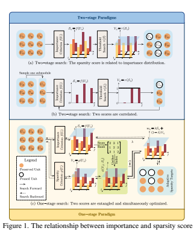

distributions in different search paradigms. (a) Importance scores are fixed during sparsity search, and sparsity scores are related to importance scores. (b) Importance scores of one submodule are also related to the sparsity of other to-prune submodules. (c) Importance and sparsity scores are entangled and simultaneously optimized, thus correlated at forward and backward phases of searching.

former Compression (VTC), as an effective technique to relieve such problems, has advanced a lot and can be divided into several types including Transformer Architecture Search
(TAS) [5, 6, 15, 25, 32, 35, 48] and Transformer Pruning
(TP) [2, 7, 21, 27, 31, 37, 42, 51] paradigms. Although both TAS and TP can produce compact ViTs, their search process for the target sparsity often relies on a two-stage scheme, i.e.,
importance-then-sparsity evaluation* for units (e.g., filters)

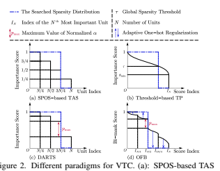 implicitly encodes the piecewise-decreasing importance scores for units due to the uniform sampling in pre-training; (b): The threshold-based TP explicitly evaluates the importance scores for units and sets a global threshold to perform pruning; (c): DARTS
learns the importance distribution in a differentiable manner and selects the subnet of the highest architecture score; (d): OFB proposes the bi-mask score that entangles importance and sparsity scores together, to perform the search process in a **single** stage.

in each dimension / submodule, which potentially hinders search performance and efficiency of both paradigms.

As for TAS that mainly follows the Single-Path-One-Shot
(SPOS) search paradigm [18], the importance scores of units in each submodule are implicitly encoded into the supernet [32], as shown in Fig. 2a. This is mainly due to the ordinal weight-sharing mechanism during the pre-training of the pre-designed supernet [32]. In other words, the submodules with small indexes are implicitly assigned higher importance scores by uniform sampling during the supernet pre-training. Afterwards, evolutionary algorithms are employed to search for the optimal subnet given the implicitlyencoded importance score distribution and target sparsity constraint [5, 17, 23, 32, 48]. Such an implicit encoding process causes TAS limited to compressing a supernet from scratch, thus leading to a high search cost.

On the other hand, for TP that adopts the threshold-based pruning paradigm, the importance scores are pre-evaluated by a designed criterion, followed by the sparsity search using a designed strategy based on the importance distribution.

However, searching for the fine-grained discrete sparsity from the evaluated importance distribution of each dimension is intractable and identified as an NP-hard problem [49].

As visualized in Fig. 2b, the importance score distribution of one dimension is usually continuous, with most points distributed around the mean value. Considering that the importance distribution varies in different dimensions and may be influenced by the pruning choice of other dimensions
[32, 40], the traditional threshold-based methods can hardly search for the optimal compact models in a global manner.

From the above analysis, *the high compression costs can be* largely attributed to the separate score evaluation, and the gap between importance and sparsity score distributions.

To tackle the above issues induced by the two-stage VTC
scheme, we propose to conduct the ViTs search in a onestage manner, where the importance and sparsity scores are learned simultaneously and entangled, to learn a discrete sparsity distribution from the entangled distribution adaptively. To achieve this, inspired by the differentiable search strategy in DARTS [8, 24, 41], we relax the sparsity score to a differentiable variable, and formulate a bi-mask score that entangles the importance and sparsity scores of each unit, to jointly assess the unit's prunability. Secondly, to optimize the bi-mask score, we introduce an adaptive one-hot loss function to adaptively convert the continuous bi-mask score into a binary one, i.e., the unit's pruning choice, as shown in Fig. 2d. Finally, during the search, we further develop a Progressive Masked Image Modeling (PMIM) technique, to regularize the dimension-reduced feature space with negligible additional costs. Our main contributions are:
- To our best knowledge, our method is the first to explore the entanglement of importance and sparsity distributions in VTC, which relieves the bottleneck of searching the discrete sparsity distribution from the continuous importance distribution, highlighting the search efficacy and effectiveness of various ViTs compression.

- We develop a novel one-stage search paradigm containing a bi-mask weight-sharing scheme and an adaptive onehot loss function, to simultaneously learn the importance and sparsity scores and determine the units' prunability. Moreover, a PMIM regularization strategy is specially designed during searching, which gradually intensifies the regularization for representation learning as the feature dimension continues to be reduced.

- Extensive experiments are conducted on ImageNet for various ViTs. Results show that OFB outperforms existing TAS and TP methods with higher sparsity and accuracy, and significantly improves search efficiency, e.g., costing one GPU search day to compress DeiT-S on ImageNet.

## 2. Related Works

Transformer Architecture Search. Recently, with various Vision Transformers spawning [9, 12, 26, 34], several works have explored searching for the optimal Transformer-based architecture. Existing Transformer Architecture Search
(TAS) works [5, 32, 48] mainly follow the SPOS NAS [18]
scheme, which first trains the supernet from scratch by iteratively training the sampled subnets, then searches for the target optimal subnet, followed by retraining the searched model. These methods focus on either designing the search space or the training strategy for the randomly initialized supernet, yet the supernet training is still time-consuming due to the numerous randomly initialized parameters to be fully trained. To address this, TF-TAS [48] provides a DSS
indicator to evaluate the subnet performance without training all supernet parameters. Compared with prior methods, our work highlights the one-stage search for compact architectures in off-the-shelf pre-trained ViTs, thus saving high costs for supernet training and an extra sparsity search.

Vision Transformer Pruning. Unlike the pruning for Convolutional Neural Networks (CNNs) [33, 38], the pruning for ViTs contains more prunable components, e.g., Patch Embedding, Patch Token, Multi-Head Self-Attention (MHSA),
and MLPs, etc. S2VITE [7] presents a pruning-and-growing strategy with 50% ratio to find the sparsity in several dimensions. WDpruning [42] performs TP via binary masks and injected classifiers, meanwhile designing a learnable pruning threshold based on the parameter constraint. ViT-Slim [2]
employs soft masks with ℓ1 penalty by a manually-set global budget threshold for TP. UVC [43] jointly combines different techniques to unify VTC. Compared with previous methods, our method features the entanglement of importance and sparsity distributions to jointly determine the prunability of each unit, and the adaptive conversion from the continuous score distribution into a discrete one, thus being able to better balance the sparsity constraint and model performance. Masked Image Modeling. Masked Image Modeling (MIM)
[20, 39] is a self-supervised learning strategy for augmenting pre-training models, aiming to reconstruct the masked patches in the input image. Several works have explored the representation learning ability of MIM in the pre-training models for downstream tasks[1, 14, 16, 46], by predicting the patch- or feature-level labels. Differently, our work targets at the compression of pre-trained ViTs, and focuses on utilizing the representation learning ability of MIM to progressively improve the dimension-reduced feature space.

## 3. The Proposed Approach

We first revisit the two-stage search paradigm and identify its problem, then propose a one-stage counterpart containing a bi-mask weight-sharing scheme with an improved optimization objective, to learn importance and sparsity scores simultaneously. Finally, PMIM is designed to boost the dimensionreduced features and enhance search performance.

## 3.1. Problem Formulation

Prior VTC works mainly focus on searching for an optimal sub-network given a supernet and the resource constraint.

Let N (A, W) denote the supernet, where A and W refer to the architecture search space and weights of the supernet, respectively. The search for the optimal architecture can be generally formulated as a two-stage problem in Eq. (1).

 \label {nas_obj} \footnotesize \begin {aligned} &\text {{\bf Stage 1. }} \mathcal {S}_\mathcal {A} = \boldsymbol {f}(W; \mathcal {A}); \\ &\text {{\bf Stage 2. }} \mathop {\min }\limits _{\alpha \in \mathcal {A}, W} \mathcal {L}_{val}(\alpha , W; \mathcal {S}_\mathcal {A}),\,\, \text {s.t.}\,\, g(\alpha ) \leq \tau , \end {aligned} 
(1)

  **Stage 1.**$\alpha=J(W,\mathcal{S}_{A})$,  **Stage 2.**$\min\limits_{\alpha\in\mathcal{A},W}\mathcal{L}_{val}(\alpha,W;\mathcal{S}_{A})$, s.t. $g(\alpha)\leq\tau$,
where f denotes the criterion to evaluate (e.g., TP) or preset
(e.g., TAS) the importance score of each unit SA based on

| Model        | Q-K-V ratio   | MLP ratio     | Head number       | P. E. ratio    |
|--------------|---------------|---------------|-------------------|----------------|
| DeiTs [34]   | (1/4, 1, 1/8) | (1/4, 1, 1/8) | (1, num_heads, 2) | (1/2, 1, 1/32) |
| Swin-Ti [26] | (1/4, 1, 1/8) | (1/4, 1, 1/8) | (1, num_heads, 2) | (1/2, 1, 1/32) |

Table 1. Search spaces of DeiTs [34] and Swin-Ti [26]. Tuples in parentheses denote the lowest value, the highest value, and step size.

Note: the step size of P. E. is smaller for its more significant impact on multiple layers (See Fig. 3) and compression performance.

the search space, and Lval denotes the loss on the validation dataset. The g and τ represent the computation cost and the corresponding constraint, respectively. In the first stage, the importance distribution is globally learned from the weights of the supernet (e.g., TP) or naturally encoded in the training mode of the supernet (e.g., TAS). Based on the (piecewise) continuous importance distribution, the architecture parameter α is optimized to satisfy the sparsity constraint via the global threshold or evolutionary algorithms in the second stage, which can be viewed as a discretization process. Since the importance distribution is fixed during the search, the gap between the importance distribution and the searched discrete sparsity distribution (pruned or not pruned) may cause the sub-optimal search result. In other words, the pre-assessed importance score may change with the discretization of other units, and cannot fully represent the actual importance distribution in the searched model.

Therefore, a better indicator to assess the unit's prunability could be an adaptively discretized score, that bridges the gap between the importance and sparsity distributions.

Inspired by DARTS [24], which designs a differentiable scheme to relax the pruning choice of each subspace to a softmax-activated probability over all subspaces in one dimension, we further develop a bi-mask scheme to learn the prunability of units in the pre-trained ViTs. In this scheme, the importance and sparsity scores are learned simultaneously in a differentiable manner to jointly determine the unit's prunability. In other words, the search objective is formulated into a one-stage problem, as shown in Eq. (2).

 \label {our_objective} \footnotesize \mathop {\min }\limits _{\mathcal {S}, \mathcal {V}, W}\mathcal {L}_{train}(\mathcal {S}, \mathcal {V}, W), \,\, \text {s.t.}\,\, g(\mathcal {V}) \leq \tau , \vspace {-0.5em} (2)
where importance scores S, sparsity scores V, and supernet weights W are continually optimized to find the optimal subnet. Consequently, the model is evaluated and searched in a single stage, which is different from the prior works separately evaluating and searching subnets. The optimization of Eq. (2) comprises a bi-mask weight-sharing strategy to assign units with prunability scores, and an adaptive one-hot loss to achieve the target sparsity (See Sec. 3.2 and 3.3).

Search Space. We first follow the TAS paradigm to construct a discrete search space for all units in each prunable submodule, including Q-K-V ratio, MLP ratio, Head number, and Patch Embedding (P. E.), as described in Table 1.

Then, the search space is relaxed in a differentiable manner.

3.2. Bi-mask Weight-sharing Strategy In order to assess the prunability of each unit, we introduce a bi-mask weight-sharing strategy in the search process. Each

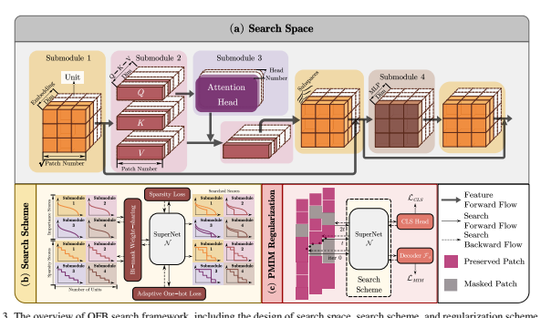

prunability score is represented by the value of the designed bi-mask mij that considers both the importance score and the sparsity score, which can be illustrated as follows:
 \footnotesize \label {prunability_score} m_{ij}\left ( t \right ) =\lambda \left ( t \right ) \mathcal {S} _{ij} +\left [ 1-\lambda \left ( t \right ) \right ] \mathcal {V} _{ij}\left ( \alpha \right ), (3)
where the subscript index ij denotes the j-th unit in the i-th prunable submodule. λ(t) denotes the time-varying weight coefficient of the importance score. Specifically, λ linearly changes from one to zero until the model finishes searching.

The motivation behind this is two-fold. From the lens of score optimization, i.e., the backward process, the sparsity score of each unit is related to its importance rank among all units in the same submodule. Therefore, before transmitting a large gradient to the sparsity score, more attention should be paid to learning a reliable importance score. Since the model weights W are well trained in the supernet, the importance score could be learned appropriately in several epochs, thus providing a relatively accurate importance rank for the assignment of the sparsity score to each unit. After obtaining a relatively accurate importance score, optimization should be focused more on the sparsity score to make the pruning decision. From the lens of the discretization process, i.e., the forward process, the search target is to learn a discrete score for each unit; thus, the searched score should approach an approximately binary (0/1) distribution, which is exactly the desired distribution of the sparsity score V. Therefore, the learning focus of the prunablility score should be gradually transferred from importance to sparsity during searching.

As for the importance score S, inspired by ViT-Slim [2],
we introduce a soft mask that is randomly initialized and learnable in each unit, to indicate its contribution to supernet performance. The importance score is normalized to vary between (0, 1) via sigmoid. As for the sparsity score V, we leverage the architecture parameter α to generate the sparsity score of each unit. Given α, V is computed via softmax to indicate the preserving potential, as formulated in Eq. (4):

 \vspace {-0.6em} \footnotesize \mathcal {V} _{ij}(\alpha )=\frac {\sum \nolimits _{k=\lfloor j/\varDelta _i \rfloor }^{\|\alpha _i\|_0}{\exp \left ( \alpha _{ik} \right )}}{\sum \nolimits _{k=0}^{\left \| \alpha _{i,:} \right \| \!\:\!_0}{\exp \left ( \alpha _{ik} \right )}}=\sum \nolimits _{k=\lfloor j/\varDelta _i \rfloor }^{\|\alpha _i\|_0}{p_{ik}}, \label {sparsity_score} (4)
where αiis the architecture parameter vector of the i-th submodule to parameterize the sub-space into a continuous space. pik and ∆i represent the step-wise normalized architecture score and the step size in the search space of the i-th submodule, respectively, where pik = softmaxk (αik).

Note that the weights in all sub-spaces of the submodule are shared as DARTS [24] does; therefore, the sparsity score of each unit is the sum of those shared architecture scores, making the sparsity distribution piecewise continuous. Unlike previous differentiable search methods uniformly initializing α for the randomly initialized supernet, our method randomly initializes α to reduce the inductive bias.

As for the weight-sharing strategy in differentiable search, considering the units with higher importance scores are more likely to be preserved, sparsity scores of more important units should be correspondingly higher than those less important (a high sparsity score means high preserving potential). Thus, at forward steps, the units in each submodule are reorganized w.r.t. their importance score rank and assigned sparsity scores in a descending order, as shown in Fig. 2d.

## 3.3. Adaptive One-Hot Loss

Given bi-masks as introduced above, which soft mask units to indicate the prunability during searching, the optimization target of these masks is another important issue. In Sec 3.3, we present an adaptive one-hot loss to solve this problem.

Considering m is derived from S and V, the optimization could be decomposed into two parts. As for the importance score, the aim of S is to learn an importance rank according to the unit's impact on model performance under the sparsity constraint. Thus, we follow ViT-Slim [2] to regularize S
with ℓ1 norm to drive unimportant units towards low-ranking and zero-score distribution, i.e., LS = ∥S∥1.

As for the sparsity score, the aim of V is to learn a binary distribution as the unit pruning choice. In other words, the target label of each piis ideally designed as a progressively shrunk one-hot vector, with no prior information about the one-hot index, thus being difficult to impose a definite target to V and α. To address this, we propose to regularize the sparsity score by introducing an alternative constraint that aligns the entropy and variance of pi with one-hot vectors.

The motivation stems from the invariance of the two properties in one-hot vectors, regardless of the one-hot index.

Especially, the entropy of any one-hot vector always equals zero, while the variance solely depends on the dimension number. The regularization w.r.t. p is formulated as follows:

 \footnotesize \label {regularization} \begin {aligned} R\left ( p \right ) &=\sum _{i=1}^M{\left [ \mathcal {H} \left ( p _i \right ) +\varPsi \left ( p _i \right ) \right ]} \\ &=\sum _{i=1}^M{\left [ -p_{i}^{T}\log \left ( p_i \right ) +\tan \left ( \frac {\pi }{2}-\pi \omega _i \right ) \right ]}, \end {aligned}  (5)
where M denotes the number of searchable submodules in N (A*, W)*, ωi = σi/σt i with σi, σ t i
, and ωi meaning the measured, target and normalized variances of pi, respectively, where σ t i =∥αi∥0 − 1/ ∥αi∥
2 0
. (See Appendix A for more detailed explanations). In addition to Eq. (5), V is also constrained by the sparsity constraint, τ . Therefore, the total regularization objective of V is formulated as follows:

$${\mathcal{L}}_{\mathcal{V}}=\mu_{1}R\left(p\right)+\mu_{2}\left\|g\left({\mathcal{V}}\right)-\tau\right\|_{2},$$
 \footnotesize \label {sparsity_loss} \mathcal {L} _{\mathcal {V}}=\mu _1 R\left ( p \right ) +\mu _2 \left \| g\left ( \mathcal {V} \right ) -\tau \right \| \!\!\:_2, (6)
where µ1 and µ2 are the weight coefficients to balance two items. Note that during search, the ground-truth value σ t would change with the decrease of ∥α∥0 when the pruning happens in α. Thus, LV is adaptive to the pruning process in the search stage. The pruning process in one dimension
(e.g., the i-th submodule) is triggered by the condition that
(pi)min ⩽ η · p¯i, where η is the scaling factor and p¯iis the mean of pi, i.e., p¯i = 1/ ∥αi∥0. By Eq. (6) and the proposed pruning strategy, the units with the lowest mask values can be progressively removed, thus accelerating search process.

Based on the above analysis, the regularization items for the bi-mask can be summarized as, Lm(V, S) = LV +
µ3LS = µ1R (p) + µ2 ∥g (V) − τ∥2 + µ3∥S∥1, where µ3 denotes the weight coefficient of LS . Consequently, the objective in Eq. (2) is transformed into the following equation:
Algorithm 1 Once for Both (OFB).

Input: Pre-trained ViT N , Decoder Fd, Search Space A, Dataset D, Masking Ratio γ, Pruning Interval ∆T, Target Pruning Ratio τ ;
1: Initialize Importance Score Set {S} and Architecture Parameter Set {α} according to A;
2: Compute m via Eq. (3) and insert m to units in the search space as soft masks; 3: for each training iteration t do 4: Sample bt ∼ D and random mask γ patches; 5: Forward [N (W; m); Fd] with masked bt; 6: Update S, V, W by optimizing Eq. (8);
7: Linearly update γ and λ; 8: Update m via Eq. (3); 9: if not *f inish search* and (t mod ∆T == 0) **then**
10: for each submodule αi in A do 11: if (pi)min ⩽ η · p¯i **then**
12: Prune the units whose pi ⩽ η · p¯i;

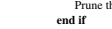 14: **end for**
15: **end if**
16: **end for** 17: **return** the pruned ViT satisfying the target sparsity.
 \footnotesize \label {transformed_objective} \min _{\mathcal {S}, \mathcal {V} ,W} \mathcal {L} _{train}(\mathcal {S}, \mathcal {V}, W)+\mathcal {L} _m(\mathcal {V} ,\mathcal {S}). (7)

## 3.4. Progressive Mim

As discussed above, during the search, pruning units can reduce training costs but may impair model performance.

Consequently, the evaluation of the importance and sparsity scores for the remaining units may be unreliable, especially in aggressive compression scenarios where a large proportion of units are pruned. To address this, we propose to further enhance the representative capability of the remaining features using the MIM technique [39] during the search. Yet, deploying MIM in a well-trained ViT requires considering the characteristics of VTC. Specifically, using a large masking ratio similar to SimMIM [20, 39] may be inappropriate for VTC
as the model would deviate from the original classificationoriented feature space to the reconstruction-oriented space, losing the original contextual information. Motivated by this, we propose a progressive MIM strategy for searching, where the masking ratio gradually increases until reaching the preset threshold. Consequently, as the pruning ratio gets larger, the feature regularization is strengthened with negligible additional cost [39], thereby maintaining the representation ability and a reliable prunability evaluation of the remaining units. Then, the optimization objective is updated to:

$$f^{\prime}+2m(F,E)+2\pi e c(E,F,W,F),$$

 \footnotesize \label {mim_objective} \min _{\mathcal {S}, \mathcal {V} ,W} \mathcal {L} _{train}(\mathcal {S}, \mathcal {V} ,W)+\mathcal {L} _m(\mathcal {V} ,\mathcal {S}) + \mathcal {L}_{rec}(\mathcal {S}, \mathcal {V}, W; \gamma ), (8)
where Lrec, γ denote the reconstruction loss and the masking ratio, respectively. Alg. (1) shows the overall algorithm.

| Method                                                                                                                                 | Model                  | #Param (M)   | FLOPs (B)   | Top-1 (%)   | Top-5 (%)   | GPU Days   |
|----------------------------------------------------------------------------------------------------------------------------------------|------------------------|--------------|-------------|-------------|-------------|------------|
| Baseline                                                                                                                               | DeiT-S [34]            | 22.1         | 4.6         | 79.8        | 95.0        | -          |
| SSP-T† [7]                                                                                                                             | 4.2                    | 0.9          | 68.6        | -           | -           |            |
| S 2ViTE-T† [7]                                                                                                                         | 4.2                    | 0.9          | 70.1        | -           | -           |            |
| TP                                                                                                                                     | WDPruning-0.3-12† [42] | 3.8          | 0.9         | 71.1        | 90.1        | -          |
| 2ViTE-S [7]                                                                                                                            | -                      | 2.1          | 74.8        | -           | -           |            |
| S                                                                                                                                      |                        |              |             |             |             |            |
| TAS                                                                                                                                    | ViTAS-B [32]           | -            | 1.0 (↓78%)  | 72.4 (↓7.4) | 90.6 (↓4.4) | 32         |
| OFB                                                                                                                                    | 4.4 (↓80%)             | 0.9 (↓80%)   | 75.0 (↓4.8) | 92.3 (↓2.7) | 1           |            |
| AutoFormer-Ti [5]                                                                                                                      | 5.7 (↓74%)             | 1.3 (↓72%)   | 74.7 (↓5.1) | 92.6 (↓2.4) | 24          |            |
| TAS                                                                                                                                    | ViTAS-C [32]           | 5.6 (↓75%)   | 1.3 (↓72%)  | 74.7 (↓5.1) | 91.6 (↓3.4) | 32         |
| TF-TAS-Ti [48]                                                                                                                         | 5.9 (↓73%)             | 1.4 (↓70%)   | 75.3 (↓4.5) | 92.8 (↓2.2) | 0.5         |            |
| Lightweight                                                                                                                            | DeiT-Ti [34]           | 5.7          | 1.3         | 72.2        | 91.1        | -          |
| TNT-Ti [19]                                                                                                                            | 6.1                    | 1.4          | 73.9        | 91.9        | -           |            |
| OFB                                                                                                                                    | 5.3 (↓76%)             | 1.1 (↓76%)   | 76.1 (↓3.7) | 92.8 (↓2.2) | 1           |            |
| DeiT-S                                                                                                                                 | SSP-S [7]              | 14.6 (↓34%)  | 3.1 (↓33%)  | 77.7 (↓2.1) | -           | -          |
| S 2ViTE-T [7]                                                                                                                          | 14.6 (↓34%)            | 2.7 (↓41%)   | 78.2 (↓1.6) | -           | -           |            |
| ViT-Slim [2]                                                                                                                           | 11.4 (↓48%)            | 2.3 (↓50%)   | 77.9 (↓1.9) | 94.1 (↓0.9) | 1.8         |            |
| TP                                                                                                                                     | WDPruning-0.3-12 [42]  | -            | 2.6 (↓43%)  | 78.4 (↓1.4) | -           | -          |
| Lightweight                                                                                                                            | HVT [28]               | -            | 2.4         | 78.0        | -           | -          |
| PVT-Ti [36]                                                                                                                            | 13.2                   | 1.9          | 75.1        | -           | -           |            |
| OFB                                                                                                                                    | 8.0 (↓64%)             | 1.7 (↓63%)   | 78.0 (↓1.8) | 93.9 (↓1.1) | 1           |            |
| Baseline                                                                                                                               | DeiT-B [34]            | 86.6         | 17.5        | 81.8        | 95.6        | -          |
| AutoFormer-S [5]                                                                                                                       | 22.9 (↓74%)            | 5.1 (↓71%)   | 81.7 (↓0.1) | 95.7 (↑0.1) | 24          |            |
| ViTAS-F [32]                                                                                                                           | 27.6 (↓68%)            | 6.0 (↓66%)   | 80.5 (↓1.3) | 95.1 (↓0.5) | 32          |            |
| TAS                                                                                                                                    | GLiT-S [4]             | 24.6 (↓72%)  | 4.4 (↓75%)  | 80.5 (↓1.3) | -           | -          |
| TF-TAS-S [48]                                                                                                                          | 22.8 (↓74%)            | 5.0 (↓71%)   | 81.9 (↑0.1) | 95.8 (↑0.2) | 0.5         |            |
| TP                                                                                                                                     | DynamicViT-S⋆ [29]     | 22.0         | 4.0         | 79.8        | -           | -          |
| ViT-Slim⋆ [2]                                                                                                                          | 17.7                   | 3.7          | 80.6        | 95.3        | 3           |            |
| Lightweight                                                                                                                            | DeiT-S [34]            | 22.1         | 4.6         | 79.8        | 95.0        | -          |
| OFB                                                                                                                                    | 17.6 (↓80%)            | 3.6 (↓79%)   | 80.3 (↓1.5) | 95.1 (↓0.5) | 2.9         |            |
| DeiT-B                                                                                                                                 | AutoFormer-B [5]       | 54.0 (↓38%)  | 11.0 (↓37%) | 82.4 (↑0.6) | 95.7 (↑0.1) | 24         |
| TAS                                                                                                                                    | GLiT-B [4]             | 96.0 (↑11%)  | 17.0 (↓3%)  | 82.3 (↑0.5) | -           | -          |
| TF-TAS-S [48]                                                                                                                          | 54.0 (↓38%)            | 12.0 (↓31%)  | 82.2 (↑0.4) | 95.6 (↓0.0) | 0.5         |            |
| VTP [50]                                                                                                                               | -                      | 10.0 (↓43%)  | 80.7 (↓1.1) | 95.0 (↓0.6) | -           |            |
| 2ViTE-B [7]                                                                                                                            | 56.8 (↓34%)            | 11.7 (↓33%)  | 82.2 (↑0.4) | -           | -           |            |
| TP                                                                                                                                     | S ViT-Slim [2]         | 52.6 (↓39%)  | 10.6 (↓39%) | 82.4 (↑0.6) | 96.1 (↑0.5) | 3          |
| WDPruning-0.3-11 [42]                                                                                                                  | -                      | 9.9 (↓43%)   | 80.8 (↓1.0) | 95.4 (↓0.1) | -           |            |
| OFB                                                                                                                                    | 43.9 (↓49%)            | 8.7 (↓50%)   | 81.7 (↓0.1) | 95.8 (↑0.2) | 4           |            |
| Table 2. Compression results of DeiT models on ImageNet-1K. † and ⋆ indicate that the compression model is based on DeiT-Ti and DeiT-S |                        |              |             |             |             |            |

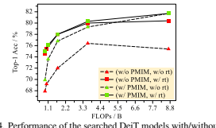

## 4. Experiments

We first present the compression results for DeiTs [34] and Swin Transformer [26] on ImageNet-1K [11]. Next, we analyze the generalization ability of the searched models on downstream benchmarks. Lastly, we explore the contribution of each individual component to search performance, followed by visualizations of the search process and results.

The implementation details are described in Appendix C.

## 4.1. Results On Imagenet

We summarize the main results of the DeiT family in Table 2 and compare them with various existing TAS and TP
methods. For a fair comparison, we refer to the results of other works from official papers. It can be observed that, in general, the compressed models based on OFB achieve higher accuracy and larger compression ratios. On lowaccuracy regimes, OFB achieves the highest accuracy and compression ratio for DeiT-S among all compression methods and lightweight models, obtaining at most 2.6% accuracy increase than TAS-based methods with ∼80% FLOPs reduction. On high-accuracy regimes, the compressed DeiT-B
based on OFB also outperforms both TAS- and TP-based methods. In particular, OFB achieves 0.9% higher Top-1 than WDPruning [42], and controls the accuracy decrease at 0.1% Top-1 with 50% reductions in parameters and FLOPs.

The other compression results also validate the consistent effectiveness and versatility of our method in different DeiT
models. As for search efficiency, we report the search time cost of several TAS- and TP-based methods in the last column of Table 2 for comparisons. Compared with Auto-

| Model                                                                                                                                                                                                                                                                                             | #Param                                         | FLOPs   | Top-1   | Top-5   | GPU   |
|---------------------------------------------------------------------------------------------------------------------------------------------------------------------------------------------------------------------------------------------------------------------------------------------------|------------------------------------------------|---------|---------|---------|-------|
| (M)                                                                                                                                                                                                                                                                                               | (B)                                            | (%)     | (%)     | Days    |       |
| Swin-Ti [26]                                                                                                                                                                                                                                                                                      | 28.3                                           | 4.5     | 81.3    | 95.5    | -     |
| OFB                                                                                                                                                                                                                                                                                               | 6.1 (↓78%) 1.0 (↓78%) 76.5 (↓4.8) 93.1 (↓2.4)  | 1.1     |         |         |       |
| OFB                                                                                                                                                                                                                                                                                               | 16.4 (↓42%) 2.6 (↓42%) 79.9 (↓1.4) 94.6 (↓0.9) | 1.3     |         |         |       |
| ViT-Slim [2] 19.4 (↓31%) 3.4 (↓24%) 80.7 (↓0.6) 95.4 (↓0.1)                                                                                                                                                                                                                                       | -                                              |         |         |         |       |
| OFB                                                                                                                                                                                                                                                                                               | 18.9 (↓33%) 3.1 (↓31%) 80.5 (↓0.8) 94.8 (↓0.7) | 1.4     |         |         |       |
| Table 3. Compression results of Swin-Ti [26] on ImageNet-1K. Model F. C10 C100 Model F. mIoU mAcc aAcc (B) (%) (%) (B) (%) (%) (%) DeiT-S [34] 4.6 98.6 87.8 SETR-S [47] 4.6 73.0 81.4 95.1 OFB 1.7 98.7 88.4 OFB 3.6 73.9 83.1 95.2 Table 4. Performance of DeiT-S [34] and compressed models on |                                                |         |         |         |       |

Model F. C10 C100 Model F. mIoU mAcc aAcc
(B) (%) (%) (B) (%) (%) (%)
DeiT-S [34] 4.6 98.6 87.8 SETR-S [47] 4.6 73.0 81.4 95.1 OFB 1.7 98.7 88.4 OFB 3.6 73.9 83.1 95.2 Table 4. Performance of DeiT-S [34] and compressed models on CIFAR-10 (C10), CIFAR-100 (C100) [22] and Cityscape [10].

Former [5] and ViTAS [32], OFB reduces search time greatly at various budgets, meanwhile achieving comparable or better performance. Compared with the efficient compression methods, e.g., TF-TAS [48] and ViT-Slim [2], OFB can achieve comparable within similar search time. One thing to note is that for the compressed DeiT-B-8.7B, after searching, it already reaches the same high performance as the retrained one. As visualized in Fig. 4, we compare the model performance with and without retraining process by employing or not employing PMIM. It is observed that the performance gap of the models with PMIM before and after retraining is significantly smaller than that of the models without PMIM.

Therefore, when considering the cost induced by retraining, OFB is more efficient than TF-TAS and ViT-Slim, saving the retraining cost meanwhile maintaining high performance.

As for the compression of Swin Transformer [26], we choose Swin-Ti as the baseline model to validate the effectiveness of OFB. The results are listed in Table 3. From the table, it can be observed that the compression performance of Swin-Ti is similar to that of DeiT-S. For example, when the model is compressed with nearly 80% reductions in FLOPs and parameters (Line 7 in Table 2 and Line 2 in Table 3), they both drop 4.8% in Top-1 accuracy, while SwinTi drops 0.3% less than DeiT-S in Top-5 accuracy, which further validates the effectiveness of OFB in different ViT

## Structures. **4.2. Transfer Learning Results**

To evaluate the generalization ability of the compressed models by OFB, we further fine-tune the compressed models on downstream datasets, e.g., CIFAR-10, CIFAR-100 [22] for image classification, and Cityscape [10] for semantic segmentation. Specifically, we choose DeiT-S [34] and SETRDeiT-S [47] as our baselines. The hyper-parameter setting follows the official fine-tuning strategy in DeiT and SETR
[47]. As presented in Table 4, the compressed models significantly outperform baselines in both accuracy and computation costs, indicating a good generalization ability to downstream datasets for the compressed models by OFB.

4.3. Ablation Study Effectiveness of Weight-sharing Strategy. The weightsharing strategy decides both importance and sparsity distri-

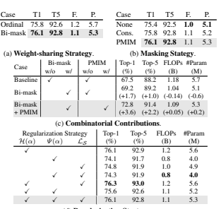

(d) **Regularization Strategy**.

Table 5. **Ablation studies** with DeiT-S on ImageNet. We report retraining accuracy with target sparsity as 1BFLOPs except for (c),
where accuracy w/o retraining is reported to analyze the component contribution in search process. Default settings are marked in gray.

| DeiT-S                                  | Throughput   | Latency (ms)   | DeiT-B                          | Throughput   | Latency   |
|-----------------------------------------|--------------|----------------|---------------------------------|--------------|-----------|
| (img/s)                                 | (img/s)      | (ms)           |                                 |              |           |
| ViTAS-B                                 | 2637         | 74             | Auto-S                          | 735          | 503       |
| OFB-1.0B 3008 (2.6x) 50 (3.7x) ViTAS-F  | 762          | 153            |                                 |              |           |
| Auto-Ti                                 | 1808         | 183            | DeiT-S                          | 1011         | 183       |
| ViTAS-C                                 | 2712         | 85             | OFB-3.6B 1152 (3.7x) 252 (3.9x) |              |           |
| DeiT-Ti                                 | 2613         | 61             | DeiT-B                          | 313          | 982       |
| OFB-1.1B 2737 (2.4x) 57 (3.2x) Auto-B   | 357          | 1068           |                                 |              |           |
| OFB-1.7B 1996 (2.0x) 81 (2.3x) OFB-8.7B | 567 (1.8x)   | 741 (1.3x)     |                                 |              |           |

butions, as discussed above. To validate the effectiveness of our bi-mask weight-sharing strategy, we compare the search performance with the ordinal-sharing strategy employed in previous TAS methods and present results in Table 5a. From the table, our method obtains more compact models with higher performance than the counterpart, indicating the bimask scheme can evaluate unit prunability more accurately.

Considering the weight-sharing strategy is only employed at the search stage, we further report the performance gain at the search stage in Table 5c. Compared with the baseline, the bi-mask weight-sharing strategy achieves 1.7% performance gain, meanwhile reducing 0.14 BFLOPs and 0.6 MParams.

Effectiveness of Regularization Strategy. There are three components for the bi-mask optimization, including the ℓ1 regularization LS for importance scores S, the entropy H(α), and variation regularization Ψ(α) for sparsity scores V. We test their individual and combinatorial contributions to the search performance, and present results in Table 5d.

It can be concluded that the entropy regularization H(α)
and the ℓ1 regularization LS play the more important role in maintaining high performance, while the variation regularization Ψ(α) drives the model to approach the target sparsity

 
Head Number40 56 64 48

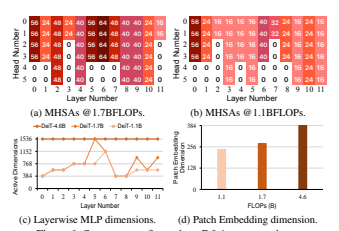 
Head Number40 56 64 48 

Figure 5. Visualization of bi-mask search process. Each line/surface is a descendingly-ordered distribution learned after one-epoch search, with the lighter color denoting a later learned distribution.

more closely. (See Appendix B for theoretical analysis)
Effectiveness of MIM Strategy. The MIM effectiveness has been partially demonstrated in Fig. 4. For clear comparisons, we report search performance with PMIM before retraining in Table 5c. From the table, PMIM can further improve accuracy by 3.6% Top-1 with a slight increase in computation overhead (+0.05 BFLOPs, +0.2 MParams). In addition, we further analyze the progressive masking strategy in PMIM.

As shown in Table 5b, we compare PMIM with a constant masking scheme (const.) adopted in [20, 39], which keeps masking 25% patches as aligned with the final masking ratio in PMIM. It is observed that PMIM improves accuracy at the same FLOPs, thus further validating its effectiveness.

## 4.4. Inference Speedup Results

The throughput and latency results of compressed models are listed in Table 6, where the model checkpoints are obtained from official repositories. The GPU throughput is measured on a Tesla V100 GPU with a batch size of 1024, and the latency is measured on Intel(R) Xeon(R) Gold 5218 CPU
with one batch size. It shows that OFB achieves superior speedup on different devices. Specifically, the throughput of the compressed DeiT models is accelerated by 1.8x∼3.7x on GPU, while the latency on CPU is reduced by 25%∼ 74%.

## 4.5. Mask Visualization

The search process of bi-masks is visualized in Fig. 5 for better understanding, where we take the compressed DeiT-S-1B
as an example. It is observed that in the early stage, the bimask score (right) is closer to the importance score (left), and the sparsity score distribution changes little, thus the initial learning focuses more on importance evaluation. Whereas, with search going on, the bi-mask score distribution gets progressively closer to the sparsity score distribution, indicating the bi-mask learning focuses more on the sparsity evaluation. As for the pruning, we can find that those units with scores in the small step intervals will be integrated into one step interval, and will be pruned if the sparsity scores drop significantly, which is performed in an adaptive manner.

Fig. 6 shows several searched architectures of DeiT-S. Fig.

6a and 6b list the searched results of MHSA modules. There are 12 MHSA layers in DeiT-S, with six heads in each layer and 64 channels in each head. The numbers inside grids denote Q-K-V channels of the head. Here, we jointly assess the prunability of Q-K-C channels for all heads at the same layer to achieve structural acceleration. It is noted that shallow and middle layers consistently need higher Q-K-V
dimensions at different budgets, while the head numbers can be reduced. Fig. 6c shows the searched MLP dimensions.

Similarly, MLPs are preserved more in middle layers and continually pruned in deep layers, indicating more redundance in deep layers. Fig. 6d shows the searched Patch Embedding dimensions, which are carefully searched with more channels preserved. It is reasonable since Patch Embedding is skip-connected to all encoder blocks in DeiT.

## 5. Conclusion

We introduce OFB to tackle the VTC problem. To determine the unit prunability in ViTs, for the first time, OFB explores how to entangle the importance and sparsity scores during search. And a PMIM regularization strategy is specially designed for the dimension-reduced feature space in VTC.

Extensive experiments have been conducted to compress various ViTs on ImageNet and downstream benchmarks, indicating an excellent compression capability for ViTs.

## 6. Acknowledgements

The research was supported by National Key R&D
Program of China (Grant No. 2022ZD0160104), National Natural Science Foundation of China (No. 62071127, and 62101137), National Key Research and Development Program of China (No. 2022ZD0160100), Shanghai Natural Science Foundation (No. 23ZR1402900), the Science and Technology Commission of Shanghai Municipality (Grant No. 22DZ1100102), and Shanghai Rising Star Program (Grant No. 23QD1401000).

## References

[1] Yutong Bai, Zeyu Wang, Junfei Xiao, Chen Wei, Huiyu Wang, Alan Yuille, Yuyin Zhou, and Cihang Xie. Masked autoencoders enable efficient knowledge distillers. arXiv preprint arXiv:2208.12256, 2022. 3
[2] Arnav Chavan, Zhiqiang Shen, Zhuang Liu, Zechun Liu, Kwang-Ting Cheng, and Eric P Xing. Vision transformer slimming: Multi-dimension searching in continuous optimization space. In *Proceedings of the IEEE/CVF Conference on* Computer Vision and Pattern Recognition, pages 4931–4941, 2022. 1, 3, 4, 5, 6, 7
[3] Hila Chefer, Shir Gur, and Lior Wolf. Transformer interpretability beyond attention visualization. In Proceedings of the IEEE/CVF Conference on Computer Vision and Pattern Recognition (CVPR), pages 782–791, 2021. 5
[4] Boyu Chen, Peixia Li, Chuming Li, Baopu Li, Lei Bai, Chen Lin, Ming Sun, Junjie Yan, and Wanli Ouyang. Glit: Neural architecture search for global and local image transformer. In Proceedings of the IEEE/CVF International Conference on Computer Vision (ICCV), pages 12–21, 2021. 6
[5] Minghao Chen, Houwen Peng, Jianlong Fu, and Haibin Ling.

Autoformer: Searching transformers for visual recognition.

In *Proceedings of the IEEE/CVF international conference on* computer vision, pages 12270–12280, 2021. 1, 2, 6, 7
[6] Minghao Chen, Kan Wu, Bolin Ni, Houwen Peng, Bei Liu, Jianlong Fu, Hongyang Chao, and Haibin Ling. Searching the search space of vision transformer. Advances in Neural Information Processing Systems, 34:8714–8726, 2021. 1
[7] Tianlong Chen, Yu Cheng, Zhe Gan, Lu Yuan, Lei Zhang, and Zhangyang Wang. Chasing sparsity in vision transformers:
An end-to-end exploration. *Advances in Neural Information* Processing Systems, 34:19974–19988, 2021. 1, 3, 6
[8] Xin Chen, Lingxi Xie, Jun Wu, and Qi Tian. Progressive differentiable architecture search: Bridging the depth gap between search and evaluation. In Proceedings of the IEEE/CVF
international conference on computer vision, pages 1294–
1303, 2019. 2
[9] Xiangxiang Chu, Zhi Tian, Yuqing Wang, Bo Zhang, Haibing Ren, Xiaolin Wei, Huaxia Xia, and Chunhua Shen. Twins:
Revisiting the design of spatial attention in vision transformers. *Advances in Neural Information Processing Systems*, 34:
9355–9366, 2021. 2
[10] Marius Cordts, Mohamed Omran, Sebastian Ramos, Timo Rehfeld, Markus Enzweiler, Rodrigo Benenson, Uwe Franke, Stefan Roth, and Bernt Schiele. The cityscapes dataset for semantic urban scene understanding. In *Proceedings of the* IEEE Conference on Computer Vision and Pattern Recognition (CVPR), 2016. 7
[11] Jia Deng, Wei Dong, Richard Socher, Li-Jia Li, Kai Li, and Li Fei-Fei. Imagenet: A large-scale hierarchical image database.

In *2009 IEEE Conference on Computer Vision and Pattern* Recognition, pages 248–255, 2009. 6
[12] Alexey Dosovitskiy, Lucas Beyer, Alexander Kolesnikov, Dirk Weissenborn, Xiaohua Zhai, Thomas Unterthiner, Mostafa Dehghani, Matthias Minderer, Georg Heigold, Sylvain Gelly, et al. An image is worth 16x16 words: Transformers for image recognition at scale. In *International Conference* on Learning Representations. 2
[13] Gongfan Fang, Xinyin Ma, Mingli Song, Michael Bi Mi, and Xinchao Wang. Depgraph: Towards any structural pruning.

In *Proceedings of the IEEE/CVF Conference on Computer* Vision and Pattern Recognition (CVPR), pages 16091–16101, 2023. 6
[14] Yuxin Fang, Shusheng Yang, Shijie Wang, Yixiao Ge, Ying Shan, and Xinggang Wang. Unleashing vanilla vision transformer with masked image modeling for object detection.

arXiv preprint arXiv:2204.02964, 2022. 3
[15] Chengyue Gong, Dilin Wang, Meng Li, Xinlei Chen, Zhicheng Yan, Yuandong Tian, Vikas Chandra, et al. Nasvit:
Neural architecture search for efficient vision transformers with gradient conflict aware supernet training. In *International Conference on Learning Representations*, 2021. 1
[16] Bicheng Guo, Shuxuan Guo, Miaojing Shi, Peng Chen, Shibo He, Jiming Chen, and Kaicheng Yu. α darts once more:
Enhancing differentiable architecture search by masked image modeling. *arXiv preprint arXiv:2211.10105*, 2022. 3
[17] Yong Guo, Yin Zheng, Mingkui Tan, Qi Chen, Jian Chen, Peilin Zhao, and Junzhou Huang. Nat: Neural architecture transformer for accurate and compact architectures. *Advances* in Neural Information Processing Systems, 32, 2019. 2
[18] Zichao Guo, Xiangyu Zhang, Haoyuan Mu, Wen Heng, Zechun Liu, Yichen Wei, and Jian Sun. Single path oneshot neural architecture search with uniform sampling. In Computer Vision–ECCV 2020: 16th European Conference, Glasgow, UK, August 23–28, 2020, Proceedings, Part XVI 16, pages 544–560. Springer, 2020. 2
[19] Kai Han, An Xiao, Enhua Wu, Jianyuan Guo, Chunjing Xu, and Yunhe Wang. Transformer in transformer. Advances in Neural Information Processing Systems, 34:15908–15919, 2021. 6
[20] Kaiming He, Xinlei Chen, Saining Xie, Yanghao Li, Piotr Dollár, and Ross Girshick. Masked autoencoders are scalable vision learners. In Proceedings of the IEEE/CVF Conference on Computer Vision and Pattern Recognition, pages 16000–
16009, 2022. 3, 5, 8
[21] Zhenglun Kong, Peiyan Dong, Xiaolong Ma, Xin Meng, Mengshu Sun, Wei Niu, Xuan Shen, Geng Yuan, Bin Ren, Minghai Qin, et al. Spvit: Enabling faster vision transformers via soft token pruning. *arXiv preprint arXiv:2112.13890*,
2021. 1
[22] Alex Krizhevsky et al. Learning multiple layers of features from tiny images. 2009. 7
[23] Changlin Li, Tao Tang, Guangrun Wang, Jiefeng Peng, Bing Wang, Xiaodan Liang, and Xiaojun Chang. Bossnas:
Exploring hybrid cnn-transformers with block-wisely selfsupervised neural architecture search. In *Proceedings of the* IEEE/CVF International Conference on Computer Vision, pages 12281–12291, 2021. 2
[24] Hanxiao Liu, Karen Simonyan, and Yiming Yang.

Darts: Differentiable architecture search. arXiv preprint arXiv:1806.09055, 2018. 2, 3, 4
[25] Jihao Liu, Xin Huang, Guanglu Song, Hongsheng Li, and Yu Liu. Uninet: Unified architecture search with convolution, transformer, and mlp. In *Computer Vision–ECCV 2022: 17th* European Conference, Tel Aviv, Israel, October 23–27, 2022, Proceedings, Part XXI, pages 33–49. Springer, 2022. 1
[26] Ze Liu, Yutong Lin, Yue Cao, Han Hu, Yixuan Wei, Zheng Zhang, Stephen Lin, and Baining Guo. Swin transformer:
Hierarchical vision transformer using shifted windows. In Proceedings of the IEEE/CVF international conference on computer vision, pages 10012–10022, 2021. 2, 3, 6, 7
[27] Bowen Pan, Rameswar Panda, Yifan Jiang, Zhangyang Wang, Rogerio Feris, and Aude Oliva. Ia-redˆ2: Interpretabilityaware redundancy reduction for vision transformers. In Advances in Neural Information Processing Systems, pages 24898–24911. Curran Associates, Inc., 2021. 1
[28] Zizheng Pan, Bohan Zhuang, Jing Liu, Haoyu He, and Jianfei Cai. Scalable vision transformers with hierarchical pooling.

In *Proceedings of the IEEE/CVF International Conference* on Computer Vision (ICCV), pages 377–386, 2021. 6
[29] Yongming Rao, Wenliang Zhao, Benlin Liu, Jiwen Lu, Jie Zhou, and Cho-Jui Hsieh. Dynamicvit: Efficient vision transformers with dynamic token sparsification. *Advances in neural information processing systems*, 34:13937–13949, 2021.

6
[30] Alfréd Rényi. On measures of entropy and information. In Proceedings of the Fourth Berkeley Symposium on Mathematical Statistics and Probability, Volume 1: Contributions to the Theory of Statistics, pages 547–562. University of California Press, 1961. 3
[31] Zhuoran Song, Yihong Xu, Zhezhi He, Li Jiang, Naifeng Jing, and Xiaoyao Liang. Cp-vit: Cascade vision transformer pruning via progressive sparsity prediction. *arXiv preprint* arXiv:2203.04570, 2022. 1
[32] Xiu Su, Shan You, Jiyang Xie, Mingkai Zheng, Fei Wang, Chen Qian, Changshui Zhang, Xiaogang Wang, and Chang Xu. Vitas: Vision transformer architecture search. In Computer Vision–ECCV 2022: 17th European Conference, Tel Aviv, Israel, October 23–27, 2022, Proceedings, Part XXI,
pages 139–157. Springer, 2022. 1, 2, 6, 7
[33] Shengji Tang, Weihao Lin, Hancheng Ye, Peng Ye, Chong Yu, Baopu Li, and Tao Chen. Enhanced sparsification via stimulative training. *arXiv preprint arXiv:2403.06417*, 2024.

3
[34] Hugo Touvron, Matthieu Cord, Matthijs Douze, Francisco Massa, Alexandre Sablayrolles, and Hervé Jégou. Training data-efficient image transformers & distillation through attention. In *International conference on machine learning*, pages 10347–10357. PMLR, 2021. 2, 3, 6, 7
[35] Chongjun Tu, Peng Ye, Weihao Lin, Hancheng Ye, Chong Yu, Tao Chen, Baopu Li, and Wanli Ouyang. Efficient architecture search via bi-level data pruning. arXiv preprint arXiv:2312.14200, 2023. 1
[36] Wenhai Wang, Enze Xie, Xiang Li, Deng-Ping Fan, Kaitao Song, Ding Liang, Tong Lu, Ping Luo, and Ling Shao. Pyramid vision transformer: A versatile backbone for dense prediction without convolutions. In *Proceedings of the IEEE/CVF*
international conference on computer vision, pages 568–578, 2021. 6
[37] Zhenyu Wang, Hao Luo, Pichao WANG, Feng Ding, Fan Wang, and Hao Li. VTC-LFC: Vision transformer compression with low-frequency components. In *Advances in Neural* Information Processing Systems, 2022. 1
[38] Wei Wen, Chunpeng Wu, Yandan Wang, Yiran Chen, and Hai Li. Learning structured sparsity in deep neural networks.

Advances in neural information processing systems, 29, 2016.

3
[39] Zhenda Xie, Zheng Zhang, Yue Cao, Yutong Lin, Jianmin Bao, Zhuliang Yao, Qi Dai, and Han Hu. Simmim: A simple framework for masked image modeling. In Proceedings of the IEEE/CVF Conference on Computer Vision and Pattern Recognition, pages 9653–9663, 2022. 3, 5, 8
[40] Hancheng Ye, Bo Zhang, Tao Chen, Jiayuan Fan, and Bin Wang. Performance-aware approximation of global channel pruning for multitask cnns. IEEE Transactions on Pattern Analysis and Machine Intelligence, 2023. 2
[41] Peng Ye, Baopu Li, Yikang Li, Tao Chen, Jiayuan Fan, and Wanli Ouyang. β-darts: Beta-decay regularization for differentiable architecture search. In *2022 IEEE/CVF Conference* on Computer Vision and Pattern Recognition (CVPR), pages 10864–10873. IEEE, 2022. 2
[42] Fang Yu, Kun Huang, Meng Wang, Yuan Cheng, Wei Chu, and Li Cui. Width & depth pruning for vision transformers. In Proceedings of the AAAI Conference on Artificial Intelligence, pages 3143–3151, 2022. 1, 3, 6
[43] Shixing Yu, Tianlong Chen, Jiayi Shen, Huan Yuan, Jianchao Tan, Sen Yang, Ji Liu, and Zhangyang Wang. Unified visual transformer compression. In *International Conference on* Learning Representations, 2022. 3
[44] Sangdoo Yun, Dongyoon Han, Seong Joon Oh, Sanghyuk Chun, Junsuk Choe, and Youngjoon Yoo. Cutmix: Regularization strategy to train strong classifiers with localizable features. In *Proceedings of the IEEE/CVF international conference on computer vision*, pages 6023–6032, 2019. 5
[45] Hongyi Zhang, Moustapha Cisse, Yann N Dauphin, and David Lopez-Paz. mixup: Beyond empirical risk minimization.

International Conference on Learning Representations, 2018.

5
[46] Renrui Zhang, Ziyu Guo, Peng Gao, Rongyao Fang, Bin Zhao, Dong Wang, Yu Qiao, and Hongsheng Li. Point-m2AE:
Multi-scale masked autoencoders for hierarchical point cloud pre-training. In Advances in Neural Information Processing Systems, 2022. 3
[47] Sixiao Zheng, Jiachen Lu, Hengshuang Zhao, Xiatian Zhu, Zekun Luo, Yabiao Wang, Yanwei Fu, Jianfeng Feng, Tao Xiang, Philip HS Torr, et al. Rethinking semantic segmentation from a sequence-to-sequence perspective with transformers.

In *Proceedings of the IEEE/CVF conference on computer* vision and pattern recognition, pages 6881–6890, 2021. 7
[48] Qinqin Zhou, Kekai Sheng, Xiawu Zheng, Ke Li, Xing Sun, Yonghong Tian, Jie Chen, and Rongrong Ji. Trainingfree transformer architecture search. In *Proceedings of* the IEEE/CVF Conference on Computer Vision and Pattern Recognition, pages 10894–10903, 2022. 1, 2, 6, 7
[49] Yuefu Zhou, Ya Zhang, Yanfeng Wang, and Qi Tian. Accelerate cnn via recursive bayesian pruning. In Proceedings of the IEEE/CVF International Conference on Computer Vision, pages 3306–3315, 2019. 2
[50] Mingjian Zhu, Yehui Tang, and Kai Han. Vision transformer pruning. *arXiv preprint arXiv:2104.08500*, 2021. 6
[51] Zhuofan Zong, Kunchang Li, Guanglu Song, Yali Wang, Yu Qiao, Biao Leng, and Yu Liu. Self-slimmed vision transformer. In Computer Vision–ECCV 2022: 17th European Conference, Tel Aviv, Israel, October 23–27, 2022, Proceedings, Part XI, pages 432–448. Springer, 2022. 1

# Once For Both: Single Stage Of Importance And Sparsity Search For Vision Transformer Compression

## Supplementary Material

In supplementary material, we first provide a summary of all notations mentioned in the main body for a clear understanding of the paper, as shown in Table A.1. Then, we make a deep analysis of the adaptive one-hot loss function, including the theoretical justification of its effectiveness (Appendix A). In addition, we demonstrate the necessity of activating variance regularization with the tangent function from the lens of optimization space (Appendix B). Then, we introduce the implementation details of our experiments on different baseline models (Appendix C). Finally, we provide more experimental analyses (Appendix D, E, and F). Our code is available at https://github.com/HankYe/Oncefor-Both.

## A. Motivation Behind Entropy And Variance Regularizations

In this section, we take a deep dive into the design of the adaptive one-hot loss function, which targets discretizing each piinto a one-hot vector. Considering the inaccessible one-hot index in the search process (Sec. 3.3), the optimization objective of pi should adapt to potential members in a one-hot vector group according to the search results of other submodules. For example, the sparsity target of one submodule can change from [0, 0, 1, 0] to [0, 1, 0, 0] if other pruned submodules contribute to a small computation reduction. Our method employs an adaptive one-hot loss function to learn members' invariant and unique properties within a one-hot vector group, fulfilling the optimization objectives.

First, we present two learnable properties of the one-hot vector set: entropy H(pi) and variance σ(pi). Focusing on the i-th dimension in the normalized α using *softmax*,
denoted as pi, we establish a theorem revealing the unique relationship between H(pi), σ(pi), and the set of one-hot vectors.

Theorem 1. *Suppose* pi ∈ R
1×D and PD
k=1 pik = 1*, with* pik ≥ 0, k = 1, 2, ..., D. Then the following propositions are equivalent:

 \label {entropy}&\left ( 1 \right ) \,\,\mathcal {H} (p_i)=-\sum \nolimits _{k=1}^D{p_{ik}\log p_{ik}}=0; &\\ \label {variance}&\left ( 2 \right ) \,\,\sigma \left ( p_i \right ) =\sum \nolimits _{k=1}^D{\left ( p_{ik}-\bar {p} \right ) ^2}/D=\left ( D-1 \right ) /D^2; & \\ \label {one-hot}&\left ( 3 \right ) \,\,p_i\in \left \{ e_k \right \} , k=1,2,...,D,& (A.3)
where ek represents the D*-dimensional one-hot vector with the* k-th element set to one.

Proof. We prove the equivalence by demonstrating A.1 ⇔
A.3 and A.2 ⇔ A.3.

As for the former equivalence, given that pi ∈ {ek}, the entropy of pi can be easily computed as zero, thus A.3 ⇒
A.1. Then we prove that A.1 ⇒ A.3. Since piis constrained by PD
k=1 pik = 1, we construct a Lagrange function L(pi, λ)
as follows:

$$L(p_{i},\lambda)={\mathcal{H}}(p_{i})+\lambda(1-\sum\nolimits_{k=1}^{D}p_{i k}),$$
$\mu$. 
where λ is the Lagrange multiplier. Now, we analyze the extremum and monotonicity of L(pi, λ) by taking partial derivatives with respect to pik and λ, as shown in Eq. (A.5).

 \label {partial_L} \small \frac {\partial L}{\partial p_{ik}}=-1-\lambda -\log p_{ik}, \,\,\,\,k=1,2,...,D. (A.5)

By setting each partial derivative to zero, we can obtain that: λ = log D − 1, pik = D−1, k = 1, 2*, ..., D*.

If 0 < pik < D−1, then *∂L/∂p*ik = − log(Dpik) >
0, k = 1, 2*, ..., D*. Similarly, if D−1 < pik < 1, then
∂L/∂pik = − log(Dpik) < 0, k = 1, 2*, ..., D*. Consequently, H(pi) is monotone increasing if 0 < pik < D−1 and monotone decreasing if D−1 < pik < 1 in the dimension of pik. Therefore, H(pi) reaches maximum as log D when pi = D−111×D, and reaches the minimum as zero when pik ∈ {0, 1}, k = 1, 2*, .., D*. In other words, H(pi) = 0 holds only if pi ∈ {ek}, k = 1, 2*, ..., D*. Therefore, H(pi) = 0 ⇒ pi ∈ {ek}, i.e., A.1 ⇒ A.3. Finally, we can get the conclusion that A.1 is equivalent to A.3.

As for the latter equivalence, A.2 ⇔ A.3, the proof is similar and thus omitted here.

Based on the analysis, the entropy and variance regularization of pi can effectively drive it towards a one-hot vector, discretizing both pik and the sparsity score V as binary.

Having demonstrated the effectiveness of both regularization items, another question is why both regularization items should be employed. To answer this question, we analyze the respective contribution of the entropy and variance regularization items to the discretization process, making the following observations.

Theorem 2. Let ∥H(pi) − 0∥ and ∥σ(pi) − (D − 1)/D2∥ *denote the regularization items for entropy and variance, respectively.*
Then, the following properties hold:
(1) ∥H(pi) − 0∥ works as ℓ1 sparsity for pi, guiding pi *towards a* potential one-hot vector;
(2) ∥σ(pi) − (D − 1)/D2∥ works as ℓ2 smoothness for pi, facilitating a seamless transition from one potential target vector to another.

| Symbol                       | Notation                  | Symbol   | Notation                          |
|------------------------------|---------------------------|----------|-----------------------------------|
| N                            | supernet                  | m        | bi-mask                           |
| A                            | search space              | λ(t)     | time-varying weight coefficient   |
| W                            | supernet weights          | i        | the submodule index               |
| Fd                           | decoder                   | j        | the unit index                    |
| D                            | dataset                   | α        | architecture parameters           |
| f                            | importance criterion      | p        | the normalized architecture score |
| S                            | importance score          | ∆        | search step                       |
| V                            | sparsity score            | M        | submodule number in N             |
| Lval                         | validation loss           | σ        | measured variance of p            |
| Ltrain                       | training loss             | σ t      | target variance of p              |
| LS                           | regularization item for S | ω        | normalized variance of p          |
| LV                           | regularization item for V | µ1, µ2   | weight coefficients in LV         |
| Lrec                         | reconstruction loss       | µ3       | weight coefficient in LS          |
| Lm                           | regularization item for m | p¯       | mean of p                         |
| R(p)                         | regularization item for p | η        | scaling factor                    |
| g                            | computation cost          | γ        | masking ratio                     |
| τ                            | resource constraint       | ∆T       | pruning interval                  |
| Table A.1. Notation Summary. |                           |          |                                   |

Proof. We first derive the approximate order of two items to identify regularization types. Then we analyze the function of each regularization from the lens of the optimization space.

As for entropy regularization, since H(pi) ≥ 0, the regularization can be simplified as H(pi). Further, according to
[30], H(pi) can be regarded as the first-order entropy of the distribution pi, as shown in Eq. (A.6).

$$\mathcal{H}\left(p_{i}\right)=\lim_{r\to1}\mathcal{H}_{r}\left(p_{i}\right)=\lim_{r\to1}\frac{1}{1-r}\log\left(\sum_{k=1}^{D}p_{ik}^{r}\right),$$ (A.6)
where Hr (pi) is the generalized entropy measure, Rényi Entropy. Therefore, ∥H(pi) − 0∥ can be regarded as ℓ1 sparsity for the discrete distribution of pi.

As for variance regularization, since σ(pi) ≤ (D − 1)/D2, the regularization can be simplified as (D − 1)/D2 − σ(pi).

Further, we expand σ(pi) into the polynomial form as follows:

ows.  $$\frac{D-1}{D^{2}}-\sigma(p_{i})=\frac{D-1}{D^{2}}-\frac{\sum_{k=1}^{D}p_{ik}^{2}-\frac{2}{D}\sum_{k=1}^{D}p_{ik}+\frac{1}{D}}{D}$$ (A.7) $$=\frac{D-1}{D^{2}}-\frac{\sum_{k=1}^{D}p_{ik}^{2}-\frac{1}{D}}{D}$$ $$=\frac{1}{D}\left(1-\sum_{k=1}^{D}p_{ik}^{2}\right).$$  From Eq. (A.7), minimizing $(D-1)/D^{2}-\sigma(p_{i})$ can 
be regarded as maximizing ℓ2-norm of pi. Therefore, the variance regularization cannot be viewed as the ℓ2 sparsity.

Instead, compared with entropy regularization, we argue that variance regularization works as ℓ2 smoothness.

Specifically, we visualize the distributions of entropy and variance regularization in Fig. A.1. Considering the normalization constraint, we focus on the two-dimensional setting of pito simplify the analysis. From the figure, we observe that variance regularization distribution is flatter than entropy regularization in the region neighboring the maximum point.

With the increase in the dimensionality of pi, the entropy regularization becomes stronger (sharper peak), while the variance regularization becomes weaker (flatter peak). Consequently, the variance regularization effectively smooths the optimization space.

Note that during optimization, entropy regularization is sensitive to the initialization of pi, as the gradient continually drives the maximum pik towards one. This behavior is independent of the sparsity constraint and leads to fixing the potential one-hot index throughout the pruning process.

This issue is evident in the results of lines 1 and 5 in Table 5d and Fig. A.2. In lines 1 and 5 of Table 5d, the searched models have the same size and are the largest among all searched models. The bi-mask score learning process in Fig. A.2, which is sampled from one submodule in DeiTS compressed by entropy regularization alone, shows that the bi-mask scores in different segments are continually increased or decreased. Therefore, **entropy regularization**
mainly contributes to the score sparsity but is constrained by the initial score distribution.

In contrast, variance regularization is agnostic to the onehot index and operates within a much flatter optimization space than entropy regularization. This characteristic allows variance regularization to adaptively adjust the target one-hot vector based on the search results of other submodules or units. Fig. A.3 visualizes the bi-mask score learning process from the same submodule as in Fig. A.2, employing the same compression target. The scores in the box initially increase and gradually decrease after the pruning of other units, indicating a switch in the target one-hot vector from

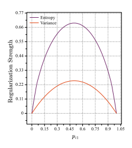

0.0 0.2 0.4 0.6 0.8 1.0 Normalized index 0.0 0.1 0.2 0.3 0.4 0.5 0.6 0.7

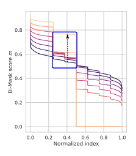

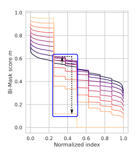

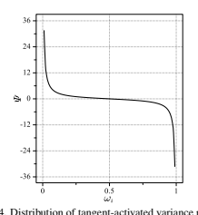

[0, 0, 1, 0, 0, 0, 0] to [1, 0, 0, 0, 0, 0, 0]. Additionally, the results in lines 2 and 4 of Table 5d demonstrate that models compressed solely with variance regularization achieve the smallest model size (4.0MParams, 0.8BFLOPs) while satisfying the sparsity constraint. Hence, **variance regularization primarily contributes to a smoother optimization**
space, enabling easier adjustment of the target one-hot vector to align with the pruning process of other units and the desired sparsity constraint.

In summary, we demonstrate the effectiveness and necessity of both entropy and variance regularization items from the lens of equivalent properties, regularization types, and optimization contributions.

## B. Motivation Behind Tangent Activation For Variance Regularization

As mentioned earlier, applying ℓ1 regularization to the discrete variable pi and continuous variable S enhances model sparsity while maintaining model performance. This observation is also supported by the results in Table 5d (lines 1, 5, 6, and 7).

Now, let's delve into the explanation for why we use tangent to map the variance regularization. This choice is primarily motivated by the over-smoothness present in the high-dimensional optimization space during the early search process. To better understand this, we analyze the regularization strength in the high-dimensional optimization space. In particular, we focus on scenarios where the dimensionality D
is much larger than 2 (*D >>* 2). In such cases, the maximum strength of (D −1)/D2 −σ(pi), which equals (D −1)/D2, is very close to the minimum strength of zero. As a result, the gradient of the variance regularization becomes extremely Figure A.4. Distribution of tangent-activated variance regularization.

small compared to the gradient of the entropy regularization. Consequently, the impact of variance regularization on searching for the potential target one-hot vector becomes minimal, as the gradient of variance regularization is overwhelmed by that of entropy regularization.

To solve this problem, we propose utilizing tangent activation to produce a large gradient during the search for the potential target one-hot vector under the performance and sparsity objectives. Specifically, we design the activation as follows:

$$\Psi(p_{i})=\tan\left({\frac{\pi}{2}}-\pi\omega_{i}\right),$$
$$(\mathbf{A.8})$$

where ωi = σi/σt i ∈ [0, 1] as mentioned in the main body.

The distribution of Ψ(pi) is presented in Fig. A.4, where Ψ
rapidly decreases when ωi is close to zero, i.e., σiis close to zero. In other words, if the variance of piis small, referring to the initial distribution of pi or the distribution after pruning small-score units, we will assign a larger gradient for

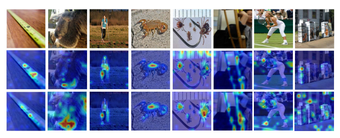

variance regularization than entropy one. This prioritization allows for faster optimization of pitowards the potential target one-hot vector under the performance and sparsity objective. By doing so, we prevent entropy regularization from dominating the optimization process and ensure the target one-hot vector can be dynamically adjusted.

Once the potential target one-hot vector is found, the optimization process should prioritize entropy regularization.

This is because entropy regularization, as an approximate ℓ1 sparsity measure, can promote sparsity in pi while maintaining model performance. Therefore, the gradient of variance regularization can be suppressed to minimize interference from other one-hot objectives. When the distribution of pi is close to a one-hot vector, meaning ωiis close to one, the significant gradient of Ψ can facilitate the discretization of pi in the same optimization direction as entropy regularization.

In this situation, the disturbance caused by variance regularization from other one-hot objectives is typically negligible.

Based on the above analysis, the main contribution of tangent activation is providing a large gradient to adjust the potential target one-hot vector of pithat satisfies the compression requirement every time the small-score units in pi are pruned. Therefore, as validated in lines 1, 6, 5, and 7 of Table 5d, the variance regularization Ψ(pi) can drive the model to approach the target sparsity more closely and more efficiently.

## C. Implementation Details

OFB adopts the searching-and-retraining scheme as previous works do. All experiments are conducted with 8 V100 GPUs.

In the search process, we use the pre-trained models released from official implementation on ImageNet-1K as the supernet N . The decoder Fd consists of one convolutional layer and a pixel-shuffle layer as SimMIM [39] does. We search for 100 epochs on DeiT-S and Swin-Ti, and 200 on DeiT-B, with 20 epochs for warming up. The other learning schedules and the augmentation strategy follow the official settings in the respective papers. The learning schedules of α, S and Fd shares the same setting as W, except that β1 is set as 0.5 for the optimizer of {α, S}. The default values of µ1, µ2, µ3, and η are set as 5e-1, 1e2, 2e-5, and 2e-1, respectively. The unit pruning is initiated at every one-third interval (∆T) within each epoch. In the retraining process, we follow the default training strategy reported in official papers except for mixup [45] and cutmix [44], which impair the retraining performance in our setting, and the learning rate is set as 6e-4 for both types of models. The masking ratio linearly increases from 1% to 25% of the input patches for DeiTs and that of the downsampled patches for Swin-Ti during the search stage.

## D. Additional Attention Map Visualizations

We take DeiT-B_3.6BFLOPs as an example to compare the attention maps with DeiT-S, which shares the same depth as DeiT-S and has higher performance but with smaller FLOPs and parameters. We adopt the method introduced in [3] to visualize the attention maps from the output layer. The results are shown in Fig. A.5. From the figure, it can be observed that the compressed model focuses more on the extraction of class-specific contextual information, meanwhile suppresses some useless information, e.g., the background features in the picture of the fifth column. This indicates that OFB can effectively evaluate the prunability of units in different submodules and finally preserve useful and important units to perform high compression performance.

| Case (w/o rt.)   | Top-1 (%)   | FLOPs (B)   | #Param (M)   |
|------------------|-------------|-------------|--------------|
| Uniform init     | 63.5        | 0.6         | 3.0          |
| Random init      | 72.8        | 1.1         | 5.3          |

| Table A.2. Inductive bias analysis.   |
|---------------------------------------|

| Model         | Top-1 (%)   | Top-5 (%)   | FLOPs (B)   |
|---------------|-------------|-------------|-------------|
| ResNet50      | 76.2        | 92.9        | 4.1         |
| DepGraph [13] | 75.8        | -           | 2.0         |
| OFB           | 75.8        | 92.6        | 1.6         |

Table A.3. Generalization Performance on ResNet-50.

## E. Inductive Bias Analysis

We further explore the impact of inductive bias on the search performance. As shown in Table. A.2, with the same computation constraint, despite the smaller model size, the uniformly-initialized search space performs poorly in model performance, while the randomly-initialized one can achieve better tradeoff between model performance and compression budget, demonstrating the negative impact of inductive bias in the initialization of model parameters.

## F. Generalization Ability On Cnns

To test the generalization ability of OFB, we apply it to compressing ResNet-50 on ImageNet. As shown in Table A.3, compared with baseline and SOTA models, OFB
achieves comparable performance with higher compression ratio, which further demonstrates the superiority of OFB in generalization ability.