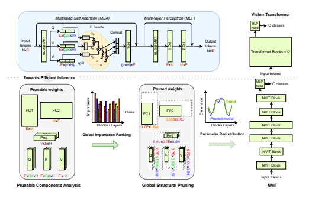
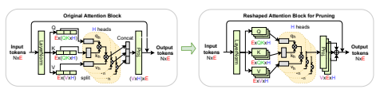
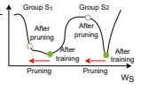
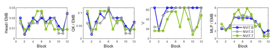

# Global Vision Transformer Pruning With Hessian-Aware Saliency

Huanrui Yang1,2*, Hongxu Yin1, Maying Shen1, Pavlo Molchanov1, Hai Li3, and Jan Kautz1 1NVIDIA, 2University of California, Berkeley, 3Duke University huanrui@berkeley.edu, {dannyy, mshen, pmolchanov, jkautz}@nvidia.com, hai.li@duke.edu

## Abstract

Transformers yield state-of-the-art results across many tasks. However, their heuristically designed architecture impose huge computational costs during inference. This work aims on challenging the common design philosophy of the Vision Transformer (ViT) model with uniform dimension across all the stacked blocks in a model stage, where we redistribute the parameters both across transformer blocks and between different structures within the block via the first systematic attempt on **global** structural pruning. Dealing with diverse ViT structural components, we derive a novel Hessian-based structural pruning criteria comparable across all layers and structures, with latency-aware regularization for direct latency reduction. Performing iterative pruning on the DeiT-Base model leads to a new architecture family called NViT (Novel ViT), with a novel parameter redistribution that utilizes parameters more efficiently. On ImageNet-1K, NViT-Base achieves a 2.6× *FLOPs reduction,* 5.1× parameter reduction, and 1.9× *run-time speedup over* the DeiT-Base model in a near lossless manner. Smaller NViT variants achieve more than 1% *accuracy gain at the* same throughput of the DeiT Small/Tiny variants, as well as a lossless 3.3× parameter reduction over the SWIN-Small model. These results outperform prior art by a large margin.

Further analysis is provided on the parameter redistribution insight of NViT, where we show the **high prunability** of ViT
models, **distinct sensitivity** within ViT block, and **unique**
parameter distribution trend across stacked ViT blocks. Our insights provide viability for a simple yet effective parameter redistribution rule towards more efficient ViTs for off-theshelf performance boost.

## 1. Introduction

Transformer models demonstrate high model capacity, easy scalability, and superior ability in capturing long-range dependency [1, 9, 19, 30, 38]. Vision Transformer, *i.e.*, the ViT [12], shows that embedding image patches into tokens and passing them through a sequence of transformer blocks can lead to higher accuracy compared to state-of-the-art CNNs. DeiT [35] further presents a data-efficient training method such that acceptable accuracy can be achieved without extensive pretraining. Offering competitive performance to CNNs under similar training regimes, transformers now point to the appealing perspective of solving both NLP and vision tasks with the same architecture [18, 20, 49].

Unlike CNNs built with convolutional layers that contain few dimensions like the kernel size and the number of filters, the ViT has multiple distinct components, *i.e.*,
QKV projection, multi-head attention, multi-layer perceptron, etc. [38], each defined by independent dimensions. As a result, the dimension of each component in each ViT block needs to be carefully designed to achieve a decent trade-off between efficiency and accuracy. However, this is typically not the case for state-of-the-art models. Models such as ViT [12] and DeiT [35] mainly inherit the design heuristics from NLP tasks, e.g., use MLP expansion ratio 4, fix QKV
per head, *all the blocks having the same dimensions*, etc.,
which may not be optimal for computer vision [4], causing significant redundancy in the base model and a worse efficiency-accuracy trade-off upon scaling, as extensively shown empirically. New developments in ViT architectures incorporate additional design tricks like multi-stage architecture [41], more complicated attention schemes [23], and additional convolutional layers [13] etc., yet no attempt has been made on understanding the potential of redistributing parameters within the stacked vision transformer blocks.

This work targets efficient ViTs by exploring parameter redistribution within ViT blocks and across multiple layers of cascading ViT blocks. To this end, we start with the straightforward DeiT design space, with only ViT blocks. We analyze the importance and redundancy of different components in the DeiT model via latency-aware global structural pruning, leveraging the insights to redistribute parameters for enhanced accuracy-efficiency trade-off. Our approach, as visualized in Fig. 1, starts from analyzing the blocks in the computation graph of ViT to identify all the dimensions that can be independently controlled. We apply global structural pruning over all the components in all blocks. This offers complete flexibility to explore their combinations towards

 

an optimal architecture in a complicated design space. Performing global pruning on ViT is significantly challenging, given the diverse structural components and significant magnitude differences. Previous methods only attempts on percomponent pruning with the same pruning ratio [5], which cannot lead to parameter redistribution across components and blocks. We derive a new importance score based on the Hessian matrix norm of the loss for global structural pruning, for the first time offering comparability among all prunable components. Furthermore, we incorporate the estimated latency reduction into the importance score. This guides the final pruned architecture to be faster on target devices.

The iterative structural pruning of the DeiT-Base model enables a family of efficient ViT models: NViT. On the ImageNet-1K benchmark [33], NViT enables a nearly lossless 5.14× parameter reduction, 2.57× FLOPs reduction and 1.86× speed up on V100 GPU over the DeiT-Base model. An 1% and 1.7% accuracy gain is observed over DeiT-Small and DeiT-Tiny models when we scale down the NViT to a similar latency. NViT achieves a further 1.8×
FLOPs reduction and an 1.5× speedup over NAS-based AutoFormer [4] (ICCV'21) and the SOTA structural pruning method S2ViTE [5] (NeurIPS'21).The efficiency and performance benefit of NViT trained on ImageNet also transfers to downstream classification and segmentation tasks.

Using structural pruning for architectural guidance, we further make an important observation that the popular uniform distribution of parameters across all layers is, in fact, not optimal. To this end, we present further empirical and theoretical analysis on the new parameter distribution rule of efficient ViT architectures, which provides a new angle on understanding the learning dynamic of vision transformer model. We believe our findings would inspire future design of efficient ViT architectures.

Our main contributions are as follows:

- Propose NViT, a novel hardware-friendly *global structural pruning* algorithm enabled by a *latency-aware*,
Hessian-based importance-based criteria and tailored towards the ViT architecture, achieving a nearly lossless 1.9× speedup, significantly outperforms SOTA ViT
compression methods and efficient ViT designs;
- Provide a systematic analysis on the prunable components in the ViT model. We perform structural pruning on the embedding dimension, number of heads, MLP
hidden dimension, QK dimension and V dimension of each head separately;

- Explore hardware-friendly parameter redistribution of ViT, finding **high prunability** of ViT models, **distinct**
sensitivity within ViT block, and **unique parameter**
distribution trend across stacked ViT blocks.

## 2. Related Work 2.1. Vision Transformer Models

Inspired by the success of transformer models in NLP
tasks, recent research proposes to use them on computer vision tasks. The inspiring vision transformer (ViT) [12]
demonstrates the possibility of performing high-accuracy image classification with transformer architecture only. This stimulates recent works to improve training and efficiency of the ViT model. One noticeable approach DeiT [35] provides carefully designed training schemes and data augmentations to train ViT from scratch on ImageNet only. Another line of work renovates ViT transformer blocks to better capture image features, such as changing input tokenization [14,48], using hierarchical architecture [14,23,41], upgrading positional encoding [7], and performing localized attention [15, 23].

In this work we focus on the original ViT architecture [12]
amid its straightforward design space, as illustrated in the top of Fig. 1. ViT model first divides the input image into patches that are tokenized to embedding dimension E through a linear projection. Image tokens, together with an independently initialized *class token*, form an input x ∈ R
N×E. Input tokens pass through transformer blocks before classification is made from the class token output of the last block.

A ViT block includes a multi-head self attention (MSA)
and a multi-layer perceptron (MLP) module. The MSA
module first linearly transforms the N × E tokens into queries q ∈ R
N×(QK×H), keys k ∈ R
N×(QK×H), and values v ∈ R
N×(V ×H). The q, k and v are then split into H heads. Each head performs the self-attention operation Attn(qh, kh, vh) = softmax qhk T
√ h dh vh in parallel.

The output of all the heads are then concatenated prior to a fully-connected (FC) linear projection back to the original dimension of R
N×E. Note that though previous works set QK = V in designing the model architecture [4, 12, 35],
setting them differently will not go against the shape rule of matrix multiplication. The MLP module includes two FC
layers with a hidden dimension of M. The output of the last FC layer preserves token dimension at R
N×E.

Built upon the original ViT, DeiT models [35] further exploit a *distillation token*, which learns from the output label of a CNN teacher during the training process to incorporate some inductive bias of the CNN model, and significantly improves the DeiT accuracy. Our work uses the DeiT model architecture as a starting point, where we explore the potential of better distributing dimensions of different blocks for enhanced efficiency-accuracy tradeoff.

## 2.2. Efficient Vit Models

To improve model efficiency, very recent works perform structural pruning on vision transformer models, with trainable gate variables [53] or Taylor importance score [5]. Both methods show the potential of compressing ViT models, yet only consider part of the prunable architecture, use *uniform* sparsity for all components, and do not take run time latency into account, thus may not lead to optimal compressed models and cannot discover potential parameter redistribution.

Our method resolves these issues through a latency-aware global structural pruning of all prunable components across all layers in a jointly manner.

Besides pruning, multiple attempts have been made in designing efficient ViT architectures. Notable methods include adding convolutional layers [13, 44], using multiple ViT stages with different feature scales [3, 6, 41, 52], and explore novel attention mechanisms [15, 16, 23, 48]. Yet all these work use the same dimension for all transformer blocks in each stage, whereas our work explores the parameter redistribution among cascading transformer blocks to achieve better efficiency-accuracy tradeoff without additional tricks.

The closest attempt to our our work is AutoFormer [4], uses a neural architecture search (NAS) approach to search for parameter redistribution of ViT models. Due to the constraint on the supernet training cost, AutoFormer only explores a small number of dimension choices; while our method continuously explores the entire design space of ViT model with a single iterative pruning process, leading to the finding of more efficient architectures.

Another orthogonal yet relevant line of work explores accelerated ViT inference with token pruning [22,32]. Token pruning reduces model FLOPs by halting tokens at early stages without altering the network; while our work removes structural components from weights to reach a smaller *static* architecture. Both ideas are complimentary and we will explore joint pruning in future work.

## 3. Latency-Aware Global Structural Pruning 3.1. Prunable Structures With Head Alignment

To explore the full space of parameter redistribution, we focus on all the independent structures in ViT, namely:
- The embedding dimension, denoted as EMB;

- The number of heads in MSA, denoted as H;
- The output dimension of Q and K projection per head in MSA, denoted as QK;
- The output dimension of V projection and input dimension of the PROJ per head, denoted as V;
- The hidden dimension of MLP, denoted as MLP.

Note that this is slightly different from the dimensions we showed in Sec. 2.1. As highlighted on the left of Fig. 2, in a typical ViT implementation, the QKV projection output dimensions are a concatenation of all the attention heads [43],
effectively QK × H or V × H. The projected tokens are then split into H heads to allow the computation of MSA in parallel. If we directly prune this concatenated dimension, then there is no control on the remaining QK and V dimension of each head. Therefore, the latency of the entire MSA
will be bounded by the head with the largest dimension.

To alleviate such inconsistency between pruned head dimensions, we propose *head alignment*, which explicitly control the number of heads and align the QK and V dimension remaining in each head. As illustrated on the right of Fig. 2, for model pruning we reshape the weight of Q, K, V and PROJ projection layers to single out the head dimension H.

Performing structural pruning on the reshaped block along the H dimension will enable the removal of an entire head, while pruning along the QK/V dimension guarantees the remained QK and V dimension of all the heads are the same.

This reshaping is only applied during the pruning process, while the final pruned model is converted back to the concatenated scheme. Note that H, QK, V and MLP in different blocks can be independently pruned; while EMB needs to be identical across the blocks due to the shortcut connections.

A comparison of pruning with or without head alignment is provided in Appendix B.3, where we demonstrate head alignment can bring up to 0.3% accuracy gain under the same latency target.

## 3.2. Structural Pruning Algorithm 3.2.1 Hessian-Based Group Importance Ranking

Inspired by recent research on the loss surface geometry of deep neural networks, here we consider the Hessian matrix of the loss function with respect to the group of parameters to be pruned to determine our pruning criteria. Specifically, we consider the matrix norm, the squared sum of Hessian eigenvalue, as the criteria for determining the importance of the group of parameters. Previous research [29, 45, 47]
has concluded that a smaller Hessian norm indicates a flatter loss surface, which leads to a smaller loss difference when the group is perturbed, i.e. pruned, as in Fig. 3.

Figure 3. **Loss of pruning different structural groups.** Group S1 with smaller Hessian norm lives in flatter loss minima, leading to lower loss increase after pruning.

To unify the analysis of structural groups belonging to different components with different shapes and value ranges, we assign a gate variable gS to each structural group S of weight, so that the model weight W is reparameterized as W = gSWS , where WS denotes all weight elements in the structural group S. We set all gates to 1 before pruning so that the reparameterized model is equivalent to the original one. The structural pruning process then aims to find the gates with the smallest Hessian norm, so that we can alter them to 0 to fulfill pruning with minimal loss.

Formally, consider a model whose loss is L(D, gSWS )
on dataset D, the Hessian matrix with respect to the gate variables is defined as Hi,j =∂
2L
∂gSi
∂gSj
, where Si and Sj are different structural groups. However, a ViT model typically contains tens of thousands of structural groups under our structural pruning configuration, making it infeasible to compute H directly. Luckily, here we only need the norm of eigenvalues, i.e. Pi λ 2 i
, for our pruning criteria, which can be computed via a Hessian-vector multiplication [29]:

$$\sum_{i}\lambda_{i}^{2}=\mathbb{E}_{z}||\mathcal{H}z||^{2},z\sim\mathcal{N}(0,I).$$
$$(1)$$

With can be further approximated with a finite difference approximation of the Hessian

 \label {equ:approx} \mathcal {H} z \approx (\nabla _{g_{\mathcal {S}}} \mathcal {L}(g_{\mathcal {S}}+hz) - \nabla _{g_{\mathcal {S}}} \mathcal {L}(g_{\mathcal {S}}))/h, (2)
where h is a small positive constant. This leads to our pruning criteria IS as:

 \label {equ:HesFinal} \mathcal {I}_{\mathcal {S}} := \mathbb {E}_z ||(\nabla _{g_{\mathcal {S}}} \mathcal {L}(g_{\mathcal {S}}+hz) - \nabla _{g_{\mathcal {S}}} \mathcal {L}(g_{\mathcal {S}}))/h||^2, z\sim \mathcal {N}(0,1).  (3)
Note that here z follows an univariate normal distribution since gS is a binary number.

The computation of Eq. (3) is now feasible for all the groups. However, computing the gradient of the gate variable for each group individually is still costly. To efficiently calculate the pruning criteria we simplify Eq. (3) by further deriving the two gradient terms. Here we derive the second term first since it is simpler. Using the fact W = gSWS and the chain rule we have:

 \begin {split} \label {equ:grad2} \nabla _{g_{\mathcal {S}}} \mathcal {L}(g_{\mathcal {S}}) &= \frac {\partial \mathcal {L}}{\partial \mathbf {W}} \frac {\partial \mathbf {W}}{\partial g_{\mathcal {S}}} = (\nabla _{W_{\mathcal {S}}} \mathcal {L}(W_{\mathcal {S}}))^T W_{\mathcal {S}} \\ &= \sum _{s\in \mathcal {S}} \nabla _{w_s} \mathcal {L}(w_s)\ w_s. \end {split}  (4)
For the first term, note that by definition gS = 1, so gS + hz is equivalent to (1 + hz)gS . In this way we can derive the first term using the result we have in Eq. (4) as:

 \begin {split} \label {equ:grad1} \nabla _{g_{\mathcal {S}}} \mathcal {L}(g_{\mathcal {S}}+hz) &= \frac {\partial \mathcal {L}}{\partial \mathbf {(1+hz)g_{\mathcal {S}}}} \frac {\partial \mathbf {(1+hz)g_{\mathcal {S}}}}{\partial g_{\mathcal {S}}} \\ &= (1+hz) \sum _{s\in \mathcal {S}} \nabla _{w_s} \mathcal {L}(w_s)\ w_s. \end {split}  (5)
Substituting Eq. (4) and Eq. (5) into Eq. (3) leads to a simplified importance score:

$$\mathcal{I}_{S}(\mathbf{W})=\mathbb{E}_{z}||hz\sum_{s\in\mathcal{S}}\nabla_{w_{s}}\mathcal{L}(w_{s})\ w_{s}/h||^{2}$$ $$=\left(\sum_{s\in\mathcal{S}}\mathcal{L}^{\prime}(w_{s})\ w_{s}\right)^{2}\mathbb{E}_{z}z^{2}\tag{6}$$ $$=\left(\sum_{s\in\mathcal{S}}\mathcal{L}^{\prime}(w_{s})\ w_{s}\right)^{2},$$

where L
′(ws) = ∇wsL(ws). Since the gradients with respect to all weight elements are already available from backpropagation, the importance score in Eq. (6) can be easily calculated during the finetuning process without additional cost. We then greedily remove a few structural groups at a time in our pruning process based on their importance scores, until the targeted constraint is achieved.

Interestingly, the resulted importance score is similar to the Taylor-based pruning criteria used in CNN filter pruning [2, 10, 28, 46]. Previous work used heuristics to expand the Taylor-based criteria from single parameter importance to structural groups, while we directly derive the structural pruning metric from a novel Hessian-based perspective. The Hessian-based importance score can be compared among all layers of weight as a global pruning criteria as it reflects the sensitivity of the structural group to the loss value. Previous pruning methods also considers magnitude-based pruning, which prunes away the group with the lowest weight magnitude. However, we find that magnitude cannot be applied as a global pruning criteria for ViT pruning, as it will make most of the structural components either unpruned or all pruned away. We provide detailed comparison on the effectiveness of our Hessian-based score vs. magnitude-based score for ViT pruning in Appendix B.4. We also show the strong correlation between our hessian importance score and real loss difference induced by pruning in Appendix B.5.

## 3.2.2 Latency-Aware Regularization

Pruning can be tailored towards latency reduction by penalizing the importance score with latency-aware regularization:
Lat(·) denotes the latency of the current model, which is characterized by a lookup table given the current EMB, H, QK, V,
and MLP dimension of each block in the pruned model. Details of the lookup table are provided in Appendix A.3, where we show a small lookup table can achieve accurate latency estimation throughout the pruning process. Latency-aware regularization helps the pruned model to reach the latency target faster with higher accuracy, as shown in Appendix B.6.

We use I
L
S
as the pruning criteria for iterative pruning in our work, with detailed procedure in Appendix A.2. A compact and dense model can be achieved by removing pruned groups and recompiling the model.

## 3.2.3 Ampere (2:4) Gpu Sparsity

The recently introduced NVIDIA Ampere GPU supports acceleration of sparse matrix multiplication with a specific pattern of 2:4 sparsity (2 of the 4 consecutive weight elements are zero). This comes with a limitation of requiring the input and output dimensions of all linear projections to be divisible by 16 [27]. We assure compatibility with such pattern by structurally pruning matrices to have the remaining dimension be divisible by 16 (more details in Appendix A.2).

Interestingly, we find that Ampere sparsity can be performed losslessly with magnitude pruning after the initial pruning.

## 3.3. Training Objective

We next consider the training objective function that supports both pruning for importance ranking and finetuning for weight update. To start with, we inherit the CNN hard distillation training objective as proposed in DeiT [35], which is formulated as follows:

$${\cal L}_{\rm CNN}={\cal L}_{\rm CE}\Big{(}\Psi(z_{c}^{s}),Y\Big{)}+{\cal L}_{\rm CE}\Big{(}\Psi(z_{d}^{s}),Y^{\rm CNN}\Big{)},\tag{8}$$

where Ψ(·) denotes softmax and LCE the cross entropy loss.

We refer to logits computed from the *class token* of the pruned model as z s c
, and the one computed from the *distillation token* as z s d
. Note that z s c is supervised by the true label Y , while z s d is supervised by the output label of a CNN
teacher Y
CNN. Unless otherwise stated, we use a pretrained RegNetY-16GF model [31] as the teacher, in line with DeiT.

In addition to CNN distillation, we consider full model distillation given the unique access to such supervision under the pruning setup. Specifically, the "full model" corresponds to the pretrained model, which serves as the starting point of the pruning process. Ideally a pruned model shall behave similar to its original counterpart. To encourage this, we distill the classification logits from both the class and distillation tokens of the pruned model from the original counterpart, forming Eq. (9):

$$\mathcal{L}_{\rm full}=\mathcal{L}_{\rm KL}\Big{(}\Psi(z_{c}^{s}/\tau),\Psi(z_{c}^{t}/\tau)\Big{)}+\mathcal{L}_{\rm KL}\Big{(}\Psi(z_{d}^{s}/\tau),\Psi(z_{d}^{t}/\tau)\Big{)}.\tag{9}$$
$${\mathcal{I}}_{{\mathcal{S}}}^{L}(\mathbf{W})={\mathcal{I}}_{{\mathcal{S}}}(\mathbf{W})-\eta{\Big(}\mathrm{Lat}(\mathbf{W})-\mathrm{Lat}(\mathbf{W}\backslash{\mathcal{S}}){\Big)}.\quad(7)$$

Superscripts tand s denote the output of the pretrained model and the model being pruned respectively. LKL is the KL
divergence loss, and τ is the distillation temperature.

The final objective is therefore composed as: L = αLfull+
LCNN. An ablation study of alternating the formulation of the training objective is provided in Appendix B.1.

## 4. Nvit Performance 4.1. Pruning Analysis On Imagenet-1K

We apply our pruning method on the challenging ImageNet-1K benchmark, using the DeiT-Base model pretrained with CNN distillation as the starting point to achieve a family of NViT models. The training and finetuning hyperparameters can be found in Appendix A.1.

Comparing with existing models. We compare the model size, run time speedup and accuracy of the stateof-the-art manually designed ViT models and our pruned models in Table 1. For best insights, we conduct pruning in four configurations. Note that all these 4 configuration are achieved from the same pretrained DeiT-Base model in a single global pruning run, each finetuned from a checkpoint snapshot after different pruning steps. Details for our pruning configurations can be found in Appendix A.2.

- **NViT-B** aims to match the accuracy of DeiT-B model, which achieves an 1.86× speedup and a 2.57× reduction on FLOPs over DeiT-B with neglectable 0.07% accuracy drop. It also achieves a lossless 2.25× further FLOPs reduction over the more efficient SWIN-B model.

- **NViT-H** aims to half the latency of DeiT-B, with only 0.4%
accuracy loss. It also achieves 1.41× further reduction on FLOPs over SWIN-S with similar accuracy.

- **NViT-S** matches DeiT-S latency, with +1% accuracy.

- **NViT-T** matches DeiT-T latency, with +1.7% accuracy.
Furthermore, the superiority of NViT over DeiT and SWIN **cannot be bridged** even after we finetune the pretrained models. For example, finetuning the pretrained DeiTT, DeiT-S, and SWIN-T models for additional 300 epochs following the scheme of NViT finetuning will improve the accuracy to 75.0%, 81.8%, and 81.7% respectively, which are still below what achieved by the corresponding NViT
models. The lossless 1.9x model acceleration for DeiT-B
with the NViT-B configuration has never been achieved from previous designs.

Comparing with SOTA compression methods. We compare NViT with state-of-the-art ViT compression methods, AutoFormer [4] in ICCV'21, S2ViTE [5] in NeurIPS'21, EViT [22] in ICLR'22, and SPViT [17] in Table 2. For a fair comparison for all methods we report the accuracy trained with CNN hard distillation. As no such accuracy is available Table 1. **Structural pruning results on ImageNet-1K.** Our NViT
models are compared with manually designed ViT architectures.

All compression ratios and speedups are computed with respect to that of DEIT-Base model. All Latency estimated on a single GPU with batch size 256. "ASP" means post-training 2:4 Ampere sparsity pruning with TensorRT [27].

| Size (Compression)                    | Speedup (×)       |                                     |       |       |       |
|---------------------------------------|-------------------|-------------------------------------|-------|-------|-------|
| Model                                 | #Para (×)         | #FLOPs (×) V100 RTX 3080 Top-1 Acc. |       |       |       |
| DEIT-B                                | 86M (1.00)        | 17.6G (1.00) 1.00                   | 1.00  | 83.36 |       |
| SWIN-B 88M (0.99)                     | 15.4G (1.14) 0.95 | -                                   | 83.30 |       |       |
| NViT-B                                | 34M (2.57)        | 6.8G (2.57)                         | 1.86  | 1.75  | 83.29 |
| + ASP                                 | 17M (5.14)        | 6.8G (2.57)                         | 1.86  | 1.85  | 83.29 |
| SWIN-S                                | 50M (1.74)        | 8.7G (2.02)                         | 1.49  | -     | 83.00 |
| NViT-H 30M (2.84)                     | 6.2G (2.85)       | 2.01                                | 1.89  | 82.95 |       |
| + ASP                                 | 15M (5.68)        | 6.2G (2.85)                         | 2.01  | 1.99  | 82.95 |
| DEIT-S                                | 22M (3.94)        | 4.6G (3.82)                         | 2.44  | 2.27  | 81.20 |
| SWIN-T 29M (2.99)                     | 4.5G (3.91)       | 2.58                                | -     | 81.30 |       |
| NViT-S                                | 21M (4.18)        | 4.2G (4.24)                         | 2.52  | 2.35  | 82.19 |
| + ASP 10.5M (8.36) 4.2G (4.24)        | 2.52              | 2.47                                | 82.19 |       |       |
| DEIT-T 5.6M (15.28) 1.2G (14.01) 5.18 | 4.66              | 74.50                               |       |       |       |
| NViT-T 6.9M (12.47) 1.3G (13.55) 4.97 | 4.55              | 76.21                               |       |       |       |
| + ASP 3.5M (24.94) 1.3G (13.55) 4.97  | 4.66              | 76.21                               |       |       |       |

in the S2ViTE paper, we rerun the experiment with CNN
distillation following their official GitHub repo1.

- **Comparing to AutoFormer**: NViT-H achieves a further 1.5× speedup over AutoFormer-B with a higher accuracy; NViT-T outperforms AutoFormer-T by 0.5% under similar size and lower latency.

- Comparing to S2**ViTE**: NViT-H achieves a further 1.9×
FLOPs reduction and 1.5× speedup over the 40%-pruned model, with a higher accuracy.

- **Comparing to EViT**: NViT-S achieves a further 2.8×
FLOPs reduction and 1.6× speedup over the pruned Base model, with a higher accuracy.
Moreover, the lossless 1.9× speedup of NViT-B over DeiT-B
is a big leap over all previous methods.

Comparing with concurrent ViT variants. NViT provides a viable way to discover efficient architecture with parameter redistribution in the DeiT design space, without using additional components like more layers, specially designed attention, or multi-stage architecture. Here we compare NViT with concurrent ViT architectures in Tab. 3. NViT
models achieve stronger performance than these architectures while only exploring the basic DeiT design space.

Pruning other ViT variants. We try NViT on pruning the SWIN transformer model. Note that SWIN transformer doesn't bring additional structural components comparing to ViT, as the novel shift-window attention mechanism is parameter-free. In this case our method can be applied on a single stage in SWIN-Transformer directly without any 1https://github.com/VITA-Group/SViTE
Table 2. **Comparing with SOTA ViT efficiency improvement**
methods. S
2ViTE and EViT speedups are taken from their papers, while AutoFormer speedup is measured with the same code base as NViT on a RTX 3080 GPU. All speedups are computed with respect to that of DeiT-Base model.

| Model            | #FLOPs Speedup   | Top-1 Acc.   |       |
|------------------|------------------|--------------|-------|
| NViT-B           | 6.8G             | 1.85×        | 83.29 |
| S 2ViTE-B-40 [5] | 11.7G            | 1.33×        | 82.92 |
| AutoFormer-B [4] | 11G              | 1.34×        | 82.90 |
| SPViT [17]       | 8.4G             | -            | 82.40 |
| NViT-H           | 6.2G             | 1.99×        | 82.95 |
| EViT-DeiT-B [22] | 11.6G            | 1.59×        | 82.10 |
| NViT-S           | 4.2G             | 2.47×        | 82.19 |
| AutoFormer-T [4] | 1.3G             | 4.59×        | 75.70 |
| NViT-T           | 1.3G             | 4.66×        | 76.21 |

Table 3. **Comparing with concurrent ViT architectures.** Accuracy with or w/o CNN distillation are reported when available.

Model \#Para \#FLOPs Acc. (no dis) Acc. (dis)

ConViT-S+ [13] 48M 10G 82.2 82.9

CaiT-S-24 [36] 46.9M 9.4G 82.7 83.5

CaiT-XS-36 [36] 38.6M 8.1G 82.6 82.9

NViT-B 34M 6.8G 82.8 **83.3**

T2T-ViT-14 [48] 21.5M 6.1G 81.7 -

CaiT-XS-24 [36] 26.6M 5.4G 81.8 82.0

As-ViT-S [6] 29.0M 5.3G 81.2 -

TNT-S [15] 23.8M 5.2G 81.5 -

CvT-13 [44] 20M 4.5G 81.6 -

GLiT-S [3] 24.6M 4.4G 80.5 -

PVT-S [41] 24.5M 3.8G 79.8 -

NViT-S 21M 4.2G 82.0 **82.2**

modification. Here we prune stage 2 of the SWIN-B model, which consists of 18/24 of the transformer blocks, 65% of parameters, 75% of FLOPs and 70% of the overall latency.

NViT achieves a *lossless* Stage 2 compression of 1.8× parameter reduction, 1.8× FLOPs reduction and 1.7× runtime speedup on V100 GPU.This indicates that NViT is also applicable to other ViT variants.

## 4.2. Transfer Learning To Downstream Tasks

Finally, we evaluate the generalizability of our pruned NViT models. Here we finetune the ImageNet trained DeiT
and NViT models on CIFAR-10, CIFAR-100 [21], iNaturalist 2018 and 2019 [37] dataset. We further investigate the potential of transferring the achieved NViT models into backbones for tasks beyond classification, specifically, semantic segmentation. We evaluate the performance of DeiT/NViT
backbones on the Cityscape dataset [8] and the ADE20K
dataset [51]. The details of the datasets used for our transfer learning experiments and detailed experiment settings are provided in Appendix A.1.2. Results are provided in Tab. 4.

NViT models consistently outperform the DeiT models on all the tasks. These observations show that the efficiency demonstrated on ImageNet can be preserved on downstream Table 4. **Transfer learning tasks performance with ImageNet**
pretraining. We report the performance of finetuning the ImageNet trained models on other datasets. Top-1 accuracy is reported for classification tasks, while mIoU is reported for segmentation tasks tasks, even beyond classification.

| Structure     | Q      | K      | V      | Proj   | FC1    | FC2    |
|---------------|--------|--------|--------|--------|--------|--------|
| Hessian trace | 1.4e-6 | 1.6e-6 | 6.5e-6 | 6.4e-6 | 6.1e-6 | 4.6e-6 |
| Latency (s)   | 1.7e-4 | 1.4e-4 | 1.2e-5 |        |        |        |

| Model                                                        | CIFAR-10 CIFAR-100   | iNat-18   | iNat-19 Cityscape ADE20K   |        |        |        |
|--------------------------------------------------------------|----------------------|-----------|----------------------------|--------|--------|--------|
| DeiT-S                                                       | 98.52%               | 87.07%    | 66.79%                     | 74.22% | 71.89% | 40.15% |
| NViT-S                                                       | 98.78%               | 87.90%    | 69.10% 77.00% 73.22%       | 41.54% |        |        |
| DeiT-T                                                       | 97.93%               | 85.66%    | 62.41%                     | 72.08% | 66.65% | 34.38% |
| NViT-T                                                       | 98.31%               | 85.88%    | 64.78% 74.65% 67.09%       | 35.42% |        |        |
| Table 5. Average Hessian trace and latency (V100, batch size |                      |           |                            |        |        |        |

## 5. Exploring Parameter Redistribution 5.1. Trends Observed In Vit Pruning

As observed by [24], channel/filter pruning in CNN models can provide guidance on finding efficient network architectures, yet this has never been explored on ViT models.

Here we show *for the first time* that our pruning method can serve as an effective architecture search tool for ViT
models. We observe NViT models of different sizes follows consistent insights, as visualized in Fig. 4:

1. Number of heads, QK of each head and MLP scales linearly with the dimension of EMB; while V of each head can be largely kept the same; 2. *Reducing* dimensions related to the multi-head attention
(H, QK) while *increasing* MLP dimension may lead to more accurate model under similar latency.

3. The scaling factors of head, QK and MLP are *not uniform* among all blocks: dimension is larger in the blocks in the middle and smaller towards the two ends;
Compared to original ViT design, our insight shows, within each block, the need to scale QK separately from V, and more importantly to distribute different dimensions across different ViT blocks. Interestingly, these trends are not observed in NLP transformer compression [26, 40].

## 5.2. Understanding The Parameter Redistribution

Given the insights on the parameter redistribution trend, here we analyze its reason from the perspective of Hessian sensitivity analysis. Averaged Hessian trace of the training loss with respect to the model weights has been shown effective for analyzing the importance of different structural components in a DNN model [11, 47]. Here we compute the Figure 4. Model dimension comparison between NViT-B (blue), NViT-S (grey) and NViT-T model (green).

per-structure average Hessian trace of the DeiT-B model on ImageNet in Tab. 5. Average latency reduction in pruning each neuron is also provided. Comparing across different structures, we can see V/Proj appears more important than Q/K, showing the need to scale them separately (insight 1).

MLP layers also show higher importance than QK layers, while occupying less latency. This justifies redistributing parameters from QK to MLP layers for better latency-accuracy tradeoff (insight 2). Besides Hessian, Appendix C.1 observes the trend in the attention score diversity among all heads of each block, which reflects a similar less-more-less trend in redundancy appears in each block (insight 3).

## 5.3. Comparing To Cnn

As global structural pruning has been extensively studied on CNN, here we compare our insights achieved in NViT
with the results in SOTA CNN pruning research [28, 34]:

- **Prunability:** ViT appears to have *higher prunability* than CNN models. SOTA CNN pruning achieves lossless 2× FLOPs reduction and 1.6× speedup on ResNet models [34]. Whereas we achieve lossless 2.6× FLOPs reduction and 1.9× speedup on DeiT-B model;
- **Structure diversity:** Convolutional layers within a CNN block typically show comparable sensitivity [28].

Whereas different structural components within a ViT
block shows *distinct sensitivity* in pruning.

- **Sensitivity distribution:** Sensitivity is lower in the earlier layers of a CNN stage, then gradually increase towards the end [28]. Whereas we discovered a unique less-more-less distribution among stacked ViT blocks.
These comparisons show the different challenges and opportunities faced by efficient CNN and ViT designs. We hope our study can inspire future exploration on the different learning dynamics and architecture design rules between CNN and ViT architectures.

## 5.4. Design Novel Architecture With Redistribution

ViT parameter redistribution. To further illustrate the effectiveness on our insights on the redistribution of parameters, we follow our insights to design a new architecture we name *ReViT* (Redistributed ViT). We follow the trends in Fig. 4 and heuristically design a simplified rule in Tab. 6 Table 6. **ReViT block dimensions.** For comparison the dimensions of a DeiT block are also listed.

| Blocks   | H         | QK       | V   | MLP     |
|----------|-----------|----------|-----|---------|
| DeiT     | EMB/64    | 64       | 64  | EMB×4   |
| ReViT    | ϵ×EMB/100 | ϵ×EMB/20 | 64  | ϵ×EMB×3 |

to determine the parameter dimensions of each block. For a 12-layer vision transformer model, we use ϵ = 2 for block 4-9, and use ϵ = 1 for other blocks. H is rounded to the nearest even number, and QK rounded to the nearest number divisible by 8 to satisfy Ampere GPUs requirements.

Comparison with DeiT. To verify that our parameter redistribution is beneficial, we train all pairs of DeiT and ReViT models from scratch on the ImageNet-1K benchmark with the same objective and hyperparameters, as specified in Appendix A.1.3. As shown in Tab. 7, ReViT achieve higher accuracy than DeiT with similar FLOPs and lower latency. Specifically, ReViT-S and ReViT-T achieve a Top-1 accuracy gain of 0.21% and 1.36%, respectively, over their DeiT counterparts. We also show ReViT rule can work out of the box on SWIN models in Appendix C.2.

Table 7. **Comparing ReViT models with DeiT models.** All compression ratios and speedups are computed with respected to that of the DeiT-Base model. DeiT accuracy marked with *
indicates the train-from-scratch accuracy we achieve from the DeiT
GitHub repo2using default hyperparameters3. **All pairs of models**
are trained with the same hyperparameters

| Model                                 | EMB   | #Para (×)                 | #FLOPs (×) Speedup Accuracy   |         |         |
|---------------------------------------|-------|---------------------------|-------------------------------|---------|---------|
| DeiT-S                                | 384   | 22M (3.94)                | 4.6G (3.82)                   | 2.29×   | 81.01%* |
| ReViT-S                               | 384   | 23M (3.82)                | 4.7G (3.75)                   | 2.31×   | 81.22%  |
| DeiT-T                                | 192   | 5.6M (15.28) 1.2G (14.01) | 4.39×                         | 72.84%* |         |
| ReViT-T 176 5.9M (14.64) 1.3G (13.69) | 4.75× | 74.20%                    |                               |         |         |

## 6. Conclusions

This work proposes a latency-aware global pruning framework that provides significant lossless compression on DeiTBase model, facilitating the finding of parameter redistribution for better efficiency-accuracy tradeoff in vision transformers. We hope this work opens up a new way to better understand the contribution of different components in the ViT architecture, and inspires more efficient ViT models.

2https://github.com/facebookresearch/deit.

3As in Table 9 of [35].

## References

[1] Tom B Brown, Benjamin Mann, Nick Ryder, Melanie Subbiah, Jared Kaplan, Prafulla Dhariwal, Arvind Neelakantan, Pranav Shyam, Girish Sastry, Amanda Askell, et al.

Language models are few-shot learners. arXiv preprint arXiv:2005.14165, 2020. 1
[2] Akshay Chawla, Hongxu Yin, Pavlo Molchanov, and Jose Alvarez. Data-free knowledge distillation for object detection. In *Proceedings of the IEEE/CVF Winter Conference on* Applications of Computer Vision, pages 3289–3298, 2021. 5
[3] Boyu Chen, Peixia Li, Chuming Li, Baopu Li, Lei Bai, Chen Lin, Ming Sun, Junjie Yan, and Wanli Ouyang. Glit: Neural architecture search for global and local image transformer. In Proceedings of the IEEE/CVF International Conference on Computer Vision, pages 12–21, 2021. 3, 7
[4] Minghao Chen, Houwen Peng, Jianlong Fu, and Haibin Ling.

Autoformer: Searching transformers for visual recognition.

arXiv preprint arXiv:2107.00651, 2021. 1, 2, 3, 6, 7
[5] Tianlong Chen, Yu Cheng, Zhe Gan, Lu Yuan, Lei Zhang, and Zhangyang Wang. Chasing sparsity in vision transformers:
An end-to-end exploration. *arXiv preprint arXiv:2106.04533*,
2021. 2, 3, 6, 7
[6] Wuyang Chen, Wei Huang, Xianzhi Du, Xiaodan Song, Zhangyang Wang, and Denny Zhou. Auto-scaling vision transformers without training. *arXiv preprint* arXiv:2202.11921, 2022. 3, 7
[7] Xiangxiang Chu, Zhi Tian, Bo Zhang, Xinlong Wang, Xiaolin Wei, Huaxia Xia, and Chunhua Shen. Conditional positional encodings for vision transformers. arXiv preprint arXiv:2102.10882, 2021. 3
[8] Marius Cordts, Mohamed Omran, Sebastian Ramos, Timo Rehfeld, Markus Enzweiler, Rodrigo Benenson, Uwe Franke, Stefan Roth, and Bernt Schiele. The cityscapes dataset for semantic urban scene understanding. In *Proc. of the IEEE Conference on Computer Vision and Pattern Recognition (CVPR)*,
2016. 7, 12
[9] Jacob Devlin, Ming-Wei Chang, Kenton Lee, and Kristina Toutanova. Bert: Pre-training of deep bidirectional transformers for language understanding. *arXiv preprint* arXiv:1810.04805, 2018. 1
[10] Xiaohan Ding, Guiguang Ding, Xiangxin Zhou, Yuchen Guo, Jungong Han, and Ji Liu. Global sparse momentum sgd for pruning very deep neural networks. arXiv preprint arXiv:1909.12778, 2019. 5
[11] Zhen Dong, Zhewei Yao, Amir Gholami, Michael W Mahoney, and Kurt Keutzer. Hawq: Hessian aware quantization of neural networks with mixed-precision. In *Proceedings* of the IEEE International Conference on Computer Vision, pages 293–302, 2019. 7
[12] Alexey Dosovitskiy, Lucas Beyer, Alexander Kolesnikov, Dirk Weissenborn, Xiaohua Zhai, Thomas Unterthiner, Mostafa Dehghani, Matthias Minderer, Georg Heigold, Sylvain Gelly, et al. An image is worth 16x16 words: Transformers for image recognition at scale. *arXiv preprint* arXiv:2010.11929, 2020. 1, 3
[13] Stéphane d'Ascoli, Hugo Touvron, Matthew L Leavitt, Ari S
Morcos, Giulio Biroli, and Levent Sagun. Convit: Improving vision transformers with soft convolutional inductive biases.

In *International Conference on Machine Learning*, pages 2286–2296. PMLR, 2021. 1, 3, 7
[14] Ben Graham, Alaaeldin El-Nouby, Hugo Touvron, Pierre Stock, Armand Joulin, Hervé Jégou, and Matthijs Douze.

Levit: a vision transformer in convnet's clothing for faster inference. *arXiv preprint arXiv:2104.01136*, 2021. 3
[15] Kai Han, An Xiao, Enhua Wu, Jianyuan Guo, Chunjing Xu, and Yunhe Wang. Transformer in transformer. *arXiv preprint* arXiv:2103.00112, 2021. 3, 7
[16] Ali Hatamizadeh, Hongxu Yin, Jan Kautz, and Pavlo Molchanov. Global context vision transformers. *arXiv* preprint arXiv:2206.09959, 2022. 3
[17] Haoyu He, Jing Liu, Zizheng Pan, Jianfei Cai, Jing Zhang, Dacheng Tao, and Bohan Zhuang. Pruning self-attentions into convolutional layers in single path. arXiv preprint arXiv:2111.11802, 2021. 6, 7
[18] Yifan Jiang, Shiyu Chang, and Zhangyang Wang. Transgan:
Two transformers can make one strong gan. *arXiv preprint* arXiv:2102.07074, 2021. 1
[19] Xiaoqi Jiao, Yichun Yin, Lifeng Shang, Xin Jiang, Xiao Chen, Linlin Li, Fang Wang, and Qun Liu. Tinybert: Distilling bert for natural language understanding. *arXiv preprint* arXiv:1909.10351, 2019. 1
[20] Wonjae Kim, Bokyung Son, and Ildoo Kim. Vilt: Vision-andlanguage transformer without convolution or region supervision. *arXiv preprint arXiv:2102.03334*, 2021. 1
[21] Alex Krizhevsky and Geoffrey Hinton. Learning multiple layers of features from tiny images. Technical report, Citeseer, 2009. 7, 12
[22] Youwei Liang, Chongjian GE, Zhan Tong, Yibing Song, Jue Wang, and Pengtao Xie. EVit: Expediting vision transformers via token reorganizations. In International Conference on Learning Representations, 2022. 3, 6, 7
[23] Ze Liu, Yutong Lin, Yue Cao, Han Hu, Yixuan Wei, Zheng Zhang, Stephen Lin, and Baining Guo. Swin transformer:
Hierarchical vision transformer using shifted windows. arXiv preprint arXiv:2103.14030, 2021. 1, 3
[24] Zhuang Liu, Mingjie Sun, Tinghui Zhou, Gao Huang, and Trevor Darrell. Rethinking the value of network pruning.

arXiv preprint arXiv:1810.05270, 2018. 7
[25] Jiachen Mao, Huanrui Yang, Ang Li, Hai Li, and Yiran Chen.

Tprune: Efficient transformer pruning for mobile devices.

ACM Transactions on Cyber-Physical Systems, 5(3):1–22, 2021. 16
[26] Paul Michel, Omer Levy, and Graham Neubig. Are sixteen heads really better than one? arXiv preprint arXiv:1905.10650, 2019. 7, 16
[27] Asit Mishra, Jorge Albericio Latorre, Jeff Pool, Darko Stosic, Dusan Stosic, Ganesh Venkatesh, Chong Yu, and Paulius Micikevicius. Accelerating sparse deep neural networks. *arXiv* preprint arXiv:2104.08378, 2021. 5, 6
[28] Pavlo Molchanov, Arun Mallya, Stephen Tyree, Iuri Frosio, and Jan Kautz. Importance estimation for neural network pruning. In *Proceedings of the IEEE/CVF Conference* on Computer Vision and Pattern Recognition, pages 11264–
11272, 2019. 5, 8
[29] Seyed-Mohsen Moosavi-Dezfooli, Alhussein Fawzi, Jonathan Uesato, and Pascal Frossard. Robustness via curvature regularization, and vice versa. In *Proceedings of the IEEE/CVF*
Conference on Computer Vision and Pattern Recognition, pages 9078–9086, 2019. 4
[30] Alec Radford, Karthik Narasimhan, Tim Salimans, and Ilya Sutskever. Improving language understanding by generative pre-training. 2018. 1
[31] Ilija Radosavovic, Raj Prateek Kosaraju, Ross Girshick, Kaiming He, and Piotr Dollár. Designing network design spaces.

In *Proceedings of the IEEE/CVF Conference on Computer* Vision and Pattern Recognition, pages 10428–10436, 2020. 5
[32] Yongming Rao, Wenliang Zhao, Benlin Liu, Jiwen Lu, Jie Zhou, and Cho-Jui Hsieh. Dynamicvit: Efficient vision transformers with dynamic token sparsification. In *Advances in* Neural Information Processing Systems (NeurIPS), 2021. 3
[33] Olga Russakovsky, Jia Deng, Hao Su, Jonathan Krause, Sanjeev Satheesh, Sean Ma, Zhiheng Huang, Andrej Karpathy, Aditya Khosla, Michael Bernstein, Alexander C. Berg, and Li Fei-Fei. ImageNet Large Scale Visual Recognition Challenge.

International Journal of Computer Vision (IJCV), 115(3):211–
252, 2015. 2
[34] Maying Shen, Hongxu Yin, Pavlo Molchanov, Lei Mao, Jianna Liu, and Jose M Alvarez. Halp: Hardware-aware latency pruning. *arXiv preprint arXiv:2110.10811*, 2021. 8
[35] Hugo Touvron, Matthieu Cord, Matthijs Douze, Francisco Massa, Alexandre Sablayrolles, and Hervé Jégou. Training data-efficient image transformers & distillation through attention. In *International Conference on Machine Learning*,
pages 10347–10357. PMLR, 2021. 1, 3, 5, 8, 12
[36] Hugo Touvron, Matthieu Cord, Alexandre Sablayrolles, Gabriel Synnaeve, and Hervé Jégou. Going deeper with image transformers. In *Proceedings of the IEEE/CVF International Conference on Computer Vision*, pages 32–42, 2021.

7
[37] Grant Van Horn, Oisin Mac Aodha, Yang Song, Yin Cui, Chen Sun, Alex Shepard, Hartwig Adam, Pietro Perona, and Serge Belongie. The inaturalist species classification and detection dataset. In Proceedings of the IEEE conference on computer vision and pattern recognition, pages 8769–8778, 2018. 7, 12
[38] Ashish Vaswani, Noam Shazeer, Niki Parmar, Jakob Uszkoreit, Llion Jones, Aidan N Gomez, Łukasz Kaiser, and Illia Polosukhin. Attention is all you need. In *Advances in neural* information processing systems, pages 5998–6008, 2017. 1
[39] Pauli Virtanen, Ralf Gommers, Travis E. Oliphant, Matt Haberland, Tyler Reddy, David Cournapeau, Evgeni Burovski, Pearu Peterson, Warren Weckesser, Jonathan Bright, Stéfan J. van der Walt, Matthew Brett, Joshua Wilson, K. Jarrod Millman, Nikolay Mayorov, Andrew R. J. Nelson, Eric Jones, Robert Kern, Eric Larson, C J Carey, ˙Ilhan Polat, Yu Feng, Eric W. Moore, Jake VanderPlas, Denis Laxalde, Josef Perktold, Robert Cimrman, Ian Henriksen, E. A. Quintero, Charles R. Harris, Anne M. Archibald, Antônio H. Ribeiro, Fabian Pedregosa, Paul van Mulbregt, and SciPy 1.0 Contributors. SciPy 1.0: Fundamental Algorithms for Scientific Computing in Python. *Nature Methods*, 17:261–272, 2020.

13
[40] Elena Voita, David Talbot, Fedor Moiseev, Rico Sennrich, and Ivan Titov. Analyzing multi-head self-attention: Specialized heads do the heavy lifting, the rest can be pruned. *arXiv* preprint arXiv:1905.09418, 2019. 7, 16
[41] Wenhai Wang, Enze Xie, Xiang Li, Deng-Ping Fan, Kaitao Song, Ding Liang, Tong Lu, Ping Luo, and Ling Shao. Pyramid vision transformer: A versatile backbone for dense prediction without convolutions. *arXiv preprint arXiv:2102.12122*,
2021. 1, 3, 7
[42] Alan Weiser and Sergio E Zarantonello. A note on piecewise linear and multilinear table interpolation in many dimensions.

Mathematics of Computation, 50(181):189–196, 1988. 13
[43] Ross Wightman. Pytorch image models. https :
/ / github . com / rwightman / pytorch - image -
models, 2019. 3
[44] Haiping Wu, Bin Xiao, Noel Codella, Mengchen Liu, Xiyang Dai, Lu Yuan, and Lei Zhang. Cvt: Introducing convolutions to vision transformers. In *Proceedings of the IEEE/CVF*
International Conference on Computer Vision, pages 22–31, 2021. 3, 7
[45] Huanrui Yang, Xiaoxuan Yang, Neil Zhenqiang Gong, and Yiran Chen. Hero: Hessian-enhanced robust optimization for unifying and improving generalization and quantization performance. *arXiv preprint arXiv:2111.11986*, 2021. 4
[46] Hongxu Yin, Pavlo Molchanov, Jose M Alvarez, Zhizhong Li, Arun Mallya, Derek Hoiem, Niraj K Jha, and Jan Kautz.

Dreaming to distill: Data-free knowledge transfer via deepinversion. In Proceedings of the IEEE/CVF Conference on Computer Vision and Pattern Recognition, pages 8715–8724, 2020. 5
[47] Shixing Yu, Zhewei Yao, Amir Gholami, Zhen Dong, Sehoon Kim, Michael W Mahoney, and Kurt Keutzer. Hessian-aware pruning and optimal neural implant. In *Proceedings of the* IEEE/CVF Winter Conference on Applications of Computer Vision, pages 3880–3891, 2022. 4, 7
[48] Li Yuan, Yunpeng Chen, Tao Wang, Weihao Yu, Yujun Shi, Zihang Jiang, Francis EH Tay, Jiashi Feng, and Shuicheng Yan. Tokens-to-token vit: Training vision transformers from scratch on imagenet. *arXiv preprint arXiv:2101.11986*, 2021.

3, 7
[49] Sixiao Zheng, Jiachen Lu, Hengshuang Zhao, Xiatian Zhu, Zekun Luo, Yabiao Wang, Yanwei Fu, Jianfeng Feng, Tao Xiang, Philip HS Torr, et al. Rethinking semantic segmentation from a sequence-to-sequence perspective with transformers.

In *Proceedings of the IEEE/CVF Conference on Computer* Vision and Pattern Recognition, pages 6881–6890, 2021. 1
[50] Sixiao Zheng, Jiachen Lu, Hengshuang Zhao, Xiatian Zhu, Zekun Luo, Yabiao Wang, Yanwei Fu, Jianfeng Feng, Tao Xiang, Philip H.S. Torr, and Li Zhang. Rethinking semantic segmentation from a sequence-to-sequence perspective with transformers. In *CVPR*, 2021. 12
[51] Bolei Zhou, Hang Zhao, Xavier Puig, Sanja Fidler, Adela Barriuso, and Antonio Torralba. Scene parsing through ade20k dataset. In Proceedings of the IEEE conference on computer vision and pattern recognition, pages 633–641, 2017. 7, 12
[52] Daquan Zhou, Bingyi Kang, Xiaojie Jin, Linjie Yang, Xiaochen Lian, Zihang Jiang, Qibin Hou, and Jiashi Feng.

Deepvit: Towards deeper vision transformer. arXiv preprint arXiv:2103.11886, 2021. 3
[53] Mingjian Zhu, Kai Han, Yehui Tang, and Yunhe Wang. Visual transformer pruning. *arXiv preprint arXiv:2104.08500*, 2021.

3